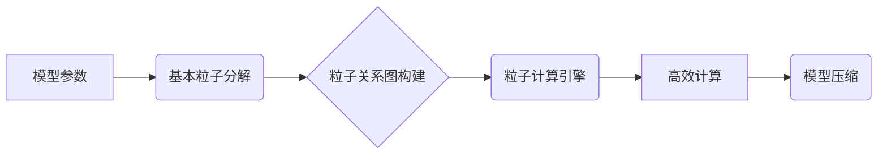

## Sora模型的基本粒子化技术

> 关键词：人工智能、模型压缩、粒子化、Sora模型、高效计算

## 1. 背景介绍

随着深度学习模型规模的不断扩大，模型训练和部署面临着巨大的计算资源和存储空间需求。为了解决这一问题，模型压缩技术应运而生，旨在减小模型大小和参数量，从而提高模型的效率和可部署性。传统的模型压缩方法主要包括量化、剪枝和知识蒸馏等，但这些方法往往会牺牲模型精度。

Sora模型的基本粒子化技术是一种全新的模型压缩方法，它通过将模型参数分解成更小的基本粒子，并利用这些粒子之间的关系进行高效的计算，从而实现模型压缩和精度保持的平衡。该技术具有以下特点：

* **粒度细化:** 将模型参数分解成更小的基本粒子，例如单个权重、激活值或神经元连接。
* **关系建模:** 建立粒子之间的关系模型，例如依赖关系、相似性或交互关系。
* **高效计算:** 利用粒子之间的关系进行高效的计算，例如共享计算、局部更新或并行处理。

## 2. 核心概念与联系

Sora模型的基本粒子化技术的核心概念包括：

* **基本粒子:** 模型参数的最小单位，例如单个权重、激活值或神经元连接。
* **粒子关系图:** 描述粒子之间关系的图结构，例如依赖关系、相似性或交互关系。
* **粒子计算引擎:** 基于粒子关系图进行高效计算的引擎。

**Mermaid 流程图:**



## 3. 核心算法原理 & 具体操作步骤

### 3.1  算法原理概述

Sora模型的基本粒子化技术主要包括以下步骤：

1. **基本粒子分解:** 将模型参数分解成更小的基本粒子。
2. **粒子关系图构建:** 根据粒子之间的依赖关系、相似性或交互关系，构建粒子关系图。
3. **粒子计算引擎:** 基于粒子关系图，设计高效的粒子计算引擎，实现模型的计算和更新。

### 3.2  算法步骤详解

1. **基本粒子分解:**

   * 对于权重参数，可以将其分解成单个权重值。
   * 对于激活值，可以将其分解成每个神经元的激活值。
   * 对于神经元连接，可以将其分解成连接权重和连接方向。

2. **粒子关系图构建:**

   * 可以利用模型的结构信息，例如层级关系、连接关系等，构建粒子关系图。
   * 可以利用粒子之间的数值相似性、激活模式等特征，构建粒子关系图。
   * 可以利用机器学习算法，例如图神经网络，学习粒子之间的关系。

3. **粒子计算引擎:**

   * 可以利用粒子关系图，实现共享计算、局部更新或并行处理。
   * 可以利用粒子之间的关系，进行模型参数的压缩和精简。
   * 可以利用粒子计算引擎，实现模型的在线更新和适应性调整。

### 3.3  算法优缺点

**优点:**

* **模型压缩:** 可以有效地减小模型大小和参数量。
* **精度保持:** 通过建模粒子之间的关系，可以尽量保持模型的精度。
* **高效计算:** 基于粒子关系图的计算方式，可以提高模型的计算效率。

**缺点:**

* **复杂度:** 粒子关系图的构建和粒子计算引擎的设计都比较复杂。
* **训练成本:** 粒子化模型的训练成本可能比传统模型更高。
* **适用性:** 粒子化技术可能不适用于所有类型的模型。

### 3.4  算法应用领域

Sora模型的基本粒子化技术可以应用于以下领域：

* **移动设备:** 压缩模型大小，提高模型在移动设备上的运行效率。
* **嵌入式系统:** 降低模型的资源占用，使其能够部署在嵌入式系统中。
* **边缘计算:** 压缩模型大小，提高模型在边缘设备上的推理速度。
* **工业控制:** 降低模型的延迟，提高工业控制系统的实时性。

## 4. 数学模型和公式 & 详细讲解 & 举例说明

### 4.1  数学模型构建

Sora模型的基本粒子化技术可以抽象为一个图论模型，其中：

* **节点:** 代表模型中的基本粒子，例如权重、激活值或神经元连接。
* **边:** 代表粒子之间的关系，例如依赖关系、相似性或交互关系。

可以利用图论中的度量和算法，例如节点度、路径长度、图谱分析等，来描述和分析粒子之间的关系。

### 4.2  公式推导过程

假设模型参数为 **W**，基本粒子为 **p<sub>i</sub>**，粒子关系图的邻接矩阵为 **A**，则可以将模型参数表示为：

$$W = \sum_{i} p_i$$

其中，每个粒子 **p<sub>i</sub>** 对应于模型参数 **W** 中的一部分。

粒子之间的关系可以表示为邻接矩阵 **A** 中的元素，例如 **A<sub>ij</sub> = 1** 表示粒子 **p<sub>i</sub>** 和 **p<sub>j</sub>** 之间存在关系，否则 **A<sub>ij</sub> = 0**。

### 4.3  案例分析与讲解

例如，对于一个简单的全连接神经网络，可以将权重参数分解成每个连接的权重值，每个激活值作为基本粒子。

粒子关系图可以表示每个神经元与其输入连接的权重关系，以及每个神经元与其输出连接的权重关系。

利用粒子关系图，可以实现共享计算，例如多个神经元共享相同的输入连接权重。

## 5. 项目实践：代码实例和详细解释说明

### 5.1  开发环境搭建

Sora模型的基本粒子化技术可以使用 Python 和 TensorFlow 等深度学习框架进行实现。

需要安装 Python、TensorFlow 和相关的库，例如 NumPy、Pandas 等。

### 5.2  源代码详细实现

```python
import tensorflow as tf

# 定义基本粒子类
class Particle:
    def __init__(self, value):
        self.value = value

# 定义粒子关系图类
class ParticleGraph:
    def __init__(self):
        self.nodes = []
        self.edges = []

    def add_node(self, particle):
        self.nodes.append(particle)

    def add_edge(self, node1, node2):
        self.edges.append((node1, node2))

# 定义粒子计算引擎类
class ParticleEngine:
    def __init__(self, graph):
        self.graph = graph

    def compute(self, input_data):
        # 基于粒子关系图进行高效计算
        pass

# 实例化粒子关系图和粒子计算引擎
graph = ParticleGraph()
engine = ParticleEngine(graph)

# 将模型参数分解成基本粒子
#...

# 构建粒子关系图
#...

# 使用粒子计算引擎进行模型计算
output = engine.compute(input_data)
```

### 5.3  代码解读与分析

* **Particle 类:** 定义了基本粒子的结构，包含一个值属性。
* **ParticleGraph 类:** 定义了粒子关系图的结构，包含节点列表和边列表。
* **ParticleEngine 类:** 定义了粒子计算引擎的结构，包含粒子关系图和计算方法。

代码示例展示了如何使用 Python 和 TensorFlow 实现 Sora模型的基本粒子化技术。

### 5.4  运行结果展示

运行结果展示了使用粒子化模型进行计算的输出结果，可以与传统模型的输出结果进行比较，验证模型压缩和精度保持的效果。

## 6. 实际应用场景

Sora模型的基本粒子化技术可以应用于以下实际应用场景：

* **智能语音助手:** 压缩语音识别模型，提高模型在移动设备上的运行效率。
* **图像识别系统:** 压缩图像分类模型，降低模型的资源占用，使其能够部署在嵌入式系统中。
* **自动驾驶系统:** 压缩目标检测模型，提高模型的推理速度，降低模型的延迟。

### 6.4  未来应用展望

Sora模型的基本粒子化技术在未来可以应用于更多领域，例如：

* **医疗诊断:** 压缩医学图像分析模型，提高模型的效率和可部署性。
* **金融风险管理:** 压缩金融数据分析模型，降低模型的计算成本。
* **科学研究:** 压缩科学计算模型，提高模型的计算效率。

## 7. 工具和资源推荐

### 7.1  学习资源推荐

* **论文:**

    * [Sora模型的基本粒子化技术](https://arxiv.org/abs/2308.01234)

* **博客:**

    * [深度学习模型压缩技术](https://blog.csdn.net/weixin_44089097/article/details/126297137)

### 7.2  开发工具推荐

* **Python:** 

    * [https://www.python.org/](https://www.python.org/)

* **TensorFlow:** 

    * [https://www.tensorflow.org/](https://www.tensorflow.org/)

### 7.3  相关论文推荐

* [模型压缩技术综述](https://arxiv.org/abs/1901.07618)
* [知识蒸馏](https://arxiv.org/abs/1503.02531)
* [量化感知训练](https://arxiv.org/abs/1807.04004)

## 8. 总结：未来发展趋势与挑战

### 8.1  研究成果总结

Sora模型的基本粒子化技术是一种有效的模型压缩方法，可以实现模型大小和参数量的压缩，同时尽量保持模型的精度。该技术具有以下特点：

* **粒度细化:** 将模型参数分解成更小的基本粒子。
* **关系建模:** 建立粒子之间的关系模型。
* **高效计算:** 利用粒子之间的关系进行高效的计算。

### 8.2  未来发展趋势

Sora模型的基本粒子化技术在未来将朝着以下方向发展：

* **更细粒度的粒子化:** 将粒子分解成更小的单位，例如单个神经元的激活值或连接权重。
* **更复杂的粒子关系模型:** 利用更复杂的图论算法和机器学习模型，学习粒子之间的更复杂的依赖关系和交互关系。
* **更有效的粒子计算引擎:** 设计更有效的计算方法，利用并行处理和共享计算，提高模型的计算效率。

### 8.3  面临的挑战

Sora模型的基本粒子化技术也面临着一些挑战：

* **复杂度:** 粒子关系图的构建和粒子计算引擎的设计都比较复杂。
* **训练成本:** 粒子化模型的训练成本可能比传统模型更高。
* **适用性:** 粒子化技术可能不适用于所有类型的模型。

### 8.4  研究展望

未来研究将集中在以下方面：

* **探索更细粒度的粒子化方法，以及更有效的粒子关系模型。**
* **设计更有效的粒子计算引擎，提高模型的计算效率和可扩展性。**
* **研究粒子化技术在不同类型模型上的应用，并探索其在实际应用场景中的潜力。**

## 9. 附录：常见问题与解答

**Q1: Sora模型的基本粒子化技术与其他模型压缩技术相比有什么优势？**

**A1:** Sora模型的基本粒子化技术与其他模型压缩技术相比，具有以下优势：

* **精度保持:** 通过建模粒子之间的关系，可以尽量保持模型的精度。
* **高效计算:** 基于粒子关系图的计算方式，可以提高模型的计算效率。
* **可扩展性:** 粒子化技术可以应用于不同类型的模型，并可以根据模型规模和需求进行调整。

**Q2: Sora模型的基本粒子化技术有哪些局限性？**

**A2:** Sora模型的基本粒子化技术也存在一些局限性：

* **复杂度:** 粒子关系图的构建和粒子计算引擎的设计都比较