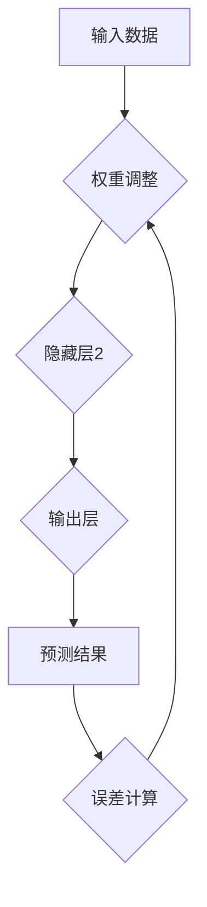

# 信息差：我知道的，你不知道

> 关键词：人工智能、深度学习、神经网络、算法、数据科学、机器学习、信息论

## 1. 背景介绍

在当今数据爆炸的时代，信息已成为最宝贵的资源。然而，并非所有信息都对每个人都具有同等价值。对于拥有特定知识和技能的人来说，他们能够从海量数据中提取有价值的信息，并将其转化为洞察力和行动力。而对于缺乏相关知识和技能的人来说，他们可能无法理解这些信息，甚至会误解其含义。这种信息获取和理解能力的差异，我们称之为“信息差”。

在人工智能领域，信息差尤为突出。深度学习算法的兴起，使得机器能够从海量数据中学习，并完成人类难以胜任的复杂任务。然而，深度学习算法的训练和应用需要大量的专业知识和技术能力。对于普通人来说，理解深度学习算法的原理、训练过程和应用场景，仍然是一个巨大的挑战。

## 2. 核心概念与联系

### 2.1 深度学习

深度学习是一种机器学习的子领域，它利用多层神经网络来模拟人类大脑的学习过程。神经网络由多个相互连接的节点组成，每个节点都执行简单的计算操作。通过训练这些神经网络，它们能够学习复杂的模式和关系，从而实现对数据的理解和预测。

### 2.2 神经网络

神经网络是深度学习的基础。它由输入层、隐藏层和输出层组成。输入层接收原始数据，隐藏层对数据进行处理和转换，输出层输出最终结果。隐藏层可以有多个，深度越大，网络的学习能力就越强。

### 2.3 算法原理

深度学习算法的核心是**反向传播算法**。该算法通过不断调整神经网络的权重，使得网络的输出与实际目标值之间的误差最小化。

**Mermaid 流程图**



## 3. 核心算法原理 & 具体操作步骤

### 3.1 算法原理概述

反向传播算法是一种迭代优化算法，它通过计算误差梯度来更新神经网络的权重。具体步骤如下：

1. **前向传播:** 将输入数据传递到神经网络，计算输出结果。
2. **误差计算:** 计算输出结果与实际目标值之间的误差。
3. **反向传播:** 将误差反向传播到神经网络的各个层，计算每个节点的梯度。
4. **权重更新:** 根据梯度信息，更新神经网络的权重。

### 3.2 算法步骤详解

1. **初始化:** 为神经网络的权重赋予随机值。
2. **前向传播:** 将输入数据传递到神经网络，逐层计算激活值。
3. **损失函数:** 计算输出结果与实际目标值之间的误差，使用损失函数来量化误差。
4. **反向传播:** 计算损失函数对每个权重的梯度。
5. **优化器:** 使用优化器（如梯度下降）来更新权重，使其朝着减小损失函数的方向移动。
6. **迭代:** 重复步骤2-5，直到误差达到预设阈值或训练次数达到上限。

### 3.3 算法优缺点

**优点:**

* 能够学习复杂的非线性关系。
* 具有强大的泛化能力。
* 可以处理海量数据。

**缺点:**

* 训练时间长，计算资源消耗大。
* 容易陷入局部最优解。
* 对训练数据质量要求高。

### 3.4 算法应用领域

深度学习算法广泛应用于各个领域，例如：

* **图像识别:** 人脸识别、物体检测、图像分类。
* **自然语言处理:** 机器翻译、文本摘要、情感分析。
* **语音识别:** 语音转文本、语音助手。
* **推荐系统:** 商品推荐、内容推荐。
* **医疗诊断:** 病情预测、疾病诊断。

## 4. 数学模型和公式 & 详细讲解 & 举例说明

### 4.1 数学模型构建

深度学习算法的核心是神经网络模型。神经网络模型可以表示为一个多层感知机（MLP），其中每个层包含多个神经元。每个神经元接收来自上一层的输入信号，并通过激活函数进行处理，输出到下一层。

**公式:**

* **激活函数:** $f(x)$
* **权重:** $w_{ij}$
* **偏置:** $b_j$
* **输入信号:** $x_i$
* **输出信号:** $y_j$

**神经元计算公式:**

$y_j = f\left(\sum_{i=1}^{n} w_{ij}x_i + b_j\right)$

### 4.2 公式推导过程

反向传播算法的核心是计算误差梯度。误差梯度表示损失函数对每个权重的导数，它指示权重需要调整的方向和幅度。

**损失函数:** $L(y, \hat{y})$

**误差梯度:** $\frac{\partial L}{\partial w_{ij}}$

**链式法则:**

$\frac{\partial L}{\partial w_{ij}} = \frac{\partial L}{\partial y_j} \cdot \frac{\partial y_j}{\partial w_{ij}}$

### 4.3 案例分析与讲解

假设我们训练一个简单的深度学习模型，用于识别手写数字。模型的输入是图像像素值，输出是数字标签。

**损失函数:** 均方误差

**误差梯度:** 使用链式法则计算，并根据梯度下降算法更新权重。

**训练过程:**

1. 将训练数据输入模型，计算输出结果。
2. 计算输出结果与实际标签之间的误差。
3. 使用链式法则计算误差梯度。
4. 根据梯度下降算法更新权重。
5. 重复步骤1-4，直到误差达到预设阈值。

## 5. 项目实践：代码实例和详细解释说明

### 5.1 开发环境搭建

* Python 3.x
* TensorFlow 或 PyTorch 深度学习框架
* Jupyter Notebook 或 VS Code 开发环境

### 5.2 源代码详细实现

```python
import tensorflow as tf

# 定义模型结构
model = tf.keras.models.Sequential([
    tf.keras.layers.Flatten(input_shape=(28, 28)),
    tf.keras.layers.Dense(128, activation='relu'),
    tf.keras.layers.Dense(10, activation='softmax')
])

# 编译模型
model.compile(optimizer='adam',
              loss='sparse_categorical_crossentropy',
              metrics=['accuracy'])

# 加载 MNIST 数据集
(x_train, y_train), (x_test, y_test) = tf.keras.datasets.mnist.load_data()

# 训练模型
model.fit(x_train, y_train, epochs=5)

# 评估模型
loss, accuracy = model.evaluate(x_test, y_test)
print('Test loss:', loss)
print('Test accuracy:', accuracy)
```

### 5.3 代码解读与分析

* **模型结构:** 定义了一个简单的深度学习模型，包含一个 Flatten 层、一个全连接层和一个输出层。
* **编译模型:** 使用 Adam 优化器、稀疏类别交叉熵损失函数和准确率作为评估指标。
* **加载数据集:** 使用 MNIST 数据集进行训练和评估。
* **训练模型:** 使用 fit 方法训练模型，训练 5 个 epochs。
* **评估模型:** 使用 evaluate 方法评估模型在测试集上的性能。

### 5.4 运行结果展示

训练完成后，模型会输出测试集上的损失值和准确率。

## 6. 实际应用场景

深度学习算法在各个领域都有广泛的应用，例如：

* **图像识别:** 自动驾驶汽车、人脸识别系统、医疗影像分析。
* **自然语言处理:** 机器翻译、聊天机器人、文本摘要。
* **语音识别:** 语音助手、语音搜索、语音转文本。
* **推荐系统:** 商品推荐、内容推荐、个性化服务。
* **金融领域:** 欺诈检测、风险评估、投资预测。

### 6.4 未来应用展望

随着深度学习算法的不断发展，其应用场景将会更加广泛。例如：

* **增强现实 (AR) 和虚拟现实 (VR):** 深度学习可以用于生成逼真的虚拟环境和增强现实体验。
* **个性化医疗:** 深度学习可以用于分析患者的基因信息和医疗记录，提供个性化的治疗方案。
* **科学研究:** 深度学习可以用于分析天文数据、蛋白质结构和药物分子，加速科学发现。

## 7. 工具和资源推荐

### 7.1 学习资源推荐

* **书籍:**
    * 深度学习 (Deep Learning) - Ian Goodfellow, Yoshua Bengio, Aaron Courville
    * 构建深度学习模型 (Hands-On Machine Learning with Scikit-Learn, Keras & TensorFlow) - Aurélien Géron
* **在线课程:**
    * Coursera: 深度学习 Specialization
    * Udacity: 深度学习 Nanodegree
    * fast.ai: 深度学习课程

### 7.2 开发工具推荐

* **TensorFlow:** Google 开发的开源深度学习框架。
* **PyTorch:** Facebook 开发的开源深度学习框架。
* **Keras:** TensorFlow 上的深度学习 API，易于使用。
* **Jupyter Notebook:** 用于编写和执行 Python 代码的交互式笔记本环境。

### 7.3 相关论文推荐

* **ImageNet Classification with Deep Convolutional Neural Networks** - Alex Krizhevsky, Ilya Sutskever, Geoffrey E. Hinton
* **Attention Is All You Need** - Ashish Vaswani, Noam Shazeer, Niki Parmar, Jakob Uszkoreit, Llion Jones, Aidan N Gomez, Łukasz Kaiser, Illia Polosukhin
* **Generative Adversarial Networks** - Ian Goodfellow, Jean Pouget-Abadie, Mehdi Mirza, Bing Xu, David Warde-Farley, Sherjil Ozair, Aaron Courville, Yoshua Bengio

## 8. 总结：未来发展趋势与挑战

### 8.1 研究成果总结

深度学习算法取得了令人瞩目的成就，在图像识别、自然语言处理、语音识别等领域取得了突破性的进展。

### 8.2 未来发展趋势

* **模型效率:** 研究更轻量级、更高效的深度学习模型，降低计算资源消耗。
* **数据隐私:** 研究隐私保护的深度学习算法，保护用户数据隐私。
* **可解释性:** 研究可解释的深度学习模型，提高模型的透明度和可信度。
* **跨模态学习:** 研究跨模态学习算法，例如图像和文本的联合学习。

### 8.3 面临的挑战

* **数据获取和标注:** 深度学习算法需要大量的训练数据，数据获取和标注成本高昂。
* **模型训练时间:** 深度学习模型的训练时间长，需要大量的计算资源。
* **模型泛化能力:** 深度学习模型容易过拟合，泛化能力不足。
* **伦理问题:** 深度学习算法的应用可能带来伦理问题，例如算法偏见和隐私泄露。

### 8.4 研究展望

未来，深度学习研究将继续朝着更智能、更安全、更可解释的方向发展。


## 9. 附录：常见问题与解答

**Q1: 深度学习算法真的那么强大吗？**

A1: 深度学习算法在某些领域取得了突破性的进展，但它并非万能的。深度学习算法仍然存在一些局限性，例如数据依赖性、计算资源消耗大、可解释性差等。

**Q2: 如何学习深度学习？**

A2: 学习深度学习需要一定的数学基础和编程能力。可以参考一些书籍、在线课程和开源项目来学习。

**Q3: 深度学习算法的应用场景有哪些