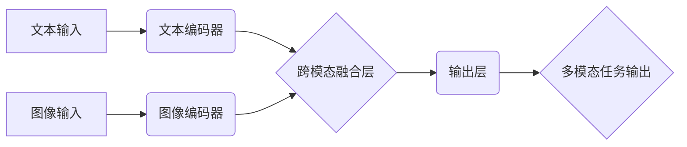

## 多模态大模型：技术原理与实战 文本多模态技术

> 关键词：多模态大模型、文本多模态、Transformer、视觉语言模型、图像理解、自然语言处理、深度学习、BERT、CLIP

### 1. 背景介绍

近年来，人工智能领域取得了令人瞩目的进展，其中大模型技术尤为引人注目。大模型是指参数规模庞大、训练数据海量的人工智能模型，能够在多个任务上表现出强大的泛化能力。传统的单模态大模型主要专注于文本或图像等单一模态数据，但现实世界中信息往往是多模态的，例如文本、图像、音频、视频等。因此，多模态大模型应运而生，旨在融合不同模态信息，实现更全面、更智能的理解和生成。

文本多模态技术作为多模态大模型的重要分支，旨在融合文本和图像信息，实现跨模态的理解和生成。它在图像识别、文本描述、视觉问答、图像生成等领域具有广泛的应用前景。例如，可以利用文本多模态模型自动生成图像描述，为视障人士提供图像理解辅助；可以用于自动识别图像中的物体和场景，提高图像搜索的准确性；还可以用于生成逼真的图像，满足人们在艺术创作、游戏设计等方面的需求。

### 2. 核心概念与联系

文本多模态技术的核心是将文本和图像信息融合在一起，构建一个统一的表示空间。

**2.1 核心概念**

* **文本表示:** 将文本信息转换为数字向量，例如使用Word Embedding或BERT等模型。
* **图像表示:** 将图像信息转换为数字向量，例如使用CNN或Vision Transformer等模型。
* **跨模态融合:** 将文本和图像的表示融合在一起，学习它们的相互关系。
* **多模态任务:** 利用融合后的表示进行各种跨模态任务，例如图像字幕、视觉问答、图像检索等。

**2.2 架构图**



### 3. 核心算法原理 & 具体操作步骤

**3.1 算法原理概述**

文本多模态模型通常采用以下两种主要架构：

* **编码器-解码器架构:** 首先使用编码器分别对文本和图像进行编码，然后将编码结果融合在一起，最后使用解码器生成最终输出。
* **自监督学习架构:** 利用大量的无标签数据进行预训练，学习文本和图像之间的语义关系，然后在特定任务上进行微调。

**3.2 算法步骤详解**

1. **数据预处理:** 将文本和图像数据进行预处理，例如文本分词、图像裁剪、数据增强等。
2. **模型训练:** 使用训练数据训练文本多模态模型，例如使用交叉熵损失函数优化模型参数。
3. **模型评估:** 使用测试数据评估模型性能，例如计算准确率、召回率、F1-score等指标。
4. **模型部署:** 将训练好的模型部署到实际应用场景中，例如图像字幕生成、视觉问答系统等。

**3.3 算法优缺点**

* **优点:** 能够融合不同模态信息，提高模型的理解和生成能力；
* **缺点:** 需要大量的训练数据和计算资源；模型训练复杂，需要专业的技术人员进行操作。

**3.4 算法应用领域**

* **图像识别:** 自动识别图像中的物体、场景和人物。
* **文本描述:** 自动生成图像的文字描述。
* **视觉问答:** 根据图像回答文本问题。
* **图像生成:** 根据文本描述生成图像。
* **多模态检索:** 根据文本或图像查询相关信息。

### 4. 数学模型和公式 & 详细讲解 & 举例说明

**4.1 数学模型构建**

文本多模态模型通常使用神经网络进行构建，其中包括编码器和解码器两个主要部分。

* **编码器:** 用于将文本和图像信息分别编码成向量表示。
* **解码器:** 用于将编码后的文本和图像信息融合在一起，生成最终输出。

**4.2 公式推导过程**

假设文本序列为 $T = \{t_1, t_2,..., t_n\}$，图像特征为 $V = \{v_1, v_2,..., v_m\}$，则文本编码器输出的文本向量表示为 $h_T = \{h_1, h_2,..., h_n\}$，图像编码器输出的图像向量表示为 $h_V = \{h_1, h_2,..., h_m\}$。

跨模态融合层通常使用注意力机制来学习文本和图像之间的关系，例如使用多头注意力机制。

**4.3 案例分析与讲解**

例如，在图像字幕生成任务中，文本多模态模型需要根据图像内容生成相应的文字描述。

* 首先，使用CNN编码器对图像进行编码，得到图像特征向量 $h_V$。
* 然后，使用Transformer编码器对文本进行编码，得到文本向量表示 $h_T$。
* 最后，使用跨模态融合层将 $h_V$ 和 $h_T$ 融合在一起，并使用解码器生成最终的字幕文本。

### 5. 项目实践：代码实例和详细解释说明

**5.1 开发环境搭建**

* Python 3.7+
* PyTorch 1.7+
* CUDA 10.2+

**5.2 源代码详细实现**

```python
import torch
import torch.nn as nn

class TextEncoder(nn.Module):
    def __init__(self, vocab_size, embedding_dim, hidden_dim):
        super(TextEncoder, self).__init__()
        self.embedding = nn.Embedding(vocab_size, embedding_dim)
        self.transformer = nn.Transformer(d_model=embedding_dim, nhead=8, num_encoder_layers=6)

    def forward(self, text):
        embedded = self.embedding(text)
        encoded = self.transformer(embedded)
        return encoded

class ImageEncoder(nn.Module):
    def __init__(self, image_dim, embedding_dim):
        super(ImageEncoder, self).__init__()
        self.cnn = nn.Sequential(
            nn.Conv2d(3, 64, kernel_size=3, padding=1),
            nn.ReLU(),
            nn.MaxPool2d(kernel_size=2, stride=2),
            nn.Conv2d(64, 128, kernel_size=3, padding=1),
            nn.ReLU(),
            nn.MaxPool2d(kernel_size=2, stride=2),
            nn.Flatten()
        )
        self.fc = nn.Linear(128 * 7 * 7, embedding_dim)

    def forward(self, image):
        encoded = self.cnn(image)
        encoded = self.fc(encoded)
        return encoded

class CrossModalFusion(nn.Module):
    def __init__(self, embedding_dim):
        super(CrossModalFusion, self).__init__()
        self.attention = nn.MultiheadAttention(embed_dim=embedding_dim, num_heads=8)

    def forward(self, text_encoded, image_encoded):
        # 使用多头注意力机制融合文本和图像信息
        fused_representation = self.attention(text_encoded, image_encoded, image_encoded)[0]
        return fused_representation

class TextDecoder(nn.Module):
    def __init__(self, vocab_size, embedding_dim, hidden_dim):
        super(TextDecoder, self).__init__()
        self.transformer = nn.Transformer(d_model=embedding_dim, nhead=8, num_decoder_layers=6)
        self.linear = nn.Linear(embedding_dim, vocab_size)

    def forward(self, fused_representation):
        decoded = self.transformer(fused_representation)
        output = self.linear(decoded)
        return output

class TextMultiModalModel(nn.Module):
    def __init__(self, vocab_size, embedding_dim, hidden_dim):
        super(TextMultiModalModel, self).__init__()
        self.text_encoder = TextEncoder(vocab_size, embedding_dim, hidden_dim)
        self.image_encoder = ImageEncoder(image_dim, embedding_dim)
        self.cross_modal_fusion = CrossModalFusion(embedding_dim)
        self.text_decoder = TextDecoder(vocab_size, embedding_dim, hidden_dim)

    def forward(self, text, image):
        text_encoded = self.text_encoder(text)
        image_encoded = self.image_encoder(image)
        fused_representation = self.cross_modal_fusion(text_encoded, image_encoded)
        output = self.text_decoder(fused_representation)
        return output
```

**5.3 代码解读与分析**

* 该代码实现了一个简单的文本多模态模型，包括文本编码器、图像编码器、跨模态融合层和文本解码器。
* 文本编码器使用Transformer网络对文本进行编码，图像编码器使用CNN网络对图像进行编码。
* 跨模态融合层使用多头注意力机制学习文本和图像之间的关系。
* 文本解码器使用Transformer网络生成最终的文本输出。

**5.4 运行结果展示**

* 运行该代码需要准备训练数据和模型参数。
* 训练完成后，可以将模型部署到实际应用场景中，例如图像字幕生成、视觉问答系统等。

### 6. 实际应用场景

**6.1 图像字幕生成**

* 将图像描述为文字，方便视障人士理解图像内容。
* 自动生成图像的标题和标签，用于图像搜索和检索。

**6.2 视觉问答**

* 根据图像回答文本问题，例如“图片中有什么动物？”、“图片中的人在做什么？”。
* 用于图像理解和知识问答系统。

**6.3 图像检索**

* 根据文本描述检索相关图像，例如“查找一张猫的照片”。
* 用于图像搜索引擎和电子商务平台。

**6.4 多模态对话系统**

* 结合文本和图像信息进行对话，例如聊天机器人可以理解用户发送的图片内容。
* 用于增强用户体验和交互性。

**6.5 内容创作**

* 根据文本描述生成图像，例如小说封面、游戏场景等。
* 用于艺术创作、游戏设计和广告设计。

**6.4 未来应用展望**

* **更智能的图像理解:** 能够理解更复杂和抽象的图像内容。
* **更自然的跨模态交互:** 能够更自然地理解和生成文本和图像信息。
* **更广泛的应用场景:** 能够应用于更多领域，例如医疗、教育、金融等。

### 7. 工具和资源推荐

**7.1 学习资源推荐**

* **书籍:**
    * 《深度学习》 - Ian Goodfellow, Yoshua Bengio, Aaron Courville
    * 《自然语言处理》 - Dan Jurafsky, James H. Martin
* **课程:**
    * Stanford CS231n: Convolutional Neural Networks for Visual Recognition
    * Stanford CS224n: Natural Language Processing with Deep Learning
* **博客:**
    * https://blog.openai.com/
    * https://ai.googleblog.com/

**7.2 开发工具推荐**

* **PyTorch:** https://pytorch.org/
* **TensorFlow:** https://www.tensorflow.org/
* **Hugging Face Transformers:** https://huggingface.co/transformers/

**7.3 相关论文推荐**

* **BERT:** Devlin, J., Chang, M. W., Lee, K., & Toutanova, K. (2018). BERT: Pre