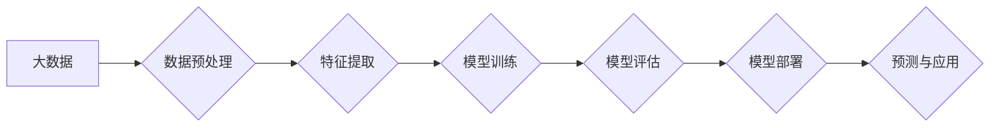

## 大数据驱动AI学习的未来

> 关键词：大数据、人工智能、机器学习、深度学习、数据驱动、算法优化、未来趋势

## 1. 背景介绍

人工智能（AI）正以惊人的速度发展，其核心驱动力之一是大数据。随着互联网、物联网和移动设备的普及，海量数据正在以指数级增长。这些数据蕴藏着丰富的知识和模式，为AI学习提供了宝贵的燃料。大数据驱动AI学习，使得AI模型能够从海量数据中学习更复杂的知识，从而提升其性能和智能水平。

传统的AI学习方法依赖于人工特征工程，需要专家手动提取数据中的特征，这不仅耗时费力，而且难以捕捉到数据中的隐含模式。而大数据驱动的AI学习则能够自动从数据中学习特征，无需人工干预，从而大幅提高了AI模型的学习效率和准确性。

## 2. 核心概念与联系

### 2.1 大数据

大数据是指规模庞大、结构复杂、速度快、多样化的数据集合。其特点包括：

* **海量数据 (Volume):** 数据量巨大，难以用传统方法处理。
* **高速数据 (Velocity):** 数据生成和更新速度快，需要实时处理。
* **多样化数据 (Variety):** 数据类型多样，包括结构化数据、非结构化数据和半结构化数据。
* **价值数据 (Veracity):** 数据质量高，可靠性强，能够用于决策。

### 2.2 人工智能

人工智能是指模拟人类智能的计算机系统。其目标是使机器能够像人类一样学习、推理、解决问题和做出决策。

### 2.3 机器学习

机器学习是人工智能的一个子领域，它通过算法使计算机能够从数据中学习，无需明确编程。机器学习算法可以分为监督学习、无监督学习和强化学习三大类。

### 2.4 深度学习

深度学习是机器学习的一个子领域，它使用多层神经网络来模拟人类大脑的学习过程。深度学习算法能够学习到更复杂的特征，从而在图像识别、自然语言处理等领域取得突破性进展。

**Mermaid 流程图**



## 3. 核心算法原理 & 具体操作步骤

### 3.1 算法原理概述

深度学习算法的核心是多层神经网络。神经网络由多个层组成，每层包含多个神经元。神经元之间通过连接进行信息传递，每个连接都有一个权重。通过训练，神经网络可以调整这些权重，从而学习到数据中的模式。

### 3.2 算法步骤详解

1. **数据预处理:** 将原始数据清洗、转换和格式化，使其适合深度学习算法的训练。
2. **特征提取:** 从数据中提取特征，例如图像中的边缘、纹理和形状，文本中的词语和语法结构。
3. **模型构建:** 设计和构建深度学习模型，例如卷积神经网络（CNN）或循环神经网络（RNN）。
4. **模型训练:** 使用训练数据训练深度学习模型，通过调整模型参数，使模型能够准确地预测目标变量。
5. **模型评估:** 使用测试数据评估模型的性能，例如准确率、召回率和F1-score。
6. **模型部署:** 将训练好的模型部署到实际应用场景中，例如图像识别、自然语言处理和推荐系统。

### 3.3 算法优缺点

**优点:**

* 能够学习到更复杂的特征，提高模型的准确性。
* 对数据类型适应性强，能够处理结构化和非结构化数据。
* 具有强大的泛化能力，能够应用于不同的领域和任务。

**缺点:**

* 训练数据量大，需要大量的计算资源和时间。
* 模型参数众多，容易过拟合。
* 算法解释性差，难以理解模型的决策过程。

### 3.4 算法应用领域

深度学习算法在各个领域都有广泛的应用，例如：

* **图像识别:** 人脸识别、物体检测、图像分类。
* **自然语言处理:** 机器翻译、文本摘要、情感分析。
* **语音识别:** 语音转文本、语音助手。
* **推荐系统:** 产品推荐、内容推荐。
* **医疗诊断:** 病情预测、疾病诊断。

## 4. 数学模型和公式 & 详细讲解 & 举例说明

### 4.1 数学模型构建

深度学习模型通常使用神经网络来模拟人类大脑的结构和功能。神经网络由多个层组成，每层包含多个神经元。每个神经元接收来自上一层的输入信号，并通过激活函数进行处理，输出到下一层。

**神经网络模型**

$$
y = f(W x + b)
$$

其中：

* $y$ 是输出值
* $x$ 是输入值
* $W$ 是权重矩阵
* $b$ 是偏置向量
* $f$ 是激活函数

### 4.2 公式推导过程

深度学习模型的训练过程是通过优化模型参数来最小化损失函数。损失函数衡量模型预测值与真实值的差异。常用的损失函数包括均方误差（MSE）和交叉熵损失（Cross-Entropy Loss）。

**均方误差损失函数**

$$
L = \frac{1}{n} \sum_{i=1}^{n} (y_i - \hat{y}_i)^2
$$

其中：

* $L$ 是损失函数值
* $n$ 是样本数量
* $y_i$ 是真实值
* $\hat{y}_i$ 是预测值

**交叉熵损失函数**

$$
L = -\frac{1}{n} \sum_{i=1}^{n} y_i \log(\hat{y}_i) + (1-y_i) \log(1-\hat{y}_i)
$$

其中：

* $L$ 是损失函数值
* $n$ 是样本数量
* $y_i$ 是真实值
* $\hat{y}_i$ 是预测值

### 4.3 案例分析与讲解

**图像分类案例**

假设我们有一个图像分类任务，目标是将图像分类为猫、狗或鸟。我们可以使用卷积神经网络（CNN）来解决这个问题。CNN能够学习到图像中的特征，例如边缘、纹理和形状。

训练过程中，我们使用大量的标记图像数据，让CNN学习到不同动物的特征。通过调整CNN的参数，使模型能够准确地预测图像中的动物类别。

## 5. 项目实践：代码实例和详细解释说明

### 5.1 开发环境搭建

* **操作系统:** Ubuntu 18.04
* **编程语言:** Python 3.6
* **深度学习框架:** TensorFlow 2.0
* **其他工具:** Jupyter Notebook、Git

### 5.2 源代码详细实现

```python
import tensorflow as tf

# 定义模型结构
model = tf.keras.models.Sequential([
    tf.keras.layers.Conv2D(32, (3, 3), activation='relu', input_shape=(28, 28, 1)),
    tf.keras.layers.MaxPooling2D((2, 2)),
    tf.keras.layers.Conv2D(64, (3, 3), activation='relu'),
    tf.keras.layers.MaxPooling2D((2, 2)),
    tf.keras.layers.Flatten(),
    tf.keras.layers.Dense(10, activation='softmax')
])

# 编译模型
model.compile(optimizer='adam',
              loss='sparse_categorical_crossentropy',
              metrics=['accuracy'])

# 加载数据
(x_train, y_train), (x_test, y_test) = tf.keras.datasets.mnist.load_data()

# 数据预处理
x_train = x_train.astype('float32') / 255.0
x_test = x_test.astype('float32') / 255.0
x_train = x_train.reshape((x_train.shape[0], 28, 28, 1))
x_test = x_test.reshape((x_test.shape[0], 28, 28, 1))

# 训练模型
model.fit(x_train, y_train, epochs=5)

# 评估模型
loss, accuracy = model.evaluate(x_test, y_test)
print('Test loss:', loss)
print('Test accuracy:', accuracy)
```

### 5.3 代码解读与分析

这段代码实现了使用TensorFlow框架训练一个简单的卷积神经网络来进行手写数字识别。

* **模型结构:** 代码定义了一个简单的CNN模型，包含两个卷积层、两个最大池化层、一个扁平化层和一个全连接层。
* **模型编译:** 代码使用Adam优化器、稀疏类别交叉熵损失函数和准确率作为评估指标来编译模型。
* **数据加载:** 代码使用MNIST数据集来训练和评估模型。
* **数据预处理:** 代码将图像数据转换为浮点数，并进行归一化处理。
* **模型训练:** 代码使用训练数据训练模型，训练5个epochs。
* **模型评估:** 代码使用测试数据评估模型的性能，并打印测试损失和准确率。

### 5.4 运行结果展示

运行这段代码后，会输出模型的训练过程和测试结果。测试准确率通常在98%以上。

## 6. 实际应用场景

### 6.1 图像识别

* **人脸识别:** 用于身份验证、安全监控和人脸搜索。
* **物体检测:** 用于自动驾驶、机器人视觉和图像分析。
* **医学图像分析:** 用于疾病诊断、肿瘤检测和影像分割。

### 6.2 自然语言处理

* **机器翻译:** 将文本从一种语言翻译成另一种语言。
* **文本摘要:** 自动生成文本的简短摘要。
* **情感分析:** 分析文本中的情感倾向，例如正面、负面或中性。

### 6.3 其他应用场景

* **推荐系统:** 根据用户的历史行为和偏好推荐产品或内容。
* **语音助手:** 理解用户的语音指令并执行相应的操作。
* **金融风险管理:** 检测欺诈交易和评估投资风险。

### 6.4 未来应用展望

随着大数据的不断增长和深度学习算法的不断发展，AI将应用于更多领域，例如：

* **个性化教育:** 根据学生的学习进度和能力提供个性化的学习方案。
* **精准医疗:** 根据患者的基因信息和病史提供个性化的治疗方案。
* **智能制造:** 利用AI技术提高生产效率和产品质量。

## 7. 工具和资源推荐

### 7.1 学习资源推荐

* **书籍:**
    * 《深度学习》
    * 《机器学习》
    * 《Python机器学习》
* **在线课程:**
    * Coursera深度学习课程
    * Udacity深度学习课程
    * fast.ai深度学习课程

### 7.2 开发工具推荐

* **深度学习框架:** TensorFlow, PyTorch, Keras
* **编程语言:** Python
* **数据处理工具:** Pandas, NumPy

### 7.3 相关论文推荐

* **《ImageNet Classification with Deep Convolutional Neural Networks》**
* **《Attention Is All You Need》**
* **《BERT: Pre-training of Deep Bidirectional Transformers for Language Understanding》**

## 8. 总结：未来发展趋势与挑战

### 8.1 研究成果总结

大数据驱动AI学习取得了显著成果，深度学习算法在图像识别、自然语言处理等领域取得了突破性进展。

### 8.2 未来发展趋势

* **模型规模和复杂度提升:** 模型参数数量将继续增加，模型结构将更加复杂。
* **数据质量和多样性提升:** 数据标注质量将提高，数据类型将更加多样化。
* **算法效率和可解释性提升:** 算法训练速度和推理速度将进一步提升，模型的决策过程