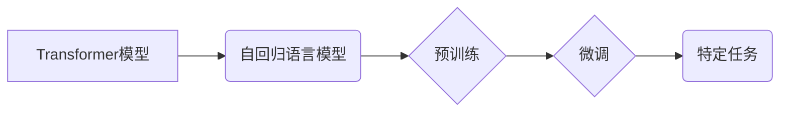

## 大语言模型原理与工程实践：C4

> 关键词：大语言模型、Transformer、BERT、GPT、LLM、自然语言处理、深度学习

### 1. 背景介绍

近年来，深度学习技术取得了飞速发展，特别是Transformer模型的出现，为自然语言处理（NLP）领域带来了革命性的变革。大语言模型（LLM）作为Transformer模型的升级版，拥有海量参数和强大的文本理解和生成能力，在文本分类、机器翻译、问答系统、代码生成等领域展现出令人瞩目的应用潜力。

LLM的出现，标志着人工智能进入了一个新的时代。它不仅能够理解和生成人类语言，还能进行复杂的逻辑推理、创意写作和知识问答，甚至可以辅助人类进行科研探索和艺术创作。然而，LLM的训练和应用也面临着诸多挑战，例如数据获取、模型规模、计算资源、伦理问题等。

### 2. 核心概念与联系

**2.1  核心概念**

* **Transformer模型:**  一种基于注意力机制的深度神经网络架构，能够有效处理长距离依赖关系，是LLM的基础。
* **自回归语言模型:**  一种预测下一个词的概率分布的模型，通过训练大量的文本数据，学习语言的语法和语义规律。
* **预训练和微调:**  LLM通常采用预训练和微调的策略，先在大量文本数据上进行预训练，然后针对特定任务进行微调。

**2.2  架构关系**



**2.3  联系解释**

Transformer模型是LLM的基础架构，其强大的注意力机制能够有效处理文本中的长距离依赖关系。自回归语言模型是一种基于Transformer模型的文本生成模型，通过预测下一个词的概率分布，生成流畅的文本。LLM通常采用预训练和微调的策略，先在大量文本数据上进行预训练，学习语言的通用知识，然后针对特定任务进行微调，提高模型在特定领域的性能。

### 3. 核心算法原理 & 具体操作步骤

**3.1  算法原理概述**

LLM的核心算法是基于Transformer模型的**自回归语言模型**。该模型通过学习文本序列中词之间的关系，预测下一个词的概率分布。其主要原理包括：

* **注意力机制:**  能够捕捉文本序列中不同词之间的依赖关系，即使这些词相隔很远。
* **多头注意力:**  使用多个注意力头，可以从不同的角度捕捉词之间的关系，提高模型的表达能力。
* **位置编码:**  由于Transformer模型没有循环结构，无法捕捉词的顺序信息，因此需要使用位置编码来表示每个词的位置信息。
* **前馈神经网络:**  对每个词的嵌入向量进行非线性变换，进一步提取语义信息。

**3.2  算法步骤详解**

1. **输入文本序列:** 将输入的文本序列转换为词嵌入向量。
2. **多头注意力层:**  使用多头注意力机制计算每个词与其他词之间的注意力权重，捕捉词之间的关系。
3. **前馈神经网络层:**  对每个词的注意力输出进行非线性变换，提取语义信息。
4. **位置编码:**  将位置编码添加到每个词的嵌入向量中，表示每个词的位置信息。
5. **输出层:**  使用softmax函数将模型输出的词向量映射到词的概率分布，预测下一个词。

**3.3  算法优缺点**

* **优点:**  能够有效处理长距离依赖关系，具有强大的文本理解和生成能力。
* **缺点:**  训练成本高，需要大量的计算资源和训练数据。

**3.4  算法应用领域**

* 文本分类
* 机器翻译
* 问答系统
* 代码生成
* 文本摘要
* 创意写作

### 4. 数学模型和公式 & 详细讲解 & 举例说明

**4.1  数学模型构建**

LLM的数学模型可以表示为一个多层神经网络，其中每一层都包含注意力机制和前馈神经网络。

**4.2  公式推导过程**

* **注意力机制:**  注意力机制的计算公式如下：

$$
\text{Attention}(Q, K, V) = \text{softmax}\left(\frac{Q K^T}{\sqrt{d_k}}\right) V
$$

其中，Q、K、V分别代表查询矩阵、键矩阵和值矩阵，$d_k$代表键向量的维度。

* **多头注意力:**  多头注意力机制使用多个注意力头，每个注意力头计算一个独立的注意力权重。最终的注意力输出是所有注意力头的输出进行加权平均。

**4.3  案例分析与讲解**

假设我们有一个文本序列“我爱学习编程”，其中每个词都转换为词嵌入向量。使用注意力机制，我们可以计算每个词与其他词之间的注意力权重。例如，词“学习”与词“编程”的注意力权重会比较高，因为它们在语义上相关。

### 5. 项目实践：代码实例和详细解释说明

**5.1  开发环境搭建**

* Python 3.7+
* PyTorch 或 TensorFlow
* CUDA 和 cuDNN

**5.2  源代码详细实现**

```python
import torch
import torch.nn as nn

class Transformer(nn.Module):
    def __init__(self, vocab_size, embedding_dim, num_heads, num_layers):
        super(Transformer, self).__init__()
        self.embedding = nn.Embedding(vocab_size, embedding_dim)
        self.transformer_layers = nn.ModuleList([
            nn.TransformerEncoderLayer(embedding_dim, num_heads)
            for _ in range(num_layers)
        ])
        self.linear = nn.Linear(embedding_dim, vocab_size)

    def forward(self, x):
        x = self.embedding(x)
        for layer in self.transformer_layers:
            x = layer(x)
        x = self.linear(x)
        return x
```

**5.3  代码解读与分析**

* `Transformer`类定义了一个Transformer模型。
* `embedding`层将词索引转换为词嵌入向量。
* `transformer_layers`是一个`ModuleList`，包含多个`TransformerEncoderLayer`层。
* `linear`层将模型输出的词向量映射到词的概率分布。

**5.4  运行结果展示**

训练好的LLM模型可以用于各种自然语言处理任务，例如文本生成、机器翻译、问答系统等。

### 6. 实际应用场景

**6.1  文本生成**

LLM可以用于生成各种类型的文本，例如小说、诗歌、新闻报道、代码等。

**6.2  机器翻译**

LLM可以用于将文本从一种语言翻译成另一种语言。

**6.3  问答系统**

LLM可以用于构建问答系统，能够理解用户的问题并给出准确的答案。

**6.4  未来应用展望**

LLM在未来将有更广泛的应用场景，例如：

* **个性化教育:**  根据学生的学习进度和需求，提供个性化的学习内容和辅导。
* **医疗诊断:**  辅助医生进行疾病诊断，提高诊断准确率。
* **法律服务:**  帮助律师进行法律研究和案件分析。

### 7. 工具和资源推荐

**7.1  学习资源推荐**

* **论文:**  “Attention Is All You Need”
* **书籍:**  《深度学习》
* **在线课程:**  Coursera、edX

**7.2  开发工具推荐**

* **PyTorch:**  一个开源的深度学习框架。
* **TensorFlow:**  另一个开源的深度学习框架。
* **Hugging Face Transformers:**  一个用于加载和使用预训练Transformer模型的库。

**7.3  相关论文推荐**

* BERT: Pre-training of Deep Bidirectional Transformers for Language Understanding
* GPT-3: Language Models are Few-Shot Learners
* T5: Text-to-Text Transfer Transformer

### 8. 总结：未来发展趋势与挑战

**8.1  研究成果总结**

近年来，LLM取得了显著的进展，在文本理解和生成方面展现出强大的能力。

**8.2  未来发展趋势**

* 模型规模的进一步扩大
* 训练数据的多样化和高质量化
* 算法的创新和优化
* 伦理和安全问题的研究

**8.3  面临的挑战**

* 训练成本高
* 数据获取困难
* 偏见和歧视问题
* 缺乏可解释性

**8.4  研究展望**

未来，LLM的研究将继续朝着更强大、更安全、更可解释的方向发展。


### 9. 附录：常见问题与解答

**9.1  什么是LLM？**

LLM是指大语言模型，是一种能够理解和生成人类语言的深度学习模型。

**9.2  LLM的训练数据是什么？**

LLM的训练数据通常是大量的文本数据，例如书籍、文章、网站内容等。

**9.3  LLM有哪些应用场景？**

LLM可以应用于各种自然语言处理任务，例如文本生成、机器翻译、问答系统等。

**9.4  如何训练一个LLM？**

训练一个LLM需要大量的计算资源和时间，通常需要使用GPU进行训练。

**9.5  LLM有哪些伦理问题？**

LLM可能存在偏见、歧视和虚假信息生成等伦理问题，需要引起重视和研究。


作者：禅与计算机程序设计艺术 / Zen and the Art of Computer Programming 
