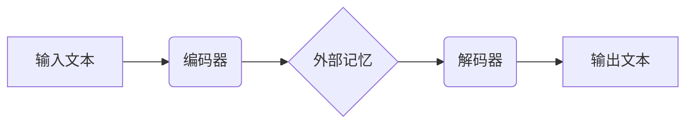

## 大语言模型应用指南：MemGPT

> 关键词：大语言模型、MemGPT、记忆增强、文本生成、对话系统、应用指南、技术趋势

## 1. 背景介绍

近年来，大语言模型（LLM）在自然语言处理领域取得了显著进展，展现出强大的文本生成、翻译、摘要和问答能力。然而，现有的LLM模型在长文本处理和记忆方面存在局限性，难以保持上下文信息的一致性和完整性。为了解决这一问题，**记忆增强**技术应运而生，旨在赋予LLM模型更强的记忆能力，使其能够更好地理解和处理长文本信息。

MemGPT作为一种基于Transformer架构的记忆增强大语言模型，通过引入外部记忆模块，有效提升了模型的记忆能力和上下文理解能力。它在文本生成、对话系统、问答系统等领域展现出优异的性能，并为LLM模型的实际应用提供了新的思路和方向。

## 2. 核心概念与联系

### 2.1 核心概念

* **大语言模型 (LLM):** 训练于海量文本数据的大型神经网络模型，能够理解和生成人类语言。
* **Transformer:** 一种基于注意力机制的神经网络架构，能够有效处理序列数据，在自然语言处理领域取得了突破性进展。
* **外部记忆:**  一种存储和检索信息的机制，可以帮助LLM模型保持上下文信息的一致性和完整性。

### 2.2 架构原理

MemGPT模型的核心架构由以下部分组成：

* **编码器:**  负责将输入文本序列编码成向量表示。
* **解码器:**  负责根据编码后的文本向量生成输出文本序列。
* **外部记忆模块:**  负责存储和检索上下文信息，帮助解码器生成更准确和连贯的文本。

**Mermaid 流程图:**

## 3. 核心算法原理 & 具体操作步骤

### 3.1 算法原理概述

MemGPT模型的核心算法原理是基于Transformer架构，并结合外部记忆模块。

* **Transformer:**  利用注意力机制，能够捕捉文本序列中不同词之间的关系，并生成上下文相关的向量表示。
* **外部记忆:**  通过将编码后的文本向量存储在外部记忆模块中，并允许解码器在生成文本时访问和检索外部记忆信息，从而增强模型的记忆能力。

### 3.2 算法步骤详解

1. **输入文本预处理:** 将输入文本进行分词、词嵌入等预处理操作，将其转换为模型可理解的格式。
2. **编码器处理:** 将预处理后的文本序列输入编码器，编码器利用Transformer架构和注意力机制，将文本序列编码成上下文相关的向量表示。
3. **外部记忆更新:** 将编码后的文本向量存储在外部记忆模块中，并根据需要更新外部记忆内容。
4. **解码器生成:** 将解码器输入为前一个时间步的输出文本向量和当前时间步的输入词，解码器利用Transformer架构和注意力机制，结合外部记忆信息，生成下一个时间步的输出文本向量。
5. **输出文本生成:** 将解码器输出的文本向量转换为文本序列，并输出最终的文本结果。

### 3.3 算法优缺点

**优点:**

* **增强记忆能力:**  通过引入外部记忆模块，MemGPT模型能够更好地保持上下文信息的一致性和完整性，从而提升文本生成质量和理解能力。
* **处理长文本:**  MemGPT模型能够处理更长的文本序列，克服了传统LLM模型在长文本处理方面的局限性。
* **可扩展性强:**  MemGPT模型的外部记忆模块可以根据需要进行扩展，从而适应不同规模和复杂度的任务需求。

**缺点:**

* **计算复杂度高:**  MemGPT模型的外部记忆模块增加了模型的计算复杂度，需要更强大的计算资源进行训练和推理。
* **记忆容量有限:**  外部记忆模块的容量有限，可能会导致模型在处理非常长文本时出现记忆不足的问题。
* **训练难度高:**  MemGPT模型的训练需要更复杂的训练策略和优化算法，训练难度相对较高。

### 3.4 算法应用领域

MemGPT模型在以下领域具有广泛的应用前景:

* **文本生成:**  例如，生成更连贯和自然的文章、故事、对话等。
* **对话系统:**  例如，构建更智能和自然的人机对话系统。
* **问答系统:**  例如，构建能够理解上下文并提供更准确的答案的问答系统。
* **机器翻译:**  例如，提高机器翻译的准确性和流畅度。
* **代码生成:**  例如，帮助程序员生成代码片段。

## 4. 数学模型和公式 & 详细讲解 & 举例说明

### 4.1 数学模型构建

MemGPT模型的数学模型构建主要基于Transformer架构和注意力机制。

* **Transformer:**  Transformer模型由编码器和解码器组成，每个部分都包含多层Transformer块。每个Transformer块包含多头注意力层、前馈神经网络层和残差连接层。
* **注意力机制:**  注意力机制能够捕捉文本序列中不同词之间的关系，并生成上下文相关的向量表示。

### 4.2 公式推导过程

注意力机制的核心公式如下:

$$
Attention(Q, K, V) = softmax(\frac{QK^T}{\sqrt{d_k}})V
$$

其中:

* $Q$: 查询矩阵
* $K$: 键矩阵
* $V$: 值矩阵
* $d_k$: 键向量的维度
* $softmax$:  softmax函数

### 4.3 案例分析与讲解

假设我们有一个文本序列 "The cat sat on the mat"，我们想要计算 "cat" 和 "mat" 之间的注意力权重。

1. 将每个词编码成向量表示，得到查询矩阵 $Q$, 键矩阵 $K$ 和值矩阵 $V$。
2. 计算 $QK^T$，得到一个矩阵，其中每个元素表示两个词之间的相似度。
3. 对 $QK^T$ 进行归一化，得到注意力权重矩阵。
4. 将注意力权重矩阵与值矩阵相乘，得到最终的注意力输出向量。

通过分析注意力权重矩阵，我们可以发现 "cat" 和 "mat" 之间的注意力权重较高，说明这两个词在语义上相关。

## 5. 项目实践：代码实例和详细解释说明

### 5.1 开发环境搭建

MemGPT模型的开发环境搭建需要以下软件和工具:

* Python 3.x
* PyTorch 或 TensorFlow
* CUDA 和 cuDNN (可选，用于GPU加速)
* Git

### 5.2 源代码详细实现

MemGPT模型的源代码实现可以参考开源项目或自行编写。

* **开源项目:**  例如，HuggingFace Transformers 库提供了一些预训练的MemGPT模型，可以方便地进行使用和修改。
* **自行编写:**  需要根据MemGPT模型的架构原理和算法步骤，编写相应的代码实现。

### 5.3 代码解读与分析

MemGPT模型的代码实现主要包含以下部分:

* **数据加载和预处理:**  加载和预处理训练数据，将其转换为模型可理解的格式。
* **模型定义:**  定义MemGPT模型的架构，包括编码器、解码器和外部记忆模块。
* **模型训练:**  使用训练数据训练MemGPT模型，并使用优化算法和损失函数进行模型参数更新。
* **模型评估:**  使用测试数据评估MemGPT模型的性能，并根据评估结果进行模型调优。

### 5.4 运行结果展示

MemGPT模型的运行结果可以根据具体的应用场景进行展示。

* **文本生成:**  展示MemGPT模型生成的文本序列，并进行质量评估。
* **对话系统:**  展示MemGPT模型与用户的对话交互过程，并评估对话系统的流畅性和自然度。
* **问答系统:**  展示MemGPT模型对问题的回答，并评估回答的准确性和相关性。

## 6. 实际应用场景

MemGPT模型在实际应用场景中展现出优异的性能，例如:

* **聊天机器人:**  MemGPT可以构建更智能和自然的人机对话系统，能够更好地理解用户的意图和上下文信息，并提供更准确和有用的回复。
* **教育领域:**  MemGPT可以用于自动生成学习材料、提供个性化学习辅导、评估学生的学习成果等。
* **医疗领域:**  MemGPT可以用于辅助医生诊断疾病、分析患者病历、提供医疗建议等。

### 6.4 未来应用展望

MemGPT模型在未来将有更广泛的应用前景，例如:

* **自动写作:**  MemGPT可以帮助人们自动生成各种类型的文本，例如文章、故事、诗歌等。
* **代码生成:**  MemGPT可以帮助程序员自动生成代码片段，提高开发效率。
* **个性化推荐:**  MemGPT可以根据用户的兴趣和偏好，提供个性化的商品、服务和内容推荐。

## 7. 工具和资源推荐

### 7.1 学习资源推荐

* **书籍:**  《深度学习》、《自然语言处理》
* **在线课程:**  Coursera、edX、Udacity 等平台上的自然语言处理课程
* **博客和论坛:**  HuggingFace、Towards Data Science 等平台上的自然语言处理博客和论坛

### 7.2 开发工具推荐

* **Python:**  Python 是自然语言处理领域最常用的编程语言。
* **PyTorch 或 TensorFlow:**  PyTorch 和 TensorFlow 是两种流行的深度学习框架。
* **HuggingFace Transformers:**  HuggingFace Transformers 库提供了一些预训练的LLM模型，可以方便地进行使用和修改。

### 7.3 相关论文推荐

* **Attention Is All You Need:**  https://arxiv.org/abs/1706.03762
* **BERT: Pre-training of Deep Bidirectional Transformers for Language Understanding:**  https://arxiv.org/abs/1810.04805
* **GPT-3: Language Models are Few-Shot Learners:**  https://arxiv.org/abs/2005.14165

## 8. 总结：未来发展趋势与挑战

### 8.1 研究成果总结

MemGPT模型在记忆增强和文本生成领域取得了显著进展，为LLM模型的实际应用提供了新的思路和方向。

### 8.2 未来发展趋势

* **模型规模和能力提升:**  未来MemGPT模型的规模和能力将会进一步提升，能够处理更复杂的任务和更长的文本序列。
* **多模态学习:**  MemGPT模型将与其他模态数据（例如图像、音频）进行融合，实现多模态学习，从而更好地理解和生成多模态信息。
* **可解释性增强:**  研究人员将致力于提高MemGPT模型的可解释性，使其决策过程更加透明和可理解。

### 8.3 面临的挑战

* **计算资源需求:**  MemGPT模型的训练和推理需要大量的计算资源，这对于资源有限的机构和个人来说是一个挑战。
* **数据获取和标注:**  MemGPT模型的训练需要大量的文本数据和标注数据，数据获取和标注成本较高。
* **伦理和安全问题:**  LLM模型的应用可能会带来一些伦理和安全问题，例如信息泄露、深度伪造等，需要引起足够的重视和研究。

### 8.4 研究展望

未来，MemGPT模型的研究将继续深入，探索其在更多领域和应用场景中的潜力，并解决其面临的挑战，推动LLM技术的发展和应用。

## 9. 附录：常见问题与解答

* **MemGPT模型与其他LLM模型有什么区别？**

MemGPT模型与其他LLM模型的主要区别在于其引入的外部记忆模块，能够增强模型的记忆能力和上下文理解能力。

* **如何训练MemGPT模型？**

MemGPT模型的训练需要使用大量的文本数据和标注数据，并使用相应的训练策略和优化算法进行模型参数更新。

* **MemGPT模型的应用场景有哪些？**

MemGPT模型在文本生成、对话系统、问答系统、机器翻译等领域具有广泛的应用前景