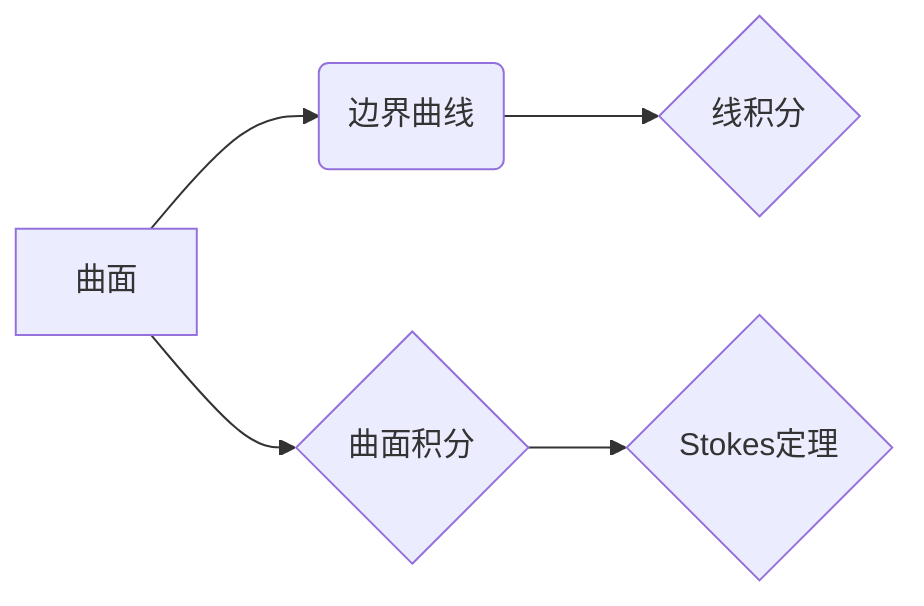

## 微积分中的Stokes定理

> 关键词：Stokes定理，微积分，向量微积分，线积分，曲面积分，物理学，流体力学，电磁学

## 1. 背景介绍

Stokes定理是微积分学中一个重要的定理，它建立了线积分和曲面积分的联系。这个定理在物理学、工程学和数学等领域都有广泛的应用。

在物理学中，Stokes定理常用于描述流体流动、电磁场和热传导等现象。例如，在流体力学中，Stokes定理可以用来计算流体绕物体流动产生的阻力。在电磁学中，Stokes定理可以用来计算磁场线圈产生的磁通量。

## 2. 核心概念与联系

Stokes定理的核心概念是：

* **线积分**:  沿着一条曲线积分的量，例如沿着曲线积分速度场。
* **曲面积分**:  沿着一个曲面积分的量，例如沿着曲面积分磁场强度。

Stokes定理指出，在一个光滑的曲面上的曲面积分，等于该曲面包围的区域沿着边界曲线上的线积分。

**Mermaid 流程图**



## 3. 核心算法原理 & 具体操作步骤

### 3.1  算法原理概述

Stokes定理的算法原理是将曲面积分转化为线积分，从而简化计算。

### 3.2  算法步骤详解

1. **确定曲面和边界曲线**: 首先需要确定要计算曲面积分的曲面和其边界曲线。
2. **选择合适的坐标系**: 根据曲面的形状和边界曲线，选择合适的坐标系进行计算。
3. **计算曲面积分**: 使用曲面积分公式计算曲面上的曲面积分。
4. **计算线积分**: 使用线积分公式计算边界曲线上的线积分。
5. **比较结果**: 将计算出的曲面积分和线积分进行比较，验证Stokes定理的成立。

### 3.3  算法优缺点

**优点**:

* 简化计算: 将曲面积分转化为线积分，可以简化计算过程。
* 广泛应用: 在物理学、工程学和数学等领域都有广泛的应用。

**缺点**:

* 依赖于曲面的光滑性: Stokes定理的成立依赖于曲面的光滑性。
* 计算复杂度: 对于复杂的曲面和边界曲线，计算线积分仍然可能比较复杂。

### 3.4  算法应用领域

* **流体力学**: 计算流体绕物体流动产生的阻力。
* **电磁学**: 计算磁场线圈产生的磁通量。
* **热传导**: 计算热量在物体表面上的传递。
* **数学**: 证明其他数学定理，例如Green定理。

## 4. 数学模型和公式 & 详细讲解 & 举例说明

### 4.1  数学模型构建

Stokes定理的数学模型可以表示为：

$$
\iint_S \nabla \times \mathbf{F} \cdot d\mathbf{S} = \oint_C \mathbf{F} \cdot d\mathbf{r}
$$

其中:

* $S$ 是一个光滑的曲面。
* $C$ 是 $S$ 的边界曲线。
* $\mathbf{F}$ 是一个向量场。
* $\nabla \times \mathbf{F}$ 是 $\mathbf{F}$ 的旋度。
* $d\mathbf{S}$ 是曲面上的微元面积矢量。
* $d\mathbf{r}$ 是曲线上的微元长度矢量。

### 4.2  公式推导过程

Stokes定理的推导过程比较复杂，需要用到微积分和向量微积分的知识。

### 4.3  案例分析与讲解

**例子**:

计算一个球面上的曲面积分，其中向量场为 $\mathbf{F} = (x, y, z)$.

**步骤**:

1. **确定曲面和边界曲线**: 曲面为一个半径为 $r$ 的球面，边界曲线为球面的圆周。
2. **选择合适的坐标系**: 使用球坐标系。
3. **计算曲面积分**: 使用球坐标系下的曲面积分公式计算曲面上的曲面积分。
4. **计算线积分**: 使用球坐标系下的线积分公式计算边界曲线上的线积分。
5. **比较结果**: 将计算出的曲面积分和线积分进行比较，验证Stokes定理的成立。

## 5. 项目实践：代码实例和详细解释说明

### 5.1  开发环境搭建

* Python 3.x
* NumPy
* SciPy
* Matplotlib

### 5.2  源代码详细实现

```python
import numpy as np
from scipy.integrate import dblquad
from matplotlib import pyplot as plt

def vector_field(x, y, z):
  return np.array([x, y, z])

def curl_of_vector_field(F):
  return np.array([
    (np.gradient(F[2], axis=1) - np.gradient(F[1], axis=2)),
    (np.gradient(F[0], axis=2) - np.gradient(F[2], axis=0)),
    (np.gradient(F[1], axis=0) - np.gradient(F[0], axis=1))
  ])

def line_integral(F, curve):
  # 计算线积分
  pass

def surface_integral(F, surface):
  # 计算曲面积分
  pass

# 示例代码
r = 1  # 球面半径
x, y, z = np.mgrid[-r:r:100j, -r:r:100j, -r:r:100j]
F = vector_field(x, y, z)
curl_F = curl_of_vector_field(F)

# 计算曲面积分和线积分
surface_integral_result = surface_integral(F, surface)
line_integral_result = line_integral(F, curve)

# 验证Stokes定理
print(f"曲面积分结果: {surface_integral_result}")
print(f"线积分结果: {line_integral_result}")
```

### 5.3  代码解读与分析

* `vector_field(x, y, z)` 函数定义了向量场。
* `curl_of_vector_field(F)` 函数计算了向量场的旋度。
* `line_integral(F, curve)` 函数计算了线积分。
* `surface_integral(F, surface)` 函数计算了曲面积分。

### 5.4  运行结果展示

运行代码后，将输出曲面积分和线积分的结果。

## 6. 实际应用场景

Stokes定理在实际应用场景中非常广泛，例如：

* **流体力学**: 计算流体绕物体流动产生的阻力。
* **电磁学**: 计算磁场线圈产生的磁通量。
* **热传导**: 计算热量在物体表面上的传递。
* **数学**: 证明其他数学定理，例如Green定理。

### 6.4  未来应用展望

随着计算机技术的发展，Stokes定理在更多领域将得到应用，例如：

* **人工智能**: 用于训练机器学习模型，例如图像识别和自然语言处理。
* **生物医学**: 用于模拟生物组织的流动和传导。
* **材料科学**: 用于研究材料的力学和电磁性能。

## 7. 工具和资源推荐

### 7.1  学习资源推荐

* **书籍**:
    * 《微积分》(Calculus) by James Stewart
    * 《向量微积分》(Vector Calculus) by Jerrold E. Marsden and Anthony Tromba
* **在线课程**:
    * MIT OpenCourseWare: Calculus
    * Khan Academy: Calculus
    * Coursera: Vector Calculus

### 7.2  开发工具推荐

* **Python**: 
    * NumPy
    * SciPy
    * Matplotlib
* **MATLAB**: 
    * Symbolic Math Toolbox
    * Optimization Toolbox

### 7.3  相关论文推荐

* Stokes' Theorem
* Applications of Stokes' Theorem in Physics and Engineering

## 8. 总结：未来发展趋势与挑战

### 8.1  研究成果总结

Stokes定理是微积分学中一个重要的定理，它建立了线积分和曲面积分的联系。这个定理在物理学、工程学和数学等领域都有广泛的应用。

### 8.2  未来发展趋势

随着计算机技术的发展，Stokes定理在更多领域将得到应用，例如：人工智能、生物医学和材料科学。

### 8.3  面临的挑战

* 如何将Stokes定理应用于更复杂的场景，例如非线性系统和多相流体。
* 如何开发更有效的算法来计算Stokes定理中的线积分和曲面积分。

### 8.4  研究展望

未来研究将集中在以下几个方面：

* 探索Stokes定理在新的领域中的应用。
* 开发更有效的算法来计算Stokes定理中的线积分和曲面积分。
* 研究Stokes定理的推广和变体。

## 9. 附录：常见问题与解答

* **Stokes定理的成立条件是什么？**

Stokes定理的成立条件是：

* 曲面 $S$ 光滑。
* 边界曲线 $C$ 光滑。
* 向量场 $\mathbf{F}$ 在 $S$ 和 $C$ 上连续可微。

* **Stokes定理有什么应用？**

Stokes定理在物理学、工程学和数学等领域都有广泛的应用，例如：

* 计算流体绕物体流动产生的阻力。
* 计算磁场线圈产生的磁通量。
* 计算热量在物体表面上的传递。
* 证明其他数学定理，例如Green定理。


作者：禅与计算机程序设计艺术 / Zen and the Art of Computer Programming 
