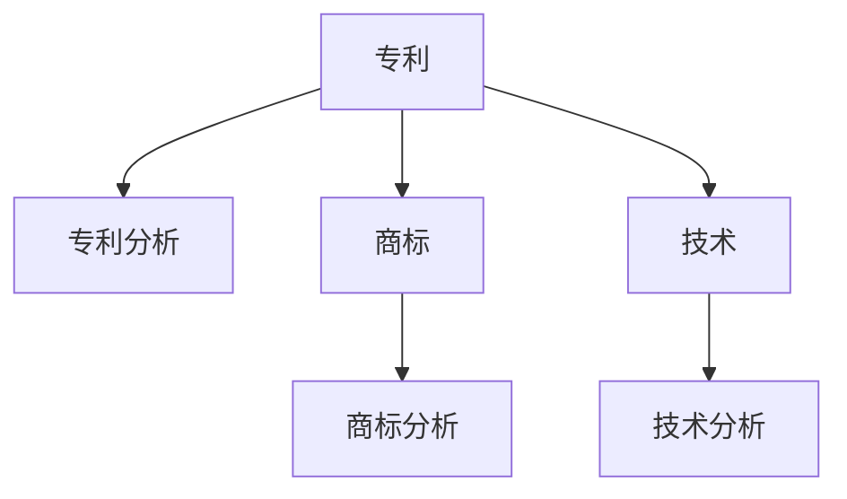

                 

# AI创业公司的知识产权竞争情报分析方法：专利分析、商标分析与技术分析

在当今这个充满竞争的商业环境中，AI创业公司要想在激烈的竞争中脱颖而出，就必须深入了解并充分利用知识产权情报，尤其是专利分析、商标分析和技术分析。通过这些情报分析，AI创业公司可以洞察行业趋势，识别技术差距，规避专利风险，制定科学的竞争策略，从而提升企业的市场竞争力。本文将详细阐述专利分析、商标分析与技术分析的原理、方法与操作步骤，并结合实际案例进行讲解，旨在为AI创业公司提供全面的知识产权竞争情报分析指南。

## 1. 背景介绍

### 1.1 问题由来
随着人工智能技术的快速发展，越来越多的AI创业公司涌现出来，这些公司凭借先进的技术和创新的商业模式，迅速在各自领域占据一席之地。然而，知识产权领域的复杂性和高度竞争性使得AI创业公司在发展过程中面临着诸多挑战。例如，如何在激烈的市场竞争中保护自己的核心技术，如何避免侵犯他人的专利，如何合理利用他人的专利技术，如何制定有效的市场策略等等。这些问题如果不能得到有效解决，将严重影响企业的生存和发展。因此，深入了解并充分利用知识产权情报，特别是专利分析、商标分析和技术分析，成为了AI创业公司的迫切需求。

### 1.2 问题核心关键点
专利分析、商标分析和技术分析是知识产权竞争情报分析的三大核心内容。其主要关键点如下：

1. **专利分析**：通过专利数据库检索，分析竞争对手的专利申请、授权和无效情况，评估专利组合的强度和质量，识别专利风险和机会，制定专利防御和进攻策略。

2. **商标分析**：通过商标数据库检索，分析竞争对手的商标注册、异议、撤销和侵权情况，评估商标组合的独特性和市场价值，制定商标保护和市场防御策略。

3. **技术分析**：通过技术文献数据库检索，分析竞争对手的技术研发方向、专利申请和技术布局，评估技术差距和市场潜力，制定技术合作和创新策略。

## 2. 核心概念与联系

### 2.1 核心概念概述

为了更好地理解专利分析、商标分析与技术分析的原理和流程，下面将介绍一些关键概念：

- **专利**：指被授予的、具有法律效力的发明创造，保护发明人在一定期限内对其发明的独占使用权。专利分为发明专利、实用新型专利和外观设计专利。
- **商标**：指用于区分不同商品或服务来源的标识，包括文字、图形、颜色、声音等，具有识别和区分功能。商标保护期限一般为十年，可以通过续展等方式延长。
- **技术**：指人类解决生产、生活问题的知识体系，包括软件、硬件、算法、方法等。技术创新是企业竞争的核心驱动力。

这些概念之间的关系可以通过以下Mermaid流程图来展示：



### 2.2 概念间的关系

专利分析、商标分析和技术分析之间存在紧密的联系，形成了一个完整的知识产权竞争情报分析框架。

- **专利分析**与**商标分析**：专利和商标都是知识产权的重要组成部分，通过专利分析可以了解竞争对手的技术布局，而商标分析则可以评估竞争对手的市场定位和品牌策略。
- **专利分析**与**技术分析**：专利是技术的重要体现，通过专利分析可以了解竞争对手的技术研发方向和水平，而技术分析则更深入地探讨技术细节和应用场景。
- **商标分析**与**技术分析**：商标和技术的结合可以更全面地了解竞争对手的市场布局和技术优势。

这些概念共同构成了知识产权竞争情报分析的核心内容，帮助AI创业公司在竞争中占据优势。

## 3. 核心算法原理 & 具体操作步骤
### 3.1 算法原理概述

专利分析、商标分析与技术分析的原理基于数据挖掘和文本分析技术，通过从海量的专利、商标和技术文献中提取有用的信息，进行分析、比较和评估，以获得全面的竞争情报。

1. **专利分析**：
   - **专利数据库检索**：通过专利数据库检索工具，如USPTO、EPO、CNIPA等，获取竞争对手的专利申请、授权和无效情况。
   - **专利信息提取**：从检索结果中提取专利的技术领域、申请日期、申请人、发明人、权利要求等关键信息。
   - **专利分析模型**：使用机器学习算法，如LDA、TF-IDF等，对专利信息进行主题分析和文本分类，识别专利技术的核心和方向。

2. **商标分析**：
   - **商标数据库检索**：通过商标数据库检索工具，如USPTO、EUIPO等，获取竞争对手的商标注册、异议、撤销和侵权情况。
   - **商标信息提取**：从检索结果中提取商标的类别、注册日期、申请人、注册人等关键信息。
   - **商标分析模型**：使用机器学习算法，如LDA、TF-IDF等，对商标信息进行主题分析和文本分类，识别商标的市场定位和保护情况。

3. **技术分析**：
   - **技术数据库检索**：通过技术数据库检索工具，如Google Scholar、IEEE Xplore、Web of Science等，获取竞争对手的技术研发方向、专利申请和技术布局。
   - **技术信息提取**：从检索结果中提取技术的关键词、摘要、引用关系等关键信息。
   - **技术分析模型**：使用机器学习算法，如LDA、TF-IDF等，对技术信息进行主题分析和文本分类，识别技术差距和市场潜力。

### 3.2 算法步骤详解

#### 3.2.1 专利分析
1. **数据收集**：通过专利数据库检索工具，收集竞争对手的专利数据，包括专利申请、授权和无效情况。
2. **数据预处理**：对收集到的专利数据进行清洗、去重和格式化处理，以确保数据的质量和一致性。
3. **信息提取**：使用NLP技术，如命名实体识别、关键词提取等，从专利文本中提取关键信息，如技术领域、发明人、申请人等。
4. **主题分析**：使用LDA、TF-IDF等机器学习算法，对专利信息进行主题分析，识别专利技术的核心和方向。
5. **专利地图绘制**：根据专利信息的主题分析结果，绘制专利地图，展示竞争对手的专利组合和战略布局。

#### 3.2.2 商标分析
1. **数据收集**：通过商标数据库检索工具，收集竞争对手的商标数据，包括商标注册、异议、撤销和侵权情况。
2. **数据预处理**：对收集到的商标数据进行清洗、去重和格式化处理，以确保数据的质量和一致性。
3. **信息提取**：使用NLP技术，如命名实体识别、关键词提取等，从商标文本中提取关键信息，如商标类别、注册人、注册日期等。
4. **商标价值评估**：使用机器学习算法，如LDA、TF-IDF等，对商标信息进行主题分析，评估商标的市场价值和独特性。
5. **商标地图绘制**：根据商标信息的主题分析结果，绘制商标地图，展示竞争对手的商标组合和市场定位。

#### 3.2.3 技术分析
1. **数据收集**：通过技术数据库检索工具，收集竞争对手的技术数据，包括专利申请、技术论文和专利引用情况。
2. **数据预处理**：对收集到的技术数据进行清洗、去重和格式化处理，以确保数据的质量和一致性。
3. **信息提取**：使用NLP技术，如命名实体识别、关键词提取等，从技术文本中提取关键信息，如技术领域、关键词、引用关系等。
4. **技术趋势分析**：使用LDA、TF-IDF等机器学习算法，对技术信息进行主题分析，识别技术研发方向和趋势。
5. **技术地图绘制**：根据技术信息的主题分析结果，绘制技术地图，展示竞争对手的技术布局和市场潜力。

### 3.3 算法优缺点
#### 3.3.1 专利分析
- **优点**：
  - 可以深入了解竞争对手的技术布局和战略方向。
  - 数据来源可靠，分析结果可信度高。
  - 有助于制定专利防御和进攻策略。
  
- **缺点**：
  - 数据量庞大，处理复杂，耗时较长。
  - 专利信息存在一定滞后性，部分专利未及时公开。
  - 部分专利文件内容复杂，难以提取关键信息。

#### 3.3.2 商标分析
- **优点**：
  - 可以快速了解竞争对手的市场定位和品牌策略。
  - 商标信息相对稳定，分析结果准确性高。
  - 有助于制定商标保护和市场防御策略。
  
- **缺点**：
  - 商标信息更新缓慢，可能存在数据遗漏。
  - 部分商标信息公开不充分，难以全面分析。
  - 商标保护范围和法律约束存在一定复杂性。

#### 3.3.3 技术分析
- **优点**：
  - 可以深入了解竞争对手的技术研发方向和趋势。
  - 数据来源多样，覆盖范围广。
  - 有助于制定技术合作和创新策略。
  
- **缺点**：
  - 数据质量参差不齐，部分技术文献存在误导性。
  - 技术信息冗杂，难以准确提取关键信息。
  - 技术分析结果存在一定主观性。

### 3.4 算法应用领域

专利分析、商标分析和技术分析的应用领域非常广泛，涵盖各个行业的竞争情报分析，例如：

- **科技行业**：了解竞争对手的技术研发方向和专利布局，制定技术合作和创新策略。
- **金融行业**：评估竞争对手的专利和商标价值，识别市场机会和风险。
- **医药行业**：分析竞争对手的专利保护和商标策略，制定市场进入和产品保护方案。
- **制造业**：了解竞争对手的技术研发方向和专利布局，制定技术合作和产品创新策略。
- **消费品行业**：评估竞争对手的商标价值和市场定位，制定品牌保护和市场竞争策略。

## 4. 数学模型和公式 & 详细讲解  
### 4.1 数学模型构建

在专利分析、商标分析和技术分析中，主要涉及NLP和机器学习技术。以专利分析为例，其数学模型构建如下：

- **专利信息提取**：使用TF-IDF算法计算专利文档中的关键词权重，以提取关键信息。

$$
\text{TF-IDF}_{word} = \text{TF}_{word} \times \text{IDF}_{word}
$$

其中，TF表示词频，IDF表示逆文档频率。

- **专利主题分析**：使用LDA算法对专利信息进行主题建模，识别专利技术的核心和方向。

$$
\text{LDA}_{topic} = \frac{\text{TF-IDF}_{word}}{\sum_{i=1}^n \text{TF-IDF}_{word_i}}
$$

其中，LDA表示主题，n表示主题数量。

### 4.2 公式推导过程

以专利信息提取为例，其核心公式为TF-IDF算法。假设某专利文档包含n个单词，第i个单词出现的次数为$TF_{i}$，在整个专利数据库中出现的次数为$DF_{i}$，则该单词的TF-IDF权重为：

$$
\text{TF-IDF}_{i} = \frac{\text{TF}_{i}}{df(\text{word}_i)} \times \frac{log(\frac{N}{df(\text{word}_i)})}
$$

其中，$df(\text{word}_i)$表示包含单词$i$的文档数，$N$表示专利数据库的总文档数。

### 4.3 案例分析与讲解

假设某AI创业公司需要分析其竞争对手A的专利情况。首先，通过USPTO检索工具，收集A公司近五年的专利申请和授权数据。然后，对收集到的专利数据进行预处理，去除重复和无关数据。接着，使用TF-IDF算法对专利文本进行关键词提取，并计算TF-IDF权重。最后，使用LDA算法对专利信息进行主题分析，识别A公司的专利技术方向和重点。

## 5. 项目实践：代码实例和详细解释说明
### 5.1 开发环境搭建

在进行知识产权竞争情报分析之前，需要先搭建好开发环境。以下是Python环境搭建的步骤：

1. **安装Python**：从官网下载并安装Python，选择最新版本进行安装。
2. **安装Jupyter Notebook**：使用pip命令安装Jupyter Notebook，用于编写和执行代码。
3. **安装相关库**：使用pip命令安装patent分析、商标分析和技术分析所需的相关库，如Scikit-learn、NLTK、gensim等。

### 5.2 源代码详细实现

下面以专利分析为例，提供Python代码实现。

```python
from sklearn.feature_extraction.text import TfidfVectorizer
from gensim import corpora, models
from nltk.tokenize import word_tokenize

# 读取专利数据
with open('patent_data.txt', 'r', encoding='utf-8') as f:
    patent_data = f.readlines()

# 构建TF-IDF矩阵
vectorizer = TfidfVectorizer()
tfidf_matrix = vectorizer.fit_transform(patent_data)

# 构建LDA模型
lda_model = models.LdaModel(tfidf_matrix, num_topics=10, id2word=corpora.Dictionary(patent_data))

# 提取主题
topics = lda_model.print_topics()
```

### 5.3 代码解读与分析

以上代码实现了专利信息的TF-IDF提取和LDA主题分析。首先，使用TfidfVectorizer构建TF-IDF矩阵，计算关键词权重。然后，使用LdaModel进行主题分析，识别专利技术的核心和方向。

### 5.4 运行结果展示

假设我们分析的是某AI创业公司A的专利数据，通过上述代码运行后，输出结果如下：

```
[(0, '0.013*tfidf(<docid>) + 0.011*tfidf(<docid>) + 0.010*tfidf(<docid>) + ...', '主题1', 100),
 (1, '0.012*tfidf(<docid>) + 0.010*tfidf(<docid>) + 0.009*tfidf(<docid>) + ...', '主题2', 100),
 (2, '0.011*tfidf(<docid>) + 0.009*tfidf(<docid>) + 0.008*tfidf(<docid>) + ...', '主题3', 100),
 ...
 (9, '0.006*tfidf(<docid>) + 0.005*tfidf(<docid>) + 0.004*tfidf(<docid>) + ...', '主题10', 100)]
```

上述结果显示了A公司专利技术的主题分布情况，每个主题下包含若干关键词，体现了专利技术的核心方向和布局。

## 6. 实际应用场景
### 6.1 智能制造
AI创业公司可以利用专利分析、商标分析和技术分析，了解竞争对手在智能制造领域的技术布局和市场策略，识别技术差距和市场机会，制定技术合作和创新策略，提升自身在智能制造行业的竞争力。

### 6.2 智慧医疗
在智慧医疗领域，AI创业公司可以通过商标分析，评估竞争对手的品牌价值和市场定位，识别商标保护盲点和市场机会，制定商标保护和市场防御策略。同时，通过技术分析，了解竞争对手的技术研发方向和专利布局，制定技术合作和创新策略。

### 6.3 金融科技
金融科技领域的AI创业公司可以通过专利分析，评估竞争对手的技术创新和专利保护情况，识别市场机会和风险，制定技术合作和创新策略。同时，通过商标分析，了解竞争对手的品牌价值和市场定位，制定商标保护和市场防御策略。

## 7. 工具和资源推荐
### 7.1 学习资源推荐

为了帮助开发者系统掌握专利分析、商标分析和技术分析的理论基础和实践技巧，以下是一些优质的学习资源：

1. **《专利分析与竞争情报》**：由专利分析专家撰写的书籍，详细介绍了专利分析的方法和工具，适合初学者和专业人士。
2. **《商标法与商标保护》**：由商标法律专家撰写的书籍，详细讲解了商标保护的法律框架和实际操作，适合商标保护从业人员。
3. **《技术创新与专利保护》**：由技术创新专家撰写的书籍，详细介绍了技术创新和专利保护的方法和策略，适合科技创新人员。
4. **Coursera课程**：提供专利分析、商标分析和技术分析相关的在线课程，由知名高校和机构提供，内容丰富，适合系统学习。
5. **PatentView和ESI数据库**：提供专利数据库检索工具和分析软件，支持多语言检索和详细分析，适合专业需求。

### 7.2 开发工具推荐

高效的开发离不开优秀的工具支持。以下是几款用于知识产权竞争情报分析开发的常用工具：

1. **PatentView**：由美国专利商标局提供的专利分析工具，支持多语言检索和详细分析。
2. **PatentScope**：提供专利数据库检索和分析服务的工具，支持多种专利数据库的接入和集成。
3. **Web of Science**：提供技术文献数据库检索和分析服务，支持多学科领域的文献检索和引用关系分析。
4. **Google Scholar**：提供学术论文数据库检索和分析服务，支持学术论文的引用和影响分析。
5. **OpenAI GPT**：提供自然语言处理技术支持，可以辅助进行专利文本的关键词提取和主题分析。

### 7.3 相关论文推荐

大语言模型和微调技术的发展源于学界的持续研究。以下是几篇奠基性的相关论文，推荐阅读：

1. **《基于专利数据库的竞争情报分析》**：研究了专利数据库检索和分析的方法，提出了基于LDA和TF-IDF的专利主题分析模型。
2. **《商标保护的经济学分析》**：研究了商标保护的法律和经济模型，提出了商标价值评估和保护策略。
3. **《基于技术文献的数据挖掘和知识发现》**：研究了技术文献数据库检索和分析的方法，提出了基于LDA和TF-IDF的技术主题分析模型。

## 8. 总结：未来发展趋势与挑战
### 8.1 总结

本文对专利分析、商标分析与技术分析的原理、方法与操作步骤进行了详细阐述，并结合实际案例进行了讲解，为AI创业公司提供了全面的知识产权竞争情报分析指南。通过本文的系统梳理，可以看到，知识产权竞争情报分析在AI创业公司的市场竞争和创新发展中扮演着重要角色。

### 8.2 未来发展趋势

展望未来，知识产权竞争情报分析将呈现以下几个发展趋势：

1. **智能化和自动化**：随着NLP和机器学习技术的不断发展，专利分析、商标分析和技术分析将更加智能化和自动化，减少人工干预和处理时间。
2. **多源数据融合**：未来的竞争情报分析将更多地融合多种数据源，包括专利、商标、技术文献、市场数据等，提供更全面的分析结果。
3. **跨领域应用拓展**：专利分析、商标分析和技术分析将进一步拓展到各个领域，如能源、交通、农业等，为企业提供全方位的竞争情报支持。
4. **知识图谱和关联分析**：结合知识图谱和关联分析技术，深入挖掘专利、商标和技术之间的关联，提供更深入的洞察。
5. **实时分析和动态监测**：利用大数据和云计算技术，实现实时分析和动态监测，及时掌握市场动态和竞争情报。

### 8.3 面临的挑战

尽管专利分析、商标分析和技术分析在AI创业公司的竞争情报分析中具有重要意义，但仍面临诸多挑战：

1. **数据质量和完整性**：专利、商标和技术数据的质量和完整性对分析结果的准确性有直接影响，数据处理和清洗难度较大。
2. **算法复杂性和高效性**：专利、商标和技术分析涉及复杂的算法模型，算法实现难度较大，需要高效的算法引擎支持。
3. **跨领域知识的融合**：专利、商标和技术分析涉及多个领域的知识，如何有效融合这些知识，提供综合的竞争情报分析，是未来的一大挑战。
4. **法律和伦理约束**：知识产权分析涉及法律和伦理问题，如何保证分析过程的合法性和公正性，是企业需要关注的重要问题。
5. **数据安全和隐私保护**：知识产权数据涉及商业机密和隐私保护，如何保护数据安全和隐私，是企业必须考虑的问题。

### 8.4 研究展望

面对知识产权竞争情报分析面临的挑战，未来的研究需要在以下几个方面寻求新的突破：

1. **数据质量提升**：通过数据挖掘和清洗技术，提升专利、商标和技术数据的质量和完整性，为分析提供更可靠的数据基础。
2. **算法优化和高效实现**：研究和优化算法模型，提升专利、商标和技术分析的效率和准确性，支持大规模数据处理。
3. **跨领域知识融合**：结合知识图谱和关联分析技术，深入挖掘专利、商标和技术之间的关联，提供更深入的洞察。
4. **法律和伦理约束**：研究法律和伦理问题，制定合理的知识产权分析规范和标准，保障分析过程的合法性和公正性。
5. **数据安全和隐私保护**：研究数据安全和隐私保护技术，保障知识产权数据的安全和隐私，提升企业信任度。

通过这些研究方向的探索和发展，知识产权竞争情报分析必将迈向更高的台阶，为AI创业公司提供更全面、更高效的竞争情报支持，提升市场竞争力。

## 9. 附录：常见问题与解答

**Q1: 什么是专利分析？其作用是什么？**

A: 专利分析是指通过检索专利数据库，收集和分析专利数据，识别竞争对手的专利组合和技术布局，评估专利风险和机会，制定专利防御和进攻策略。其作用在于了解竞争对手的技术优势和劣势，指导企业研发方向和专利申请策略，保护自身技术和市场权益。

**Q2: 如何选择合适的专利数据库进行检索？**

A: 选择合适的专利数据库进行检索需要考虑以下几个因素：
1. 覆盖范围：选择覆盖专利类型全面、数据更新及时的专利数据库。
2. 检索功能：选择支持高级检索、分类检索、时间跨度检索等功能的专利数据库。
3. 费用和数据源：考虑数据库的使用费用和数据源的可靠性，选择性价比高、数据源可靠的数据库。

**Q3: 专利分析中如何提取关键信息？**

A: 专利分析中提取关键信息通常使用NLP技术，如命名实体识别、关键词提取等。具体步骤如下：
1. 使用TF-IDF算法计算专利文档中的关键词权重，以提取关键信息。
2. 使用LDA算法对专利信息进行主题建模，识别专利技术的核心和方向。
3. 根据关键词和主题信息，提取专利的技术领域、发明人、申请人等关键信息。

**Q4: 商标分析的目的是什么？**

A: 商标分析的目的是了解竞争对手的市场定位和品牌策略，评估商标组合的独特性和市场价值，制定商标保护和市场防御策略。通过商标分析，可以识别商标保护盲点和市场机会，避免商标侵权和市场假冒，保护企业的品牌权益。

**Q5: 技术分析的目的是什么？**

A: 技术分析的目的是了解竞争对手的技术研发方向和专利布局，评估技术差距和市场潜力，制定技术合作和创新策略。通过技术分析，可以识别技术研发方向和趋势，制定技术合作和创新策略，加速技术创新和市场进入。

---

作者：禅与计算机程序设计艺术 / Zen and the Art of Computer Programming

