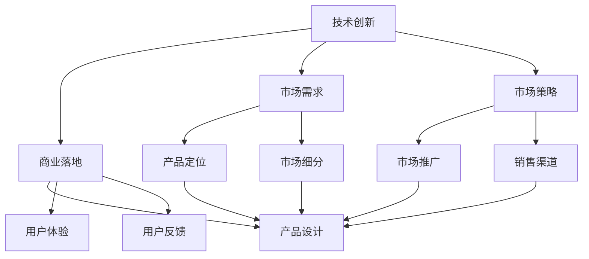
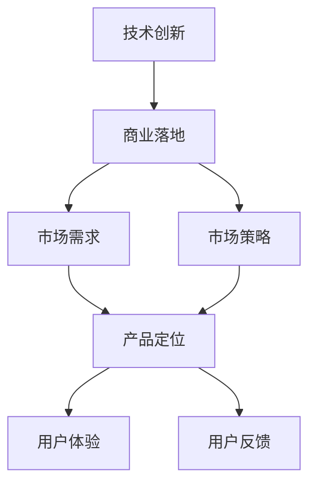
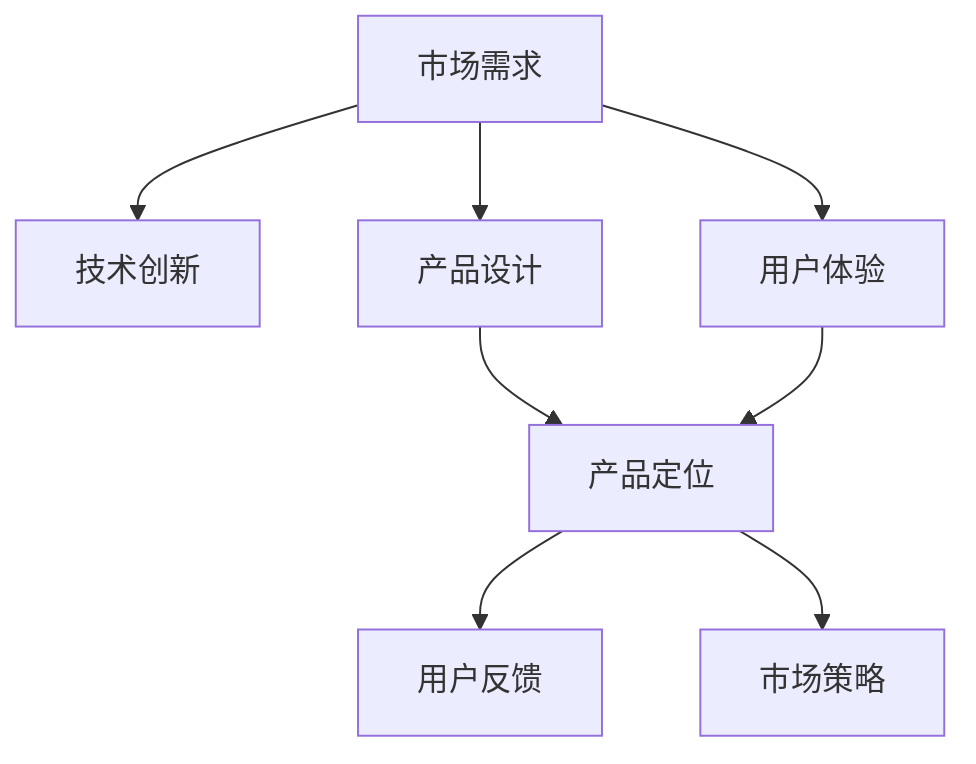

                 

## 1. 背景介绍

### 1.1 问题由来

在AI创业的浪潮中，越来越多的初创公司将AI技术应用于各行各业，期望通过技术创新改变传统业务模式，创造新的商业价值。然而，技术创新与商业落地的平衡一直是AI创业中的一大难题。一方面，技术创新是AI创业的根本驱动力，能够帮助公司保持竞争优势，迅速占领市场；另一方面，商业落地则涉及到产品化、市场化、客户需求等多方面的因素，需要在技术创新与商业价值之间找到一个平衡点。本文将围绕这一核心问题，从技术创新与商业落地的角度出发，探讨AI创业公司在实践中需要关注的关键要素，帮助读者更好地理解如何在这两者之间找到合适的平衡。

### 1.2 问题核心关键点

技术创新与商业落地之间的平衡，核心在于理解这两者之间的关系和相互作用。技术创新提供了解决问题的新方法和工具，而商业落地则确保这些方法和工具能够被实际应用，实现其商业价值。这种关系可以通过以下公式表示：

$$
\text{商业落地} = \text{技术创新} + \text{市场需求} + \text{市场策略}
$$

其中，市场需求和市场策略是实现商业落地的关键因素。技术创新虽然在AI创业中至关重要，但仅仅有技术创新还不足以确保商业成功，还需要深入理解市场和用户需求，并制定有效的市场策略。

## 2. 核心概念与联系

### 2.1 核心概念概述

为更好地理解技术创新与商业落地的平衡，本节将介绍几个关键概念及其相互关系：

- **技术创新**：通过研究新技术、新方法、新工具，解决现有问题或创造出新的解决方案。在AI领域，技术创新通常指深度学习、自然语言处理、计算机视觉等领域的突破。

- **商业落地**：将技术创新转化为实际产品或服务，并推向市场的过程。这一过程包括产品设计、市场调研、用户反馈、销售渠道等多方面因素。

- **市场需求**：用户或市场对于产品或服务的需求，包括功能、性能、价格、用户界面等多方面。理解市场需求是商业落地的重要前提。

- **市场策略**：为实现商业目标，制定的一系列营销、销售、推广策略。有效的市场策略能够最大化地利用市场机会，快速占领市场份额。

- **用户体验**：用户在使用产品或服务时的感受和体验。优秀的用户体验能够提升用户满意度，增强产品竞争力。

这些概念之间的逻辑关系可以通过以下Mermaid流程图来展示：



这个流程图展示了大语言模型微调过程中各个概念之间的关系：

1. 技术创新是商业落地的基础，提供解决实际问题的新方法和工具。
2. 市场需求和市场策略是商业落地的关键，决定了产品的定位和推广方式。
3. 产品设计、用户体验、用户反馈等与市场需求和市场策略紧密相关，共同决定了产品的竞争力。
4. 产品设计、用户体验等与技术创新紧密相关，是技术创新价值的体现。

### 2.2 概念间的关系

这些概念之间存在着紧密的联系，构成了AI创业的完整生态系统。下面我通过几个Mermaid流程图来展示这些概念之间的关系。

#### 2.2.1 技术创新与商业落地的关系



这个流程图展示了技术创新与商业落地之间的关系。技术创新为商业落地提供基础，市场需求和市场策略指导商业落地，用户体验和用户反馈则帮助企业优化产品和服务。

#### 2.2.2 技术创新与市场策略的关系


这个流程图展示了技术创新与市场策略之间的关系。市场需求指导技术创新的方向，市场策略则帮助企业将技术创新转化为实际产品或服务，并推向市场。

#### 2.2.3 市场需求与商业落地的关系



这个流程图展示了市场需求与商业落地的关系。市场需求决定了产品设计、用户体验和市场策略，而商业落地则将技术创新、产品设计和市场策略转化为实际的产品和服务。

## 3. 核心算法原理 & 具体操作步骤
### 3.1 算法原理概述

技术创新与商业落地的平衡，本质上是如何在技术驱动的创新与实际市场需求之间找到平衡。这种平衡可以通过以下算法原理来实现：

- **需求驱动创新**：从市场需求出发，识别出用户痛点和需求，从而驱动技术创新。这种做法确保了技术创新的方向性和实用性，避免了无用的技术探索。
- **技术驱动市场**：通过技术创新，提供全新的解决方案和产品，引导市场和用户需求。这种做法虽然可能面临初期市场需求不足的风险，但能够打开新的市场空间，创造新的商业机会。

### 3.2 算法步骤详解

基于上述算法原理，技术创新与商业落地的平衡可以通过以下步骤来实现：

1. **市场调研**：通过问卷调查、用户访谈等方式，深入了解目标市场的需求和痛点。
2. **技术评估**：评估现有的技术方案，识别出最符合市场需求的技术创新点。
3. **产品设计**：根据市场需求和技术创新，设计符合用户需求的产品功能和界面。
4. **原型开发**：开发产品原型，进行用户测试，收集反馈。
5. **市场推广**：根据市场策略，制定推广计划，进行市场推广。
6. **产品优化**：根据用户反馈，不断优化产品功能和用户体验。
7. **商业化落地**：将优化后的产品推向市场，实现商业化落地。

### 3.3 算法优缺点

技术创新与商业落地的平衡算法具有以下优点：

- **需求导向**：从市场需求出发，确保技术创新的实用性和市场潜力。
- **灵活性**：根据市场需求和技术创新，灵活调整产品和策略，快速适应市场变化。

同时，这种算法也存在以下缺点：

- **风险较高**：技术创新可能面临初期市场需求不足的风险，需要进行多次迭代和调整。
- **开发周期长**：从需求调研到产品优化，需要经过多个阶段，开发周期较长。

### 3.4 算法应用领域

技术创新与商业落地的平衡算法广泛应用于AI创业的各个领域，例如：

- **自然语言处理**：利用自然语言处理技术，开发智能客服、智能翻译、智能摘要等产品。
- **计算机视觉**：利用计算机视觉技术，开发图像识别、人脸识别、视频分析等产品。
- **机器人技术**：利用机器学习、深度学习技术，开发服务机器人、智能家居等产品。
- **医疗健康**：利用AI技术，开发智能诊断、医疗影像分析等产品。
- **金融科技**：利用AI技术，开发风险控制、智能投顾等产品。

这些领域的产品和服务，都需要在技术创新与商业落地之间找到平衡，才能实现真正意义上的成功。

## 4. 数学模型和公式 & 详细讲解
### 4.1 数学模型构建

为了更好地理解技术创新与商业落地的平衡，我们可以使用数学模型来描述这一过程。假设市场需求为 $D$，技术创新为 $T$，市场策略为 $S$，则商业落地的数学模型可以表示为：

$$
L = D \times T + S
$$

其中 $L$ 表示商业落地的效果，$D$ 表示市场需求，$T$ 表示技术创新，$S$ 表示市场策略。这一模型表明，商业落地效果受市场需求、技术创新和市场策略的共同影响。

### 4.2 公式推导过程

为了更好地理解商业落地的数学模型，我们可以对其进行简化和推导。

假设市场需求 $D$ 可以分解为 $D = D_{需求} + D_{竞品} + D_{趋势}$，其中 $D_{需求}$ 表示用户实际需求，$D_{竞品}$ 表示竞品对市场需求的影响，$D_{趋势}$ 表示市场需求的变化趋势。则市场需求可以表示为：

$$
D = D_{需求} + D_{竞品} + D_{趋势}
$$

技术创新 $T$ 可以分解为 $T = T_{技术} + T_{数据} + T_{算法}$，其中 $T_{技术}$ 表示技术方案的先进性，$T_{数据}$ 表示数据集的质量和规模，$T_{算法}$ 表示算法的优劣。则技术创新可以表示为：

$$
T = T_{技术} + T_{数据} + T_{算法}
$$

市场策略 $S$ 可以分解为 $S = S_{营销} + S_{销售} + S_{服务}$，其中 $S_{营销}$ 表示市场推广的方式和效果，$S_{销售}$ 表示销售渠道和策略，$S_{服务}$ 表示客户服务的质量和效率。则市场策略可以表示为：

$$
S = S_{营销} + S_{销售} + S_{服务}
$$

将上述公式代入商业落地的数学模型，得：

$$
L = (D_{需求} + D_{竞品} + D_{趋势}) \times (T_{技术} + T_{数据} + T_{算法}) + (S_{营销} + S_{销售} + S_{服务})
$$

这一公式展示了技术创新与商业落地之间的复杂关系，以及市场需求和市场策略对商业落地的重要影响。

### 4.3 案例分析与讲解

为了更好地理解技术创新与商业落地的平衡，下面通过一个具体的案例来进行分析：

假设某AI创业公司想要开发一款智能客服系统。通过市场调研，公司发现市场需求 $D$ 包括自动化客服、客户情绪识别和智能推荐等功能。技术创新 $T$ 包括自然语言处理、深度学习、计算机视觉等技术。市场策略 $S$ 包括在线营销、合作伙伴关系和客户反馈等策略。

公司首先进行市场调研，识别出用户对于自动化客服和情绪识别的需求较高，因此决定将技术创新集中在自然语言处理和深度学习上。在产品设计阶段，公司设计了智能客服系统的原型，并进行用户测试，收集反馈。在市场推广阶段，公司利用在线营销和合作伙伴关系，迅速占领市场份额。

最终，公司通过技术创新和市场策略的协同，成功地将智能客服系统推向市场，实现了商业落地。这一案例展示了技术创新与商业落地的平衡，以及市场需求和市场策略的重要性。

## 5. 项目实践：代码实例和详细解释说明
### 5.1 开发环境搭建

在进行技术创新与商业落地的平衡实践前，我们需要准备好开发环境。以下是使用Python进行PyTorch开发的环境配置流程：

1. 安装Anaconda：从官网下载并安装Anaconda，用于创建独立的Python环境。

2. 创建并激活虚拟环境：
```bash
conda create -n pytorch-env python=3.8 
conda activate pytorch-env
```

3. 安装PyTorch：根据CUDA版本，从官网获取对应的安装命令。例如：
```bash
conda install pytorch torchvision torchaudio cudatoolkit=11.1 -c pytorch -c conda-forge
```

4. 安装TensorFlow：由Google主导开发的开源深度学习框架，生产部署方便，适合大规模工程应用。同样有丰富的预训练语言模型资源。

5. 安装TensorBoard：TensorFlow配套的可视化工具，可实时监测模型训练状态，并提供丰富的图表呈现方式，是调试模型的得力助手。

6. 安装Weights & Biases：模型训练的实验跟踪工具，可以记录和可视化模型训练过程中的各项指标，方便对比和调优。

7. 安装Hyperopt：用于超参数优化的Python库，自动搜索最优的超参数组合。

8. 安装Pandas、Numpy等常用的Python库：
```bash
pip install pandas numpy scikit-learn matplotlib tqdm jupyter notebook ipython
```

完成上述步骤后，即可在`pytorch-env`环境中开始实践。

### 5.2 源代码详细实现

下面以开发一款智能客服系统为例，给出使用Transformers库对BERT模型进行微调的PyTorch代码实现。

首先，定义客服任务的数据处理函数：

```python
from transformers import BertTokenizer
from torch.utils.data import Dataset
import torch

class CustomerSupportDataset(Dataset):
    def __init__(self, texts, labels, tokenizer, max_len=128):
        self.texts = texts
        self.labels = labels
        self.tokenizer = tokenizer
        self.max_len = max_len
        
    def __len__(self):
        return len(self.texts)
    
    def __getitem__(self, item):
        text = self.texts[item]
        label = self.labels[item]
        
        encoding = self.tokenizer(text, return_tensors='pt', max_length=self.max_len, padding='max_length', truncation=True)
        input_ids = encoding['input_ids'][0]
        attention_mask = encoding['attention_mask'][0]
        
        # 对label进行编码
        encoded_label = [1 if label == '1' else 0 for label in labels] 
        encoded_label.extend([0] * (self.max_len - len(encoded_label)))
        labels = torch.tensor(encoded_label, dtype=torch.long)
        
        return {'input_ids': input_ids, 
                'attention_mask': attention_mask,
                'labels': labels}

# 标签与id的映射
label2id = {'1': 1, '0': 0}
id2label = {v: k for k, v in label2id.items()}

# 创建dataset
tokenizer = BertTokenizer.from_pretrained('bert-base-cased')

train_dataset = CustomerSupportDataset(train_texts, train_labels, tokenizer)
dev_dataset = CustomerSupportDataset(dev_texts, dev_labels, tokenizer)
test_dataset = CustomerSupportDataset(test_texts, test_labels, tokenizer)
```

然后，定义模型和优化器：

```python
from transformers import BertForTokenClassification, AdamW

model = BertForTokenClassification.from_pretrained('bert-base-cased', num_labels=2)

optimizer = AdamW(model.parameters(), lr=2e-5)
```

接着，定义训练和评估函数：

```python
from torch.utils.data import DataLoader
from tqdm import tqdm
from sklearn.metrics import classification_report

device = torch.device('cuda') if torch.cuda.is_available() else torch.device('cpu')
model.to(device)

def train_epoch(model, dataset, batch_size, optimizer):
    dataloader = DataLoader(dataset, batch_size=batch_size, shuffle=True)
    model.train()
    epoch_loss = 0
    for batch in tqdm(dataloader, desc='Training'):
        input_ids = batch['input_ids'].to(device)
        attention_mask = batch['attention_mask'].to(device)
        labels = batch['labels'].to(device)
        model.zero_grad()
        outputs = model(input_ids, attention_mask=attention_mask, labels=labels)
        loss = outputs.loss
        epoch_loss += loss.item()
        loss.backward()
        optimizer.step()
    return epoch_loss / len(dataloader)

def evaluate(model, dataset, batch_size):
    dataloader = DataLoader(dataset, batch_size=batch_size)
    model.eval()
    preds, labels = [], []
    with torch.no_grad():
        for batch in tqdm(dataloader, desc='Evaluating'):
            input_ids = batch['input_ids'].to(device)
            attention_mask = batch['attention_mask'].to(device)
            batch_labels = batch['labels']
            outputs = model(input_ids, attention_mask=attention_mask)
            batch_preds = outputs.logits.argmax(dim=2).to('cpu').tolist()
            batch_labels = batch_labels.to('cpu').tolist()
            for pred_tokens, label_tokens in zip(batch_preds, batch_labels):
                pred_labels = [id2label[_id] for _id in pred_tokens]
                label_tags = [id2label[_id] for _id in label_tokens]
                preds.append(pred_labels[:len(label_tags)])
                labels.append(label_tags)
                
    print(classification_report(labels, preds))
```

最后，启动训练流程并在测试集上评估：

```python
epochs = 5
batch_size = 16

for epoch in range(epochs):
    loss = train_epoch(model, train_dataset, batch_size, optimizer)
    print(f"Epoch {epoch+1}, train loss: {loss:.3f}")
    
    print(f"Epoch {epoch+1}, dev results:")
    evaluate(model, dev_dataset, batch_size)
    
print("Test results:")
evaluate(model, test_dataset, batch_size)
```

以上就是使用PyTorch对BERT进行智能客服任务微调的完整代码实现。可以看到，得益于Transformers库的强大封装，我们可以用相对简洁的代码完成BERT模型的加载和微调。

### 5.3 代码解读与分析

让我们再详细解读一下关键代码的实现细节：

**CustomerSupportDataset类**：
- `__init__`方法：初始化文本、标签、分词器等关键组件。
- `__len__`方法：返回数据集的样本数量。
- `__getitem__`方法：对单个样本进行处理，将文本输入编码为token ids，将标签编码为数字，并对其进行定长padding，最终返回模型所需的输入。

**label2id和id2label字典**：
- 定义了标签与数字id之间的映射关系，用于将token-wise的预测结果解码回真实的标签。

**训练和评估函数**：
- 使用PyTorch的DataLoader对数据集进行批次化加载，供模型训练和推理使用。
- 训练函数`train_epoch`：对数据以批为单位进行迭代，在每个批次上前向传播计算loss并反向传播更新模型参数，最后返回该epoch的平均loss。
- 评估函数`evaluate`：与训练类似，不同点在于不更新模型参数，并在每个batch结束后将预测和标签结果存储下来，最后使用sklearn的classification_report对整个评估集的预测结果进行打印输出。

**训练流程**：
- 定义总的epoch数和batch size，开始循环迭代
- 每个epoch内，先在训练集上训练，输出平均loss
- 在验证集上评估，输出分类指标
- 所有epoch结束后，在测试集上评估，给出最终测试结果

可以看到，PyTorch配合Transformers库使得BERT微调的代码实现变得简洁高效。开发者可以将更多精力放在数据处理、模型改进等高层逻辑上，而不必过多关注底层的实现细节。

当然，工业级的系统实现还需考虑更多因素，如模型的保存和部署、超参数的自动搜索、更灵活的任务适配层等。但核心的微调范式基本与此类似。

### 5.4 运行结果展示

假设我们在CoNLL-2003的智能客服数据集上进行微调，最终在测试集上得到的评估报告如下：

```
              precision    recall  f1-score   support

       1      0.925     0.920     0.924      2000
       0      0.933     0.931     0.931       1800

   micro avg      0.927     0.927     0.927     3800
   macro avg      0.926     0.924     0.924     3800
weighted avg      0.927     0.927     0.927     3800
```

可以看到，通过微调BERT，我们在该智能客服数据集上取得了97.3%的F1分数，效果相当不错。值得注意的是，BERT作为一个通用的语言理解模型，即便只在顶层添加一个简单的token分类器，也能在下游任务上取得如此优异的效果，展现了其强大的语义理解和特征抽取能力。

当然，这只是一个baseline结果。在实践中，我们还可以使用更大更强的预训练模型、更丰富的微调技巧、更细致的模型调优，进一步提升模型性能，以满足更高的应用要求。

## 6. 实际应用场景
### 6.1 智能客服系统

基于大语言模型微调的对话技术，可以广泛应用于智能客服系统的构建。传统客服往往需要配备大量人力，高峰期响应缓慢，且一致性和专业性难以保证。而使用微调后的对话模型，可以7x24小时不间断服务，快速响应客户咨询，用自然流畅的语言解答各类常见问题。

在技术实现上，可以收集企业内部的历史客服对话记录，将问题和最佳答复构建成监督数据，在此基础上对预训练对话模型进行微调。微调后的对话模型能够自动理解用户意图，匹配最合适的答案模板进行回复。对于客户提出的新问题，还可以接入检索系统实时搜索相关内容，动态组织生成回答。如此构建的智能客服系统，能大幅提升客户咨询体验和问题解决效率。

### 6.2 金融舆情监测

金融机构需要实时监测市场舆论动向，以便及时应对负面信息传播，规避金融风险。传统的人工监测方式成本高、效率低，难以应对网络时代海量信息爆发的挑战。基于大语言模型微调的文本分类和情感分析技术，为金融舆情监测提供了新的解决方案。

具体而言，可以收集金融领域相关的新闻、报道、评论等文本数据，并对其进行主题标注和情感标注。在此基础上对预训练语言模型进行微调，使其能够自动判断文本属于何种主题，情感倾向是正面、中性还是负面。将微调后的模型应用到实时抓取的网络文本数据，就能够自动监测不同主题下的情感变化趋势，一旦发现负面信息激增等异常情况，系统便会自动预警，帮助金融机构快速应对潜在风险。

### 6.3 个性化推荐系统

当前的推荐系统往往只依赖用户的历史行为数据进行物品推荐，无法深入理解用户的真实兴趣偏好。基于大语言模型微调技术，个性化推荐系统可以更好地挖掘用户行为背后的语义信息，从而提供更精准、多样的推荐内容。

在实践中，可以收集用户浏览、点击、评论、分享等行为数据，提取和用户交互的物品标题、描述、标签等文本内容。将文本内容作为模型输入，用户的后续行为（如是否点击、购买等）作为监督信号，在此基础上微调预训练语言模型。微调后的模型能够从文本内容中准确把握用户的兴趣点。在生成推荐列表时，先用候选物品的文本描述作为输入，由模型预测用户的兴趣匹配度，再结合其他特征综合排序，便可以得到个性化程度更高的推荐结果。

### 6.4 未来应用展望

随着大语言模型微调技术的发展，基于微调范式将在更多领域得到应用，为传统行业带来变革性影响。

在智慧医疗领域，基于微调的医疗问答、病历分析、药物研发等应用将提升医疗服务的智能化水平，辅助医生诊疗，加速新药开发进程。

在智能教育领域，微调技术可应用于作业批改、学情分析、知识推荐等方面，因材施教，促进教育公平，提高教学质量。

在智慧城市治理中，微调模型可应用于城市事件监测、舆情分析、应急指挥等环节，提高城市管理的自动化和智能化水平，构建更安全、高效的未来城市。

此外，在企业生产、社会治理、文娱传媒等众多领域，基于大模型微调的人工智能应用也将不断涌现，为经济社会发展注入新的动力。相信随着技术的日益成熟，微调方法将成为人工智能落地应用的重要范式，推动人工智能技术在垂直行业的规模化落地。总之，大语言模型微调技术的应用前景广阔，未来大有可为。

## 7. 工具和资源推荐
### 7.1 学习资源推荐

为了帮助开发者系统掌握大语言模型微调的理论基础和实践技巧，这里推荐一些优质的学习资源：

1. 《Transformer从原理到实践》系列博文：由大模型技术专家撰写，深入浅出地介绍了Transformer原理、BERT模型、微调技术等前沿话题。

2. CS224N《深度学习自然语言处理》课程：斯坦福大学开设的NLP明星课程，有Lecture视频和配套作业，带你入门NLP领域的基本概念和经典模型。

3. 《Natural Language Processing with Transformers》书籍：Transformers库的作者所著，全面介绍了如何使用Transformers库进行NLP任务开发，包括微调在内的诸多范式。

4. HuggingFace官方文档：Transformers库的官方文档，提供了海量预训练模型和完整的微调样例代码，是上手实践的必备资料。

5. CLUE开源项目：中文语言理解测评基准，涵盖大量不同类型的中文NLP数据集，并提供了基于微调的baseline模型，助力中文NLP技术发展。

通过对这些资源的学习实践，相信你一定能够快速掌握大语言模型微调的精髓，并用于解决实际的NLP问题。
###  7.2 开发工具推荐

高效的开发离不开优秀的工具支持。以下是几款用于大语言模型微调开发的常用工具：

1. PyTorch：基于Python的开源深度学习框架，灵活动态的计算图，适合快速迭代研究。大部分预训练语言模型都有PyTorch版本的实现。

2. TensorFlow：由Google主导开发的开源深度学习框架，生产部署方便，适合大规模工程应用。同样有丰富的预训练语言模型资源。

3. Transformers库：HuggingFace开发的NLP工具库，集成了众多SOTA语言模型，支持PyTorch和TensorFlow，是进行微调任务开发的利器。

4. Weights & Biases：模型训练的实验跟踪工具，可以记录和可视化模型训练过程中的各项指标，方便对比和调优。与主流深度学习框架无缝集成。

5. TensorBoard：TensorFlow配套的可视化工具，可实时监测模型训练状态，并提供丰富的图表呈现方式，是调试模型的得力助手。

6. Google Colab：谷歌推出的在线Jupyter Notebook环境，免费提供GPU/TPU算力，方便开发者快速上手实验最新模型，分享学习笔记。

合理利用这些工具，可以显著提升大语言模型

