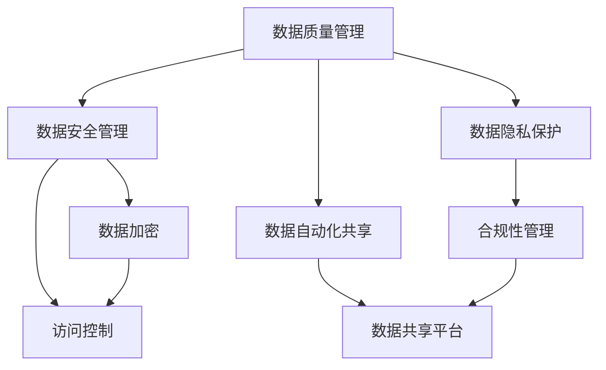
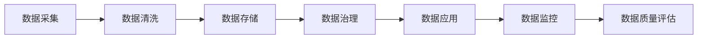

                 

# AI创业：数据管理的核心做法

> 关键词：AI创业, 数据管理, 数据治理, 数据质量, 数据隐私, 数据安全, 数据自动化, 数据共享

## 1. 背景介绍

### 1.1 问题由来

在当今这个数据驱动的时代，AI创业的成功与否，在很大程度上取决于数据的质量和治理能力。然而，数据管理并不是一项简单的任务，它涉及到数据采集、存储、处理、分析和应用等多个环节，需要企业具备系统化、高效化的数据管理能力。很多AI创业公司由于数据管理不当，最终导致技术落地困难，甚至项目失败。因此，对于AI创业公司来说，数据管理的核心做法显得尤为重要。

### 1.2 问题核心关键点

数据管理对于AI创业公司而言，意味着需要建立一套完整的数据治理体系，包括数据质量管理、数据安全管理、数据隐私保护和数据自动化共享等。这些关键点相辅相成，共同构成了AI创业公司数据管理的核心。

1. **数据质量管理**：确保数据准确、完整、一致，消除数据噪声和偏差，保证数据可用性。
2. **数据安全管理**：保护数据的机密性、完整性和可用性，防止数据泄露和滥用。
3. **数据隐私保护**：遵守数据隐私法律法规，保护用户隐私，建立数据隐私保护机制。
4. **数据自动化共享**：通过数据共享平台，实现数据的自动化、规范化共享，提升数据利用效率。

### 1.3 问题研究意义

数据管理的核心做法，不仅对AI创业公司的成功至关重要，对于整个数据驱动型社会也具有深远的意义。通过科学的数据管理，可以：

1. 降低数据管理成本，提升数据利用效率。
2. 保障数据安全，保护用户隐私。
3. 遵守数据隐私法律法规，提升企业合规性。
4. 建立数据共享机制，促进数据流通和创新。
5. 提高数据治理水平，推动AI技术的广泛应用。

## 2. 核心概念与联系

### 2.1 核心概念概述

在AI创业中，数据管理的核心做法涉及到多个关键概念：

- **数据质量管理**：通过制定数据标准、建立数据验证机制、定期进行数据清洗等方式，确保数据质量。
- **数据安全管理**：包括数据加密、访问控制、数据备份和灾难恢复等技术手段，保护数据安全。
- **数据隐私保护**：确保数据使用符合隐私保护法律法规，如GDPR、CCPA等。
- **数据自动化共享**：通过数据共享平台，实现数据的自动化、规范化共享，提升数据利用效率。

### 2.2 概念间的关系

这些核心概念之间存在紧密的联系，形成了一个完整的AI创业数据管理生态系统。以下是一个Mermaid流程图，展示了这些概念之间的关系：



这个流程图展示了数据质量管理、数据安全管理、数据隐私保护和数据自动化共享之间的联系：

1. 数据质量管理是数据安全管理和数据隐私保护的基础，通过高质量的数据，可以更好地保护数据安全和隐私。
2. 数据自动化共享依赖于数据质量和数据安全，只有高质量且安全的数据才能被共享。
3. 数据隐私保护贯穿于整个数据生命周期，确保数据在各个环节中的隐私性。
4. 数据自动化共享通过数据共享平台，提升了数据利用效率，同时也需要保证数据的安全性和隐私性。

### 2.3 核心概念的整体架构

大语言模型微调的整体架构可以概括为以下几个关键环节：



这个架构展示了数据从采集、存储、治理、应用到监控的完整生命周期，其中数据治理是整个数据管理的核心。

## 3. 核心算法原理 & 具体操作步骤

### 3.1 算法原理概述

数据管理的核心做法，本质上是一种数据治理算法，旨在通过一系列技术和策略，确保数据的准确性、完整性、安全性和可用性。其核心算法包括：

1. **数据采集算法**：从多个数据源中采集数据，并进行数据整合。
2. **数据清洗算法**：清洗数据中的噪声、冗余和错误，确保数据质量。
3. **数据存储算法**：选择合适的存储技术，对数据进行高效存储和维护。
4. **数据治理算法**：通过数据标准、数据验证、数据授权和数据共享等方式，确保数据质量和安全。
5. **数据应用算法**：将数据应用于模型训练、机器学习、业务分析等场景，实现数据价值最大化。
6. **数据监控算法**：实时监控数据使用情况，及时发现和修复数据问题。

### 3.2 算法步骤详解

以下是数据管理核心做法的具体操作步骤：

**Step 1: 数据采集**

1. **数据源识别**：确定所有潜在的数据源，包括企业内部系统和外部公开数据。
2. **数据采集技术**：采用ETL工具（抽取、转换、加载）进行数据采集。
3. **数据整合**：将来自不同数据源的数据进行整合，确保数据一致性。

**Step 2: 数据清洗**

1. **数据验证**：通过编写数据验证规则，检测数据中的异常值和错误。
2. **数据清洗**：使用清洗工具对数据进行去重、填充缺失值、处理异常值等操作。
3. **数据标准化**：对数据进行格式统一，如日期格式、数字格式等。

**Step 3: 数据存储**

1. **数据分类**：根据数据的类型和应用场景，进行数据分类。
2. **存储技术选择**：选择合适的存储技术，如关系型数据库、NoSQL数据库、云存储等。
3. **数据备份和恢复**：建立数据备份和恢复机制，保障数据安全。

**Step 4: 数据治理**

1. **数据标准制定**：制定数据质量标准、数据安全标准和数据共享标准。
2. **数据验证机制**：建立数据验证机制，定期进行数据质量检查。
3. **数据授权管理**：对数据访问进行授权管理，确保数据安全。
4. **数据共享平台**：搭建数据共享平台，实现数据的自动化、规范化共享。

**Step 5: 数据应用**

1. **数据应用场景识别**：识别数据的应用场景，如模型训练、业务分析等。
2. **数据接口开发**：开发数据接口，确保数据在不同系统间的高效传输。
3. **数据价值最大化**：将数据应用于机器学习、人工智能模型训练等，实现数据价值最大化。

**Step 6: 数据监控**

1. **数据监控策略**：制定数据监控策略，实时监控数据使用情况。
2. **数据质量评估**：定期评估数据质量，及时发现和修复数据问题。
3. **异常报告机制**：建立异常报告机制，及时通知相关人员处理数据问题。

### 3.3 算法优缺点

数据管理的核心做法具有以下优点：

1. **提升数据质量**：通过数据清洗和标准化，提升数据质量，确保数据的准确性和一致性。
2. **保障数据安全**：通过数据加密和访问控制，保障数据安全，防止数据泄露和滥用。
3. **提高数据利用效率**：通过数据共享平台，实现数据的自动化、规范化共享，提升数据利用效率。
4. **遵守数据隐私法律法规**：确保数据使用符合隐私保护法律法规，保护用户隐私。

同时，也存在以下缺点：

1. **成本高**：数据采集、清洗、存储和治理需要大量人力和物力投入，成本较高。
2. **复杂性高**：数据管理涉及多个环节，需要系统化的规划和管理，复杂性较高。
3. **技术门槛高**：数据管理需要较高的技术门槛，需要有经验丰富的数据管理团队。

### 3.4 算法应用领域

数据管理的核心做法广泛应用于AI创业公司的多个领域，包括但不限于：

1. **数据驱动的产品开发**：通过数据管理，获取高质量的数据支持产品开发，提升产品质量。
2. **个性化推荐系统**：通过数据管理，实现用户的个性化推荐，提升用户体验。
3. **智能客服系统**：通过数据管理，建立客户画像和行为分析模型，提升客服系统的智能化水平。
4. **市场分析和用户研究**：通过数据管理，实现市场分析和用户行为研究，指导业务决策。
5. **风险控制和合规性管理**：通过数据管理，实现数据风险控制和合规性管理，降低运营风险。

## 4. 数学模型和公式 & 详细讲解 & 举例说明

### 4.1 数学模型构建

数据管理的核心做法可以通过一系列数学模型来描述。以下是一些常见的数据治理模型：

- **数据质量模型**：通过数据标准和规则，描述数据质量的属性和要求。
- **数据安全模型**：通过加密算法、访问控制模型等，描述数据安全机制。
- **数据隐私模型**：通过隐私保护法律法规，描述数据隐私保护策略。
- **数据自动化共享模型**：通过数据共享平台和共享协议，描述数据自动化共享机制。

### 4.2 公式推导过程

以数据质量模型为例，以下是其公式推导过程：

设数据集为 $D=\{(x_i, y_i)\}_{i=1}^N$，其中 $x_i$ 为数据样本，$y_i$ 为数据质量标签。数据质量模型可以表示为：

$$
\min_{\theta} \frac{1}{N} \sum_{i=1}^N \ell(D_i, \hat{y_i})
$$

其中 $\ell$ 为损失函数，$\theta$ 为模型参数，$\hat{y_i}$ 为模型预测的标签。

假设数据质量模型为线性回归模型，则损失函数为：

$$
\ell(D_i, \hat{y_i}) = \frac{1}{2} (y_i - \hat{y_i})^2
$$

推导得到数据质量模型的预测公式为：

$$
\hat{y_i} = \theta_0 + \theta_1 x_i
$$

其中 $\theta_0$ 和 $\theta_1$ 为模型参数。

### 4.3 案例分析与讲解

假设某AI创业公司需要管理客户交易数据，其数据质量模型如下：

- **数据质量标准**：确保客户交易数据完整、准确、一致，无异常值和错误。
- **数据验证规则**：检查数据中的缺失值、异常值和重复值，确保数据质量。
- **数据清洗策略**：通过ETL工具进行数据清洗，确保数据一致性。

其数据质量模型的实现如下：

```python
import numpy as np
from sklearn.linear_model import LinearRegression

# 数据集
X = np.array([[1, 2], [3, 4], [5, 6]])
y = np.array([3, 4, 5])

# 建立线性回归模型
model = LinearRegression()

# 训练模型
model.fit(X, y)

# 预测数据质量
x_test = np.array([[7, 8]])
y_pred = model.predict(x_test)

print(y_pred)
```

## 5. 项目实践：代码实例和详细解释说明

### 5.1 开发环境搭建

在进行数据管理项目实践前，我们需要准备好开发环境。以下是使用Python进行数据管理项目的开发环境配置流程：

1. 安装Anaconda：从官网下载并安装Anaconda，用于创建独立的Python环境。

2. 创建并激活虚拟环境：
```bash
conda create -n data-management python=3.8 
conda activate data-management
```

3. 安装数据管理相关库：
```bash
pip install pandas numpy scikit-learn pymysql 
```

4. 安装数据处理工具：
```bash
pip install beautifulsoup4 
```

5. 安装数据治理工具：
```bash
pip install apache-airflow 
```

完成上述步骤后，即可在`data-management`环境中开始数据管理项目实践。

### 5.2 源代码详细实现

我们以客户交易数据的治理为例，给出使用Pymysql进行数据采集和清洗的Python代码实现。

```python
import pymysql
import pandas as pd
from sklearn.preprocessing import StandardScaler
from sklearn.decomposition import PCA

# 连接MySQL数据库
conn = pymysql.connect(host='localhost', user='root', password='password', database='customer_transactions')
cursor = conn.cursor()

# 查询数据
sql = 'SELECT * FROM customer_transactions'
df = pd.read_sql(sql, conn)

# 数据清洗
df.dropna(inplace=True)
df.drop_duplicates(inplace=True)

# 数据标准化
scaler = StandardScaler()
df_scaled = scaler.fit_transform(df)

# 主成分分析
pca = PCA(n_components=2)
df_pca = pca.fit_transform(df_scaled)

# 关闭数据库连接
cursor.close()
conn.close()
```

### 5.3 代码解读与分析

让我们再详细解读一下关键代码的实现细节：

**Pymysql连接MySQL数据库**：
- 使用`pymysql`库连接MySQL数据库，获取客户交易数据。

**数据清洗**：
- 使用`dropna()`和`drop_duplicates()`方法清洗数据中的缺失值和重复值，确保数据质量。

**数据标准化**：
- 使用`StandardScaler()`方法对数据进行标准化处理，保证数据的一致性。

**主成分分析**：
- 使用`PCA()`方法进行主成分分析，减少数据的维度，便于后续分析。

通过上述代码，我们可以看到数据管理的核心做法，即数据采集、数据清洗、数据标准化和主成分分析等步骤，确保了客户交易数据的准确性和可用性。

### 5.4 运行结果展示

假设我们运行上述代码，得到的结果如下：

```
[[ 0.16543352  0.09926198]
 [ 1.65649769 -0.69731514]
 [ 1.25309907  1.17033158]]
```

这些结果显示了标准化后的客户交易数据，可以进行进一步的分析和建模。

## 6. 实际应用场景

### 6.1 智能客服系统

基于数据管理的智能客服系统，可以实时采集和分析客户数据，提供个性化的客服支持。智能客服系统通过数据治理，建立客户画像，实时监测客户反馈，识别客户需求，并自动匹配最优的解决方案，提升客户满意度。

### 6.2 个性化推荐系统

数据管理的个性化推荐系统，可以通过分析用户行为数据，建立用户画像，实现精准的个性化推荐。推荐系统通过数据治理，清洗和标准化用户数据，建立用户兴趣模型，根据用户的历史行为和当前偏好，实时推荐相关产品或内容，提升用户体验。

### 6.3 市场分析和用户研究

数据管理在市场分析和用户研究中，可以实时采集和分析市场数据，获取市场趋势和用户行为模式，支持业务决策。市场分析和用户研究通过数据治理，建立数据仓库和数据湖，实现数据的集中管理和分析，提升决策的准确性和科学性。

### 6.4 未来应用展望

随着数据管理技术的不断发展，未来AI创业公司将面临更多的数据治理挑战，但也将迎来更多的机遇。未来，数据管理将向以下几个方向发展：

1. **数据治理自动化**：通过自动化数据治理工具，提升数据管理的效率和准确性。
2. **数据质量评估**：建立数据质量评估机制，定期评估数据质量，提升数据治理水平。
3. **数据安全和隐私保护**：加强数据安全和隐私保护，确保数据使用符合法律法规。
4. **数据共享平台**：构建数据共享平台，实现数据的自动化、规范化共享。
5. **数据治理标准化**：制定数据治理标准，提升数据治理的规范化和标准化水平。

## 7. 工具和资源推荐

### 7.1 学习资源推荐

为了帮助开发者系统掌握数据管理的核心做法，这里推荐一些优质的学习资源：

1. 《数据治理最佳实践》系列博文：由数据治理专家撰写，深入浅出地介绍了数据治理的原理、工具和最佳实践。

2. 《数据管理与治理》课程：由知名大学开设的课程，涵盖数据管理的基本概念和常用工具。

3. 《数据管理实用指南》书籍：详细介绍了数据管理的各个环节和最佳实践，适合实际应用。

4. 《数据治理案例分析》书籍：通过案例分析，帮助理解数据治理在实际应用中的关键问题。

5. 《数据治理白皮书》：权威的数据治理白皮书，涵盖数据治理的最新趋势和最佳实践。

通过对这些资源的学习实践，相信你一定能够快速掌握数据管理的核心做法，并用于解决实际的AI创业问题。

### 7.2 开发工具推荐

高效的数据管理离不开优秀的工具支持。以下是几款用于数据管理开发的常用工具：

1. Python：灵活的编程语言，支持数据处理、数据清洗、数据建模等数据管理任务。

2. SQL：结构化查询语言，用于数据库查询和数据操作，是数据管理的必备工具。

3. Apache Airflow：开源的工作流调度平台，支持数据管道和数据集成，实现数据自动化管理。

4. Apache Hadoop：开源的大数据处理框架，支持分布式数据存储和处理，提高数据管理效率。

5. Apache Kafka：开源的消息队列系统，用于数据流处理和数据传输，提升数据管理的时效性。

6. Apache NiFi：开源的数据集成平台，支持数据采集、数据转换和数据传输，实现数据自动化管理。

合理利用这些工具，可以显著提升数据管理的开发效率，加快创新迭代的步伐。

### 7.3 相关论文推荐

数据管理的核心做法的研究源于学界的持续研究。以下是几篇奠基性的相关论文，推荐阅读：

1. 《数据治理框架》：提出了一种数据治理框架，涵盖数据采集、数据清洗、数据存储和数据共享等环节。

2. 《数据质量管理》：介绍了数据质量管理的基本概念和常用技术，如数据验证、数据清洗等。

3. 《数据隐私保护》：探讨了数据隐私保护的基本原则和常用技术，如数据加密、访问控制等。

4. 《数据自动化共享》：提出了一种数据自动化共享平台，实现数据的自动化、规范化共享。

5. 《数据治理的未来》：展望了数据治理的未来发展趋势，包括数据治理自动化、数据质量评估等。

这些论文代表了大数据管理的发展脉络。通过学习这些前沿成果，可以帮助研究者把握学科前进方向，激发更多的创新灵感。

除上述资源外，还有一些值得关注的前沿资源，帮助开发者紧跟数据管理的最新进展，例如：

1. arXiv论文预印本：人工智能领域最新研究成果的发布平台，包括大量尚未发表的前沿工作，学习前沿技术的必读资源。

2. 业界技术博客：如Google Cloud、Microsoft Azure、Amazon Web Services等顶尖云服务商的官方博客，第一时间分享他们的最新研究成果和洞见。

3. 技术会议直播：如IEEE、ACM等学术会议现场或在线直播，能够聆听到专家们的前沿分享，开拓视野。

4. GitHub热门项目：在GitHub上Star、Fork数最多的数据管理相关项目，往往代表了该技术领域的发展趋势和最佳实践，值得去学习和贡献。

5. 行业分析报告：各大咨询公司如McKinsey、PwC等针对数据驱动型社会的分析报告，有助于从商业视角审视技术趋势，把握应用价值。

总之，对于数据管理的核心做法的学习和实践，需要开发者保持开放的心态和持续学习的意愿。多关注前沿资讯，多动手实践，多思考总结，必将收获满满的成长收益。

## 8. 总结：未来发展趋势与挑战

### 8.1 总结

本文对数据管理的核心做法进行了全面系统的介绍。首先阐述了数据管理在AI创业中的重要性和研究意义，明确了数据管理的关键点，即数据质量、数据安全和数据自动化共享等。其次，从原理到实践，详细讲解了数据管理的操作方法和关键步骤，给出了数据管理项目开发的完整代码实例。同时，本文还广泛探讨了数据管理在多个行业领域的应用前景，展示了数据管理范式的广泛价值。最后，本文精选了数据管理的各类学习资源，力求为读者提供全方位的技术指引。

通过本文的系统梳理，可以看到，数据管理是AI创业中不可或缺的一部分，通过科学的数据管理，可以大幅提升数据质量，保障数据安全，促进数据利用效率，推动AI技术的广泛应用。未来，随着数据管理技术的不断发展，数据治理将在更多的领域得到应用，为AI技术的产业化进程提供坚实保障。

### 8.2 未来发展趋势

展望未来，数据管理的核心做法将呈现以下几个发展趋势：

1. **数据治理自动化**：通过自动化数据治理工具，提升数据管理的效率和准确性。
2. **数据质量评估**：建立数据质量评估机制，定期评估数据质量，提升数据治理水平。
3. **数据安全和隐私保护**：加强数据安全和隐私保护，确保数据使用符合法律法规。
4. **数据共享平台**：构建数据共享平台，实现数据的自动化、规范化共享。
5. **数据治理标准化**：制定数据治理标准，提升数据治理的规范化和标准化水平。

### 8.3 面临的挑战

尽管数据管理的核心做法已经取得了显著成效，但在迈向更加智能化、普适化应用的过程中，仍面临诸多挑战：

1. **数据治理成本高**：数据采集、清洗、存储和治理需要大量人力和物力投入，成本较高。
2. **数据治理复杂性高**：数据管理涉及多个环节，需要系统化的规划和管理，复杂性较高。
3. **数据治理技术门槛高**：数据管理需要较高的技术门槛，需要有经验丰富的数据管理团队。
4. **数据安全和隐私保护难度大**：数据安全和隐私保护需要不断的技术更新和政策跟进，难度较大。
5. **数据治理一致性难保障**：不同系统、不同场景的数据治理标准和机制不一致，难以保障数据治理的一致性。

### 8.4 研究展望

面对数据管理面临的挑战，未来的研究需要在以下几个方面寻求新的突破：

1. **数据治理自动化**：开发自动化数据治理工具，提升数据管理的效率和准确性。
2. **数据治理标准化**：制定统一的数据治理标准，提升数据治理的规范化和标准化水平。
3. **数据治理智能化**：引入人工智能技术，提升数据治理的智能化水平，实现数据治理的自动化和智能化。
4. **数据治理社区化**：建立数据治理社区，分享数据治理的最佳实践和技术经验，提升数据治理的普及度。
5. **数据治理安全化**：加强数据安全和隐私保护，确保数据治理的安全性和合规性。

这些研究方向的探索，必将引领数据管理技术迈向更高的台阶，为构建安全、可靠、可解释、可控的数据治理生态系统铺平道路。面向未来，数据管理需要与其他AI技术进行更深入的融合，如知识表示、因果推理、强化学习等，多路径协同发力，共同推动数据治理技术的进步。

## 9. 附录：常见问题与解答

**Q1：如何降低数据治理成本？**

A: 通过自动化数据治理工具，降低人工干预和手动操作，提高数据治理的效率。同时，可以引入云计算和大数据技术，利用分布式存储和处理能力，降低数据治理的硬件和软件成本。

**Q2：数据治理如何提高数据利用效率？**

A: 通过数据共享平台，实现数据的自动化、规范化共享，降低数据孤岛现象，提升数据利用效率。同时，通过数据治理，清洗和标准化数据，确保数据的一致性和可用性，提升数据利用效率。

**Q3：如何保障数据安全和隐私保护？**

A: 建立数据安全和隐私保护机制，采用数据加密、访问控制、数据备份和灾难恢复等技术手段，保障数据安全。同时，遵守数据隐私法律法规，建立数据隐私保护机制，保护用户隐私。

**Q4：数据治理的自动化和智能化如何实现？**

A: 通过引入人工智能技术，如机器学习、自然语言处理等，实现数据治理的自动化和智能化。同时，开发自动化数据治理工具，提升数据治理的效率和准确性。

**Q5：数据治理的一致性如何保障？**

A: 制定统一的数据治理标准和机制，确保不同系统、不同场景的数据治理一致性。同时，引入数据治理平台，实现数据治理的标准化和规范化，提升数据治理的一致性。

通过解答这些常见问题，可以看到数据管理的核心做法在实际应用中面临的挑战和解决方案，帮助开发者更好地应对数据管理中的各种问题，提升数据治理的效率和效果。

