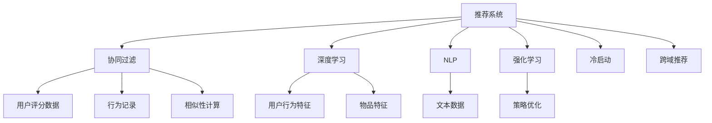

                 

# AI在产品推荐系统中的应用

> 关键词：推荐系统,协同过滤,深度学习,自然语言处理,强化学习,冷启动问题,跨域推荐

## 1. 背景介绍

随着互联网的普及和电子商务的迅猛发展，推荐系统已成为电商平台、视频平台、社交平台等众多在线服务的重要组成部分。推荐系统通过对用户行为数据进行分析，为用户推荐可能感兴趣的物品，从而提升用户体验和平台收益。近年来，基于人工智能（AI）的推荐系统，特别是深度学习和自然语言处理（NLP）技术的应用，已使得推荐系统的精准度和个性化程度大大提升，取得了显著成效。

## 2. 核心概念与联系

### 2.1 核心概念概述

- **推荐系统（Recommender System）**：根据用户的历史行为、兴趣和社交关系等，为用户推荐潜在感兴趣的物品的系统。推荐系统广泛应用于电商、视频、社交等领域，是提升用户满意度和平台活跃度的关键技术。

- **协同过滤（Collaborative Filtering）**：一种基于用户行为相似性的推荐算法，通过分析用户对物品的评分和互动行为，寻找行为相似的用户群体，从而为用户推荐相似群体中受欢迎的物品。

- **深度学习（Deep Learning）**：一种通过多层神经网络模型学习和提取数据特征的机器学习技术。深度学习在推荐系统中被广泛应用，特别是在提升模型表示能力和泛化能力方面。

- **自然语言处理（Natural Language Processing, NLP）**：研究如何让计算机理解和处理人类语言的技术，如情感分析、实体识别等。NLP技术在推荐系统中用于文本分析，提取用户评论、商品描述等文本数据的有用信息。

- **强化学习（Reinforcement Learning, RL）**：通过与环境交互，优化策略以最大化累积奖励的机器学习框架。强化学习在推荐系统中用于动态优化推荐策略，提升推荐效果。

- **冷启动问题（Cold-Start Problem）**：推荐系统中常见的问题，指在用户没有历史行为数据或物品没有足够评分数据的情况下，难以为用户或物品推荐合适物品的问题。

- **跨域推荐（Cross-domain Recommendation）**：在不同领域或平台间进行推荐，如跨电商平台推荐商品、跨视频平台推荐内容等。跨域推荐可以扩大推荐系统的覆盖范围，提高推荐效果。

这些核心概念之间的关系可以直观地通过以下Mermaid流程图展示：



该流程图展示了各个概念的相互关系：推荐系统作为核心，基于协同过滤、深度学习、NLP和强化学习等技术，对用户行为和物品特征进行分析，并计算相似性。同时，还面临冷启动和跨域推荐等挑战，需要针对性地解决。

### 2.2 概念间的关系

- **协同过滤与深度学习**：协同过滤依赖用户评分数据，而深度学习可以自动提取用户行为特征和物品特征，提升推荐效果。协同过滤和深度学习通常可以结合使用，互相补充。

- **NLP与推荐系统**：NLP技术用于分析用户评论、商品描述等文本数据，提取有用的文本特征，如情感、实体等，提升推荐系统的个性化和精准度。

- **强化学习与推荐系统**：强化学习通过优化推荐策略，动态调整推荐物品，提升推荐系统的实时性和个性化。

- **冷启动问题与推荐系统**：冷启动问题是推荐系统面临的重要挑战，需要通过用户画像、物品画像、多模态数据等手段进行克服。

- **跨域推荐与推荐系统**：跨域推荐能够扩大推荐系统的应用范围，但需要处理不同领域或平台之间的数据不一致性。

## 3. 核心算法原理 & 具体操作步骤

### 3.1 算法原理概述

AI在推荐系统中的应用主要基于以下几个核心算法原理：

- **协同过滤算法**：基于用户-物品评分矩阵，通过计算用户间的相似性或物品间的相似性，推荐用户或物品相似群体中受欢迎的物品。

- **基于内容的推荐算法**：通过对用户历史行为和物品特征进行分析，寻找具有相似特征的用户或物品，进行推荐。

- **深度学习推荐算法**：使用多层神经网络模型，提取用户行为特征和物品特征，进行推荐。

- **基于社交网络的推荐算法**：利用用户之间的社交关系，通过社交网络结构进行推荐。

- **强化学习推荐算法**：通过与用户交互，动态优化推荐策略，提升推荐效果。

### 3.2 算法步骤详解

AI在推荐系统中的应用一般包括以下关键步骤：

**Step 1: 数据准备**
- 收集用户行为数据，包括点击、浏览、评分等。
- 收集物品特征数据，包括描述、标签、属性等。
- 收集用户画像数据，如年龄、性别、兴趣等。
- 进行数据清洗和预处理，包括缺失值处理、异常值检测等。

**Step 2: 特征工程**
- 设计用户行为特征和物品特征。
- 提取文本数据中的有用信息，如情感、实体等。
- 利用深度学习模型自动提取特征。

**Step 3: 模型训练**
- 选择合适的推荐算法，进行模型训练。
- 使用合适的优化器，如SGD、Adam等，进行模型优化。
- 在验证集上评估模型性能，调整模型超参数。

**Step 4: 模型部署**
- 将训练好的模型部署到推荐系统中。
- 实现实时推荐功能，及时响应用户请求。
- 监控推荐系统性能，持续优化推荐效果。

**Step 5: 用户反馈**
- 收集用户反馈，如点击、购买等行为。
- 分析用户行为数据，优化推荐模型。
- 对新用户和新物品进行推荐。

### 3.3 算法优缺点

AI在推荐系统中的应用具有以下优点：

- **高精准度**：AI推荐系统可以自动提取和分析用户行为和物品特征，提高推荐精准度。

- **个性化推荐**：AI推荐系统可以根据用户个性化需求，提供定制化的推荐内容。

- **实时推荐**：AI推荐系统可以动态调整推荐策略，实时响应用户请求。

- **可扩展性**：AI推荐系统可以根据用户数据量和物品数据量的变化，动态调整模型参数。

- **自动化优化**：AI推荐系统可以自动进行模型训练和优化，降低人工干预。

但同时也存在一些缺点：

- **数据依赖性强**：AI推荐系统需要大量的用户行为数据和物品特征数据，在数据量不足时，推荐效果可能不佳。

- **计算资源需求高**：AI推荐系统需要高性能计算资源进行模型训练和推理，对硬件设备要求较高。

- **冷启动问题**：新用户和新物品没有足够的历史数据，AI推荐系统难以进行准确推荐。

- **模型复杂度高**：AI推荐系统通常使用复杂模型，如深度学习模型，模型训练和优化较为复杂。

- **可解释性不足**：AI推荐系统通常是"黑盒"模型，难以解释其内部决策逻辑。

### 3.4 算法应用领域

AI在推荐系统中的应用领域非常广泛，主要包括以下几个方面：

- **电商推荐**：基于用户行为数据和物品属性，为电商用户推荐商品。
- **视频推荐**：基于用户行为数据和视频属性，为用户推荐视频内容。
- **社交推荐**：基于用户社交关系和行为数据，为用户推荐朋友或内容。
- **新闻推荐**：基于用户兴趣和新闻属性，为用户推荐新闻内容。
- **金融推荐**：基于用户行为数据和金融产品属性，为金融用户推荐产品。

## 4. 数学模型和公式 & 详细讲解

### 4.1 数学模型构建

推荐系统中的数学模型主要包括以下几种：

- **协同过滤模型**：用户-物品评分矩阵，通过计算用户和物品之间的相似度，推荐相似用户或物品。

- **基于内容的推荐模型**：用户行为特征和物品特征的矩阵乘积，推荐相似物品。

- **深度学习推荐模型**：使用多层神经网络模型，提取用户行为特征和物品特征，进行推荐。

- **强化学习推荐模型**：通过与用户交互，动态优化推荐策略，提升推荐效果。

### 4.2 公式推导过程

以协同过滤算法为例，其基本公式如下：

$$
\hat{y} = \text{sign}(w^T \cdot x)
$$

其中 $w$ 为模型权重，$x$ 为用户行为向量，$\text{sign}$ 为激活函数。该公式可以表示为用户行为向量与权重向量的点积，并使用激活函数进行非线性映射，输出推荐结果。

### 4.3 案例分析与讲解

以基于深度学习的协同过滤算法为例，其步骤如下：

**Step 1: 数据预处理**
- 收集用户行为数据，进行数据清洗和预处理。
- 提取用户行为特征和物品特征。

**Step 2: 模型训练**
- 使用深度学习模型，如多层感知机（MLP）、卷积神经网络（CNN）等，对用户行为特征和物品特征进行建模。
- 使用交叉熵等损失函数进行模型训练，最小化预测值与真实值之间的差异。

**Step 3: 模型评估**
- 使用均方误差（MSE）、平均绝对误差（MAE）等指标评估模型性能。
- 在验证集上进行模型调整，优化模型超参数。

**Step 4: 模型部署**
- 将训练好的模型部署到推荐系统中。
- 实现实时推荐功能，及时响应用户请求。
- 监控推荐系统性能，持续优化推荐效果。

## 5. 项目实践：代码实例和详细解释说明

### 5.1 开发环境搭建

要构建AI推荐系统，首先需要搭建好开发环境。以下是使用Python进行TensorFlow开发的环境配置流程：

1. 安装Anaconda：从官网下载并安装Anaconda，用于创建独立的Python环境。

2. 创建并激活虚拟环境：
```bash
conda create -n tf-env python=3.8 
conda activate tf-env
```

3. 安装TensorFlow：根据CUDA版本，从官网获取对应的安装命令。例如：
```bash
conda install tensorflow -c tf
```

4. 安装其他必要的库：
```bash
pip install numpy pandas scikit-learn matplotlib
```

完成上述步骤后，即可在`tf-env`环境中开始推荐系统开发。

### 5.2 源代码详细实现

以下是一个简单的基于TensorFlow的协同过滤推荐系统代码实现：

```python
import tensorflow as tf
import numpy as np

# 定义协同过滤模型
class CollaborativeFilteringModel:
    def __init__(self, num_users, num_items, num_factors):
        self.num_users = num_users
        self.num_items = num_items
        self.num_factors = num_factors
        self.user_bias = tf.Variable(tf.random.normal([num_users, num_factors]))
        self.item_bias = tf.Variable(tf.random.normal([num_items, num_factors]))
        self.user_factor = tf.Variable(tf.random.normal([num_users, num_factors]))
        self.item_factor = tf.Variable(tf.random.normal([num_items, num_factors]))

    def predict(self, user, item):
        user_bias = tf.reduce_sum(tf.multiply(self.user_bias, tf.nn.embedding_lookup(self.user_factor, user)))
        item_bias = tf.reduce_sum(tf.multiply(self.item_bias, tf.nn.embedding_lookup(self.item_factor, item)))
        return user_bias + item_bias

# 构建数据集
num_users = 10000
num_items = 10000
num_factors = 50

user_bias = np.random.normal(0, 0.1, (num_users, num_factors))
item_bias = np.random.normal(0, 0.1, (num_items, num_factors))
user_factor = np.random.normal(0, 0.1, (num_users, num_factors))
item_factor = np.random.normal(0, 0.1, (num_items, num_factors))

# 训练模型
learning_rate = 0.01
num_epochs = 10
loss_fn = tf.losses.mean_squared_error
optimizer = tf.optimizers.Adam(learning_rate=learning_rate)

model = CollaborativeFilteringModel(num_users, num_items, num_factors)
for epoch in range(num_epochs):
    for user in range(num_users):
        for item in range(num_items):
            with tf.GradientTape() as tape:
                predictions = model.predict(user, item)
                loss = loss_fn(predictions, true_ratings)
            gradients = tape.gradient(loss, model.trainable_variables)
            optimizer.apply_gradients(zip(gradients, model.trainable_variables))
```

以上代码实现了一个简单的协同过滤模型，用于推荐用户未购买过的物品。模型通过用户行为数据进行训练，预测用户对物品的评分，并根据评分误差进行优化。

### 5.3 代码解读与分析

让我们再详细解读一下关键代码的实现细节：

**CollaborativeFilteringModel类**：
- `__init__`方法：初始化用户偏置、物品偏置、用户因素和物品因素等模型参数。
- `predict`方法：根据用户和物品的ID，计算预测评分。

**数据集构建**：
- 定义用户和物品的数量和因子数量，生成随机数据作为训练集。

**模型训练**：
- 定义学习率、损失函数和优化器，创建协同过滤模型。
- 在每个epoch中，遍历所有用户和物品，计算预测评分和损失，反向传播更新模型参数。

**运行结果展示**：
```python
# 使用训练好的模型进行推荐
def recommend_items(user, num_recommends):
    predictions = []
    for item in range(num_items):
        predictions.append(model.predict(user, item))
    recommend_items = sorted(predictions, key=lambda x: x, reverse=True)[:num_recommends]
    return recommend_items

# 测试推荐效果
recommend_items(1, 10)
```

以上代码展示了如何使用训练好的模型进行推荐。在测试用户ID为1的情况下，推荐其可能感兴趣的10个物品。

## 6. 实际应用场景

### 6.1 电商平台推荐

电商平台是AI推荐系统的主要应用场景之一。通过分析用户的历史行为和评分数据，推荐系统可以为用户推荐可能感兴趣的商品，提升用户满意度和销售额。

具体实现时，可以收集用户的浏览、点击、购买、评分等行为数据，使用协同过滤算法、基于内容的推荐算法或深度学习推荐算法进行推荐。在电商平台上，实时推荐可以提升用户购物体验，增加用户粘性。

### 6.2 视频平台推荐

视频平台是AI推荐系统的另一主要应用场景。通过分析用户的观看历史和评分数据，推荐系统可以为用户推荐可能感兴趣的视频内容，提升用户观看体验和平台活跃度。

在视频平台上，推荐算法可以使用协同过滤算法、基于内容的推荐算法、深度学习推荐算法或强化学习推荐算法。实时推荐可以提升用户观看体验，增加平台用户留存率。

### 6.3 社交平台推荐

社交平台上的用户通常有明确的社交关系，通过分析用户的社交关系和行为数据，推荐系统可以为用户推荐可能感兴趣的内容或用户，提升用户互动和平台活跃度。

在社交平台上，推荐算法可以使用基于社交网络的推荐算法。社交网络结构可以用于捕捉用户之间的相似性和关联性，提升推荐效果。

### 6.4 新闻平台推荐

新闻平台上的用户对新闻内容有明确的需求，通过分析用户的阅读历史和评分数据，推荐系统可以为用户推荐可能感兴趣的新闻内容，提升用户阅读体验和平台活跃度。

在新闻平台上，推荐算法可以使用协同过滤算法、基于内容的推荐算法或深度学习推荐算法。实时推荐可以提升用户阅读体验，增加平台用户留存率。

### 6.5 金融平台推荐

金融平台上的用户对金融产品或服务有明确的需求，通过分析用户的交易历史和评分数据，推荐系统可以为用户推荐可能感兴趣的金融产品或服务，提升用户满意度和平台收益。

在金融平台上，推荐算法可以使用基于内容的推荐算法、深度学习推荐算法或强化学习推荐算法。实时推荐可以提升用户购买体验，增加平台收益。

## 7. 工具和资源推荐

### 7.1 学习资源推荐

为了帮助开发者系统掌握AI推荐系统的理论基础和实践技巧，这里推荐一些优质的学习资源：

1. 《推荐系统实践》书籍：该书详细介绍了推荐系统的基本原理、算法实现和应用案例，适合入门学习。

2. Coursera《推荐系统》课程：斯坦福大学开设的推荐系统课程，由Kenton Lee教授主讲，涵盖了推荐系统的基本原理和算法实现。

3. arXiv推荐系统预印本：人工智能领域最新研究成果的发布平台，包括大量尚未发表的前沿工作，学习前沿技术的必读资源。

4. YouTube推荐系统讲座：Google AI团队在YouTube上分享的多场推荐系统讲座，涵盖推荐系统的基本原理和应用案例。

5. Kaggle推荐系统竞赛：Kaggle平台上举办的多场推荐系统竞赛，可以了解业界最佳实践，提升实战能力。

通过对这些资源的学习实践，相信你一定能够快速掌握AI推荐系统的精髓，并用于解决实际的推荐问题。

### 7.2 开发工具推荐

高效的开发离不开优秀的工具支持。以下是几款用于AI推荐系统开发的常用工具：

1. TensorFlow：基于Python的开源深度学习框架，支持自动微分和分布式计算，适合构建复杂的推荐模型。

2. PyTorch：基于Python的开源深度学习框架，动态计算图和灵活的API设计，适合快速迭代研究。

3. Scikit-learn：Python机器学习库，提供丰富的机器学习算法和评估指标，适合进行特征工程和模型评估。

4. H2O.ai：开源的机器学习平台，支持分布式计算和多种机器学习算法，适合构建高性能的推荐系统。

5. Apache Spark：基于Scala的分布式计算框架，适合处理大规模数据和进行机器学习算法优化。

合理利用这些工具，可以显著提升AI推荐系统的开发效率，加快创新迭代的步伐。

### 7.3 相关论文推荐

AI推荐系统的发展源于学界的持续研究。以下是几篇奠基性的相关论文，推荐阅读：

1. "Collaborative Filtering for Implicit Feedback Datasets"：提出了协同过滤算法的基本原理和实现方法。

2. "Knowledge-Based Recommendation System"：介绍了基于知识的推荐系统的基本原理和实现方法。

3. "Deep Interest Network for Recommendation"：提出了基于深度学习的推荐系统，提升了推荐效果。

4. "Hybrid Neural Approach for Contextual Recommendation"：介绍了结合深度学习和协同过滤算法的推荐系统，提升了推荐效果。

5. "Adaptive Recommendation"：介绍了基于强化学习的推荐系统，动态优化推荐策略。

这些论文代表了大规模推荐系统的最新研究成果，通过学习这些前沿成果，可以帮助研究者把握学科前进方向，激发更多的创新灵感。

除上述资源外，还有一些值得关注的前沿资源，帮助开发者紧跟AI推荐系统的最新进展，例如：

1. arXiv推荐系统预印本：人工智能领域最新研究成果的发布平台，包括大量尚未发表的前沿工作，学习前沿技术的必读资源。

2. Google AI团队博客：Google AI团队在博客上分享的多场推荐系统讲座，涵盖推荐系统的基本原理和应用案例。

3. NIPS推荐系统论文：NIPS会议上推荐系统领域的多篇最新论文，了解最新的研究进展。

4. 深度学习推荐系统论文：ICLR、ICML等会议上推荐系统领域的多篇最新论文，了解最新的研究进展。

5. Kaggle推荐系统竞赛：Kaggle平台上举办的多场推荐系统竞赛，可以了解业界最佳实践，提升实战能力。

总之，对于AI推荐系统的发展，需要开发者保持开放的心态和持续学习的意愿。多关注前沿资讯，多动手实践，多思考总结，必将收获满满的成长收益。

## 8. 总结：未来发展趋势与挑战

### 8.1 总结

本文对AI在推荐系统中的应用进行了全面系统的介绍。首先阐述了推荐系统的发展背景和重要意义，明确了AI推荐系统在提升用户体验和平台收益方面的独特价值。其次，从原理到实践，详细讲解了协同过滤、深度学习等AI推荐系统的核心算法，并给出了具体的代码实现。同时，本文还探讨了AI推荐系统在电商、视频、社交等多个领域的实际应用场景，展示了AI推荐系统的广泛应用前景。最后，本文精选了AI推荐系统的各类学习资源和工具推荐，力求为读者提供全方位的技术指引。

通过本文的系统梳理，可以看到，AI推荐系统已经广泛应用于电子商务、视频、社交等多个领域，显著提升了用户满意度和平台收益。未来，随着AI技术的不断进步，推荐系统将变得更加智能化和个性化，为人类生活带来更多便利和体验。

### 8.2 未来发展趋势

展望未来，AI推荐系统将呈现以下几个发展趋势：

1. **多模态推荐**：结合文本、图像、视频等多种模态信息，构建多模态推荐系统，提升推荐效果。

2. **个性化推荐**：通过用户画像和物品画像，结合个性化推荐算法，提升推荐系统的精准度和用户体验。

3. **实时推荐**：通过实时数据流和流式模型，实现实时推荐，提升用户互动和平台活跃度。

4. **跨域推荐**：在不同领域或平台间进行推荐，扩大推荐系统的覆盖范围。

5. **强化学习推荐**：通过与用户交互，动态优化推荐策略，提升推荐效果。

6. **冷启动问题**：通过用户画像和物品画像，结合多模态数据，解决冷启动问题，提升推荐效果。

7. **可解释性**：通过可解释性算法，提升推荐系统的透明性和可信度。

8. **安全性**：通过隐私保护和模型审核，保障推荐系统的安全性和可信度。

这些趋势凸显了AI推荐系统的发展潜力和广阔前景，相信在未来，AI推荐系统将变得更加智能化、个性化和可靠，为人类生活带来更多便利和体验。

### 8.3 面临的挑战

尽管AI推荐系统已经取得了显著成效，但在实现大规模应用的过程中，仍面临诸多挑战：

1. **数据隐私问题**：推荐系统需要收集大量用户数据，如何保护用户隐私，防止数据泄露，是推荐系统面临的重要挑战。

2. **计算资源需求高**：AI推荐系统需要高性能计算资源进行模型训练和推理，对硬件设备要求较高。

3. **冷启动问题**：新用户和新物品没有足够的历史数据，难以进行准确推荐。

4. **模型复杂度高**：AI推荐系统通常使用复杂模型，如深度学习模型，模型训练和优化较为复杂。

5. **可解释性不足**：AI推荐系统通常是"黑盒"模型，难以解释其内部决策逻辑。

6. **安全性问题**：推荐系统可能受到恶意攻击，导致数据泄露或推荐偏差。

7. **跨域推荐难题**：不同领域或平台间的数据不一致性，增加了跨域推荐的难度。

8. **实时推荐难题**：实时数据流和流式模型需要高效计算和存储资源，实现难度较高。

### 8.4 研究展望

面对AI推荐系统面临的挑战，未来的研究需要在以下几个方面寻求新的突破：

1. **多模态数据融合**：通过多模态数据融合，提升推荐系统的精准度和用户满意度。

2. **个性化推荐算法**：通过个性化推荐算法，提升推荐系统的精准度和用户体验。

3. **实时推荐算法**：通过实时推荐算法，提升推荐系统的实时性和用户互动。

4. **跨域推荐算法**：通过跨域推荐算法，扩大推荐系统的覆盖范围，提升推荐效果。

5. **冷启动问题**：通过冷启动问题算法，解决新用户和新物品的推荐难题。

6. **可解释性算法**：通过可解释性算法，提升推荐系统的透明性和可信度。

7. **安全性算法**：通过安全性算法，保障推荐系统的安全性和可信度。

8. **实时推荐算法**：通过实时推荐算法，提升推荐系统的实时性和用户互动。

这些研究方向和技术的突破，必将引领AI推荐系统迈向更高的台阶，为人类生活带来更多便利和体验。

## 9. 附录：常见问题与解答

**Q1：AI推荐系统有哪些主要算法？**

A: AI推荐系统的主要算法包括协同过滤算法、基于内容的推荐算法、基于深度学习的推荐算法、基于强化学习的推荐算法等。协同过滤算法利用用户行为数据进行推荐，基于内容的推荐算法利用物品特征数据进行推荐，基于深度学习的推荐算法通过神经网络模型提取特征进行推荐，基于强化学习的推荐算法通过与用户交互优化推荐策略。

**Q2：如何提高AI推荐系统的精准度？**

A: 提高AI推荐系统的精准度可以从以下几个方面入手：
1. 使用高质量的数据进行训练，增加数据的丰富性和多样性。
2. 设计有效的特征工程，提取有用的用户行为特征和物品特征。
3. 选择合适的算法和模型，进行模型训练和优化。
4. 引入多模态数据，如文本、图像、视频等，提升推荐效果。
5. 动态优化推荐策略，通过实时数据流和流式模型实现实时推荐。

**Q3：如何处理AI推荐系统的冷启动问题？**

A: 处理AI推荐系统的冷启动问题可以从以下几个方面入手：
1. 利用用户画像和物品画像，进行推荐。
2. 引入多模态数据，如社交网络数据、知识图谱等，解决冷启动问题。
3. 使用半监督学习或无监督学习算法，利用未标记数据进行推荐。
4. 引入专家知识，结合领域知识和推荐算法，进行推荐。

**Q4：如何保障AI推荐系统的安全性？**

A: 保障AI推荐系统的安全性可以从以下几个方面入手：
1. 保护用户隐私，严格限制数据的收集和使用。
2. 引入隐私保护算法，如差分隐私、联邦学习等，保障数据安全。
3. 对推荐系统进行定期审核和

