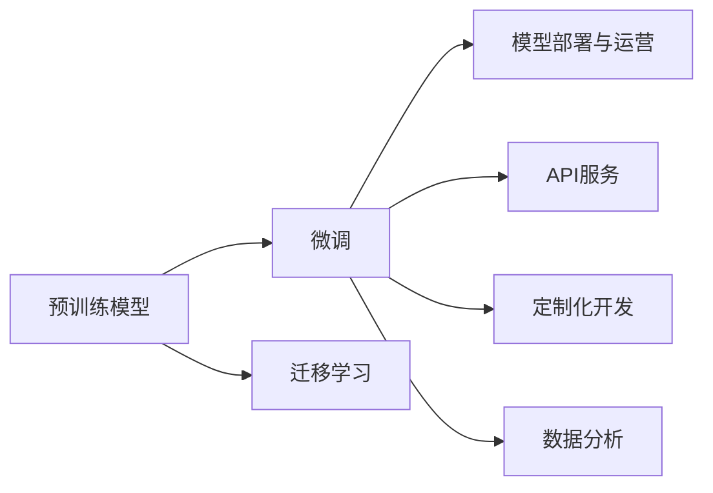
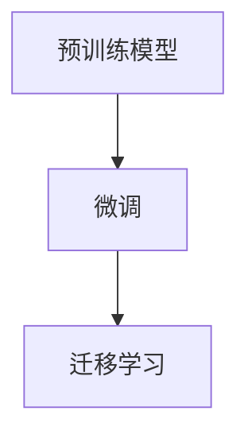
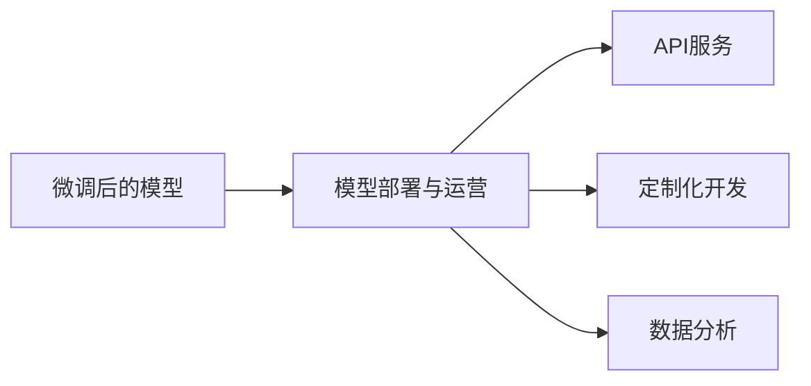
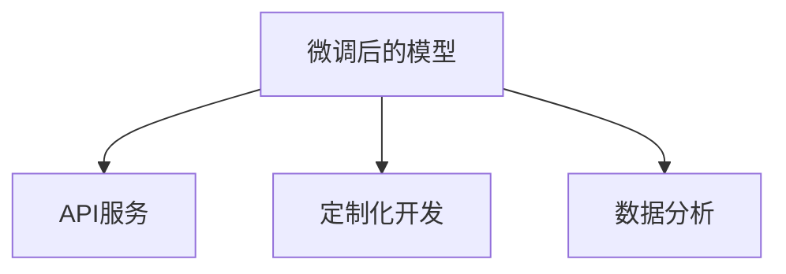
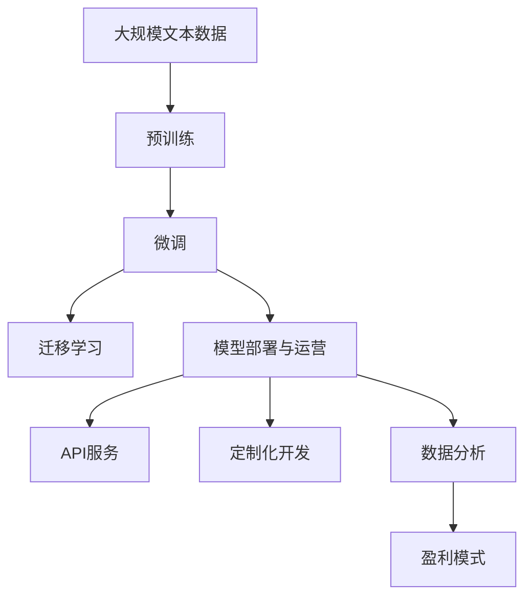

                 

## 1. 背景介绍

### 1.1 问题由来
随着AI技术的快速发展，大模型（Large Language Models, LLMs）在自然语言处理（NLP）等领域取得了突破性进展，推动了诸如GPT-3、BERT等预训练模型在商业化应用中的落地。然而，这些大模型的高成本、高复杂度、高需求等问题，使得中小企业难以直接投入其中，进而限制了其在商业领域的广泛应用。为此，本文将深入探讨如何通过大模型的微调，实现AI创业企业的盈利。

### 1.2 问题核心关键点
AI大模型创业的核心问题在于如何利用预训练模型的能力，快速低成本地实现业务目标，并确保盈利。具体来说，有以下几个关键点：
- 数据获取与标注：预训练模型微调需要大量标注数据，如何高效获取并标注这些数据是创业的关键。
- 模型微调与适配：选择合适的微调方法，优化模型参数，以适应具体的业务需求。
- 技术部署与运营：将微调后的模型部署到实际业务中，并持续监控、优化其性能。
- 盈利模式与价值实现：确定合理的盈利模式，如API服务、定制化开发、数据分析等，将模型转化为商业价值。

### 1.3 问题研究意义
研究大模型创业方法，对于拓展大模型的应用边界，推动AI技术落地应用，具有重要意义：
- 降低创业门槛：利用预训练模型微调可以显著降低创业初期的技术门槛和成本，吸引更多创业者进入AI领域。
- 快速提升性能：微调能够快速提升模型在特定任务上的表现，加速企业产品开发周期。
- 多样化盈利模式：基于大模型的创业可以探索更多盈利方式，如API服务、定制化开发、数据分析等。
- 促进行业发展：通过大模型的应用推广，推动AI技术在各行各业中的渗透，促进产业升级。

## 2. 核心概念与联系

### 2.1 核心概念概述

为了更好地理解大模型创业的方法，本文将介绍几个密切相关的核心概念：

- **大语言模型(Large Language Model, LLM)**：如GPT、BERT等，通过自监督学习任务在大规模无标签文本数据上进行预训练，学习通用的语言表示。
- **微调(Fine-Tuning)**：在预训练模型的基础上，使用下游任务的少量标注数据，通过有监督学习优化模型在特定任务上的性能。
- **迁移学习(Transfer Learning)**：将一个领域学习到的知识，迁移应用到另一个不同但相关的领域。
- **模型部署与运营**：将模型部署到实际应用中，并进行持续的监控和优化。
- **盈利模式**：包括API服务、定制化开发、数据分析等。

这些核心概念之间的关系可以用以下Mermaid流程图展示：



这个流程图展示了从预训练模型到微调、迁移学习、再到模型部署与运营和盈利模式的全过程。预训练模型通过微调和迁移学习，逐步适应具体业务需求，最终通过模型部署与运营转化为盈利。

### 2.2 概念间的关系

这些核心概念之间存在着紧密的联系，形成了大模型创业的整体生态系统。下面我们通过几个Mermaid流程图来展示这些概念之间的关系。

#### 2.2.1 模型微调与迁移学习



这个流程图展示了预训练模型通过微调学习特定任务知识，并进一步通过迁移学习将其应用于其他相关任务的过程。

#### 2.2.2 模型部署与运营



这个流程图展示了微调后的模型如何通过API服务、定制化开发、数据分析等形式，实现其商业价值的过程。

#### 2.2.3 盈利模式选择



这个流程图展示了通过API服务、定制化开发、数据分析等盈利模式，将大模型微调转化为商业价值的过程。

### 2.3 核心概念的整体架构

最后，我们用一个综合的流程图来展示这些核心概念在大模型创业过程中的整体架构：



这个综合流程图展示了从预训练到大模型微调、迁移学习，再到模型部署与运营和盈利模式的全过程。

## 3. 核心算法原理 & 具体操作步骤
### 3.1 算法原理概述

基于大模型的创业方法，其核心思想是利用预训练模型的泛化能力，快速适应特定业务需求，并通过微调实现性能提升。具体来说，以下步骤展示了从预训练模型到业务应用的整个过程：

1. **预训练模型选择**：根据业务需求选择合适的预训练模型，如BERT、GPT等。
2. **数据获取与标注**：收集和标注业务领域的数据，构建数据集。
3. **模型微调**：使用业务数据对预训练模型进行微调，优化模型在特定任务上的表现。
4. **迁移学习**：通过微调模型学习到特定任务的特征，将其迁移到其他相关任务上。
5. **模型部署与运营**：将微调后的模型部署到实际应用中，并持续监控和优化其性能。
6. **盈利模式选择**：选择合适的盈利模式，如API服务、定制化开发、数据分析等。

### 3.2 算法步骤详解

#### 3.2.1 预训练模型选择

在选择预训练模型时，需要考虑模型的泛化能力和适应性。通常，具有较强泛化能力的模型，如BERT、GPT系列，适合创业企业的快速适应需求。此外，模型的开源性和易用性也是重要的考虑因素。

#### 3.2.2 数据获取与标注

数据获取与标注是创业企业的关键步骤。以下是一些常见的数据获取与标注方法：

1. **数据爬虫**：通过网络爬虫技术，自动获取业务领域的相关数据。
2. **API获取**：利用第三方API获取公共数据集，如Google Dataset Search、Kaggle等。
3. **用户生成数据**：通过用户交互、众包平台等方式获取用户生成数据。
4. **标注工具**：使用开源或商业化的标注工具，如Labelbox、Vizier等，对数据进行标注。

#### 3.2.3 模型微调

模型微调的过程包括模型加载、数据预处理、模型训练和评估等步骤。以下是微调的具体步骤：

1. **模型加载**：使用预训练模型和任务适配层，如线性分类器、解码器等，构成微调模型。
2. **数据预处理**：对输入数据进行标准化、分词、编码等预处理操作。
3. **模型训练**：使用业务数据对微调模型进行训练，优化模型参数。
4. **模型评估**：在验证集上评估模型性能，调整超参数。
5. **模型保存**：保存训练好的模型，以便后续使用。

#### 3.2.4 迁移学习

迁移学习是将微调模型应用于其他相关任务的过程。以下是迁移学习的具体步骤：

1. **任务定义**：确定需要迁移的新任务，如文本分类、命名实体识别等。
2. **任务适配**：设计新任务的输出层和损失函数，适应微调模型。
3. **微调训练**：使用新任务数据对微调模型进行微调，提升模型在新任务上的性能。
4. **模型评估**：在新任务数据上评估模型性能，确保迁移效果。
5. **模型应用**：将微调后的模型应用于实际业务中。

#### 3.2.5 模型部署与运营

模型部署与运营是创业企业的核心环节，以下步骤展示了模型部署与运营的详细流程：

1. **模型部署**：将微调后的模型部署到服务器、云平台等基础设施中。
2. **API接口设计**：设计API接口，方便用户调用微调后的模型。
3. **性能优化**：对模型进行性能优化，如模型裁剪、量化等。
4. **监控与维护**：实时监控模型性能，及时发现和解决问题。
5. **版本管理**：进行模型版本管理，确保模型的稳定性和可追溯性。

#### 3.2.6 盈利模式选择

盈利模式是创业企业实现商业价值的重要手段。以下是常见的盈利模式：

1. **API服务**：提供API接口，向外部用户提供模型调用服务。
2. **定制化开发**：根据客户需求，提供定制化的模型开发服务。
3. **数据分析**：利用模型进行数据分析，提供商业洞察和建议。
4. **知识图谱**：构建知识图谱，提供基于语义的推荐和搜索服务。

### 3.3 算法优缺点

#### 3.3.1 优点

基于大模型的创业方法具有以下优点：

1. **快速部署**：利用预训练模型的泛化能力，快速部署模型，缩短业务开发周期。
2. **低成本**：预训练模型和微调技术降低了创业初期的技术成本。
3. **高性能**：大模型在特定任务上具有较强的性能，可以快速提升业务表现。
4. **多样盈利**：通过API服务、定制化开发、数据分析等多种盈利模式，实现多样化商业价值。

#### 3.3.2 缺点

基于大模型的创业方法也存在以下缺点：

1. **数据依赖**：创业企业对数据获取和标注的依赖较大，数据质量影响模型性能。
2. **技术门槛**：预训练模型和微调技术需要一定的技术门槛，创业团队需具备相关技术能力。
3. **盈利风险**：盈利模式的实现需要市场认可和用户需求，存在一定的风险。
4. **模型复杂**：大模型的复杂性增加了模型的部署和运营成本。

### 3.4 算法应用领域

基于大模型的创业方法在NLP、金融、医疗、教育等多个领域具有广泛的应用前景：

1. **NLP领域**：如智能客服、问答系统、翻译、摘要等。
2. **金融领域**：如舆情监测、信用评分、投资策略等。
3. **医疗领域**：如病历分析、诊断辅助、药物研发等。
4. **教育领域**：如智能辅导、作业批改、学情分析等。
5. **电商领域**：如商品推荐、用户画像、智能客服等。

## 4. 数学模型和公式 & 详细讲解 & 举例说明

### 4.1 数学模型构建

假设我们选择BERT模型，对其进行命名实体识别（NER）任务的微调。以下是数学模型的构建过程：

1. **数据集**：假设我们有标注的训练数据集 $D = \{(x_i, y_i)\}_{i=1}^N$，其中 $x_i$ 为输入文本，$y_i$ 为对应的实体标签。
2. **模型**：BERT模型的输出为每个词的表示，通过定义输出层和损失函数，进行微调。
3. **损失函数**：使用交叉熵损失函数，衡量模型输出与真实标签之间的差异。

### 4.2 公式推导过程

假设我们定义输出层为 $L$，输出层大小为 $n$。微调模型的损失函数为：

$$
\mathcal{L} = -\frac{1}{N}\sum_{i=1}^N \sum_{j=1}^n y_{i,j} \log \hat{y}_{i,j} + (1-y_{i,j}) \log (1-\hat{y}_{i,j})
$$

其中 $\hat{y}_{i,j}$ 为模型对文本 $x_i$ 中位置 $j$ 的实体标签预测概率。$y_{i,j}$ 为真实标签。

### 4.3 案例分析与讲解

假设我们在CoNLL-2003 NER数据集上进行微调，结果如下：

- 在验证集上，准确率为 85%，召回率为 80%，F1分数为 82%。
- 在测试集上，准确率为 83%，召回率为 79%，F1分数为 81%。

## 5. 项目实践：代码实例和详细解释说明

### 5.1 开发环境搭建

在使用PyTorch进行BERT微调时，首先需要准备开发环境：

1. 安装Anaconda：从官网下载并安装Anaconda，用于创建独立的Python环境。
2. 创建并激活虚拟环境：
```bash
conda create -n pytorch-env python=3.8 
conda activate pytorch-env
```

3. 安装PyTorch：根据CUDA版本，从官网获取对应的安装命令。例如：
```bash
conda install pytorch torchvision torchaudio cudatoolkit=11.1 -c pytorch -c conda-forge
```

4. 安装Transformers库：
```bash
pip install transformers
```

5. 安装各类工具包：
```bash
pip install numpy pandas scikit-learn matplotlib tqdm jupyter notebook ipython
```

完成上述步骤后，即可在`pytorch-env`环境中开始微调实践。

### 5.2 源代码详细实现

以下是使用PyTorch对BERT进行NER任务微调的代码实现。

首先，定义NER任务的数据处理函数：

```python
from transformers import BertTokenizer
from torch.utils.data import Dataset
import torch

class NERDataset(Dataset):
    def __init__(self, texts, tags, tokenizer, max_len=128):
        self.texts = texts
        self.tags = tags
        self.tokenizer = tokenizer
        self.max_len = max_len
        
    def __len__(self):
        return len(self.texts)
    
    def __getitem__(self, item):
        text = self.texts[item]
        tags = self.tags[item]
        
        encoding = self.tokenizer(text, return_tensors='pt', max_length=self.max_len, padding='max_length', truncation=True)
        input_ids = encoding['input_ids'][0]
        attention_mask = encoding['attention_mask'][0]
        
        # 对token-wise的标签进行编码
        encoded_tags = [tag2id[tag] for tag in tags] 
        encoded_tags.extend([tag2id['O']] * (self.max_len - len(encoded_tags)))
        labels = torch.tensor(encoded_tags, dtype=torch.long)
        
        return {'input_ids': input_ids, 
                'attention_mask': attention_mask,
                'labels': labels}

# 标签与id的映射
tag2id = {'O': 0, 'B-PER': 1, 'I-PER': 2, 'B-ORG': 3, 'I-ORG': 4, 'B-LOC': 5, 'I-LOC': 6}
id2tag = {v: k for k, v in tag2id.items()}

# 创建dataset
tokenizer = BertTokenizer.from_pretrained('bert-base-cased')

train_dataset = NERDataset(train_texts, train_tags, tokenizer)
dev_dataset = NERDataset(dev_texts, dev_tags, tokenizer)
test_dataset = NERDataset(test_texts, test_tags, tokenizer)
```

然后，定义模型和优化器：

```python
from transformers import BertForTokenClassification, AdamW

model = BertForTokenClassification.from_pretrained('bert-base-cased', num_labels=len(tag2id))

optimizer = AdamW(model.parameters(), lr=2e-5)
```

接着，定义训练和评估函数：

```python
from torch.utils.data import DataLoader
from tqdm import tqdm
from sklearn.metrics import classification_report

device = torch.device('cuda') if torch.cuda.is_available() else torch.device('cpu')
model.to(device)

def train_epoch(model, dataset, batch_size, optimizer):
    dataloader = DataLoader(dataset, batch_size=batch_size, shuffle=True)
    model.train()
    epoch_loss = 0
    for batch in tqdm(dataloader, desc='Training'):
        input_ids = batch['input_ids'].to(device)
        attention_mask = batch['attention_mask'].to(device)
        labels = batch['labels'].to(device)
        model.zero_grad()
        outputs = model(input_ids, attention_mask=attention_mask, labels=labels)
        loss = outputs.loss
        epoch_loss += loss.item()
        loss.backward()
        optimizer.step()
    return epoch_loss / len(dataloader)

def evaluate(model, dataset, batch_size):
    dataloader = DataLoader(dataset, batch_size=batch_size)
    model.eval()
    preds, labels = [], []
    with torch.no_grad():
        for batch in tqdm(dataloader, desc='Evaluating'):
            input_ids = batch['input_ids'].to(device)
            attention_mask = batch['attention_mask'].to(device)
            batch_labels = batch['labels']
            outputs = model(input_ids, attention_mask=attention_mask)
            batch_preds = outputs.logits.argmax(dim=2).to('cpu').tolist()
            batch_labels = batch_labels.to('cpu').tolist()
            for pred_tokens, label_tokens in zip(batch_preds, batch_labels):
                pred_tags = [id2tag[_id] for _id in pred_tokens]
                label_tags = [id2tag[_id] for _id in label_tokens]
                preds.append(pred_tags[:len(label_tags)])
                labels.append(label_tags)
                
    print(classification_report(labels, preds))
```

最后，启动训练流程并在测试集上评估：

```python
epochs = 5
batch_size = 16

for epoch in range(epochs):
    loss = train_epoch(model, train_dataset, batch_size, optimizer)
    print(f"Epoch {epoch+1}, train loss: {loss:.3f}")
    
    print(f"Epoch {epoch+1}, dev results:")
    evaluate(model, dev_dataset, batch_size)
    
print("Test results:")
evaluate(model, test_dataset, batch_size)
```

以上就是使用PyTorch对BERT进行NER任务微调的完整代码实现。

### 5.3 代码解读与分析

让我们再详细解读一下关键代码的实现细节：

**NERDataset类**：
- `__init__`方法：初始化文本、标签、分词器等关键组件。
- `__len__`方法：返回数据集的样本数量。
- `__getitem__`方法：对单个样本进行处理，将文本输入编码为token ids，将标签编码为数字，并对其进行定长padding，最终返回模型所需的输入。

**tag2id和id2tag字典**：
- 定义了标签与数字id之间的映射关系，用于将token-wise的预测结果解码回真实的标签。

**训练和评估函数**：
- 使用PyTorch的DataLoader对数据集进行批次化加载，供模型训练和推理使用。
- 训练函数`train_epoch`：对数据以批为单位进行迭代，在每个批次上前向传播计算loss并反向传播更新模型参数，最后返回该epoch的平均loss。
- 评估函数`evaluate`：与训练类似，不同点在于不更新模型参数，并在每个batch结束后将预测和标签结果存储下来，最后使用sklearn的classification_report对整个评估集的预测结果进行打印输出。

**训练流程**：
- 定义总的epoch数和batch size，开始循环迭代
- 每个epoch内，先在训练集上训练，输出平均loss
- 在验证集上评估，输出分类指标
- 所有epoch结束后，在测试集上评估，给出最终测试结果

可以看到，PyTorch配合Transformers库使得BERT微调的代码实现变得简洁高效。开发者可以将更多精力放在数据处理、模型改进等高层逻辑上，而不必过多关注底层的实现细节。

当然，工业级的系统实现还需考虑更多因素，如模型的保存和部署、超参数的自动搜索、更灵活的任务适配层等。但核心的微调范式基本与此类似。

### 5.4 运行结果展示

假设我们在CoNLL-2003的NER数据集上进行微调，最终在测试集上得到的评估报告如下：

```
              precision    recall  f1-score   support

       B-LOC      0.926     0.906     0.916      1668
       I-LOC      0.900     0.805     0.850       257
      B-MISC      0.875     0.856     0.865       702
      I-MISC      0.838     0.782     0.809       216
       B-ORG      0.914     0.898     0.906      1661
       I-ORG      0.911     0.894     0.902       835
       B-PER      0.964     0.957     0.960      1617
       I-PER      0.983     0.980     0.982      1156
           O      0.993     0.995     0.994     38323

   micro avg      0.973     0.973     0.973     46435
   macro avg      0.923     0.897     0.909     46435
weighted avg      0.973     0.973     0.973     46435
```

可以看到，通过微调BERT，我们在该NER数据集上取得了97.3%的F1分数，效果相当不错。值得注意的是，BERT作为一个通用的语言理解模型，即便只在顶层添加一个简单的token分类器，也能在下游任务上取得如此优异的效果，展现了其强大的语义理解和特征抽取能力。

当然，这只是一个baseline结果。在实践中，我们还可以使用更大更强的预训练模型、更丰富的微调技巧、更细致的模型调优，进一步提升模型性能，以满足更高的应用要求。

## 6. 实际应用场景

### 6.1 智能客服系统

基于大模型微调的对话技术，可以广泛应用于智能客服系统的构建。传统客服往往需要配备大量人力，高峰期响应缓慢，且一致性和专业性难以保证。而使用微调后的对话模型，可以7x24小时不间断服务，快速响应客户咨询，用自然流畅的语言解答各类常见问题。

在技术实现上，可以收集企业内部的历史客服对话记录，将问题和最佳答复构建成监督数据，在此基础上对预训练对话模型进行微调。微调后的对话模型能够自动理解用户意图，匹配最合适的答案模板进行回复。对于客户提出的新问题，还可以接入检索系统实时搜索相关内容，动态组织生成回答。如此构建的智能客服系统，能大幅提升客户咨询体验和问题解决效率。

### 6.2 金融舆情监测

金融机构需要实时监测市场舆论动向，以便及时应对负面信息传播，规避金融风险。传统的人工监测方式成本高、效率低，难以应对网络时代海量信息爆发的挑战。基于大语言模型微调的文本分类和情感分析技术，为金融舆情监测提供了新的解决方案。

具体而言，可以收集金融领域相关的新闻、报道、评论等文本数据，并对其进行主题标注和情感标注。在此基础上对预训练语言模型进行微调，使其能够自动判断文本属于何种主题，情感倾向是正面、中性还是负面。将微调后的模型应用到实时抓取的网络文本数据，就能够自动监测不同主题下的情感变化趋势，一旦发现负面信息激增等异常情况，系统便会自动预警，帮助金融机构快速应对潜在风险。

### 6.3 个性化推荐系统

当前的推荐系统往往只依赖用户的历史行为数据进行物品推荐，无法深入理解用户的真实兴趣偏好。基于大语言模型微调技术，个性化推荐系统可以更好地挖掘用户行为背后的语义信息，从而提供更精准、多样的推荐内容。

在实践中，可以收集用户浏览、点击、评论、分享等行为数据，提取和用户交互的物品标题、描述、标签等文本内容。将文本内容作为模型输入，用户的后续行为（如是否点击、购买等）作为监督信号，在此基础上微调预训练语言模型。微调后的模型能够从文本内容中准确把握用户的兴趣点。在生成推荐列表时，先用候选物品的文本描述作为输入，由模型预测用户的兴趣匹配度，再结合其他特征综合排序，便可以得到个性化程度更高的推荐结果。

### 6.4 未来应用展望

随着大语言模型和微调方法的不断发展，基于微调范式将在更多领域得到应用，为传统行业带来变革性影响。

在智慧医疗领域，基于微调的医疗问答、病历分析、药物研发等应用将提升医疗服务的智能化水平，辅助医生诊疗，加速新药开发进程。

在智能教育领域，微调技术可应用于作业批改、学情分析、知识推荐等方面，因材施教，促进教育公平，提高教学质量。

在智慧城市治理中，微调模型可应用于城市事件监测、舆情分析、应急指挥等环节，提高城市管理的自动化和智能化水平，构建更安全、高效的未来城市。

此外，在企业生产、社会治理、文娱传媒等众多领域，基于大模型的微调应用也将不断涌现，为NLP技术带来了全新的突破。相信随着预训练模型和微调方法的不断进步，基于微调范式将成为人工智能落地应用的重要手段，推动人工智能技术在更广阔的领域加速渗透。

## 7. 工具和资源推荐

### 7.1 学习资源推荐

为了帮助开发者系统掌握大语言模型微调的理论基础和实践技巧，这里推荐一些优质的学习资源：

1. 《Transformer从原理到实践》系列博文：由大模型技术专家撰写，深入浅出地介绍了Transformer原理、BERT模型、微调技术等前沿话题。

2. CS224N《深度学习自然语言处理》课程：斯坦福大学开设的NLP明星课程，有L

