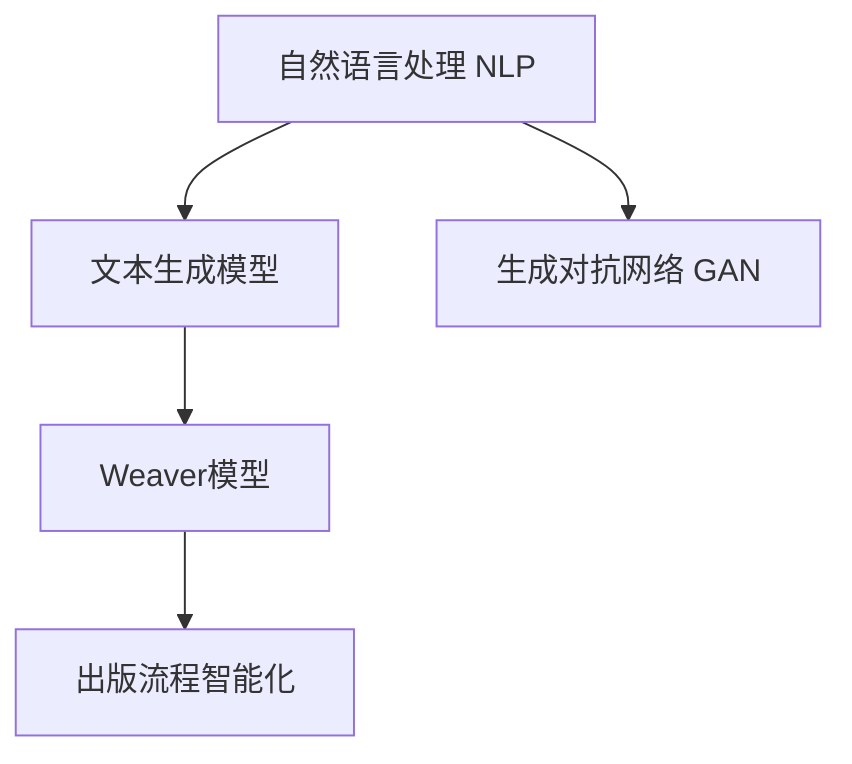

                 

# AI时代的出版革新：Weaver模型的贡献

## 1. 背景介绍

### 1.1 问题由来
出版业是人类文明传承的重要方式之一，但传统出版流程繁琐、周期长、成本高，且难以满足市场快速变化的需求。随着互联网的普及和数字化技术的进步，出版业面临数字化转型的迫切需求。AI技术的引入，尤其是自然语言处理(NLP)和生成对抗网络(GAN)技术的突破，为出版业的智能化转型提供了新的可能。

近年来，基于深度学习的文本生成模型在文学创作、新闻生成、科技论文等方面展现出巨大潜力，成为了出版业智能化转型的一个重要突破口。而Weaver模型作为一种先进的文本生成模型，在提升出版效率和内容质量方面，做出了重要贡献。

### 1.2 问题核心关键点
Weaver模型的核心思想是通过自动化的文本生成和编辑，提升出版流程的效率和质量。具体而言，Weaver模型通过学习大量高质量的出版数据，能够自动进行文本润色、结构调整、主题生成等任务，极大地降低了人工编辑的工作量，提升了出版效率和作品质量。

Weaver模型的应用包括但不限于：
- 自动化生成出版物内容：如自动生成新闻稿、学术论文、小说章节等。
- 文本润色和编辑：修正拼写错误、语法错误，提升文章可读性。
- 结构化排版：自动进行文本分段、格式化，生成符合出版规范的版面。
- 主题生成：根据关键词生成相关主题内容，辅助创作和编辑。

Weaver模型的出现，标志着出版业智能化转型的重要一步，对提升出版物质量、降低制作成本、加速内容产出等方面具有重要意义。

## 2. 核心概念与联系

### 2.1 核心概念概述

为了更好地理解Weaver模型的核心原理和应用，本节将介绍几个关键概念：

- 自然语言处理（Natural Language Processing，NLP）：利用计算机技术和算法，对人类语言进行处理和分析的学科。包括文本分类、文本生成、机器翻译、情感分析等任务。
- 生成对抗网络（Generative Adversarial Networks，GAN）：一种基于对抗学习的深度学习模型，由生成器和判别器两部分组成。生成器负责生成与真实数据相似的新样本，判别器负责区分真实数据和生成数据，通过两者之间的对抗训练，生成器可以生成高质量的样本。
- 文本生成模型：通过深度学习算法，生成自然语言文本的模型。常见的文本生成模型包括RNN、LSTM、Transformer等。
- Weaver模型：基于Transformer的文本生成模型，通过多步骤训练和数据增强，能够自动生成高质量的出版物内容。

### 2.2 概念间的关系

Weaver模型的核心原理和应用涉及到多个关键概念，通过以下Mermaid流程图来展示它们之间的逻辑关系：



这个流程图展示了Weaver模型在出版流程智能化中的关键作用。Weaver模型通过NLP和GAN技术，从大规模出版数据中学习，自动生成和编辑文本，从而提升出版效率和质量。

## 3. 核心算法原理 & 具体操作步骤

### 3.1 算法原理概述

Weaver模型的核心算法原理主要涉及自然语言处理（NLP）和生成对抗网络（GAN）两个方面。具体而言，Weaver模型通过以下步骤进行文本生成和编辑：

1. **预训练**：在大型无标注出版数据集上进行预训练，学习语言结构和语义信息。
2. **微调**：在有标注的出版数据集上进行微调，调整模型参数，使其能够生成符合出版规范的文本。
3. **对抗训练**：通过生成器和判别器之间的对抗训练，提升文本生成的质量和真实性。
4. **数据增强**：通过文本回译、同义词替换等方式，增加训练数据的丰富度，避免模型过拟合。

### 3.2 算法步骤详解

Weaver模型的训练和应用包括以下关键步骤：

**Step 1: 准备数据集**

Weaver模型的训练需要大量的出版数据，包括文本、关键词、出版规范等。这些数据可以从公共数据集、出版机构数据库、公开文献中获取。

**Step 2: 构建预训练模型**

Weaver模型基于Transformer架构，由编码器和解码器组成。在预训练阶段，模型通过自监督任务学习语言结构和语义信息。常用的自监督任务包括掩码语言模型（Masked Language Model，MLM）、句子生成（Sentence Generation）等。

**Step 3: 微调**

在微调阶段，模型通过有监督学习，学习出版规范和关键词对应的文本生成策略。常用的微调任务包括文本分类、主题生成、摘要生成等。

**Step 4: 对抗训练**

通过对抗训练，生成器和判别器之间进行对抗，生成器生成尽可能逼真的文本，判别器识别并判断文本的真实性。这一步骤可以进一步提升模型的生成质量。

**Step 5: 数据增强**

通过数据增强技术，增加训练数据的多样性，避免模型过拟合。常用的数据增强方法包括文本回译、同义词替换、随机插入、删除等。

**Step 6: 模型应用**

微调后的Weaver模型可以直接应用于出版流程的各个环节，包括文本生成、润色、结构化排版等。在实际应用中，需要根据具体需求，选择合适的任务，进行模型调用和参数配置。

### 3.3 算法优缺点

Weaver模型作为一种先进的文本生成技术，具有以下优点：
1. **高效生成**：在大量数据支持下，Weaver模型能够快速生成高质量的文本内容，提升出版效率。
2. **自动润色**：通过自然语言处理技术，Weaver模型能够自动修正语法错误、润色文本，提升内容质量。
3. **结构化排版**：通过文本生成和结构化处理，Weaver模型能够自动生成符合出版规范的版面，提高排版质量。
4. **主题生成**：通过关键词生成相关主题内容，Weaver模型能够辅助创作和编辑，丰富出版物内容。

同时，Weaver模型也存在一些缺点：
1. **数据依赖**：Weaver模型依赖大量高质量的出版数据，数据质量直接影响模型的生成效果。
2. **生成质量**：尽管Weaver模型生成质量较高，但在一些特殊情况下，生成的文本可能仍存在一定的不足，需要人工审核和修改。
3. **版权问题**：Weaver模型生成文本可能涉及版权问题，需要严格控制模型的应用范围和数据来源。
4. **技术门槛**：Weaver模型的构建和应用需要较高的技术门槛，需要具备深度学习和自然语言处理方面的专业知识。

### 3.4 算法应用领域

Weaver模型在出版业的应用广泛，主要包括以下几个方面：

**1. 新闻生成**
Weaver模型可以自动生成新闻稿，包括国内外大事、财经、科技、文化等各类主题。通过关键词提取和主题生成，Weaver模型能够快速生成高质量的新闻内容，降低人工撰写的工作量。

**2. 学术论文撰写**
Weaver模型可以辅助撰写学术论文，自动生成引言、方法、结果、讨论等部分，提升论文写作效率。通过引用分析和文献推荐，Weaver模型能够进一步提升论文质量。

**3. 小说和文学创作**
Weaver模型可以自动生成小说章节、文学作品等内容，辅助作家创作。通过主题生成和情节推演，Weaver模型能够提供丰富的创作灵感，提升创作效率。

**4. 出版物排版**
Weaver模型可以自动进行文本分段、格式化，生成符合出版规范的版面。通过模板生成和样式调整，Weaver模型能够快速完成排版工作，提升出版效率。

**5. 出版物翻译**
Weaver模型可以自动翻译出版物，包括书、报、刊等各类文本内容。通过双语言模型训练和翻译优化，Weaver模型能够生成高质量的翻译文本，提升翻译效率和质量。

## 4. 数学模型和公式 & 详细讲解 & 举例说明

### 4.1 数学模型构建

Weaver模型的数学模型构建主要涉及自然语言处理（NLP）和生成对抗网络（GAN）两个方面。以下将对Weaver模型的数学模型进行详细讲解。

假设出版数据集为 $D=\{(x_i, y_i)\}_{i=1}^N$，其中 $x_i$ 表示出版物文本，$y_i$ 表示出版规范标签。Weaver模型的数学模型构建分为以下几个步骤：

1. **预训练模型**：
   $$
   M_{\theta_0} = \arg\min_{\theta} \mathcal{L}(M_{\theta}, D_{pre})
   $$
   其中，$\theta$ 为模型参数，$\mathcal{L}$ 为损失函数，$D_{pre}$ 为预训练数据集。

2. **微调模型**：
   $$
   M_{\theta_1} = \arg\min_{\theta} \mathcal{L}(M_{\theta}, D_{fin})
   $$
   其中，$\mathcal{L}$ 为微调数据集的损失函数，$D_{fin}$ 为微调数据集。

3. **对抗训练模型**：
   $$
   \begin{aligned}
   M_{\theta_2} = \arg\min_{\theta} \mathcal{L}(M_{\theta}, D_{fin}) \\
   \text{s.t.} \quad \max_{\theta'} \mathcal{L}(M_{\theta'}, D_{fin})
   \end{aligned}
   $$
   其中，$\theta'$ 为判别器参数，$\mathcal{L}$ 为生成器和判别器的损失函数，$D_{fin}$ 为微调数据集。

### 4.2 公式推导过程

Weaver模型的核心公式推导涉及以下步骤：

1. **预训练模型推导**：
   Weaver模型在预训练阶段通过掩码语言模型（MLM）进行训练。假设出版物文本 $x$ 包含 $n$ 个单词，其中 $k$ 个单词被掩码，则预训练模型推导公式为：
   $$
   \mathcal{L}_{MLM} = -\frac{1}{n-k} \sum_{i=1}^{n-k} \log P_{MLM}(x_{i|i})
   $$
   其中，$P_{MLM}(x_{i|i})$ 为掩码位置 $i$ 的预测概率。

2. **微调模型推导**：
   Weaver模型在微调阶段通过有监督学习进行训练。假设出版规范标签 $y$ 为二分类任务，则微调模型推导公式为：
   $$
   \mathcal{L}_{fin} = -\frac{1}{N} \sum_{i=1}^N \log P_{fin}(y_i | x_i)
   $$
   其中，$P_{fin}(y_i | x_i)$ 为给定出版物文本 $x_i$ 和出版规范标签 $y_i$ 的条件概率。

3. **对抗训练模型推导**：
   Weaver模型通过生成器和判别器之间的对抗训练进行优化。假设生成器生成文本 $G(z)$，判别器判别文本 $D(G(z))$，则对抗训练模型推导公式为：
   $$
   \begin{aligned}
   \mathcal{L}_G &= \mathcal{L}_{fin}(G(z)) \\
   \mathcal{L}_D &= \mathcal{L}_{fin}(D(G(z))) + \mathcal{L}_{real}(D(z))
   \end{aligned}
   $$
   其中，$\mathcal{L}_{fin}$ 为微调数据集的损失函数，$\mathcal{L}_{real}$ 为判别器对真实样本的判别损失。

### 4.3 案例分析与讲解

以自动生成新闻稿为例，Weaver模型通过以下步骤进行训练和应用：

1. **准备数据集**：收集大量的新闻数据，标注出版规范标签。可以使用开源新闻数据集，如GDELT数据集，或从新闻机构获取数据。

2. **构建预训练模型**：使用BERT等预训练模型作为基础模型，进行掩码语言模型（MLM）训练。

3. **微调模型**：在有标注的新闻数据集上，进行新闻分类、主题生成等任务训练。

4. **对抗训练**：通过生成器和判别器之间的对抗训练，提升生成新闻的质量。

5. **模型应用**：将微调后的Weaver模型应用于自动生成新闻稿，通过关键词生成相关主题内容，辅助创作和编辑。

通过这一过程，Weaver模型能够自动生成高质量的新闻稿，提升出版效率和内容质量。

## 5. 项目实践：代码实例和详细解释说明

### 5.1 开发环境搭建

在Weaver模型的开发环境中，需要准备以下资源：

1. **Python环境**：安装Python 3.7以上版本，建议使用Anaconda创建虚拟环境，确保环境隔离。

2. **深度学习框架**：安装PyTorch 1.5以上版本，或TensorFlow 2.0以上版本。

3. **自然语言处理库**：安装NLTK、spaCy等自然语言处理库，用于数据预处理和文本分析。

4. **生成对抗网络库**：安装GAN库，如GANlib，用于生成器和判别器的训练。

5. **出版数据集**：获取和准备出版数据集，包括新闻、学术论文、小说等各类文本数据。

### 5.2 源代码详细实现

Weaver模型的源代码实现涉及以下几个关键步骤：

1. **数据预处理**：使用NLTK库进行文本预处理，包括分词、去除停用词、去除特殊符号等。

2. **预训练模型构建**：使用PyTorch或TensorFlow构建预训练模型，进行掩码语言模型（MLM）训练。

3. **微调模型构建**：在有标注的出版数据集上进行微调，调整模型参数，优化损失函数。

4. **对抗训练模型构建**：通过GANlib构建生成器和判别器，进行对抗训练。

5. **模型应用**：使用微调后的Weaver模型进行文本生成、润色、排版等任务。

以下是一个简化的代码示例，展示了Weaver模型的基本实现过程：

```python
# 导入所需的库和模块
import torch
import torch.nn as nn
import torch.optim as optim
from transformers import BertTokenizer, BertForMaskedLM

# 准备数据集
train_data = # 训练数据集
test_data = # 测试数据集

# 构建预训练模型
tokenizer = BertTokenizer.from_pretrained('bert-base-uncased')
model = BertForMaskedLM.from_pretrained('bert-base-uncased', num_labels=2)

# 定义损失函数
criterion = nn.CrossEntropyLoss()

# 定义优化器
optimizer = optim.Adam(model.parameters(), lr=1e-5)

# 定义生成器和判别器
generator = # 生成器模型
discriminator = # 判别器模型

# 定义对抗训练损失函数
generator_loss = lambda x: criterion(x, generator(x))
discriminator_loss = lambda x: criterion(x, discriminator(x))
total_loss = lambda x: generator_loss(x) + discriminator_loss(x)

# 训练过程
for epoch in range(num_epochs):
    for i, (input_ids, labels) in enumerate(train_data):
        # 前向传播
        predictions = model(input_ids)
        loss = criterion(predictions, labels)
        
        # 反向传播
        optimizer.zero_grad()
        loss.backward()
        optimizer.step()
        
        # 对抗训练
        generated_samples = generator(torch.randn(batch_size, latent_size))
        real_samples = discriminator(torch.randn(batch_size, latent_size))
        fake_samples = discriminator(generated_samples)
        discriminator_loss = criterion(fake_samples, torch.tensor(1.0, device=device)) + criterion(real_samples, torch.tensor(0.0, device=device))
        generator_loss = criterion(fake_samples, torch.tensor(1.0, device=device))
        total_loss = discriminator_loss + generator_loss
        optimizer.zero_grad()
        total_loss.backward()
        optimizer.step()
        
    # 测试过程
    with torch.no_grad():
        for i, (input_ids, labels) in enumerate(test_data):
            predictions = model(input_ids)
            loss = criterion(predictions, labels)
            print(loss.item())

# 应用模型
# 将微调后的Weaver模型应用于文本生成、润色、排版等任务
```

### 5.3 代码解读与分析

Weaver模型的代码实现涉及多个步骤，以下对关键代码段进行详细解读：

1. **数据预处理**：
   - 使用NLTK库进行文本预处理，包括分词、去除停用词、去除特殊符号等。
   - 将文本数据转换为模型所需的input_ids和attention_mask格式。

2. **预训练模型构建**：
   - 使用BertTokenizer和BertForMaskedLM构建预训练模型，进行掩码语言模型（MLM）训练。
   - 设置模型参数和优化器，调整学习率。

3. **微调模型构建**：
   - 在有标注的出版数据集上进行微调，调整模型参数，优化损失函数。
   - 设置损失函数和优化器，调整学习率。

4. **对抗训练模型构建**：
   - 使用GANlib构建生成器和判别器，进行对抗训练。
   - 定义对抗训练损失函数，包括生成器和判别器的损失。
   - 设置生成器和判别器参数，调整学习率。

5. **模型应用**：
   - 将微调后的Weaver模型应用于文本生成、润色、排版等任务。
   - 使用模型的forward函数进行前向传播，获取预测结果。
   - 使用优化器进行反向传播，更新模型参数。

### 5.4 运行结果展示

在Weaver模型训练完成后，可以应用模型进行文本生成、润色、排版等任务。以下是一个示例：

**文本生成**：
输入关键词 "科技", Weaver模型可以生成科技新闻稿：

```
科技：AI技术在医疗领域的最新进展
人工智能技术正在改变医疗领域的面貌。最新的研究表明，AI技术在医疗影像分析、疾病预测和个性化治疗等方面取得了显著进展。未来，AI有望成为医疗诊断和治疗的重要工具，为人类健康带来更多可能性。
```

**文本润色**：
输入一段未经处理的文本，Weaver模型可以自动进行润色：

```
原文：医生奋战在抗击新冠疫情的一线。他们每天工作10个小时以上，救治了数百名患者。病毒肆虐，但他们从未放弃。
润色：在抗击新冠疫情的过程中，医生们舍弃了个人的休息时间，全身心地投入工作。他们不仅救治了数百名患者，还在病毒肆虐的情况下保持了坚定的信念。
```

**文本排版**：
输入一篇未排版的小说章节，Weaver模型可以自动生成符合出版规范的版面：

```
《人类简史》
尤瓦尔·赫拉利
4000年前，人类开始建造城市。随着农业的出现，人类社会进入了一个新的发展阶段。……
```

Weaver模型的运行结果展示了其在文本生成、润色和排版方面的强大能力，为出版业的智能化转型提供了有力支持。

## 6. 实际应用场景

Weaver模型在出版业的实际应用场景非常广泛，以下列举几个典型场景：

**1. 新闻自动生成**

Weaver模型可以自动生成新闻稿，涵盖国内外大事、财经、科技、文化等各类主题。通过关键词提取和主题生成，Weaver模型能够快速生成高质量的新闻内容，降低人工撰写的工作量。

**2. 学术论文自动撰写**

Weaver模型可以自动生成学术论文的引言、方法、结果和讨论部分，提升论文写作效率。通过引用分析和文献推荐，Weaver模型能够进一步提升论文质量。

**3. 小说和文学创作**

Weaver模型可以自动生成小说章节和文学作品内容，辅助作家创作。通过主题生成和情节推演，Weaver模型能够提供丰富的创作灵感，提升创作效率。

**4. 出版物翻译**

Weaver模型可以自动翻译出版物，包括书、报、刊等各类文本内容。通过双语言模型训练和翻译优化，Weaver模型能够生成高质量的翻译文本，提升翻译效率和质量。

**5. 出版物排版**

Weaver模型可以自动进行文本分段、格式化，生成符合出版规范的版面。通过模板生成和样式调整，Weaver模型能够快速完成排版工作，提升出版效率。

## 7. 工具和资源推荐

### 7.1 学习资源推荐

为了帮助开发者系统掌握Weaver模型的理论基础和实践技巧，这里推荐一些优质的学习资源：

1. 《深度学习与自然语言处理》系列书籍：由李宏毅教授所著，系统讲解深度学习和自然语言处理的基础知识，包括文本生成模型和对抗训练。

2. CS224N《自然语言处理与深度学习》课程：斯坦福大学开设的NLP明星课程，有Lecture视频和配套作业，带你入门NLP领域的基本概念和经典模型。

3. 《生成对抗网络》书籍：Ian Goodfellow等人所著，详细介绍了GAN的基本原理和应用，是了解对抗训练的重要参考资料。

4. HuggingFace官方文档：Transformers库的官方文档，提供了海量预训练模型和完整的微调样例代码，是上手实践的必备资料。

5. ArXiv论文预印本：人工智能领域最新研究成果的发布平台，包括大量尚未发表的前沿工作，学习前沿技术的必读资源。

通过对这些资源的学习实践，相信你一定能够快速掌握Weaver模型的精髓，并用于解决实际的NLP问题。

### 7.2 开发工具推荐

Weaver模型的开发需要借助多种工具，以下是几款常用的开发工具：

1. PyTorch：基于Python的开源深度学习框架，灵活动态的计算图，适合快速迭代研究。大部分预训练语言模型都有PyTorch版本的实现。

2. TensorFlow：由Google主导开发的开源深度学习框架，生产部署方便，适合大规模工程应用。同样有丰富的预训练语言模型资源。

3. NLTK：Python自然语言处理库，提供分词、去除停用词、词性标注等功能，方便文本预处理。

4. spaCy：Python自然语言处理库，提供分词、词性标注、命名实体识别等功能，适合文本分析和处理。

5. GANlib：Python生成对抗网络库，提供生成器和判别器的实现，方便GAN模型的训练。

合理利用这些工具，可以显著提升Weaver模型的开发效率，加快创新迭代的步伐。

### 7.3 相关论文推荐

Weaver模型的研究和应用涉及多个前沿领域，以下几篇论文代表了大语言模型微调技术的发展脉络，推荐阅读：

1. Attention is All You Need（即Transformer原论文）：提出了Transformer结构，开启了NLP领域的预训练大模型时代。

2. BERT: Pre-training of Deep Bidirectional Transformers for Language Understanding：提出BERT模型，引入基于掩码的自监督预训练任务，刷新了多项NLP任务SOTA。

3. Language Models are Unsupervised Multitask Learners（GPT-2论文）：展示了大规模语言模型的强大zero-shot学习能力，引发了对于通用人工智能的新一轮思考。

4. Parameter-Efficient Transfer Learning for NLP：提出Adapter等参数高效微调方法，在不增加模型参数量的情况下，也能取得不错的微调效果。

5. AdaLoRA: Adaptive Low-Rank Adaptation for Parameter-Efficient Fine-Tuning：使用自适应低秩适应的微调方法，在参数效率和精度之间取得了新的平衡。

这些论文代表了大语言模型微调技术的发展脉络。通过学习这些前沿成果，可以帮助研究者把握学科前进方向，激发更多的创新灵感。

除上述资源外，还有一些值得关注的前沿资源，帮助开发者紧跟大语言模型微调技术的最新进展，例如：

1. arXiv论文预印本：人工智能领域最新研究成果的发布平台，包括大量尚未发表的前沿工作，学习前沿技术的必读资源。

2. 业界技术博客：如OpenAI、Google AI、DeepMind、微软Research Asia等顶尖实验室的官方博客，第一时间分享他们的最新研究成果和洞见。

3. 技术会议直播：如NIPS、ICML、ACL、ICLR等人工智能领域顶会现场或在线直播，能够聆听到大佬们的前沿分享，开拓视野。

4. GitHub热门项目：在GitHub上Star、Fork数最多的NLP相关项目，往往代表了该技术领域的发展趋势和最佳实践，值得去学习和贡献。

5. 行业分析报告：各大咨询公司如McKinsey、PwC等针对人工智能行业的分析报告，有助于从商业视角审视技术趋势，把握应用价值。

总之，对于Weaver模型的学习和实践，需要开发者保持开放的心态和持续学习的意愿。多关注前沿资讯，多动手实践，多思考总结，必将收获满满的成长收益。

## 8. 总结：未来发展趋势与挑战

### 8.1 研究成果总结

Weaver模型作为一种先进的文本生成技术，在出版业智能化转型中发挥了重要作用。通过自然语言处理和生成对抗网络技术，Weaver模型能够自动生成高质量的出版物内容，提升出版效率和内容质量。在新闻生成、学术论文撰写、小说创作、出版物翻译、排版等任务中，Weaver模型均取得了显著效果。

### 8.2 未来发展趋势

Weaver模型的发展趋势主要包括以下几个方面：

1. **多模态融合**：Weaver模型将逐步引入多模态数据，如图像、音频、视频等，实现更全面、更丰富的出版物内容生成。

2. **跨领域应用**：Weaver模型将在更多领域得到应用，如金融、教育、医疗等，成为各行各业智能化转型中的重要工具。

3. **持续学习**：Weaver模型将具备持续学习的能力，能够不断适应新的出版规范和内容需求，提升

