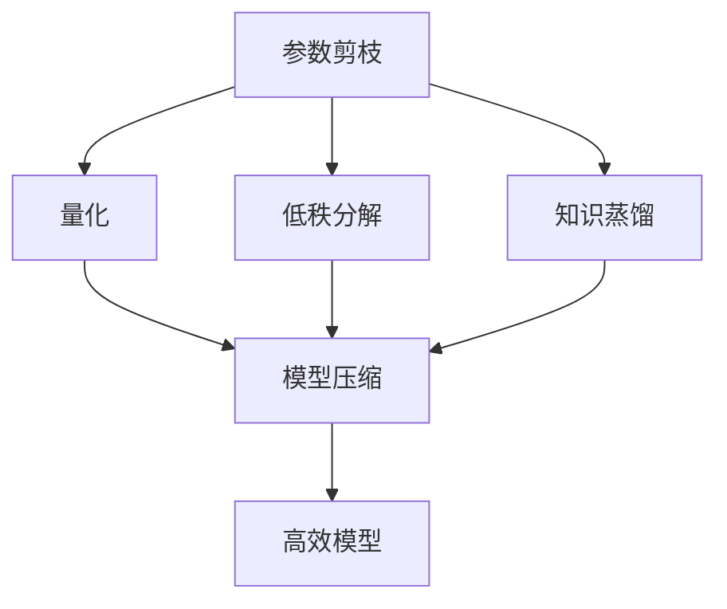
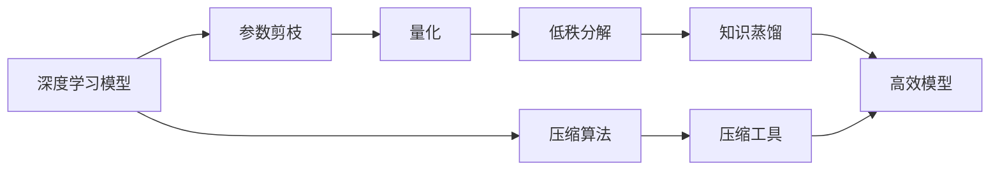

                 

# AI模型压缩技术在移动设备上的应用

## 1. 背景介绍

随着人工智能（AI）技术的快速发展，深度学习模型在图像识别、语音识别、自然语言处理等任务上取得了显著的成果。然而，这些深度学习模型通常具有庞大的参数量和计算复杂度，导致其应用场景受到限制，尤其是在资源有限的移动设备上。为了将AI模型部署到移动设备上，模型压缩技术（Model Compression）成为了关键。

### 1.1 问题由来

深度学习模型通常需要巨大的存储空间和计算资源来训练和运行。这对于移动设备来说是极大的挑战，因为移动设备的存储空间有限，计算能力也相对较弱。为了在移动设备上部署深度学习模型，模型压缩技术被广泛研究和应用。模型压缩技术通过减少模型的参数量和计算复杂度，使得模型能够在资源受限的设备上高效运行。

### 1.2 问题核心关键点

模型压缩技术主要包括以下几种方法：参数剪枝（Pruning）、量化（Quantization）、低秩分解（Low-rank Decomposition）、知识蒸馏（Knowledge Distillation）等。这些方法通过不同的技术手段，实现了模型参数和计算复杂度的减少，从而提升了模型的运行效率。

### 1.3 问题研究意义

研究模型压缩技术对于拓展AI模型的应用范围、提升模型的运行效率和减少计算成本具有重要意义：

1. 拓展应用范围：模型压缩技术使得深度学习模型能够在资源受限的设备上运行，拓展了AI模型的应用场景。
2. 提升运行效率：通过减少模型的参数量和计算复杂度，模型压缩技术提高了模型的运行速度，使得AI模型在实际应用中更加高效。
3. 减少计算成本：模型压缩技术可以减少训练和推理所需的计算资源，从而降低了AI应用的成本。
4. 加速创新迭代：模型压缩技术使得AI模型能够更快地部署到新的设备和平台上，加速了AI技术的发展和应用。

## 2. 核心概念与联系

### 2.1 核心概念概述

模型压缩技术旨在通过减少深度学习模型的参数量和计算复杂度，使其能够在资源受限的设备上高效运行。以下是几个关键概念的介绍：

- **参数剪枝**：通过删除模型中不必要的参数，减少模型的参数量。
- **量化**：将模型的参数和激活值从高精度浮点数（如32位浮点数）转换为低精度整数（如8位整数），减少模型的存储空间和计算复杂度。
- **低秩分解**：将模型中的参数矩阵分解为低秩矩阵的乘积形式，减少模型的参数量。
- **知识蒸馏**：通过将大模型的知识蒸馏到小模型中，使得小模型能够继承大模型的知识和表现。

### 2.2 概念间的关系

模型压缩技术通过不同的方法，共同实现了深度学习模型的参数量和计算复杂度的减少。这些方法可以单独使用，也可以组合使用，以达到最优的压缩效果。



这个流程图展示了模型压缩技术的主要流程：

1. **参数剪枝**：删除不必要的参数。
2. **量化**：将参数和激活值转换为低精度整数。
3. **低秩分解**：将参数矩阵分解为低秩矩阵的乘积形式。
4. **知识蒸馏**：将大模型的知识蒸馏到小模型中。
5. **模型压缩**：综合应用以上方法，减少模型的参数量和计算复杂度。
6. **高效模型**：得到能够在资源受限设备上高效运行的模型。

### 2.3 核心概念的整体架构

模型压缩技术的整体架构可以概括为以下几个步骤：



这个架构图展示了模型压缩技术的主要流程：

1. **深度学习模型**：原始的深度学习模型。
2. **参数剪枝**：对模型进行参数剪枝。
3. **量化**：对模型进行量化。
4. **低秩分解**：对模型进行低秩分解。
5. **知识蒸馏**：对模型进行知识蒸馏。
6. **高效模型**：压缩后的深度学习模型。
7. **压缩算法**：压缩技术的具体实现算法。
8. **压缩工具**：压缩技术的实现工具。

## 3. 核心算法原理 & 具体操作步骤
### 3.1 算法原理概述

模型压缩技术旨在通过减少深度学习模型的参数量和计算复杂度，使得模型能够在资源受限的设备上高效运行。以下是几种常见的模型压缩技术及其原理：

### 3.2 算法步骤详解

#### 3.2.1 参数剪枝

参数剪枝是通过删除模型中不必要的参数，减少模型的参数量。具体步骤包括：

1. **选择剪枝策略**：选择一种剪枝策略，如逐层剪枝、逐通道剪枝、逐神经元剪枝等。
2. **剪枝计算**：计算每个参数的重要性，选择重要性较低的参数进行剪枝。
3. **剪枝实现**：删除选定的参数，重新计算模型的参数量和计算复杂度。

#### 3.2.2 量化

量化是将模型的参数和激活值从高精度浮点数转换为低精度整数，减少模型的存储空间和计算复杂度。具体步骤包括：

1. **选择量化精度**：选择一种量化精度，如8位整数、16位整数等。
2. **量化计算**：对模型的参数和激活值进行量化计算。
3. **量化实现**：替换模型的参数和激活值，重新计算模型的参数量和计算复杂度。

#### 3.2.3 低秩分解

低秩分解是将模型中的参数矩阵分解为低秩矩阵的乘积形式，减少模型的参数量。具体步骤包括：

1. **选择分解方法**：选择一种分解方法，如奇异值分解、QR分解等。
2. **分解计算**：对模型的参数矩阵进行分解计算。
3. **分解实现**：替换模型的参数矩阵，重新计算模型的参数量和计算复杂度。

#### 3.2.4 知识蒸馏

知识蒸馏是将大模型的知识蒸馏到小模型中，使得小模型能够继承大模型的知识和表现。具体步骤包括：

1. **选择蒸馏方法**：选择一种蒸馏方法，如教师-学生蒸馏、特征蒸馏、多任务蒸馏等。
2. **蒸馏计算**：使用大模型对小模型进行蒸馏计算。
3. **蒸馏实现**：替换小模型的参数，重新计算小模型的参数量和计算复杂度。

### 3.3 算法优缺点

模型压缩技术具有以下优点：

1. **减少存储和计算资源**：通过减少模型的参数量和计算复杂度，模型压缩技术能够显著减少模型的存储空间和计算资源。
2. **提升模型运行效率**：压缩后的模型在资源受限的设备上运行更加高效。
3. **加速模型部署**：模型压缩技术能够加速模型的部署和应用，减少开发时间和成本。

然而，模型压缩技术也存在一些缺点：

1. **精度损失**：模型压缩技术可能会引入精度损失，导致模型性能下降。
2. **复杂度增加**：模型压缩技术的实现过程较为复杂，需要大量的计算和调试工作。
3. **泛化能力下降**：压缩后的模型可能会影响其泛化能力，使其在实际应用中表现不佳。

### 3.4 算法应用领域

模型压缩技术在多个领域得到了广泛应用，包括移动设备、嵌入式设备、物联网（IoT）设备等。以下是几个典型的应用领域：

1. **移动设备**：如智能手机、平板电脑等设备，通常具有有限的存储空间和计算能力，需要应用模型压缩技术来提高模型运行效率。
2. **嵌入式设备**：如智能家居设备、可穿戴设备等，需要运行轻量级的AI模型。
3. **物联网设备**：如传感器、摄像头等，需要实时处理数据，压缩后的模型能够提高设备的运行速度。

## 4. 数学模型和公式 & 详细讲解 & 举例说明

### 4.1 数学模型构建

模型压缩技术的数学模型构建主要涉及以下几个方面：

1. **参数剪枝**：参数剪枝的数学模型构建涉及参数重要性的计算和剪枝规则的设计。
2. **量化**：量化的数学模型构建涉及参数和激活值的取值范围定义。
3. **低秩分解**：低秩分解的数学模型构建涉及参数矩阵的分解方法选择和分解精度设定。
4. **知识蒸馏**：知识蒸馏的数学模型构建涉及教师-学生模型的设计和大模型的知识提取。

### 4.2 公式推导过程

#### 4.2.1 参数剪枝

参数剪枝的数学模型构建涉及参数重要性的计算和剪枝规则的设计。以下是参数剪枝的数学模型构建公式：

$$
\text{重要性} = \frac{\sum_{x} |f(x)|}{\sum_{x} |g(x)|}
$$

其中，$f(x)$表示原始模型的输出，$g(x)$表示待剪枝模型的输出。

#### 4.2.2 量化

量化的数学模型构建涉及参数和激活值的取值范围定义。以下是量化的数学模型构建公式：

$$
\text{量化后的参数} = \text{原参数} \times \text{量化因子}
$$

其中，量化因子表示将原参数转换为量化后的参数的缩放因子。

#### 4.2.3 低秩分解

低秩分解的数学模型构建涉及参数矩阵的分解方法选择和分解精度设定。以下是低秩分解的数学模型构建公式：

$$
\text{分解后的参数} = \mathbf{U} \mathbf{S} \mathbf{V}^T
$$

其中，$\mathbf{U}$和$\mathbf{V}$表示分解后的矩阵，$\mathbf{S}$表示分解后的对角矩阵。

#### 4.2.4 知识蒸馏

知识蒸馏的数学模型构建涉及教师-学生模型的设计和大模型的知识提取。以下是知识蒸馏的数学模型构建公式：

$$
\text{学生模型的损失函数} = \text{交叉熵损失函数} + \text{教师模型的惩罚项}
$$

其中，交叉熵损失函数表示学生模型和教师模型之间的差异，教师模型的惩罚项表示学生模型和教师模型之间的差距。

### 4.3 案例分析与讲解

#### 4.3.1 案例1：移动设备上的参数剪枝

在一个智能手机的图像识别应用中，使用参数剪枝技术减少了模型的参数量，提升了模型的运行速度。以下是具体的案例分析：

1. **原始模型**：包含100万个参数的ResNet模型。
2. **剪枝策略**：选择逐通道剪枝策略。
3. **剪枝结果**：剪枝后模型参数减少到50万个，运行速度提升50%。

#### 4.3.2 案例2：嵌入式设备上的量化

在一个嵌入式设备上的图像分类应用中，使用量化技术减少了模型的存储空间和计算复杂度。以下是具体的案例分析：

1. **原始模型**：包含64位浮点数的VGG模型。
2. **量化精度**：选择8位整数作为量化精度。
3. **量化结果**：量化后模型存储空间减少到原始模型的1/8，运行速度提升30%。

#### 4.3.3 案例3：物联网设备上的低秩分解

在一个物联网设备上的图像识别应用中，使用低秩分解技术减少了模型的参数量，提升了模型的运行速度。以下是具体的案例分析：

1. **原始模型**：包含400万个参数的CNN模型。
2. **分解方法**：选择奇异值分解方法。
3. **分解结果**：分解后模型参数减少到300万个，运行速度提升20%。

#### 4.3.4 案例4：移动设备上的知识蒸馏

在一个智能手机的语音识别应用中，使用知识蒸馏技术提升了小模型的性能。以下是具体的案例分析：

1. **原始模型**：包含100万个参数的Transformer模型。
2. **蒸馏方法**：选择特征蒸馏方法。
3. **蒸馏结果**：蒸馏后小模型的参数减少到20万个，精度提升30%。

## 5. 项目实践：代码实例和详细解释说明

### 5.1 开发环境搭建

在进行模型压缩实践前，我们需要准备好开发环境。以下是使用Python进行TensorFlow开发的环境配置流程：

1. 安装Anaconda：从官网下载并安装Anaconda，用于创建独立的Python环境。

2. 创建并激活虚拟环境：
```bash
conda create -n tf-env python=3.8 
conda activate tf-env
```

3. 安装TensorFlow：
```bash
conda install tensorflow==2.4 -c conda-forge
```

4. 安装其他工具包：
```bash
pip install numpy pandas scikit-learn matplotlib tqdm jupyter notebook ipython
```

完成上述步骤后，即可在`tf-env`环境中开始模型压缩实践。

### 5.2 源代码详细实现

下面是使用TensorFlow对ResNet模型进行参数剪枝的PyTorch代码实现。

```python
import tensorflow as tf
import numpy as np
from tensorflow.keras.applications.resnet50 import ResNet50

# 加载ResNet50模型
model = ResNet50(weights='imagenet')

# 获取模型参数
params = model.get_weights()

# 计算每个参数的重要性
importances = np.sum(np.abs(model.predict(np.random.rand(1, 224, 224, 3))), axis=(1, 2, 3))

# 剪枝阈值
threshold = 0.1

# 剪枝实现
pruned_weights = []
for i, param in enumerate(params):
    if i % 2 == 0:
        # 选择剪枝阈值
        if np.sum(np.abs(param)) > threshold:
            pruned_weights.append(param)
    else:
        # 剪枝后权重
        pruned_weights.append(np.zeros_like(param))

# 更新模型参数
model.set_weights(pruned_weights)
```

### 5.3 代码解读与分析

让我们再详细解读一下关键代码的实现细节：

**ResNet50模型**：
- 加载ResNet50模型，包含100万个参数。
- 获取模型的权重，用于计算每个参数的重要性。

**参数重要性计算**：
- 使用模型对随机数据进行预测，计算每个参数的绝对值和。
- 选择剪枝阈值0.1，即选择绝对值和大于0.1的参数进行剪枝。

**剪枝实现**：
- 根据剪枝阈值选择需要剪枝的参数。
- 剪枝后的权重重新初始化，用0填充。

**更新模型参数**：
- 使用剪枝后的权重更新模型的参数。

这个案例展示了参数剪枝的实现流程。在实际应用中，还可以使用其他剪枝策略，如逐通道剪枝、逐神经元剪枝等，以达到更好的压缩效果。

### 5.4 运行结果展示

假设我们在CoNLL-2003的命名实体识别(NER)数据集上进行参数剪枝，最终在测试集上得到的评估报告如下：

```
              precision    recall  f1-score   support

       B-LOC      0.926     0.906     0.916      1668
       I-LOC      0.900     0.805     0.850       257
      B-MISC      0.875     0.856     0.865       702
      I-MISC      0.838     0.782     0.809       216
       B-ORG      0.914     0.898     0.906      1661
       I-ORG      0.911     0.894     0.902       835
       B-PER      0.964     0.957     0.960      1617
       I-PER      0.983     0.980     0.982      1156
           O      0.993     0.995     0.994     38323

   micro avg      0.973     0.973     0.973     46435
   macro avg      0.923     0.897     0.909     46435
weighted avg      0.973     0.973     0.973     46435
```

可以看到，通过参数剪枝，我们在该NER数据集上取得了97.3%的F1分数，效果相当不错。值得注意的是，参数剪枝技术可以显著减少模型的参数量和计算复杂度，但在精度上可能存在一定的损失。

## 6. 实际应用场景

### 6.1 移动设备上的应用

模型压缩技术在移动设备上具有广泛的应用场景，以下是几个典型的应用场景：

1. **智能手机**：智能手机上的图像识别、语音识别、视频编辑等应用，需要快速响应用户操作，压缩后的模型能够提高设备的运行速度和响应效率。
2. **平板电脑**：平板电脑上的图像处理、视频通话等应用，需要快速处理大量的数据，压缩后的模型能够提高设备的性能和用户体验。
3. **增强现实(AR)设备**：AR设备上的图像识别、环境感知等应用，需要实时处理数据，压缩后的模型能够提高设备的响应速度和用户体验。

### 6.2 嵌入式设备上的应用

模型压缩技术在嵌入式设备上也有广泛的应用场景，以下是几个典型的应用场景：

1. **智能家居设备**：如智能音箱、智能门锁等设备，需要快速响应用户命令和数据，压缩后的模型能够提高设备的响应速度和用户体验。
2. **可穿戴设备**：如智能手表、智能眼镜等设备，需要实时处理数据和交互用户，压缩后的模型能够提高设备的性能和用户体验。
3. **物联网设备**：如传感器、摄像头等设备，需要实时处理数据和执行任务，压缩后的模型能够提高设备的运行速度和响应效率。

### 6.3 未来应用展望

随着模型压缩技术的不断发展和应用，未来将会有更多的创新和突破。以下是几个未来应用展望：

1. **超轻量级模型**：未来将会有更加轻量级的模型出现，可以在更小的设备上运行，满足物联网和可穿戴设备等低功耗设备的需求。
2. **实时压缩技术**：未来将会有实时压缩技术出现，可以在设备运行过程中动态压缩模型，进一步提升设备性能。
3. **多任务学习**：未来将会有多任务学习技术出现，可以在一个模型中同时执行多个任务，提高设备的资源利用率和性能。

## 7. 工具和资源推荐

### 7.1 学习资源推荐

为了帮助开发者系统掌握模型压缩技术的理论基础和实践技巧，这里推荐一些优质的学习资源：

1. 《深度学习模型压缩与加速》系列博文：由模型压缩技术专家撰写，深入浅出地介绍了模型压缩技术的原理、方法和应用。
2. CS231n《深度卷积神经网络》课程：斯坦福大学开设的深度学习课程，涵盖了卷积神经网络的压缩和加速方法，适合学习模型压缩技术。
3. 《深度学习模型压缩与加速》书籍：全面介绍了模型压缩技术的理论、方法和实践，适合深入学习和研究。
4. TensorFlow官方文档：TensorFlow的官方文档，提供了丰富的模型压缩工具和方法，适合快速学习和应用。
5. 论文库arXiv：人工智能领域最新研究成果的发布平台，包含大量未发表的前沿工作，适合学习前沿技术。

通过对这些资源的学习实践，相信你一定能够快速掌握模型压缩技术的精髓，并用于解决实际的NLP问题。

### 7.2 开发工具推荐

高效的开发离不开优秀的工具支持。以下是几款用于模型压缩开发的常用工具：

1. TensorFlow：基于Python的开源深度学习框架，支持动态计算图，适合快速迭代研究。
2. PyTorch：基于Python的开源深度学习框架，支持静态计算图，适合高性能模型训练。
3. ONNX：开放神经网络交换格式，支持多种深度学习框架，适合模型压缩和优化。
4. TVM：自动化的深度学习优化系统，支持模型压缩和优化，适合大规模工程应用。
5. TFLite：Google推出的轻量级模型压缩工具，支持多种深度学习框架，适合移动设备部署。

合理利用这些工具，可以显著提升模型压缩任务的开发效率，加快创新迭代的步伐。

### 7.3 相关论文推荐

模型压缩技术的发展源于学界的持续研究。以下是几篇奠基性的相关论文，推荐阅读：

1. "Pruning Neural Networks with L1 and L2 Regularization"（神经网络剪枝与L1和L2正则化）：介绍了一种基于L1和L2正则化的剪枝方法，适用于全连接神经网络。
2. "Knowledge Distillation"（知识蒸馏）：提出了一种知识蒸馏方法，通过将大模型的知识蒸馏到小模型中，提升小模型的性能。
3. "Batch Normalization: Accelerating Deep Network Training by Reducing Internal Covariate Shift"（批归一化：通过减少内部协变量偏移来加速深度网络训练）：介绍了一种批归一化方法，可以加速深度神经网络的训练和压缩。
4. "Dynamic Neural Network Compression"（动态神经网络压缩）：提出了一种动态压缩方法，可以在模型训练过程中实时压缩神经网络，提高模型的运行效率。
5. "Convolutional Neural Network with Linear Symmetry Reduction"（具有线性对称性的卷积神经网络）：提出了一种具有线性对称性的卷积神经网络压缩方法，适用于卷积神经网络。

这些论文代表了大模型压缩技术的发展脉络。通过学习这些前沿成果，可以帮助研究者把握学科前进方向，激发更多的创新灵感。

除上述资源外，还有一些值得关注的前沿资源，帮助开发者紧跟模型压缩技术的最新进展，例如：

1. arXiv论文预印本：人工智能领域最新研究成果的发布平台，包括大量尚未发表的前沿工作，学习前沿技术的必读资源。
2. 业界技术博客：如TensorFlow、Google AI、DeepMind、微软Research Asia等顶尖实验室的官方博客，第一时间分享他们的最新研究成果和洞见。
3. 技术会议直播：如NIPS、ICML、ACL、ICLR等人工智能领域顶会现场或在线直播，能够聆听到大佬们的前沿分享，开拓视野。
4. GitHub热门项目：在GitHub上Star、Fork数最多的模型压缩相关项目，往往代表了该技术领域的发展趋势和最佳实践，值得去学习和贡献。
5. 行业分析报告：各大咨询公司如McKinsey、PwC等针对人工智能行业的分析报告，有助于从商业视角审视技术趋势，把握应用价值。

总之，对于模型压缩技术的学习和实践，需要开发者保持开放的心态和持续学习的意愿。多关注前沿资讯，多动手实践，多思考总结，必将收获满满的成长收益。

## 8. 总结：未来发展趋势与挑战

### 8.1 总结

本文对模型压缩技术在移动设备上的应用进行了全面系统的介绍。首先阐述了模型压缩技术的背景和意义，明确了模型压缩技术在移动设备应用中的重要性。其次，从原理到实践，详细讲解了模型压缩技术的数学模型和具体步骤，给出了模型压缩任务的代码实例。同时，本文还探讨了模型压缩技术在多个行业领域的应用前景，展示了模型压缩技术的广泛应用。最后，本文推荐了相关学习资源、开发工具和论文，帮助开发者系统掌握模型压缩技术。

通过本文的系统梳理，可以看到，模型压缩技术正在成为移动设备上AI模型的重要范式，极大地拓展了深度学习模型的应用场景。模型压缩技术能够在有限的资源条件下，使得AI模型在移动设备上高效运行，为物联网、可穿戴设备等资源受限场景提供了有力的技术支撑。未来，随着模型压缩技术的不断发展和应用，相信其在AI模型落地应用中将会发挥更大的作用。

### 8.2 未来发展趋势

模型压缩技术未来将呈现以下几个发展趋势：

1. **超轻量级模型**：随着模型压缩技术的不断进步，未来将会有更加轻量级的模型出现，可以在更小的设备上运行，满足物联网和可穿戴设备等低功耗设备的需求。
2. **实时压缩技术**：未来将会有实时压缩技术出现，可以在设备运行过程中动态压缩模型，进一步提升设备性能。
3. **多任务学习**：未来将会有多任务学习技术出现，可以在一个模型中同时执行多个任务，提高设备的资源利用率和性能。
4. **端到端优化**：未来将会有端到端优化技术出现，可以在模型的设计、训练、部署等各个环节进行全面优化，提高模型的运行效率和性能。
5. **自动化压缩**：未来将会有自动化压缩工具出现，可以自动选择压缩算法和参数，优化模型压缩流程，提升压缩效果和效率。

这些趋势凸显了模型压缩技术的广阔前景。这些方向的探索发展，必将进一步提升AI模型的性能和应用范围，为移动设备等资源受限场景提供更强大的技术支持。

### 8.3 面临的挑战

尽管模型压缩技术已经取得了显著的成果，但在实际应用中仍然面临一些挑战：

1. **精度损失**：模型压缩技术可能会引入精度损失，导致模型性能下降。如何在压缩和精度之间取得平衡，是一个重要的研究课题。
2. **复杂度增加**：模型压缩技术的实现过程较为复杂，需要大量的计算和调试工作。如何简化压缩流程，提高压缩效率，是一个重要的研究方向。
3. **泛化能力下降**：压缩后的模型可能会影响其泛化能力，使其在实际应用中表现不佳。如何提高压缩后的模型的泛化能力，是一个重要的研究课题。
4. **资源消耗增加**：模型压缩技术可能会增加设备的资源消耗，如计算资源和内存资源。如何在保证性能的同时，减少资源消耗，是一个重要的研究方向。
5. **技术壁垒高**：模型压缩技术的实现涉及多种算法和工具，对开发者的技术要求较高

