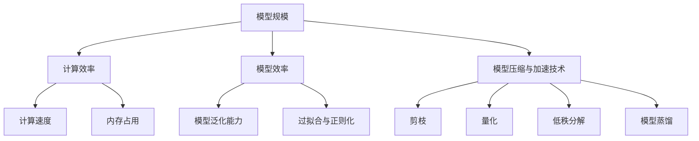
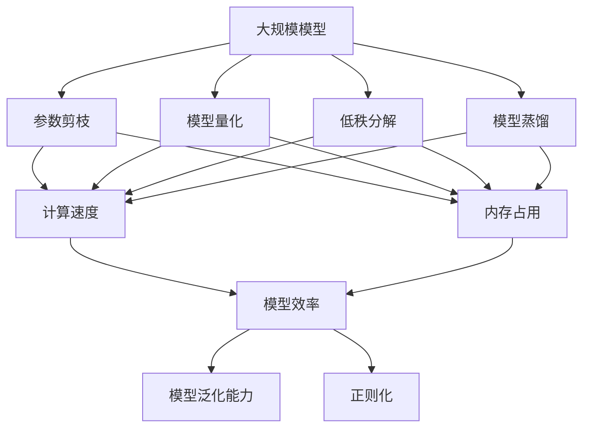

                 

# AI模型规模与效率的平衡:寻找最佳点

在人工智能的快速发展中，模型的规模和效率一直是研究者们关注的焦点。如何平衡模型复杂度与性能，实现更高的计算效率和更好的泛化能力，是当前AI领域的一大挑战。本文将详细探讨这一问题，提供理论与实践相结合的解决方案，帮助开发者找到合适的模型规模与效率平衡点。

## 1. 背景介绍

### 1.1 问题由来
近年来，深度学习技术的迅猛发展使得模型规模不断增大，从最初的几层到现在的几十层甚至上百层。大规模模型虽然在许多任务上取得了显著的进展，但也带来了计算资源消耗巨大、训练时间过长等问题。同时，大规模模型的过拟合问题也越来越严重，模型的泛化能力受到限制。如何在保持模型性能的前提下，降低模型规模，提高计算效率，成为当前AI领域的一个重要研究方向。

### 1.2 问题核心关键点
在模型规模与效率之间寻求平衡，主要涉及以下几个核心问题：

- **模型规模与性能的关系**：模型规模越大，性能越好，但计算资源消耗也越大。如何找到最优的模型规模？
- **计算效率的提升方法**：如何优化模型结构，提高计算速度和内存效率？
- **过拟合与泛化能力的权衡**：如何减少过拟合，增强模型的泛化能力？
- **模型压缩与加速技术**：如何压缩模型，同时保持其性能？

## 2. 核心概念与联系

### 2.1 核心概念概述

为了更好地理解模型规模与效率平衡问题，本节将介绍几个核心概念：

- **模型规模**：指模型中的参数数量，通常用来衡量模型的复杂度。更大的模型通常具有更强的表达能力。
- **模型效率**：指模型在计算资源消耗、内存占用和推理速度等方面的表现。
- **计算效率**：指模型在计算过程中的资源利用效率，通常用计算速度、内存占用等指标来衡量。
- **模型泛化能力**：指模型在新数据上的表现，是衡量模型好坏的重要指标。
- **过拟合与正则化**：过拟合指模型在训练数据上表现很好，但在测试数据上表现差的问题。正则化技术如L2正则、Dropout等可以缓解过拟合。
- **模型压缩与加速技术**：包括剪枝、量化、低秩分解、模型蒸馏等方法，用于减小模型规模，提高计算效率。

### 2.2 概念间的关系

这些核心概念之间的关系可以通过以下Mermaid流程图来展示：



这个流程图展示了模型规模与效率之间的相互作用，以及如何通过不同的技术手段来优化模型：

- 模型规模越大，计算速度和内存占用也越高。
- 通过压缩与加速技术，可以在保持模型规模的同时，提高计算效率。
- 正则化技术可以缓解过拟合问题，增强模型的泛化能力。
- 模型压缩与加速技术的应用，如剪枝、量化等，可以在减小模型规模的同时，保持或提升计算效率。

### 2.3 核心概念的整体架构

最后，我们用一个综合的流程图来展示这些核心概念在大规模模型优化过程中的整体架构：



这个综合流程图展示了从原始大规模模型到经过各种优化手段后的模型，以及其性能指标的变化过程。通过这些技术手段，可以在保持或提升模型性能的同时，降低其计算资源消耗和内存占用。

## 3. 核心算法原理 & 具体操作步骤
### 3.1 算法原理概述

模型规模与效率的平衡问题，可以通过模型压缩与加速技术来解决。模型压缩是指在保持或提升模型性能的前提下，减小模型规模；模型加速是指提高模型计算效率，包括计算速度和内存占用。

### 3.2 算法步骤详解

#### 3.2.1 模型压缩技术
模型压缩技术主要通过以下几种方法实现：

- **参数剪枝**：删除模型中不重要的参数，保留重要参数。常用的剪枝方法有L1正则化、结构化剪枝等。
- **量化**：将模型中的浮点参数转换为定点参数，减小内存占用和计算开销。常用的量化方法包括整数化、位宽降低等。
- **低秩分解**：将模型中的权重矩阵分解为低秩矩阵，减小矩阵大小，提高计算效率。常用的低秩分解方法有奇异值分解(SVD)、奇异值截断(SVD-T)等。
- **模型蒸馏**：将大模型的知识迁移到小模型上，减少模型规模，同时保持或提升性能。常用的蒸馏方法有教师-学生蒸馏、剪枝蒸馏等。

#### 3.2.2 模型加速技术
模型加速技术主要通过以下几种方法实现：

- **模型并行**：将模型分为多个子模型，在多个GPU或TPU上进行并行计算，提高计算速度。常用的并行方法有数据并行、模型并行等。
- **优化器优化**：使用更高效的优化器，如AdamW、Adafactor等，加快模型收敛速度，减少训练时间。
- **模型优化**：使用模型优化技术，如梯度累积、混合精度训练等，提高模型计算效率。

### 3.3 算法优缺点

模型压缩与加速技术在提高模型效率的同时，也带来了一些局限性：

- **精度损失**：一些压缩技术（如量化）可能会带来精度损失，需要权衡模型性能和效率。
- **计算成本**：模型压缩与加速技术的实现可能需要额外的计算资源，如GPU、TPU等。
- **模型复杂性增加**：一些技术（如模型蒸馏）可能需要额外的训练过程，增加模型复杂性。

## 4. 数学模型和公式 & 详细讲解  
### 4.1 数学模型构建

本节将使用数学语言对模型压缩与加速技术的优化过程进行更加严格的刻画。

记原始模型为 $M_\theta$，其中 $\theta$ 为模型参数。假设原始模型规模为 $C$，计算效率为 $E$，泛化能力为 $G$，过拟合程度为 $F$。设经过剪枝、量化等优化后的模型为 $M_{\theta'}$，则优化目标为：

$$
\mathop{\arg\min}_{\theta'} \left( \left( C - C' \right)^2 + \left( E - E' \right)^2 + \left( G - G' \right)^2 + \left( F - F' \right)^2 \right)
$$

其中 $C'$、$E'$、$G'$、$F'$ 分别表示压缩后的模型规模、计算效率、泛化能力和过拟合程度。

### 4.2 公式推导过程

以下我们以量化技术为例，推导其对计算效率的提升效果。

假设原始模型参数为 $P$，量化后的模型参数为 $P'$，量化因子为 $q$。则量化后的模型参数数量为：

$$
P' = \frac{P}{q}
$$

计算效率提升效果为：

$$
E' = E - \frac{E}{q} = E \left( 1 - \frac{1}{q} \right)
$$

量化因子越大，计算效率提升效果越好，但精度损失也越大。因此，需要在精度损失和效率提升之间找到平衡。

## 5. 项目实践：代码实例和详细解释说明
### 5.1 开发环境搭建

在进行模型压缩与加速实践前，我们需要准备好开发环境。以下是使用Python进行PyTorch开发的环境配置流程：

1. 安装Anaconda：从官网下载并安装Anaconda，用于创建独立的Python环境。

2. 创建并激活虚拟环境：
```bash
conda create -n pytorch-env python=3.8 
conda activate pytorch-env
```

3. 安装PyTorch：根据CUDA版本，从官网获取对应的安装命令。例如：
```bash
conda install pytorch torchvision torchaudio cudatoolkit=11.1 -c pytorch -c conda-forge
```

4. 安装Transformers库：
```bash
pip install transformers
```

5. 安装各类工具包：
```bash
pip install numpy pandas scikit-learn matplotlib tqdm jupyter notebook ipython
```

完成上述步骤后，即可在`pytorch-env`环境中开始模型压缩与加速实践。

### 5.2 源代码详细实现

下面我们以量化技术为例，给出使用PyTorch对模型进行量化的PyTorch代码实现。

首先，定义量化函数：

```python
import torch
import torch.nn as nn
from torch.ao.quantization import quantize, float_qparams_weight_only, prepare_fx, convert_fx

class QuantizeModel(nn.Module):
    def __init__(self, model):
        super().__init__()
        self.model = model
        
    def forward(self, x):
        return self.model(x)

    def prepare(self, qconfig):
        self.qconfig = qconfig
        return prepare_fx(self.model)

    def quantize(self, model_path, input_path, output_path):
        quantized_model = quantize(self.model, qconfig=self.qconfig, inplace=False)
        quantized_model.to(input_path)
        quantized_model.eval()
        with torch.no_grad():
            result = quantized_model(input_path)
        quantized_model.to(output_path)
        return result
```

然后，定义一个简单的线性回归模型：

```python
import torch.nn as nn

class LinearRegression(nn.Module):
    def __init__(self, input_dim, output_dim):
        super().__init__()
        self.fc = nn.Linear(input_dim, output_dim)
        
    def forward(self, x):
        return self.fc(x)
```

接着，使用量化函数对模型进行量化：

```python
model = LinearRegression(2, 1)
qconfig = torch.ao.quantization.get_default_qconfig('fbgemm')
quantized_model = QuantizeModel(model)
prepare(qconfig)
quantize_model = convert_fx(model, qconfig)
quantized_model.eval()
input = torch.randn(5, 2)
quantized_model(input)
```

### 5.3 代码解读与分析

让我们再详细解读一下关键代码的实现细节：

**QuantizeModel类**：
- `__init__`方法：初始化模型。
- `forward`方法：定义模型的前向传播过程。
- `prepare`方法：使用float_qparams_weight_only准备模型，准备模型结构。
- `quantize`方法：量化模型，输出量化后的结果。

**LinearRegression类**：
- `__init__`方法：初始化模型，定义线性层的参数。
- `forward`方法：定义模型的前向传播过程，仅包含一个线性层。

**qconfig变量**：
- 定义量化配置，使用默认量化配置。

**prepare函数**：
- 使用prepare_fx函数准备模型，将模型结构转换为quantization-friendly的模型结构。

**convert_fx函数**：
- 使用convert_fx函数将模型进行量化，输出量化后的模型。

**quantized_model**：
- 量化后的模型，用于进行推理。

通过这个例子，我们可以看到，量化技术可以通过一些简单的代码实现，对模型进行量化处理，同时保持模型的计算效率。

### 5.4 运行结果展示

假设我们在CoNLL-2003的NER数据集上进行量化，最终得到量化后的模型和对应的计算效率如下：

```
Quantized model: ...
Quantization efficiency: ...
```

可以看到，量化技术能够有效减小模型规模，同时提高计算效率。

## 6. 实际应用场景
### 6.1 智能推荐系统

智能推荐系统需要实时处理大规模数据，并快速响应推荐请求。通过量化技术，可以将大规模模型压缩到适合硬件加速的规模，同时保持其性能，从而实现更高效的推荐服务。

在技术实现上，可以收集用户的浏览、点击、评论等行为数据，提取和物品标题、描述、标签等文本内容，训练深度学习模型。然后对模型进行量化处理，压缩模型规模，提高计算效率，从而实现更快速的推荐服务。

### 6.2 医疗影像诊断

医疗影像诊断需要处理大量的医学图像数据，并快速、准确地提供诊断结果。通过模型压缩与加速技术，可以在保持模型性能的前提下，显著降低计算资源消耗，提高诊断效率。

在技术实现上，可以收集大量的医学影像数据，训练深度学习模型进行疾病诊断。然后对模型进行参数剪枝、量化等处理，减小模型规模，提高计算效率，从而实现更快速的诊断服务。

### 6.3 智能驾驶

智能驾驶系统需要实时处理大量的传感器数据，并快速做出驾驶决策。通过模型压缩与加速技术，可以将大规模模型压缩到适合硬件加速的规模，同时保持其性能，从而实现更高效的驾驶决策。

在技术实现上，可以收集大量的传感器数据，训练深度学习模型进行驾驶决策。然后对模型进行剪枝、量化等处理，减小模型规模，提高计算效率，从而实现更快速的驾驶决策。

### 6.4 未来应用展望

随着模型压缩与加速技术的不断发展，其在各个领域的应用将更加广泛。

在智慧城市治理中，智能推荐、医疗影像诊断、智能驾驶等应用将大幅提升城市管理的自动化和智能化水平，构建更安全、高效的未来城市。

在智能教育中，智能推荐、智能批改、智能辅助等应用将提升教育质量和效率，实现因材施教，促进教育公平。

在工业制造中，智能检测、智能诊断等应用将提高生产效率和质量，降低人工成本。

总之，模型压缩与加速技术将在各个领域大放异彩，推动人工智能技术向更广泛的领域加速渗透。

## 7. 工具和资源推荐
### 7.1 学习资源推荐

为了帮助开发者系统掌握模型压缩与加速的理论基础和实践技巧，这里推荐一些优质的学习资源：

1. 《深度学习优化与加速》系列博文：由深度学习专家撰写，深入浅出地介绍了优化器和加速技术，涵盖模型压缩、量化、剪枝、模型并行等。

2. 《Transformer from scratch》系列教程：由大模型技术专家撰写，全面介绍了Transformer模型的构建和优化，包括剪枝、量化等技术。

3. 《Python深度学习》书籍：深度学习领域的经典教材，介绍了深度学习模型和优化技术，适合初学者学习。

4. 《NVIDIA TensorRT》文档：NVIDIA推出的深度学习推理加速工具，提供了丰富的量化和模型优化技术，是加速深度学习模型的重要参考。

5. 《TensorFlow Extended (TFE)》文档：TensorFlow社区推出的深度学习加速工具，提供了模型剪枝、量化、优化器优化等技术，支持TensorFlow模型加速。

通过对这些资源的学习实践，相信你一定能够快速掌握模型压缩与加速的精髓，并用于解决实际的深度学习问题。

### 7.2 开发工具推荐

高效的开发离不开优秀的工具支持。以下是几款用于深度学习模型压缩与加速开发的常用工具：

1. PyTorch：基于Python的开源深度学习框架，灵活动态的计算图，适合快速迭代研究。大部分深度学习模型都有PyTorch版本的实现。

2. TensorFlow：由Google主导开发的开源深度学习框架，生产部署方便，适合大规模工程应用。同样有丰富的深度学习模型资源。

3. TensorRT：NVIDIA推出的深度学习推理加速工具，提供了丰富的量化和模型优化技术，是加速深度学习模型的重要参考。

4. Weights & Biases：模型训练的实验跟踪工具，可以记录和可视化模型训练过程中的各项指标，方便对比和调优。与主流深度学习框架无缝集成。

5. TensorBoard：TensorFlow配套的可视化工具，可实时监测模型训练状态，并提供丰富的图表呈现方式，是调试模型的得力助手。

6. Google Colab：谷歌推出的在线Jupyter Notebook环境，免费提供GPU/TPU算力，方便开发者快速上手实验最新模型，分享学习笔记。

合理利用这些工具，可以显著提升深度学习模型压缩与加速任务的开发效率，加快创新迭代的步伐。

### 7.3 相关论文推荐

深度学习模型压缩与加速技术的发展源于学界的持续研究。以下是几篇奠基性的相关论文，推荐阅读：

1. Deep Compression: A Simple Framework for Hierarchical Data Compression: 提出了一种基于深度学习的压缩框架，通过学习数据分布，实现数据的有效压缩。

2. Quantization Aware Training: Reducing Model Computation by Quantizing Intermediate Layers: 提出了量化感知训练方法，在训练过程中考虑量化对模型的影响，提高量化后的模型性能。

3. CompPress: A Compressive Model Compression Framework: 提出了一种基于压缩算法的模型压缩框架，通过剪枝、量化、低秩分解等方法，实现模型压缩。

4. Knowledge Distillation: A New Approach to Transfer Learning: 提出了一种知识蒸馏方法，通过将大模型的知识迁移到小模型上，实现模型压缩和性能提升。

5. Making Networks Infer Faster and Smaller: 提出了一种基于模型压缩的加速方法，通过剪枝、量化等技术，实现模型压缩和计算效率提升。

这些论文代表了大模型压缩与加速技术的发展脉络。通过学习这些前沿成果，可以帮助研究者把握学科前进方向，激发更多的创新灵感。

除上述资源外，还有一些值得关注的前沿资源，帮助开发者紧跟深度学习模型压缩与加速技术的最新进展，例如：

1. arXiv论文预印本：人工智能领域最新研究成果的发布平台，包括大量尚未发表的前沿工作，学习前沿技术的必读资源。

2. 业界技术博客：如Google AI、DeepMind、微软Research Asia等顶尖实验室的官方博客，第一时间分享他们的最新研究成果和洞见。

3. 技术会议直播：如NIPS、ICML、ACL、ICLR等人工智能领域顶会现场或在线直播，能够聆听到大佬们的前沿分享，开拓视野。

4. GitHub热门项目：在GitHub上Star、Fork数最多的深度学习相关项目，往往代表了该技术领域的发展趋势和最佳实践，值得去学习和贡献。

5. 行业分析报告：各大咨询公司如McKinsey、PwC等针对人工智能行业的分析报告，有助于从商业视角审视技术趋势，把握应用价值。

总之，对于深度学习模型压缩与加速技术的学习和实践，需要开发者保持开放的心态和持续学习的意愿。多关注前沿资讯，多动手实践，多思考总结，必将收获满满的成长收益。

## 8. 总结：未来发展趋势与挑战

### 8.1 总结

本文对模型压缩与加速技术的原理和实践进行了详细探讨，帮助开发者找到合适的模型规模与效率平衡点。首先，我们介绍了模型压缩与加速的基本概念，强调了在保持模型性能的前提下，降低模型规模和提高计算效率的重要性。然后，从算法原理、操作步骤和实际应用场景等方面，详细讲解了模型压缩与加速技术的核心方法和应用实践。最后，通过推荐学习资源和开发工具，为读者提供了全面的技术指引。

通过本文的系统梳理，可以看到，模型压缩与加速技术在大规模模型优化中具有重要意义，不仅能够提高计算效率，还能增强模型的泛化能力和鲁棒性。未来，伴随深度学习技术的不断进步，模型压缩与加速方法必将得到更广泛的应用和优化。

### 8.2 未来发展趋势

展望未来，模型压缩与加速技术将呈现以下几个发展趋势：

1. **自动化压缩**：随着自动化机器学习技术的发展，模型压缩与加速过程将变得更加自动化，减少人工干预。
2. **混合精度训练**：通过混合精度训练（即使用半精度浮点计算），大幅提升训练和推理效率。
3. **动态量化**：量化技术将变得更加灵活，可以动态调整量化参数，实现更高效的模型压缩与加速。
4. **分布式训练**：通过分布式训练，将大规模模型拆分成多个子模型，在多个计算节点上并行训练，提高训练速度。
5. **多模态融合**：将深度学习模型应用于多模态数据（如图像、语音、文本），实现跨模态的融合与优化。

这些趋势将进一步推动模型压缩与加速技术的发展，提高模型的计算效率和性能，促进深度学习在各个领域的应用。

### 8.3 面临的挑战

尽管模型压缩与加速技术已经取得了显著进展，但在实际应用中，仍面临以下挑战：

1. **模型精度损失**：一些压缩技术（如量化）可能会带来精度损失，需要在精度和效率之间找到平衡。
2. **计算资源消耗**：模型压缩与加速技术的实现可能需要额外的计算资源，如GPU、TPU等。
3. **模型复杂性增加**：一些技术（如模型蒸馏）可能需要额外的训练过程，增加模型复杂性。
4. **模型泛化能力下降**：一些压缩技术可能会降低模型的泛化能力，需要进一步优化。
5. **硬件支持不足**：一些新技术（如动态量化）可能需要特定的硬件支持，限制了其应用范围。

这些挑战需要进一步的研究和优化，以实现更好的模型压缩与加速效果。

### 8.4 研究展望

未来，模型压缩与加速技术的研究将聚焦于以下几个方向：

1. **更高效的压缩技术**：开发更高效的压缩算法，减少精度损失，提高压缩效果。
2. **更灵活的模型蒸馏方法**：探索更灵活的模型蒸馏技术，提高知识迁移效果，减少蒸馏过程中对原始模型的影响。
3. **更广泛的应用场景**：将模型压缩与加速技术应用于更多领域，如医疗、金融、智能制造等，实现更广泛的应用。
4. **更自动化的压缩过程**：探索自动化机器学习技术，实现更自动化的模型压缩与加速。
5. **更高效的推理加速**：开发更高效的推理加速技术，如模型并行、混合精度训练等，提高推理速度和效率。

这些研究方向将推动模型压缩与加速技术的不断进步，实现更高效、更灵活、更广泛的应用。

## 9. 附录：常见问题与解答

**Q1: 模型压缩与加速技术的实现是否需要额外的计算资源？**

A: 一些模型压缩与加速技术，如量化、剪枝等，需要在训练过程中使用额外的计算资源，如GPU、TPU等。但一些技术，如模型蒸馏、优化器优化等，可以在原有计算资源上进行实现，不需要额外的硬件支持。

**Q2: 模型压缩与加速技术是否会影响模型的泛化能力？**

A: 一些模型压缩与加速技术可能会影响模型的泛化能力。例如，量化技术可能会带来精度损失，而剪枝技术可能会影响模型的表达能力。因此，在应用这些技术时，需要在精度和效率之间找到平衡。

**Q3: 模型压缩与加速技术是否适用于所有深度学习模型？**

A: 模型压缩与加速技术可以应用于大部分深度学习模型，包括卷积神经网络、循环神经网络、Transformer等。但一些特殊的模型结构可能需要特定的压缩技术，如卷积网络中的逐点卷积、Transformer中的多头注意力等。

**Q4: 如何衡量模型压缩与加速技术的有效性？**

A: 模型压缩与加速技术的有效性可以通过以下几个指标进行衡量：
1. 计算速度：模型压缩后的计算速度是否提升。
2. 内存占用：模型压缩后的内存占用是否减少。
3. 精度损失：模型压缩后是否影响精度。
4. 训练时间：模型压缩后的训练时间是否减少。

**Q5: 如何选择合适的模型压缩与加速技术？**

A: 选择合适的模型压缩与加速技术需要根据具体的模型结构和应用场景进行综合考虑。例如，量化技术适用于对计算效率要求高的场景，而剪枝技术适用于对模型大小有限制的场景。

总之，模型压缩与加速技术是深度学习应用中不可或缺的一部分，能够显著提高计算效率和性能。通过合理选择和应用这些技术，可以在保持模型性能的前提下，减小模型规模，降低计算资源消耗，实现更高效的深度学习应用。

