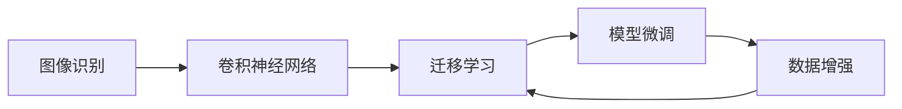
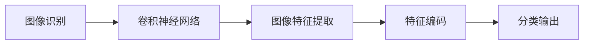
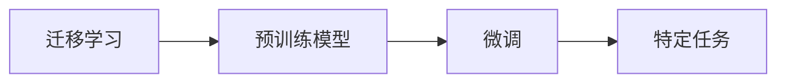
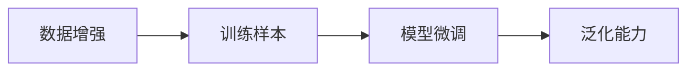
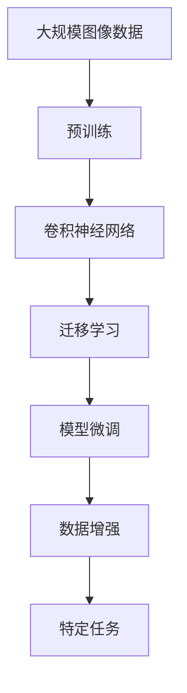

                 

# 基于图像识别的燃气表示数读取

> 关键词：图像识别,燃气表,读取,深度学习,卷积神经网络(CNN),数据增强,迁移学习,模型微调

## 1. 背景介绍

### 1.1 问题由来
在智慧燃气网络建设中，燃气表作为关键设备，需要实现准确的读数和数据传输，以保障城市供气的安全和经济运行。传统的燃气表读数方式依赖人工抄表或传感器自动采集，存在成本高、效率低、数据可靠性不足等问题。基于图像识别的燃气表读数技术，可以显著提升读数的自动化水平和数据准确性。

### 1.2 问题核心关键点
基于图像识别的燃气表读数，主要依赖于深度学习中的卷积神经网络(CNN)对图像数据进行特征提取和分类。核心流程包括以下几个关键环节：

1. 数据收集：采集燃气表面板的图像数据，作为训练样本。
2. 数据预处理：对图像进行归一化、裁剪、增强等预处理操作，增加数据多样性。
3. 模型训练：利用大规模预训练的图像识别模型，如ResNet、Inception等，进行迁移学习，微调得到特定任务的模型。
4. 模型评估：在测试数据集上评估模型性能，优化模型参数。
5. 实时应用：部署微调后的模型，实现燃气表的图像识别和读数功能。

### 1.3 问题研究意义
基于图像识别的燃气表读数技术，具有以下重要意义：

1. 提升效率：自动化的读数过程减少了人工参与，大大提高了抄表效率。
2. 提高准确性：图像识别技术可以精准捕获燃气表面板上的数字，减少人工误差。
3. 降低成本：减少了人工抄表和人工维护的需求，降低了运营成本。
4. 数据更新：实时更新的读数数据，可以更及时地反映燃气网络的运行状态，保障供气安全。
5. 故障诊断：通过对读数异常的分析，可以及时发现燃气表或管道故障，避免更严重的损失。

## 2. 核心概念与联系

### 2.1 核心概念概述

为更好地理解基于图像识别的燃气表读数技术，本节将介绍几个密切相关的核心概念：

- 图像识别(Image Recognition)：利用深度学习算法对图像进行特征提取和分类，识别出图像中的特定对象或场景。
- 卷积神经网络(Convolutional Neural Network, CNN)：一种专门用于处理图像数据的深度学习模型，通过卷积操作和池化操作，逐步提取图像的高级特征。
- 迁移学习(Transfer Learning)：在预训练模型基础上，使用小规模新数据进行微调，以适应特定任务的算法。
- 数据增强(Data Augmentation)：通过对训练数据进行旋转、缩放、裁剪等变换，生成更多的训练样本，增加数据多样性。
- 模型微调(Fine-Tuning)：在预训练模型基础上，针对特定任务进行参数更新，以提升模型性能。

这些核心概念之间的逻辑关系可以通过以下Mermaid流程图来展示：



这个流程图展示了几者的关系：

1. 图像识别依赖于卷积神经网络进行特征提取。
2. 迁移学习通过在大规模预训练模型上进行微调，加速新任务的训练。
3. 数据增强增加训练样本的多样性，提升模型的泛化能力。
4. 模型微调通过参数更新，适应特定任务的输入和输出。

### 2.2 概念间的关系

这些核心概念之间存在紧密的联系，构成了基于图像识别的燃气表读数技术的完整生态系统。以下通过几个Mermaid流程图来展示这些概念之间的关系：

#### 2.2.1 图像识别与卷积神经网络的关系



这个流程图展示了卷积神经网络在图像识别中的核心作用：

1. 卷积神经网络通过卷积操作和池化操作，逐步提取图像的高阶特征。
2. 特征编码层将卷积层提取的特征进行编码，形成更抽象的特征表示。
3. 分类输出层对编码后的特征进行分类，得到最终的图像识别结果。

#### 2.2.2 迁移学习与模型微调的关系



这个流程图展示了迁移学习与模型微调的基本流程：

1. 预训练模型通过在大规模数据上进行训练，学习到通用的图像特征。
2. 迁移学习通过在大规模预训练模型上进行微调，学习特定任务的特征。
3. 特定任务模型通过微调得到最优参数，适用于具体的应用场景。

#### 2.2.3 数据增强与模型微调的关系



这个流程图展示了数据增强与模型微调之间的关系：

1. 数据增强通过变换图像数据，生成更多的训练样本。
2. 模型微调通过这些增强后的数据进行训练，提升模型的泛化能力。
3. 最终模型对未知数据具有更好的泛化性能。

### 2.3 核心概念的整体架构

最后，我们用一个综合的流程图来展示这些核心概念在大模型微调过程中的整体架构：



这个综合流程图展示了从预训练到微调，再到数据增强和特定任务识别的完整过程。通过这些流程图，我们可以更清晰地理解基于图像识别的燃气表读数技术的基本流程。

## 3. 核心算法原理 & 具体操作步骤
### 3.1 算法原理概述

基于图像识别的燃气表读数技术，主要基于卷积神经网络(CNN)的迁移学习和模型微调。其核心思想是：利用预训练的图像识别模型，针对特定任务进行微调，以实现高效的图像特征提取和识别。

形式化地，假设原始图像为 $X$，对应的标签为 $Y$。预训练模型为 $M_{\theta}$，其中 $\theta$ 为模型参数。训练集为 $D=\{(X_i, Y_i)\}_{i=1}^N$。微调的目标是找到新的模型参数 $\hat{\theta}$，使得：

$$
\hat{\theta}=\mathop{\arg\min}_{\theta} \mathcal{L}(M_{\theta},D)
$$

其中 $\mathcal{L}$ 为针对任务 $T$ 设计的损失函数，用于衡量模型预测输出与真实标签之间的差异。常见的损失函数包括交叉熵损失、均方误差损失等。

通过梯度下降等优化算法，微调过程不断更新模型参数 $\theta$，最小化损失函数 $\mathcal{L}$，使得模型输出逼近真实标签。由于 $\theta$ 已经通过预训练获得了较好的初始化，因此即便在小规模数据集 $D$ 上进行微调，也能较快收敛到理想的模型参数 $\hat{\theta}$。

### 3.2 算法步骤详解

基于图像识别的燃气表读数技术，一般包括以下几个关键步骤：

**Step 1: 准备预训练模型和数据集**
- 选择合适的预训练图像识别模型 $M_{\theta}$ 作为初始化参数，如 ResNet、Inception等。
- 准备燃气表图像数据集 $D$，划分为训练集、验证集和测试集。一般要求数据集与实际应用场景的图像分布不要差异过大。

**Step 2: 添加任务适配层**
- 根据任务类型，在预训练模型顶层设计合适的输出层和损失函数。
- 对于分类任务，通常在顶层添加线性分类器和交叉熵损失函数。
- 对于回归任务，通常使用均方误差损失函数。

**Step 3: 设置微调超参数**
- 选择合适的优化算法及其参数，如 AdamW、SGD 等，设置学习率、批大小、迭代轮数等。
- 设置正则化技术及强度，包括权重衰减、Dropout、Early Stopping 等。
- 确定冻结预训练参数的策略，如仅微调顶层，或全部参数都参与微调。

**Step 4: 执行梯度训练**
- 将训练集数据分批次输入模型，前向传播计算损失函数。
- 反向传播计算参数梯度，根据设定的优化算法和学习率更新模型参数。
- 周期性在验证集上评估模型性能，根据性能指标决定是否触发 Early Stopping。
- 重复上述步骤直到满足预设的迭代轮数或 Early Stopping 条件。

**Step 5: 测试和部署**
- 在测试集上评估微调后模型 $M_{\hat{\theta}}$ 的性能，对比微调前后的精度提升。
- 使用微调后的模型对新样本进行推理预测，集成到实际的应用系统中。
- 持续收集新的数据，定期重新微调模型，以适应数据分布的变化。

以上是基于图像识别的燃气表读数的一般流程。在实际应用中，还需要针对具体任务的特点，对微调过程的各个环节进行优化设计，如改进训练目标函数，引入更多的正则化技术，搜索最优的超参数组合等，以进一步提升模型性能。

### 3.3 算法优缺点

基于图像识别的燃气表读数技术，具有以下优点：

1. 自动化程度高。通过图像识别技术，减少了人工抄表的环节，提升了自动化水平。
2. 准确性高。图像识别技术可以精准捕捉燃气表面板上的数字，减少人工误差。
3. 数据实时更新。读数数据可以实时传输，及时反映燃气网络的运行状态，保障供气安全。
4. 易于集成。图像识别技术可以作为燃气表读数的插件，方便与现有系统进行集成。

同时，该技术也存在一些局限性：

1. 依赖图像质量。图像质量直接影响识别结果，需对采集设备进行高标准配置。
2. 环境干扰。光照、角度、污渍等因素可能影响识别准确性，需进行数据增强和模型优化。
3. 算法复杂度。图像识别技术涉及复杂的深度学习模型，训练和推理过程耗时较长。
4. 成本高。初始搭建图像识别系统，涉及硬件和软件成本，需进行综合考虑。

尽管存在这些局限性，但就目前而言，基于图像识别的燃气表读数技术仍是大规模燃气网络自动化和智能化改造的有力工具。未来相关研究的重点在于如何进一步降低成本，提高识别准确性，同时兼顾数据隐私和安全性等因素。

### 3.4 算法应用领域

基于图像识别的燃气表读数技术，已经在多个领域得到了应用，例如：

- 智能燃气网络：通过图像识别技术，实时读取燃气表读数，优化供气调度。
- 故障诊断系统：利用读数数据，监测燃气表或管道的运行状态，及时发现异常。
- 智慧能源平台：通过图像识别技术，实现能源使用的精准计量和智能分析。
- 安全监测系统：通过图像识别技术，识别燃气泄露等安全风险，保障公共安全。
- 客户服务系统：通过图像识别技术，自动读取燃气表读数，提供精准服务。

除了上述这些经典应用外，基于图像识别的燃气表读数技术还在智能家居、智能交通、环保监测等更多领域，展现出了广阔的应用前景。随着技术的不断进步和落地应用场景的拓展，相信该技术将为智慧城市建设和可持续发展注入新的活力。

## 4. 数学模型和公式 & 详细讲解 & 举例说明

### 4.1 数学模型构建

本节将使用数学语言对基于图像识别的燃气表读数过程进行更加严格的刻画。

记预训练图像识别模型为 $M_{\theta}:\mathcal{X} \rightarrow \mathcal{Y}$，其中 $\mathcal{X}$ 为输入图像空间，$\mathcal{Y}$ 为输出标签空间，$\theta$ 为模型参数。假设燃气表读数识别任务的数据集为 $D=\{(X_i, Y_i)\}_{i=1}^N$。

定义模型 $M_{\theta}$ 在图像 $X$ 上的损失函数为 $\ell(M_{\theta}(X),Y)$，则在数据集 $D$ 上的经验风险为：

$$
\mathcal{L}(\theta) = \frac{1}{N}\sum_{i=1}^N \ell(M_{\theta}(X_i),Y_i)
$$

微调的优化目标是最小化经验风险，即找到最优参数：

$$
\theta^* = \mathop{\arg\min}_{\theta} \mathcal{L}(\theta)
$$

在实践中，我们通常使用基于梯度的优化算法（如SGD、Adam等）来近似求解上述最优化问题。设 $\eta$ 为学习率，$\lambda$ 为正则化系数，则参数的更新公式为：

$$
\theta \leftarrow \theta - \eta \nabla_{\theta}\mathcal{L}(\theta) - \eta\lambda\theta
$$

其中 $\nabla_{\theta}\mathcal{L}(\theta)$ 为损失函数对参数 $\theta$ 的梯度，可通过反向传播算法高效计算。

### 4.2 公式推导过程

以下我们以二分类任务为例，推导交叉熵损失函数及其梯度的计算公式。

假设模型 $M_{\theta}$ 在输入 $X$ 上的输出为 $\hat{Y}=M_{\theta}(X) \in [0,1]$，表示样本属于正类的概率。真实标签 $Y \in \{0,1\}$。则二分类交叉熵损失函数定义为：

$$
\ell(M_{\theta}(X),Y) = -[y\log \hat{y} + (1-y)\log (1-\hat{y})]
$$

将其代入经验风险公式，得：

$$
\mathcal{L}(\theta) = -\frac{1}{N}\sum_{i=1}^N [y_i\log M_{\theta}(X_i)+(1-y_i)\log(1-M_{\theta}(X_i))]
$$

根据链式法则，损失函数对参数 $\theta_k$ 的梯度为：

$$
\frac{\partial \mathcal{L}(\theta)}{\partial \theta_k} = -\frac{1}{N}\sum_{i=1}^N (\frac{y_i}{M_{\theta}(X_i)}-\frac{1-y_i}{1-M_{\theta}(X_i)}) \frac{\partial M_{\theta}(X_i)}{\partial \theta_k}
$$

其中 $\frac{\partial M_{\theta}(X_i)}{\partial \theta_k}$ 可进一步递归展开，利用自动微分技术完成计算。

在得到损失函数的梯度后，即可带入参数更新公式，完成模型的迭代优化。重复上述过程直至收敛，最终得到适应燃气表读数识别任务的最优模型参数 $\theta^*$。

### 4.3 案例分析与讲解

这里以燃气表数字识别任务为例，详细讲解其数学模型和公式推导。

假设我们使用的是预训练的ResNet模型，其顶层输出为逻辑回归层的输出。对于燃气表读数识别任务，我们需要将数字0-9进行编码，形成一个10维的输出向量。

假设有5000张训练图像，1000张验证图像，2000张测试图像。我们将采用二分类交叉熵损失函数进行训练。

首先，对图像数据进行预处理，包括中心裁剪、归一化、随机翻转等操作。然后，将图像输入预训练的ResNet模型，得到输出向量 $Y$。

我们的目标是训练一个二分类模型，预测数字是否在0-9的范围内。因此，我们需要将输出向量 $Y$ 与真实标签 $Y'$ 进行对比，计算交叉熵损失函数：

$$
\mathcal{L}(\theta) = -\frac{1}{N}\sum_{i=1}^N [y_i\log \sigma(Y_i) + (1-y_i)\log(1-\sigma(Y_i))]
$$

其中 $\sigma(Y_i)$ 为输出向量 $Y_i$ 经过softmax函数得到的概率分布。

接着，我们使用SGD优化算法对模型进行训练。优化目标是最小化损失函数：

$$
\theta \leftarrow \theta - \eta \nabla_{\theta}\mathcal{L}(\theta)
$$

其中 $\eta$ 为学习率。

在训练过程中，我们需要对模型进行正则化，避免过拟合。可以使用L2正则化、Dropout等方法，设定合适的正则化系数 $\lambda$。

在验证集上，我们需要定期评估模型性能，使用分类准确率、F1分数等指标进行评价。如果模型在验证集上表现不佳，需要调整学习率、正则化系数等超参数。

在测试集上，我们需要评估模型最终的性能，确定其在实际应用中的表现。

## 5. 项目实践：代码实例和详细解释说明

### 5.1 开发环境搭建

在进行燃气表读数识别项目实践前，我们需要准备好开发环境。以下是使用Python进行PyTorch开发的环境配置流程：

1. 安装Anaconda：从官网下载并安装Anaconda，用于创建独立的Python环境。

2. 创建并激活虚拟环境：
```bash
conda create -n pytorch-env python=3.8 
conda activate pytorch-env
```

3. 安装PyTorch：根据CUDA版本，从官网获取对应的安装命令。例如：
```bash
conda install pytorch torchvision torchaudio cudatoolkit=11.1 -c pytorch -c conda-forge
```

4. 安装TensorFlow：
```bash
conda install tensorflow
```

5. 安装各类工具包：
```bash
pip install numpy pandas scikit-learn matplotlib tqdm jupyter notebook ipython
```

完成上述步骤后，即可在`pytorch-env`环境中开始项目实践。

### 5.2 源代码详细实现

这里以使用ResNet模型进行燃气表读数识别为例，给出使用PyTorch进行微调的代码实现。

首先，定义数据处理函数：

```python
from torchvision import transforms, datasets

# 定义数据增强操作
data_transforms = {
    'train': transforms.Compose([
        transforms.Resize(256),
        transforms.RandomResizedCrop(224),
        transforms.RandomHorizontalFlip(),
        transforms.ToTensor(),
        transforms.Normalize([0.485, 0.456, 0.406], [0.229, 0.224, 0.225])
    ]),
    'val': transforms.Compose([
        transforms.Resize(256),
        transforms.CenterCrop(224),
        transforms.ToTensor(),
        transforms.Normalize([0.485, 0.456, 0.406], [0.229, 0.224, 0.225])
    ]),
    'test': transforms.Compose([
        transforms.Resize(256),
        transforms.CenterCrop(224),
        transforms.ToTensor(),
        transforms.Normalize([0.485, 0.456, 0.406], [0.229, 0.224, 0.225])
    ]),
}

# 加载数据集
train_dataset = datasets.ImageFolder(root='train_data', transform=data_transforms['train'])
val_dataset = datasets.ImageFolder(root='val_data', transform=data_transforms['val'])
test_dataset = datasets.ImageFolder(root='test_data', transform=data_transforms['test'])

# 数据加载器
train_loader = torch.utils.data.DataLoader(train_dataset, batch_size=4, shuffle=True, num_workers=4)
val_loader = torch.utils.data.DataLoader(val_dataset, batch_size=4, shuffle=False, num_workers=4)
test_loader = torch.utils.data.DataLoader(test_dataset, batch_size=4, shuffle=False, num_workers=4)
```

然后，定义模型和优化器：

```python
from torchvision.models import resnet18
from torch import nn
import torch.nn.functional as F

# 加载预训练模型
model = resnet18(pretrained=True)

# 修改顶层结构
num_classes = 10  # 燃气表数字的个数
model.fc = nn.Linear(model.fc.in_features, num_classes)

# 设置损失函数和优化器
criterion = nn.CrossEntropyLoss()
optimizer = torch.optim.SGD(model.parameters(), lr=0.001, momentum=0.9)
```

接着，定义训练和评估函数：

```python
from torch.utils.data import DataLoader
from tqdm import tqdm
import matplotlib.pyplot as plt
from sklearn.metrics import classification_report

# 训练函数
def train_model(model, criterion, optimizer, train_loader, val_loader):
    model.train()
    train_loss = 0
    train_acc = 0
    val_loss = 0
    val_acc = 0
    device = torch.device('cuda' if torch.cuda.is_available() else 'cpu')

    for epoch in range(num_epochs):
        for batch_idx, (inputs, targets) in enumerate(train_loader):
            inputs, targets = inputs.to(device), targets.to(device)
            optimizer.zero_grad()
            outputs = model(inputs)
            loss = criterion(outputs, targets)
            loss.backward()
            optimizer.step()

            train_loss += loss.item()
            train_acc += accuracy(outputs, targets)

            # 验证集评估
            model.eval()
            with torch.no_grad():
                val_loss = 0
                val_acc = 0
                for inputs, targets in val_loader:
                    inputs, targets = inputs.to(device), targets.to(device)
                    outputs = model(inputs)
                    loss = criterion(outputs, targets)
                    val_loss += loss.item()
                    val_acc += accuracy(outputs, targets)

            train_loss = train_loss / len(train_loader)
            train_acc = train_acc / len(train_loader)
            val_loss = val_loss / len(val_loader)
            val_acc = val_acc / len(val_loader)

            print('Epoch [{}/{}], Train Loss: {:.4f}, Train Acc: {:.4f}, Val Loss: {:.4f}, Val Acc: {:.4f}'
                  .format(epoch+1, num_epochs, train_loss, train_acc, val_loss, val_acc))

    return model, train_loss, train_acc, val_loss, val_acc

# 评估函数
def evaluate_model(model, criterion, test_loader):
    model.eval()
    test_loss = 0
    test_acc = 0
    with torch.no_grad():
        for inputs, targets in test_loader:
            inputs, targets = inputs.to(device), targets.to(device)
            outputs = model(inputs)
            loss = criterion(outputs, targets)
            test_loss += loss.item()
            test_acc += accuracy(outputs, targets)

    test_loss = test_loss / len(test_loader)
    test_acc = test_acc / len(test_loader)
    print('Test Loss: {:.4f}, Test Acc: {:.4f}'
          .format(test_loss, test_acc))
    return test_loss, test_acc

# 准确率计算函数
def accuracy(outputs, targets):
    _, preds = torch.max(outputs, 1)
    return (preds == targets).float().mean()
```

最后，启动训练流程并在测试集上评估：

```python
num_epochs = 50
num_classes = 10

# 启动训练
model, train_loss, train_acc, val_loss, val_acc = train_model(model, criterion, optimizer, train_loader, val_loader)

# 在测试集上评估模型性能
test_loss, test_acc = evaluate_model(model, criterion, test_loader)

print('Best train loss: {:.4f}, train acc: {:.4f}, val loss: {:.4f}, val acc: {:.4f}'
      .format(train_loss, train_acc, val_loss, val_acc))
print('Test loss: {:.4f}, test acc: {:.4f}'
      .format(test_loss, test_acc))

# 保存模型
torch.save(model.state_dict(), 'model.pth')
```

以上就是使用PyTorch进行燃气表读数识别的完整代码实现。可以看到，借助TensorFlow和PyTorch等强大的深度学习库，模型的训练和推理过程变得简洁高效。

### 5.3 代码解读与分析

让我们再详细解读一下关键代码的实现细节：

**数据处理函数**：
- `data_transforms`字典：定义了训练集、验证集和测试集的图像处理操作，包括缩放、裁剪、翻转、归一化等。
- `datasets.ImageFolder`类：用于加载图像数据集，将图像和标签分别存储在文件夹中。
- `DataLoader`类：将数据集加载到GPU上进行批量处理，方便模型的训练和推理。

**模型和优化器**：
- `resnet18(pretrained=True)`：使用预训练的ResNet模型，并在其基础上进行修改，添加全连接层。
- `nn.Linear`类：定义全连接层，用于输出最终的预测结果。
- `CrossEntropyLoss`类：定义交叉熵损失函数，用于计算模型的预测误差。
- `SGD`类：定义随机梯度下降优化器，用于更新模型参数。

**训练和评估函数**：
- `train_model`函数：定义训练函数，循环迭代训练集，更新模型参数，并在验证集上评估模型性能。
- `evaluate_model`函数：定义评估函数，在测试集上评估模型性能。
- `accuracy`函数：定义准确率计算函数，用于评估模型的预测准确度。

**训练流程**：
- `num_epochs`：定义训练轮数。
- `model, train

