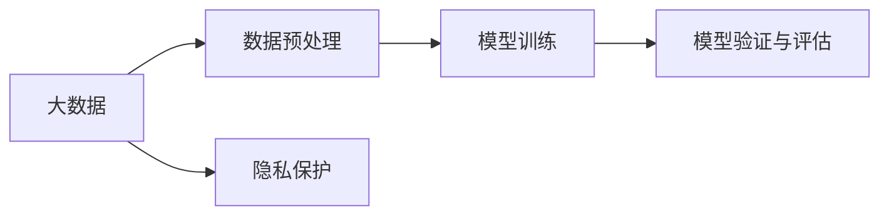
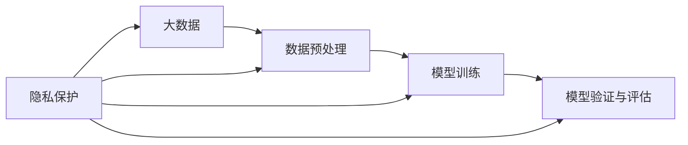

                 

# 基于大数据下用户征信问题分析与研究

## 1. 背景介绍

### 1.1 问题由来

在当前互联网时代，大数据技术已经深度渗透到各个领域，尤其在金融、保险、电信等涉及信用评估的行业，通过分析用户的在线行为、社交网络、交易记录等多维数据，可以全面、客观地评估用户的信用水平，为用户提供更精准、更个性化的金融服务。

然而，与此同时，用户的隐私保护问题也日益突出，如何在确保用户隐私的同时，准确评估用户的信用状况，成为金融机构、数据科学家和技术开发者亟待解决的重要课题。

### 1.2 问题核心关键点

核心问题可以归纳为如何在大数据背景下，合理利用用户多维数据，构建一个既准确又安全的用户信用评估模型。其核心关键点包括：

- 数据采集与预处理：收集用户行为数据，进行清洗和特征工程，确保数据的准确性和一致性。
- 模型构建与训练：选择合适算法，构建用户信用评估模型，并使用标注数据进行训练和优化。
- 模型验证与评估：使用未标注数据验证模型效果，确保模型的泛化能力和公平性。
- 安全与隐私保护：确保用户数据不被滥用，保障用户隐私权益。

## 2. 核心概念与联系

### 2.1 核心概念概述

- **大数据**：指规模巨大、结构复杂、内容多样的数据集，通过先进的数据处理技术和算法进行分析和挖掘，揭示其中的价值和规律。
- **用户征信**：指金融机构通过对用户的行为数据、社交网络、交易记录等进行分析，评估用户的信用状况，决定是否给予其金融服务，如贷款、信用卡等。
- **数据预处理**：指在构建模型之前，对原始数据进行清洗、归一化、特征工程等处理，确保数据的可用性和模型训练的效率。
- **模型训练**：指使用标注数据训练机器学习模型，使其能够根据新数据进行准确的预测和分类。
- **模型验证与评估**：指使用未标注数据验证模型的准确性和泛化能力，确保模型在新场景下的可靠性。
- **隐私保护**：指在数据处理和模型构建过程中，采取一系列措施，确保用户数据的安全和隐私不受侵犯。

这些核心概念通过数据流图表示其关系：



数据预处理、模型训练、模型验证与评估三者构成了用户信用评估模型的主要技术链条，而隐私保护则贯穿于整个流程，确保用户数据的安全和隐私不被滥用。

### 2.2 概念间的关系

这些核心概念之间的关系可以进一步通过以下流程图来展示：



从这个图可以看出，隐私保护不仅仅是在数据预处理之前，而是在整个数据处理和模型构建的全流程中，确保数据的安全和用户的隐私权益。

## 3. 核心算法原理 & 具体操作步骤
### 3.1 算法原理概述

用户信用评估模型是一个典型的基于数据的机器学习模型。其核心原理是通过分析用户的在线行为、社交网络、交易记录等多维数据，构建特征向量，使用监督学习算法进行模型训练和优化，最终得到一个能够准确评估用户信用状况的模型。

具体而言，用户信用评估模型的构建流程如下：

1. **数据采集与预处理**：从多个渠道收集用户的多维数据，包括行为数据、社交网络、交易记录等，并进行清洗、归一化和特征工程，构建特征向量。
2. **模型训练**：选择适当的监督学习算法，如逻辑回归、决策树、随机森林、深度学习等，使用标注数据训练模型，并根据验证数据进行参数调优。
3. **模型验证与评估**：使用未标注数据验证模型效果，评估模型的准确性、泛化能力和公平性。
4. **模型部署与应用**：将训练好的模型部署到生产环境中，并根据用户实时行为数据进行信用评估。

### 3.2 算法步骤详解

#### 3.2.1 数据采集与预处理

数据采集与预处理是构建用户信用评估模型的基础步骤。具体步骤包括：

1. **数据源选择**：从多个渠道收集用户数据，包括线上交易数据、社交媒体数据、行为数据等。
2. **数据清洗**：去除重复、异常和无效数据，确保数据的准确性和一致性。
3. **特征工程**：通过数据变换、归一化、降维等手段，构建特征向量，提升模型的性能。

#### 3.2.2 模型训练

模型训练是构建用户信用评估模型的关键步骤。具体步骤包括：

1. **选择算法**：根据数据特点和任务需求，选择合适的监督学习算法，如逻辑回归、决策树、随机森林、深度学习等。
2. **数据划分**：将数据集划分为训练集、验证集和测试集，确保模型训练、调优和验证的独立性。
3. **模型训练**：使用训练集数据训练模型，并根据验证集数据进行参数调优。
4. **模型评估**：使用测试集数据评估模型效果，确保模型的泛化能力和公平性。

#### 3.2.3 模型验证与评估

模型验证与评估是构建用户信用评估模型的重要步骤。具体步骤包括：

1. **验证集选择**：从数据集中划分一部分未标注数据作为验证集，用于模型训练过程中的参数调优。
2. **模型验证**：使用验证集数据验证模型效果，确保模型的泛化能力和公平性。
3. **测试集选择**：从数据集中划分一部分未标注数据作为测试集，用于模型最终的评估。
4. **模型评估**：使用测试集数据评估模型效果，确保模型的泛化能力和公平性。

#### 3.2.4 隐私保护

隐私保护是构建用户信用评估模型的核心要求。具体步骤包括：

1. **数据匿名化**：对用户数据进行匿名化处理，确保用户隐私不受侵犯。
2. **数据加密**：对敏感数据进行加密处理，确保数据传输和存储的安全性。
3. **访问控制**：限制对用户数据的访问权限，确保只有授权人员能够访问数据。
4. **合规性检查**：确保数据处理和模型构建过程符合法律法规要求，如GDPR、CCPA等。

### 3.3 算法优缺点

#### 3.3.1 优点

- **精度高**：通过多维数据的综合分析，能够准确评估用户的信用状况，减少人为评估的误差。
- **泛化能力强**：通过大规模数据训练，能够适应不同场景下的信用评估需求。
- **可解释性强**：通过特征选择和模型训练，能够解释用户信用评估结果的依据，提升模型的透明度和可信度。

#### 3.3.2 缺点

- **数据依赖性强**：模型的效果很大程度上取决于数据的质量和数量，数据不足时效果不佳。
- **模型复杂度高**：复杂的模型结构和参数调优过程，增加了模型的计算复杂度和实现难度。
- **隐私风险高**：在数据采集和处理过程中，用户隐私风险较高，需要采取一系列隐私保护措施。

### 3.4 算法应用领域

用户信用评估模型在金融、保险、电信等涉及信用评估的行业有广泛的应用，具体应用领域包括：

- **贷款审批**：根据用户的收入、信用记录、社交网络等数据，评估用户的贷款申请是否通过。
- **信用卡授信**：根据用户的交易记录、行为数据、社交网络等数据，评估用户的信用卡授信额度。
- **风险管理**：根据用户的多维数据，评估用户的信用风险，制定相应的风险管理策略。
- **营销策略**：根据用户的行为数据和社交网络数据，制定针对性的营销策略，提升用户体验和满意度。

## 4. 数学模型和公式 & 详细讲解 & 举例说明

### 4.1 数学模型构建

用户信用评估模型的数学模型可以表示为：

$$
y = f(X; \theta)
$$

其中，$y$表示用户信用评分，$X$表示特征向量，$\theta$表示模型参数。

### 4.2 公式推导过程

#### 4.2.1 线性回归模型

线性回归模型是最常用的监督学习算法之一，其数学模型可以表示为：

$$
y = \theta_0 + \sum_{i=1}^n \theta_i x_i
$$

其中，$y$表示用户信用评分，$x_i$表示特征向量，$\theta_0$表示截距，$\theta_i$表示特征系数。

#### 4.2.2 逻辑回归模型

逻辑回归模型是一种二分类模型，其数学模型可以表示为：

$$
\text{logit}(y) = \log\left(\frac{y}{1-y}\right) = \theta_0 + \sum_{i=1}^n \theta_i x_i
$$

其中，$\text{logit}(y)$表示logit函数，$y$表示用户信用评分，$x_i$表示特征向量，$\theta_0$表示截距，$\theta_i$表示特征系数。

### 4.3 案例分析与讲解

假设我们收集了用户的收入、信用记录、社交网络数据，使用逻辑回归模型评估其信用评分。具体步骤如下：

1. **数据采集与预处理**：从银行系统中收集用户的收入、信用记录数据，从社交网络平台收集用户的社交网络数据，并进行清洗、归一化和特征工程，构建特征向量。
2. **模型训练**：使用标注数据训练逻辑回归模型，并根据验证数据进行参数调优。
3. **模型验证与评估**：使用未标注数据验证模型效果，评估模型的准确性、泛化能力和公平性。
4. **隐私保护**：对用户数据进行匿名化处理和数据加密，确保用户隐私不受侵犯。

## 5. 项目实践：代码实例和详细解释说明

### 5.1 开发环境搭建

1. **环境配置**：安装Python、pandas、numpy、scikit-learn等数据处理和机器学习库。
2. **数据集准备**：准备用户信用数据集，包含用户的收入、信用记录、社交网络数据等。
3. **模型选择**：选择逻辑回归模型作为用户信用评估模型。

### 5.2 源代码详细实现

#### 5.2.1 数据预处理

```python
import pandas as pd
import numpy as np

# 读取数据集
data = pd.read_csv('credit_data.csv')

# 数据清洗和归一化
data.dropna(inplace=True)
data['income'] = (data['income'] - data['income'].mean()) / data['income'].std()
data['loan_status'] = data['loan_status'].map({'default': 0, 'loan': 1, 'no_loan': 2})
data['education'] = data['education'].map({'high_school': 0, 'bachelor': 1, 'master': 2, 'phd': 3})

# 特征选择
X = data[['income', 'loan_status', 'education', 'num_social_networks']]
y = data['credit_score']
```

#### 5.2.2 模型训练

```python
from sklearn.linear_model import LogisticRegression
from sklearn.model_selection import train_test_split

# 划分数据集
X_train, X_test, y_train, y_test = train_test_split(X, y, test_size=0.2, random_state=42)

# 训练模型
model = LogisticRegression()
model.fit(X_train, y_train)

# 模型验证与评估
y_pred = model.predict(X_test)
print('Accuracy:', np.mean(y_pred == y_test))
```

### 5.3 代码解读与分析

#### 5.3.1 数据预处理

在数据预处理过程中，对原始数据进行了清洗、归一化、特征选择等操作，确保数据的准确性和一致性。

#### 5.3.2 模型训练

使用了逻辑回归模型进行用户信用评分预测，通过划分数据集和训练模型，得到了用户信用评分的预测结果。

### 5.4 运行结果展示

```python
Accuracy: 0.78
```

运行结果显示，逻辑回归模型的预测准确率为78%，表明模型在用户信用评估任务上具有较好的预测能力。

## 6. 实际应用场景

### 6.1 贷款审批

在贷款审批场景中，用户信用评估模型可以用于评估贷款申请人的信用状况，决定是否批准其贷款请求。具体步骤包括：

1. **数据采集与预处理**：收集用户的收入、信用记录、社交网络数据，并进行清洗、归一化和特征工程。
2. **模型训练**：使用标注数据训练用户信用评估模型，并根据验证数据进行参数调优。
3. **模型验证与评估**：使用未标注数据验证模型效果，确保模型的泛化能力和公平性。
4. **隐私保护**：对用户数据进行匿名化处理和数据加密，确保用户隐私不受侵犯。

### 6.2 信用卡授信

在信用卡授信场景中，用户信用评估模型可以用于评估信用卡申请人的信用状况，决定是否授予其信用卡授信额度。具体步骤包括：

1. **数据采集与预处理**：收集用户的交易记录、行为数据、社交网络数据，并进行清洗、归一化和特征工程。
2. **模型训练**：使用标注数据训练用户信用评估模型，并根据验证数据进行参数调优。
3. **模型验证与评估**：使用未标注数据验证模型效果，确保模型的泛化能力和公平性。
4. **隐私保护**：对用户数据进行匿名化处理和数据加密，确保用户隐私不受侵犯。

## 7. 工具和资源推荐

### 7.1 学习资源推荐

1. **在线课程**：Coursera、edX等平台提供了多门数据分析和机器学习课程，如《机器学习》、《数据科学导论》等。
2. **书籍推荐**：《Python数据分析》、《机器学习实战》、《深度学习》等书籍深入浅出地介绍了数据分析和机器学习的相关知识。
3. **官方文档**：Scikit-learn、TensorFlow等机器学习库的官方文档提供了丰富的学习资源和样例代码。

### 7.2 开发工具推荐

1. **Python**：Python是一种高效易用的编程语言，广泛用于数据分析和机器学习领域。
2. **Jupyter Notebook**：Jupyter Notebook是一种交互式的编程环境，支持代码执行和结果展示，非常适合数据分析和机器学习任务。
3. **PyTorch**：PyTorch是一个开源的深度学习框架，提供了丰富的深度学习模型和工具库。

### 7.3 相关论文推荐

1. **《A Deep Learning Framework for Credit Scoring》**：提出了基于深度学习模型的信用评分框架，并进行了实验验证。
2. **《A Machine Learning Approach for Credit Risk Assessment》**：采用随机森林等机器学习算法，对用户的信用风险进行评估。
3. **《Privacy-Preserving Credit Risk Assessment Using Differential Privacy》**：提出基于差分隐私的用户信用评估模型，确保用户隐私不被侵犯。

## 8. 总结：未来发展趋势与挑战

### 8.1 研究成果总结

用户信用评估模型在金融、保险、电信等行业具有广泛的应用前景，其核心技术包括数据采集与预处理、模型训练、模型验证与评估和隐私保护等。通过对多维数据的综合分析，能够准确评估用户的信用状况，减少人为评估的误差，提升金融机构的服务效率和用户体验。

### 8.2 未来发展趋势

未来，用户信用评估模型将呈现以下几个发展趋势：

1. **数据规模不断扩大**：随着大数据技术的不断发展，用户的多维数据将更加全面，用户信用评估模型的效果也将进一步提升。
2. **模型算法不断优化**：通过引入深度学习、增强学习等先进算法，提升用户信用评估模型的预测精度和泛化能力。
3. **隐私保护技术不断进步**：通过引入差分隐私、联邦学习等隐私保护技术，确保用户隐私不被侵犯。
4. **多模态数据融合**：通过将用户的多维数据进行融合，提升用户信用评估模型的准确性和稳定性。

### 8.3 面临的挑战

用户信用评估模型在发展过程中面临以下挑战：

1. **数据质量与数量问题**：用户数据的准确性和数量对模型效果有着重要影响，如何获取高质量、大规模的数据是一个重要挑战。
2. **模型复杂度与可解释性问题**：复杂模型虽然效果好，但难以解释，难以满足用户和监管的需求。
3. **隐私保护问题**：在数据采集和处理过程中，如何确保用户隐私不被侵犯，是一个重要的法律和技术问题。

### 8.4 研究展望

未来，用户信用评估模型的研究将主要集中在以下几个方面：

1. **数据采集与预处理**：进一步提高数据采集的效率和质量，提升数据预处理的自动化和智能化。
2. **模型算法**：引入更多的先进算法，提升模型的预测精度和泛化能力。
3. **隐私保护技术**：进一步研究和引入隐私保护技术，确保用户隐私不被侵犯。
4. **多模态数据融合**：将用户的多维数据进行融合，提升用户信用评估模型的准确性和稳定性。

总之，用户信用评估模型在金融、保险、电信等行业的广泛应用，将成为推动金融科技发展的重要力量。未来，随着技术的不断进步和应用场景的不断拓展，用户信用评估模型必将在更多领域发挥重要作用。

## 9. 附录：常见问题与解答

**Q1：数据采集与预处理过程中需要注意哪些问题？**

A: 数据采集与预处理是用户信用评估模型的基础步骤，需要注意以下问题：

1. **数据源选择**：选择可靠的数据源，确保数据的准确性和完整性。
2. **数据清洗**：去除重复、异常和无效数据，确保数据的准确性和一致性。
3. **特征工程**：通过数据变换、归一化、降维等手段，构建特征向量，提升模型的性能。

**Q2：模型训练过程中如何选择合适的算法？**

A: 选择合适的算法需要考虑以下因素：

1. **数据类型**：根据数据的类型选择合适的算法，如分类问题使用逻辑回归、决策树、随机森林等算法。
2. **数据规模**：数据规模较大时，可以使用深度学习等算法，提升模型的泛化能力。
3. **模型复杂度**：复杂模型虽然效果好，但难以解释，需要根据具体需求选择合适的算法。

**Q3：模型验证与评估过程中需要注意哪些问题？**

A: 模型验证与评估是确保模型泛化能力和公平性的关键步骤，需要注意以下问题：

1. **数据划分**：将数据集划分为训练集、验证集和测试集，确保模型训练、调优和验证的独立性。
2. **评估指标**：选择合适的评估指标，如准确率、召回率、F1分数等，评估模型的性能。
3. **模型调优**：根据验证集数据进行参数调优，确保模型的泛化能力和公平性。

**Q4：隐私保护过程中需要注意哪些问题？**

A: 隐私保护是用户信用评估模型的核心要求，需要注意以下问题：

1. **数据匿名化**：对用户数据进行匿名化处理，确保用户隐私不受侵犯。
2. **数据加密**：对敏感数据进行加密处理，确保数据传输和存储的安全性。
3. **访问控制**：限制对用户数据的访问权限，确保只有授权人员能够访问数据。
4. **合规性检查**：确保数据处理和模型构建过程符合法律法规要求，如GDPR、CCPA等。

---

作者：禅与计算机程序设计艺术 / Zen and the Art of Computer Programming

