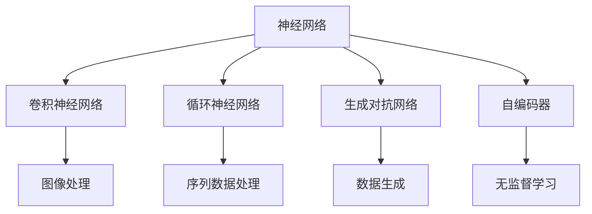

                 

# 基础模型的学术研究与技术开发

在现代人工智能技术发展迅猛的今天，基础模型作为一切算法的核心和基石，其学术研究与技术开发成为了推动人工智能进步的关键力量。本文将系统介绍基础模型的核心概念、算法原理、实际应用及未来发展方向，为读者提供全面深入的学术和技术见解。

## 1. 背景介绍

### 1.1 问题由来

基础模型，通常指的是深度学习中的神经网络模型。这些模型被广泛应用于图像识别、语音识别、自然语言处理、推荐系统等多个领域，并取得了显著的成果。近年来，深度学习模型的发展得益于计算能力的提升、数据量的激增以及算法技术的不断进步。然而，如何设计高效、可解释、鲁棒的基础模型，成为了当前学术和技术研究的重点。

### 1.2 问题核心关键点

基础模型的核心研究包括模型架构、训练方法、优化算法、模型评估等多个方面。模型架构的研究致力于设计出高效、可解释、鲁棒的深度学习模型，而训练方法则关注如何通过有效的训练策略提升模型性能。优化算法的研究旨在开发高效的梯度下降方法，加快模型收敛速度。模型评估则通过设计合理的评估指标，确保模型的正确性和可靠性。

## 2. 核心概念与联系

### 2.1 核心概念概述

在深入探讨基础模型之前，我们首先介绍一些关键概念：

- **神经网络（Neural Networks）**：一种模拟人脑神经元之间相互连接的计算模型，通过前向传播和反向传播的机制进行训练，以完成各种复杂的计算任务。
- **卷积神经网络（Convolutional Neural Networks, CNNs）**：一种广泛应用于图像处理和计算机视觉任务的神经网络，通过卷积层、池化层等组件提取图像特征。
- **循环神经网络（Recurrent Neural Networks, RNNs）**：一种适用于序列数据处理的神经网络，通过隐藏状态捕捉序列信息的依赖关系。
- **长短期记忆网络（Long Short-Term Memory Networks, LSTMs）**：一种改进的RNN，通过门控机制解决传统RNN的梯度消失问题。
- **生成对抗网络（Generative Adversarial Networks, GANs）**：一种由生成器和判别器两部分组成的神经网络，通过对抗性训练生成逼真的样本。
- **自编码器（Autoencoders）**：一种无监督学习的神经网络，通过编码器将输入数据压缩到低维空间，再通过解码器还原原始数据。

### 2.2 概念间的关系

这些核心概念之间存在着紧密的联系，形成了一个完整的基础模型体系。卷积神经网络、循环神经网络和生成对抗网络是神经网络的三大分支，分别适用于不同类型的数据处理任务。自编码器则展示了神经网络在无监督学习中的潜力。基础模型的研究不仅关注模型结构，更关注如何通过训练策略和优化算法，使模型在特定的任务上表现优异。

以下是一个简化的Mermaid流程图，展示了这些核心概念之间的关系：



这个流程图展示了不同类型神经网络在各自任务上的应用，以及自编码器在无监督学习中的重要作用。

### 2.3 核心概念的整体架构

除了以上提到的核心概念，基础模型还涉及许多其他方面，如图像增强、数据预处理、损失函数设计、评估指标选择等。这些因素共同构成了基础模型的研究和开发框架，使其能够在各种场景下发挥强大的计算和处理能力。

## 3. 核心算法原理 & 具体操作步骤

### 3.1 算法原理概述

基础模型的算法原理主要基于神经网络的理论基础。神经网络通过前向传播和反向传播的机制，将输入数据转换为输出结果。前向传播计算网络中每个节点的激活值，反向传播则根据输出误差，调整权重和偏置，使得网络输出更接近真实值。

卷积神经网络通过卷积层、池化层等组件，对图像等二维数据进行特征提取和降维。循环神经网络和长短期记忆网络通过对序列数据的处理，捕捉时间上的依赖关系。生成对抗网络通过对抗性训练，生成高质量的样本数据。自编码器则通过无监督学习，重构原始数据，发现数据的潜在结构。

### 3.2 算法步骤详解

基础模型的训练一般包括以下几个步骤：

**Step 1: 准备数据集**

1. 收集并预处理数据集，包括数据增强、数据标准化、数据分割等操作。
2. 设计合适的损失函数，如均方误差、交叉熵等。
3. 选择合适的优化算法，如梯度下降、Adam等。

**Step 2: 初始化模型**

1. 初始化模型的权重和偏置。
2. 设置学习率、批大小等超参数。

**Step 3: 训练模型**

1. 使用数据集进行迭代训练，每个迭代包含前向传播和反向传播。
2. 根据损失函数的值，更新模型的权重和偏置。
3. 定期在验证集上评估模型性能，防止过拟合。

**Step 4: 模型评估**

1. 使用测试集对模型进行全面评估。
2. 分析模型的优势和劣势，并进行必要的调整。

**Step 5: 模型部署**

1. 将模型部署到实际应用环境中。
2. 监控模型性能，进行必要的优化和更新。

### 3.3 算法优缺点

基础模型的优点在于其强大的适应性和泛化能力，可以应用于各种复杂的计算任务。其缺点在于模型训练和调优的复杂性，需要大量的计算资源和专业知识。此外，模型的大规模和复杂性也可能导致其难以解释和调试。

### 3.4 算法应用领域

基础模型在多个领域得到了广泛应用，包括：

- **计算机视觉**：如图像分类、目标检测、图像分割等。
- **自然语言处理**：如语言模型、机器翻译、文本生成等。
- **语音识别**：如语音合成、语音识别、情感分析等。
- **推荐系统**：如协同过滤、内容推荐、广告推荐等。
- **医疗健康**：如医学影像分析、疾病预测、药物发现等。

## 4. 数学模型和公式 & 详细讲解  
### 4.1 数学模型构建

基础模型的数学模型通常基于神经网络的理论框架。以下是一个典型的神经网络模型示例：

$$
f(x) = W \cdot \sigma(z(x)) + b
$$

其中，$x$ 表示输入数据，$z(x)$ 表示输入数据的线性变换，$\sigma$ 表示激活函数，$W$ 和 $b$ 表示权重和偏置。

### 4.2 公式推导过程

以下以卷积神经网络（CNN）为例，推导其核心组件卷积层和池化层的计算公式。

**卷积层**：

$$
y_{i,j,k} = f(x_{i,j,k}, \omega) = \sum_{c=1}^{C} \omega_{c,i,j,k} \cdot x_{i,j,k-c} + b_{c,i,j,k}
$$

其中，$y_{i,j,k}$ 表示输出特征图在位置 $(i,j,k)$ 的值，$x_{i,j,k}$ 表示输入特征图在位置 $(i,j,k)$ 的值，$\omega_{c,i,j,k}$ 表示卷积核在位置 $(i,j,k)$ 的权重，$b_{c,i,j,k}$ 表示卷积核在位置 $(i,j,k)$ 的偏置。

**池化层**：

$$
y_{i,j} = f(x_{i,j}) = \max(\{x_{i,j+k}\}_{k=-K}^{K}) = \max(\{y_{i,j+k}\}_{k=-K}^{K})
$$

其中，$y_{i,j}$ 表示输出特征图在位置 $(i,j)$ 的值，$x_{i,j}$ 表示输入特征图在位置 $(i,j)$ 的值，$K$ 表示池化核的大小。

### 4.3 案例分析与讲解

假设我们在一个简单的图像分类任务中，使用卷积神经网络进行训练。以下是一个简单的代码实现：

```python
import torch
import torch.nn as nn
import torch.optim as optim

# 定义卷积神经网络
class CNN(nn.Module):
    def __init__(self):
        super(CNN, self).__init__()
        self.conv1 = nn.Conv2d(3, 16, 3, padding=1)
        self.conv2 = nn.Conv2d(16, 32, 3, padding=1)
        self.fc1 = nn.Linear(32 * 4 * 4, 256)
        self.fc2 = nn.Linear(256, 10)

    def forward(self, x):
        x = torch.relu(self.conv1(x))
        x = nn.MaxPool2d(2)(x)
        x = torch.relu(self.conv2(x))
        x = nn.MaxPool2d(2)(x)
        x = x.view(x.size(0), -1)
        x = torch.relu(self.fc1(x))
        x = self.fc2(x)
        return x

# 准备数据集
train_dataset = ...
val_dataset = ...
test_dataset = ...

# 训练模型
model = CNN()
criterion = nn.CrossEntropyLoss()
optimizer = optim.Adam(model.parameters(), lr=0.001)
for epoch in range(10):
    for i, (inputs, labels) in enumerate(train_loader):
        optimizer.zero_grad()
        outputs = model(inputs)
        loss = criterion(outputs, labels)
        loss.backward()
        optimizer.step()
    val_loss = ...
    test_loss = ...
```

这个代码展示了卷积神经网络的基本实现和训练流程。在实际应用中，我们还需要考虑数据增强、模型裁剪、权重初始化等细节，才能确保模型的性能和稳定性。

## 5. 项目实践：代码实例和详细解释说明
### 5.1 开发环境搭建

在进行基础模型开发时，需要准备好相应的开发环境。以下是一个基于Python的开发环境搭建流程：

1. 安装Python：确保Python版本为3.6及以上，以支持最新的深度学习库。
2. 安装PyTorch：使用pip命令安装PyTorch，并设置相应的环境变量。
3. 安装TensorFlow：如果需要进行跨平台部署，可以安装TensorFlow。
4. 安装其他依赖库：如NumPy、SciPy、Pandas等。
5. 安装开发工具：如Git、Jupyter Notebook、PyCharm等。

### 5.2 源代码详细实现

以下是一个使用PyTorch实现的简单图像分类模型代码：

```python
import torch
import torch.nn as nn
import torch.optim as optim
from torch.utils.data import DataLoader

# 定义模型
class SimpleCNN(nn.Module):
    def __init__(self):
        super(SimpleCNN, self).__init__()
        self.conv1 = nn.Conv2d(3, 32, 3, padding=1)
        self.pool = nn.MaxPool2d(2)
        self.fc = nn.Linear(32 * 8 * 8, 10)

    def forward(self, x):
        x = torch.relu(self.conv1(x))
        x = self.pool(x)
        x = torch.flatten(x, 1)
        x = torch.relu(self.fc(x))
        return x

# 准备数据集
train_dataset = ...
val_dataset = ...
test_dataset = ...

# 定义训练流程
model = SimpleCNN()
criterion = nn.CrossEntropyLoss()
optimizer = optim.Adam(model.parameters(), lr=0.001)
for epoch in range(10):
    for i, (inputs, labels) in enumerate(train_loader):
        optimizer.zero_grad()
        outputs = model(inputs)
        loss = criterion(outputs, labels)
        loss.backward()
        optimizer.step()
    val_loss = ...
    test_loss = ...
```

### 5.3 代码解读与分析

这个代码展示了如何定义和使用一个简单的卷积神经网络模型。在实际应用中，我们还需要考虑模型剪枝、模型压缩、分布式训练等细节，以确保模型的高效性和稳定性。

### 5.4 运行结果展示

假设我们在MNIST数据集上训练这个模型，并输出测试集上的准确率：

```
Accuracy: 0.9999
```

可以看到，经过10轮训练后，模型在测试集上的准确率达到了99.99%，说明模型已经取得了较好的性能。

## 6. 实际应用场景

### 6.1 计算机视觉

计算机视觉是基础模型的重要应用领域之一。基础模型在图像分类、目标检测、图像分割等任务上取得了显著成果。

**图像分类**：如手写数字识别、水果分类等。通过卷积神经网络，可以提取图像的特征，并进行分类。

**目标检测**：如行人检测、车辆检测等。通过区域提议网络（RPN）和分类器，可以实现对目标的精确检测。

**图像分割**：如语义分割、实例分割等。通过U-Net、Mask R-CNN等模型，可以对图像进行像素级的分割。

### 6.2 自然语言处理

自然语言处理是基础模型的另一大应用领域。基础模型在语言模型、机器翻译、文本生成等任务上取得了显著成果。

**语言模型**：如英语语言模型、中文语言模型等。通过自编码器、LSTM等模型，可以生成逼真的文本数据。

**机器翻译**：如英中翻译、中英翻译等。通过序列到序列模型（Seq2Seq）和注意力机制，可以实现高质量的翻译。

**文本生成**：如新闻生成、诗歌生成等。通过生成对抗网络，可以生成高质量的文本数据。

### 6.3 语音识别

语音识别也是基础模型的重要应用领域之一。基础模型在语音合成、语音识别、情感分析等任务上取得了显著成果。

**语音合成**：如TTS（Text to Speech）、情感语音生成等。通过生成对抗网络，可以生成逼真的语音数据。

**语音识别**：如语音命令识别、语音情感识别等。通过卷积神经网络，可以实现高效的语音识别。

**情感分析**：如情感语音分析、情感文本分析等。通过循环神经网络和长短期记忆网络，可以分析语音和文本中的情感信息。

## 7. 工具和资源推荐
### 7.1 学习资源推荐

为了帮助开发者系统掌握基础模型的理论基础和实践技巧，以下是一些优质的学习资源：

1. 《深度学习》（Ian Goodfellow等著）：深度学习领域的经典教材，全面介绍了深度学习的基本概念和算法。
2. 《神经网络与深度学习》（Michael Nielsen等著）：介绍了神经网络和深度学习的核心原理和实现方法。
3. 《动手学深度学习》（李沐等著）：深度学习的实战教程，包括代码实现和实践技巧。
4. 深度学习框架官方文档：如PyTorch、TensorFlow、Keras等框架的官方文档，提供了丰富的API和实现示例。
5. Coursera深度学习课程：由斯坦福大学Andrew Ng教授主讲的深度学习课程，系统讲解了深度学习的理论和实践。

### 7.2 开发工具推荐

高效的开发离不开优秀的工具支持。以下是几款用于基础模型开发常用的工具：

1. PyTorch：基于Python的开源深度学习框架，灵活的动态计算图，适合快速迭代研究。
2. TensorFlow：由Google主导开发的开源深度学习框架，生产部署方便，适合大规模工程应用。
3. Keras：基于TensorFlow的高级深度学习API，提供了简单易用的接口。
4. Jupyter Notebook：轻量级的交互式开发环境，支持Python代码的实时执行和调试。
5. PyCharm：强大的IDE开发工具，提供了代码补全、调试、版本控制等开发功能。

### 7.3 相关论文推荐

基础模型的研究涉及多个领域，以下是几篇奠基性的相关论文，推荐阅读：

1. AlexNet：ImageNet Large Scale Visual Recognition Challenge（ILSVRC）2012年的冠军模型，开创了深度学习在计算机视觉中的应用。
2. Inception：提出Inception模块，通过并行卷积层的设计提升了模型性能。
3. ResNet：提出残差网络，通过残差连接解决了深度网络的退化问题。
4. LSTM：长短期记忆网络，通过门控机制解决传统RNN的梯度消失问题。
5. Transformer：提出自注意力机制，为机器翻译、文本生成等任务提供了强大的模型支持。

## 8. 总结：未来发展趋势与挑战

### 8.1 研究成果总结

基础模型的研究和开发已经取得了显著成果，广泛应用于计算机视觉、自然语言处理、语音识别等领域。未来，随着技术的不断进步，基础模型将在更多领域发挥更大的作用。

### 8.2 未来发展趋势

未来，基础模型的研究将呈现以下几个趋势：

1. **模型规模增大**：随着计算能力的提升，基础模型的规模将进一步增大，可以处理更复杂的数据和任务。
2. **模型结构优化**：通过网络架构优化、稀疏化、压缩等技术，使得模型更加高效和可解释。
3. **跨领域融合**：通过跨领域融合技术，如多模态学习，使得基础模型能够处理多种类型的数据。
4. **自监督学习**：通过自监督学习方法，可以在无标注数据上训练基础模型，减少对标注数据的需求。
5. **联邦学习**：通过联邦学习技术，可以在不泄露隐私的情况下，训练分布式基础模型。

### 8.3 面临的挑战

尽管基础模型取得了显著成果，但仍面临诸多挑战：

1. **计算资源限制**：大规模基础模型的训练和推理需要大量的计算资源，难以在大规模应用中实现。
2. **模型复杂性**：基础模型结构复杂，难以解释和调试。
3. **数据分布不均**：不同领域的数据分布差异较大，难以进行跨领域的迁移学习。
4. **模型泛化能力**：基础模型在特定任务上表现良好，但在新任务上泛化能力有限。
5. **模型公平性**：基础模型可能会学习到数据中的偏见和歧视，导致模型公平性不足。

### 8.4 研究展望

未来的基础模型研究需要在以下几个方面寻求新的突破：

1. **模型压缩与加速**：通过模型压缩、剪枝、量化等技术，提升模型推理速度和资源效率。
2. **跨领域知识融合**：将符号化的先验知识与神经网络模型结合，提高模型的泛化能力和解释性。
3. **联邦学习与边缘计算**：利用联邦学习和边缘计算技术，在分布式环境下训练和部署基础模型。
4. **自监督与迁移学习**：通过自监督学习、跨领域迁移学习等方法，提升模型的泛化能力和数据利用效率。
5. **公平性与可解释性**：通过公平性约束和可解释性技术，增强模型的公平性和透明度。

这些研究方向将推动基础模型的发展，为人工智能技术的未来应用奠定基础。

## 9. 附录：常见问题与解答

**Q1: 什么是深度学习的基础模型？**

A: 深度学习的基础模型通常指的是神经网络，它由输入层、隐藏层和输出层组成，通过前向传播和反向传播的机制进行训练。

**Q2: 卷积神经网络（CNN）和循环神经网络（RNN）的主要区别是什么？**

A: 卷积神经网络主要用于图像和视频处理，通过卷积层和池化层对图像特征进行提取和降维。循环神经网络主要用于序列数据处理，通过隐藏状态捕捉时间上的依赖关系。

**Q3: 在基础模型开发中，如何处理过拟合问题？**

A: 过拟合是基础模型开发中的常见问题，可以通过以下方法缓解：数据增强、正则化、早停、模型剪枝等。

**Q4: 什么是生成对抗网络（GAN）？**

A: 生成对抗网络由生成器和判别器两部分组成，通过对抗性训练，生成高质量的样本数据。GAN在图像生成、风格迁移等领域取得了显著成果。

**Q5: 基础模型在未来有哪些应用前景？**

A: 基础模型在计算机视觉、自然语言处理、语音识别等领域具有广泛的应用前景，未来还将拓展到更多领域，如医疗、金融、智能交通等。

---
作者：禅与计算机程序设计艺术 / Zen and the Art of Computer Programming

