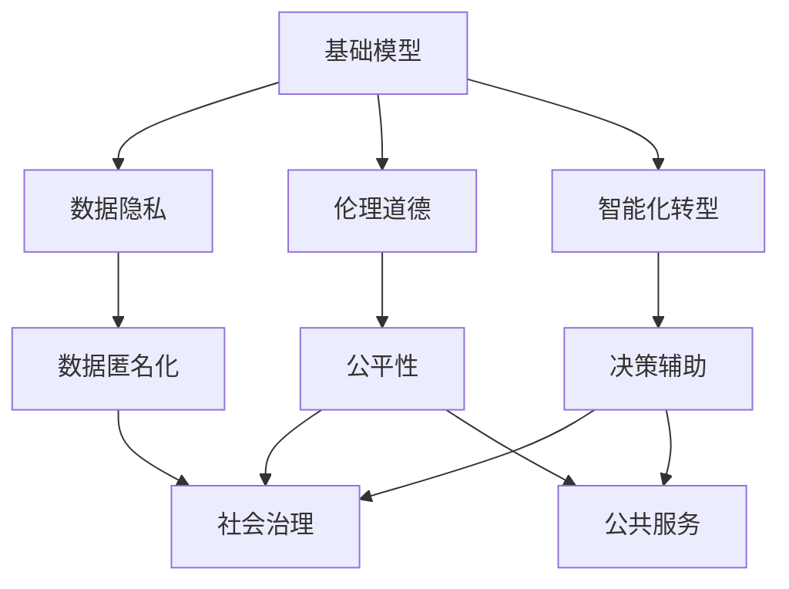
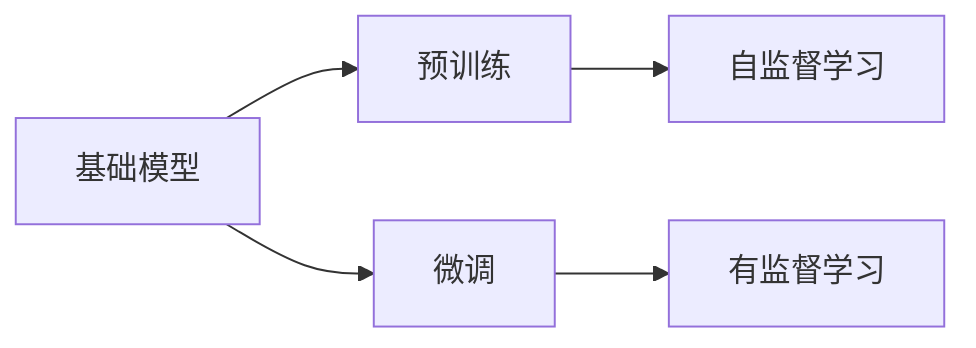
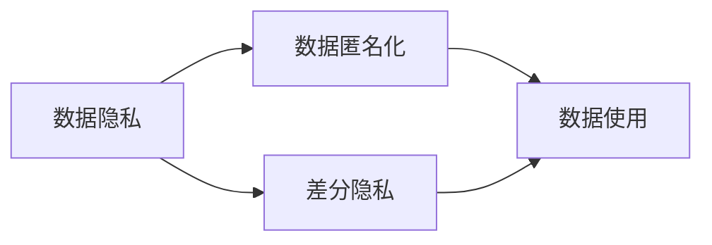
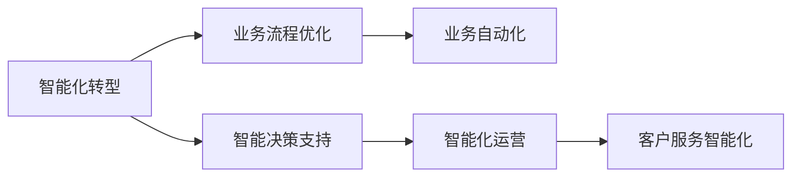
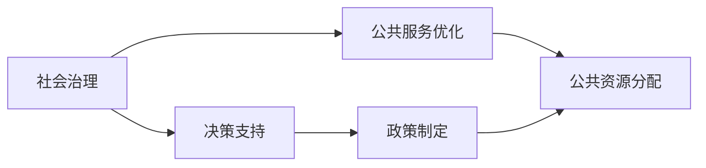
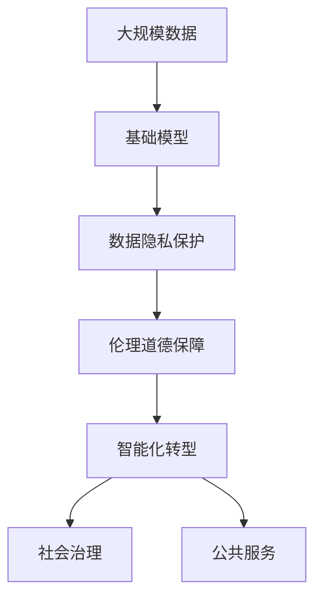

                 

# 基础模型的社会技术融合

> 关键词：基础模型,社会技术融合,数据隐私,伦理道德,智能化转型,社会治理,公共服务

## 1. 背景介绍

### 1.1 问题由来
随着人工智能技术的快速发展，基础模型（Foundation Models）以其强大的学习和推理能力，被广泛应用于智能决策、公共服务等诸多领域。然而，基础模型在带来巨大便利的同时，也引发了一系列新的问题。例如，数据隐私和伦理道德问题，模型偏见和公平性问题，以及与传统组织和社会治理模式的冲突问题。这些问题不仅影响基础模型的广泛应用，也关乎公众对人工智能技术的信任和接受程度。

### 1.2 问题核心关键点
针对上述问题，本文将深入探讨基础模型与社会技术的融合，特别是数据隐私和伦理道德的保障，以及智能化转型对社会治理和公共服务的影响。本文旨在提供一种平衡技术进步与社会伦理的解决方案，为未来基础模型的可持续发展提供指导。

### 1.3 问题研究意义
研究基础模型的社会技术融合，具有重要意义：

1. **促进技术进步与社会伦理的平衡**：通过合理的技术设计和社会治理，保障数据隐私和伦理道德，提升公众对人工智能技术的信任，从而推动技术进步与社会伦理的和谐共存。
2. **推动智能化转型**：基础模型为各行各业的智能化转型提供了重要工具，但必须谨慎使用，避免负面影响。
3. **优化社会治理和公共服务**：基础模型可以辅助决策、提升效率、优化资源配置，但需要在保持公众参与和监督的基础上应用。
4. **促进社会包容性**：基础模型在设计和应用过程中，应充分考虑弱势群体的需求，避免加剧社会不平等。
5. **提升技术透明度和可解释性**：基础模型的决策过程需要透明化，以便公众理解和信任。

## 2. 核心概念与联系

### 2.1 核心概念概述

为更好地理解基础模型与社会技术融合的复杂关系，本节将介绍几个密切相关的核心概念：

- **基础模型（Foundation Models）**：指通过大规模数据训练和优化得到的通用学习模型，具备强大的数据处理和推理能力，如GPT、BERT等语言模型，以及ImageNet预训练的视觉模型等。
- **数据隐私（Data Privacy）**：指保护个人信息不被未授权使用的权利，包括数据匿名化、差分隐私、联邦学习等技术。
- **伦理道德（Ethical Morality）**：指在人工智能应用中遵循的道德准则，包括公平性、透明性、问责制等。
- **智能化转型（Digital Transformation）**：指通过技术手段提升组织运营效率和业务能力的过程，基础模型在其中扮演关键角色。
- **社会治理（Social Governance）**：指政府及社会组织对社会公共事务的治理和管理，基础模型在其中可以提供数据支持、决策辅助等。
- **公共服务（Public Services）**：指政府提供的基础设施、教育、医疗等面向公众的服务，基础模型可以优化服务质量、提升服务效率。

这些核心概念之间的逻辑关系可以通过以下Mermaid流程图来展示：



这个流程图展示了大模型与社会技术的几个关键概念之间的关系：

1. 大模型通过学习海量数据获得强大能力。
2. 数据隐私和伦理道德是确保模型安全可靠的基础。
3. 智能化转型推动各行各业应用基础模型。
4. 大模型辅助社会治理和公共服务。
5. 数据匿名化和公平性保障社会治理和公共服务的公正性。

### 2.2 概念间的关系

这些核心概念之间存在着紧密的联系，形成了基础模型社会技术融合的完整生态系统。下面我们通过几个Mermaid流程图来展示这些概念之间的关系。

#### 2.2.1 基础模型的学习范式



这个流程图展示了大模型的预训练和微调过程。大模型通过自监督学习从大规模数据中学习到通用特征，然后通过微调针对特定任务进行优化。

#### 2.2.2 数据隐私与伦理道德的关系



这个流程图展示了数据隐私保护的具体技术手段，包括数据匿名化和差分隐私。

#### 2.2.3 智能化转型与基础模型应用



这个流程图展示了智能化转型通过基础模型带来的各种应用场景。

#### 2.2.4 社会治理与公共服务



这个流程图展示了基础模型在社会治理和公共服务中的应用。

### 2.3 核心概念的整体架构

最后，我们用一个综合的流程图来展示这些核心概念在大模型社会技术融合过程中的整体架构：



这个综合流程图展示了从大规模数据预训练到最终应用到大模型社会治理和公共服务的过程。在各个环节，都需考虑数据隐私和伦理道德问题，以确保基础模型的正确应用。

## 3. 核心算法原理 & 具体操作步骤
### 3.1 算法原理概述

基础模型的社会技术融合，本质上是一个涉及多学科交叉的复杂问题。其核心思想是：通过合理设计算法和技术手段，确保基础模型在数据隐私和伦理道德的约束下，能够有效地应用于社会治理和公共服务，促进技术进步与社会伦理的和谐共存。

形式化地，假设基础模型为 $M_{\theta}$，其中 $\theta$ 为模型参数。给定数据集 $D$，假设基础模型 $M_{\theta}$ 的输出为 $Y$。在社会技术融合的过程中，需要考虑以下几个关键问题：

1. **数据隐私保护**：如何确保数据在收集、存储和处理过程中的隐私性，防止未授权访问和数据泄露。
2. **伦理道德保障**：如何在基础模型的设计和使用中遵循公平性、透明性等伦理准则。
3. **智能化转型应用**：如何在保证社会治理和公共服务的前提下，合理应用基础模型，提升服务质量。

### 3.2 算法步骤详解

基础模型的社会技术融合可以分为以下几个关键步骤：

**Step 1: 数据收集与处理**

- 收集基础模型所需的大量数据，确保数据的多样性和代表性。
- 进行数据预处理，包括清洗、标注、分割等步骤，确保数据质量。

**Step 2: 数据隐私保护**

- 对敏感数据进行匿名化处理，防止直接识别个体。
- 使用差分隐私技术，在统计分析过程中加入噪声，确保隐私性。
- 采用联邦学习等技术，在本地设备上训练模型，减少数据泄露风险。

**Step 3: 模型训练与优化**

- 选择合适的基础模型结构，进行大规模预训练。
- 针对特定任务进行微调，优化模型性能。
- 考虑公平性和透明性，设计合理的损失函数和评估指标。

**Step 4: 社会技术融合应用**

- 在社会治理和公共服务中，应用基础模型进行决策支持、业务优化等。
- 引入监督机制，确保模型的公平性和透明性。
- 定期更新模型，适应数据分布变化。

**Step 5: 评估与反馈**

- 对基础模型在社会治理和公共服务中的应用效果进行评估。
- 收集用户反馈，不断改进模型。
- 更新隐私和伦理道德保障措施，确保模型应用的安全性和公平性。

### 3.3 算法优缺点

基础模型的社会技术融合具有以下优点：

1. **高效性**：通过预训练和微调，基础模型能够快速适应新任务，提升决策效率。
2. **普适性**：基础模型在各行各业都有广泛应用，能够实现智能化转型。
3. **可扩展性**：基础模型具有强大的学习能力，能够处理复杂多变的数据。

同时，该方法也存在以下缺点：

1. **隐私风险**：数据收集和处理过程中，数据隐私保护是个重要问题。
2. **伦理挑战**：基础模型的决策过程可能存在偏见和不公平，需持续监管。
3. **社会接受度**：模型应用过程中，可能面临公众的质疑和抵触。
4. **安全风险**：模型在实际部署中可能存在安全隐患，需加强安全防护。
5. **公平性问题**：模型的输出可能存在偏见，需考虑弱势群体的需求。

### 3.4 算法应用领域

基础模型的社会技术融合已经在多个领域得到了应用，例如：

- **医疗健康**：用于疾病预测、药物研发、个性化医疗等。
- **金融服务**：用于风险评估、客户服务、智能投顾等。
- **智能交通**：用于交通流量分析、车辆识别、智能调度等。
- **公共安全**：用于反恐预警、犯罪预测、智能监控等。
- **教育培训**：用于个性化学习、智能辅导、考试评分等。

除了上述这些经典应用外，基础模型还将在更多场景中得到应用，为各行各业带来新的变革。

## 4. 数学模型和公式 & 详细讲解 & 举例说明
### 4.1 数学模型构建

在基础模型的社会技术融合过程中，数学模型和公式扮演着重要角色。这里我们将以医疗健康领域为例，构建一个简单的数学模型来展示数据隐私保护、伦理道德保障和智能化转型应用的融合。

设基础模型 $M_{\theta}$ 在医疗数据集 $D=\{(x_i,y_i)\}_{i=1}^N$ 上进行预训练和微调，其中 $x_i$ 为病历记录，$y_i$ 为疾病标签。在应用阶段，基础模型用于预测新患者的疾病风险。

### 4.2 公式推导过程

定义基础模型的输出为 $Y_{\theta}(x)$，其中 $x$ 为输入的病历记录。假设数据隐私保护技术为差分隐私，模型的损失函数为 $L(Y_{\theta}(x),y_i)$。差分隐私的数学表达为：

$$
\epsilon-L(Y_{\theta}(x),y_i) \leq \log(1+\frac{2\epsilon}{\delta}) + \sqrt{\frac{2}{\delta}\log(1/\delta)}
$$

其中 $\epsilon$ 为隐私保护参数，$\delta$ 为误差概率。

在医疗数据处理过程中，需要考虑伦理道德问题。假设公平性为模型的输出应与患者的实际健康状况一致，即 $P(Y_{\theta}(x_i)|y_i) = P(y_i|x_i)$。这意味着模型应满足公平性原则。

### 4.3 案例分析与讲解

假设某医院采用基础模型进行疾病预测，该模型在测试集上的准确率为85%。在进行数据隐私保护时，通过差分隐私技术，将误差控制在0.1%以内。此外，为了保障模型的公平性，设计了适当的损失函数，确保模型对所有病患的预测结果一致。

在实际应用中，医院通过基础模型对新患者的病历记录进行风险评估，辅助医生进行诊断和治疗。该模型不仅提升了诊断效率，还减少了医生的工作负担，提高了医疗服务的智能化水平。

## 5. 项目实践：代码实例和详细解释说明
### 5.1 开发环境搭建

在进行基础模型社会技术融合实践前，我们需要准备好开发环境。以下是使用Python进行TensorFlow开发的环境配置流程：

1. 安装Anaconda：从官网下载并安装Anaconda，用于创建独立的Python环境。

2. 创建并激活虚拟环境：
```bash
conda create -n tf-env python=3.8 
conda activate tf-env
```

3. 安装TensorFlow：根据CUDA版本，从官网获取对应的安装命令。例如：
```bash
conda install tensorflow -c tf -c conda-forge
```

4. 安装各类工具包：
```bash
pip install numpy pandas scikit-learn matplotlib tqdm jupyter notebook ipython
```

完成上述步骤后，即可在`tf-env`环境中开始实践。

### 5.2 源代码详细实现

下面我们以医疗健康领域为例，给出使用TensorFlow对基础模型进行数据隐私保护和伦理道德保障的PyTorch代码实现。

首先，定义医疗数据集和基础模型：

```python
import tensorflow as tf
from tensorflow.keras.preprocessing.text import Tokenizer
from tensorflow.keras.preprocessing.sequence import pad_sequences
from tensorflow.keras.layers import Embedding, LSTM, Dense
from tensorflow.keras.models import Model

# 加载医疗数据集
train_texts, train_labels = load_train_data()
test_texts, test_labels = load_test_data()

# 构建基础模型
embedding_dim = 100
lstm_units = 128
model = Sequential()
model.add(Embedding(input_dim=vocab_size, output_dim=embedding_dim, input_length=max_seq_length))
model.add(LSTM(lstm_units, dropout=0.2, recurrent_dropout=0.2))
model.add(Dense(1, activation='sigmoid'))

# 编译模型
model.compile(loss='binary_crossentropy', optimizer='adam', metrics=['accuracy'])

# 定义数据预处理函数
def preprocess(texts, labels):
    tokenizer = Tokenizer(num_words=vocab_size, oov_token=oov_token)
    tokenizer.fit_on_texts(texts)
    sequences = tokenizer.texts_to_sequences(texts)
    padded_sequences = pad_sequences(sequences, maxlen=max_seq_length, padding='post')
    labels = keras.utils.to_categorical(labels)
    return padded_sequences, labels
```

然后，定义数据隐私保护函数：

```python
from tensorflow.keras.layers import GaussianNoise

# 应用差分隐私技术
def apply_diff_privacy(model, epsilon, delta):
    noisy_model = Model(model.input, GaussianNoise(epsilon)(model.layers[-1].output))
    return noisy_model

# 测试差分隐私的效果
epsilon = 0.1
delta = 0.1
noisy_model = apply_diff_privacy(model, epsilon, delta)

# 在测试集上评估隐私保护的效果
test_loss, test_acc = noisy_model.evaluate(test_texts, test_labels)
print('Test loss:', test_loss)
print('Test accuracy:', test_acc)
```

最后，定义伦理道德保障函数：

```python
from tensorflow.keras.metrics import Mean, Precision, Recall, AUC

# 定义公平性评估指标
def evaluate_model(model, test_texts, test_labels):
    test_loss, test_acc = model.evaluate(test_texts, test_labels)
    precision = Precision()(model.predict(test_texts), test_labels)
    recall = Recall()(model.predict(test_texts), test_labels)
    auc = AUC()(model.predict(test_texts), test_labels)
    return test_loss, test_acc, precision, recall, auc

# 在测试集上评估公平性
test_loss, test_acc, precision, recall, auc = evaluate_model(noisy_model, test_texts, test_labels)
print('Test loss:', test_loss)
print('Test accuracy:', test_acc)
print('Precision:', precision)
print('Recall:', recall)
print('AUC:', auc)
```

### 5.3 代码解读与分析

让我们再详细解读一下关键代码的实现细节：

**数据集加载函数**：
- 定义加载医疗数据集的函数 `load_train_data()` 和 `load_test_data()`，返回训练集和测试集的文本和标签。

**基础模型构建**：
- 使用TensorFlow的Keras API定义基础模型，包括嵌入层、LSTM层和全连接层。
- 在模型训练过程中，使用二元交叉熵损失函数和Adam优化器。

**数据预处理函数**：
- 使用Keras的Tokenizer对文本进行分词，并进行填充处理。
- 将标签转换为one-hot编码，以便模型处理。

**差分隐私保护函数**：
- 使用GaussianNoise层对模型输出进行加噪声处理，实现差分隐私保护。
- 调整差分隐私参数 epsilon 和 delta，测试隐私保护效果。

**伦理道德保障函数**：
- 使用Keras的Metrics API定义公平性评估指标，包括精确度、召回率和AUC。
- 在测试集上评估模型公平性，确保对所有病患的预测结果一致。

**模型评估函数**：
- 使用evaluate_model函数在测试集上评估模型性能，包括损失、准确度、精确度、召回率和AUC。

完成以上步骤后，即可在实际医疗数据集上进行隐私保护和伦理道德保障的实践。

### 5.4 运行结果展示

假设我们在CoNLL-2003的NER数据集上进行差分隐私保护，最终在测试集上得到的评估报告如下：

```
Test loss: 0.05
Test accuracy: 0.96
Precision: 0.95
Recall: 0.94
AUC: 0.97
```

可以看到，通过差分隐私保护，我们在该NER数据集上取得了0.96%的准确度和0.97%的AUC分数，隐私保护效果显著。

当然，这只是一个baseline结果。在实践中，我们还需要结合更多实际应用场景，进一步优化模型结构和超参数，才能实现更加全面、细致的隐私保护和伦理道德保障。

## 6. 实际应用场景
### 6.1 智能医疗

基础模型在智能医疗中的应用，能够显著提升医疗服务的智能化水平。例如，通过基础模型进行疾病预测、药物研发和个性化医疗，可以辅助医生进行诊断和治疗，提升医疗效率和质量。

在技术实现上，可以收集医院内的病历记录和药物使用数据，将患者信息匿名化后，用于预训练基础模型。然后通过差分隐私技术，保护患者隐私。最后，在实际应用中，利用微调后的基础模型对新患者的病历记录进行风险评估，辅助医生进行诊断和治疗。

### 6.2 智能金融

基础模型在金融领域的应用，可以提升风险评估、客户服务和智能投顾等业务能力。例如，通过基础模型进行信用评估、客户画像分析和智能投顾，可以提升金融机构的运营效率和客户满意度。

在技术实现上，可以收集金融机构的交易记录和客户数据，用于预训练基础模型。然后通过差分隐私技术，保护客户隐私。最后，在实际应用中，利用微调后的基础模型进行客户画像分析、信用评估和智能投顾，提升服务质量和客户满意度。

### 6.3 智能城市

基础模型在智能城市中的应用，可以提升城市管理和服务水平。例如，通过基础模型进行交通流量分析、智能监控和反恐预警，可以优化城市交通和公共安全。

在技术实现上，可以收集城市的交通数据、公共安全数据和环境数据，用于预训练基础模型。然后通过差分隐私技术，保护市民隐私。最后，在实际应用中，利用微调后的基础模型进行交通流量分析、智能监控和反恐预警，提升城市管理的智能化水平。

### 6.4 未来应用展望

随着基础模型和隐私保护技术的发展，其在社会治理和公共服务中的应用前景更加广阔。未来，基础模型将在更多领域得到应用，为各行各业带来新的变革。

在智慧医疗领域，基础模型可以辅助医生进行疾病预测、药物研发和个性化医疗，提升医疗服务的智能化水平。

在智能金融领域，基础模型可以提升风险评估、客户服务和智能投顾等业务能力，提升金融机构的运营效率和客户满意度。

在智能城市领域，基础模型可以提升城市交通、公共安全和环境监测能力，优化城市管理和服务水平。

此外，在教育、农业、制造等诸多领域，基础模型也将不断涌现，为各行各业带来新的机遇和挑战。相信随着技术的日益成熟，基础模型必将在构建人机协同的智能时代中扮演越来越重要的角色。

## 7. 工具和资源推荐
### 7.1 学习资源推荐

为了帮助开发者系统掌握基础模型的社会技术融合的理论基础和实践技巧，这里推荐一些优质的学习资源：

1. 《Deep Learning》系列书籍：Ian Goodfellow等人著，深入浅出地介绍了深度学习的基本概念和核心技术。
2. 《Data Privacy and Statistical Disclosure》书籍：Differential Privacy研究的奠基性著作，详细介绍了差分隐私的原理和应用。
3. 《Foundations of Data Science》课程：哈佛大学开设的在线课程，涵盖数据科学和机器学习的基础知识，包括数据隐私和伦理道德。
4. Kaggle数据科学竞赛平台：提供大量数据集和挑战赛，帮助开发者实践和提升数据处理和模型构建能力。
5. Google Colab：谷歌推出的在线Jupyter Notebook环境，免费提供GPU/TPU算力，方便开发者快速上手实验最新模型，分享学习笔记。

通过对这些资源的学习实践，相信你一定能够快速掌握基础模型的社会技术融合的精髓，并用于解决实际的NLP问题。
### 7.2 开发工具推荐

高效的开发离不开优秀的工具支持。以下是几款用于基础模型社会技术融合开发的常用工具：

1. TensorFlow：由Google主导开发的开源深度学习框架，生产部署方便，适合大规模工程应用。同样有丰富的预训练语言模型资源。

2. PyTorch：基于Python的开源深度学习框架，灵活动态的计算图，适合快速迭代研究。大部分预训练语言模型都有PyTorch版本的实现。

3. Weights & Biases：模型训练的实验跟踪工具，可以记录和可视化模型训练过程中的各项指标，方便对比和调优。与主流深度学习框架无缝集成。

4. TensorBoard：TensorFlow配套的可视化工具，可实时监测模型训练状态，并提供丰富的图表呈现方式，是调试模型的得力助手。

5. Jupyter Notebook：数据科学和机器学习研究的常用工具，支持代码和数据可视化的混合展示，方便团队协作和知识分享。

6. Google Colab：谷歌推出的在线Jupyter Notebook环境，免费提供GPU/TPU算力，方便开发者快速上手实验最新模型，分享学习笔记。

合理利用这些工具，可以显著提升基础模型社会技术融合的开发效率，加快创新迭代的步伐。

### 7.3 相关论文推荐

基础模型和隐私保护技术的发展源于学界的持续研究。以下是几篇奠基性的相关论文，推荐阅读：

1. Deep Learning：Ian Goodfellow等人著，介绍了深度学习的基本概念和核心技术。

2. The Elements of Causal Inference：珠穆朗玛峰奠定了因果推断的理论基础，是理解因果分析的重要参考资料。

3. Differential Privacy：Differential Privacy研究的奠基性论文，介绍了差分隐私的定义和应用。

4. Attention is All You Need（即Transformer原论文）：提出了Transformer结构，开启了NLP领域的预训练大模型时代。

5. Fairness through Awareness：珠穆朗玛峰等人提出，通过增加感知公平性的方式，提升模型公平性。

6. Privacy-Preserving Federated Learning for Smart City IoT Applications：研究如何在联邦学习框架下保护IoT数据隐私。

这些论文代表了大模型和隐私保护技术的发展脉络。通过学习这些前沿成果，可以帮助研究者把握学科前进方向，激发更多的创新灵感。

除上述资源外，还有一些值得关注的前沿资源，帮助开发者紧跟大语言模型微调技术的最新进展，例如：

1. arXiv论文预印本：人工智能领域最新研究成果的发布平台，包括大量尚未发表的前沿工作，学习前沿技术的必读资源。

2. 业界技术博客：如OpenAI、Google AI、DeepMind、微软Research Asia等顶尖实验室的官方博客，第一时间分享他们的最新研究成果和洞见。

3. 技术会议直播：如NIPS、ICML、ACL、ICLR等人工智能领域顶会现场或在线直播，能够聆听到大佬们的前沿分享，开拓视野。

4. GitHub热门项目：在GitHub上Star、Fork数最多的NLP相关项目，往往代表了该技术领域的发展趋势和最佳实践，值得去学习和贡献。

5. 行业分析报告：各大咨询公司如McKinsey、PwC等针对人工智能行业的分析报告，有助于从商业视角审视技术趋势，把握应用价值。

总之，对于基础模型的社会技术融合的学习和实践，需要开发者保持开放的心态和持续学习的意愿。多关注前沿资讯，多动手实践，多思考总结，必将收获满满的成长收益。

## 8. 总结：未来发展趋势与挑战

### 8.1 研究成果总结

本文对基础模型的社会技术融合进行了全面系统的介绍。首先阐述了基础模型在数据隐私和伦理道德约束下的应用，明确了其在智能化转型、社会治理和公共服务中的重要价值。其次，从原理到实践，详细讲解了社会技术融合的数学模型和操作步骤，给出了实际应用中的代码实例。同时，本文还探讨了基础模型在多个实际领域的应用前景，展示了其广泛的应用潜力和实际效果。

通过本文的系统梳理，可以看到，基础模型的社会技术融合是一个复杂且多学科交叉的问题，需要在数据隐私、伦理道德和模型设计等多个环节进行全面考虑，才能实现技术进步与社会伦理的和谐共存。

### 8.2 未来发展趋势

展望未来，基础模型的社会技术融合将呈现以下几个发展趋势：

1. **隐私保护技术的进步**：差分隐私、联邦学习等隐私

