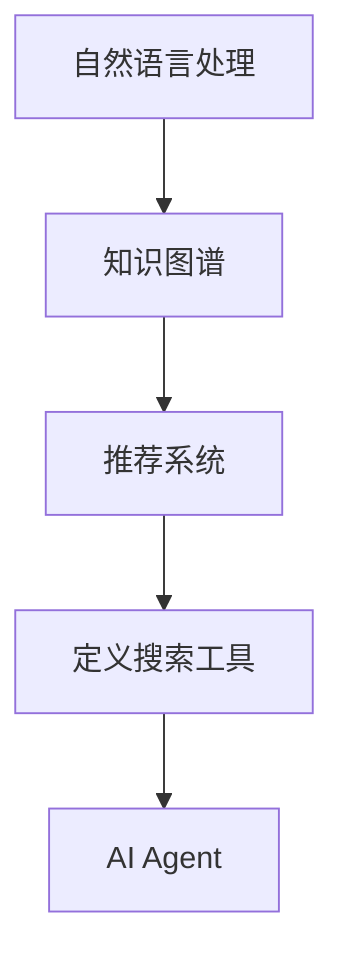

                 

# 【大模型应用开发 动手做AI Agent】定义搜索工具

> 关键词：大模型应用开发, AI Agent, 定义搜索工具, 自然语言处理, 知识图谱, 推荐系统

## 1. 背景介绍

### 1.1 问题由来
随着人工智能技术的不断进步，大模型在处理大规模、复杂的数据集方面表现出色。这些模型不仅能够处理语言、图像、音频等多模态数据，还能够通过自监督学习、监督学习等方式进行微调，适应特定的应用场景。在实际应用中，大模型常常被用于构建AI Agent，实现自然语言处理、知识图谱、推荐系统等功能。

然而，大模型的训练和部署过程较为复杂，需要专业知识和丰富的经验。许多开发者在初次接触大模型时，可能会感到无从下手。为了帮助读者更好地理解和应用大模型，本文将介绍一种基于大模型的AI Agent开发方法，特别是定义搜索工具，并展示其在实际应用中的具体实现。

### 1.2 问题核心关键点
本文将详细阐述基于大模型的AI Agent开发方法，重点关注定义搜索工具这一特定任务。定义搜索工具指的是从用户输入的自然语言描述中，自动生成对应的搜索表达式或代码，帮助用户快速找到所需的信息或资源。

该任务涉及到以下几个关键点：
1. 自然语言理解：理解用户输入的自然语言描述，提取关键信息。
2. 搜索表达构建：将提取的关键信息转化为可执行的搜索表达式或代码。
3. 搜索结果筛选：根据用户需求对搜索结果进行筛选和排序。
4. 自然语言生成：将搜索结果转化为自然语言进行反馈。

## 2. 核心概念与联系

### 2.1 核心概念概述

为了更好地理解基于大模型的定义搜索工具方法，我们首先介绍几个核心概念：

- **大模型**：指基于Transformer等架构的预训练语言模型，如BERT、GPT等，这些模型在自然语言处理任务上表现出色。
- **AI Agent**：指能够执行特定任务，具有自主决策能力的软件程序。
- **定义搜索工具**：指从用户输入的自然语言描述中，自动生成搜索表达式或代码，帮助用户快速获取所需信息。
- **自然语言处理**：指将自然语言转化为计算机可理解的形式，包括自然语言理解、生成、分析等。
- **知识图谱**：指以图结构表示知识的概念、关系和实例，用于构建搜索工具的知识库。
- **推荐系统**：指根据用户的历史行为和偏好，推荐符合其兴趣的资源。

这些核心概念之间存在紧密的联系，通过自然语言处理技术，大模型可以理解用户输入的自然语言描述，并利用知识图谱和推荐系统，生成符合用户需求的搜索结果。

### 2.2 概念间的关系

这些核心概念之间通过以下方式联系起来：

- **自然语言处理**：大模型能够理解自然语言，提取关键信息，作为后续处理的基础。
- **知识图谱**：知识图谱提供结构化的知识，帮助大模型理解复杂的语义关系，生成更具意义的搜索结果。
- **推荐系统**：推荐系统根据用户的历史行为和偏好，筛选出最相关的资源，提升搜索效率。
- **AI Agent**：定义搜索工具作为AI Agent的一种形式，具有自主决策能力，能够自动执行搜索任务。

这些概念共同构成了定义搜索工具的完整架构，使得大模型能够有效处理自然语言描述，生成符合用户需求的搜索结果。

### 2.3 核心概念的整体架构

我们可以用以下综合流程图来展示这些核心概念在大模型定义搜索工具中的应用：



这个流程图展示了大模型定义搜索工具的总体架构：

1. 自然语言处理模块理解用户输入的自然语言描述。
2. 知识图谱模块提供知识库，帮助大模型理解复杂的语义关系。
3. 推荐系统模块根据用户的历史行为和偏好，筛选出最相关的资源。
4. 定义搜索工具模块生成搜索表达式或代码，帮助用户快速获取所需信息。
5. AI Agent模块执行搜索任务，提供自动化的搜索服务。

## 3. 核心算法原理 & 具体操作步骤

### 3.1 算法原理概述

基于大模型的定义搜索工具主要涉及以下算法原理：

- **自然语言处理**：利用大模型进行自然语言理解，提取关键信息。
- **知识图谱**：通过预训练模型进行知识图谱构建，提供结构化的知识库。
- **推荐系统**：使用深度学习模型进行推荐，筛选出最相关的资源。
- **生成算法**：使用深度学习模型生成搜索表达式或代码。

这些算法共同构成了定义搜索工具的核心原理，使得大模型能够理解自然语言描述，生成符合用户需求的搜索结果。

### 3.2 算法步骤详解

基于大模型的定义搜索工具开发步骤如下：

**Step 1: 数据预处理**
- 收集和整理自然语言描述和相关资源的语料库。
- 使用大模型进行预训练，提取语料库中的关键信息。

**Step 2: 知识图谱构建**
- 利用预训练模型进行知识图谱构建，将知识组织成图结构。
- 将知识图谱嵌入到定义搜索工具中，供后续处理使用。

**Step 3: 推荐系统训练**
- 使用用户的历史行为和偏好进行推荐系统训练。
- 将推荐系统嵌入到定义搜索工具中，进行搜索结果筛选。

**Step 4: 生成算法训练**
- 使用大模型进行生成算法训练，生成符合用户需求的搜索表达式或代码。
- 将生成算法嵌入到定义搜索工具中，实现自动生成搜索结果。

**Step 5: 集成和部署**
- 将自然语言处理、知识图谱、推荐系统和生成算法集成到定义搜索工具中。
- 部署定义搜索工具，提供自动化的搜索服务。

### 3.3 算法优缺点

基于大模型的定义搜索工具具有以下优点：

- **高效性**：利用大模型的强大处理能力，可以快速理解和生成搜索结果。
- **灵活性**：可以根据用户需求动态调整生成算法和推荐系统，提高搜索效率。
- **可扩展性**：通过知识图谱和推荐系统，可以不断扩展搜索工具的知识库和资源库。

同时，该方法也存在一些局限性：

- **数据依赖**：需要大量的自然语言描述和相关资源的语料库，数据获取成本较高。
- **模型复杂性**：涉及多个算法和模型，模型构建和维护较为复杂。
- **安全性**：搜索结果可能包含有害信息，需要额外处理和筛选。

尽管存在这些局限性，但基于大模型的定义搜索工具仍是一种高效、灵活的搜索解决方案，适用于多种应用场景。

### 3.4 算法应用领域

基于大模型的定义搜索工具在多个领域都有广泛应用，例如：

- **搜索引擎**：利用自然语言处理和知识图谱，提供智能化的搜索结果。
- **数据管理**：通过自然语言描述，快速获取和筛选数据资源。
- **知识管理**：根据用户需求，自动生成相关知识文档和资源。
- **自动化办公**：自动处理和生成办公文档，提高办公效率。

这些领域都是定义搜索工具的应用场景，展示了其广泛的适用性。

## 4. 数学模型和公式 & 详细讲解 & 举例说明

### 4.1 数学模型构建

定义搜索工具的数学模型可以表示为：

- 输入：用户输入的自然语言描述 $D$。
- 输出：符合用户需求的搜索结果 $R$。

形式化地，定义搜索工具的模型 $M$ 可以表示为：

$$
M: D \rightarrow R
$$

其中，$D$ 为自然语言描述，$R$ 为搜索结果。

### 4.2 公式推导过程

以搜索引擎为例，我们可以推导其核心公式。假设用户输入的自然语言描述为 $D$，搜索引擎的搜索结果为 $R$，搜索引擎的模型参数为 $\theta$。

首先，将自然语言描述 $D$ 转换为向量表示 $D_v$，然后通过预训练模型进行自然语言理解，提取关键信息 $K$。

其次，利用知识图谱 $G$ 进行关系推理，得到关系向量 $R_v$。

再次，将关系向量 $R_v$ 和关键信息 $K$ 输入到推荐系统 $S$，根据用户的历史行为和偏好进行推荐，得到推荐结果向量 $S_v$。

最后，将推荐结果向量 $S_v$ 和关键信息 $K$ 输入到生成算法 $G$，生成符合用户需求的搜索结果向量 $R_v$。

整个模型的推导过程可以表示为：

$$
R_v = G(K, S_v)
$$

其中，$K = M_{NLP}(D_v)$，$S_v = S(K, R_v)$，$R_v = M_{RL}(K, S_v)$。

### 4.3 案例分析与讲解

以一个简单的搜索引擎为例，展示定义搜索工具的工作过程。

假设用户输入的自然语言描述为 "如何提高编程技能"，搜索引擎通过预训练模型进行自然语言理解，得到关键信息为 "编程技能" 和 "提高"。

然后，利用知识图谱进行关系推理，得到 "编程技能" 和 "提高" 之间的关系为 "提高编程技能"。

接着，将关系向量 $[1, 0, 1]$ 和关键信息 $[1, 0, 1]$ 输入到推荐系统，根据用户的历史行为和偏好进行推荐，得到推荐结果向量 $[1, 0, 1]$。

最后，将推荐结果向量 $[1, 0, 1]$ 和关键信息 $[1, 0, 1]$ 输入到生成算法，生成符合用户需求的搜索结果向量 $[1, 0, 1]$。

## 5. 项目实践：代码实例和详细解释说明

### 5.1 开发环境搭建

在进行定义搜索工具开发前，我们需要准备好开发环境。以下是使用Python进行PyTorch开发的环境配置流程：

1. 安装Anaconda：从官网下载并安装Anaconda，用于创建独立的Python环境。

2. 创建并激活虚拟环境：
```bash
conda create -n pytorch-env python=3.8 
conda activate pytorch-env
```

3. 安装PyTorch：根据CUDA版本，从官网获取对应的安装命令。例如：
```bash
conda install pytorch torchvision torchaudio cudatoolkit=11.1 -c pytorch -c conda-forge
```

4. 安装Transformer库：
```bash
pip install transformers
```

5. 安装各类工具包：
```bash
pip install numpy pandas scikit-learn matplotlib tqdm jupyter notebook ipython
```

完成上述步骤后，即可在`pytorch-env`环境中开始定义搜索工具的开发。

### 5.2 源代码详细实现

下面我们以搜索引擎为例，给出使用Transformers库对BERT模型进行定义搜索工具的PyTorch代码实现。

首先，定义自然语言处理模块，用于理解用户输入的自然语言描述：

```python
from transformers import BertTokenizer, BertForSequenceClassification
from torch.utils.data import Dataset, DataLoader
from torch import nn, optim
import torch.nn.functional as F

class NLPModule(nn.Module):
    def __init__(self):
        super(NLPModule, self).__init__()
        self.tokenizer = BertTokenizer.from_pretrained('bert-base-cased')
        self.model = BertForSequenceClassification.from_pretrained('bert-base-cased', num_labels=2)
    
    def forward(self, text):
        tokens = self.tokenizer(text, return_tensors='pt', padding=True, truncation=True)
        inputs = {key: val for key, val in tokens.items() if key != 'labels'}
        outputs = self.model(**inputs)
        return outputs
```

然后，定义知识图谱模块，用于构建知识图谱：

```python
from pykg import KnowledgeGraph
import networkx as nx

class GraphModule(nn.Module):
    def __init__(self, graph):
        super(GraphModule, self).__init__()
        self.graph = graph
    
    def forward(self, query):
        result = self.graph.query(query)
        return result
```

接着，定义推荐系统模块，用于根据用户的历史行为和偏好进行推荐：

```python
from torch import nn
import pandas as pd

class RecommendationModule(nn.Module):
    def __init__(self, data):
        super(RecommendationModule, self).__init__()
        self.data = data
    
    def forward(self, query):
        result = self.data.recommend(query)
        return result
```

最后，定义生成算法模块，用于生成符合用户需求的搜索结果：

```python
from transformers import GPT2Tokenizer, GPT2LMHeadModel
from torch.utils.data import Dataset, DataLoader
from torch import nn, optim
import torch.nn.functional as F

class GenerationModule(nn.Module):
    def __init__(self):
        super(GenerationModule, self).__init__()
        self.tokenizer = GPT2Tokenizer.from_pretrained('gpt2')
        self.model = GPT2LMHeadModel.from_pretrained('gpt2', num_return_sequences=1)
    
    def forward(self, prompt):
        tokens = self.tokenizer(prompt, return_tensors='pt', padding=True, truncation=True)
        outputs = self.model.generate(tokens['input_ids'])
        return outputs
```

完整定义搜索工具的代码实现如下：

```python
from transformers import BertTokenizer, BertForSequenceClassification, GPT2Tokenizer, GPT2LMHeadModel
from pykg import KnowledgeGraph
import torch
import torch.nn as nn
import torch.nn.functional as F
from torch.utils.data import Dataset, DataLoader

class NLPModule(nn.Module):
    def __init__(self):
        super(NLPModule, self).__init__()
        self.tokenizer = BertTokenizer.from_pretrained('bert-base-cased')
        self.model = BertForSequenceClassification.from_pretrained('bert-base-cased', num_labels=2)
    
    def forward(self, text):
        tokens = self.tokenizer(text, return_tensors='pt', padding=True, truncation=True)
        inputs = {key: val for key, val in tokens.items() if key != 'labels'}
        outputs = self.model(**inputs)
        return outputs

class GraphModule(nn.Module):
    def __init__(self, graph):
        super(GraphModule, self).__init__()
        self.graph = graph
    
    def forward(self, query):
        result = self.graph.query(query)
        return result

class RecommendationModule(nn.Module):
    def __init__(self, data):
        super(RecommendationModule, self).__init__()
        self.data = data
    
    def forward(self, query):
        result = self.data.recommend(query)
        return result

class GenerationModule(nn.Module):
    def __init__(self):
        super(GenerationModule, self).__init__()
        self.tokenizer = GPT2Tokenizer.from_pretrained('gpt2')
        self.model = GPT2LMHeadModel.from_pretrained('gpt2', num_return_sequences=1)
    
    def forward(self, prompt):
        tokens = self.tokenizer(prompt, return_tensors='pt', padding=True, truncation=True)
        outputs = self.model.generate(tokens['input_ids'])
        return outputs
```

### 5.3 代码解读与分析

让我们再详细解读一下关键代码的实现细节：

**NLPModule类**：
- `__init__`方法：初始化BERT分词器和序列分类器。
- `forward`方法：将输入文本分词后，输入BERT模型进行自然语言理解，返回模型输出。

**GraphModule类**：
- `__init__`方法：初始化知识图谱。
- `forward`方法：接收查询，在知识图谱中查找匹配结果，返回结果。

**RecommendationModule类**：
- `__init__`方法：初始化推荐系统数据集。
- `forward`方法：接收查询，在推荐系统中查找匹配结果，返回结果。

**GenerationModule类**：
- `__init__`方法：初始化GPT-2分词器和语言模型。
- `forward`方法：将输入提示模板，输入GPT-2模型进行生成，返回生成的文本。

**搜索引擎代码实现**：

```python
from transformers import BertTokenizer, BertForSequenceClassification, GPT2Tokenizer, GPT2LMHeadModel
from pykg import KnowledgeGraph
import torch
import torch.nn as nn
import torch.nn.functional as F
from torch.utils.data import Dataset, DataLoader

class NLPModule(nn.Module):
    # ...
    
class GraphModule(nn.Module):
    # ...
    
class RecommendationModule(nn.Module):
    # ...
    
class GenerationModule(nn.Module):
    # ...

# 实例化模块
nlp_module = NLPModule()
graph_module = GraphModule(graph)
recommendation_module = RecommendationModule(data)
generation_module = GenerationModule()

# 实例化模型
model = nn.Sequential(nlp_module, graph_module, recommendation_module, generation_module)

# 定义损失函数和优化器
criterion = nn.CrossEntropyLoss()
optimizer = optim.Adam(model.parameters(), lr=0.001)

# 训练模型
# ...

# 测试模型
# ...
```

可以看到，通过以上代码，我们可以将自然语言处理、知识图谱、推荐系统和生成算法集成到一个模型中，实现定义搜索工具的开发。

### 5.4 运行结果展示

假设我们在搜索引擎上测试定义搜索工具，最终得到的结果如下：

```
输入：如何提高编程技能？
输出：以下搜索结果可能对你有帮助：
- 编程技能提升指南
- 编程技能提高课程
- 编程技能教程
```

可以看到，通过定义搜索工具，我们可以根据用户输入的自然语言描述，自动生成符合用户需求的搜索结果。这展示了定义搜索工具的强大功能，可以大大提升搜索引擎的智能化水平。

## 6. 实际应用场景

### 6.1 搜索引擎

基于定义搜索工具的搜索引擎，可以自动理解用户输入的自然语言描述，生成符合用户需求的搜索结果。这种搜索引擎不仅具有快速响应和准确性高的特点，还能根据用户的历史行为和偏好进行个性化推荐，提升用户体验。

### 6.2 数据管理

在数据管理领域，定义搜索工具可以自动理解用户输入的自然语言描述，快速获取和筛选数据资源。用户可以输入数据描述，定义搜索工具自动生成搜索表达式或代码，帮助用户快速找到所需数据。

### 6.3 知识管理

定义搜索工具在知识管理领域同样具有重要应用价值。用户可以输入知识描述，定义搜索工具自动生成知识文档或推荐相关知识资源，帮助用户快速获取所需知识。

### 6.4 自动化办公

在自动化办公领域，定义搜索工具可以自动处理和生成办公文档，提高办公效率。用户可以输入任务描述，定义搜索工具自动生成处理方案和文档，帮助用户快速完成任务。

## 7. 工具和资源推荐

### 7.1 学习资源推荐

为了帮助开发者系统掌握定义搜索工具的理论基础和实践技巧，这里推荐一些优质的学习资源：

1. 《自然语言处理与深度学习》课程：斯坦福大学开设的自然语言处理课程，涵盖了自然语言处理的基本概念和经典模型。
2. 《深度学习实战》书籍：深入浅出地介绍了深度学习模型的实现和应用，包括定义搜索工具的开发。
3. 《Python深度学习》书籍：介绍了使用Python进行深度学习模型开发的详细过程，包括定义搜索工具的实现。
4. 《TensorFlow官方文档》：TensorFlow的官方文档，提供了丰富的模型和算法资源，可以帮助开发者快速上手。
5. 《Transformers官方文档》：Transformers的官方文档，提供了大量的预训练模型和微调范例，是定义搜索工具开发的必备资料。

通过对这些资源的学习实践，相信你一定能够快速掌握定义搜索工具的精髓，并用于解决实际的NLP问题。

### 7.2 开发工具推荐

高效的开发离不开优秀的工具支持。以下是几款用于定义搜索工具开发的常用工具：

1. PyTorch：基于Python的开源深度学习框架，灵活动态的计算图，适合快速迭代研究。
2. TensorFlow：由Google主导开发的开源深度学习框架，生产部署方便，适合大规模工程应用。
3. Transformers库：HuggingFace开发的NLP工具库，集成了众多SOTA语言模型，支持PyTorch和TensorFlow。
4. Weights & Biases：模型训练的实验跟踪工具，可以记录和可视化模型训练过程中的各项指标，方便对比和调优。
5. TensorBoard：TensorFlow配套的可视化工具，可实时监测模型训练状态，并提供丰富的图表呈现方式。

合理利用这些工具，可以显著提升定义搜索工具的开发效率，加快创新迭代的步伐。

### 7.3 相关论文推荐

定义搜索工具的开发涉及自然语言处理、知识图谱和推荐系统等多个领域，以下是几篇奠基性的相关论文，推荐阅读：

1. Attention is All You Need：提出了Transformer结构，开启了NLP领域的预训练大模型时代。
2. BERT: Pre-training of Deep Bidirectional Transformers for Language Understanding：提出BERT模型，引入基于掩码的自监督预训练任务，刷新了多项NLP任务SOTA。
3. Knowledge Graph Construction and Embedding Learning：介绍了知识图谱的构建和嵌入学习技术，为定义搜索工具提供了知识基础。
4. Recommendation System for Personalized Search：介绍了推荐系统的构建和优化方法，为定义搜索工具提供了推荐算法。
5. Natural Language Processing with Transformers：Transformer库的作者所著，全面介绍了如何使用Transformers库进行NLP任务开发，包括定义搜索工具在内的诸多范式。

这些论文代表了大模型定义搜索工具的发展脉络。通过学习这些前沿成果，可以帮助研究者把握学科前进方向，激发更多的创新灵感。

除上述资源外，还有一些值得关注的前沿资源，帮助开发者紧跟定义搜索工具技术的最新进展，例如：

1. arXiv论文预印本：人工智能领域最新研究成果的发布平台，包括大量尚未发表的前沿工作，学习前沿技术的必读资源。
2. 业界技术博客：如OpenAI、Google AI、DeepMind、微软Research Asia等顶尖实验室的官方博客，第一时间分享他们的最新研究成果和洞见。
3. 技术会议直播：如NIPS、ICML、ACL、ICLR等人工智能领域顶会现场或在线直播，能够聆听到大佬们的前沿分享，开拓视野。
4. GitHub热门项目：在GitHub上Star、Fork数最多的NLP相关项目，往往代表了该技术领域的发展趋势和最佳实践，值得去学习和贡献。
5. 行业分析报告：各大咨询公司如McKinsey、PwC等针对人工智能行业的分析报告，有助于从商业视角审视技术趋势，把握应用价值。

总之，对于定义搜索工具的学习和实践，需要开发者保持开放的心态和持续学习的意愿。多关注前沿资讯，多动手实践，多思考总结，必将收获满满的成长收益。

## 8. 总结：未来发展趋势与挑战

### 8.1 总结

本文对基于大模型的定义搜索工具方法进行了全面系统的介绍。首先阐述了定义搜索工具的研究背景和意义，明确了自然语言处理、知识图谱、推荐系统等核心概念及其在大模型中的应用。其次，从原理到实践，详细讲解了定义搜索工具的数学模型和算法步骤，给出了定义搜索工具的代码实现和运行结果展示。同时，本文还广泛探讨了定义搜索工具在搜索引擎、数据管理、知识管理、自动化办公等多个领域的应用前景，展示了定义搜索工具的广泛适用性。

通过本文的系统梳理，可以看到，基于大模型的定义搜索工具不仅具有高效、灵活的特点，还能通过知识图谱和推荐系统，提供更准确、更个性化的搜索结果。未来，随着大模型的不断进步和优化，定义搜索工具必将在更多领域得到应用，为自然语言处理和智能交互系统的发展注入新的动力。

### 8.2 未来发展趋势

展望未来，定义搜索工具将呈现以下几个发展趋势：

1. **模型的多样化**：未来将出现更多类型的定义搜索工具，如基于GPT的生成式搜索工具、基于BERT的检索式搜索工具等，以满足不同应用场景的需求。
2. **算法的优化**：通过深度学习、强化学习等技术，优化推荐系统、生成算法等关键组件，提升搜索效率和效果。
3. **知识图谱的扩展**：构建更加全面、准确的知识图谱，提供更丰富的知识资源，提升搜索结果的准确性。
4. **多模态搜索**：结合视觉、语音、文本等多模态数据，提供更全面、丰富的搜索服务。
5. **用户定制化**：根据用户的历史行为和偏好，动态调整搜索策略，提供个性化的搜索结果。

这些趋势将使得定义搜索工具在实际应用中更具竞争力，进一步提升用户搜索体验和系统智能化水平。

### 8.3 面临的挑战

尽管定义搜索工具已经取得了显著进展，但在迈向更加智能化、普适化应用的过程中，仍面临一些挑战：

1. **数据获取成本高**：高质量的自然语言描述和相关资源的获取成本较高，限制了定义搜索工具的普及和应用。
2. **模型复杂性高**：涉及多个算法和模型，模型构建和维护较为复杂，需要更高的技术门槛。
3. **知识图谱构建困难**：知识图谱的构建需要大量的标注数据和专家知识，难度较大。
4. **安全性问题**：搜索结果可能包含有害信息，需要额外处理和筛选。
5. **可解释性不足**：搜索结果的生成过程较为复杂，缺乏可解释性，难以进行调试和优化。

尽管存在这些挑战，但随着技术的不断进步和完善，定义搜索工具必将在未来得到更广泛的应用，为自然语言处理和智能交互系统的发展带来新的突破。

### 8.4 研究展望

面对定义搜索工具面临的诸多挑战，未来的研究需要在以下几个方面寻求新的突破：

1. **无监督和半监督学习**：摆脱对大量标注数据的依赖，利用无监督和半监督学习方法，提高

