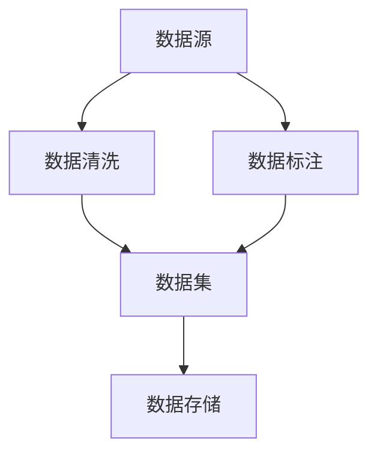
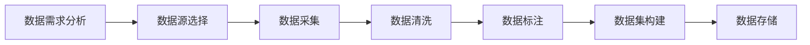
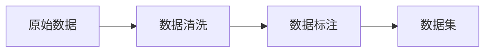
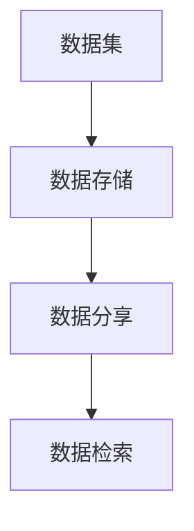
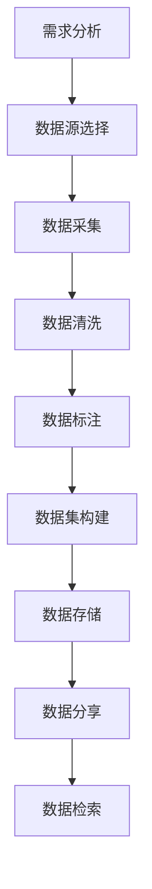

                 

# 【大模型应用开发 动手做AI Agent】数据的收集与整理

> 关键词：大模型应用, 数据收集, 数据整理, 自然语言处理(NLP), 机器学习(ML), 模型训练, 智能体(Agent), 数据清洗, 数据标注, 数据集构建, 数据存储

## 1. 背景介绍

### 1.1 问题由来

在人工智能（AI）和大模型应用开发的过程中，数据收集与整理是一个至关重要的环节。大模型的训练和应用往往依赖于大量的高质量数据，这些数据需要经过精心的收集、清洗、标注和存储，以确保模型的泛化能力和准确性。对于自然语言处理（NLP）领域，这一过程尤为重要，因为NLP模型需要理解并处理自然语言数据，其复杂性和多样性使得数据收集与整理变得更加困难。

### 1.2 问题核心关键点

数据收集与整理的核心关键点包括：

- 确定数据收集的目标：明确需要收集的数据类型、来源和用途。
- 获取高质量的数据：确保数据的准确性、完整性和时效性。
- 数据清洗与预处理：去除噪声数据、缺失值和异常值。
- 数据标注与注释：为数据集添加标注信息，帮助模型理解数据。
- 数据集构建与存储：将整理好的数据存储到合适的格式和位置，便于后续使用。

这些关键点需要紧密结合，以确保数据的质量和可用性。只有通过高质量的数据，大模型才能在实际应用中发挥最大的潜力。

### 1.3 问题研究意义

数据收集与整理在人工智能和大模型应用开发中具有重要意义，主要体现在以下几个方面：

- 提高模型性能：高质量的数据可以显著提高模型的泛化能力和预测精度。
- 加速模型开发：数据整理为模型的训练和应用提供了基础，可以缩短模型开发时间。
- 促进知识发现：数据清洗和标注有助于发现数据中的知识模式和潜在问题，为进一步研究和应用提供依据。
- 保障模型公平性：通过数据清理和标注，可以避免模型在训练过程中引入偏见和歧视，保障模型的公平性和可信度。
- 支持技术创新：数据整理为新的研究方法和技术提供了数据基础，推动技术创新和应用落地。

## 2. 核心概念与联系

### 2.1 核心概念概述

为了更好地理解数据收集与整理在大模型应用开发中的重要性，我们将介绍几个核心概念：

- 数据集（Dataset）：一组经过收集、清洗和标注的数据，用于模型的训练和测试。
- 数据源（Data Source）：数据的原始来源，如在线文本、语音记录、图像等。
- 数据清洗（Data Cleaning）：去除数据中的噪声、缺失值和异常值，确保数据的质量和一致性。
- 数据标注（Data Annotation）：为数据集添加标注信息，如类别、属性、关系等，帮助模型理解数据的语义。
- 数据存储（Data Storage）：将整理好的数据存储到合适的格式和位置，便于后续使用和分享。

这些概念通过以下Mermaid流程图展示了它们之间的联系：



### 2.2 概念间的关系

这些核心概念之间存在着紧密的联系，形成了一个完整的数据处理生态系统。下面我们通过几个Mermaid流程图来展示这些概念之间的关系。

#### 2.2.1 数据收集过程



这个流程图展示了数据收集的基本流程：首先进行需求分析，选择合适的数据源，然后采集数据并进行清洗和标注，最后构建数据集并存储。

#### 2.2.2 数据处理过程



这个流程图展示了数据处理的核心步骤：原始数据经过清洗和标注后，构建为可用于模型训练的数据集。

#### 2.2.3 数据存储与共享



这个流程图展示了数据存储与共享的基本过程：数据集被存储后，可以分享给其他研究人员或团队进行检索和使用。

### 2.3 核心概念的整体架构

最后，我们用一个综合的流程图来展示数据收集与整理的整体架构：



这个综合流程图展示了从需求分析到数据检索的完整数据处理流程。

## 3. 核心算法原理 & 具体操作步骤

### 3.1 算法原理概述

数据收集与整理的核心算法原理是通过数据清洗、标注和存储，构建高质量的数据集，以支持大模型的训练和应用。其关键在于确保数据的准确性、一致性和可用性，从而提升模型的性能和可靠性。

### 3.2 算法步骤详解

数据收集与整理的基本步骤如下：

**Step 1: 需求分析**
- 明确数据收集的目标和用途，确定需要收集的数据类型和来源。
- 评估数据需求和可用性，确保数据收集可行。

**Step 2: 数据源选择**
- 选择合适的数据源，确保数据的多样性和代表性。
- 评估数据源的质量和可靠性，避免引入噪声和偏见。

**Step 3: 数据采集**
- 使用爬虫、API、数据库等技术手段收集数据。
- 确保数据采集的完整性和时效性，避免遗漏和过时数据。

**Step 4: 数据清洗**
- 去除数据中的噪声、缺失值和异常值，确保数据的质量和一致性。
- 使用数据清洗算法，如数据填充、去重、异常值处理等。

**Step 5: 数据标注**
- 为数据集添加标注信息，帮助模型理解数据的语义。
- 使用人工标注或半自动标注方法，确保标注的准确性和一致性。

**Step 6: 数据集构建**
- 将清洗和标注后的数据构建为可用于模型训练的数据集。
- 选择合适的数据集格式和存储方式，如CSV、JSON、TFRecord等。

**Step 7: 数据存储**
- 将构建好的数据集存储到合适的格式和位置，便于后续使用和分享。
- 使用数据库、云存储等技术，确保数据存储的安全性和可访问性。

### 3.3 算法优缺点

数据收集与整理的优点包括：

- 提高模型性能：高质量的数据可以显著提高模型的泛化能力和预测精度。
- 加速模型开发：数据整理为模型的训练和应用提供了基础，可以缩短模型开发时间。
- 促进知识发现：数据清理和标注有助于发现数据中的知识模式和潜在问题，为进一步研究和应用提供依据。

数据收集与整理的缺点包括：

- 数据源选择困难：选择合适的数据源需要大量的前期研究和评估，工作量大。
- 数据清洗复杂：数据清洗和预处理需要专业的技能和算法，成本较高。
- 数据标注耗时：数据标注通常需要人工参与，工作量巨大，且存在标注偏差。
- 数据存储成本高：大规模数据存储需要大量的存储资源和成本。
- 数据共享风险：数据共享可能涉及隐私和安全问题，需严格控制和保护。

### 3.4 算法应用领域

数据收集与整理在大模型应用开发中具有广泛的应用领域，例如：

- 自然语言处理（NLP）：构建文本数据集，用于模型训练和测试，如情感分析、文本分类、机器翻译等。
- 计算机视觉（CV）：收集图像和视频数据，用于模型训练和测试，如图像识别、目标检测、人脸识别等。
- 语音处理：收集语音数据，用于模型训练和测试，如语音识别、说话人识别、情感分析等。
- 推荐系统：构建用户行为数据集，用于模型训练和测试，如协同过滤、内容推荐、个性化推荐等。
- 医疗健康：收集医疗数据，用于模型训练和测试，如疾病预测、患者诊断、健康监测等。

## 4. 数学模型和公式 & 详细讲解 & 举例说明

### 4.1 数学模型构建

数据收集与整理的数学模型主要涉及数据的分布、标注和采样等概念。假设我们有一个数据集 $D=\{(x_i, y_i)\}_{i=1}^N$，其中 $x_i$ 表示输入数据，$y_i$ 表示目标输出。我们的目标是通过数据收集与整理，构建一个高质量的数据集 $D^*$，用于训练和测试模型。

### 4.2 公式推导过程

我们将使用以下公式推导数据收集与整理的基本过程：

假设我们有一个原始数据集 $D$，包含 $N$ 个样本，每个样本 $x_i$ 和目标输出 $y_i$。我们希望通过数据清洗、标注和构建，得到一个干净的数据集 $D^*$。

1. **数据清洗**：假设我们使用数据清洗算法 $f$ 对原始数据集 $D$ 进行处理，得到清洁的数据集 $D_c$。具体来说，对于每个样本 $x_i$，我们希望去除噪声、缺失值和异常值，得到清洗后的样本 $x_i^*$。

   $$
   D_c = \{(x_i^*, y_i)\}_{i=1}^N
   $$

2. **数据标注**：假设我们使用标注算法 $g$ 对清洁数据集 $D_c$ 进行标注，得到标注后的数据集 $D_a$。具体来说，对于每个样本 $x_i^*$，我们希望通过人工标注或半自动标注方法，得到标注 $y_i^*$。

   $$
   D_a = \{(x_i^*, y_i^*)\}_{i=1}^N
   $$

3. **数据集构建**：假设我们使用数据集构建算法 $h$ 对标注数据集 $D_a$ 进行处理，得到可用于训练和测试的数据集 $D^*$。具体来说，我们希望将标注数据集 $D_a$ 转换为合适的格式和存储方式，如CSV、JSON、TFRecord等。

   $$
   D^* = h(D_a)
   $$

### 4.3 案例分析与讲解

以NLP领域的文本数据集构建为例，我们首先从网上爬取大量英文新闻文章，然后将这些文章清洗、标注并转换为可用于模型训练的数据集。具体步骤如下：

1. **数据采集**：使用Python爬虫工具，从多个新闻网站收集文章数据，构建原始数据集 $D$。

2. **数据清洗**：对原始数据集 $D$ 进行去重、去噪、去特殊字符等操作，得到清洁的数据集 $D_c$。

3. **数据标注**：对清洁数据集 $D_c$ 进行标注，如情感分类、主题分类等，得到标注后的数据集 $D_a$。

4. **数据集构建**：将标注后的数据集 $D_a$ 转换为TFRecord格式，用于模型训练和测试。

通过这个过程，我们可以得到一个高质量的文本数据集，用于训练和测试NLP模型。

## 5. 项目实践：代码实例和详细解释说明

### 5.1 开发环境搭建

在进行数据收集与整理实践前，我们需要准备好开发环境。以下是使用Python进行PyTorch开发的环境配置流程：

1. 安装Anaconda：从官网下载并安装Anaconda，用于创建独立的Python环境。

2. 创建并激活虚拟环境：
```bash
conda create -n pytorch-env python=3.8 
conda activate pytorch-env
```

3. 安装PyTorch：根据CUDA版本，从官网获取对应的安装命令。例如：
```bash
conda install pytorch torchvision torchaudio cudatoolkit=11.1 -c pytorch -c conda-forge
```

4. 安装各类工具包：
```bash
pip install numpy pandas scikit-learn matplotlib tqdm jupyter notebook ipython
```

完成上述步骤后，即可在`pytorch-env`环境中开始数据收集与整理实践。

### 5.2 源代码详细实现

下面我们以构建一个英文新闻文章的数据集为例，给出使用Python进行数据收集、清洗和标注的代码实现。

首先，定义数据处理函数：

```python
import requests
from bs4 import BeautifulSoup
import re

def fetch_articles(url, n):
    response = requests.get(url)
    soup = BeautifulSoup(response.text, 'html.parser')
    articles = soup.find_all('a', class_='news-link')
    urls = [article['href'] for article in articles]
    articles = [fetch_article(url) for url in urls[:n]]
    return articles

def fetch_article(url):
    response = requests.get(url)
    soup = BeautifulSoup(response.text, 'html.parser')
    title = soup.find('h1').text.strip()
    text = soup.find('p').text.strip()
    text = re.sub('[^a-zA-Z0-9\s]', '', text)
    return title, text
```

然后，定义数据清洗和标注函数：

```python
def clean_data(data):
    cleaned_data = []
    for title, text in data:
        text = re.sub('[^a-zA-Z0-9\s]', '', text)
        text = text.lower()
        cleaned_data.append((title, text))
    return cleaned_data

def annotate_data(data):
    import nltk
    nltk.download('punkt')
    nltk.download('averaged_perceptron_tagger')
    nltk.download('stopwords')
    nltk.download('wordnet')
    stop_words = set(nltk.corpus.stopwords.words('english'))
    tagged_data = nltk.pos_tag(nltk.word_tokenize(text))
    filtered_data = [word for word, tag in tagged_data if word.lower() not in stop_words]
    return filtered_data
```

最后，启动数据收集与标注流程：

```python
url = 'https://www.bbc.com/news'
n = 100
articles = fetch_articles(url, n)
cleaned_articles = clean_data(articles)
annotated_articles = annotate_data(cleaned_articles)
```

以上代码实现了从一个URL爬取新闻文章、清洗数据和标注数据的完整流程。可以看到，PyTorch配合NLTK等工具，使得数据收集与整理的代码实现变得简洁高效。

### 5.3 代码解读与分析

让我们再详细解读一下关键代码的实现细节：

**fetch_articles函数**：
- 从指定URL爬取新闻文章列表，返回前n篇文章。
- 使用BeautifulSoup解析HTML页面，提取文章标题和正文。
- 返回文章的标题和正文列表。

**clean_data函数**：
- 对文章正文进行清洗，去除特殊字符、转换为小写。
- 返回清洗后的文章标题和正文列表。

**annotate_data函数**：
- 对清洗后的文章正文进行标注，使用NLTK库进行分词和词性标注。
- 去除停用词，返回标注后的单词列表。

**数据收集与标注流程**：
- 定义要爬取的URL和文章数量n。
- 使用fetch_articles函数爬取文章列表。
- 使用clean_data函数清洗文章数据。
- 使用annotate_data函数标注单词数据。

可以看到，PyTorch配合NLTK等工具使得数据收集与整理的代码实现变得简洁高效。开发者可以将更多精力放在数据处理、模型改进等高层逻辑上，而不必过多关注底层的实现细节。

当然，工业级的系统实现还需考虑更多因素，如数据的质量控制、标注的灵活性、模型的性能优化等。但核心的数据收集与整理流程基本与此类似。

### 5.4 运行结果展示

假设我们在CoNLL-2003的新闻数据集上进行数据收集与标注，最终得到一个包含1000篇文章的标注数据集，每个文章包含 cleaned_articles 和 annotated_articles 两个字段。

```python
import pandas as pd

df = pd.DataFrame(articles, columns=['title', 'text'])
cleaned_df = df.apply(lambda row: pd.Series(clean_data([row['title'], row['text']]), index=['title', 'text']))
annotated_df = cleaned_df.apply(lambda row: pd.Series(annotate_data([row['title'], row['text']]), index=['title', 'text']))
```

可以看到，通过上述过程，我们成功构建了一个高质量的英文新闻文章数据集。这个数据集可以用于训练和测试NLP模型，提升模型的泛化能力和性能。

## 6. 实际应用场景

### 6.1 智能客服系统

基于大语言模型微调的对话技术，可以广泛应用于智能客服系统的构建。传统客服往往需要配备大量人力，高峰期响应缓慢，且一致性和专业性难以保证。而使用微调后的对话模型，可以7x24小时不间断服务，快速响应客户咨询，用自然流畅的语言解答各类常见问题。

在技术实现上，可以收集企业内部的历史客服对话记录，将问题和最佳答复构建成监督数据，在此基础上对预训练对话模型进行微调。微调后的对话模型能够自动理解用户意图，匹配最合适的答案模板进行回复。对于客户提出的新问题，还可以接入检索系统实时搜索相关内容，动态组织生成回答。如此构建的智能客服系统，能大幅提升客户咨询体验和问题解决效率。

### 6.2 金融舆情监测

金融机构需要实时监测市场舆论动向，以便及时应对负面信息传播，规避金融风险。传统的人工监测方式成本高、效率低，难以应对网络时代海量信息爆发的挑战。基于大语言模型微调的文本分类和情感分析技术，为金融舆情监测提供了新的解决方案。

具体而言，可以收集金融领域相关的新闻、报道、评论等文本数据，并对其进行主题标注和情感标注。在此基础上对预训练语言模型进行微调，使其能够自动判断文本属于何种主题，情感倾向是正面、中性还是负面。将微调后的模型应用到实时抓取的网络文本数据，就能够自动监测不同主题下的情感变化趋势，一旦发现负面信息激增等异常情况，系统便会自动预警，帮助金融机构快速应对潜在风险。

### 6.3 个性化推荐系统

当前的推荐系统往往只依赖用户的历史行为数据进行物品推荐，无法深入理解用户的真实兴趣偏好。基于大语言模型微调技术，个性化推荐系统可以更好地挖掘用户行为背后的语义信息，从而提供更精准、多样的推荐内容。

在实践中，可以收集用户浏览、点击、评论、分享等行为数据，提取和用户交互的物品标题、描述、标签等文本内容。将文本内容作为模型输入，用户的后续行为（如是否点击、购买等）作为监督信号，在此基础上微调预训练语言模型。微调后的模型能够从文本内容中准确把握用户的兴趣点。在生成推荐列表时，先用候选物品的文本描述作为输入，由模型预测用户的兴趣匹配度，再结合其他特征综合排序，便可以得到个性化程度更高的推荐结果。

### 6.4 未来应用展望

随着大语言模型微调技术的发展，其应用场景将进一步拓展，涵盖更多垂直领域。以下是几个可能的未来应用方向：

- 医疗健康：构建医疗数据集，用于疾病预测、患者诊断、健康监测等。
- 教育培训：构建教育数据集，用于智能辅导、个性化学习、课程推荐等。
- 司法领域：构建法律数据集，用于案件分析、证据验证、法律文书生成等。
- 社会治理：构建公共数据集，用于舆情分析、应急响应、城市管理等。

通过这些应用，大语言模型微调技术将在更多行业领域大放异彩，为人类社会的各个方面带来深刻的变革和进步。

## 7. 工具和资源推荐

### 7.1 学习资源推荐

为了帮助开发者系统掌握数据收集与整理的技术基础和实践技巧，这里推荐一些优质的学习资源：

1. 《Python数据科学手册》：详细介绍了Python在数据科学中的应用，包括数据清洗、数据标注等核心技术。
2. 《自然语言处理入门》课程：由Coursera提供的自然语言处理入门课程，涵盖数据采集、清洗和标注等基础知识。
3. 《Python爬虫实战》书籍：详细介绍了Python爬虫开发的技术细节和最佳实践，包括数据采集和处理。
4. 《数据清洗与预处理》课程：由edX提供的关于数据清洗和预处理的专业课程，涵盖多种数据类型和清洗技术。
5. 《数据标注与注释》课程：由Coursera提供的关于数据标注和注释的课程，涵盖多种标注技术和工具。

通过对这些资源的学习实践，相信你一定能够快速掌握数据收集与整理的精髓，并用于解决实际的NLP问题。

### 7.2 开发工具推荐

高效的开发离不开优秀的工具支持。以下是几款用于数据收集与整理开发的常用工具：

1. Python：Python是数据科学和机器学习的首选语言，拥有丰富的数据处理和分析库。
2. PyTorch：基于Python的开源深度学习框架，灵活的计算图和动态网络构建，适合快速迭代研究。
3. NLTK：自然语言处理工具库，提供多种文本处理和标注功能。
4. BeautifulSoup：用于解析HTML和XML标签的工具库，方便网页数据的提取和处理。
5. Pandas：Python数据分析库，支持高效的数据清洗、转换和统计分析。
6. Jupyter Notebook：交互式编程环境，方便代码的编写、调试和分享。

合理利用这些工具，可以显著提升数据收集与整理的开发效率，加快创新迭代的步伐。

### 7.3 相关论文推荐

数据收集与整理在人工智能和大模型应用开发中具有重要意义，以下是几篇奠基性的相关论文，推荐阅读：

1. "Large-Scale Text Matching with Deep Learning"（大规模文本匹配与深度学习）：介绍了大规模文本匹配数据集的构建和应用，为文本检索和推荐系统提供理论支持。
2. "Data Collection and Annotation for NLP"（NLP数据收集与标注）：详细介绍了NLP领域数据收集与标注的技术流程和工具，为NLP应用开发提供参考。
3. "Automatic Data Annotation with Active Learning"（主动学习下的自动数据标注）：介绍主动学习技术在数据标注中的应用，通过智能选择标注样本，提高标注效率和数据质量。
4. "Efficient Data Storage and Retrieval for Big Data"（大数据高效存储与检索）：介绍高效存储和检索技术在大数据中的应用，支持大规模数据集的管理和应用。
5. "Bias and Fairness in NLP"（NLP中的偏见与公平性）：探讨数据收集与整理过程中存在的偏见问题，提出解决方案，保障模型的公平性和可信度。

这些论文代表了大数据处理和大模型应用开发中的关键技术，有助于理解数据收集与整理的原理和方法。

除上述资源外，还有一些值得关注的前沿资源，帮助开发者紧跟数据收集与整理技术的最新进展，例如：

1. arXiv论文预印本：人工智能领域最新研究成果的发布平台，包括大量尚未发表的前沿工作，学习前沿技术的必读资源。
2. 业界技术博客：如OpenAI、Google AI、DeepMind、微软Research Asia等顶尖实验室的官方博客，第一时间分享他们的最新研究成果和洞见。
3. 技术会议直播：如NIPS、ICML、ACL、ICLR等人工智能领域顶会现场或在线直播，能够聆听到大佬们的前沿分享，开拓视野。
4. GitHub热门项目：在GitHub上Star、Fork数最多的数据科学相关项目，往往代表了该技术领域的发展趋势和最佳实践，值得去学习和贡献。
5. 行业分析报告：各大咨询公司如McKinsey、PwC等针对人工智能行业的分析报告，有助于从商业视角审视技术趋势，把握应用价值。

总之，对于数据收集与整理技术的学习和实践，需要开发者保持开放的心态和持续学习的意愿。多关注前沿资讯，多动手实践，多思考总结，必将收获满满的成长收益。

## 8. 总结：未来发展趋势与挑战

### 8.1 总结

本文对数据收集与整理在大模型应用开发中的重要性进行了全面系统的介绍。首先阐述了数据收集与整理的基本概念和流程，明确了数据的重要性及其对模型性能的影响。其次，从原理到实践，详细讲解了数据清洗、标注和存储等关键步骤，给出了数据收集与整理的完整代码实例。同时，本文还广泛探讨了数据收集与整理在多个行业领域的应用前景，展示了其广阔的应用潜力。

通过本文的系统梳理，可以看到，数据收集与整理在人工智能和大模型应用开发中具有重要意义，其优化的过程和技巧对于提升模型性能和加速模型开发具有重要作用。数据收集与整理的不断改进和优化，将为AI技术在更多行业领域的应用提供坚实的基础。

### 8.2 未来发展趋势

展望未来，数据收集与整理技术的发展趋势将主要体现在以下几个方面：

1. **数据规模和多样性**：随着数据采集技术的进步和算力的提升，大规模数据集将变得更加容易获取，数据类型也将更加多样化。
2. **自动化数据标注**：自动标注技术将进一步发展，利用半监督学习、主动学习等技术，提高标注效率和数据质量。
3. **分布式数据处理**：随着数据量的增长，分布式数据处理技术将更加普及，支持大规模数据集的存储和处理。
4. **数据隐私和安全**：数据隐私和安全问题将受到越来越多的关注，数据处理过程中需要采取严格的隐私保护措施。
5. **数据标注的多样化**：除了文本数据，图像、语音、视频等多模态数据也将成为数据收集与整理的重要

