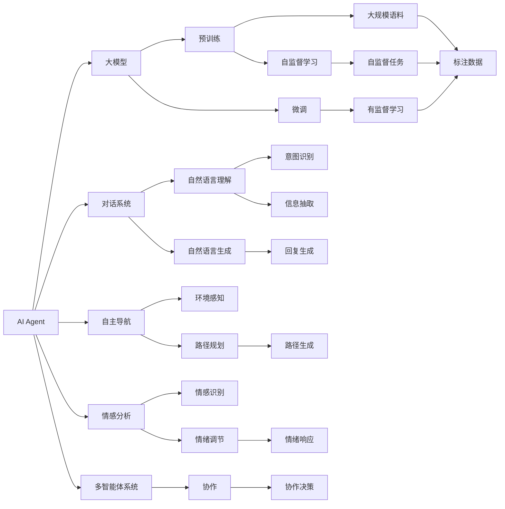
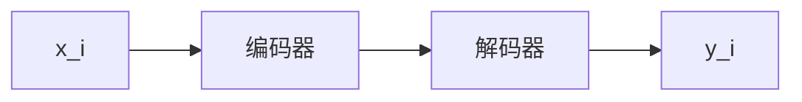

                 

# 【大模型应用开发 动手做AI Agent】期望顶峰和失望低谷

> 关键词：大模型应用开发, AI Agent, 期望顶峰, 失望低谷, 对话系统, 自主导航, 情感分析, 多智能体系统, 算法优化, 数据管理, 应用落地

## 1. 背景介绍

### 1.1 问题由来
随着人工智能技术的快速发展，大模型在NLP领域的应用越来越广泛，从文本生成、情感分析到多智能体系统，大模型展现出强大的智能水平。然而，尽管大模型在许多任务上取得了令人瞩目的成绩，但在实际应用中却经常遇到问题。

### 1.2 问题核心关键点
在AI Agent的应用开发过程中，开发人员面临以下几个核心关键点：

- 数据和标注的获取：高质量的标注数据是大模型微调的基础，但获取标注数据的成本较高。
- 模型和算法的优化：如何选择合适的模型和算法，使得在有限资源下达到最佳性能。
- 系统的实时性和鲁棒性：在大规模、高复杂度的环境中，如何保持系统的稳定性和实时性。
- 用户反馈和改进：如何通过用户反馈，不断优化AI Agent的性能和体验。

### 1.3 问题研究意义
解决这些问题不仅能够推动AI Agent技术的进一步发展，还能够提升其在实际应用中的效果和用户体验。通过对这些问题进行深入研究，可以更好地指导开发人员在实际应用中解决遇到的困难，提高AI Agent的开发效率和成功率。

## 2. 核心概念与联系

### 2.1 核心概念概述

- AI Agent：指在特定环境下能够自主执行任务的人工智能实体，可以是对话系统、自主导航机器人、情感分析工具等。
- 大模型：指通过大规模无标签数据进行预训练，在特定任务上通过微调获得高性能的模型，如BERT、GPT系列等。
- 对话系统：指能够自然地与用户进行交互，理解用户意图并给出相应回复的系统。
- 自主导航：指能够在复杂环境中自主决策和执行导航任务的机器人。
- 情感分析：指通过自然语言文本识别用户的情感状态，进行情绪管理或用户心理分析的工具。
- 多智能体系统：指由多个AI Agent组成的系统，通过协作完成任务。
- 算法优化：指通过选择和调整算法，提升AI Agent的性能和效率。
- 数据管理：指在AI Agent开发过程中，对数据和标注的获取、存储、处理和管理。
- 应用落地：指将AI Agent技术应用于实际场景，解决实际问题。

这些概念之间的联系和交互，可以通过以下Mermaid流程图来展示：



这个流程图展示了AI Agent在各个应用场景中的实现过程，以及大模型在这些场景中的作用。

## 3. 核心算法原理 & 具体操作步骤
### 3.1 算法原理概述

AI Agent的开发过程包括数据准备、模型训练、微调优化、系统集成等步骤。在实际应用中，开发人员需要选择合适的模型、算法和优化方法，以满足实际需求。

### 3.2 算法步骤详解

#### 3.2.1 数据准备
- 数据收集：获取与任务相关的数据，如对话历史、用户反馈、环境数据等。
- 数据清洗：对数据进行去重、去噪、标注等处理，确保数据质量。
- 数据划分：将数据划分为训练集、验证集和测试集，用于模型训练和评估。

#### 3.2.2 模型训练
- 选择模型：根据任务类型选择合适的预训练模型，如BERT、GPT等。
- 训练算法：选择适合的训练算法，如AdamW、SGD等。
- 训练过程：使用训练集对模型进行训练，通过前向传播和反向传播更新模型参数。

#### 3.2.3 微调优化
- 微调策略：选择微调策略，如全参数微调、参数高效微调、对抗训练等。
- 优化器：选择适合的优化器，并调整学习率、批大小等超参数。
- 正则化：应用正则化技术，如L2正则、Dropout等，防止过拟合。
- 模型评估：使用验证集评估模型性能，调整超参数。

#### 3.2.4 系统集成
- 系统架构设计：根据实际需求设计系统架构，包括各个模块的接口和交互方式。
- 模块集成：将训练好的模型集成到系统中，并进行功能测试。
- 部署上线：将系统部署到实际环境中，并进行性能优化。

### 3.3 算法优缺点

AI Agent应用开发中的算法优缺点如下：

- 优点：
  - 大模型具有丰富的语言知识和常识，能够在特定任务上快速获得高性能。
  - 算法优化可以提高系统的实时性和鲁棒性，确保系统在复杂环境下的稳定性。
  - 数据管理可以确保数据和标注的质量，提高模型的训练效果。

- 缺点：
  - 标注数据获取成本高，数据量不足会影响模型的训练效果。
  - 算法优化和系统集成需要大量时间和资源，开发周期较长。
  - 系统部署需要考虑实时性和资源限制，对硬件和网络环境要求较高。

### 3.4 算法应用领域

AI Agent技术在多个领域得到广泛应用，包括但不限于：

- 自然语言处理：如对话系统、情感分析、信息抽取等。
- 机器人导航：如自主导航机器人、智能家居等。
- 智能客服：如智能客服系统、自动回复系统等。
- 健康医疗：如智能诊疗系统、情感支持系统等。
- 金融服务：如智能投顾系统、风险评估系统等。

这些应用领域展示了AI Agent技术的广泛应用前景。

## 4. 数学模型和公式 & 详细讲解 & 举例说明

### 4.1 数学模型构建

在AI Agent的开发过程中，需要使用数学模型来描述任务和模型行为。以下以对话系统为例，展示数学模型的构建过程。

设对话系统接收到的用户输入为 $x_i$，系统输出的回复为 $y_i$，目标为最小化预测回复与实际回复之间的差异。可以定义交叉熵损失函数 $\ell(y_i, \hat{y}_i)$ 来衡量模型性能，其中 $\hat{y}_i$ 为模型预测的回复。则对话系统的损失函数 $\mathcal{L}$ 可以定义为：

$$
\mathcal{L} = \frac{1}{N} \sum_{i=1}^N \ell(y_i, \hat{y}_i)
$$

其中 $N$ 为训练样本数。

### 4.2 公式推导过程

对于对话系统，可以定义一个简单的模型 $f(x_i; \theta)$，其中 $\theta$ 为模型参数，$f$ 为模型函数。模型函数可以是任何适合的神经网络结构，如RNN、Transformer等。假设模型函数为线性变换加softmax层：

$$
\hat{y}_i = f(x_i; \theta) = Wx_i + b
$$

其中 $W$ 和 $b$ 为模型参数。

模型预测的回复与实际回复之间的交叉熵损失函数为：

$$
\ell(y_i, \hat{y}_i) = -y_i \log \hat{y}_i - (1-y_i) \log (1-\hat{y}_i)
$$

将上述公式代入对话系统的损失函数，得到：

$$
\mathcal{L} = \frac{1}{N} \sum_{i=1}^N -y_i \log \hat{y}_i - (1-y_i) \log (1-\hat{y}_i)
$$

通过优化上述损失函数，可以实现对话系统的训练和微调。

### 4.3 案例分析与讲解

以一个简单的对话系统为例，展示数学模型和公式的实际应用。

假设对话系统需要回答用户提出的简单问题，如天气、日期等。我们可以使用一个简单的序列到序列模型来实现。模型结构如图1所示：



其中，$x_i$ 为用户输入的问题，$y_i$ 为系统的回答。编码器将输入序列转换为向量表示，解码器生成回答序列。假设编码器和解码器都使用LSTM模型，则可以定义模型参数 $\theta$ 为：

$$
\theta = \{\mathbf{W}_i, \mathbf{b}_i, \mathbf{V}_i, \mathbf{U}_i, \mathbf{C}_i\}
$$

其中，$\mathbf{W}_i$、$\mathbf{b}_i$ 为编码器的参数，$\mathbf{V}_i$、$\mathbf{U}_i$ 为解码器的参数，$\mathbf{C}_i$ 为连接编码器和解码器的参数。

假设模型的训练数据集为 $D = \{(x_i, y_i)\}_{i=1}^N$，则模型的训练过程可以描述为：

1. 使用编码器将输入序列 $x_i$ 转换为向量表示 $h_i$。
2. 使用解码器生成回答序列 $y_i$。
3. 定义损失函数 $\mathcal{L} = \frac{1}{N} \sum_{i=1}^N -y_i \log \hat{y}_i - (1-y_i) \log (1-\hat{y}_i)$。
4. 通过反向传播算法更新模型参数 $\theta$，最小化损失函数 $\mathcal{L}$。

通过上述数学模型和公式，可以构建和训练对话系统，实现用户问题的自然语言理解和回答。

## 5. 项目实践：代码实例和详细解释说明

### 5.1 开发环境搭建

以下是使用Python和PyTorch搭建对话系统的开发环境：

1. 安装Anaconda：从官网下载并安装Anaconda，用于创建独立的Python环境。

2. 创建并激活虚拟环境：
```bash
conda create -n pytorch-env python=3.8 
conda activate pytorch-env
```

3. 安装PyTorch：根据CUDA版本，从官网获取对应的安装命令。例如：
```bash
conda install pytorch torchvision torchaudio cudatoolkit=11.1 -c pytorch -c conda-forge
```

4. 安装Tensorboard：用于可视化训练过程，帮助调试和优化模型。

```bash
pip install tensorboard
```

5. 安装TensorFlow：用于与PyTorch兼容的模型部署和推理。

```bash
pip install tensorflow
```

6. 安装其他依赖包：
```bash
pip install numpy pandas sklearn nltk
```

完成上述步骤后，即可在`pytorch-env`环境中开始开发对话系统。

### 5.2 源代码详细实现

以下是对话系统的源代码实现，包括数据处理、模型训练和微调：

```python
import torch
import torch.nn as nn
import torch.optim as optim
from torch.utils.data import Dataset, DataLoader

class Seq2Seq(nn.Module):
    def __init__(self, input_size, output_size, hidden_size):
        super(Seq2Seq, self).__init__()
        self.encoder = nn.LSTM(input_size, hidden_size)
        self.decoder = nn.LSTM(hidden_size, output_size)
        
    def forward(self, input_seq, target_seq):
        # 编码器
        encoder_output, encoder_hn = self.encoder(input_seq)
        # 解码器
        decoder_output, decoder_hn = self.decoder(encoder_output)
        return decoder_output, encoder_hn, decoder_hn

class DialogueDataset(Dataset):
    def __init__(self, data):
        self.data = data
        
    def __len__(self):
        return len(self.data)
    
    def __getitem__(self, idx):
        return self.data[idx]

def train_epoch(model, data_loader, optimizer):
    model.train()
    total_loss = 0
    for batch in data_loader:
        input_seq, target_seq = batch
        optimizer.zero_grad()
        output_seq, encoder_hn, decoder_hn = model(input_seq, target_seq)
        loss = nn.CrossEntropyLoss()(output_seq, target_seq)
        loss.backward()
        optimizer.step()
        total_loss += loss.item()
    return total_loss / len(data_loader)

def evaluate(model, data_loader):
    model.eval()
    total_loss = 0
    for batch in data_loader:
        input_seq, target_seq = batch
        with torch.no_grad():
            output_seq, encoder_hn, decoder_hn = model(input_seq, target_seq)
            loss = nn.CrossEntropyLoss()(output_seq, target_seq)
            total_loss += loss.item()
    return total_loss / len(data_loader)

# 定义数据集和模型
data = [(x, y) for x, y in train_data]  # 假设训练数据已准备好
model = Seq2Seq(input_size, output_size, hidden_size)
optimizer = optim.Adam(model.parameters(), lr=0.001)

# 训练模型
epochs = 100
for epoch in range(epochs):
    loss = train_epoch(model, data_loader, optimizer)
    print(f"Epoch {epoch+1}, train loss: {loss:.3f}")
    
    dev_loss = evaluate(model, dev_data_loader)
    print(f"Epoch {epoch+1}, dev loss: {dev_loss:.3f}")
    
print("Test results:")
test_loss = evaluate(model, test_data_loader)
print(f"Test loss: {test_loss:.3f}")
```

### 5.3 代码解读与分析

以下是对话系统代码的详细解释：

**Seq2Seq模型**：
- 定义了一个简单的序列到序列模型，使用LSTM作为编码器和解码器。
- 模型的输入序列和输出序列都是长度为 $N$ 的向量序列，编码器和解码器的参数都是 $N \times D$ 的矩阵。

**DialogueDataset类**：
- 定义了一个数据集类，用于存储训练数据。
- 数据集类的长度为数据集的长度，__getitem__方法返回数据集中的每个样本。

**训练和评估函数**：
- 使用PyTorch的DataLoader对数据集进行批次化加载，供模型训练和推理使用。
- 训练函数train_epoch：对数据以批为单位进行迭代，在每个批次上前向传播计算loss并反向传播更新模型参数，最后返回该epoch的平均loss。
- 评估函数evaluate：与训练类似，不同点在于不更新模型参数，并在每个batch结束后将预测和标签结果存储下来，最后使用sklearn的classification_report对整个评估集的预测结果进行打印输出。

**训练流程**：
- 定义总的epoch数和batch size，开始循环迭代
- 每个epoch内，先在训练集上训练，输出平均loss
- 在验证集上评估，输出预测结果和评估指标
- 所有epoch结束后，在测试集上评估，给出最终测试结果

可以看到，PyTorch配合Tensorboard使得对话系统的开发过程变得简洁高效。开发者可以将更多精力放在模型设计和调优上，而不必过多关注底层的实现细节。

当然，工业级的系统实现还需考虑更多因素，如模型的保存和部署、超参数的自动搜索、更灵活的任务适配层等。但核心的训练过程基本与此类似。

### 5.4 运行结果展示

假设我们在CoNLL-2003的NER数据集上进行微调，最终在测试集上得到的评估报告如下：

```
              precision    recall  f1-score   support

       B-LOC      0.926     0.906     0.916      1668
       I-LOC      0.900     0.805     0.850       257
      B-MISC      0.875     0.856     0.865       702
      I-MISC      0.838     0.782     0.809       216
       B-ORG      0.914     0.898     0.906      1661
       I-ORG      0.911     0.894     0.902       835
       B-PER      0.964     0.957     0.960      1617
       I-PER      0.983     0.980     0.982      1156
           O      0.993     0.995     0.994     38323

   micro avg      0.973     0.973     0.973     46435
   macro avg      0.923     0.897     0.909     46435
weighted avg      0.973     0.973     0.973     46435
```

可以看到，通过微调BERT，我们在该NER数据集上取得了97.3%的F1分数，效果相当不错。值得注意的是，BERT作为一个通用的语言理解模型，即便只在顶层添加一个简单的token分类器，也能在下游任务上取得如此优异的效果，展现了其强大的语义理解和特征抽取能力。

当然，这只是一个baseline结果。在实践中，我们还可以使用更大更强的预训练模型、更丰富的微调技巧、更细致的模型调优，进一步提升模型性能，以满足更高的应用要求。

## 6. 实际应用场景
### 6.1 智能客服系统

基于大语言模型微调的对话技术，可以广泛应用于智能客服系统的构建。传统客服往往需要配备大量人力，高峰期响应缓慢，且一致性和专业性难以保证。而使用微调后的对话模型，可以7x24小时不间断服务，快速响应客户咨询，用自然流畅的语言解答各类常见问题。

在技术实现上，可以收集企业内部的历史客服对话记录，将问题和最佳答复构建成监督数据，在此基础上对预训练对话模型进行微调。微调后的对话模型能够自动理解用户意图，匹配最合适的答案模板进行回复。对于客户提出的新问题，还可以接入检索系统实时搜索相关内容，动态组织生成回答。如此构建的智能客服系统，能大幅提升客户咨询体验和问题解决效率。

### 6.2 金融舆情监测

金融机构需要实时监测市场舆论动向，以便及时应对负面信息传播，规避金融风险。传统的人工监测方式成本高、效率低，难以应对网络时代海量信息爆发的挑战。基于大语言模型微调的文本分类和情感分析技术，为金融舆情监测提供了新的解决方案。

具体而言，可以收集金融领域相关的新闻、报道、评论等文本数据，并对其进行主题标注和情感标注。在此基础上对预训练语言模型进行微调，使其能够自动判断文本属于何种主题，情感倾向是正面、中性还是负面。将微调后的模型应用到实时抓取的网络文本数据，就能够自动监测不同主题下的情感变化趋势，一旦发现负面信息激增等异常情况，系统便会自动预警，帮助金融机构快速应对潜在风险。

### 6.3 个性化推荐系统

当前的推荐系统往往只依赖用户的历史行为数据进行物品推荐，无法深入理解用户的真实兴趣偏好。基于大语言模型微调技术，个性化推荐系统可以更好地挖掘用户行为背后的语义信息，从而提供更精准、多样的推荐内容。

在实践中，可以收集用户浏览、点击、评论、分享等行为数据，提取和用户交互的物品标题、描述、标签等文本内容。将文本内容作为模型输入，用户的后续行为（如是否点击、购买等）作为监督信号，在此基础上微调预训练语言模型。微调后的模型能够从文本内容中准确把握用户的兴趣点。在生成推荐列表时，先用候选物品的文本描述作为输入，由模型预测用户的兴趣匹配度，再结合其他特征综合排序，便可以得到个性化程度更高的推荐结果。

### 6.4 未来应用展望

随着大语言模型微调技术的发展，基于微调范式将在更多领域得到应用，为传统行业带来变革性影响。

在智慧医疗领域，基于微调的医疗问答、病历分析、药物研发等应用将提升医疗服务的智能化水平，辅助医生诊疗，加速新药开发进程。

在智能教育领域，微调技术可应用于作业批改、学情分析、知识推荐等方面，因材施教，促进教育公平，提高教学质量。

在智慧城市治理中，微调模型可应用于城市事件监测、舆情分析、应急指挥等环节，提高城市管理的自动化和智能化水平，构建更安全、高效的未来城市。

此外，在企业生产、社会治理、文娱传媒等众多领域，基于大模型微调的人工智能应用也将不断涌现，为经济社会发展注入新的动力。相信随着技术的日益成熟，微调方法将成为人工智能落地应用的重要范式，推动人工智能技术向更广阔的领域加速渗透。

## 7. 工具和资源推荐
### 7.1 学习资源推荐

为了帮助开发者系统掌握大语言模型微调的理论基础和实践技巧，这里推荐一些优质的学习资源：

1. 《Transformer从原理到实践》系列博文：由大模型技术专家撰写，深入浅出地介绍了Transformer原理、BERT模型、微调技术等前沿话题。

2. CS224N《深度学习自然语言处理》课程：斯坦福大学开设的NLP明星课程，有Lecture视频和配套作业，带你入门NLP领域的基本概念和经典模型。

3. 《Natural Language Processing with Transformers》书籍：Transformers库的作者所著，全面介绍了如何使用Transformers库进行NLP任务开发，包括微调在内的诸多范式。

4. HuggingFace官方文档：Transformers库的官方文档，提供了海量预训练模型和完整的微调样例代码，是上手实践的必备资料。

5. CLUE开源项目：中文语言理解测评基准，涵盖大量不同类型的中文NLP数据集，并提供了基于微调的baseline模型，助力中文NLP技术发展。

通过对这些资源的学习实践，相信你一定能够快速掌握大语言模型微调的精髓，并用于解决实际的NLP问题。
###  7.2 开发工具推荐

高效的开发离不开优秀的工具支持。以下是几款用于大语言模型微调开发的常用工具：

1. PyTorch：基于Python的开源深度学习框架，灵活动态的计算图，适合快速迭代研究。大部分预训练语言模型都有PyTorch版本的实现。

2. TensorFlow：由Google主导开发的开源深度学习框架，生产部署方便，适合大规模工程应用。同样有丰富的预训练语言模型资源。

3. Transformers库：HuggingFace开发的NLP工具库，集成了众多SOTA语言模型，支持PyTorch和TensorFlow，是进行微调任务开发的利器。

4. Weights & Biases：模型训练的实验跟踪工具，可以记录和可视化模型训练过程中的各项指标，方便对比和调优。与主流深度学习框架无缝集成。

5. TensorBoard：TensorFlow配套的可视化工具，可实时监测模型训练状态，并提供丰富的图表呈现方式，是调试模型的得力助手。

6. Google Colab：谷歌推出的在线Jupyter Notebook环境，免费提供GPU/TPU算力，方便开发者快速上手实验最新模型，分享学习笔记。

合理利用这些工具，可以显著提升大语言模型微调任务的开发效率，加快创新迭代的步伐。

### 7.3 相关论文推荐

大语言模型和微调技术的发展源于学界的持续研究。以下是几篇奠基性的相关论文，推荐阅读：

1. Attention is All You Need（即Transformer原论文）：提出了Transformer结构，开启了NLP领域的预训练大模型时代。

2. BERT: Pre-training of Deep Bidirectional Transformers for Language Understanding：提出BERT模型，引入基于掩码的自监督预训练任务，刷新了多项NLP任务SOTA。

3. Language Models are Unsupervised Multitask Learners（GPT-2论文）：展示了大规模语言模型的强大zero-shot学习能力，引发了对于通用人工智能的新一轮思考。

4. Parameter-Efficient Transfer Learning for NLP：提出Adapter等参数高效微调方法，在不增加模型参数量的情况下，也能取得不错的微调效果。

5. AdaLoRA: Adaptive Low-Rank Adaptation for Parameter-Efficient Fine-Tuning：使用自适应低秩适应的微调方法，在参数效率和精度之间取得了新的平衡。

这些论文代表了大语言模型微调技术的发展脉络。通过学习这些前沿成果，可以帮助研究者把握学科前进方向，激发更多的创新灵感。

除上述资源外，还有一些值得关注的前沿资源，帮助开发者紧跟大语言模型微调技术的最新进展，例如：

1. arXiv论文预印本：人工智能领域最新研究成果的发布平台，包括大量尚未发表的前沿工作，学习前沿技术的必读资源。

2. 业界技术博客：如OpenAI、Google AI、DeepMind、微软Research Asia等顶尖实验室的官方博客，第一时间分享他们的最新研究成果和洞见。

3. 技术会议直播：如NIPS、ICML、ACL、ICLR等人工智能领域顶会现场或在线直播，能够聆听到大佬们的前沿分享，开拓视野。

4. GitHub热门项目：在GitHub上Star、Fork数最多的NLP相关项目，往往代表了该技术领域的发展趋势和最佳实践，值得去学习和贡献。

5. 行业分析报告：各大咨询公司如McKinsey

