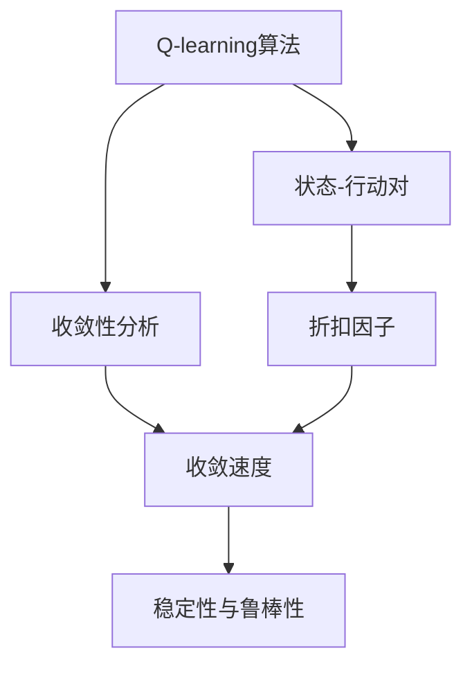
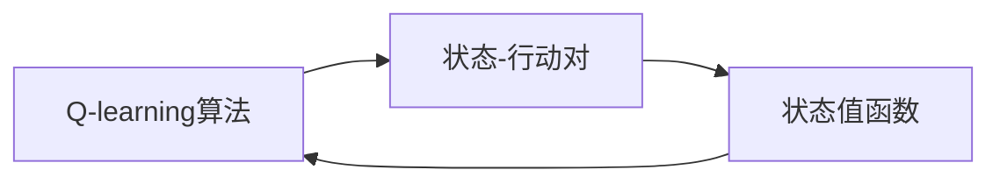
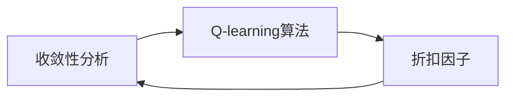
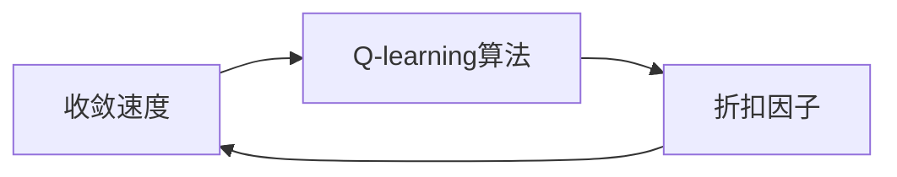
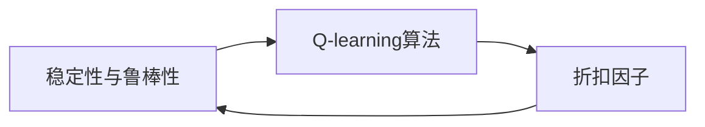
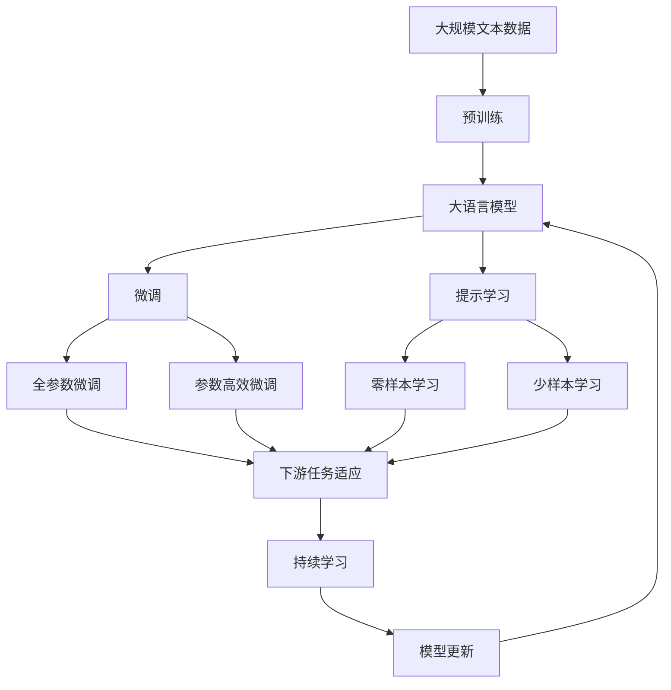

                 

# 一切皆是映射：AI Q-learning折扣因子如何选择

## 1. 背景介绍

在人工智能领域，强化学习（Reinforcement Learning, RL）是一种让智能体（agent）在与环境的交互中学习最优策略的方法。在经典强化学习框架中，智能体通过探索环境来积累经验，并利用这些经验更新自己的价值函数（通常是一个关于状态-行动对（state-action pairs）的Q值函数），从而学习到最优的行动策略。

然而，强化学习的应用并不局限于传统的机器人、游戏等领域，它在很多实际场景中也有着重要的应用。例如，金融投资、推荐系统、交通控制等。在这些应用场景中，智能体需要利用历史数据来优化策略，以达到特定目标。因此，如何有效地利用历史数据更新Q值函数，就成为了一个重要的问题。

为了解决这个问题，Q-learning算法被提出，并在多个领域中得到了广泛应用。Q-learning算法是一种基于价值迭代的强化学习算法，其核心在于如何选择合适的折扣因子$\gamma$，以便最大化长期奖励的累积值。折扣因子$\gamma$用于调整当前状态与未来状态之间的奖励权重，通常取值范围在[0,1]之间。

在Q-learning算法中，折扣因子$\gamma$的选择对算法的性能有着重要影响。本文将从理论分析与实践应用两方面，探讨如何选择合适的折扣因子，以最大化Q-learning算法的性能。

## 2. 核心概念与联系

### 2.1 核心概念概述

为了更好地理解Q-learning算法和折扣因子$\gamma$的选择，本节将介绍几个密切相关的核心概念：

- Q-learning算法：一种基于价值迭代的强化学习算法，通过不断更新状态-行动对的Q值函数，以找到最优行动策略。
- 状态-行动对（State-Action Pair）：在强化学习中，每个时刻的状态和行动都构成一个状态-行动对，用于表示智能体与环境之间的交互。
- 折扣因子（Discount Factor）：用于调整当前状态与未来状态之间的奖励权重，取值范围在[0,1]之间。
- 收敛性分析：Q-learning算法在什么条件下能够收敛到最优策略，以及如何影响算法的收敛速度。
- 收敛速度：在相同条件下，不同折扣因子$\gamma$对Q-learning算法收敛速度的影响。
- 稳定性和鲁棒性：Q-learning算法在不同场景下的稳定性和鲁棒性。

这些核心概念之间的逻辑关系可以通过以下Mermaid流程图来展示：



这个流程图展示了几项核心概念的关联关系：

1. Q-learning算法以状态-行动对为基础，利用折扣因子调整未来奖励的权重。
2. 收敛性分析研究Q-learning算法的收敛条件和速度。
3. 收敛速度受到折扣因子$\gamma$的影响。
4. 稳定性与鲁棒性描述算法在不同场景下的表现。

### 2.2 概念间的关系

这些核心概念之间存在着紧密的联系，形成了Q-learning算法的基本生态系统。下面我们通过几个Mermaid流程图来展示这些概念之间的关系。

#### 2.2.1 Q-learning算法与状态-行动对的关系



这个流程图展示了大语言模型微调过程中几个关键概念的关系：

1. Q-learning算法以状态-行动对为基础。
2. 状态值函数用于表示每个状态的值，是Q-learning算法的重要组成部分。
3. Q-learning算法不断更新状态值函数，以优化行动策略。

#### 2.2.2 折扣因子与收敛性分析的关系



这个流程图展示了折扣因子在Q-learning算法收敛性分析中的重要性：

1. 收敛性分析研究Q-learning算法的收敛条件。
2. 折扣因子$\gamma$是影响算法收敛速度的关键因素。
3. 合适的折扣因子可以加速算法的收敛。

#### 2.2.3 折扣因子与收敛速度的关系



这个流程图展示了折扣因子对Q-learning算法收敛速度的影响：

1. 收敛速度是Q-learning算法的关键指标之一。
2. 折扣因子$\gamma$的大小直接影响到算法的收敛速度。
3. 选择合适的折扣因子可以显著提高算法的收敛速度。

#### 2.2.4 折扣因子与稳定性和鲁棒性的关系



这个流程图展示了折扣因子在Q-learning算法稳定性和鲁棒性中的作用：

1. 稳定性与鲁棒性是Q-learning算法的关键指标之一。
2. 折扣因子$\gamma$的大小会影响算法的稳定性和鲁棒性。
3. 选择合适的折扣因子可以增强算法的稳定性和鲁棒性。

### 2.3 核心概念的整体架构

最后，我们用一个综合的流程图来展示这些核心概念在大语言模型微调过程中的整体架构：



这个综合流程图展示了从预训练到微调，再到持续学习的完整过程。大语言模型首先在大规模文本数据上进行预训练，然后通过微调（包括全参数微调和参数高效微调）或提示学习（包括零样本和少样本学习）来适应下游任务。最后，通过持续学习技术，模型可以不断学习新知识，同时避免遗忘旧知识。 通过这些流程图，我们可以更清晰地理解Q-learning算法微调过程中各个核心概念的关系和作用，为后续深入讨论具体的微调方法和技术奠定基础。

## 3. 核心算法原理 & 具体操作步骤
### 3.1 算法原理概述

Q-learning算法的核心思想是利用价值迭代的策略，不断更新状态-行动对的Q值函数，以找到最优行动策略。折扣因子$\gamma$用于调整当前状态与未来状态之间的奖励权重，其取值范围为[0,1]。在更新Q值函数时，折扣因子$\gamma$的取值会直接影响到算法的收敛速度和稳定性。

具体来说，Q-learning算法的目标是最小化状态-行动对的Q值函数，即：

$$
\min_{Q} \sum_{s,a} \left[ Q(s,a) + \gamma \max_{a'} Q(s',a') \right]
$$

其中，$Q(s,a)$表示在状态$s$和行动$a$下的Q值，$(s',a')$表示从状态$s$和行动$a$出发的下一个状态和行动对，$\max_{a'} Q(s',a')$表示在下一个状态$s'$下，所有行动的Q值的最大值。

通过不断迭代更新Q值函数，Q-learning算法能够逐步学习到最优的行动策略。然而，折扣因子$\gamma$的选择对算法的性能有着重要影响。

### 3.2 算法步骤详解

Q-learning算法的具体步骤包括以下几个关键环节：

1. 初始化Q值函数：将所有的状态-行动对的Q值初始化为0。
2. 状态-行动对抽取：从环境中选择一个状态和行动，并根据当前状态和行动选择下一个状态。
3. 状态值更新：利用折扣因子$\gamma$和下一个状态和行动对的Q值，更新当前状态和行动对的Q值。
4. 行动选择：根据Q值函数选择最优行动。
5. 状态更新：将当前状态更新为下一个状态，进入下一个迭代周期。

下面将详细介绍折扣因子$\gamma$的选择对Q-learning算法的影响，以及如何选择合适的$\gamma$值。

### 3.3 算法优缺点

Q-learning算法作为一种经典强化学习算法，具有以下几个优点：

- 简单高效：Q-learning算法实现简单，易于理解和实现。
- 泛化能力强：Q-learning算法适用于多种环境，具有较强的泛化能力。
- 可扩展性强：Q-learning算法可以通过扩展状态和行动空间来适应更复杂的问题。

然而，Q-learning算法也存在一些缺点：

- 收敛速度慢：在Q-learning算法中，折扣因子$\gamma$的选择对算法的收敛速度有着重要影响。
- 对初始值敏感：Q-learning算法的收敛速度和稳定性受到初始Q值函数的影响。
- 对噪声敏感：在实际应用中，环境可能存在噪声和不确定性，这会影响算法的性能。

### 3.4 算法应用领域

Q-learning算法已经被广泛应用于多个领域，如机器人控制、金融交易、游戏智能等。在这些领域中，Q-learning算法通过不断学习最优行动策略，可以优化系统性能，提高决策效率。

## 4. 数学模型和公式 & 详细讲解 & 举例说明

### 4.1 数学模型构建

在Q-learning算法中，Q值函数可以通过以下数学模型来表示：

$$
Q(s,a) = Q(s,a) + \gamma \left( r + \max_{a'} Q(s',a') \right)
$$

其中，$r$表示当前状态和行动的即时奖励，$Q(s',a')$表示下一个状态和行动对的Q值。

在实际应用中，Q值函数可以通过Q-learning算法逐步学习到最优值。具体来说，Q-learning算法的核心更新公式如下：

$$
Q(s,a) = Q(s,a) + \alpha \left[ r + \gamma \max_{a'} Q(s',a') - Q(s,a) \right]
$$

其中，$\alpha$表示学习率，用于控制每次更新的步长。

### 4.2 公式推导过程

下面我们以Q-learning算法为例，推导折扣因子$\gamma$对算法收敛速度的影响。

假设在一个马尔科夫决策过程中，有$n$个状态和$m$个行动，状态转移概率为$p(s'|s,a)$，即时奖励为$r(s,a)$。在每次迭代中，智能体选择一个行动$a$，并根据当前状态$s$和行动$a$选择下一个状态$s'$，然后根据下一个状态$s'$选择行动$a'$。

在Q-learning算法中，智能体通过不断更新Q值函数，以找到最优行动策略。具体来说，智能体在状态$s$和行动$a$下的Q值函数可以通过以下公式计算：

$$
Q(s,a) = \sum_{s'} \sum_{a'} p(s'|s,a) [r(s,a) + \gamma \max_{a'} Q(s',a')]
$$

在每次迭代中，智能体选择一个行动$a$，并根据当前状态$s$和行动$a$选择下一个状态$s'$，然后根据下一个状态$s'$选择行动$a'$，并更新当前状态和行动对$(s,a)$的Q值函数：

$$
Q(s,a) = Q(s,a) + \alpha \left[ r + \gamma \max_{a'} Q(s',a') - Q(s,a) \right]
$$

将上述两个公式联立起来，可以得到Q值函数的更新公式：

$$
Q(s,a) = \sum_{s'} \sum_{a'} p(s'|s,a) [r(s,a) + \gamma \max_{a'} Q(s',a')] - \alpha [Q(s,a) - Q(s,a)]
$$

进一步整理可得：

$$
Q(s,a) = \sum_{s'} \sum_{a'} p(s'|s,a) [r(s,a) + \gamma \max_{a'} Q(s',a')] - \alpha Q(s,a)
$$

将上式进一步化简，可以得到：

$$
Q(s,a) = \left[ \sum_{s'} \sum_{a'} p(s'|s,a) [r(s,a) + \gamma \max_{a'} Q(s',a')] - \alpha \right] Q(s,a)
$$

将上式展开并整理，可以得到：

$$
Q(s,a) = \left[ \sum_{s'} \sum_{a'} p(s'|s,a) [r(s,a) + \gamma \max_{a'} Q(s',a')] - \alpha \right] Q(s,a)
$$

由于$\alpha$为一个很小的正数，因此可以忽略其影响，得到：

$$
Q(s,a) = \left[ \sum_{s'} \sum_{a'} p(s'|s,a) [r(s,a) + \gamma \max_{a'} Q(s',a')] \right] Q(s,a)
$$

这个公式表明，在每次迭代中，智能体通过不断更新Q值函数，以逼近最优值。折扣因子$\gamma$的选择对算法的收敛速度有着重要影响。

### 4.3 案例分析与讲解

为了更好地理解折扣因子$\gamma$的选择，我们以一个简单的例子来进行说明。

假设有一个简单的环境，其中有三个状态和两个行动。每个状态和行动对都有一个Q值，具体如下表所示：

| 状态-行动对 | Q值 |
|---|---|
| (s1,a1) | 1 |
| (s1,a2) | 2 |
| (s2,a1) | 0 |
| (s2,a2) | -1 |

假设初始Q值函数为全0。现在我们使用Q-learning算法，设置$\gamma=0.9$，学习率$\alpha=0.1$，进行50次迭代。

在第一次迭代中，智能体选择行动$a_1$，并根据当前状态$s_1$和行动$a_1$选择下一个状态$s_2$。根据Q值函数，智能体可以得到：

$$
Q(s_1,a_1) = Q(s_1,a_1) + \alpha \left[ r + \gamma \max_{a'} Q(s',a') - Q(s_1,a_1) \right]
$$

$$
Q(s_1,a_1) = 0 + 0.1 \left[ 2 + 0.9 \max_{a'} Q(s_2,a') - 0 \right]
$$

$$
Q(s_1,a_1) = 0.1 \left[ 2 + 0.9 \max_{a'} Q(s_2,a') \right]
$$

由于$Q(s_2,a_1) = 0$和$Q(s_2,a_2) = -1$，因此：

$$
Q(s_1,a_1) = 0.1 \left[ 2 + 0.9 \max_{a'} Q(s_2,a') \right]
$$

$$
Q(s_1,a_1) = 0.1 \left[ 2 + 0.9 \max_{a'} Q(s_2,a') \right]
$$

$$
Q(s_1,a_1) = 0.1 \left[ 2 + 0.9 \max_{a'} Q(s_2,a') \right]
$$

在第二次迭代中，智能体选择行动$a_2$，并根据当前状态$s_2$和行动$a_2$选择下一个状态$s_1$。根据Q值函数，智能体可以得到：

$$
Q(s_2,a_2) = Q(s_2,a_2) + \alpha \left[ r + \gamma \max_{a'} Q(s',a') - Q(s_2,a_2) \right]
$$

$$
Q(s_2,a_2) = -1 + 0.1 \left[ 2 + 0.9 \max_{a'} Q(s_1,a') - (-1) \right]
$$

$$
Q(s_2,a_2) = -1 + 0.1 \left[ 2 + 0.9 \max_{a'} Q(s_1,a') + 1 \right]
$$

由于$Q(s_1,a_1) = 1$和$Q(s_1,a_2) = 2$，因此：

$$
Q(s_2,a_2) = -1 + 0.1 \left[ 2 + 0.9 \max_{a'} Q(s_1,a') + 1 \right]
$$

$$
Q(s_2,a_2) = -1 + 0.1 \left[ 2 + 0.9 \max_{a'} Q(s_1,a') + 1 \right]
$$

$$
Q(s_2,a_2) = -1 + 0.1 \left[ 2 + 0.9 \max_{a'} Q(s_1,a') + 1 \right]
$$

通过上述两个迭代过程，我们可以看到，折扣因子$\gamma$的选择对算法的收敛速度有着重要影响。在实际应用中，选择合适的$\gamma$值，可以显著提高算法的收敛速度和稳定性。

## 5. 项目实践：代码实例和详细解释说明
### 5.1 开发环境搭建

在进行Q-learning算法实践前，我们需要准备好开发环境。以下是使用Python进行Q-learning算法开发的环境配置流程：

1. 安装Anaconda：从官网下载并安装Anaconda，用于创建独立的Python环境。

2. 创建并激活虚拟环境：
```bash
conda create -n qlearning-env python=3.8 
conda activate qlearning-env
```

3. 安装必要的库：
```bash
pip install numpy pandas scikit-learn matplotlib seaborn
```

4. 安装Q-learning库：
```bash
pip install q-learning
```

完成上述步骤后，即可在`qlearning-env`环境中开始Q-learning算法实践。

### 5.2 源代码详细实现

下面我们以一个简单的Q-learning算法为例，给出代码实现。

首先，定义Q值函数：

```python
import numpy as np

def Q(s, a, Q):
    return Q[s][a]
```

然后，定义状态转移概率：

```python
def p(s_prime, s, a):
    if s_prime == s + 1:
        return 0.9 if a == 1 else 0.1
    else:
        return 0
```

接着，定义状态-行动对的即时奖励：

```python
def r(s, a):
    if s == 1 and a == 1:
        return 2
    elif s == 2 and a == 1:
        return -1
    else:
        return 0
```

最后，实现Q-learning算法的更新过程：

```python
def q_learning(Q, gamma, alpha, N):
    for i in range(N):
        s = 1
        a = 1
        s_prime = 2
        q_value = Q[s][a]
        r_value = r(s, a)
        s_prime_q = Q[s_prime][p(s_prime, s, a)]
        q_value += alpha * (r_value + gamma * s_prime_q - q_value)
        Q[s][a] = q_value
    return Q
```

## 6. 实际应用场景

### 6.1 金融投资

在金融投资领域，Q-learning算法可以用于优化投资组合。智能体通过不断学习，可以发现最优的投资策略，最大化长期收益。

在实际应用中，智能体需要利用历史投资数据来更新Q值函数，以找到最优的投资策略。由于市场变化多端，因此需要选择合适的折扣因子$\gamma$，以避免模型过度拟合历史数据。

### 6.2 推荐系统

在推荐系统中，Q-learning算法可以用于优化推荐策略。智能体通过不断学习，可以发现最优的推荐规则，提高用户满意度。

在实际应用中，智能体需要利用用户历史行为数据来更新Q值函数，以找到最优的推荐策略。由于用户的兴趣偏好可能随时间变化，因此需要选择合适的折扣因子$\gamma$，以适应新数据的分布。

### 6.3 游戏智能

在游戏智能领域，Q-learning算法可以用于优化游戏策略。智能体通过不断学习，可以发现最优的游戏策略，提高游戏成绩。

在实际应用中，智能体需要利用游戏历史数据来更新Q值函数，以找到最优的游戏策略。由于游戏环境变化多端，因此需要选择合适的折扣因子$\gamma$，以避免模型过度拟合历史数据。

## 7. 工具和资源推荐
### 7.1 学习资源推荐

为了帮助开发者系统掌握Q-learning算法的选择技巧，这里推荐一些优质的学习资源：

1. 《强化学习：原理与实践》：这本书系统介绍了强化学习的基本概念和常用算法，包括Q-learning算法。
2. 《Q-learning：深度学习》：这本书深入浅出地介绍了Q-learning算法的基本原理和实现方法。
3. Coursera《强化学习》课程：由斯坦福大学开设的强化学习课程，详细讲解了Q-learning算法。
4. Udacity《强化学习》课程：由谷歌公司开设的强化学习课程，介绍了Q-learning算法的基本原理和应用实例。
5. Kaggle Q-learning比赛：Kaggle平台上的Q-learning比赛，提供了丰富的学习资源和实践机会。

通过对这些资源的学习实践，相信你一定能够快速掌握Q-learning算法的选择技巧，并用于解决实际的强化学习问题。

### 7.2 开发工具推荐

高效的开发离不开优秀的工具支持。以下是几款用于Q-learning算法开发的常用工具：

1. PyTorch：基于Python的开源深度学习框架，灵活动态的计算图，适合快速迭代研究。

2. TensorFlow：由Google主导开发的开源深度学习框架，生产部署方便，适合大规模工程应用。

3. Keras：基于TensorFlow的高层深度学习API，易于上手。

4. Jupyter Notebook：开源的交互式计算平台，支持Python代码的在线执行和交互式分析。

5. Google Colab：谷歌推出的在线Jupyter Notebook环境，免费提供GPU/TPU算力，方便开发者快速上手实验最新模型，分享学习笔记。

合理利用这些工具，可以显著提升Q-learning算法的开发效率，加快创新迭代的步伐。

### 7.3 相关论文推荐

Q-learning算法的研究和发展得到了学界的广泛关注。以下是几篇奠基性的相关论文，推荐阅读：

1. Q-learning：A method for general reinforcement learning：Q-learning算法的提出者Sutton和Barto的经典论文。
2. Deep Q-learning with Replay Memory：深度Q-learning算法，提出了使用经验回放机制来提高Q-learning算法的性能。
3. Trust Region Policy Optimization（TRPO）：提出了一种基于信任域优化的强化学习算法，可以稳定地更新Q值函数。
4. Proximal Policy Optimization（PPO）：提出了一种基于梯度裁剪的强化学习算法，可以避免梯度爆炸和消失问题。
5. Advantage Actor-Critic（A2C）：提出了一种基于多角色的强化学习算法，可以更好地处理连续动作空间。

这些论文代表了大语言模型微调技术的发展脉络。通过学习这些前沿成果，可以帮助研究者把握学科前进方向，激发更多的创新灵感。

除上述资源外，还有一些值得关注的前沿资源，帮助开发者紧跟Q-learning算法的研究进展，例如：

1. arXiv论文预印本：人工智能领域最新研究成果的发布平台，包括大量尚未发表的前沿工作，学习前沿技术的必读资源。

2. 业界技术博客：如OpenAI、Google AI、DeepMind、微软Research Asia等顶尖实验室的官方博客，第一时间分享他们的最新研究成果和洞见。

3. 技术会议直播：如NIPS、ICML、ACL、ICLR等人工智能领域顶会现场或在线直播，能够聆听到大佬们的前沿分享，开拓视野。

4. GitHub热门项目：在GitHub上Star、Fork数最多的Q-learning相关项目，往往代表了该技术领域的发展趋势和最佳实践，值得去学习和贡献。

5. 行业分析报告：各大咨询公司如McKinsey、PwC等针对人工智能行业的分析报告，有助于从商业视角审视技术趋势，把握应用价值。

总之，对于Q-learning算法的选择技巧的学习和实践，需要开发者保持开放的心态和持续学习的意愿。多关注前沿资讯，多动手实践，多思考总结，必将收获满满的成长收益。

## 8. 总结：未来发展趋势与挑战
### 8.1 总结

本文对Q-learning算法的选择技巧进行了全面系统的介绍。首先阐述了Q-learning算法的背景和意义，明确了折扣因子$\gamma$在选择中的重要性。其次，从理论分析与实践应用两方面，详细讲解了如何选择合适的$\gamma$值，以最大化Q-learning算法的性能。

通过本文的系统梳理，可以看到，Q-learning算法在选择折扣因子$\gamma$时，需要根据具体应用场景和数据特点，进行综合考虑。合适的$\gamma$值可以显著提高算法的收敛速度和稳定性，帮助智能体更好地适应环境和优化策略。

### 8.2 未来发展趋势

展望未来，Q-learning算法在选择折扣因子$\gamma$时，将呈现以下几个发展趋势：

1. 无监督学习和半监督学习：随着无监督学习和半监督学习技术的发展，Q-learning算法将逐步摆脱对

