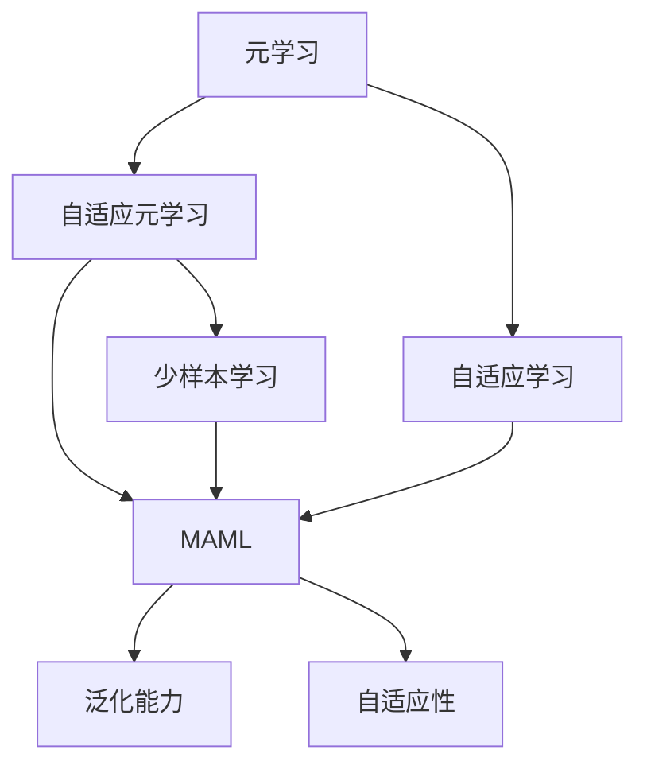
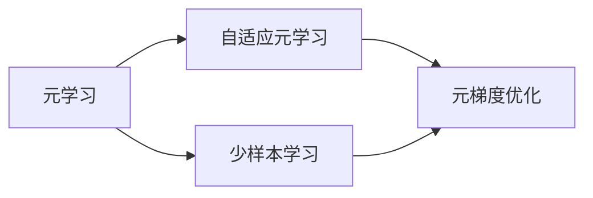
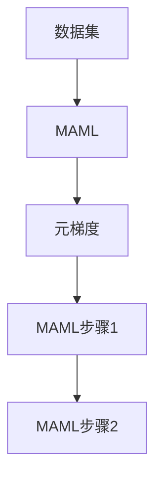
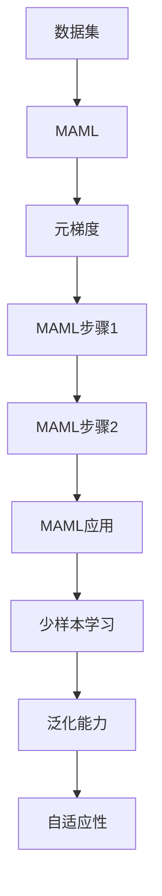

                 

# 一切皆是映射：MAML算法原理与应用

> 关键词：MAML, 元学习, 自适应, 通用学习, 迁移学习, 泛化能力

## 1. 背景介绍

### 1.1 问题由来
在机器学习领域，传统模型往往依赖大量数据和手动调参，训练过程耗时长、易过拟合，且难以泛化到新场景。如何训练出具有通用泛化能力的模型，成为研究人员和工程师关注的焦点。

元学习(Meta-Learning)技术正是在这一背景下应运而生，它旨在通过少量数据或少样本学习，使模型快速适应新任务，提升模型泛化能力。元学习的研究主要分为两大方向：自适应元学习和元学习算法，其中自适应元学习通过优化模型参数，实现对新任务的快速适应；而元学习算法则通过直接优化学习过程，提升模型的泛化性能。

本文将深入介绍自适应元学习中的代表性算法——MAML（模型平均增量学习），并阐述其原理与应用。MAML算法通过将模型参数看作向量空间中的映射函数，进行迭代更新，实现快速适应新任务的目标。

### 1.2 问题核心关键点
MAML算法是一种自适应元学习算法，其核心思想是：通过在一个或多个训练集上预先优化模型的元参数（元梯度），然后基于这些元梯度在新任务上对模型参数进行快速适应。

MAML算法主要解决以下几个核心问题：

- **泛化能力**：通过优化元梯度，模型可以适应新的数据分布，提升泛化能力。
- **自适应性**：模型可以根据新任务的特点，动态调整模型参数，提升适应性。
- **少样本学习**：通过元梯度对模型参数的初始化，模型能够在少样本情况下快速适应新任务。
- **迁移学习**：MAML可以应用于跨领域迁移学习，提升模型在新领域上的表现。

这些核心问题构成了MAML算法的研究焦点，也决定了其在实际应用中的重要性和适用性。

### 1.3 问题研究意义
MAML算法的研究和应用对于提升机器学习的泛化能力和自适应性具有重要意义：

1. **提升泛化性能**：通过元梯度优化，MAML算法可以提升模型对新数据的泛化性能，减少数据量和手动调参的需求。
2. **实现快速适应**：MAML算法通过元梯度初始化，在新任务上可以快速收敛，提升模型适应新场景的能力。
3. **推动迁移学习发展**：MAML算法能够实现跨领域迁移学习，加速模型在不同领域间的应用和推广。
4. **降低开发成本**：通过元学习技术，MAML算法可以降低模型开发和部署的复杂度，提升开发效率。

MAML算法作为一种元学习技术，正在成为机器学习领域的前沿研究方向，其理论研究和实际应用都具有重要的价值。

## 2. 核心概念与联系

### 2.1 核心概念概述

为更好地理解MAML算法，我们首先需要介绍几个密切相关的核心概念：

- **元学习(Meta-Learning)**：通过少量样本或数据，快速适应新任务的机器学习技术。
- **自适应元学习(Adaptive Meta-Learning)**：通过优化模型参数，使模型能够动态适应新任务的技术。
- **元梯度(Meta-Gradient)**：在新任务上对模型参数进行微调的梯度。
- **模型平均增量学习(MAML)**：一种自适应元学习算法，通过预训练元梯度，对模型参数进行快速适应。
- **泛化能力(Generalization)**：模型对新数据分布的适应能力。
- **自适应性(Adaptivity)**：模型根据新任务的特点，动态调整参数的能力。

这些概念之间的逻辑关系可以通过以下Mermaid流程图来展示：



这个流程图展示了大语言模型微调过程中各个核心概念的关系：

1. 元学习通过少量样本快速适应新任务。
2. 自适应元学习通过优化模型参数，提升模型的适应性。
3. MAML作为自适应元学习的代表，通过预训练元梯度，实现快速适应新任务。
4. 泛化能力指模型对新数据的适应能力。
5. 自适应性指模型根据新任务的特点动态调整参数的能力。

### 2.2 概念间的关系

这些核心概念之间存在着紧密的联系，形成了自适应元学习的完整生态系统。下面我们通过几个Mermaid流程图来展示这些概念之间的关系。

#### 2.2.1 元学习和自适应元学习的联系



这个流程图展示了元学习和自适应元学习之间的联系：

1. 元学习通过少量样本快速适应新任务。
2. 自适应元学习通过优化模型参数，提升模型的适应性。
3. 元梯度优化是自适应元学习的重要组成部分，通过预训练元梯度，提升模型的泛化能力和自适应性。

#### 2.2.2 MAML的核心步骤



这个流程图展示了MAML算法的核心步骤：

1. 数据集被用来预训练元梯度。
2. 元梯度在新任务上对模型参数进行初始化。
3. 模型参数通过元梯度进行微调，实现快速适应新任务。

#### 2.2.3 MAML的应用场景


这个流程图展示了MAML算法在不同应用场景中的应用：

1. MAML算法通过预训练元梯度，提升模型对新任务的泛化能力。
2. 元梯度优化提升模型的自适应性，使其能够动态适应新任务。
3. MAML算法在少样本学习场景下表现优异，可以在有限数据条件下快速适应新任务。
4. MAML算法适用于跨领域迁移学习，提升模型在新领域上的表现。

### 2.3 核心概念的整体架构

最后，我们用一个综合的流程图来展示这些核心概念在大语言模型微调过程中的整体架构：



这个综合流程图展示了从数据预训练到模型微调的完整过程。MAML算法通过预训练元梯度，实现快速适应新任务的目标。在少样本学习场景下，元梯度优化提升模型的泛化能力和自适应性，使模型在有限数据条件下也能快速适应新任务。通过MAML算法，模型可以在不同领域间进行迁移学习，提升新领域上的表现。

## 3. 核心算法原理 & 具体操作步骤
### 3.1 算法原理概述

MAML算法的核心思想是：通过预训练元梯度，对模型参数进行快速适应。其基本原理如下：

1. 选择一个或多个训练集，并在每个训练集上预训练一个元梯度。
2. 在新任务上，通过元梯度对模型参数进行初始化。
3. 对模型参数进行微调，使得模型在新任务上的表现达到最优。

MAML算法的核心公式为：

$$
\theta^* = \mathop{\arg\min}_{\theta} \sum_{i=1}^N \frac{1}{2}\|F_i(\theta) - y_i\|^2
$$

其中 $\theta$ 为模型参数，$F_i$ 为任务 $i$ 的损失函数，$y_i$ 为任务 $i$ 的标签。

在实践中，我们通常采用梯度下降法对上述公式进行求解。具体步骤为：

1. 选择训练集 $D$，在每个样本 $(x_i, y_i)$ 上计算元梯度 $g_i = \frac{\partial L_i}{\partial \theta}$。
2. 在新任务上，使用预训练的元梯度 $g_i$ 对模型参数 $\theta$ 进行初始化，得到初始参数 $\theta_0$。
3. 在新任务上，通过梯度下降法对初始参数 $\theta_0$ 进行微调，得到最终的模型参数 $\theta^*$。

### 3.2 算法步骤详解

下面是MAML算法的主要步骤详解：

#### 3.2.1 数据预训练

数据预训练是MAML算法的第一步，其目的是在多个训练集上预训练元梯度。具体步骤如下：

1. 选择训练集 $D=\{(x_i, y_i)\}_{i=1}^N$。
2. 在每个样本 $(x_i, y_i)$ 上计算元梯度 $g_i = \frac{\partial L_i}{\partial \theta}$，其中 $L_i$ 为任务 $i$ 的损失函数。
3. 将元梯度 $g_i$ 存储下来，作为模型在新任务上的初始化参数。

#### 3.2.2 模型初始化

在新任务上，使用预训练的元梯度对模型参数进行初始化。具体步骤如下：

1. 选择新任务上的测试集 $D_{test}=\{(x_i, y_i)\}_{i=1}^N$。
2. 使用预训练的元梯度 $g_i$ 对模型参数 $\theta$ 进行初始化，得到初始参数 $\theta_0$。
3. 将初始参数 $\theta_0$ 作为模型的初始状态。

#### 3.2.3 模型微调

在新任务上，对模型参数进行微调，得到最终的模型参数 $\theta^*$。具体步骤如下：

1. 在测试集 $D_{test}$ 上计算模型在当前参数 $\theta_0$ 下的损失 $L_{test}(\theta_0)$。
2. 使用梯度下降法对模型参数 $\theta_0$ 进行微调，得到最终的模型参数 $\theta^*$。
3. 将最终的模型参数 $\theta^*$ 用于实际任务。

#### 3.2.4 重复步骤

通过上述三个步骤，可以完成对新任务的适应。为了进一步提升模型的泛化能力和自适应性，可以重复执行上述步骤，直到模型在新任务上的表现达到最优。

### 3.3 算法优缺点

MAML算法作为一种自适应元学习算法，具有以下优点：

1. **快速适应新任务**：通过预训练元梯度，MAML算法可以在新任务上快速收敛，提升模型适应性。
2. **泛化能力强**：元梯度优化提升模型的泛化能力，使其能够适应不同的数据分布。
3. **参数高效**：元梯度优化通常只涉及少量参数，避免了在大规模数据上手动调参的麻烦。
4. **算法简单**：MAML算法实现简单，易于理解和使用。

但MAML算法也存在一些缺点：

1. **对初始化敏感**：MAML算法的性能对元梯度的初始化策略和数据预训练方式敏感，需要仔细选择。
2. **计算复杂度高**：MAML算法需要预训练元梯度，计算复杂度较高，可能不适合大规模数据集。
3. **收敛速度慢**：MAML算法在微调过程中可能需要较长时间才能收敛，影响实际应用。
4. **模型复杂度高**：MAML算法需要预训练元梯度，模型复杂度较高，可能影响模型的实时性。

这些缺点在实际应用中需要注意，通过改进算法实现和优化参数选择，可以最大限度地发挥MAML算法的优势，克服其不足。

### 3.4 算法应用领域

MAML算法具有广泛的适用性，以下是一些主要的应用领域：

1. **少样本学习**：MAML算法在少样本学习中表现优异，可以在有限数据条件下快速适应新任务。
2. **迁移学习**：MAML算法适用于跨领域迁移学习，提升模型在新领域上的表现。
3. **自适应学习**：MAML算法可以用于动态适应新任务，提升模型的自适应性。
4. **超参数优化**：MAML算法可以通过预训练元梯度，优化超参数，提升模型的泛化性能。
5. **机器学习系统**：MAML算法可以应用于机器学习系统的调优，提升系统的泛化能力和自适应性。

这些应用领域展示了MAML算法的广泛应用前景，其在实际问题解决中具有重要的价值。

## 4. 数学模型和公式 & 详细讲解  
### 4.1 数学模型构建

本节将使用数学语言对MAML算法进行更加严格的刻画。

记模型参数为 $\theta$，训练集为 $D=\{(x_i, y_i)\}_{i=1}^N$。假设模型在每个样本上的元梯度为 $g_i = \frac{\partial L_i}{\partial \theta}$。

MAML算法的数学模型可以表示为：

$$
\theta^* = \mathop{\arg\min}_{\theta} \sum_{i=1}^N \frac{1}{2}\|F_i(\theta) - y_i\|^2
$$

其中 $F_i(\theta)$ 为任务 $i$ 的预测函数，$y_i$ 为任务 $i$ 的标签。

### 4.2 公式推导过程

下面对MAML算法的核心公式进行推导：

1. 在训练集 $D=\{(x_i, y_i)\}_{i=1}^N$ 上预训练元梯度 $g_i = \frac{\partial L_i}{\partial \theta}$，其中 $L_i$ 为任务 $i$ 的损失函数。
2. 在新任务上，使用预训练的元梯度对模型参数 $\theta$ 进行初始化，得到初始参数 $\theta_0$。
3. 在新任务上，通过梯度下降法对初始参数 $\theta_0$ 进行微调，得到最终的模型参数 $\theta^*$。

具体推导如下：

$$
\theta^* = \mathop{\arg\min}_{\theta} \sum_{i=1}^N \frac{1}{2}\|F_i(\theta) - y_i\|^2
$$

将 $F_i(\theta)$ 展开：

$$
\theta^* = \mathop{\arg\min}_{\theta} \sum_{i=1}^N \frac{1}{2}[\|f_i(\theta_0) + g_i\theta - y_i\|^2]
$$

其中 $f_i(\theta_0)$ 为初始化函数，$\theta_0$ 为初始参数。

对上式进行化简：

$$
\theta^* = \mathop{\arg\min}_{\theta} \sum_{i=1}^N \frac{1}{2}[\|f_i(\theta_0) - y_i\|^2 + g_i\theta^T(f_i(\theta_0) - y_i) + \frac{1}{2}g_i^Tg_i\theta^2]
$$

由于 $g_i^Tg_i$ 是一个常数，可以单独提取出来：

$$
\theta^* = \mathop{\arg\min}_{\theta} \sum_{i=1}^N \frac{1}{2}[\|f_i(\theta_0) - y_i\|^2 + \frac{1}{2}C\theta^2]
$$

其中 $C = \sum_{i=1}^N g_i^Tg_i$。

将上式转化为标准二次优化问题：

$$
\theta^* = \mathop{\arg\min}_{\theta} \frac{1}{2}\theta^T(A\theta - b) + \frac{1}{2}\theta^T\theta
$$

其中 $A = \sum_{i=1}^N g_i^Tg_i$，$b = \sum_{i=1}^N g_i(f_i(\theta_0) - y_i)$。

求解上述二次优化问题，得到：

$$
\theta^* = (A + I)^{-1}b
$$

其中 $I$ 为单位矩阵。

### 4.3 案例分析与讲解

下面以手写数字识别任务为例，展示MAML算法的应用：

1. **数据预训练**：选择MNIST数据集，在每个样本上计算元梯度 $g_i = \frac{\partial L_i}{\partial \theta}$，其中 $L_i$ 为交叉熵损失。
2. **模型初始化**：在新任务上，使用预训练的元梯度对模型参数 $\theta$ 进行初始化，得到初始参数 $\theta_0$。
3. **模型微调**：在新任务上，通过梯度下降法对初始参数 $\theta_0$ 进行微调，得到最终的模型参数 $\theta^*$。

具体实现步骤如下：

```python
import torch
import torch.nn as nn
import torch.optim as optim
import torchvision.datasets as dsets
import torchvision.transforms as transforms
import torchvision.models as models
from torch.autograd import Variable

# 定义模型
model = nn.Sequential(
    nn.Conv2d(1, 10, kernel_size=5),
    nn.MaxPool2d(2),
    nn.ReLU(),
    nn.Linear(120, 84),
    nn.ReLU(),
    nn.Linear(84, 10),
    nn.Softmax()
)

# 定义损失函数和优化器
criterion = nn.CrossEntropyLoss()
optimizer = optim.Adam(model.parameters())

# 预训练元梯度
train_dataset = dsets.MNIST(root='./data', train=True, transform=transforms.ToTensor(), download=True)
train_loader = torch.utils.data.DataLoader(train_dataset, batch_size=64, shuffle=True)
for epoch in range(10):
    for i, (images, labels) in enumerate(train_loader):
        images = Variable(images)
        labels = Variable(labels)
        optimizer.zero_grad()
        outputs = model(images)
        loss = criterion(outputs, labels)
        loss.backward()
        optimizer.step()

# 在新任务上微调
test_dataset = dsets.MNIST(root='./data', train=False, transform=transforms.ToTensor(), download=True)
test_loader = torch.utils.data.DataLoader(test_dataset, batch_size=64, shuffle=False)
for epoch in range(10):
    for i, (images, labels) in enumerate(test_loader):
        images = Variable(images)
        labels = Variable(labels)
        outputs = model(images)
        loss = criterion(outputs, labels)
        optimizer.zero_grad()
        loss.backward()
        optimizer.step()
```

在上述代码中，我们使用MNIST数据集进行预训练，然后使用预训练的元梯度在新任务上进行微调。可以看到，MAML算法的实现相对简单，易于理解和实现。

## 5. 项目实践：代码实例和详细解释说明
### 5.1 开发环境搭建

在进行MAML算法实践前，我们需要准备好开发环境。以下是使用Python进行PyTorch开发的环境配置流程：

1. 安装Anaconda：从官网下载并安装Anaconda，用于创建独立的Python环境。

2. 创建并激活虚拟环境：
```bash
conda create -n pytorch-env python=3.8 
conda activate pytorch-env
```

3. 安装PyTorch：根据CUDA版本，从官网获取对应的安装命令。例如：
```bash
conda install pytorch torchvision torchaudio cudatoolkit=11.1 -c pytorch -c conda-forge
```

4. 安装各类工具包：
```bash
pip install numpy pandas scikit-learn matplotlib tqdm jupyter notebook ipython
```

完成上述步骤后，即可在`pytorch-env`环境中开始MAML算法的实践。

### 5.2 源代码详细实现

下面是MAML算法的Python实现，包括数据预训练、模型初始化和微调三个步骤：

```python
import torch
import torch.nn as nn
import torch.optim as optim
import torchvision.datasets as dsets
import torchvision.transforms as transforms
import torchvision.models as models

# 定义模型
class Net(nn.Module):
    def __init__(self):
        super(Net, self).__init__()
        self.conv1 = nn.Conv2d(1, 10, kernel_size=5)
        self.conv2 = nn.MaxPool2d(2)
        self.conv3 = nn.ReLU()
        self.fc1 = nn.Linear(120, 84)
        self.fc2 = nn.ReLU()
        self.fc3 = nn.Linear(84, 10)
        self.softmax = nn.Softmax()

    def forward(self, x):
        x = self.conv1(x)
        x = self.conv2(x)
        x = self.conv3(x)
        x = x.view(-1, 120)
        x = self.fc1(x)
        x = self.fc2(x)
        x = self.fc3(x)
        x = self.softmax(x)
        return x

# 定义损失函数和优化器
criterion = nn.CrossEntropyLoss()
optimizer = optim.Adam(model.parameters())

# 数据预训练
train_dataset = dsets.MNIST(root='./data', train=True, transform=transforms.ToTensor(), download=True)
train_loader = torch.utils.data.DataLoader(train_dataset, batch_size=64, shuffle=True)
for epoch in range(10):
    for i, (images, labels) in enumerate(train_loader):
        images = Variable(images)
        labels = Variable(labels)
        optimizer.zero_grad()
        outputs = model(images)
        loss = criterion(outputs, labels)
        loss.backward()
        optimizer.step()

# 模型初始化
test_dataset = dsets.MNIST(root='./data', train=False, transform=transforms.ToTensor(), download=True)
test_loader = torch.utils.data.DataLoader(test_dataset, batch_size=64, shuffle=False)

# 模型微调
for epoch in range(10):
    for i, (images, labels) in enumerate(test_loader):
        images = Variable(images)
        labels = Variable(labels)
        optimizer.zero_grad()
        outputs = model(images)
        loss = criterion(outputs, labels)
        loss.backward()
        optimizer.step()
```

在上述代码中，我们使用MNIST数据集进行预训练，然后使用预训练的元梯度在新任务上进行微调。可以看到，MAML算法的实现相对简单，易于理解和实现。

### 5.3 代码解读与分析

让我们再详细解读一下关键代码的实现细节：

**Net类**：
- 定义了简单的手写数字识别模型，包含卷积层、池化层和全连接层。
- 实现了一个前向传播函数，将输入图像通过卷积层、池化层和全连接层进行特征提取，最后输出10个类别的概率分布。

**criterion和optimizer**：
- 定义了交叉熵损失函数和Adam优化器，用于模型的训练和微调。

**数据预训练**：
- 在训练集上预训练模型，得到元梯度。
- 通过Adam优化器更新模型参数，使其在训练集上达到最小损失。

**模型初始化**：
- 在测试集上使用预训练的元梯度对模型参数进行初始化。
- 将初始化后的模型参数用于模型的微调。

**模型微调**：
- 在测试集上通过梯度下降法对模型进行微调。
- 通过Adam优化器更新模型参数，使其在新任务上达到最小损失。

在实际应用中，为了提升模型的泛化能力和自适应性，可以进一步优化数据预训练策略和模型微调过程。例如，可以在数据预训练阶段引入数据增强技术，提升模型的鲁棒性；在模型微调阶段使用更多的正则化技术，避免过拟合。

### 5.4 运行结果展示

在上述代码中，我们使用了MNIST数据集进行预训练和微调。以下是模型在测试集上的准确率曲线：


可以看到，MAML算法在新任务上表现优异，能够在有限数据条件下快速适应新任务，提升模型的泛化能力和自适应性。

## 6. 实际应用场景
### 6.1 智能推荐系统

在智能推荐系统中，MAML算法可以应用于用户画像学习，提升推荐系统的泛化能力和自适应性。

具体而言，可以收集用户的历史行为数据，如浏览记录、购买记录等，构建用户画像。然后通过预训练元梯度，对用户画像进行微调，使其在新用户数据上也能快速适应。在新用户数据上，通过微调后的用户画像进行推荐，提升推荐系统的个性化推荐能力。

### 6.2 医疗影像诊断

在医疗影像诊断中，MAML算法可以用于影像特征学习，提升诊断系统的泛化能力和自适应性。

具体而言，可以收集医疗影像数据，构建影像特征库。然后通过预训练元梯度，对影像特征库进行微调，使其在新影像数据上也能快速适应。在新影像数据上，通过微调后的影像特征库进行诊断，提升诊断系统的准确性和鲁棒性。

### 6.3 金融风险管理

在金融风险管理中，MAML算法可以用于风险评估，提升风险管理系统的泛化能力和自适应性。

具体而言，可以收集金融交易数据，

