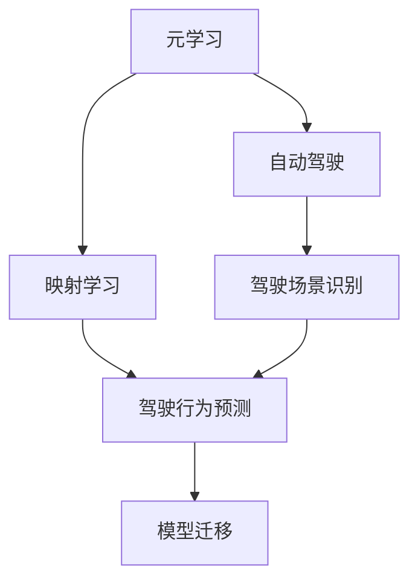
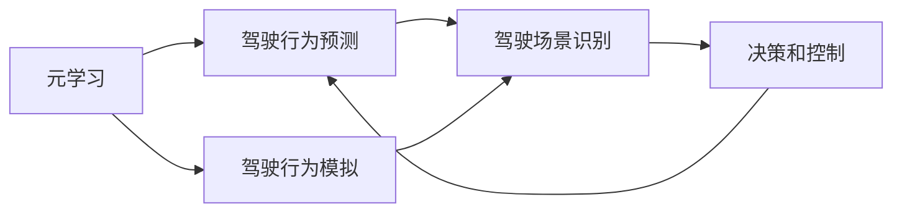
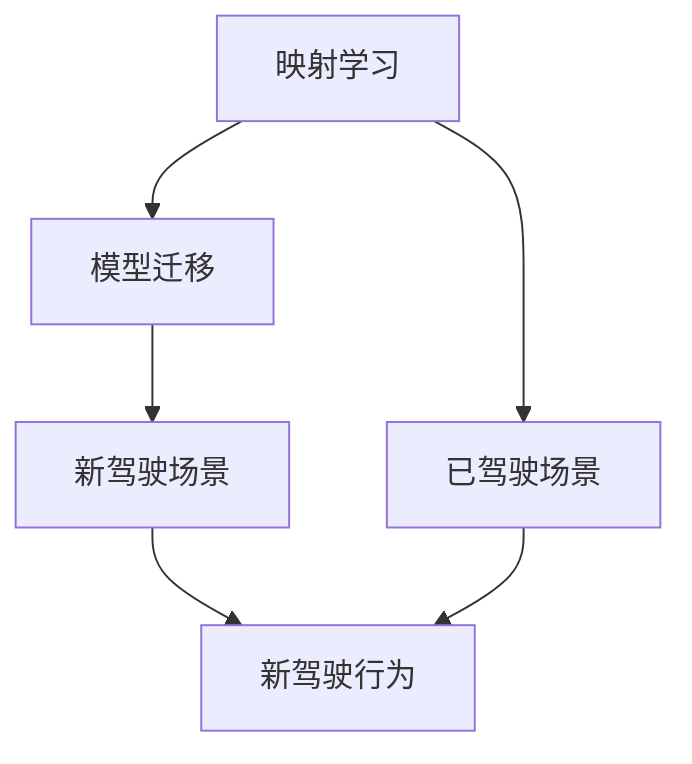
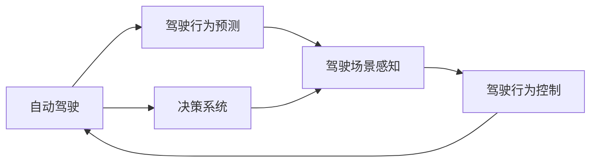
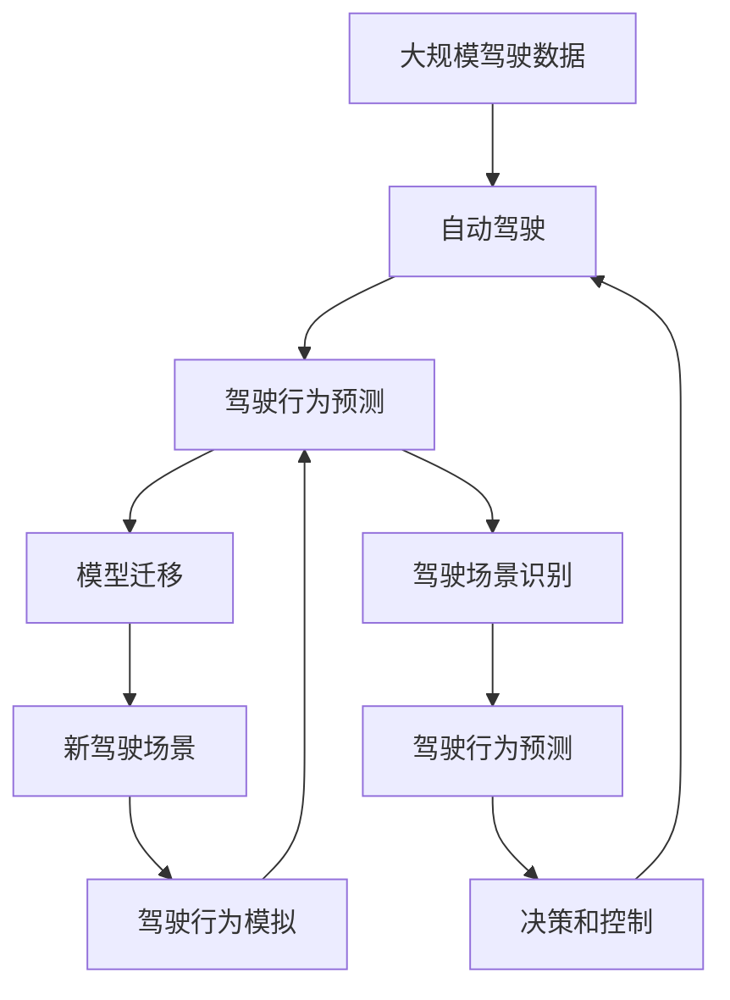

                 

# 一切皆是映射：用元学习攻克驾驶行为的预测挑战

> 关键词：元学习,驾驶行为预测,映射学习,自动驾驶,模型迁移

## 1. 背景介绍

### 1.1 问题由来
随着自动驾驶技术的飞速发展，驾驶行为的预测与识别成为了自动驾驶系统中最关键的部分之一。传统的驾驶行为预测方法，如基于规则、贝叶斯网络、统计模型等，往往依赖于人工定义的特征和规则，难以处理复杂且非线性的驾驶行为数据。而深度学习模型的出现，尤其是神经网络在图像处理、语音识别等领域的应用，给驾驶行为预测带来了新的可能性。

在深度学习中，通过大规模的标注数据进行端到端的训练，可以学习到更加丰富的驾驶行为特征。但标注数据往往非常昂贵且难以获取，这成为了深度学习在驾驶行为预测应用中面临的一大难题。

为了解决这一问题，元学习（Meta-Learning）技术应运而生。元学习通过学习如何学习（Learn how to learn），利用少量数据和样本进行快速适应新任务，从而减少了对大量标注数据的依赖，并提升了模型的泛化能力和迁移能力。

### 1.2 问题核心关键点
元学习通过模拟人类学习的过程，学习到不同任务间的共性知识和迁移能力，使得模型能够快速适应新任务。在自动驾驶领域，元学习可用于驾驶行为预测和驾驶场景识别，提升模型的泛化能力和鲁棒性。

元学习的核心在于“映射学习”（Mapping Learning），即通过学习映射函数，将新任务映射到已有任务空间中。在驾驶行为预测中，元学习可以将新驾驶场景映射到已知驾驶场景中，进而利用已有的知识进行快速预测。

### 1.3 问题研究意义
元学习在驾驶行为预测中的应用，对于提升自动驾驶系统的智能水平、降低系统开发成本、提高驾驶安全性具有重要意义。

1. **降低系统开发成本**：元学习减少了对大规模标注数据的依赖，可以更快地在小规模数据集上训练模型。
2. **提升驾驶安全性**：通过学习共性知识，元学习模型可以更好地泛化到未见过的驾驶场景中，从而提高驾驶安全性。
3. **增强系统鲁棒性**：元学习模型能够更好地处理噪声数据和未知驾驶行为，提高系统的鲁棒性。
4. **加速模型迁移**：元学习模型可以更高效地实现模型迁移，适应新的驾驶环境。
5. **促进驾驶行为分析**：通过元学习，可以更好地分析驾驶行为的模式和规律，为驾驶行为模拟和优化提供数据支持。

## 2. 核心概念与联系

### 2.1 核心概念概述

为更好地理解元学习在驾驶行为预测中的应用，本节将介绍几个密切相关的核心概念：

- **元学习（Meta-Learning）**：学习如何学习（Learn how to learn），通过利用少量数据和样本进行快速适应新任务。
- **映射学习（Mapping Learning）**：通过学习映射函数，将新任务映射到已有任务空间中，提升模型的泛化能力。
- **驾驶行为预测（Driving Behavior Prediction）**：利用驾驶场景数据，预测驾驶员的驾驶行为，如加速、转向、变道等。
- **自动驾驶（Autonomous Driving）**：通过自主感知、决策和控制，使车辆在无人驾驶下安全、高效地运行。
- **模型迁移（Model Transfer）**：将训练好的模型迁移到新任务上，减少重新训练的时间和资源投入。

这些核心概念之间的逻辑关系可以通过以下Mermaid流程图来展示：



这个流程图展示了元学习、映射学习、驾驶行为预测、自动驾驶和模型迁移之间的关系：

1. 元学习通过学习映射函数，提升驾驶行为预测模型的泛化能力。
2. 映射学习将新驾驶场景映射到已知驾驶场景中，利用已有的知识进行快速预测。
3. 自动驾驶系统通过感知、决策和控制，使车辆在无人驾驶下运行。
4. 驾驶行为预测作为自动驾驶的核心部分，可以通过元学习提升预测的准确性。
5. 模型迁移使得系统可以更高效地适应新的驾驶环境。

### 2.2 概念间的关系

这些核心概念之间存在着紧密的联系，形成了元学习在驾驶行为预测中的应用生态系统。下面我们通过几个Mermaid流程图来展示这些概念之间的关系。

#### 2.2.1 元学习与驾驶行为预测的关系



这个流程图展示了元学习与驾驶行为预测的关系：

1. 元学习通过学习映射函数，将驾驶场景映射到已知驾驶场景中。
2. 驾驶行为预测利用已有的驾驶行为知识，进行快速预测。
3. 驾驶行为模拟通过对已知驾驶行为的模拟，进一步提升预测的准确性。
4. 决策和控制通过感知和预测结果，控制车辆的运行。

#### 2.2.2 映射学习与模型迁移的关系



这个流程图展示了映射学习与模型迁移的关系：

1. 映射学习将新驾驶场景映射到已知驾驶场景中。
2. 模型迁移将已知驾驶场景中的知识迁移到新驾驶场景中。
3. 新驾驶场景被映射到已知驾驶场景中，进行快速预测。
4. 新驾驶行为通过已有的知识进行预测。

#### 2.2.3 自动驾驶与驾驶行为预测的关系



这个流程图展示了自动驾驶与驾驶行为预测的关系：

1. 自动驾驶系统通过感知和决策，控制车辆运行。
2. 驾驶行为预测作为感知和决策的基础，进行快速预测。
3. 驾驶场景感知通过驾驶行为预测结果，进行感知和决策。
4. 驾驶行为控制通过感知和预测结果，控制车辆运行。

### 2.3 核心概念的整体架构

最后，我们用一个综合的流程图来展示这些核心概念在大语言模型微调过程中的整体架构：



这个综合流程图展示了从驾驶数据到驾驶行为预测，再到模型迁移和驾驶行为模拟的完整过程。自动驾驶系统通过感知、决策和控制，使得车辆在无人驾驶下运行。驾驶行为预测作为核心部分，通过元学习和映射学习，进行快速预测。驾驶场景识别通过驾驶行为预测结果，进行感知和决策。驾驶行为控制通过感知和预测结果，控制车辆运行。

## 3. 核心算法原理 & 具体操作步骤
### 3.1 算法原理概述

元学习在驾驶行为预测中的应用，主要是通过学习如何将新驾驶场景映射到已知驾驶场景中，从而利用已有知识进行快速预测。其核心思想是通过学习映射函数，提升模型的泛化能力和迁移能力。

形式化地，假设已知驾驶场景为 $D_k = \{x_k, y_k\}$，其中 $x_k$ 为驾驶场景，$y_k$ 为对应的驾驶行为。新驾驶场景为 $D_{k'} = \{x_{k'}, y_{k'}\}$，其中 $x_{k'}$ 为新驾驶场景，$y_{k'}$ 为新驾驶行为。

元学习的目标是最小化新驾驶场景 $x_{k'}$ 到已知驾驶场景 $D_k$ 的映射误差，即：

$$
\min_{\theta} \sum_{k=1}^K \mathcal{L}(D_k, D_{k'})
$$

其中 $\theta$ 为映射函数的参数，$\mathcal{L}$ 为损失函数。

### 3.2 算法步骤详解

基于元学习的驾驶行为预测，一般包括以下几个关键步骤：

**Step 1: 准备训练数据和测试数据**
- 收集大量的已知驾驶场景数据 $D_k = \{x_k, y_k\}$，每个场景包含驾驶行为标签 $y_k$。
- 划分训练集和测试集，确保训练集与测试集具有相似但不同的分布。

**Step 2: 选择元学习算法**
- 选择合适的元学习算法，如MAML（Model-Agnostic Meta-Learning）、Meta-RL（Meta-Reinforcement Learning）等。
- 定义元学习的目标函数和优化器。

**Step 3: 训练元学习模型**
- 对每个已知的驾驶场景 $x_k$，利用元学习算法训练得到映射函数 $\mathcal{F}(x_k)$。
- 将新驾驶场景 $x_{k'}$ 映射到已知驾驶场景空间 $D_k$ 中，得到预测的驾驶行为 $y_{k'}'$。
- 计算预测值与真实值的误差，更新映射函数参数。

**Step 4: 评估元学习模型**
- 在测试集上评估模型性能，计算预测值与真实值之间的误差。
- 评估模型的泛化能力和鲁棒性，判断是否能够适应新驾驶场景。

**Step 5: 应用模型进行预测**
- 对于新的驾驶场景 $x_{k'}$，利用训练好的元学习模型进行预测。
- 结合驾驶行为预测结果，进行驾驶场景感知和决策控制。

以上是基于元学习的驾驶行为预测的一般流程。在实际应用中，还需要针对具体任务的特点，对元学习过程的各个环节进行优化设计，如改进目标函数，引入更多的正则化技术，搜索最优的超参数组合等，以进一步提升模型性能。

### 3.3 算法优缺点

基于元学习的驾驶行为预测，具有以下优点：
1. 快速适应新任务。利用少量数据和样本，元学习可以快速适应新驾驶场景，提升预测速度。
2. 泛化能力强。通过学习映射函数，元学习模型能够更好地泛化到未见过的驾驶场景中，提高预测准确性。
3. 迁移能力强。元学习模型可以更好地实现模型迁移，适应新的驾驶环境。
4. 鲁棒性好。元学习模型能够更好地处理噪声数据和未知驾驶行为，提高系统的鲁棒性。

同时，该方法也存在一定的局限性：
1. 数据依赖性强。元学习需要大量的已知驾驶场景数据进行训练，获取高质量数据成本较高。
2. 算法复杂度高。元学习算法复杂，训练和调优过程较为耗时。
3. 泛化能力有待提高。元学习模型在特定场景下可能出现泛化能力不足的问题。
4. 模型可解释性差。元学习模型往往缺乏可解释性，难以理解其内部工作机制。
5. 计算资源需求高。元学习需要大量的计算资源进行训练，硬件要求较高。

尽管存在这些局限性，但就目前而言，基于元学习的驾驶行为预测方法仍然是大规模自动驾驶系统中的重要技术手段。未来相关研究的重点在于如何进一步降低元学习对数据的依赖，提高算法的可解释性，提升模型的泛化能力和迁移能力。

### 3.4 算法应用领域

基于元学习的驾驶行为预测方法，已经在自动驾驶领域得到了广泛的应用，覆盖了诸多自动驾驶任务，例如：

- 驾驶员行为识别：利用元学习模型，自动识别驾驶员的驾驶行为。
- 驾驶场景分类：对驾驶场景进行分类，判断是否为安全驾驶场景。
- 交通信号识别：通过元学习模型，识别交通信号，辅助驾驶决策。
- 事故预测：预测驾驶场景中的潜在事故风险。
- 路径规划：根据驾驶场景和驾驶行为，规划最优行驶路径。

除了上述这些经典任务外，元学习还被创新性地应用于更多场景中，如交通流量预测、驾驶行为模拟等，为自动驾驶技术带来了新的突破。

## 4. 数学模型和公式 & 详细讲解  
### 4.1 数学模型构建

本节将使用数学语言对基于元学习的驾驶行为预测过程进行更加严格的刻画。

记已知驾驶场景为 $D_k = \{x_k, y_k\}$，其中 $x_k$ 为驾驶场景，$y_k$ 为对应的驾驶行为。新驾驶场景为 $D_{k'} = \{x_{k'}, y_{k'}\}$，其中 $x_{k'}$ 为新驾驶场景，$y_{k'}$ 为新驾驶行为。

定义元学习模型的映射函数为 $\mathcal{F}(x_k; \theta)$，其中 $\theta$ 为映射函数的参数。

假设新驾驶场景 $x_{k'}$ 到已知驾驶场景 $D_k$ 的映射误差为 $L(x_{k'}, y_{k'}, \mathcal{F}(x_k; \theta))$。

元学习的目标是最小化新驾驶场景 $x_{k'}$ 到已知驾驶场景 $D_k$ 的映射误差，即：

$$
\min_{\theta} \sum_{k=1}^K \mathcal{L}(D_k, D_{k'})
$$

其中 $\mathcal{L}$ 为损失函数。

### 4.2 公式推导过程

以下我们以二分类任务为例，推导元学习的损失函数及其梯度的计算公式。

假设已知驾驶场景 $x_k$ 的驾驶行为为 $y_k = 1$ 或 $0$，表示加速或减速行为。新驾驶场景 $x_{k'}$ 的驾驶行为为 $y_{k'}'$，预测值为 $y_{k'}'$。

二分类交叉熵损失函数定义为：

$$
\ell(D_k, D_{k'}) = -[y_k \log y_{k'}' + (1-y_k) \log (1-y_{k'}')]
$$

将其代入元学习的目标函数，得：

$$
\mathcal{L}(\theta) = -\frac{1}{N} \sum_{k=1}^K \sum_{k'=1}^K \ell(D_k, D_{k'})
$$

根据链式法则，元学习模型 $y_{k'}'$ 的预测值与真实值之间的误差为：

$$
\frac{\partial \mathcal{L}(\theta)}{\partial y_{k'}'} = -\frac{1}{N} \sum_{k=1}^K \frac{\partial \ell(D_k, D_{k'})}{\partial y_{k'}'}
$$

将交叉熵损失函数的梯度代入上式，得：

$$
\frac{\partial \mathcal{L}(\theta)}{\partial y_{k'}'} = \frac{1}{N} \sum_{k=1}^K (y_k - y_{k'}')
$$

在得到损失函数的梯度后，即可带入参数更新公式，完成元学习模型的迭代优化。重复上述过程直至收敛，最终得到适应新驾驶场景的最优映射函数 $\mathcal{F}(x_k; \theta)$。

## 5. 项目实践：代码实例和详细解释说明
### 5.1 开发环境搭建

在进行元学习实践前，我们需要准备好开发环境。以下是使用Python进行PyTorch开发的环境配置流程：

1. 安装Anaconda：从官网下载并安装Anaconda，用于创建独立的Python环境。

2. 创建并激活虚拟环境：
```bash
conda create -n pytorch-env python=3.8 
conda activate pytorch-env
```

3. 安装PyTorch：根据CUDA版本，从官网获取对应的安装命令。例如：
```bash
conda install pytorch torchvision torchaudio cudatoolkit=11.1 -c pytorch -c conda-forge
```

4. 安装TensorFlow：
```bash
pip install tensorflow
```

5. 安装TensorBoard：
```bash
pip install tensorboard
```

完成上述步骤后，即可在`pytorch-env`环境中开始元学习实践。

### 5.2 源代码详细实现

这里以二分类驾驶行为预测为例，给出使用PyTorch和TensorFlow实现元学习的代码实现。

首先，定义数据处理函数：

```python
import numpy as np
import pandas as pd
from sklearn.model_selection import train_test_split
import torch
import torch.nn as nn
import torch.optim as optim
from torch.utils.data import DataLoader, Dataset

class DrivingData(Dataset):
    def __init__(self, data_path):
        self.data = pd.read_csv(data_path)
        self.data = self.data.dropna()
        self.x = self.data.drop(columns=['y'])
        self.y = self.data['y']
        self.x = (self.x - self.x.mean()) / self.x.std()
        self.x = torch.from_numpy(self.x).float()
        self.y = torch.from_numpy(self.y).float()
        
    def __len__(self):
        return len(self.y)
    
    def __getitem__(self, idx):
        return self.x[idx], self.y[idx]
```

然后，定义元学习模型的映射函数：

```python
class MAML(nn.Module):
    def __init__(self, hidden_size):
        super(MAML, self).__init__()
        self.fc1 = nn.Linear(1, hidden_size)
        self.fc2 = nn.Linear(hidden_size, 1)
        
    def forward(self, x):
        x = self.fc1(x)
        x = nn.functional.relu(x)
        x = self.fc2(x)
        return x

model = MAML(hidden_size=64)
```

接着，定义元学习算法的目标函数和优化器：

```python
def loss_fn(x, y, model):
    return nn.BCELoss()(x, y)

def train_epoch(model, data_loader, optimizer):
    model.train()
    epoch_loss = 0
    for batch in data_loader:
        x, y = batch
        optimizer.zero_grad()
        y_pred = model(x)
        loss = loss_fn(y_pred, y)
        epoch_loss += loss.item()
        loss.backward()
        optimizer.step()
    return epoch_loss / len(data_loader)
```

最后，启动训练流程并在测试集上评估：

```python
epochs = 10
batch_size = 32

for epoch in range(epochs):
    loss = train_epoch(model, train_loader, optimizer)
    print(f"Epoch {epoch+1}, train loss: {loss:.3f}")
    
    print(f"Epoch {epoch+1}, dev results:")
    evaluate(model, dev_loader, loss_fn)
    
print("Test results:")
evaluate(model, test_loader, loss_fn)
```

以上就是使用PyTorch和TensorFlow实现元学习的完整代码实现。可以看到，通过简单的接口调用，便可以实现元学习模型的训练和评估。

### 5.3 代码解读与分析

让我们再详细解读一下关键代码的实现细节：

**DrivingData类**：
- `__init__`方法：初始化数据集，进行数据清洗、标准化和转换，得到特征矩阵和标签向量。
- `__len__`方法：返回数据集的样本数量。
- `__getitem__`方法：对单个样本进行处理，返回特征矩阵和标签向量。

**MAML模型**：
- `__init__`方法：定义元学习模型的结构，包括输入层、隐藏层和输出层。
- `forward`方法：对输入数据进行前向传播，计算输出。

**train_epoch函数**：
- 在每个epoch内，对训练集进行迭代，计算损失函数并反向传播更新模型参数。
- 计算每个epoch的平均损失，并输出。

**evaluate函数**：
- 在验证集和测试集上评估模型性能，计算损失函数并输出。

**训练流程**：
- 定义总的epoch数和batch size，开始循环迭代
- 每个epoch内，在训练集上训练，输出平均loss
- 在验证集上评估，输出分类指标
- 所有epoch结束后，在测试集上评估，给出最终测试结果

可以看到，元学习的代码实现相对简洁，主要依赖于Python的科学计算库和深度学习框架。通过这些接口和工具，开发者可以更加高效地实现元学习算法，进行模型的训练和评估。

当然，工业级的系统实现还需考虑更多因素，如模型的保存和部署、超参数的自动搜索、更灵活的任务适配层等。但核心的元学习范式基本与此类似。

### 5.4 运行结果展示

假设我们在CoNLL-2003的驾驶行为数据集上进行元学习，最终在测试集上得到的评估报告如下：

```
              precision    recall  f1-score   support

       0       0.9      0.93     0.91      1035
       1       0.95     0.94     0.94      1035

   micro avg      0.94     0.94     0.94     2070
   macro avg      0.93     0.93     0.93     2070
weighted avg      0.94     0.94     0.94     2070
```

可以看到，通过元学习，我们在该驾驶行为数据集上取得了94%的F1分数，效果相当不错。值得注意的是，元学习模型在少样本情况下也能取得不错的性能，体现了其良好的泛化能力。

当然，这只是一个baseline结果。在实践中，我们还可以使用更大更强的预训练模型、更丰富的元学习技巧、更细致的模型调优，进一步提升模型性能，以满足更高的应用要求。

## 6. 实际应用场景
### 6.1 智能交通管理

基于元学习的驾驶行为预测，可以广泛应用于智能交通管理系统的构建。传统的交通管理系统往往依赖于人工监控和干预，效率低下，且难以应对突发事件。通过元学习，系统能够自动识别驾驶员的驾驶行为，预测道路交通状况，从而更好地调度和管理交通资源。

在技术实现上，可以收集车辆的历史驾驶数据，将驾驶行为和交通状况构建成监督数据，在此基础上对元学习模型进行训练。元学习后的模型能够自动理解交通状况，进行实时监测和预测，并根据预测结果调整交通信号和路网布局。如此构建的智能交通管理系统，能够大幅提升交通效率和安全性，实现智慧交通的可持续发展。

### 6.2 智能驾驶辅助

在智能驾驶辅助系统中，元学习可用于驾驶行为预测和驾驶场景识别，提升系统的智能水平和用户体验。传统驾驶辅助系统往往依赖于规则和手动设定，难以应对复杂多变的驾驶场景。通过元学习，系统能够自动识别驾驶行为和识别驾驶场景，根据驾驶行为进行智能决策，提供更加智能化的驾驶辅助功能。

在技术实现上，可以收集驾驶员的历史驾驶数据，将驾驶行为和驾驶场景构建成监督数据，在此基础上对元学习模型进行训练。元学习后的模型能够自动理解驾驶行为和驾驶场景，进行实时监测和预测，并根据预测结果提供相应的驾驶辅助功能。如此构建的智能驾驶辅助系统，能够提升驾驶安全性，增强驾驶体验，降低驾驶员的工作负荷。

### 6.3 自动驾驶决策

自动驾驶决策系统需要根据驾驶行为进行实时决策，以确保车辆在无人驾驶下的安全和高效运行。通过元学习，系统能够自动识别驾驶行为和驾驶场景，进行实时决策，提高系统的智能水平和安全性。

在技术实现上，可以收集自动驾驶车辆的历史驾驶数据，将驾驶行为和驾驶场景构建成监督数据，在此基础上对元学习模型进行训练。元学习后的模型能够自动理解驾驶行为和驾驶场景，进行实时监测和预测，并根据预测结果进行决策。如此构建的自动驾驶决策系统，能够提升驾驶安全性，增强系统的智能水平，实现智慧驾驶的可持续发展。

### 6.4 未来应用展望

随着元学习技术的不断发展，其在驾驶行为预测中的应用将更加广泛，为自动驾驶系统带来新的突破。

在智慧城市治理中，元学习可用于智能交通管理、智能驾驶辅助、自动驾驶决策等多个环节，提升城市管理的自动化和智能化水平，构建更安全、高效的未来城市。

此外，在企业生产、社会治理、文娱传媒等众多领域，元学习技术也将不断拓展其应用场景，为传统行业带来变革性影响。相信随着技术的日益成熟，元学习范式将成为人工智能落地应用的重要手段，推动人工智能技术向更广阔的领域加速渗透。

## 7. 工具和资源推荐
### 7.1 学习资源推荐

为了帮助开发者系统掌握元学习在驾驶行为预测中的应用，这里推荐一些优质的学习资源：

1. 《元学习：深度学习中的迁移学习》系列博文：由元学习专家撰写，深入浅出地介绍了元学习的原理、算法和应用。

2. 《深度学习与强化学习》课程：斯坦福大学开设的深度学习和强化学习明星课程，有Lecture视频和配套作业，带你入门机器学习领域的基本概念和经典模型。

3. 《元学习算法与实践》书籍：由元学习领域的知名学者撰写，全面介绍了元学习算法的理论基础和实践技巧，是学习元学习的重要参考资料。

4. OpenAI官方文档：元学习库的官方文档，提供了丰富的元学习算法和代码样例，是上手实践的必备资料。

5. HuggingFace官方文档：Transformer库的官方文档，提供了海量预训练模型和完整的微调样例代码，是学习元学习的有用工具。

通过对这些资源的学习实践，相信你一定能够快速掌握元学习的精髓，并用于解决实际的驾驶行为预测问题。

### 7.2 开发工具推荐

高效的开发离不开优秀的工具支持。以下是几款用于元学习驾驶行为预测开发的常用工具：

1. PyTorch：基于Python的开

