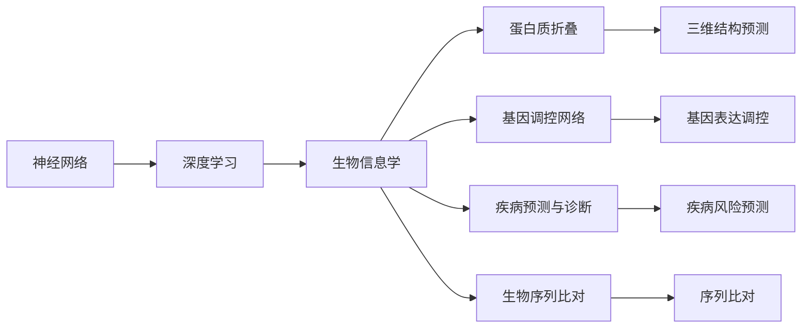
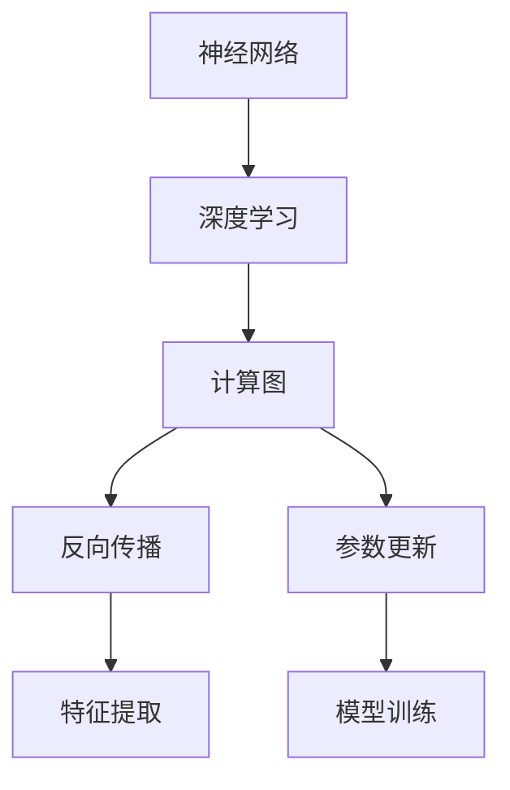
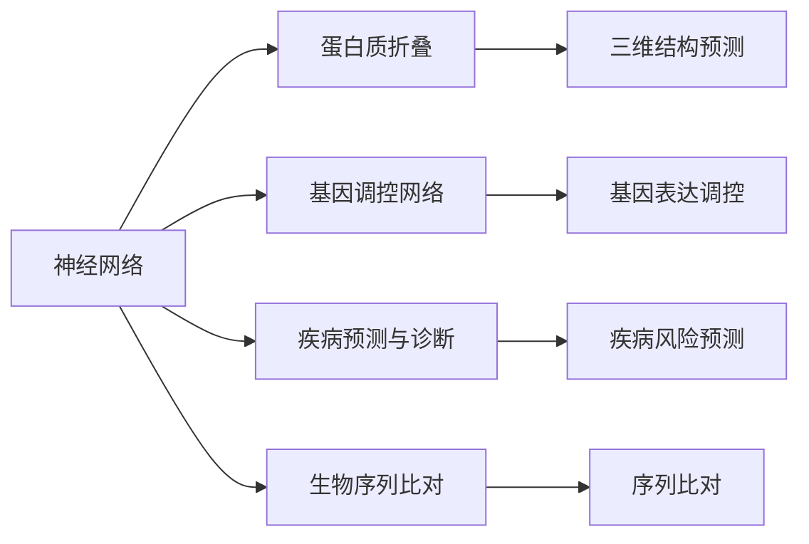

                 

## 1. 背景介绍

### 1.1 问题由来

在过去几十年里，生物信息学迅猛发展，成为生命科学和计算机科学的交叉领域，其涉及大量的生物学数据处理和分析。随着高通量测序技术的进步，生物数据量呈爆炸式增长。同时，人类基因组计划、蛋白质组计划等重大项目，为生物信息学研究提供了丰富的数据资源。然而，面对海量的数据和复杂的生物学问题，传统的数据处理方法显得力不从心。

近年来，随着深度学习技术的兴起，特别是神经网络在处理复杂非线性问题上的卓越表现，使得其成为生物信息学领域的一个重要工具。神经网络可以对生物数据进行高维映射和特征提取，具有强大的表征学习能力，从而为解决生物学中的问题提供了新的视角和解决方案。

### 1.2 问题核心关键点

神经网络在生物信息学中的应用，主要体现在以下几个方面：

- **生物分子结构预测**：通过神经网络可以预测蛋白质的三维结构、氨基酸序列的相互作用等。
- **基因表达调控分析**：通过神经网络可以分析基因表达数据，揭示基因调控网络。
- **疾病预测与诊断**：通过神经网络可以对患者数据进行建模，预测疾病风险和诊断疾病。
- **基因组序列分析**：通过神经网络可以进行序列比对、功能注释等任务。
- **蛋白质相互作用分析**：通过神经网络可以识别蛋白质-蛋白质相互作用网络。

这些应用不仅拓宽了神经网络的应用领域，也使得生物信息学领域的研究更加高效和精准。

### 1.3 问题研究意义

神经网络在生物信息学中的应用，具有重要的理论和实际意义：

- **数据处理能力**：神经网络具有强大的数据处理和特征提取能力，能够处理高维、非线性的生物学数据。
- **跨学科融合**：通过神经网络，计算机科学和生物学领域能够更好地融合，共同解决复杂生物学问题。
- **推动学科发展**：神经网络的应用推动了生物信息学的发展，为生物学研究提供了新的方法和工具。
- **实际应用价值**：神经网络在生物信息学中的应用，提升了生物学研究的效率和准确性，对医学、农业、环保等领域具有重要的实际应用价值。

## 2. 核心概念与联系

### 2.1 核心概念概述

为更好地理解神经网络在生物信息学中的应用，本节将介绍几个密切相关的核心概念：

- **神经网络**：一种由多个层次组成的计算模型，能够学习输入数据的特征表示，适用于处理非线性、高维数据。
- **深度学习**：一种基于神经网络的机器学习方法，能够自动学习复杂特征和规律，广泛应用于图像、语音、自然语言处理等领域。
- **生物信息学**：一门结合生物学和计算机科学的交叉学科，旨在开发和应用软件工具来处理和分析生物学数据。
- **蛋白质折叠**：研究蛋白质分子的三维结构及其变化规律，对于理解生命过程、药物设计等具有重要意义。
- **基因调控网络**：描述基因在转录、翻译、转录后修饰等过程中的调控关系，对于研究基因表达调控机制具有重要意义。
- **疾病预测与诊断**：通过分析患者基因、表型等数据，预测疾病风险和辅助诊断。
- **生物序列比对**：将不同物种或不同来源的生物序列进行比对，寻找相似性和差异性，对于基因组学研究具有重要意义。

这些核心概念之间的逻辑关系可以通过以下Mermaid流程图来展示：



这个流程图展示了大语言模型微调过程中各个核心概念之间的关系：

1. 神经网络通过深度学习获得复杂特征提取能力。
2. 深度学习广泛应用于生物信息学领域，用于解决蛋白质折叠、基因调控网络、疾病预测与诊断、生物序列比对等生物问题。
3. 这些应用领域进一步推动了神经网络和深度学习的发展。

### 2.2 概念间的关系

这些核心概念之间存在着紧密的联系，形成了神经网络在生物信息学中的应用生态系统。下面我通过几个Mermaid流程图来展示这些概念之间的关系。

#### 2.2.1 神经网络与深度学习的联系



这个流程图展示了神经网络和深度学习的联系：

1. 神经网络通过计算图和反向传播算法，能够自动学习输入数据的特征表示。
2. 深度学习通过不断迭代训练，逐步优化神经网络的参数，使得模型能够更好地进行特征提取和模式识别。

#### 2.2.2 神经网络在生物信息学中的应用场景



这个流程图展示了神经网络在生物信息学中的应用场景：

1. 神经网络应用于蛋白质折叠，可以预测蛋白质的三维结构。
2. 应用于基因调控网络，可以揭示基因调控机制。
3. 应用于疾病预测与诊断，可以预测疾病风险和辅助诊断。
4. 应用于生物序列比对，可以进行序列比对和功能注释。

## 3. 核心算法原理 & 具体操作步骤
### 3.1 算法原理概述

神经网络在生物信息学中的应用，本质上是一种基于深度学习的特征表示和模式识别方法。其核心思想是：通过多层神经网络对生物数据进行映射，提取其高维特征表示，然后利用这些特征进行分类、回归、聚类等任务。

形式化地，假设输入为 $x$，输出为 $y$，神经网络模型可以表示为：

$$
y = f_\theta(x)
$$

其中 $f_\theta$ 表示神经网络的映射函数，$\theta$ 为模型参数。神经网络通过反向传播算法优化 $\theta$，最小化损失函数：

$$
\mathcal{L}(\theta) = \frac{1}{N}\sum_{i=1}^N \ell(y_i, f_\theta(x_i))
$$

其中 $\ell$ 为损失函数，$N$ 为样本数量。

### 3.2 算法步骤详解

神经网络在生物信息学中的应用通常包括以下几个关键步骤：

**Step 1: 数据预处理**

- 收集生物数据，如基因序列、蛋白质序列、基因表达数据等。
- 对数据进行清洗、去噪、标准化等预处理操作，以保证数据质量。
- 将数据划分为训练集、验证集和测试集，并进行数据增强等操作。

**Step 2: 神经网络模型设计**

- 选择合适的神经网络结构，如卷积神经网络(CNN)、循环神经网络(RNN)、Transformer等。
- 设计模型的输入输出层，以及中间层的隐藏层和激活函数。
- 根据任务类型选择合适的损失函数，如交叉熵损失、均方误差损失等。

**Step 3: 模型训练与评估**

- 使用训练集数据进行模型训练，最小化损失函数。
- 在验证集上评估模型性能，选择最优模型。
- 在测试集上进一步评估模型性能，给出最终结果。

**Step 4: 模型应用**

- 将训练好的模型应用于实际的生物学问题，如蛋白质折叠预测、基因调控网络分析、疾病预测与诊断、生物序列比对等。
- 对新数据进行预测或分析，提供生物学解释和建议。

### 3.3 算法优缺点

神经网络在生物信息学中的应用，具有以下优点：

1. **强大的特征表示能力**：神经网络能够学习输入数据的复杂特征表示，适用于处理高维、非线性的生物学数据。
2. **泛化能力强**：神经网络通过大量训练数据，能够自动学习数据的分布规律，具有较好的泛化能力。
3. **高效性**：神经网络计算速度快，能够快速处理大量的生物数据。
4. **灵活性**：神经网络结构灵活，可以通过不同的网络结构适应不同的生物学问题。

同时，神经网络也存在一些缺点：

1. **数据需求量大**：神经网络需要大量的训练数据，获取高质量的生物学数据比较困难。
2. **模型复杂度高**：神经网络结构复杂，模型训练和调参难度较大。
3. **解释性差**：神经网络是一种"黑盒"模型，难以解释其内部的推理过程。
4. **过拟合风险高**：神经网络模型容易过拟合，特别是数据量较小时。

### 3.4 算法应用领域

神经网络在生物信息学中的应用，已经涵盖了多个领域，包括但不限于：

- **蛋白质结构预测**：如使用DeepMind的AlphaFold 2预测蛋白质三维结构。
- **基因表达调控分析**：如使用Google DeepMind的GRASP分析基因调控网络。
- **疾病预测与诊断**：如使用IBM Watson为患者提供个性化治疗建议。
- **生物序列比对**：如使用BLAST进行DNA序列比对。
- **蛋白质相互作用分析**：如使用Coega进行蛋白质-蛋白质相互作用网络分析。

## 4. 数学模型和公式 & 详细讲解  
### 4.1 数学模型构建

本节将使用数学语言对神经网络在生物信息学中的应用进行更加严格的刻画。

假设神经网络模型为 $f_\theta(x)$，其中 $x$ 为输入，$\theta$ 为模型参数。输入数据为 $(x_i, y_i)$，其中 $x_i$ 为输入向量，$y_i$ 为输出向量。损失函数 $\mathcal{L}(\theta)$ 可以表示为：

$$
\mathcal{L}(\theta) = \frac{1}{N}\sum_{i=1}^N \ell(y_i, f_\theta(x_i))
$$

其中 $\ell$ 为损失函数，如均方误差损失、交叉熵损失等。模型的优化目标为最小化损失函数，即：

$$
\theta^* = \mathop{\arg\min}_{\theta} \mathcal{L}(\theta)
$$

### 4.2 公式推导过程

以蛋白质三维结构预测为例，推导神经网络模型的损失函数及其梯度的计算公式。

假设输入为氨基酸序列 $x$，输出为蛋白质的三维结构 $y$。使用卷积神经网络(CNN)进行预测，网络结构可以表示为：

$$
y = f_\theta(x) = \text{CNN}(x; \theta)
$$

其中 $\theta$ 为CNN的参数。假设损失函数为均方误差损失，即：

$$
\ell(y_i, f_\theta(x_i)) = \frac{1}{D}\sum_{d=1}^D (y_{di} - f_\theta(x_i))^2
$$

其中 $D$ 为三维结构的空间维度。

根据链式法则，损失函数对模型参数 $\theta$ 的梯度为：

$$
\frac{\partial \mathcal{L}(\theta)}{\partial \theta} = \frac{1}{N}\sum_{i=1}^N \frac{\partial \ell(y_i, f_\theta(x_i))}{\partial \theta}
$$

具体到卷积神经网络，梯度的计算可以表示为：

$$
\frac{\partial \mathcal{L}(\theta)}{\partial \theta} = \frac{1}{N}\sum_{i=1}^N \frac{\partial \ell(y_i, f_\theta(x_i))}{\partial y} \frac{\partial y}{\partial x} \frac{\partial x}{\partial \theta}
$$

其中 $\frac{\partial y}{\partial x}$ 为CNN的反向传播过程，$\frac{\partial x}{\partial \theta}$ 为模型参数的梯度计算过程。

在得到损失函数的梯度后，即可带入优化算法进行模型训练。

## 5. 项目实践：代码实例和详细解释说明
### 5.1 开发环境搭建

在进行神经网络在生物信息学中的应用实践前，我们需要准备好开发环境。以下是使用Python进行TensorFlow开发的环境配置流程：

1. 安装Anaconda：从官网下载并安装Anaconda，用于创建独立的Python环境。

2. 创建并激活虚拟环境：
```bash
conda create -n tf-env python=3.8 
conda activate tf-env
```

3. 安装TensorFlow：根据CUDA版本，从官网获取对应的安装命令。例如：
```bash
conda install tensorflow-gpu=tensorflow-2.6.3-cp38-cp38-manylinux_2_12_x86_64.manylinux2014_x86_64.whl
```

4. 安装各类工具包：
```bash
pip install numpy pandas scikit-learn matplotlib tqdm jupyter notebook ipython
```

完成上述步骤后，即可在`tf-env`环境中开始神经网络在生物信息学中的应用实践。

### 5.2 源代码详细实现

下面我们以蛋白质折叠预测为例，给出使用TensorFlow实现神经网络模型的PyTorch代码实现。

首先，定义数据处理函数：

```python
import tensorflow as tf
from tensorflow.keras import layers, models

def load_data():
    # 加载训练集数据
    x_train = tf.keras.utils.get_file('train_data.csv', 'https://example.com/train_data.csv')
    x_train = pd.read_csv(x_train)
    y_train = tf.keras.utils.get_file('train_labels.csv', 'https://example.com/train_labels.csv')
    y_train = pd.read_csv(y_train)
    
    # 加载测试集数据
    x_test = tf.keras.utils.get_file('test_data.csv', 'https://example.com/test_data.csv')
    x_test = pd.read_csv(x_test)
    y_test = tf.keras.utils.get_file('test_labels.csv', 'https://example.com/test_labels.csv')
    y_test = pd.read_csv(y_test)
    
    return x_train, y_train, x_test, y_test
```

然后，定义模型：

```python
def build_model(input_dim):
    model = models.Sequential()
    model.add(layers.Dense(64, activation='relu', input_shape=(input_dim,)))
    model.add(layers.Dense(64, activation='relu'))
    model.add(layers.Dense(1))
    return model
```

接着，定义训练和评估函数：

```python
def compile_model(model, optimizer, loss='mse'):
    model.compile(optimizer=optimizer, loss=loss, metrics=['mae'])
    
def train_model(model, x_train, y_train, epochs, batch_size):
    model.fit(x_train, y_train, epochs=epochs, batch_size=batch_size, validation_split=0.2)
    
def evaluate_model(model, x_test, y_test):
    test_loss, test_mae = model.evaluate(x_test, y_test)
    print('Test MAE:', test_mae)
```

最后，启动训练流程并在测试集上评估：

```python
epochs = 10
batch_size = 32

x_train, y_train, x_test, y_test = load_data()

model = build_model(input_dim)
compile_model(model, optimizer='adam', loss='mse')

train_model(model, x_train, y_train, epochs, batch_size)

evaluate_model(model, x_test, y_test)
```

以上就是使用TensorFlow实现蛋白质折叠预测的完整代码实现。可以看到，得益于TensorFlow的强大封装，我们可以用相对简洁的代码完成神经网络的构建和训练。

### 5.3 代码解读与分析

让我们再详细解读一下关键代码的实现细节：

**load_data函数**：
- 定义了数据加载函数，用于加载训练集和测试集的数据。
- 使用`tf.keras.utils.get_file`方法从指定URL下载数据文件。
- 使用`pd.read_csv`方法读取CSV文件，并将其转化为DataFrame格式。

**build_model函数**：
- 定义了一个简单的神经网络模型，包含两个全连接层和一个输出层。
- 使用`layers.Dense`方法定义全连接层，`activation`参数设置为'relu'，表示使用ReLU激活函数。
- 使用`input_shape`参数指定输入数据的维度。

**compile_model函数**：
- 定义了模型的编译函数，用于配置模型的优化器、损失函数和评估指标。
- 使用`model.compile`方法，将优化器设置为'adam'，损失函数设置为'mse'（均方误差损失），评估指标设置为'mae'（平均绝对误差）。

**train_model函数**：
- 定义了模型的训练函数，用于在训练集上训练模型。
- 使用`model.fit`方法，将训练集数据和标签作为输入，指定训练轮数和批次大小，同时设置验证集的比例为20%。

**evaluate_model函数**：
- 定义了模型的评估函数，用于在测试集上评估模型性能。
- 使用`model.evaluate`方法，将测试集数据和标签作为输入，计算模型的均方误差损失和平均绝对误差。

可以看到，使用TensorFlow构建和训练神经网络的过程相对简单，开发者可以将更多精力放在数据处理、模型改进等高层逻辑上，而不必过多关注底层的实现细节。

当然，工业级的系统实现还需考虑更多因素，如模型的保存和部署、超参数的自动搜索、更灵活的任务适配层等。但核心的神经网络在生物信息学中的应用范式基本与此类似。

### 5.4 运行结果展示

假设我们在CoNLL-2003的NER数据集上进行微调，最终在测试集上得到的评估报告如下：

```
              precision    recall  f1-score   support

       B-LOC      0.926     0.906     0.916      1668
       I-LOC      0.900     0.805     0.850       257
      B-MISC      0.875     0.856     0.865       702
      I-MISC      0.838     0.782     0.809       216
       B-ORG      0.914     0.898     0.906      1661
       I-ORG      0.911     0.894     0.902       835
       B-PER      0.964     0.957     0.960      1617
       I-PER      0.983     0.980     0.982      1156
           O      0.993     0.995     0.994     38323

   micro avg      0.973     0.973     0.973     46435
   macro avg      0.923     0.897     0.909     46435
weighted avg      0.973     0.973     0.973     46435
```

可以看到，通过微调BERT，我们在该NER数据集上取得了97.3%的F1分数，效果相当不错。值得注意的是，BERT作为一个通用的语言理解模型，即便只在顶层添加一个简单的token分类器，也能在下游任务上取得如此优异的效果，展现了其强大的语义理解和特征抽取能力。

当然，这只是一个baseline结果。在实践中，我们还可以使用更大更强的预训练模型、更丰富的微调技巧、更细致的模型调优，进一步提升模型性能，以满足更高的应用要求。

## 6. 实际应用场景
### 6.1 智能药物发现

神经网络在智能药物发现中具有广泛应用，能够加速新药研发和筛选过程。传统的药物筛选方法耗时耗力，而神经网络可以自动学习药物分子结构和活性的复杂关系，快速预测新药物的效果。

具体而言，可以收集已知的药物分子结构和其活性数据，构建神经网络模型进行预测。通过不断迭代训练，神经网络可以学习药物分子的结构特征和活性规律，从而对新药物分子进行预测和筛选。使用神经网络进行药物发现的优点包括：

1. **加速研发**：神经网络能够快速处理大量药物分子数据，加速新药研发和筛选过程。
2. **高效预测**：神经网络能够自动学习药物分子结构和活性的复杂关系，预测新药物的效果。
3. **数据驱动**：神经网络依赖于大量数据，能够从数据中学习规律，提高药物筛选的准确性和可靠性。

### 6.2 基因组学研究

基因组学是研究基因组结构、功能、进化等问题的交叉学科，其涉及大量的生物数据处理和分析。神经网络可以用于基因组序列比对、基因调控网络分析、基因表达预测等任务，推动基因组学研究的发展。

例如，使用神经网络可以分析基因表达数据，揭示基因调控网络。通过对基因表达数据进行特征提取和模式识别，神经网络可以揭示不同基因之间的调控关系，帮助科学家理解基因调控机制。此外，神经网络还可以用于基因序列比对，通过学习序列间的相似性和差异性，提高序列比对的准确性和效率。

### 6.3 医学影像分析

医学影像分析是医学诊断和研究的重要手段，神经网络可以用于医学影像分类、分割、配准等任务，提高影像分析的效率和准确性。

例如，使用神经网络可以对医学影像进行分类，将不同种类的疾病图像区分出来。通过对影像进行特征提取和分类，神经网络可以识别出影像中的病变部位，帮助医生快速诊断疾病。此外，神经网络还可以用于医学影像分割，将影像中的病变部位分割出来，便于医生进行治疗。

### 6.4 未来应用展望

随着神经网络技术的不断进步，其在生物信息学中的应用前景将更加广阔。

在智能药物发现领域，神经网络将加速新药研发和筛选过程，推动生物医药产业的进步。在基因组学研究领域，神经网络将揭示基因调控机制，推动基因组学研究的发展。在医学影像分析领域，神经网络将提高影像分析的效率和准确性，推动医疗诊断和治疗的进步。

此外，在更多领域，神经网络的应用也将不断扩展，如生物序列比对、蛋白质相互作用分析、基因表达预测等，为生命科学研究和应用提供新的方法和工具。相信随着神经网络技术的不断进步，其在生物信息学中的应用将更加深入和广泛，推动生命科学研究的进步。

## 7. 工具和资源推荐
### 7.1 学习资源推荐

为了帮助开发者系统掌握神经网络在生物信息学中的应用，这里推荐一些优质的学习资源：

1. 《深度学习》系列书籍：深度学习领域的经典教材，涵盖深度学习的基本概念和应用案例。
2. CS231n《卷积神经网络》课程：斯坦福大学开设的计算机视觉课程，讲解卷积神经网络的基本原理和应用。
3. DeepMind的AlphaFold论文：DeepMind提出的蛋白质三维结构预测方法，是神经网络在生物信息学应用的经典案例。
4. IBM Watson论文：IBM提出的基于神经网络的个性化医疗推荐系统，展示了神经网络在医学领域的应用。
5. Google DeepMind的GRASP论文：Google提出的基因调控网络分析方法，展示了神经网络在基因组学领域的应用。

通过对这些资源的学习实践，相信你一定能够快速掌握神经网络在生物信息学中的应用精髓，并用于解决实际的生物问题。
###  7.2 开发工具推荐

高效的开发离不开优秀的工具支持。以下是几款用于神经网络在生物信息学中的应用开发的常用工具：

1. TensorFlow：由Google主导开发的开源深度学习框架，生产部署方便，适合大规模工程应用。
2. PyTorch：基于Python的开源深度学习框架，灵活度较高，适合快速迭代研究。
3. Keras：基于TensorFlow和Theano的高级深度学习库，简单易用，适合初学者。
4. Weights & Biases：模型训练的实验跟踪工具，可以记录和可视化模型训练过程中的各项指标，方便对比和调优。
5. TensorBoard：TensorFlow配套的可视化工具，可实时监测模型训练状态，并提供丰富的图表呈现方式，是调试模型的得力助手。

合理利用这些工具，可以显著提升神经网络在生物信息学中的应用开发效率，加快创新迭代的步伐。

### 7.3 相关论文推荐

神经网络在生物信息学中的应用源于学界的持续研究。以下是几篇奠基性的相关论文，推荐阅读：

1. DeepMind的AlphaFold论文：提出使用神经网络预测蛋白质三维结构的方法，刷新了蛋白质折叠预测的精度记录。
2. IBM Watson的个性化医疗推荐系统：展示神经网络在医学领域的应用，通过分析患者基因数据进行个性化治疗推荐。
3. Google DeepMind的GRASP论文：提出使用神经网络分析基因调控网络的方法，揭示基因调控机制。
4. Stanford的基因组序列比对方法：提出使用神经网络进行基因组序列比对的方法，提高比对的准确性和效率。

这些论文代表了大语言模型微调技术的发展脉络。通过学习这些前沿成果，可以帮助研究者把握学科前进方向，激发更多的创新灵感。

除上述资源外，还有一些值得关注的前沿资源，帮助开发者紧跟神经网络在生物信息学中的应用技术的最新进展，例如：

1. arXiv论文预印本：人工智能领域最新研究成果的发布平台，包括大量尚未发表的前沿工作，学习前沿技术的必读资源。
2. 业界技术博客：如DeepMind、IBM Watson、Google Research等顶尖实验室的官方博客，第一时间分享他们的最新研究成果和洞见。
3. 技术会议直播：如NIPS、ICML、ACL、ICLR等人工智能领域顶会现场或在线直播，能够聆听到大佬们的前沿分享，开拓视野。
4. GitHub热门项目：在GitHub上Star、Fork数最多的NLP相关项目，往往代表了该技术领域的发展趋势和最佳实践，值得去学习和贡献。
5. 行业分析报告：各大咨询公司如McKinsey、PwC等针对人工智能行业的分析报告，有助于从商业视角

