                 

# 基于用户评价体系推动某旅游发展的分析与研究

## 1. 背景介绍

### 1.1 问题由来

近年来，随着互联网和社交媒体的普及，旅游行业的数字化、智能化转型成为不可逆转的趋势。用户评价体系作为旅游行业数字化建设的重要一环，在吸引游客、提升服务质量、优化旅游体验等方面发挥了巨大作用。特别是大数据、人工智能等技术的引入，使得基于用户评价体系的旅游分析与研究变得更为便捷和高效。然而，如何通过科学合理的评价体系，提取有效信息，指导旅游发展，仍然是一个亟待解决的问题。

### 1.2 问题核心关键点

本文聚焦于基于用户评价体系推动某旅游目的地发展的研究。我们将从评价体系的设计、数据采集与处理、模型构建与训练、结果分析与应用等多个环节展开详细探讨。

### 1.3 问题研究意义

通过分析用户评价数据，可以帮助旅游目的地精准定位游客需求，优化资源配置，提升服务质量，从而吸引更多游客，推动旅游业的可持续发展。同时，基于用户评价的智能推荐系统还能提升游客的满意度和旅游体验，增强旅游目的地在竞争中的优势。

## 2. 核心概念与联系

### 2.1 核心概念概述

- **用户评价体系**：指通过问卷调查、用户反馈、评分系统等多种方式，收集用户对旅游目的地各方面的评价信息，用于评估旅游服务质量、吸引力和满意度。
- **大数据分析**：指利用先进的数据处理和分析技术，从海量用户评价数据中提取有价值的信息，提供决策支持。
- **人工智能**：指通过机器学习、深度学习等算法，自动化分析用户评价数据，提升分析的效率和准确性。
- **旅游发展**：指旅游目的地的资源规划、设施建设、市场推广、服务优化等多个方面的综合发展。

这些概念紧密相连，共同构成了基于用户评价体系推动旅游发展的完整生态系统。以下通过 Mermaid 流程图展示它们之间的联系：

```mermaid
graph TB
    A[用户评价体系] --> B[大数据分析]
    A --> C[人工智能]
    C --> D[旅游发展]
```



### 2.2 概念间的关系

- **用户评价体系**：为大数据分析和人工智能提供了数据来源，是分析与决策的基础。
- **大数据分析**：对用户评价数据进行统计、分析和可视化，为人工智能模型提供训练样本，辅助决策。
- **人工智能**：利用机器学习、深度学习等算法，自动化处理和分析用户评价数据，提升分析效果。
- **旅游发展**：在用户评价、大数据分析和人工智能的基础上，进行科学决策和资源优化，推动旅游目的地发展。

这些概念通过数据流传递，共同驱动旅游目的地提升服务质量、优化资源配置，吸引更多游客，实现旅游业的可持续发展。

## 3. 核心算法原理 & 具体操作步骤

### 3.1 算法原理概述

基于用户评价体系的旅游发展研究，本质上是利用机器学习、深度学习等技术，从用户评价数据中提取关键信息，辅助旅游目的地进行科学决策。常用的算法包括：

- **文本分类**：将用户评价文本分类为正面、中性、负面三类，用于分析用户情感倾向。
- **情感分析**：分析用户评价文本的情感强度，判断用户满意度和情绪。
- **聚类分析**：对用户评价数据进行聚类，识别不同游客群体的需求和偏好。
- **关联规则挖掘**：发现用户评价数据中的关联规则，用于优化资源配置和市场推广策略。

### 3.2 算法步骤详解

基于用户评价体系推动某旅游目的地发展的研究，主要包括以下步骤：

1. **数据采集**：通过问卷调查、社交媒体、酒店评价、景点评论等多种渠道，收集用户对旅游目的地的评价数据。
2. **数据预处理**：清洗和格式化数据，去除噪声和冗余信息，确保数据质量。
3. **特征提取**：从用户评价文本中提取关键特征，如情感词、短语、主题等。
4. **模型训练**：利用机器学习算法对提取的特征进行训练，建立分类、情感分析、聚类、关联规则等模型。
5. **结果分析**：对模型输出结果进行分析，识别用户评价中的关键信息，如游客满意度、需求偏好、热门景点等。
6. **决策支持**：将分析结果转化为行动方案，如优化服务设施、调整营销策略、提升旅游体验等，推动旅游目的地发展。

### 3.3 算法优缺点

基于用户评价体系的旅游发展研究具有以下优点：

- **数据驱动决策**：利用用户评价数据进行科学决策，能够更好地满足游客需求，提升服务质量。
- **高效数据分析**：大数据技术和人工智能算法能够快速处理和分析大量评价数据，提高决策效率。
- **动态调整策略**：通过持续收集和分析用户评价数据，能够及时调整旅游目的地发展策略，保持竞争力。

同时，该方法也存在一些局限性：

- **数据质量和数量**：用户评价数据的准确性和全面性对分析结果有较大影响。
- **隐私和伦理问题**：用户评价数据的隐私保护和伦理审查需要特别注意，避免侵犯用户权益。
- **模型复杂性**：不同算法模型的选择和参数调优可能较为复杂，需要一定的专业知识和技能。

### 3.4 算法应用领域

基于用户评价体系的旅游发展研究，不仅适用于旅游目的地的管理和优化，还可应用于以下多个领域：

- **旅游市场分析**：分析旅游市场趋势，识别热点地区和潜在增长点，指导资源配置和市场推广。
- **游客行为研究**：通过用户评价数据，分析游客行为模式，优化游客体验，提升满意度。
- **服务质量评估**：评估旅游目的地的服务质量，识别不足和改进点，提升整体服务水平。
- **景区管理优化**：通过用户评价数据，优化景区管理，提高游客流量和消费水平。

## 4. 数学模型和公式 & 详细讲解

### 4.1 数学模型构建

假设用户评价数据集为 $D=\{(x_i, y_i)\}_{i=1}^N$，其中 $x_i$ 表示评价文本，$y_i$ 表示评价标签（如满意度评分、正面/中性/负面等）。

目标是对评价文本 $x_i$ 进行分类，建立分类模型 $M$。常用的分类算法包括支持向量机、朴素贝叶斯、逻辑回归等，其中支持向量机（SVM）具有较好的分类效果和泛化能力，下面以SVM为例进行详细讲解。

### 4.2 公式推导过程

SVM的分类目标是最小化损失函数：

$$
\min_{w, b} \frac{1}{2} ||w||^2 + C\sum_{i=1}^N \ell(y_i, w^T\phi(x_i) + b)
$$

其中 $w$ 和 $b$ 是分类器的参数，$\phi(x_i)$ 是特征映射函数，$\ell$ 是损失函数，$C$ 是正则化参数。

SVM的决策边界为：

$$
\max_{i=1,2,\cdots,N}(y_i(w^T\phi(x_i) + b) - \frac{1}{2}||w||^2)
$$

求解上述优化问题，可以得到最优分类器 $M$。

### 4.3 案例分析与讲解

以某旅游目的地的用户评价数据为例，假设共收集了1000条评价数据，其中正面评价为500条，中性评价为300条，负面评价为200条。通过SVM算法建立分类模型，可以训练得到最优的参数 $w$ 和 $b$，从而实现对新评价数据的分类。

## 5. 项目实践：代码实例和详细解释说明

### 5.1 开发环境搭建

在进行项目实践前，需要先搭建开发环境。具体步骤如下：

1. 安装Python：从官网下载Python 3.7及以上版本。
2. 安装机器学习库：
   ```bash
   pip install scikit-learn pandas numpy
   ```
3. 安装深度学习库：
   ```bash
   pip install keras tensorflow
   ```
4. 安装数据处理库：
   ```bash
   pip install joblib gensim
   ```

完成上述步骤后，即可在Python环境下进行项目开发。

### 5.2 源代码详细实现

以下是一个简单的用户评价分类项目代码实现：

```python
import pandas as pd
from sklearn.feature_extraction.text import TfidfVectorizer
from sklearn.model_selection import train_test_split
from sklearn.svm import SVC
from sklearn.metrics import classification_report

# 加载用户评价数据
data = pd.read_csv('user_reviews.csv')

# 特征提取
tfidf = TfidfVectorizer(stop_words='english', max_features=1000)
X = tfidf.fit_transform(data['review'])
y = data['sentiment']  # 假设sentiment列表示评价标签

# 数据划分
X_train, X_test, y_train, y_test = train_test_split(X, y, test_size=0.2, random_state=42)

# 模型训练
svm = SVC(C=1.0, kernel='linear')
svm.fit(X_train, y_train)

# 模型评估
y_pred = svm.predict(X_test)
print(classification_report(y_test, y_pred))
```

### 5.3 代码解读与分析

在上述代码中，我们首先加载了用户评价数据，然后利用TfidfVectorizer进行特征提取，使用SVM进行模型训练和评估。代码实现相对简单，但涵盖了机器学习项目开发的基本步骤，包括数据加载、特征提取、模型训练、评估等环节。

### 5.4 运行结果展示

假设我们在模型训练后，得到如下分类报告：

```
              precision    recall  f1-score   support

           0       0.90      0.95      0.92        500
           1       0.75      0.80      0.78        300
           2       0.60      0.55      0.58        200

    accuracy                           0.82       1000
   macro avg      0.80      0.81      0.81       1000
weighted avg      0.82      0.82      0.82       1000
```

可以看到，模型在正面评价的分类准确率最高，中性评价次之，负面评价最低。这表明用户对正面评价的满意度较高，需要重点关注。

## 6. 实际应用场景

### 6.1 智能推荐系统

智能推荐系统是利用用户评价数据进行个性化推荐的重要应用。通过分析用户的评价和评分数据，可以发现用户的偏好和兴趣，提供符合用户需求的旅游目的地推荐。

假设某旅游平台收集了用户的浏览、评分、评论等数据，可以利用用户评价体系建立推荐模型。具体步骤如下：

1. 对用户评价数据进行预处理，提取关键特征。
2. 建立推荐模型，如基于协同过滤、内容推荐、混合推荐等算法。
3. 根据用户历史行为和评价数据，生成个性化推荐列表。
4. 实时更新推荐列表，优化推荐效果。

### 6.2 市场趋势分析

通过分析用户评价数据，可以了解旅游市场的趋势和热点，指导资源配置和市场推广。例如，通过分析游客对不同景点的评价，可以发现哪些景点更受欢迎，哪些设施需要改进。

假设某旅游目的地收集了用户对景点的评价数据，可以建立景点评价模型，分析热门景点的分布和游客满意度。具体步骤如下：

1. 对评价数据进行特征提取，如景点名称、用户评分、评论内容等。
2. 利用聚类算法对景点进行分类，识别热门景点和低评分景点。
3. 分析热门景点的游客流量、消费水平、游客评价等信息，优化资源配置。
4. 调整营销策略，提升热门景点的曝光度和吸引力。

### 6.3 服务质量评估

通过用户评价数据，可以评估旅游目的地的服务质量，识别不足和改进点，提升整体服务水平。例如，通过分析用户在餐厅、酒店、景点的评价，可以发现服务中的问题和改进方向。

假设某旅游目的地收集了用户在餐厅、酒店、景点的评价数据，可以建立服务质量评估模型，识别服务中的不足和改进点。具体步骤如下：

1. 对评价数据进行特征提取，如评价内容、评分、服务项目等。
2. 利用情感分析算法，评估服务质量，识别负面评价和改进点。
3. 根据评价结果，制定改进计划，如提升服务质量、加强服务培训等。
4. 跟踪改进效果，持续优化服务质量。

### 6.4 未来应用展望

基于用户评价体系的旅游发展研究，具有广阔的应用前景。随着技术的发展，未来可以实现更智能、更高效、更个性化的旅游体验。例如：

1. **实时动态推荐**：利用实时用户评价数据，动态调整推荐策略，提供更符合用户需求的旅游目的地推荐。
2. **情感分析和舆情监测**：通过情感分析和舆情监测，及时发现游客的不满和问题，快速解决，提升游客满意度。
3. **深度学习和大数据技术**：引入深度学习和大数据技术，提高分析的精度和效率，推动旅游业智能化发展。
4. **跨领域融合应用**：将旅游评价体系与其他领域（如交通、餐饮、购物等）相结合，实现多领域的协同优化。

## 7. 工具和资源推荐

### 7.1 学习资源推荐

为了帮助开发者系统掌握基于用户评价体系的旅游发展技术，这里推荐一些优质的学习资源：

1. **《机器学习》课程**：斯坦福大学的机器学习课程，涵盖机器学习的基本概念和算法，适合初学者和进阶者。
2. **《深度学习》课程**：吴恩达的深度学习课程，涵盖深度学习的基本原理和应用，适合深入学习。
3. **《自然语言处理》课程**：清华大学自然语言处理课程，涵盖NLP的基本概念和应用，适合NLP从业者。
4. **《数据科学》课程**：约翰霍普金斯大学的数据科学课程，涵盖数据处理和分析的基本技术，适合数据从业者。
5. **《旅游数据分析》书籍**：介绍旅游数据分析的基本方法和技术，适合旅游从业者。

通过对这些资源的学习实践，相信你一定能够掌握基于用户评价体系的旅游发展技术，并将其应用于实际项目中。

### 7.2 开发工具推荐

高效的开发离不开优秀的工具支持。以下是几款用于旅游数据分析和推荐开发的常用工具：

1. **Python**：Python语言本身具有丰富的科学计算和数据处理库，适合快速迭代研究。
2. **Jupyter Notebook**：支持多语言开发和实时可视化，适合数据探索和原型开发。
3. **Scikit-learn**：Python机器学习库，支持多种机器学习算法，适合构建推荐系统和分类模型。
4. **TensorFlow**：Google开发的深度学习框架，支持分布式训练和高效推理，适合大规模模型训练和部署。
5. **Apache Spark**：大数据处理框架，支持分布式数据处理和实时计算，适合处理大规模数据集。

合理利用这些工具，可以显著提升旅游数据分析和推荐开发的效率，加快创新迭代的步伐。

### 7.3 相关论文推荐

旅游评价体系和大数据分析的研究正在迅速发展，以下是几篇奠基性的相关论文，推荐阅读：

1. **《基于用户评价的旅游目的地推荐》**：提出基于用户评价的推荐系统，利用机器学习算法分析用户偏好和兴趣。
2. **《旅游市场分析与趋势预测》**：介绍旅游市场分析的基本方法和技术，基于用户评价数据预测旅游市场趋势。
3. **《基于深度学习的旅游情感分析》**：利用深度学习算法，分析用户评价文本的情感和情绪，评估旅游服务质量。
4. **《旅游资源优化配置》**：提出基于用户评价的资源优化配置方法，通过聚类和关联规则挖掘，优化资源配置。

这些论文代表了大数据和人工智能在旅游领域的应用前景，展示了大数据分析和机器学习技术的强大威力。通过学习这些前沿成果，可以帮助研究者把握学科前进方向，激发更多的创新灵感。

## 8. 总结：未来发展趋势与挑战

### 8.1 研究成果总结

本文对基于用户评价体系的旅游发展研究进行了全面系统的介绍。首先阐述了旅游评价体系、大数据分析和人工智能的研究背景和意义，明确了该研究在提升旅游目的地服务质量、优化资源配置等方面的重要作用。其次，从算法原理、操作步骤、应用领域等方面详细讲解了用户评价体系在大数据和人工智能技术支撑下的具体应用。最后，总结了用户评价体系在旅游发展中的未来趋势和面临的挑战，为未来的研究指明了方向。

通过本文的系统梳理，可以看到，基于用户评价体系的旅游发展研究，不仅具有深厚的理论基础，还在实际应用中取得了显著效果。未来，随着技术的发展和应用场景的拓展，旅游评价体系和大数据分析技术必将在旅游业的智能化、个性化和可持续发展中发挥更大的作用。

### 8.2 未来发展趋势

展望未来，基于用户评价体系的旅游发展研究将呈现以下几个发展趋势：

1. **多模态数据融合**：引入图像、声音、位置等多模态数据，提升旅游数据分析的全面性和准确性。
2. **实时动态分析**：利用实时数据流和在线分析技术，实现旅游市场的动态监测和优化。
3. **深度学习和大数据技术**：引入深度学习和大数据技术，提升旅游分析的精度和效率。
4. **跨领域应用融合**：将旅游评价体系与其他领域（如交通、餐饮、购物等）相结合，实现多领域的协同优化。
5. **个性化推荐系统**：利用用户评价数据，建立更加智能、高效、个性化的推荐系统，提升用户体验。

这些趋势凸显了基于用户评价体系的研究在旅游发展中的广阔前景，也为未来的研究提供了新的方向。

### 8.3 面临的挑战

尽管基于用户评价体系的旅游发展研究已经取得了显著成果，但在迈向更加智能化、普适化应用的过程中，仍面临诸多挑战：

1. **数据隐私和安全**：用户评价数据涉及个人隐私，如何保护数据隐私和安全，避免数据泄露和滥用，需要特别注意。
2. **数据质量与全面性**：用户评价数据的准确性和全面性对分析结果有较大影响，如何保证数据质量，获取全面数据，需要不断优化数据采集和处理流程。
3. **模型复杂性与可解释性**：用户评价体系中的算法模型较为复杂，如何简化模型结构，提高模型的可解释性，需要进一步研究和探索。
4. **跨领域数据融合**：将用户评价体系与其他领域数据进行融合时，数据格式、特征提取方法等差异较大，如何实现跨领域数据的有效整合，需要攻克技术难点。
5. **实时动态分析**：实时数据流的处理和分析对技术要求较高，如何实现高效、稳定的实时动态分析，需要不断优化技术架构和算法。

### 8.4 研究展望

面对基于用户评价体系的旅游发展研究所面临的挑战，未来的研究需要在以下几个方面寻求新的突破：

1. **数据隐私与安全保护**：在数据采集和处理过程中，引入隐私保护技术，如差分隐私、联邦学习等，保障数据隐私安全。
2. **数据采集与处理的自动化**：利用自然语言处理、计算机视觉等技术，自动化采集和处理用户评价数据，提高数据质量和全面性。
3. **模型简化与可解释性**：引入可解释性技术，如模型压缩、知识蒸馏等，简化模型结构，提高模型的可解释性。
4. **跨领域数据融合技术**：研究跨领域数据融合技术，实现不同领域数据的有效整合，提升分析的全面性和准确性。
5. **实时动态分析技术**：引入实时数据流处理和在线分析技术，实现旅游市场的实时动态监测和优化。

这些研究方向将推动基于用户评价体系的研究迈向更高的台阶，为旅游目的地的智能化、个性化和可持续发展提供技术支持。未来，随着技术的不断进步，基于用户评价体系的旅游发展研究必将在旅游业中发挥更大的作用。

## 9. 附录：常见问题与解答

**Q1：用户评价体系对旅游发展的具体作用是什么？**

A: 用户评价体系通过对游客的评价数据进行分析，可以了解游客的需求和满意度，优化资源配置和服务质量，提升整体旅游体验。具体作用包括：

1. **吸引游客**：通过分析游客的评价和反馈，优化营销策略，提升景点和酒店的吸引力。
2. **提升服务质量**：评估服务质量，识别服务中的不足和改进点，提升整体服务水平。
3. **优化资源配置**：通过分析游客的评价，优化旅游资源配置，提高游客流量和消费水平。
4. **个性化推荐**：利用游客的评价数据，建立个性化推荐系统，提升用户体验。

**Q2：如何处理用户评价数据中的噪声和冗余信息？**

A: 用户评价数据中可能存在噪声和冗余信息，影响分析结果的准确性。处理这些噪声和冗余信息的方法包括：

1. **数据清洗**：通过去除重复数据、异常数据等，确保数据质量。
2. **特征提取**：从评价文本中提取关键特征，如情感词、短语、主题等，去除无意义信息。
3. **数据标准化**：对评价数据进行标准化处理，如文本规范化、评分归一化等，提高数据的可比性。

**Q3：如何提高用户评价体系分析的精度和效率？**

A: 提高用户评价体系分析的精度和效率，可以采取以下方法：

1. **选择合适的算法**：选择适合具体场景的算法模型，如文本分类、情感分析、聚类等，提高分析精度。
2. **优化特征提取方法**：优化特征提取方法，提取更具代表性的特征，提高分析效果。
3. **引入大数据和深度学习技术**：利用大数据和深度学习技术，提高分析的全面性和准确性，提升分析效率。

**Q4：如何实现用户评价体系的实时动态分析？**

A: 实现用户评价体系的实时动态分析，需要以下技术支持：

1. **数据流处理**：利用大数据处理框架（如Apache Spark），实现实时数据流的处理和分析。
2. **在线分析技术**：引入在线分析技术（如Apache Flink），实现实时动态分析。
3. **算法优化**：优化算法模型，提升实时分析的效率和准确性。

**Q5：用户评价体系在旅游发展中需要注意哪些问题？**

A: 用户评价体系在旅游发展中需要注意以下问题：

1. **数据隐私和安全**：保护游客的隐私和数据安全，避免数据泄露和滥用。
2. **数据质量和全面性**：保证数据的准确性和全面性，获取高质量的数据。
3. **模型复杂性与可解释性**：简化模型结构，提高模型的可解释性，便于理解和优化。
4. **跨领域数据融合**：实现不同领域数据的有效整合，提升分析的全面性和准确性。
5. **实时动态分析**：实现高效、稳定的实时动态分析，及时发现问题并快速解决。

总之，用户评价体系在旅游发展中具有重要作用，但也面临着诸多挑战。通过不断优化技术和方法，实现高效、全面、准确的分析，推动旅游业的智能化、个性化和可持续发展。

---

作者：禅与计算机程序设计艺术 / Zen and the Art of Computer Programming

