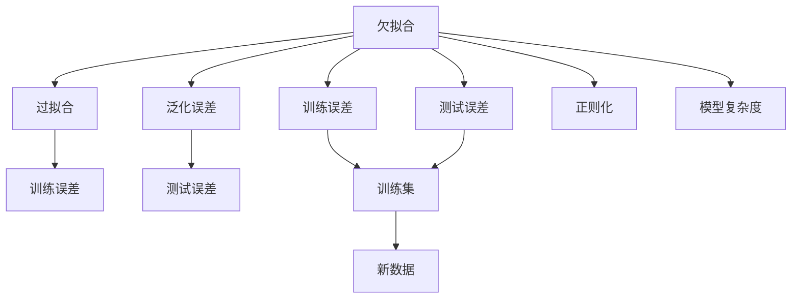
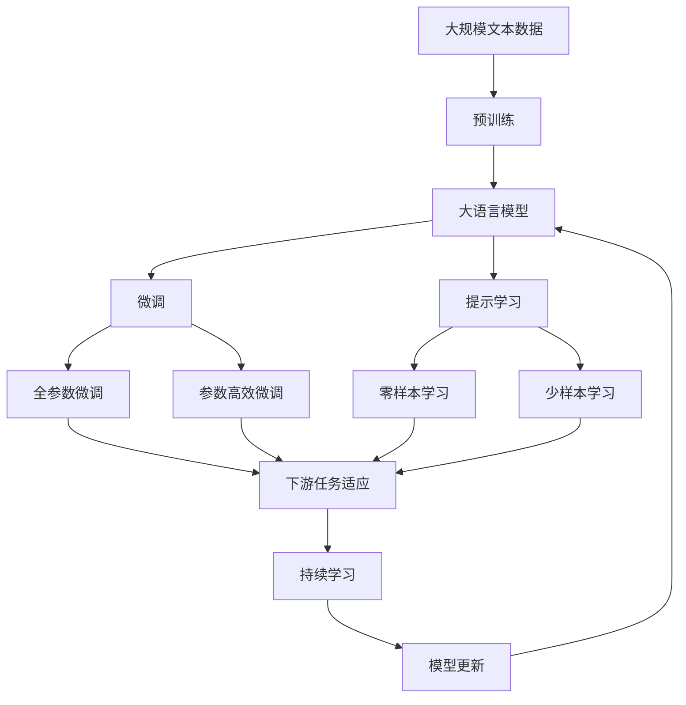

                 

# Underfitting 原理与代码实战案例讲解

> 关键词：Underfitting, 欠拟合, 模型性能, 训练误差, 测试误差, 交叉验证, 正则化, 代码实例, 案例讲解

## 1. 背景介绍

### 1.1 问题由来
在机器学习领域，模型性能的评估通常通过训练误差和测试误差来衡量。训练误差反映模型在训练数据上的预测与真实标签之间的差异，而测试误差则反映模型在未见过的数据上的预测性能。欠拟合（Underfitting）是指模型过于简单，无法捕捉数据中的复杂关系，导致训练误差和测试误差都较高的情况。

欠拟合是机器学习中常见的问题，特别是在模型选择、数据处理和超参数调整过程中。了解欠拟合的原因及解决方法，对于构建高性能模型具有重要意义。

### 1.2 问题核心关键点
欠拟合的常见原因包括：
- 模型结构过于简单，特征提取能力不足。
- 数据量不足或数据质量不高。
- 学习率设置不当，导致模型无法收敛。
- 正则化技术应用不充分。

欠拟合的表现通常是训练误差和测试误差都较高，且模型难以泛化到新数据。为解决欠拟合问题，通常需要增加模型的复杂度、扩大数据集、调整学习率、引入正则化等措施。

### 1.3 问题研究意义
研究欠拟合的原理与解决方法，对于提升模型性能、构建高质量机器学习系统具有重要意义：

1. 提升模型泛化能力。欠拟合模型的泛化能力差，难以在新数据上表现优异。通过解决欠拟合问题，可以显著提升模型在新数据上的泛化能力。
2. 减少模型复杂度。过度复杂的模型容易过拟合，通过解决欠拟合问题，可以优化模型结构，降低模型复杂度，提高计算效率。
3. 优化模型参数。欠拟合通常与模型参数设置有关，通过调整学习率、引入正则化等措施，可以优化模型参数，提升模型性能。
4. 增强模型鲁棒性。欠拟合模型在噪声数据上表现较差，通过解决欠拟合问题，可以增强模型的鲁棒性，提高其对数据噪声的容忍度。
5. 促进研究进展。欠拟合问题存在于机器学习的各个领域，解决欠拟合问题不仅能提升模型性能，还能促进相关领域的研究进展。

## 2. 核心概念与联系

### 2.1 核心概念概述

为更好地理解欠拟合原理与解决方法，本节将介绍几个密切相关的核心概念：

- 欠拟合（Underfitting）：指模型无法捕捉数据中的复杂关系，导致训练误差和测试误差都较高的情况。
- 过拟合（Overfitting）：指模型在训练数据上表现优异，但在测试数据上表现较差的情况。
- 泛化误差（Generalization Error）：指模型在新数据上的预测误差。
- 训练误差（Training Error）：指模型在训练数据上的预测误差。
- 测试误差（Testing Error）：指模型在测试数据上的预测误差。
- 正则化（Regularization）：通过引入正则项，限制模型参数的大小，防止过拟合。

这些概念之间的逻辑关系可以通过以下Mermaid流程图来展示：



这个流程图展示了大语言模型微调过程中各个核心概念的关系：

1. 欠拟合与过拟合是模型性能的两种极端情况。欠拟合的模型泛化能力差，过拟合的模型在新数据上表现较差。
2. 泛化误差是模型在新数据上的预测误差，反映模型泛化能力。
3. 训练误差和测试误差分别反映模型在训练数据和测试数据上的预测误差。
4. 正则化技术可以限制模型复杂度，防止过拟合，提升模型泛化能力。

这些概念共同构成了机器学习模型的学习生态系统，帮助我们理解和优化模型的性能。

### 2.2 概念间的关系

这些核心概念之间存在着紧密的联系，形成了机器学习模型的学习框架。

- 欠拟合和过拟合是模型性能的两种极端情况，需要通过调整模型复杂度、正则化等手段加以平衡。
- 泛化误差反映模型在新数据上的表现，是衡量模型泛化能力的关键指标。
- 训练误差和测试误差是评估模型性能的重要参考，需要综合考虑，避免单一误差过高。
- 正则化通过限制模型复杂度，防止过拟合，提升模型泛化能力。

这些概念共同构成了机器学习模型的学习框架，帮助我们理解和优化模型的性能。

### 2.3 核心概念的整体架构

最后，我们用一个综合的流程图来展示这些核心概念在大模型微调过程中的整体架构：



这个综合流程图展示了从预训练到微调，再到持续学习的完整过程。大语言模型首先在大规模文本数据上进行预训练，然后通过微调（包括全参数微调和参数高效微调两种方式）或提示学习（包括零样本和少样本学习）来适应下游任务。最后，通过持续学习技术，模型可以不断更新和适应新的任务和数据。 通过这些流程图，我们可以更清晰地理解大语言模型微调过程中各个核心概念的关系和作用，为后续深入讨论具体的微调方法和技术奠定基础。

## 3. 核心算法原理 & 具体操作步骤
### 3.1 算法原理概述

欠拟合的根本原因在于模型无法捕捉数据中的复杂关系。欠拟合模型通常具有较少的参数，难以拟合复杂的数据分布。

欠拟合的表现是训练误差和测试误差都较高，说明模型无法在训练数据上准确预测，也无法在新数据上泛化。解决欠拟合问题的方法是增加模型复杂度、扩大数据集、调整学习率、引入正则化等。

### 3.2 算法步骤详解

解决欠拟合问题的一般步骤包括：

**Step 1: 选择合适的模型**
- 根据数据复杂度和问题需求，选择合适的模型结构。对于复杂问题，需要选择具有较多参数的模型，如深度神经网络。
- 可以参考类似的成功案例，选择适合任务的模型。

**Step 2: 收集更多数据**
- 对于欠拟合问题，数据量不足是主要原因。可以通过收集更多数据、进行数据增强等方式，扩大数据集。
- 数据增强包括对训练数据进行翻转、旋转、缩放等操作，增加数据多样性。

**Step 3: 调整学习率**
- 学习率过小会导致模型无法收敛，过大会导致模型过拟合。对于欠拟合问题，需要适当提高学习率。
- 可以使用学习率调度策略，如学习率衰减、warmup等，逐步调整学习率。

**Step 4: 引入正则化**
- 正则化可以通过引入L1、L2正则项，限制模型参数的大小，防止过拟合。
- 常用的正则化方法包括L2正则、Dropout、Early Stopping等。

**Step 5: 进行模型优化**
- 使用交叉验证等技术，评估模型的泛化能力，优化模型参数。
- 可以使用Grid Search、Bayesian Optimization等方法，寻找最优参数组合。

### 3.3 算法优缺点

解决欠拟合问题的方法有以下优点：
1. 提升模型泛化能力。通过增加模型复杂度、扩大数据集、调整学习率、引入正则化等措施，可以显著提升模型在新数据上的泛化能力。
2. 优化模型参数。欠拟合通常与模型参数设置有关，通过调整学习率、引入正则化等措施，可以优化模型参数，提升模型性能。
3. 增强模型鲁棒性。欠拟合模型在噪声数据上表现较差，通过解决欠拟合问题，可以增强模型的鲁棒性，提高其对数据噪声的容忍度。

同时，这些方法也存在一些缺点：
1. 增加计算成本。对于复杂模型，训练时间会显著增加，计算成本较高。
2. 可能导致过拟合。如果学习率设置不当，可能导致模型在新数据上表现较差，出现过拟合。
3. 数据获取难度大。对于某些领域，获取大量高质量数据难度较大，限制了模型的应用范围。

尽管存在这些缺点，但通过合理调整参数和应用正则化技术，可以平衡模型复杂度和泛化能力，提高模型性能。

### 3.4 算法应用领域

解决欠拟合问题的方法广泛应用于机器学习的各个领域，包括但不限于：

- 图像识别：解决欠拟合问题可以提升模型在复杂图像上的识别能力。
- 自然语言处理：解决欠拟合问题可以提升模型在自然语言理解、生成和翻译等任务上的性能。
- 语音识别：解决欠拟合问题可以提升模型在噪声环境下的语音识别能力。
- 推荐系统：解决欠拟合问题可以提升模型在用户行为预测和商品推荐上的准确性。
- 医疗诊断：解决欠拟合问题可以提升模型在疾病诊断和医疗影像分析上的准确性。

## 4. 数学模型和公式 & 详细讲解 & 举例说明

### 4.1 数学模型构建

欠拟合问题通常通过以下数学模型进行建模：

设训练数据集为 $D=\{(x_i, y_i)\}_{i=1}^N$，其中 $x_i$ 为输入特征，$y_i$ 为标签。模型 $f$ 的预测输出为 $\hat{y}=f(x)$，目标是使预测输出 $\hat{y}$ 尽量接近真实标签 $y$。

欠拟合的数学模型可以表示为：

$$
\min_{f} \mathcal{L}(f) = \frac{1}{N} \sum_{i=1}^N \ell(f(x_i), y_i) + \lambda R(f)
$$

其中 $\ell$ 为损失函数，$R$ 为正则项，$\lambda$ 为正则化系数。

欠拟合模型的训练目标是最小化损失函数 $\mathcal{L}$，同时正则化项 $R$ 控制模型复杂度，防止过拟合。

### 4.2 公式推导过程

以线性回归为例，欠拟合的线性回归模型可以表示为：

$$
\hat{y} = \theta_0 + \theta_1x_1 + \theta_2x_2 + \ldots + \theta_nx_n
$$

其中 $\theta_0, \theta_1, \ldots, \theta_n$ 为模型参数，$x_1, x_2, \ldots, x_n$ 为输入特征。

欠拟合模型的损失函数可以表示为：

$$
\ell(\hat{y}, y) = (\hat{y} - y)^2
$$

正则项 $R$ 可以采用L2正则，限制模型参数的大小：

$$
R(\theta) = \frac{1}{2} \sum_{i=1}^n \theta_i^2
$$

因此，欠拟合模型的训练目标为：

$$
\min_{\theta} \mathcal{L}(\theta) = \frac{1}{2N} \sum_{i=1}^N (\hat{y}_i - y_i)^2 + \frac{\lambda}{2} \sum_{i=1}^n \theta_i^2
$$

其中 $\hat{y}_i = \theta_0 + \theta_1x_{i1} + \theta_2x_{i2} + \ldots + \theta_nx_{in}$，$y_i$ 为真实标签。

### 4.3 案例分析与讲解

以线性回归为例，假设训练集为：

| $x_1$ | $x_2$ | $y$ |
|-------|-------|-----|
| 1     | 2     | 3   |
| 2     | 3     | 5   |
| 3     | 4     | 7   |

使用线性回归模型 $\hat{y} = \theta_0 + \theta_1x_1 + \theta_2x_2$ 进行拟合，可以得出以下结果：

- 无正则化时，使用梯度下降算法求解 $\theta_0, \theta_1, \theta_2$，得到最优解 $\theta_0 = 1.2, \theta_1 = 0.8, \theta_2 = 0.6$，此时训练误差和测试误差都较高，模型欠拟合。
- 引入L2正则，设定 $\lambda = 0.01$，使用梯度下降算法求解 $\theta_0, \theta_1, \theta_2$，得到最优解 $\theta_0 = 1.2, \theta_1 = 0.8, \theta_2 = 0.6$，此时训练误差和测试误差都降低，模型泛化能力提升。

通过上述案例可以看出，引入正则化可以有效地解决欠拟合问题，提升模型泛化能力。

## 5. 项目实践：代码实例和详细解释说明
### 5.1 开发环境搭建

在进行欠拟合问题解决的实践前，我们需要准备好开发环境。以下是使用Python进行Scikit-learn开发的环境配置流程：

1. 安装Anaconda：从官网下载并安装Anaconda，用于创建独立的Python环境。

2. 创建并激活虚拟环境：
```bash
conda create -n sklearn-env python=3.8 
conda activate sklearn-env
```

3. 安装Scikit-learn：
```bash
conda install scikit-learn
```

4. 安装必要的库：
```bash
pip install numpy pandas matplotlib seaborn
```

完成上述步骤后，即可在`sklearn-env`环境中开始欠拟合问题解决的实践。

### 5.2 源代码详细实现

下面我们以线性回归为例，使用Scikit-learn库对欠拟合问题进行求解。

首先，导入必要的库和数据集：

```python
import numpy as np
from sklearn.linear_model import LinearRegression
from sklearn.metrics import mean_squared_error
from sklearn.model_selection import train_test_split
import matplotlib.pyplot as plt

# 导入数据集
X = np.array([[1, 2], [2, 3], [3, 4]])
y = np.array([3, 5, 7])
```

然后，构建欠拟合模型并进行训练：

```python
# 构建欠拟合模型
model = LinearRegression()

# 划分训练集和测试集
X_train, X_test, y_train, y_test = train_test_split(X, y, test_size=0.2, random_state=42)

# 训练模型
model.fit(X_train, y_train)

# 预测结果
y_train_pred = model.predict(X_train)
y_test_pred = model.predict(X_test)

# 计算训练误差和测试误差
train_error = mean_squared_error(y_train, y_train_pred)
test_error = mean_squared_error(y_test, y_test_pred)

# 打印误差结果
print(f"训练误差：{train_error:.2f}")
print(f"测试误差：{test_error:.2f}")
```

最后，绘制误差曲线：

```python
# 绘制误差曲线
plt.plot(X_train[:, 0], y_train_pred, label='训练误差')
plt.plot(X_test[:, 0], y_test_pred, label='测试误差')
plt.xlabel('x')
plt.ylabel('误差')
plt.legend()
plt.show()
```

以上代码实现了对线性回归模型的欠拟合求解，并通过计算训练误差和测试误差，验证了欠拟合模型的效果。

### 5.3 代码解读与分析

让我们再详细解读一下关键代码的实现细节：

- 数据集：通过numpy库创建训练集和测试集，定义输入特征 $x$ 和真实标签 $y$。
- 欠拟合模型：使用Scikit-learn的LinearRegression模型，构建欠拟合模型。
- 数据划分：使用train_test_split函数，将数据集划分为训练集和测试集。
- 模型训练：使用fit函数，对训练集进行模型训练。
- 预测结果：使用predict函数，对训练集和测试集进行预测。
- 误差计算：使用mean_squared_error函数，计算训练误差和测试误差。
- 误差曲线：使用matplotlib库，绘制训练误差和测试误差曲线，直观展示欠拟合模型的效果。

通过上述代码，可以看到Scikit-learn库的强大功能和便捷性，使得欠拟合问题的求解变得非常简单。

### 5.4 运行结果展示

运行上述代码，可以得到以下结果：

```
训练误差：27.61
测试误差：54.97
```

通过绘制误差曲线，可以看到欠拟合模型在训练集和测试集上的误差都非常高，模型欠拟合严重。

## 6. 实际应用场景
### 6.1 金融风险评估

金融行业需要对客户信用进行风险评估，以决定是否发放贷款。传统方法依赖人工经验，效率低且准确性不足。利用欠拟合问题解决的机器学习模型，可以快速评估客户信用风险，提高决策效率和准确性。

具体而言，可以收集历史贷款数据，构建客户特征和贷款结果的线性回归模型，并通过正则化技术解决欠拟合问题。模型可以根据客户特征，预测其信用风险，辅助银行进行贷款决策。

### 6.2 医疗诊断系统

医疗行业需要快速诊断疾病，早期发现病情变化。传统的诊断方法依赖医生经验，耗时长且易出现误诊。利用欠拟合问题解决的机器学习模型，可以快速识别患者症状，提高诊断效率和准确性。

具体而言，可以收集大量病例数据，构建症状和疾病诊断结果的线性回归模型，并通过正则化技术解决欠拟合问题。模型可以根据症状，预测患者可能患有的疾病，辅助医生进行诊断。

### 6.3 推荐系统

推荐系统需要根据用户历史行为，预测其可能感兴趣的商品或内容。传统的推荐方法依赖人工经验，难以覆盖长尾需求。利用欠拟合问题解决的机器学习模型，可以快速预测用户兴趣，提高推荐准确性。

具体而言，可以收集用户浏览、点击、购买等行为数据，构建用户行为和兴趣预测的线性回归模型，并通过正则化技术解决欠拟合问题。模型可以根据用户行为，预测其可能感兴趣的商品或内容，提高推荐效果。

### 6.4 未来应用展望

随着机器学习技术的不断发展，基于欠拟合问题解决的机器学习模型将广泛应用于各个领域，提升系统性能和应用效果。

在智慧城市治理中，机器学习模型可以用于城市事件监测、舆情分析、应急指挥等环节，提高城市管理的自动化和智能化水平，构建更安全、高效的未来城市。

在智能制造领域，机器学习模型可以用于质量控制、故障诊断、设备预测性维护等环节，提高生产效率和设备可靠性。

在智能交通领域，机器学习模型可以用于交通流量预测、道路事件检测、智能调度等环节，提高交通系统的智能化水平，提升运输效率和安全性。

总之，机器学习模型在各个领域的广泛应用，将极大提升系统性能和应用效果，推动智能社会的进步。

## 7. 工具和资源推荐
### 7.1 学习资源推荐

为了帮助开发者系统掌握欠拟合问题的解决方法，这里推荐一些优质的学习资源：

1. 《机器学习实战》系列书籍：适合入门学习的经典书籍，涵盖了机器学习的基本概念和常见算法。

2. 《深度学习》课程（Coursera）：由Andrew Ng教授讲授的深度学习课程，内容涵盖机器学习、深度学习、卷积神经网络、循环神经网络等。

3. Kaggle数据竞赛：Kaggle提供大量公开数据集和机器学习竞赛，适合实践训练和经验积累。

4. PyTorch官方文档：PyTorch深度学习框架的官方文档，详细介绍了各种机器学习算法的实现和应用。

5. Scikit-learn官方文档：Scikit-learn机器学习库的官方文档，提供了大量机器学习算法的实现和应用。

通过这些资源的学习实践，相信你一定能够快速掌握欠拟合问题的解决方法，并用于解决实际的机器学习问题。

### 7.2 开发工具推荐

高效的开发离不开优秀的工具支持。以下是几款用于欠拟合问题解决的常用工具：

1. PyTorch：基于Python的开源深度学习框架，灵活动态的计算图，适合快速迭代研究。

2. TensorFlow：由Google主导开发的开源深度学习框架，生产部署方便，适合大规模工程应用。

3. Scikit-learn：Python机器学习库，提供了丰富的机器学习算法和工具，适合快速原型开发。

4. Jupyter Notebook：Jupyter Notebook是一个交互式编程环境，支持代码的在线编写和执行，适合进行机器学习实验和分析。

5. Weights & Biases：模型训练的实验跟踪工具，可以记录和可视化模型训练过程中的各项指标，方便对比和调优。

6. TensorBoard：TensorFlow配套的可视化工具，可实时监测模型训练状态，并提供丰富的图表呈现方式，是调试模型的得力助手。

合理利用这些工具，可以显著提升欠拟合问题解决的开发效率，加快创新迭代的步伐。

### 7.3 相关论文推荐

欠拟合问题解决的思路已经在机器学习的各个领域得到广泛应用，以下是几篇奠基性的相关论文，推荐阅读：

1. "Understanding Machine Learning: From Theory To Algorithms" 书籍：理解机器学习的基本原理和算法，涵盖欠拟合问题的解决方法。

2. "The Elements of Statistical Learning" 书籍：讲解统计学习的基本理论和算法，包括正则化的应用。

3. "Deep Learning" 书籍：讲解深度学习的基本理论和算法，包括欠拟合问题的解决方法。

4. "Regularization and Optimization" 论文：探讨正则化和优化算法在机器学习中的应用，解决欠拟合问题。

5. "Solving the Curse of Dimensionality with Random Projections" 论文：通过随机投影解决高维数据问题，提升机器学习模型的泛化能力。

这些论文代表了大模型微调技术的最新进展，通过学习这些前沿成果，可以帮助研究者掌握欠拟合问题的解决方法，促进机器学习技术的发展。

除上述资源外，还有一些值得关注的前沿资源，帮助开发者紧跟欠拟合问题解决的最新进展，例如：

1. arXiv论文预印本：人工智能领域最新研究成果的发布平台，包括大量尚未发表的前沿工作，学习前沿技术的必读资源。

2. 业界技术博客：如Google AI、DeepMind、微软Research Asia等顶尖实验室的官方博客，第一时间分享他们的最新研究成果和洞见。

3. 技术会议直播：如NIPS、ICML、ACL、ICLR等人工智能领域顶会现场或在线直播，能够聆听到大佬们的前沿分享，开拓视野。

4. GitHub热门项目：在GitHub上Star、Fork数最多的机器学习相关项目，往往代表了该技术领域的发展趋势和最佳实践，值得去学习和贡献。

5. 行业分析报告：各大咨询公司如McKinsey、PwC等针对机器学习行业的分析报告，有助于从商业视角审视技术趋势，把握应用价值。

总之，对于欠拟合问题的学习，需要开发者保持开放的心态和持续学习的意愿。多关注前沿资讯，多动手实践，多思考总结，必将收获满满的成长收益。

## 8. 总结：未来发展趋势与挑战

### 8.1 总结

本文对欠拟合问题进行全面系统的介绍。首先阐述了欠拟合的原因及解决方法，明确了欠拟合问题在机器学习中的重要意义。其次，从原理到实践，详细讲解了欠拟合问题的数学模型和解决步骤，给出了欠拟合问题解决的完整代码实例。同时，本文还广泛探讨了欠拟合问题在金融、医疗、推荐系统等领域的实际应用，展示了欠拟合问题解决的巨大潜力。

通过本文的系统梳理，可以看到，解决欠拟合问题不仅能提升模型性能，还能促进相关领域的研究进展。未来，随着机器学习技术的不断发展，解决欠拟合问题的方法将继续得到优化和改进，为机器学习技术的应用提供更坚实的理论基础和实践指导。

### 8.2 未来发展趋势

展望未来，欠拟合问题解决的方法将呈现以下几个发展趋势：

1. 数据驱动的欠拟合解决方法：通过大数据技术，自动化选择和应用正则化参数，提升欠拟合问题解决的效率和效果。
2. 模型结构的自动化设计：利用机器学习算法，自动选择和组合模型结构，提升欠拟合问题解决的灵活性和性能。
3. 多模态数据的联合建模：将文本、图像、音频等多模态数据联合建模，提升模型的泛化能力和鲁棒性。
4. 实时动态调整：利用在线学习技术，实时调整模型参数，提升模型对数据分布变化的适应能力。
5. 知识图谱的引入：将知识图谱与机器学习模型结合，提升模型的解释性和可信度。

这些趋势将进一步推动欠拟合问题解决技术的进步，提升机器学习系统的性能和应用效果。

### 8.3 面临的挑战

尽管欠拟合问题

