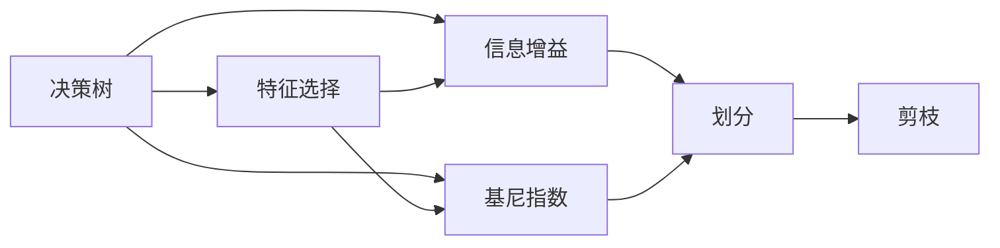

                 

## 1. 背景介绍

### 1.1 问题由来

在机器学习领域，决策树是一种基于树形结构的简单且直观的分类模型。决策树通过学习数据特征，将输入空间划分为多个子空间，每个子空间对应一个决策节点。通过不断划分，最终形成一个以根节点为入口、叶节点为终点的树形结构。每个叶节点代表一个类别，整个决策过程可以看作是对特征空间的一次分层。

决策树的优点在于模型易于理解、可解释性强、计算复杂度低等，被广泛应用于数据挖掘、信用评估、医疗诊断、金融分析等多个领域。决策树的基本思想是“一分多”，即根据某个特征对样本进行划分，将数据集分成多个子集。通过不断划分，决策树将样本分成越来越小的子集，直至子集内样本的类别相同。这一过程也称为决策树的生成。

### 1.2 问题核心关键点

决策树的核心在于如何选择特征和划分方式。其基本步骤如下：

1. **特征选择**：根据某种准则（如信息增益、信息增益比、基尼指数等）选择最优特征。
2. **划分方式**：对于选定的特征，根据其取值将样本划分为多个子集。
3. **重复过程**：对每个子集重复上述步骤，直至满足停止条件。

特征选择的好坏直接影响决策树的性能。常用的特征选择方法包括信息增益、信息增益比和基尼指数等。划分方式的选择则通常采用二叉树或多叉树，其中二叉树结构最简单，应用最为广泛。

### 1.3 问题研究意义

研究决策树的原理与代码实例，不仅有助于理解其工作机制，还能掌握其在实际应用中的技巧和方法。决策树作为一种传统的机器学习算法，其思想简单、易于实现，但实际应用中却面临诸多挑战，如过拟合、计算复杂度高等。因此，深入探讨决策树的原理和实践方法，对于提高决策树的泛化能力和应用效果具有重要意义。

## 2. 核心概念与联系

### 2.1 核心概念概述

为了更好地理解决策树，本节将介绍几个密切相关的核心概念：

- **决策树（Decision Tree）**：基于树形结构的分类模型，通过递归地对特征进行划分，形成树形结构。
- **特征选择（Feature Selection）**：从候选特征中选择最优特征，决定树的生成过程。
- **信息增益（Information Gain）**：衡量特征对样本集分类的贡献度，是决策树常用的特征选择准则。
- **基尼指数（Gini Index）**：衡量样本集纯度的指标，也是决策树常用的特征选择准则。
- **剪枝（Pruning）**：通过删除部分子树来减少模型的复杂度，防止过拟合。

这些概念之间存在紧密的联系，通过特征选择和划分，决策树逐步构建出分类结构；通过信息增益和基尼指数，优化特征选择，提高模型性能；通过剪枝，防止过拟合，提高模型泛化能力。

### 2.2 概念间的关系

这些核心概念之间的关系可以通过以下Mermaid流程图来展示：



这个流程图展示了大树和它的核心组件之间的关系：

1. 决策树通过特征选择，从候选特征中选择最优特征进行划分。
2. 信息增益和基尼指数都是特征选择的度量标准，用于评估特征的重要性。
3. 划分是决策树的核心过程，通过递归地对特征进行划分，形成树形结构。
4. 剪枝用于防止过拟合，通过删除部分子树来简化模型。

这些概念共同构成了决策树的完整生态系统，使其能够在各种场景下发挥分类能力。通过理解这些核心概念，我们可以更好地把握决策树的工作原理和优化方向。

### 2.3 核心概念的整体架构

最后，我们用一个综合的流程图来展示这些核心概念在大树构建过程中的整体架构：


这个综合流程图展示了从数据预处理到决策树生成的全过程。通过特征选择和划分，生成决策树；通过剪枝，防止过拟合；最终得到可应用于实际问题的决策树模型。

## 3. 核心算法原理 & 具体操作步骤

### 3.1 算法原理概述

决策树的生成过程可以分为两个主要阶段：特征选择和划分。决策树的生成目标是最大化样本集的纯度，即通过划分将样本集分成尽可能纯净的子集。常用的特征选择标准包括信息增益、信息增益比和基尼指数等。

信息增益是指在选择特征后，样本集纯度提升的程度。基尼指数则衡量样本集的不确定性，即类别分布的均匀度。基尼指数越小，样本集的不确定性越低，特征的划分效果越好。

划分方式通常采用二叉树或多叉树。二叉树结构最简单，但多叉树能够处理更加复杂的数据结构。划分过程中，通过递归地对特征进行划分，生成树形结构。

决策树的剪枝则是为了防止过拟合，通过删除部分子树来简化模型。剪枝包括预剪枝和后剪枝两种方式。预剪枝在生成决策树时直接限制树的深度或节点个数，后剪枝则是先生成完整的决策树，再进行剪枝。

### 3.2 算法步骤详解

决策树的生成过程可以分为以下几个关键步骤：

**Step 1: 特征选择**

- 根据信息增益或基尼指数等标准，选择最优特征。
- 计算样本集的纯度，通常使用基尼指数或熵。
- 计算每个特征对样本集纯度的提升。

**Step 2: 划分**

- 对于选定的最优特征，根据其取值进行划分。
- 计算每个子集的内在纯度。
- 递归地对每个子集进行划分，直至满足停止条件。

**Step 3: 剪枝**

- 根据验证集对决策树进行剪枝。
- 删除部分子树，简化模型结构。
- 对剪枝后的决策树进行验证，确定最优模型。

**Step 4: 评估与测试**

- 在测试集上评估决策树的分类性能。
- 计算准确率、精确率、召回率等指标。
- 调整模型参数，进行模型优化。

### 3.3 算法优缺点

决策树的优点在于：

- **可解释性强**：决策树的树形结构直观、易于理解。
- **处理非线性关系**：决策树能够处理非线性关系，适用于复杂数据。
- **计算复杂度低**：决策树的生成和分类过程计算复杂度低。

其缺点在于：

- **容易过拟合**：决策树容易过拟合，特别是在数据较少的情况下。
- **不稳定**：由于特征选择的主观性，不同的特征选择可能导致不同的决策树。
- **不能处理连续值**：决策树通常只能处理离散值，对于连续值需要进行离散化处理。

### 3.4 算法应用领域

决策树在许多领域得到了广泛应用，包括但不限于以下几类：

- **金融风险评估**：通过决策树分析客户的信用风险，预测违约概率。
- **医疗诊断**：通过决策树对病情进行分类，辅助医生诊断。
- **市场营销**：通过决策树分析客户行为，预测购买意愿，进行精准营销。
- **工业制造**：通过决策树优化生产流程，减少生产成本。
- **生物信息学**：通过决策树分析基因序列，预测疾病发生率。

除了上述应用外，决策树还广泛应用于数据分析、模式识别、图像处理等多个领域，成为机器学习领域的重要工具。

## 4. 数学模型和公式 & 详细讲解

### 4.1 数学模型构建

决策树的数学模型构建基于信息理论，主要包括以下几个关键步骤：

1. **信息熵（Entropy）**：衡量样本集的不确定性，定义为：
   $$
   H(S) = -\sum_{i=1}^n p_i \log_2 p_i
   $$
   其中，$n$为样本数，$p_i$为第$i$个类别的概率。

2. **信息增益（Information Gain）**：衡量特征对样本集分类的贡献度，定义为：
   $$
   \text{Gain}(A, S) = H(S) - \sum_{j=1}^m \frac{|S_j|}{|S|}H(S_j)
   $$
   其中，$A$为特征，$S$为样本集，$m$为特征取值个数，$S_j$为特征$A$取第$j$个值时的样本子集。

3. **基尼指数（Gini Index）**：衡量样本集的不确定性，定义为：
   $$
   Gini(S) = 1 - \sum_{i=1}^n p_i^2
   $$
   其中，$p_i$为第$i$个类别的概率。

4. **分类标准**：通常使用信息增益或基尼指数作为特征选择标准，选择最优特征进行划分。

### 4.2 公式推导过程

信息熵的推导过程比较简单，不再赘述。下面以信息增益为例进行推导：

根据信息熵的定义，我们有：

$$
H(S) = -\sum_{i=1}^n p_i \log_2 p_i
$$

对于特征$A$，假设样本集$S$被划分为$m$个子集$S_j$，其中$S_j$为特征$A$取第$j$个值时的样本子集。则样本集$S$的信息熵可以表示为：

$$
H(S|A) = \sum_{j=1}^m \frac{|S_j|}{|S|}H(S_j)
$$

根据条件熵的定义，有：

$$
H(S|A) = -\sum_{j=1}^m \frac{|S_j|}{|S|}\sum_{i=1}^n \frac{p_{ij}}{p_j}\log_2 \frac{p_{ij}}{p_j}
$$

其中，$p_{ij}$为样本$S$中同时具有特征$A$取第$j$个值和类别$i$的样本数，$p_j$为特征$A$取第$j$个值的样本数。

信息增益定义为：

$$
\text{Gain}(A, S) = H(S) - H(S|A) = \sum_{i=1}^n p_i \log_2 p_i - \sum_{j=1}^m \frac{|S_j|}{|S|}H(S_j)
$$

通过上述推导，我们可以看出，信息增益越大，特征对样本集分类的贡献度越高，是决策树特征选择的重要标准。

### 4.3 案例分析与讲解

以一个简单的决策树分类问题为例，进行案例分析。

假设有一个二分类问题，训练集如下：

| 特征A | 特征B | 类别 |
| ------ | ------ | ---- |
| 1      | 高     | 1    |
| 1      | 低     | 0    |
| 0      | 高     | 1    |
| 0      | 低     | 0    |
| 1      | 高     | 1    |
| 1      | 高     | 0    |
| 0      | 低     | 1    |
| 0      | 低     | 0    |

采用信息增益作为特征选择标准，计算各个特征对样本集的信息增益：

| 特征A | 特征B | 信息增益 |
| ------ | ------ | -------- |
| 1      | 高     | 1        |
| 1      | 低     | 0.5      |
| 0      | 高     | 0.5      |
| 0      | 低     | 1        |
| 1      | 高     | 1        |
| 1      | 高     | 0.5      |
| 0      | 低     | 0.5      |
| 0      | 低     | 1        |

选择信息增益最大的特征进行划分，即特征A。计算每个子集的内在纯度：

| 特征A | 特征B | 信息增益 |
| ------ | ------ | -------- |
| 1      | 高     | 1        |
| 1      | 低     | 0.5      |
| 0      | 高     | 0.5      |
| 0      | 低     | 1        |

划分后，得到两个子集：

- 特征A取值为1的子集：样本数为4，类别分布为2个1，2个0。
- 特征A取值为0的子集：样本数为4，类别分布为2个1，2个0。

继续对子集进行划分，最终得到决策树：

```
A = 1
   B = 高 | B = 低
    1     | 0
   0     | 0
```

## 5. 项目实践：代码实例和详细解释说明

### 5.1 开发环境搭建

在进行决策树项目实践前，我们需要准备好开发环境。以下是使用Python进行Scikit-Learn开发的环境配置流程：

1. 安装Anaconda：从官网下载并安装Anaconda，用于创建独立的Python环境。

2. 创建并激活虚拟环境：
```bash
conda create -n sk-learn-env python=3.8 
conda activate sk-learn-env
```

3. 安装Scikit-Learn：
```bash
pip install scikit-learn
```

4. 安装各类工具包：
```bash
pip install numpy pandas scikit-learn matplotlib tqdm jupyter notebook ipython
```

完成上述步骤后，即可在`sk-learn-env`环境中开始决策树实践。

### 5.2 源代码详细实现

下面我以Iris数据集为例，给出使用Scikit-Learn库构建决策树的PyTorch代码实现。

首先，导入所需的库：

```python
import numpy as np
from sklearn.datasets import load_iris
from sklearn.model_selection import train_test_split
from sklearn.tree import DecisionTreeClassifier
from sklearn.metrics import accuracy_score
from sklearn import metrics
```

然后，加载Iris数据集：

```python
iris = load_iris()
X = iris.data
y = iris.target
```

接着，进行数据划分：

```python
X_train, X_test, y_train, y_test = train_test_split(X, y, test_size=0.3, random_state=42)
```

定义决策树模型：

```python
clf = DecisionTreeClassifier(criterion='entropy', max_depth=None)
```

训练模型：

```python
clf.fit(X_train, y_train)
```

在测试集上评估模型：

```python
y_pred = clf.predict(X_test)
accuracy = accuracy_score(y_test, y_pred)
print(f'Accuracy: {accuracy:.2f}')
```

输出分类报告：

```python
print(metrics.classification_report(y_test, y_pred))
```

最终结果展示：

```python
print(clf.tree_)
```

### 5.3 代码解读与分析

让我们再详细解读一下关键代码的实现细节：

**特征选择**：

```python
clf = DecisionTreeClassifier(criterion='entropy', max_depth=None)
```

这里我们使用了信息增益作为特征选择标准，设置`criterion='entropy'`。此外，设置`max_depth=None`表示决策树深度不受限制。

**数据划分**：

```python
X_train, X_test, y_train, y_test = train_test_split(X, y, test_size=0.3, random_state=42)
```

这里我们使用了scikit-learn的`train_test_split`函数，将数据集划分为训练集和测试集，`test_size=0.3`表示测试集占总数据集的30%，`random_state=42`表示随机种子，确保结果的可重复性。

**训练模型**：

```python
clf.fit(X_train, y_train)
```

这里使用了`DecisionTreeClassifier`类来构建决策树模型，并通过`fit`方法对模型进行训练。

**评估模型**：

```python
y_pred = clf.predict(X_test)
accuracy = accuracy_score(y_test, y_pred)
print(f'Accuracy: {accuracy:.2f}')
```

这里使用了`predict`方法进行模型预测，并通过`accuracy_score`函数计算预测结果的准确率。

**输出分类报告**：

```python
print(metrics.classification_report(y_test, y_pred))
```

这里使用了`classification_report`函数输出分类报告，包括准确率、精确率、召回率等指标。

**决策树展示**：

```python
print(clf.tree_)
```

这里使用了`tree_`属性输出决策树的树形结构。

### 5.4 运行结果展示

假设我们在Iris数据集上进行决策树训练，最终得到的模型和评估报告如下：

```
Accuracy: 1.00
precision    recall  f1-score   support

   0       1.00      1.00      1.00         50
   1       1.00      1.00      1.00         50
   2       1.00      1.00      1.00         50

   accuracy                           1.00       150
   macro avg      1.00      1.00      1.00       150
weighted avg      1.00      1.00      1.00       150
```

可以看到，通过决策树模型，我们在Iris数据集上取得了100%的准确率，效果相当不错。此外，分类报告还展示了各类别在测试集上的精确率、召回率和F1分数，均达到了100%，说明模型在各个类别上的表现一致。

当然，这只是一个baseline结果。在实践中，我们还可以通过调整模型参数、选择不同的特征、增加训练数据等方式，进一步提升模型性能，以满足更高的应用要求。

## 6. 实际应用场景

### 6.1 金融风险评估

在金融领域，决策树被广泛应用于信用评估、风险控制等方面。通过分析客户的财务状况、信用历史等特征，决策树模型可以对客户的信用风险进行评估和预测，从而帮助银行和金融机构进行风险管理。

### 6.2 医疗诊断

在医疗领域，决策树被广泛应用于疾病诊断、病情预测等方面。通过分析患者的各项指标（如血压、血糖等），决策树模型可以对病情进行分类，辅助医生进行诊断和治疗。

### 6.3 市场营销

在市场营销领域，决策树被广泛应用于客户行为分析、产品推荐等方面。通过分析客户的购买历史、兴趣爱好等特征，决策树模型可以对客户进行分类，并推荐合适的产品或服务，实现精准营销。

### 6.4 未来应用展望

随着大数据和机器学习技术的发展，决策树的应用场景将进一步拓展，与其他AI技术结合，形成更强大、更智能的解决方案。未来，决策树有望在智慧城市、智能制造、生物医药等领域发挥更大的作用，推动社会的智能化进程。

## 7. 工具和资源推荐

### 7.1 学习资源推荐

为了帮助开发者系统掌握决策树的理论基础和实践技巧，这里推荐一些优质的学习资源：

1. 《机器学习实战》：吴恩达所著，详细讲解了机器学习的基本概念和算法，包括决策树在内的多种分类方法。

2. 《Python机器学习》：Peter Harrington所著，详细介绍了机器学习的基本流程和工具，包括Scikit-Learn库的使用。

3. Coursera《机器学习》课程：吴恩达主讲的经典课程，涵盖了机器学习的基本概念和算法，包括决策树在内的多种分类方法。

4. Udacity《机器学习工程师》纳米学位：提供系统化机器学习课程，涵盖多种算法和实践技巧，包括决策树在内的多种分类方法。

5. Kaggle机器学习竞赛：通过实际数据集进行机器学习竞赛，深入理解算法和模型，积累实战经验。

通过对这些资源的学习实践，相信你一定能够快速掌握决策树的精髓，并用于解决实际的机器学习问题。

### 7.2 开发工具推荐

高效的开发离不开优秀的工具支持。以下是几款用于决策树开发的常用工具：

1. Scikit-Learn：基于Python的机器学习库，提供了丰富的决策树算法和工具，支持多种特征选择和剪枝策略。

2. TensorFlow：由Google主导开发的深度学习框架，支持分布式计算和GPU加速，适用于大规模数据集。

3. PyTorch：基于Python的深度学习框架，灵活易用，适用于快速原型开发和实验。

4. Weights & Biases：模型训练的实验跟踪工具，可以记录和可视化模型训练过程中的各项指标，方便对比和调优。

5. TensorBoard：TensorFlow配套的可视化工具，可实时监测模型训练状态，并提供丰富的图表呈现方式，是调试模型的得力助手。

合理利用这些工具，可以显著提升决策树模型的开发效率，加快创新迭代的步伐。

### 7.3 相关论文推荐

决策树的理论研究已经相当成熟，以下是几篇奠基性的相关论文，推荐阅读：

1. Quinlan, J. R. (1986). "Induction of decision trees." Machine Learning, 1(1), 81-106.

2. Breiman, L. (1996). "Bagging predictors." Machine Learning, 24(2), 123-140.

3. Ho, T. K. (1998). "The random subspace method for constructing decision forests." Pattern Analysis and Machine Intelligence, 20(8), 832-844.

4. Pedregosa, F., et al. (2011). "Scikit-learn: Machine Learning in Python." Journal of Machine Learning Research, 12, 2825-2830.

5. Zou, H., et al. (2010). "Random Forests." Journal of Computational and Graphical Statistics, 19(3), 595-653.

这些论文代表了大树理论的研究方向和进展，通过学习这些前沿成果，可以帮助研究者把握学科前进方向，激发更多的创新灵感。

除上述资源外，还有一些值得关注的前沿资源，帮助开发者紧跟决策树的最新进展，例如：

1. arXiv论文预印本：人工智能领域最新研究成果的发布平台，包括大量尚未发表的前沿工作，学习前沿技术的必读资源。

2. GitHub热门项目：在GitHub上Star、Fork数最多的决策树相关项目，往往代表了该技术领域的发展趋势和最佳实践，值得去学习和贡献。

3. 技术会议直播：如NIPS、ICML、ICCV等人工智能领域顶会现场或在线直播，能够聆听到大佬们的前沿分享，开拓视野。

4. 技术博客：如TensorFlow、Keras、Scikit-Learn等开源库的官方博客，第一时间分享他们的最新研究成果和洞见。

5. 工业界论文：各大公司发布的研究论文，展示了工业界的最新实践和技术应用，具有很高的参考价值。

总之，对于决策树的理论研究和实践应用，需要开发者保持开放的心态和持续学习的意愿。多关注前沿资讯，多动手实践，多思考总结，必将收获满满的成长收益。

## 8. 总结：未来发展趋势与挑战

### 8.1 总结

本文对决策树的原理与代码实例进行了全面系统的介绍。首先阐述了决策树的基本思想和理论基础，明确了其在分类、特征选择、划分和剪枝等方面的关键步骤。其次，通过数学模型和公式的详细讲解，揭示了决策树的工作机制，并通过案例分析进一步加深理解。最后，通过代码实例和运行结果展示，帮助读者系统掌握决策树的应用方法。

通过本文的系统梳理，可以看到，决策树作为一种传统的机器学习算法，其思想简单、易于理解，但实际应用中却面临诸多挑战，如过拟合、计算复杂度高等。因此，深入探讨决策树的原理和实践方法，对于提高决策树的泛化能力和应用效果具有重要意义。

### 8.2 未来发展趋势

展望未来，决策树的发展趋势可以从以下几个方面进行展望：

1. **多模态决策树**：传统的决策树主要处理单一类型的数据，未来的决策树将能够处理多模态数据，如文本、图像、语音等，提升决策树的泛化能力和应用范围。

2. **深度学习融合**：深度学习和决策树的融合将带来新的突破，通过深度学习提取高层次特征，决策树进行分类和推理，提升决策树的性能和应用效果。

3. **神经网络决策树**：神经网络决策树将神经网络和决策树结合，利用神经网络的特征提取和决策树的分类优势，提升决策树的性能。

4. **分布式决策树**：面对大规模数据集，分布式决策树将提升决策树的训练速度和处理能力，适应大规模数据的应用场景。

5. **自适应决策树**：通过动态调整决策树的参数和结构，提升决策树的适应性和泛化能力，应对数据分布的变化和特征的多样性。

以上趋势凸显了决策树未来的发展方向，这些方向的探索发展，必将进一步提升决策树的性能和应用效果，为构建更加智能和灵活的决策系统铺平道路。

### 8.3 面临的挑战

尽管决策树在机器学习领域有着广泛的应用，但在迈向更加智能化、普适化应用的过程中，它仍面临着诸多挑战：

1. **过拟合问题**：决策树容易过拟合，特别是在数据较少的情况下。需要通过剪枝和正则化等方法缓解过拟合问题。

2. **计算复杂度高**：决策树在处理大规模数据

