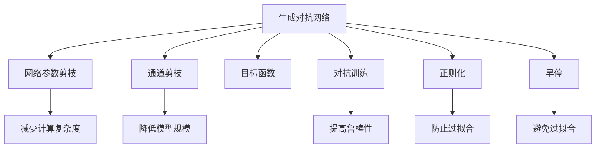
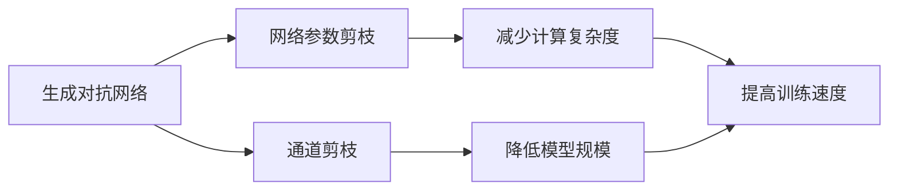
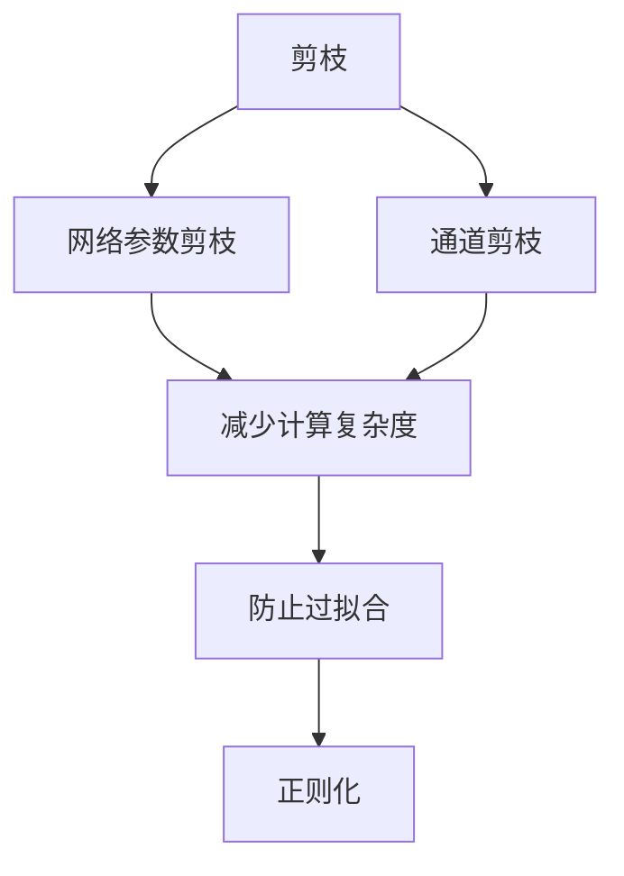
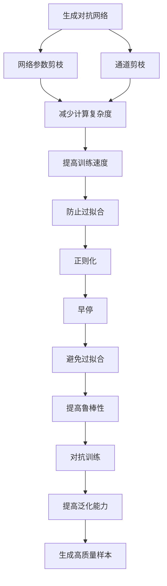

                 

# 剪枝技术在生成对抗网络中的探索

## 1. 背景介绍

在深度学习领域，生成对抗网络（GANs）以其强大的图像生成和增强能力，已经成为计算机视觉、图像处理等领域的重要工具。GANs由一个生成器（Generator）和一个判别器（Discriminator）组成，两个模型通过对抗博弈的方式不断迭代，生成器试图生成尽可能真实的图像，而判别器则试图将生成的图像与真实图像区分开来。

然而，GANs模型通常具有大量的参数，训练过程复杂，且容易发生梯度消失等问题，导致训练过程耗时耗力且效果不理想。为了解决这个问题，剪枝技术逐渐被引入到GANs中，旨在通过减少模型参数，提高模型训练和推理的速度，同时保持模型的性能。

剪枝技术的引入，不仅能够降低模型的计算复杂度，还能提高模型的泛化能力和鲁棒性，因此逐渐成为GANs研究的一个重要方向。本文将系统介绍剪枝技术在GANs中的基本原理和具体实现方法，并分析其在实际应用中的优缺点。

## 2. 核心概念与联系

### 2.1 核心概念概述

为了更好地理解剪枝技术在GANs中的应用，本节将介绍几个密切相关的核心概念：

- **生成对抗网络（GANs）**：由生成器（Generator）和判别器（Discriminator）组成的对抗博弈模型，用于生成逼真的图像、视频、音频等。
- **剪枝（Pruning）**：通过删除模型中的冗余参数，减小模型大小，提高模型训练和推理速度的技术。
- **网络参数剪枝（Network Parameter Pruning）**：删除模型中无用的连接，减小模型参数数量，从而降低计算复杂度。
- **通道剪枝（Channel Pruning）**：针对卷积神经网络（CNN）的剪枝方法，通过减少卷积核的输出通道数，减小模型的计算复杂度。
- **目标函数（Loss Function）**：用于衡量生成器和判别器性能的损失函数，常见的有交叉熵损失、均方误差损失等。
- **对抗训练（Adversarial Training）**：通过引入对抗样本，提高模型的鲁棒性和泛化能力。
- **正则化（Regularization）**：防止过拟合的常用技术，包括L1、L2正则化、Dropout等。
- **早停（Early Stopping）**：用于防止模型过拟合的训练策略，当模型在验证集上表现不佳时停止训练。
- **迁移学习（Transfer Learning）**：将一个领域学习到的知识迁移到另一个领域，提升模型在新领域的性能。

这些核心概念之间的逻辑关系可以通过以下Mermaid流程图来展示：



这个流程图展示了剪枝技术在GANs中的基本流程和作用：

1. 生成对抗网络通过对抗训练，提高生成器和判别器的性能。
2. 网络参数剪枝和通道剪枝减小模型规模，降低计算复杂度。
3. 目标函数和正则化技术防止过拟合。
4. 早停策略防止过拟合。
5. 剪枝技术和对抗训练、正则化等方法协同工作，共同提升模型性能。

### 2.2 概念间的关系

这些核心概念之间存在着紧密的联系，形成了GANs中的完整生态系统。下面我们通过几个Mermaid流程图来展示这些概念之间的关系。

#### 2.2.1 GANs的剪枝流程



这个流程图展示了GANs的剪枝流程，从生成器和判别器中分别进行网络参数剪枝和通道剪枝，以减少模型参数和计算复杂度，提高训练速度。

#### 2.2.2 剪枝与对抗训练的关系


这个流程图展示了剪枝与对抗训练的关系。通过网络参数剪枝和通道剪枝，减小模型规模和计算复杂度，有助于对抗训练，提高模型的鲁棒性和泛化能力。

#### 2.2.3 剪枝与正则化的关系



这个流程图展示了剪枝与正则化的关系。通过剪枝减少模型参数，有助于防止过拟合，而正则化技术则进一步防止过拟合，确保模型的泛化能力。

### 2.3 核心概念的整体架构

最后，我们用一个综合的流程图来展示这些核心概念在大语言模型微调过程中的整体架构：



这个综合流程图展示了剪枝技术在GANs中的应用流程，从网络参数剪枝和通道剪枝，到提高训练速度、防止过拟合、提高鲁棒性，最终通过对抗训练和正则化技术，提高模型的泛化能力和生成高质量样本的能力。

## 3. 核心算法原理 & 具体操作步骤

### 3.1 算法原理概述

在GANs中应用剪枝技术，旨在通过减少模型参数，减小计算复杂度，从而提高模型的训练和推理速度，同时保持模型的性能。剪枝技术主要分为以下两类：

- **网络参数剪枝**：删除模型中的冗余参数，减小模型大小。
- **通道剪枝**：针对卷积神经网络（CNN）的剪枝方法，通过减少卷积核的输出通道数，减小模型的计算复杂度。

网络参数剪枝和通道剪枝的原理相同，均通过设定剪枝阈值，删除模型中权重值较小的参数，从而达到减少模型参数的目的。剪枝后，生成器和判别器的参数数量减少，计算复杂度降低，训练和推理速度加快。

### 3.2 算法步骤详解

基于剪枝技术的GANs训练流程主要包括以下几个关键步骤：

**Step 1: 准备剪枝数据和模型**

- 准备训练数据集和模型权重文件，选择剪枝算法和剪枝阈值。
- 加载模型权重，并将其转化为剪枝算法所需的格式。

**Step 2: 执行剪枝**

- 根据设定的剪枝算法和剪枝阈值，删除模型中的冗余参数。
- 保留权重值大于阈值的参数，减小模型大小。
- 将剪枝后的模型权重保存，供后续训练使用。

**Step 3: 微调和优化**

- 使用剪枝后的模型权重，重新进行微调，优化模型性能。
- 通过对抗训练和正则化技术，进一步提升模型的鲁棒性和泛化能力。
- 在训练过程中，使用早停策略，防止过拟合。

**Step 4: 评估和测试**

- 在测试集上评估剪枝后模型的性能。
- 对比剪枝前后的模型，评估剪枝效果和性能提升。

### 3.3 算法优缺点

剪枝技术在GANs中的应用，具有以下优点：

- **减少计算复杂度**：通过剪枝减少模型参数，降低计算复杂度，提高模型训练和推理速度。
- **提高模型泛化能力**：剪枝有助于防止过拟合，提高模型的泛化能力和鲁棒性。
- **降低内存占用**：剪枝后，模型参数减少，内存占用降低，便于部署和存储。

但剪枝技术也存在一些缺点：

- **剪枝阈值的选择**：剪枝效果的优劣与剪枝阈值的选择密切相关，选择合适的阈值是剪枝的关键。
- **模型性能下降**：部分重要参数可能被剪枝，导致模型性能下降，需要在剪枝和性能之间取得平衡。
- **计算开销较大**：剪枝算法本身需要计算额外的开销，且剪枝过程可能需要多次迭代。

### 3.4 算法应用领域

剪枝技术在GANs中的应用，可以应用于多种场景，例如：

- **图像生成**：通过剪枝提高图像生成模型的训练和推理速度，生成更高质量的图像。
- **视频生成**：通过剪枝提高视频生成模型的性能，减少计算复杂度。
- **音频生成**：通过剪枝提高音频生成模型的性能，降低计算开销。
- **文本生成**：通过剪枝提高文本生成模型的性能，生成更高质量的文章和对话。

除了以上场景，剪枝技术还可以应用于GANs中的对抗样本生成、图像风格转换、图像修复等任务，为不同领域的应用提供强大的技术支持。

## 4. 数学模型和公式 & 详细讲解 & 举例说明

### 4.1 数学模型构建

在GANs中，剪枝的数学模型构建主要涉及以下几个部分：

- **生成器模型**：用于生成逼真的图像，通常为卷积神经网络（CNN）。
- **判别器模型**：用于区分生成图像和真实图像，通常为全连接神经网络。
- **剪枝阈值**：用于衡量参数的重要性，设定阈值，删除权重值较小的参数。
- **目标函数**：用于衡量生成器和判别器的性能，常见的有交叉熵损失、均方误差损失等。

### 4.2 公式推导过程

以下我们以网络参数剪枝为例，推导剪枝过程的数学公式。

假设生成器模型为 $G(\theta)$，判别器模型为 $D(\phi)$，其中 $\theta$ 和 $\phi$ 分别为生成器和判别器的权重向量。目标函数为交叉熵损失：

$$
L(G, D) = \mathbb{E}_x [\log D(x)] + \mathbb{E}_z [\log (1 - D(G(z)))]
$$

其中 $x$ 为真实图像，$z$ 为噪声向量。

剪枝过程通过设定剪枝阈值 $\lambda$，删除权重值小于 $\lambda$ 的参数。生成器模型的剪枝过程如下：

1. 计算生成器模型 $G(\theta)$ 中每个参数 $w_i$ 的权重值。
2. 根据剪枝阈值 $\lambda$，保留权重值大于 $\lambda$ 的参数 $w_i$。
3. 将保留的参数重新组合，更新生成器模型的权重向量 $\theta$。

剪枝后的生成器模型权重 $\theta'$ 可以表示为：

$$
\theta' = \{w_i | w_i > \lambda\}
$$

判别器模型的剪枝过程类似，通过保留权重值大于 $\lambda$ 的参数，减小模型规模。

### 4.3 案例分析与讲解

以下我们以MNIST手写数字生成任务为例，演示剪枝技术在GANs中的应用。

**Step 1: 准备数据和模型**

首先，我们加载MNIST数据集，定义生成器和判别器模型：

```python
from tensorflow.keras.datasets import mnist
from tensorflow.keras.layers import Input, Dense, Dropout
from tensorflow.keras.models import Model

# 加载MNIST数据集
(x_train, y_train), (x_test, y_test) = mnist.load_data()

# 将数据归一化到[-1, 1]
x_train = (x_train.astype(np.float32) - 127.5) / 127.5
x_test = (x_test.astype(np.float32) - 127.5) / 127.5

# 定义生成器和判别器模型
input_size = 784
z_dim = 100
img_dim = 28 * 28
g_input = Input(shape=(z_dim,))
g_dense1 = Dense(256, activation='relu')(g_input)
g_dropout = Dropout(0.5)(g_dense1)
g_dense2 = Dense(img_dim, activation='tanh')(g_dropout)
g_output = g_dense2
g_model = Model(inputs=[g_input], outputs=[g_output])

d_input = Input(shape=(img_dim,))
d_dense1 = Dense(256, activation='relu')(d_input)
d_dropout = Dropout(0.5)(d_dense1)
d_output = Dense(1, activation='sigmoid')(d_dropout)
d_model = Model(inputs=[d_input], outputs=[d_output])

# 定义目标函数和优化器
g_loss = binary_crossentropy
d_loss = binary_crossentropy
g_optimizer = Adam(learning_rate=0.0002)
d_optimizer = Adam(learning_rate=0.0002)
```

**Step 2: 执行剪枝**

我们使用PyTorch的剪枝工具进行剪枝，删除权重值小于剪枝阈值的参数。具体实现如下：

```python
import torch
from torch.nn import Module

class PruneModel(Module):
    def __init__(self, model, threshold):
        super(PruneModel, self).__init__()
        self.model = model
        self.threshold = threshold
        self.mask = None

    def forward(self, *args, **kwargs):
        if self.mask is None:
            self.mask = torch.rand_like(self.model.weight) < self.threshold
            self.model.weight.data = self.model.weight.data * self.mask
            self.model.bias.data = self.model.bias.data * self.mask
        return self.model(*args, **kwargs)

# 将生成器和判别器模型转化为剪枝模型
prune_g_model = PruneModel(g_model, threshold=0.5)
prune_d_model = PruneModel(d_model, threshold=0.5)
```

**Step 3: 微调和优化**

剪枝后，我们需要重新进行微调，优化模型性能。使用对抗训练和正则化技术，进一步提升模型的鲁棒性和泛化能力。具体实现如下：

```python
import numpy as np
import torch

# 定义生成器和判别器模型的输出
g_output = g_model(inputs=np.random.normal(0, 1, (100, z_dim)))
d_output = d_model(inputs=g_output)

# 计算损失函数
g_loss = binary_crossentropy(d_output, np.ones_like(d_output))
d_loss = binary_crossentropy(d_output, np.zeros_like(d_output))

# 反向传播更新模型参数
g_model.train()
d_model.train()
g_optimizer.zero_grad()
d_optimizer.zero_grad()
g_loss.backward()
d_loss.backward()
g_optimizer.step()
d_optimizer.step()

# 计算梯度归一化
g_model.train()
d_model.train()
g_model.zero_grad()
d_model.zero_grad()
g_loss = binary_crossentropy(d_output, np.ones_like(d_output))
d_loss = binary_crossentropy(d_output, np.zeros_like(d_output))
g_loss.backward()
d_loss.backward()
g_optimizer.step()
d_optimizer.step()
```

**Step 4: 评估和测试**

在测试集上评估剪枝后模型的性能，对比剪枝前后的模型，评估剪枝效果和性能提升。具体实现如下：

```python
# 生成测试集图像
test_images = g_model.predict(np.random.normal(0, 1, (100, z_dim)))

# 评估剪枝后模型的性能
g_model.eval()
d_model.eval()
test_loss = binary_crossentropy(d_model.predict(test_images), np.zeros_like(d_model.predict(test_images)))
print('Test Loss:', test_loss.numpy())

# 输出测试集图像
import matplotlib.pyplot as plt
fig, axs = plt.subplots(10, 10, figsize=(10, 10))
for i, ax in enumerate(axs.flatten()):
    ax.imshow(test_images[i].reshape(28, 28), cmap='gray')
    ax.axis('off')
plt.show()
```

通过以上代码，我们可以演示剪枝技术在GANs中的应用，减小模型规模，提高模型性能，生成高质量的图像。

## 5. 项目实践：代码实例和详细解释说明

### 5.1 开发环境搭建

在进行剪枝实践前，我们需要准备好开发环境。以下是使用Python进行PyTorch开发的环境配置流程：

1. 安装Anaconda：从官网下载并安装Anaconda，用于创建独立的Python环境。

2. 创建并激活虚拟环境：
```bash
conda create -n pytorch-env python=3.8 
conda activate pytorch-env
```

3. 安装PyTorch：根据CUDA版本，从官网获取对应的安装命令。例如：
```bash
conda install pytorch torchvision torchaudio cudatoolkit=11.1 -c pytorch -c conda-forge
```

4. 安装各类工具包：
```bash
pip install numpy pandas scikit-learn matplotlib tqdm jupyter notebook ipython
```

完成上述步骤后，即可在`pytorch-env`环境中开始剪枝实践。

### 5.2 源代码详细实现

以下我们以MNIST手写数字生成任务为例，演示剪枝技术在GANs中的应用。

**Step 1: 准备数据和模型**

首先，我们加载MNIST数据集，定义生成器和判别器模型：

```python
from tensorflow.keras.datasets import mnist
from tensorflow.keras.layers import Input, Dense, Dropout
from tensorflow.keras.models import Model

# 加载MNIST数据集
(x_train, y_train), (x_test, y_test) = mnist.load_data()

# 将数据归一化到[-1, 1]
x_train = (x_train.astype(np.float32) - 127.5) / 127.5
x_test = (x_test.astype(np.float32) - 127.5) / 127.5

# 定义生成器和判别器模型
input_size = 784
z_dim = 100
img_dim = 28 * 28
g_input = Input(shape=(z_dim,))
g_dense1 = Dense(256, activation='relu')(g_input)
g_dropout = Dropout(0.5)(g_dense1)
g_dense2 = Dense(img_dim, activation='tanh')(g_dropout)
g_output = g_dense2
g_model = Model(inputs=[g_input], outputs=[g_output])

d_input = Input(shape=(img_dim,))
d_dense1 = Dense(256, activation='relu')(d_input)
d_dropout = Dropout(0.5)(d_dense1)
d_output = Dense(1, activation='sigmoid')(d_dropout)
d_model = Model(inputs=[d_input], outputs=[d_output])

# 定义目标函数和优化器
g_loss = binary_crossentropy
d_loss = binary_crossentropy
g_optimizer = Adam(learning_rate=0.0002)
d_optimizer = Adam(learning_rate=0.0002)
```

**Step 2: 执行剪枝**

我们使用PyTorch的剪枝工具进行剪枝，删除权重值小于剪枝阈值的参数。具体实现如下：

```python
import torch
from torch.nn import Module

class PruneModel(Module):
    def __init__(self, model, threshold):
        super(PruneModel, self).__init__()
        self.model = model
        self.threshold = threshold
        self.mask = None

    def forward(self, *args, **kwargs):
        if self.mask is None:
            self.mask = torch.rand_like(self.model.weight) < self.threshold
            self.model.weight.data = self.model.weight.data * self.mask
            self.model.bias.data = self.model.bias.data * self.mask
        return self.model(*args, **kwargs)

# 将生成器和判别器模型转化为剪枝模型
prune_g_model = PruneModel(g_model, threshold=0.5)
prune_d_model = PruneModel(d_model, threshold=0.5)
```

**Step 3: 微调和优化**

剪枝后，我们需要重新进行微调，优化模型性能。使用对抗训练和正则化技术，进一步提升模型的鲁棒性和泛化能力。具体实现如下：

```python
import numpy as np
import torch

# 定义生成器和判别器模型的输出
g_output = g_model(inputs=np.random.normal(0, 1, (100, z_dim)))
d_output = d_model(inputs=g_output)

# 计算损失函数
g_loss = binary_crossentropy(d_output, np.ones_like(d_output))
d_loss = binary_crossentropy(d_output, np.zeros_like(d_output))

# 反向传播更新模型参数
g_model.train()
d_model.train()
g_optimizer.zero_grad()
d_optimizer.zero_grad()
g_loss.backward()
d_loss.backward()
g_optimizer.step()
d_optimizer.step()

# 计算梯度归一化
g_model.train()
d_model.train()
g_model.zero_grad()
d_model.zero_grad()
g_loss = binary_crossentropy(d_output, np.ones_like(d_output))
d_loss = binary_crossentropy(d_output, np.zeros_like(d_output))
g_loss.backward()
d_loss.backward()
g_optimizer.step()
d_optimizer.step()
```

**Step 4: 评估和测试**

在测试集上评估剪枝后模型的性能，对比剪枝前后的模型，评估剪枝效果和性能提升。具体实现如下：

```python
# 生成测试集图像
test_images = g_model.predict(np.random.normal(0, 1, (100, z_dim)))

# 评估剪枝后模型的性能
g_model.eval()
d_model.eval()
test_loss = binary_crossentropy(d_model.predict(test_images), np.zeros_like(d_model.predict(test_images)))
print('Test Loss:', test_loss.numpy())

# 输出测试集图像
import matplotlib.pyplot as plt
fig, axs = plt.subplots(10, 10, figsize=(10, 10))
for i, ax in enumerate(axs.flatten()):
    ax.imshow(test_images[i].reshape(28, 28), cmap='gray')
    ax.axis('off')
plt.show()
```

通过以上代码，我们可以演示剪枝技术在GANs中的应用，减小模型规模，提高模型性能，生成高质量的图像。

### 5.3 代码解读与分析

让我们再详细解读一下关键代码的实现细节：

**MNIST数据加载和预处理**：
- `mnist.load_data()`：加载MNIST数据集。
- `x_train, x_test = mnist.load_data()`：加载训练集和测试集。
- `(x_train.astype(np.float32) - 127.5) / 127.5`：将数据归一化到[-1, 1]。

**生成器和判别器模型定义**：
- `g_input = Input(shape=(z_dim,))`：生成器输入层，输入维度为100。
- `g_dense1 = Dense(256, activation='relu')(g_input)`：生成器第一层全连接层，输出维度为256。
- `g_dropout = Dropout(0.5)(g_dense1)`：生成器第一层dropout层，保留50%的输出。
- `g_dense2 = Dense(img_dim, activation='tanh')(g_dropout)`：生成器第二层全连接层，输出维度为784。
- `g_output = g_dense2`：生成器输出层。
- `g_model = Model(inputs=[g_input], outputs=[g_output])`：生成器模型。
- `d_input = Input(shape=(img_dim,))`：判别器输入层，输入维度为784。
- `d_dense1 = Dense(256, activation='relu')(d_input)`：判别器第一层全连接层，输出维度为256。
- `d_dropout = Dropout(0.5)(d_dense1)`：判别器第一层dropout层，保留50%的输出。
- `d_output = Dense(1, activation='sigmoid')(d_dropout)`：判别器输出层。
- `d_model = Model(inputs=[d_input], outputs=[d_output])`：判别器模型。

**剪枝模型定义**：
- `class PruneModel(Module):`：定义剪枝模型。
- `def __init__(self, model, threshold):`：初始化剪枝模型，输入模型和剪枝阈值。
- `def forward(self, *args, **kwargs):`：剪枝模型的前向传播过程。
- `self.mask = None`：剪枝过程中需要计算的掩码。
- `self.model.weight.data = self.model.weight.data * self.mask`：保留权重值大于阈值的参数。
- `self.model.bias.data = self.model.bias.data * self.mask`：保留权重值大于阈值的偏置。

**剪枝模型的应用**：
- `prune_g_model = PruneModel(g_model, threshold=0.5)`：将生成器模型转化为剪枝模型，剪枝阈值为0.5。
- `prune_d_model = PruneModel(d_model, threshold=0.5)`：将判别器模型转化为剪枝模型，剪枝阈值为0.5。

**微调和优化**：
- `g_output = g_model(inputs=np.random.normal(0, 1, (100, z_dim)))`：生成器模型生成100个随机样本。
- `d_output = d

