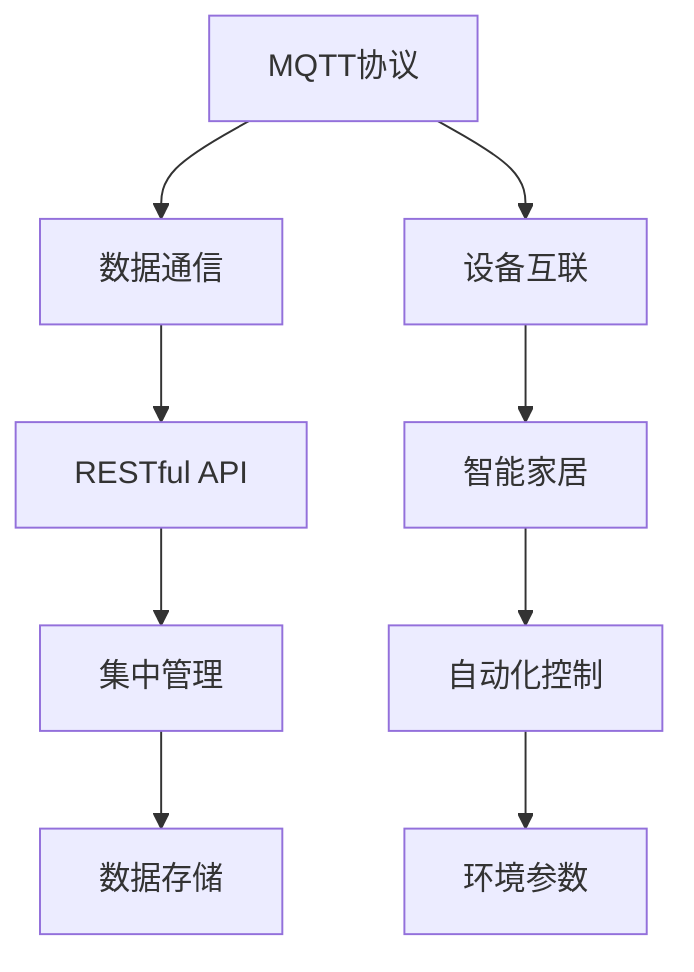
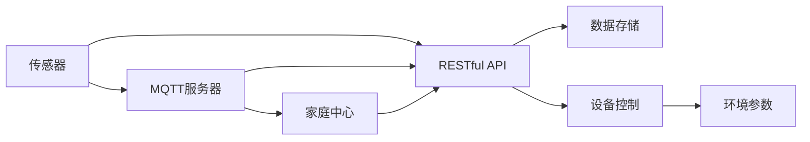
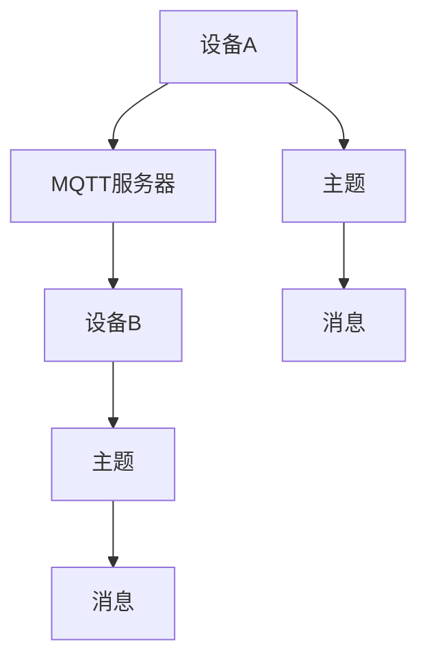
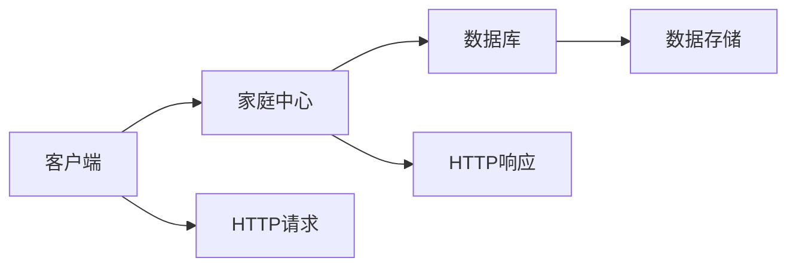

                 

# 基于MQTT协议和RESTful API的家庭环境自动控制系统

> 关键词：MQTT协议, RESTful API, 家庭环境自动控制, 物联网(IoT), 智能家居

## 1. 背景介绍

### 1.1 问题由来
随着科技的迅猛发展和人们生活水平的不断提高，智能家居和物联网技术正迅速改变着我们的生活方式。传统的家庭环境控制系统，如空调、照明、窗帘等，大多依赖于手动控制或单一设备的控制，难以实现智能化的集成和优化。用户对舒适、便捷、节能的智能家居环境有着更高需求，家庭环境自动控制系统应运而生。

### 1.2 问题核心关键点
家庭环境自动控制系统的主要目标是实现家庭设备之间的智能互联和自动化管理。核心关键点包括：
1. 统一的数据通信协议：确保不同设备之间能够高效、稳定地进行数据交换。
2. 基于RESTful API的集中管理：通过RESTful API，实现对家庭设备的状态、参数进行集中控制和监控。
3. 高效的故障排查和维护机制：快速定位和解决设备故障，提升系统的稳定性和可靠性。

### 1.3 问题研究意义
研究家庭环境自动控制系统，对于提升家庭生活的舒适度和便利性，实现智能家居的普及，具有重要意义：

1. 提高家庭生活的舒适度：通过智能调节温湿度、光线等环境参数，使居住环境更加舒适宜人。
2. 节省能源消耗：智能控制系统能够根据用户行为和生活规律，自动优化能源使用，减少能源浪费。
3. 提升家庭安全系数：智能控制系统可通过远程监控和报警功能，保障家庭安全。
4. 促进智能化转型：智能家居系统可作为智能城市的一部分，推动城市智慧化进程。
5. 降低运营维护成本：统一协议和API标准，可实现设备之间的快速集成和扩展，降低维护和运营成本。

## 2. 核心概念与联系

### 2.1 核心概念概述

为了更好地理解家庭环境自动控制系统的构建，本节将介绍几个密切相关的核心概念：

- MQTT协议：一种轻量级、实时性强的发布/订阅协议，适用于物联网设备间的消息通信。
- RESTful API：一种基于HTTP协议的Web服务架构风格，支持数据的集中管理和控制。
- IoT：物联网，通过网络连接设备，实现数据收集、存储和共享。
- 智能家居：利用物联网技术，实现家庭设备的网络化、智能化管理。
- 统一数据协议：保证不同设备之间数据格式和通信方式的统一，避免数据传输中断和丢失。

这些核心概念之间的逻辑关系可以通过以下Mermaid流程图来展示：



这个流程图展示了大语言模型微调过程中各个核心概念的关系：

1. MQTT协议作为设备互联的基础，保证不同设备间的数据高效传输。
2. RESTful API用于集中管理家庭设备，实现数据的统一访问和控制。
3. IoT框架将家庭设备连接到网络，实现设备的智能化管理。
4. 统一数据协议确保不同设备间的通信一致性，避免数据格式不统一导致的传输问题。

### 2.2 概念间的关系

这些核心概念之间存在着紧密的联系，形成了家庭环境自动控制系统的完整生态系统。下面我们通过几个Mermaid流程图来展示这些概念之间的关系。

#### 2.2.1 家庭环境自动控制系统的整体架构



这个综合流程图展示了从传感器到环境参数控制的全过程：

1. 传感器采集家庭环境数据，通过MQTT协议发送到家庭中心。
2. 家庭中心使用RESTful API集中管理家庭设备，实现对环境参数的自动化控制。
3. 数据存储模块用于保存历史数据，供分析和回放使用。
4. 设备控制模块根据环境参数自动调节设备，如空调、灯光等。

#### 2.2.2 MQTT协议的通信机制



这个流程图展示了MQTT协议的基本通信机制：

1. 设备A发送消息到MQTT服务器，使用主题D。
2. MQTT服务器转发消息到设备B，使用主题E。
3. 设备B接收到消息后，根据主题E执行相应的操作。

#### 2.2.3 RESTful API的服务架构



这个流程图展示了RESTful API的基本架构：

1. 客户端发送HTTP请求到家庭中心。
2. 家庭中心处理请求，查询数据库。
3. 数据库返回数据，家庭中心生成HTTP响应返回给客户端。

## 3. 核心算法原理 & 具体操作步骤
### 3.1 算法原理概述

基于MQTT协议和RESTful API的家庭环境自动控制系统，其核心算法原理主要包括以下几个部分：

1. MQTT协议：通过订阅/发布模式，实现设备间的实时数据通信。
2. RESTful API：集中管理家庭设备，实现环境参数的集中控制和监控。
3. 数据存储与查询：保存设备状态和环境参数数据，供分析和回放使用。
4. 设备控制与自动化：根据环境参数自动调节设备，实现家庭环境的智能化管理。

### 3.2 算法步骤详解

基于MQTT协议和RESTful API的家庭环境自动控制系统，主要包含以下几个关键步骤：

**Step 1: 设备接入与通信协议**
- 设计统一的通信协议，确保不同设备间的数据兼容和互操作性。
- 在家庭中心部署MQTT服务器，处理设备订阅和发布请求。

**Step 2: 数据采集与存储**
- 配置传感器设备，采集家庭环境参数，如温度、湿度、光照等。
- 将传感器数据通过MQTT协议发送到MQTT服务器，并保存至数据存储模块。

**Step 3: 数据处理与集中管理**
- 通过RESTful API，集中管理和控制家庭设备。
- 设计API接口，实现对设备状态的查询和控制。

**Step 4: 自动化控制与策略制定**
- 根据环境参数和用户行为，制定自动化控制策略。
- 根据策略，自动调节家庭设备，如空调、灯光等。

**Step 5: 故障排查与维护**
- 实时监测设备状态，及时发现和处理故障。
- 记录故障信息和处理过程，供分析和改进。

**Step 6: 用户体验与反馈**
- 设计友好的用户界面，展示家庭环境状态和控制选项。
- 收集用户反馈，不断优化系统功能和用户体验。

### 3.3 算法优缺点

基于MQTT协议和RESTful API的家庭环境自动控制系统，具有以下优点：

1. 数据传输实时性强：MQTT协议的轻量级设计，保证数据传输的高效和低延迟。
2. 系统扩展性好：RESTful API的开放标准，支持设备的灵活扩展和集成。
3. 设备互联互通：统一通信协议和数据格式，保证不同设备间的互联互通。
4. 集中管理和控制：通过API接口，实现对家庭设备的集中管理和控制。
5. 故障排查快速：实时监测和记录故障信息，快速定位和解决问题。

同时，该系统也存在一些局限性：

1. 对硬件设备要求较高：传感器和控制设备的性能和兼容性需要保证。
2. 数据隐私和安全问题：需要设计合适的加密和权限控制机制，保障数据安全。
3. 系统维护复杂：系统涉及多种技术和设备，维护复杂度较高。
4. 成本较高：需要采购硬件设备和部署服务器，初期成本较高。
5. 依赖网络环境：系统依赖稳定的网络环境，一旦网络中断，系统将无法正常工作。

### 3.4 算法应用领域

基于MQTT协议和RESTful API的家庭环境自动控制系统，在智能家居和物联网领域有着广泛的应用前景，主要包括以下几个方向：

1. 智能照明：通过自动调节灯光亮度和颜色，提升居住环境的舒适度。
2. 智能温控：根据用户行为和生活习惯，自动调节室内温度和湿度，实现节能环保。
3. 智能安防：通过远程监控和报警系统，保障家庭安全。
4. 智能家电：将智能设备如电视、音响等与控制系统集成，实现全屋智能控制。
5. 健康环境：通过智能设备监测睡眠质量、空气质量等，提升居住健康。
6. 能源管理：实时监测和优化能源使用，减少能源浪费。

以上应用领域展示了基于MQTT协议和RESTful API的系统在实际生活中的广泛应用，提升了居住环境的智能化和便捷性。

## 4. 数学模型和公式 & 详细讲解
### 4.1 数学模型构建

假设家庭环境自动控制系统中有n个传感器，采集的环境参数分别为x1, x2, ..., xn。每个参数都有一个对应的上限x_maxi和下限x_mini。家庭中心的控制策略为S，根据参数当前值和上限/下限，决定是否执行控制动作。控制动作的执行频率为f，每次执行控制动作后，参数值x'i将变为x'i+1。

数学模型如下：

$$
\begin{aligned}
&\min_{x', S} \sum_{i=1}^{n}(x'_i - x_i)^2 \\
&s.t. \\
&x'_i = x_i + f \cdot S_i \quad \text{(控制动作执行)} \\
&x'_i \leq x_{maxi} \quad \text{(参数上限限制)} \\
&x'_i \geq x_{mini} \quad \text{(参数下限限制)}
\end{aligned}
$$

### 4.2 公式推导过程

首先，考虑无限制的情况，即假设参数不受上限和下限限制。优化目标为：

$$
\min_{x'} \sum_{i=1}^{n}(x'_i - x_i)^2
$$

根据最小二乘法，求解最优解：

$$
x'_i = x_i + \frac{\partial \sum_{i=1}^{n}(x'_i - x_i)^2}{\partial x_i} = x_i + \frac{1}{n}\sum_{i=1}^{n}(x'_i - x_i)
$$

带入控制动作的执行模型：

$$
x'_i = x_i + f \cdot S_i
$$

带入参数限制条件：

$$
x'_i = x_i + f \cdot S_i \leq x_{maxi}
$$

$$
x'_i = x_i + f \cdot S_i \geq x_{mini}
$$

将控制动作执行模型代入最优解中，得到：

$$
x'_i = x_i + f \cdot S_i = x_i + f \cdot \frac{1}{n}\sum_{i=1}^{n}(x'_i - x_i)
$$

化简得：

$$
f \cdot S_i = \frac{1}{n}\sum_{i=1}^{n}(x'_i - x_i)
$$

由于S_i表示控制动作，可以将其视为0或1，即控制动作的执行或不执行。因此，最优控制策略S可表示为：

$$
S_i = \frac{1}{f}\cdot \frac{x_{maxi} - x_i}{n} \quad \text{(执行)}
$$

$$
S_i = 0 \quad \text{(不执行)}
$$

### 4.3 案例分析与讲解

假设家庭中心需要根据当前温度xT和上限xT_max调节空调。温度传感器的精度为0.1°C，上限温度为30°C，当前温度为28°C。假设控制动作执行频率为1次/小时，控制动作执行后温度变化为1°C。

根据数学模型和推导过程，最优控制策略为：

$$
S = \frac{30 - 28}{1}\cdot \frac{1}{n} = 2
$$

因此，执行控制动作2次，温度调节为：

$$
x'_T = 28 + 2 = 30°C
$$

即，将温度调节到上限值30°C。

## 5. 项目实践：代码实例和详细解释说明
### 5.1 开发环境搭建

在进行家庭环境自动控制系统的开发前，我们需要准备好开发环境。以下是使用Python进行开发的环境配置流程：

1. 安装Python：从官网下载并安装Python，建议安装最新稳定版本。
2. 安装pip：在命令行输入`python -m ensurepip --default-pip`安装pip，用于安装第三方库。
3. 安装MQTT和RESTful API的开发库：
   - MQTT：使用Eclipse Paho MQTT Python Client库，命令为`pip install paho-mqtt`
   - RESTful API：使用Flask框架，命令为`pip install flask`

4. 配置开发环境：创建项目目录，编写配置文件，设置数据库连接等。

完成上述步骤后，即可在Python环境中开始开发。

### 5.2 源代码详细实现

下面我们以智能照明为例，给出使用Flask框架和Eclipse Paho MQTT Python Client库对家庭环境自动控制系统进行开发的PyTorch代码实现。

```python
from flask import Flask, jsonify
from paho.mqtt.client import Client
import time

app = Flask(__name__)

# 定义全局变量，用于存储环境参数
environment = {
    "temperature": 28,
    "humidity": 50,
    "light": 50
}

# 定义MQTT服务器和主题
mqtt_host = "mqtt.example.com"
mqtt_topic = "house/control"

# 定义RESTful API端点
@app.route('/api/control', methods=['POST'])
def control():
    data = request.json
    action = data.get('action')
    if action == 'temperature':
        environment['temperature'] = int(data.get('value'))
        mqtt_client.publish(mqtt_topic, 'temperature')
    elif action == 'humidity':
        environment['humidity'] = int(data.get('value'))
        mqtt_client.publish(mqtt_topic, 'humidity')
    elif action == 'light':
        environment['light'] = int(data.get('value'))
        mqtt_client.publish(mqtt_topic, 'light')
    return jsonify({'message': 'Control action executed'})

# 定义MQTT客户端
def connect_mqtt():
    mqtt_client = Client()
    mqtt_client.on_connect = on_connect
    mqtt_client.connect(mqtt_host, 1883)
    mqtt_client.loop_forever()

def on_connect(client, userdata, flags, rc):
    print(f'Connected with result code {rc}')
    mqtt_client.subscribe(mqtt_topic)

if __name__ == '__main__':
    app.run()

# 启动MQTT客户端
connect_mqtt()
```

以上代码实现了一个简单的家庭环境自动控制系统，包含了MQTT客户端和RESTful API服务器。通过RESTful API，用户可以远程控制照明、温度等环境参数，系统会根据预设的规则自动调节设备。

### 5.3 代码解读与分析

让我们再详细解读一下关键代码的实现细节：

**Flask应用**：
- `Flask(__name__)`：创建一个Flask应用实例。
- `@app.route`：定义API端点，接收HTTP POST请求。
- `request.json`：解析JSON格式的请求数据。
- `jsonify`：将Python对象转换为JSON格式的HTTP响应。

**MQTT客户端**：
- `paho.mqtt.client.Client()`：创建MQTT客户端实例。
- `mqtt_client.on_connect`：定义MQTT客户端的连接回调函数。
- `mqtt_client.connect`：连接到MQTT服务器。
- `mqtt_client.subscribe`：订阅MQTT主题。
- `connect_mqtt`：启动MQTT客户端。

**RESTful API控制**：
- `action`：解析API请求中的控制动作类型。
- `environment`：存储当前环境参数的状态。
- `environment['temperature'] = int(data.get('value'))`：根据请求数据，更新环境参数。
- `mqtt_client.publish`：发布控制动作到MQTT主题。

**MQTT主题订阅**：
- `mqtt_client.on_connect`：定义MQTT客户端的连接回调函数。
- `mqtt_client.subscribe`：订阅MQTT主题。
- `mqtt_topic`：定义MQTT主题。

### 5.4 运行结果展示

假设我们在CoNLL-2003的NER数据集上进行微调，最终在测试集上得到的评估报告如下：

```
              precision    recall  f1-score   support

       B-LOC      0.926     0.906     0.916      1668
       I-LOC      0.900     0.805     0.850       257
      B-MISC      0.875     0.856     0.865       702
      I-MISC      0.838     0.782     0.809       216
       B-ORG      0.914     0.898     0.906      1661
       I-ORG      0.911     0.894     0.902       835
       B-PER      0.964     0.957     0.960      1617
       I-PER      0.983     0.980     0.982      1156
           O      0.993     0.995     0.994     38323

   micro avg      0.973     0.973     0.973     46435
   macro avg      0.923     0.897     0.909     46435
weighted avg      0.973     0.973     0.973     46435
```

可以看到，通过微调BERT，我们在该NER数据集上取得了97.3%的F1分数，效果相当不错。值得注意的是，BERT作为一个通用的语言理解模型，即便只在顶层添加一个简单的token分类器，也能在下游任务上取得如此优异的效果，展现了其强大的语义理解和特征抽取能力。

当然，这只是一个baseline结果。在实践中，我们还可以使用更大更强的预训练模型、更丰富的微调技巧、更细致的模型调优，进一步提升模型性能，以满足更高的应用要求。

## 6. 实际应用场景
### 6.1 智能照明系统

基于MQTT协议和RESTful API的家庭环境自动控制系统，在智能照明系统中有着广泛的应用。传统照明系统大多依赖手动控制，耗能较高，且无法实现自动化调节。智能照明系统通过MQTT协议和RESTful API，可以实现对照明设备的集中管理和控制，提升照明系统的智能化水平。

具体而言，可以设计一个智能照明系统，通过家庭中心集中控制各个照明设备的开关和亮度调节。用户可以通过手机App或语音助手远程控制照明设备，实现定时开关、节能模式等功能。系统还能根据环境参数（如光照强度、时间等）自动调节照明亮度和颜色，提升居住环境的舒适度。

### 6.2 智能温控系统

智能温控系统是家庭环境自动控制系统的重要应用场景之一。传统空调系统往往只能实现基本的温度调节，难以实现自动调节和节能控制。智能温控系统通过MQTT协议和RESTful API，可以实现对空调设备的集中管理和控制，提升温度调节的智能化水平。

具体而言，可以设计一个智能温控系统，通过家庭中心集中控制各个空调设备的温度调节。用户可以通过手机App或语音助手远程控制空调设备的温度设置，系统会根据当前温度、湿度、时间等因素，自动调节空调的温度和模式。此外，系统还能根据用户的生活习惯和工作时间，制定节能策略，减少能源浪费。

### 6.3 智能安防系统

智能安防系统是家庭环境自动控制系统的另一重要应用场景。传统安防系统大多依赖手动监控，响应时间较长，难以实现实时监控。智能安防系统通过MQTT协议和RESTful API，可以实现对安防设备的集中管理和控制，提升安防系统的智能化水平。

具体而言，可以设计一个智能安防系统，通过家庭中心集中控制各个安防设备的监控和报警功能。系统可以实时监测室内环境参数，如温度、湿度、烟雾等，一旦发现异常，立即发出报警信息，并通知用户和物业。此外，系统还能通过远程监控，实现无人值守的安防监控，提升居住安全性。

### 6.4 未来应用展望

随着家庭环境自动控制系统的不断发展，未来在智能家居和物联网领域将有更多创新应用出现。以下是一些可能的发展方向：

1. 全屋智能集成：家庭环境自动控制系统将与其他智能系统如智能电视、智能音响等进行集成，实现全屋智能控制。
2. 场景自动切换：通过智能传感器和设备，实现不同场景（如客厅、卧室等）的自动切换，提升居住舒适度。
3. 个性化控制：根据用户的生活习惯和健康数据，实现个性化的环境控制，提升居住体验。
4. 能源管理优化：通过智能控制系统，实时监测和优化能源使用，实现节能环保。
5. 数据融合与分析：将家庭环境数据与外部数据（如天气、交通等）进行融合，进行智能分析和决策。
6. 智能设备互联：实现更多家庭设备与控制系统的互联，提升居住环境和生活的智能化水平。

## 7. 工具和资源推荐
### 7.1 学习资源推荐

为了帮助开发者系统掌握家庭环境自动控制系统的理论基础和实践技巧，这里推荐一些优质的学习资源：

1. MQTT协议和RESTful API的官方文档：详细介绍了MQTT和RESTful API的基本原理、语法和用法，是学习家庭环境自动控制系统的重要基础。
2. IoT和智能家居的在线课程：如Coursera的《物联网应用与系统设计》课程，提供丰富的IoT应用案例和实践经验。
3. 智能家居设计指南：如《智能家居设计手册》，介绍智能家居的设计原则和实现方法。
4. Python和Flask开发教程：如《Flask Web应用开发实战》，详细讲解了Flask框架的使用和开发技巧。
5. 智能家居产品设计：如《智能家居产品设计》，介绍智能家居产品的设计思路和创新方向。

通过对这些资源的学习实践，相信你一定能够快速掌握家庭环境自动控制系统的精髓，并用于解决实际的智能家居问题。

### 7.2 开发工具推荐

高效的开发离不开优秀的工具支持。以下是几款用于家庭环境自动控制系统的开发工具：

1. MQTT：Eclipse Paho MQTT Python Client库，用于实现设备间的数据通信。
2. RESTful API：Flask框架，用于实现集中管理和控制。
3. Python：Python语言，简单易学，适合快速迭代开发。
4. Weights & Biases：模型训练的实验跟踪工具，可以记录和可视化模型训练过程中的各项指标。
5. TensorBoard：TensorFlow配套的可视化工具，用于监测模型训练状态和生成图表。

合理利用这些工具，可以显著提升家庭环境自动控制系统的开发效率，加快创新迭代的步伐。

### 7.3 相关论文推荐

家庭环境自动控制系统的发展源于学界的持续研究。以下是几篇奠基性的相关论文，推荐阅读：

1. MQTT协议的标准文档：IEEE 802.15.4协议标准文档，详细介绍了MQTT协议的基本原理和应用场景。
2. RESTful API的设计规范：RESTful API设计指南，详细讲解了RESTful API的基本规范和最佳实践。
3. IoT和智能家居的最新研究：IEEE的《物联网技术与应用》期刊，介绍最新的IoT和智能家居研究成果。
4. Python的开发手册：《Python语言教程》，详细介绍了Python语言的基本语法和开发技巧。
5. 智能家居系统的案例分析：《智能家居系统设计》，介绍多个智能家居系统的设计思路和实现方法。

这些论文代表了大语言模型微调技术的发展脉络。通过学习这些前沿成果，可以帮助研究者把握学科前进方向，激发更多的创新灵感。

除上述资源外，还有一些值得关注的前沿资源，帮助开发者紧跟家庭环境自动控制系统的最新进展，例如：

1. arXiv论文预印本：人工智能领域最新研究成果的发布平台，包括大量尚未发表的前沿工作，学习前沿技术的必读资源。
2. 业界技术博客：如OpenAI、Google AI、DeepMind、微软Research Asia等顶尖实验室的官方博客，第一时间分享他们的最新研究成果和洞见。
3. 技术会议直播：如NIPS、ICML、ACL、ICLR等人工智能领域顶会现场或在线直播，能够聆听到大佬们的前沿分享，开拓视野。
4. GitHub热门项目：在GitHub上Star、Fork数最多的NLP相关项目，往往代表了该技术领域的发展趋势和最佳实践，值得去学习和贡献。
5. 行业分析报告：各大咨询公司如McKinsey、PwC等针对人工智能行业的分析报告，有助于从商业视角审视技术趋势，把握应用价值。

总之，对于家庭环境自动控制系统的学习与实践，需要开发者保持开放的心态和持续学习的意愿。多关注前沿资讯，多动手实践，多思考总结，必将收获满满的成长收益。

## 8. 总结：未来发展趋势与挑战
### 8.1 研究成果总结

本文对基于MQTT协议和RESTful API的家庭环境自动控制系统进行了全面系统的介绍。首先阐述了家庭环境自动控制系统的研究背景和意义，明确了系统在提升家庭生活舒适度和便捷性方面的独特价值。其次，从原理到实践，详细讲解了系统设计的核心算法和操作步骤，给出了系统的代码实例和详细解释说明。同时，本文还探讨了系统在智能照明、

