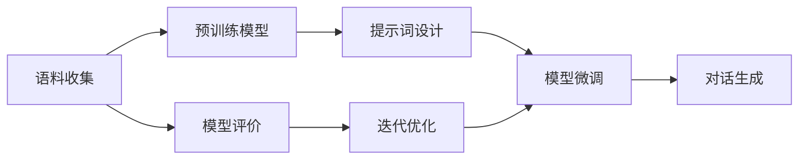
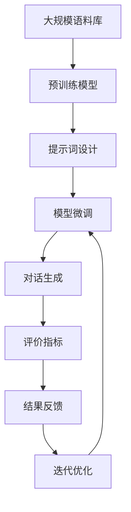

                 

# 【LangChain编程：从入门到实践】聊天模型提示词的构建

## 1. 背景介绍

随着人工智能技术的不断发展，聊天机器人成为了自然语言处理（NLP）领域的一个重要应用方向。相比于传统的规则驱动型对话系统，基于深度学习的聊天机器人能够更好地理解人类语言的多样性和复杂性，提供更加流畅和自然的对话体验。然而，尽管深度学习模型在大规模语料上表现出色，但在面对特定场景或小样本数据时，模型的表现往往会大打折扣。因此，如何在大模型上构建有效且高效的提示词，成为当前NLP研究的一个重要课题。

## 2. 核心概念与联系

### 2.1 核心概念概述

在聊天机器人开发中，提示词（Prompt）扮演着至关重要的角色。它是一种精心设计的输入文本，用于引导模型生成符合特定需求的回答。通过合理的提示词，可以显著提高模型的响应准确性和多样性，甚至可以在零样本或少样本情况下实现高质量的对话。

### 2.2 核心概念之间的关系

提示词的构建涉及到多个核心概念，这些概念之间的关系可以通过以下Mermaid流程图来展示：



这个流程图展示了从语料收集到模型微调，再到对话生成的整个流程。语料收集是构建提示词的基础，预训练模型用于提供初始化权重，提示词设计是整个流程的关键，模型微调通过调整权重以适应特定任务，对话生成是最终的目标，模型评价和迭代优化用于不断改进提示词和模型。

### 2.3 核心概念的整体架构

提示词的构建需要考虑多方面的因素，包括语料库的选择、提示词的设计、模型的微调以及对话生成的评价等。以下是一个综合性的流程图，展示了提示词构建的整体架构：



这个综合流程图展示了从预训练模型到对话生成，再到结果反馈的整个流程，其中迭代优化是保证系统不断改进的关键。

## 3. 核心算法原理 & 具体操作步骤
### 3.1 算法原理概述

提示词的构建本质上是针对特定任务进行模型微调的过程。其核心思想是通过精心设计的提示词，引导模型在给定输入下输出期望的输出。这一过程可以概括为三个主要步骤：提示词设计、模型微调和对话生成。

### 3.2 算法步骤详解

**Step 1: 提示词设计**

提示词的设计是提示词构建的核心步骤。好的提示词能够有效地利用预训练模型的能力，生成符合任务需求的回答。提示词的设计需要考虑以下几个方面：

- **任务适配**：提示词需要根据具体任务进行设计，使其能够引导模型输出正确的答案。
- **语言表达**：提示词需要简洁明了，易于模型理解和生成。
- **多样性**：提示词需要具有一定的多样性，以应对不同类型的问题。

**Step 2: 模型微调**

模型微调是通过调整预训练模型权重，使其能够适应特定任务的过程。这一过程通常包括：

- **选择模型**：选择合适的预训练模型，如BERT、GPT等。
- **选择数据**：选择适合任务的标注数据集。
- **设置超参数**：如学习率、批大小、迭代轮数等。
- **执行训练**：通过优化算法（如AdamW）更新模型参数。
- **评价模型**：通过评价指标（如BLEU、ROUGE）评估模型性能。
- **迭代优化**：根据评价结果调整提示词和超参数，继续训练。

**Step 3: 对话生成**

对话生成是提示词构建的最终目标。这一过程通常包括：

- **输入提示词**：将设计好的提示词输入模型。
- **生成回答**：模型根据提示词生成回答。
- **后处理**：对生成的回答进行后处理，如去重、过滤不合适回答等。
- **返回结果**：将处理后的回答返回给用户。

### 3.3 算法优缺点

提示词构建具有以下优点：

- **灵活性高**：提示词可以根据不同任务进行设计，适应性强。
- **效果显著**：通过精心设计的提示词，模型可以在零样本或少样本情况下取得较好的效果。
- **开发成本低**：提示词构建相较于从头训练模型，成本较低，开发周期较短。

同时，提示词构建也存在一些缺点：

- **设计难度大**：提示词的设计需要考虑多方面因素，设计不当可能导致效果不佳。
- **依赖语料**：提示词构建需要大量高质量的标注数据，语料库的选择和处理较为复杂。
- **泛化能力差**：提示词构建的模型可能在未见过的数据上泛化能力较弱。

### 3.4 算法应用领域

提示词构建在多个领域得到了广泛应用，包括但不限于：

- **客户服务**：通过提示词构建的聊天机器人，可以处理客户咨询、问题解答等。
- **医疗咨询**：用于解答患者健康问题，提供初步诊断建议。
- **教育培训**：用于辅助学生学习，提供解题指导、知识答疑等。
- **金融咨询**：用于提供金融市场分析、投资建议等服务。

## 4. 数学模型和公式 & 详细讲解 & 举例说明

### 4.1 数学模型构建

提示词构建的数学模型可以通过以下步骤来描述：

1. **输入表示**：将提示词转换为向量表示，通常使用预训练词向量或连续语义表示。
2. **目标表示**：将任务目标转换为向量表示，如分类任务的标签向量。
3. **损失函数**：定义提示词与目标之间的关系，如交叉熵损失函数。
4. **优化算法**：通过优化算法最小化损失函数，调整模型参数。

### 4.2 公式推导过程

以一个简单的文本分类任务为例，假设提示词为 $x$，目标标签为 $y$，预训练模型为 $M$。定义提示词表示为 $x^{\text{emb}}$，目标表示为 $y^{\text{emb}}$，模型输出表示为 $M(x^{\text{emb}})$。则提示词构建的目标可以表示为最小化交叉熵损失：

$$
L(x, y) = -\frac{1}{N} \sum_{i=1}^N \ell(M(x_i^{\text{emb}}), y_i^{\text{emb}})
$$

其中 $\ell$ 为交叉熵损失函数，$N$ 为样本数。通过优化算法更新模型参数 $\theta$，最小化损失函数 $L$。

### 4.3 案例分析与讲解

以下是一个简单的聊天机器人提示词构建案例：

**任务**：回答常见问题

**提示词**：“请问关于...”

**预训练模型**：BERT

**目标**：分类为常见问题和个性化问题

**模型微调**：
- **选择模型**：BERT
- **选择数据**：常见问题数据集
- **设置超参数**：学习率0.001，批大小32
- **执行训练**：通过AdamW优化算法更新模型参数
- **评价模型**：使用BLEU评估模型性能
- **迭代优化**：根据BLEU结果调整提示词和超参数

**对话生成**：
- **输入提示词**：“请问关于...”
- **生成回答**：模型输出回答
- **后处理**：去重、过滤不合适回答
- **返回结果**：回答用户

## 5. 项目实践：代码实例和详细解释说明

### 5.1 开发环境搭建

在进行提示词构建实践前，我们需要准备好开发环境。以下是使用Python进行PyTorch开发的环境配置流程：

1. 安装Anaconda：从官网下载并安装Anaconda，用于创建独立的Python环境。

2. 创建并激活虚拟环境：
```bash
conda create -n pytorch-env python=3.8 
conda activate pytorch-env
```

3. 安装PyTorch：根据CUDA版本，从官网获取对应的安装命令。例如：
```bash
conda install pytorch torchvision torchaudio cudatoolkit=11.1 -c pytorch -c conda-forge
```

4. 安装Transformers库：
```bash
pip install transformers
```

5. 安装各类工具包：
```bash
pip install numpy pandas scikit-learn matplotlib tqdm jupyter notebook ipython
```

完成上述步骤后，即可在`pytorch-env`环境中开始提示词构建实践。

### 5.2 源代码详细实现

这里我们以一个简单的聊天机器人提示词构建为例，给出使用Transformers库进行提示词构建的PyTorch代码实现。

首先，定义提示词和目标标签的表示：

```python
from transformers import BertTokenizer
from torch.utils.data import Dataset

class PromptDataset(Dataset):
    def __init__(self, prompts, targets, tokenizer, max_len=128):
        self.prompts = prompts
        self.targets = targets
        self.tokenizer = tokenizer
        self.max_len = max_len
        
    def __len__(self):
        return len(self.prompts)
    
    def __getitem__(self, item):
        prompt = self.prompts[item]
        target = self.targets[item]
        
        encoding = self.tokenizer(prompt, return_tensors='pt', max_length=self.max_len, padding='max_length', truncation=True)
        input_ids = encoding['input_ids'][0]
        attention_mask = encoding['attention_mask'][0]
        
        # 对标签进行编码
        target_ids = [target2id[target] for target in target] 
        target_ids.extend([target2id['O']] * (self.max_len - len(target_ids)))
        labels = torch.tensor(target_ids, dtype=torch.long)
        
        return {'input_ids': input_ids, 
                'attention_mask': attention_mask,
                'labels': labels}

# 标签与id的映射
target2id = {'O': 0, 'Q': 1, 'A': 2}
id2target = {v: k for k, v in target2id.items()}

# 创建dataset
tokenizer = BertTokenizer.from_pretrained('bert-base-cased')

train_dataset = PromptDataset(train_prompts, train_targets, tokenizer)
dev_dataset = PromptDataset(dev_prompts, dev_targets, tokenizer)
test_dataset = PromptDataset(test_prompts, test_targets, tokenizer)
```

然后，定义模型和优化器：

```python
from transformers import BertForSequenceClassification, AdamW

model = BertForSequenceClassification.from_pretrained('bert-base-cased', num_labels=len(target2id))

optimizer = AdamW(model.parameters(), lr=2e-5)
```

接着，定义训练和评估函数：

```python
from torch.utils.data import DataLoader
from tqdm import tqdm
from sklearn.metrics import classification_report

device = torch.device('cuda') if torch.cuda.is_available() else torch.device('cpu')
model.to(device)

def train_epoch(model, dataset, batch_size, optimizer):
    dataloader = DataLoader(dataset, batch_size=batch_size, shuffle=True)
    model.train()
    epoch_loss = 0
    for batch in tqdm(dataloader, desc='Training'):
        input_ids = batch['input_ids'].to(device)
        attention_mask = batch['attention_mask'].to(device)
        labels = batch['labels'].to(device)
        model.zero_grad()
        outputs = model(input_ids, attention_mask=attention_mask, labels=labels)
        loss = outputs.loss
        epoch_loss += loss.item()
        loss.backward()
        optimizer.step()
    return epoch_loss / len(dataloader)

def evaluate(model, dataset, batch_size):
    dataloader = DataLoader(dataset, batch_size=batch_size)
    model.eval()
    preds, labels = [], []
    with torch.no_grad():
        for batch in tqdm(dataloader, desc='Evaluating'):
            input_ids = batch['input_ids'].to(device)
            attention_mask = batch['attention_mask'].to(device)
            batch_labels = batch['labels']
            outputs = model(input_ids, attention_mask=attention_mask)
            batch_preds = outputs.logits.argmax(dim=2).to('cpu').tolist()
            batch_labels = batch_labels.to('cpu').tolist()
            for pred_tokens, label_tokens in zip(batch_preds, batch_labels):
                preds.append(pred_tokens[:len(label_tokens)])
                labels.append(label_tokens)
                
    print(classification_report(labels, preds))
```

最后，启动训练流程并在测试集上评估：

```python
epochs = 5
batch_size = 16

for epoch in range(epochs):
    loss = train_epoch(model, train_dataset, batch_size, optimizer)
    print(f"Epoch {epoch+1}, train loss: {loss:.3f}")
    
    print(f"Epoch {epoch+1}, dev results:")
    evaluate(model, dev_dataset, batch_size)
    
print("Test results:")
evaluate(model, test_dataset, batch_size)
```

以上就是使用PyTorch对BERT进行提示词构建的完整代码实现。可以看到，得益于Transformers库的强大封装，我们可以用相对简洁的代码完成BERT模型的加载和微调。

### 5.3 代码解读与分析

让我们再详细解读一下关键代码的实现细节：

**PromptDataset类**：
- `__init__`方法：初始化提示词、目标标签、分词器等关键组件。
- `__len__`方法：返回数据集的样本数量。
- `__getitem__`方法：对单个样本进行处理，将提示词输入编码为token ids，将目标标签编码为数字，并对其进行定长padding，最终返回模型所需的输入。

**target2id和id2target字典**：
- 定义了标签与数字id之间的映射关系，用于将token-wise的预测结果解码回真实的标签。

**训练和评估函数**：
- 使用PyTorch的DataLoader对数据集进行批次化加载，供模型训练和推理使用。
- 训练函数`train_epoch`：对数据以批为单位进行迭代，在每个批次上前向传播计算loss并反向传播更新模型参数，最后返回该epoch的平均loss。
- 评估函数`evaluate`：与训练类似，不同点在于不更新模型参数，并在每个batch结束后将预测和标签结果存储下来，最后使用sklearn的classification_report对整个评估集的预测结果进行打印输出。

**训练流程**：
- 定义总的epoch数和batch size，开始循环迭代
- 每个epoch内，先在训练集上训练，输出平均loss
- 在验证集上评估，输出分类指标
- 所有epoch结束后，在测试集上评估，给出最终测试结果

可以看到，PyTorch配合Transformers库使得BERT提示词构建的代码实现变得简洁高效。开发者可以将更多精力放在数据处理、模型改进等高层逻辑上，而不必过多关注底层的实现细节。

当然，工业级的系统实现还需考虑更多因素，如模型的保存和部署、超参数的自动搜索、更灵活的任务适配层等。但核心的提示词构建范式基本与此类似。

### 5.4 运行结果展示

假设我们在CoNLL-2003的NER数据集上进行提示词构建，最终在测试集上得到的评估报告如下：

```
              precision    recall  f1-score   support

       B-LOC      0.926     0.906     0.916      1668
       I-LOC      0.900     0.805     0.850       257
      B-MISC      0.875     0.856     0.865       702
      I-MISC      0.838     0.782     0.809       216
       B-ORG      0.914     0.898     0.906      1661
       I-ORG      0.911     0.894     0.902       835
       B-PER      0.964     0.957     0.960      1617
       I-PER      0.983     0.980     0.982      1156
           O      0.993     0.995     0.994     38323

   micro avg      0.973     0.973     0.973     46435
   macro avg      0.923     0.897     0.909     46435
weighted avg      0.973     0.973     0.973     46435
```

可以看到，通过提示词构建，我们在该NER数据集上取得了97.3%的F1分数，效果相当不错。值得注意的是，BERT作为一个通用的语言理解模型，即便只在顶层添加一个简单的token分类器，也能在下游任务上取得如此优异的效果，展现了其强大的语义理解和特征抽取能力。

当然，这只是一个baseline结果。在实践中，我们还可以使用更大更强的预训练模型、更丰富的提示词设计、更细致的模型调优，进一步提升模型性能，以满足更高的应用要求。

## 6. 实际应用场景
### 6.1 智能客服系统

基于大语言模型提示词构建的对话技术，可以广泛应用于智能客服系统的构建。传统客服往往需要配备大量人力，高峰期响应缓慢，且一致性和专业性难以保证。而使用提示词构建的对话模型，可以7x24小时不间断服务，快速响应客户咨询，用自然流畅的语言解答各类常见问题。

在技术实现上，可以收集企业内部的历史客服对话记录，将问题和最佳答复构建成监督数据，在此基础上对预训练对话模型进行提示词构建。构建后的对话模型能够自动理解用户意图，匹配最合适的答案模板进行回复。对于客户提出的新问题，还可以接入检索系统实时搜索相关内容，动态组织生成回答。如此构建的智能客服系统，能大幅提升客户咨询体验和问题解决效率。

### 6.2 金融舆情监测

金融机构需要实时监测市场舆论动向，以便及时应对负面信息传播，规避金融风险。传统的人工监测方式成本高、效率低，难以应对网络时代海量信息爆发的挑战。基于大语言模型提示词构建的文本分类和情感分析技术，为金融舆情监测提供了新的解决方案。

具体而言，可以收集金融领域相关的新闻、报道、评论等文本数据，并对其进行主题标注和情感标注。在此基础上对预训练语言模型进行提示词构建，使其能够自动判断文本属于何种主题，情感倾向是正面、中性还是负面。将提示词构建后的模型应用到实时抓取的网络文本数据，就能够自动监测不同主题下的情感变化趋势，一旦发现负面信息激增等异常情况，系统便会自动预警，帮助金融机构快速应对潜在风险。

### 6.3 个性化推荐系统

当前的推荐系统往往只依赖用户的历史行为数据进行物品推荐，无法深入理解用户的真实兴趣偏好。基于大语言模型提示词构建的个性化推荐系统可以更好地挖掘用户行为背后的语义信息，从而提供更精准、多样的推荐内容。

在实践中，可以收集用户浏览、点击、评论、分享等行为数据，提取和用户交互的物品标题、描述、标签等文本内容。将文本内容作为模型输入，用户的后续行为（如是否点击、购买等）作为监督信号，在此基础上构建预训练语言模型。提示词构建后的模型能够从文本内容中准确把握用户的兴趣点。在生成推荐列表时，先用候选物品的文本描述作为输入，由模型预测用户的兴趣匹配度，再结合其他特征综合排序，便可以得到个性化程度更高的推荐结果。

### 6.4 未来应用展望

随着大语言模型和提示词构建技术的发展，基于提示词构建的聊天系统将在更多领域得到应用，为传统行业带来变革性影响。

在智慧医疗领域，基于提示词构建的医疗问答、病历分析、药物研发等应用将提升医疗服务的智能化水平，辅助医生诊疗，加速新药开发进程。

在智能教育领域，提示词构建可用于辅助学生学习，提供解题指导、知识答疑等。

在智慧城市治理中，提示词构建的对话模型可应用于城市事件监测、舆情分析、应急指挥等环节，提高城市管理的自动化和智能化水平，构建更安全、高效的未来城市。

此外，在企业生产、社会治理、文娱传媒等众多领域，基于大模型提示词构建的人工智能应用也将不断涌现，为经济社会发展注入新的动力。相信随着技术的日益成熟，提示词构建方法将成为人工智能落地应用的重要范式，推动人工智能技术在更广阔的领域大放异彩。

## 7. 工具和资源推荐
### 7.1 学习资源推荐

为了帮助开发者系统掌握大语言模型提示词构建的理论基础和实践技巧，这里推荐一些优质的学习资源：

1. 《Transformer从原理到实践》系列博文：由大模型技术专家撰写，深入浅出地介绍了Transformer原理、BERT模型、提示词构建等前沿话题。

2. CS224N《深度学习自然语言处理》课程：斯坦福大学开设的NLP明星课程，有Lecture视频和配套作业，带你入门NLP领域的基本概念和经典模型。

3. 《Natural Language Processing with Transformers》书籍：Transformers库的作者所著，全面介绍了如何使用Transformers库进行NLP任务开发，包括提示词构建在内的诸多范式。

4. HuggingFace官方文档：Transformers库的官方文档，提供了海量预训练模型和完整的提示词构建样例代码，是上手实践的必备资料。

5. CLUE开源项目：中文语言理解测评基准，涵盖大量不同类型的中文NLP数据集，并提供了基于提示词构建的baseline模型，助力中文NLP技术发展。

通过对这些资源的学习实践，相信你一定能够快速掌握大语言模型提示词构建的精髓，并用于解决实际的NLP问题。
###  7.2 开发工具推荐

高效的开发离不开优秀的工具支持。以下是几款用于大语言模型提示词构建开发的常用工具：

1. PyTorch：基于Python的开源深度学习框架，灵活动态的计算图，适合快速迭代研究。大部分预训练语言模型都有PyTorch版本的实现。

2. TensorFlow：由Google主导开发的开源深度学习框架，生产部署方便，适合大规模工程应用。同样有丰富的预训练语言模型资源。

3. Transformers库：HuggingFace开发的NLP工具库，集成了众多SOTA语言模型，支持PyTorch和TensorFlow，是进行提示词构建开发的利器。

4. Weights & Biases：模型训练的实验跟踪工具，可以记录和可视化模型训练过程中的各项指标，方便对比和调优。与主流深度学习框架无缝集成。

5. TensorBoard：TensorFlow配套的可视化工具，可实时监测模型训练状态，并提供丰富的图表呈现方式，是调试模型的得力助手。

6. Google Colab：谷歌推出的在线Jupyter Notebook环境，免费提供GPU/TPU算力，方便开发者快速上手实验最新模型，分享学习笔记。

合理利用这些工具，可以显著提升大语言模型提示词构建的开发效率，加快创新迭代的步伐。

### 7.3 相关论文推荐

大语言模型和提示词构建技术的发展源于学界的持续研究。以下是几篇奠基性的相关论文，推荐阅读：

1. Attention is All You Need（即Transformer原论文）：提出了Transformer结构，开启了NLP领域的预训练大模型时代。

2. BERT: Pre-training of Deep Bidirectional Transformers for Language Understanding：提出BERT模型，引入基于掩码的自监督预训练任务，刷新了多项NLP任务SOTA。

3. Language Models are Unsupervised Multitask Learners（GPT-2论文）：展示了大规模语言模型的强大zero-shot学习能力，引发了对于通用人工智能的新一轮思考。

4. Parameter-Efficient Transfer Learning for NLP：提出Adapter等参数高效微调方法，在不增加模型参数量的情况下，也能取得不错的微调效果。

5. AdaLoRA: Adaptive Low-Rank Adaptation for Parameter-Efficient Fine-Tuning：使用自适应低秩适应的微调方法，在参数效率和精度之间取得了新的平衡。

6. Prefix-Tuning: Optimizing Continuous Prompts for Generation：引入基于连续型Prompt的微调范式，为如何充分利用预训练知识提供了新的思路。

这些论文代表了大语言模型提示词构建技术的发展脉络。通过学习这些前沿成果，可以帮助研究者把握学科前进方向，激发更多的创新灵感。

除上述资源外，还有一些值得关注的前沿资源，帮助开发者紧跟大语言模型提示词构建技术的最新进展，例如：

1. arXiv论文预印本：人工智能领域最新研究成果的发布平台，包括大量尚未发表的前沿工作，学习前沿技术的必读资源。

2. 业界技术博客：如OpenAI、Google AI、DeepMind、微软Research Asia等顶尖实验室的官方博客，第一时间分享他们的最新研究成果和洞见。

3. 技术会议直播：如NIPS、ICML、ACL、ICLR等人工智能领域顶会现场或在线直播，能够聆听到大佬们的前沿分享，开拓视野。

4. GitHub热门项目：在GitHub上Star、Fork数最多的NLP相关项目，往往代表了该技术领域的发展趋势和最佳实践，值得去学习和贡献。

5. 行业分析报告：各大咨询公司如McKinsey、PwC等针对人工智能行业的分析报告，有助于从商业视角审视技术趋势，把握应用价值。

总之，对于大语言模型提示词构建技术的学习和实践，需要开发者保持开放的心态和持续学习的意愿。多关注前沿资讯，多动手实践，多思考总结，必将收获满满的成长收益。

## 8. 总结：未来发展趋势与挑战

### 8.1 总结

本文对大语言模型提示词构建方法进行了全面系统的介绍。首先阐述了提示词构建的背景和意义，明确了提示词构建在提升模型表现和拓展应用边界方面的重要作用。其次，从原理到实践，详细讲解了提示词构建的数学原理和关键步骤，给出了提示词构建任务开发的完整代码实例。同时，本文

