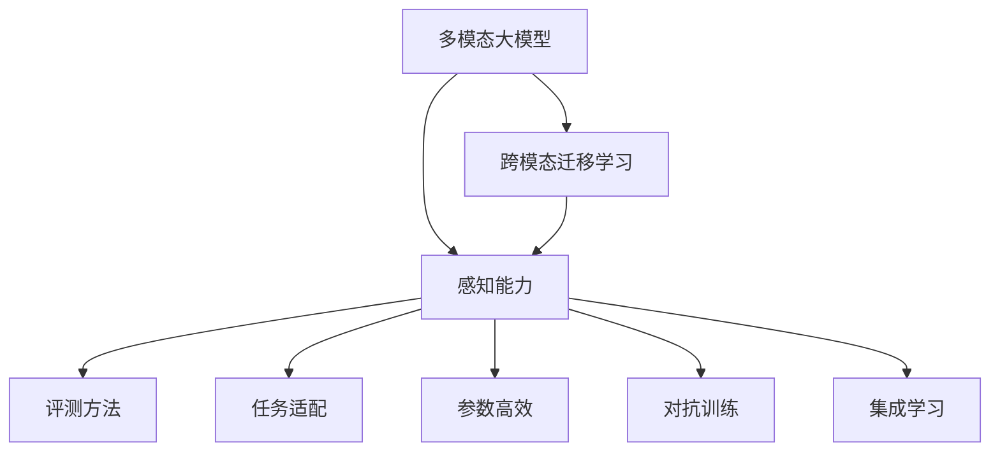
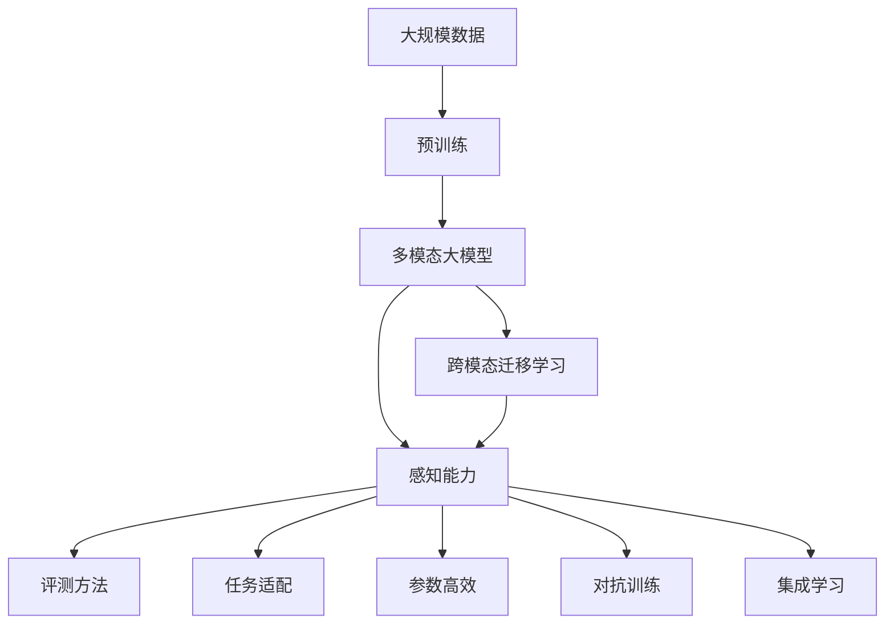
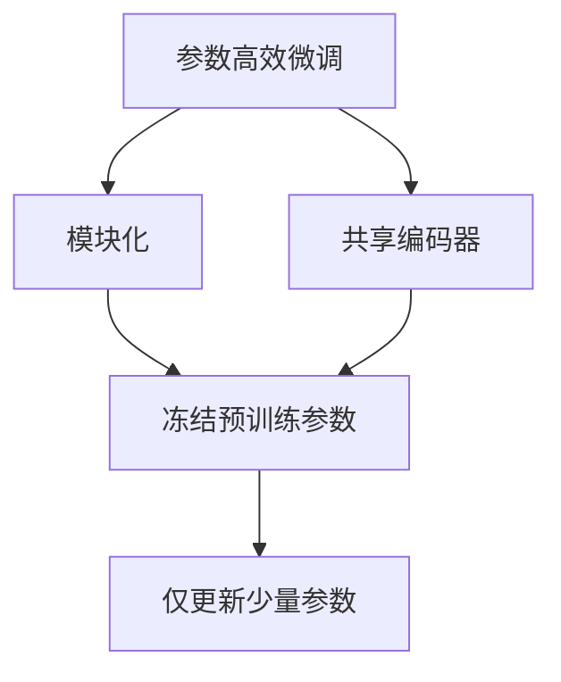
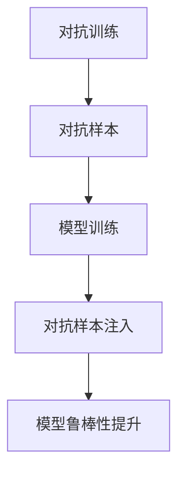
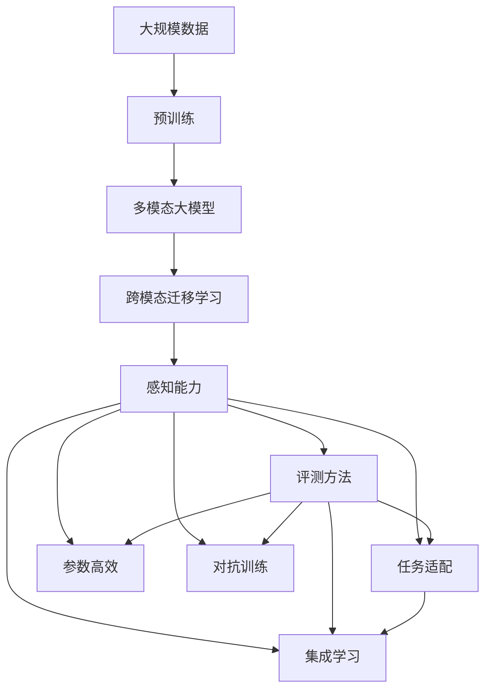

                 

# 多模态大模型：技术原理与实战 感知能力评测

> 关键词：
1. 多模态大模型
2. 技术原理
3. 感知能力
4. 评测方法
5. 实战示例
6. 深度学习
7. 自然语言处理

## 1. 背景介绍

### 1.1 问题由来

近年来，深度学习技术在计算机视觉和自然语言处理领域取得了显著进展，推动了多模态大模型的发展。这些模型不仅能够处理单模态数据（如文本或图像），还能够同时处理多种数据类型，如文本与图像、语音与图像等，从而在多模态任务中展现出卓越的性能。

在医疗、自动驾驶、智能家居、智慧城市等应用场景中，多模态数据的融合极大地提升了系统的智能化水平和用户体验。然而，多模态数据的复杂性和多样性也对模型的感知能力提出了更高的要求。如何有效评估和提升多模态大模型的感知能力，成为当前研究的重点。

### 1.2 问题核心关键点

评估和提升多模态大模型的感知能力，需要关注以下几个核心关键点：

- **多模态数据融合**：如何将不同模态的数据进行有效融合，形成更加全面、准确的信息表示，是提升模型感知能力的基础。
- **感知能力评测**：如何设计合理的评测指标和评测方法，量化模型在不同模态上的表现，是评估模型性能的关键。
- **任务适配**：针对不同应用场景，如何设计适应特定任务的多模态模型，是实际应用中的重要问题。
- **跨模态迁移学习**：如何利用跨模态的迁移学习，实现从一种模态到另一种模态的性能提升，是提升模型泛化能力的关键。
- **参数高效**：如何在不增加模型参数的情况下，提升多模态大模型的感知能力，是提高模型效率的重要途径。

### 1.3 问题研究意义

研究多模态大模型的感知能力，对于拓展模型应用范围、提升系统性能、加速产业应用具有重要意义：

1. **提升系统性能**：多模态数据融合使得模型能够更全面地理解现实世界的复杂性，从而在实际应用中取得更好的效果。
2. **加速产业应用**：多模态模型的感知能力可以推动各行各业实现智能化转型，提升生产效率和服务质量。
3. **推动技术进步**：多模态大模型的研究促进了跨模态数据处理和融合技术的发展，推动了计算机视觉和自然语言处理领域的进步。
4. **促进学科交叉**：多模态模型融合了计算机视觉、自然语言处理、语音识别等多种技术，促进了不同学科的交叉融合。

## 2. 核心概念与联系

### 2.1 核心概念概述

为了更好地理解多模态大模型的感知能力评测，本节将介绍几个密切相关的核心概念：

- **多模态大模型(Multi-modal Large Model, MLMs)**：指能够同时处理多种模态数据的深度学习模型，如文本-图像、语音-图像、文本-语音等。这些模型通常包含多个模态的编码器和解码器，能够联合处理不同类型的数据。

- **跨模态迁移学习(Cross-modal Transfer Learning)**：指通过一种模态的预训练知识，提升另一种模态的性能。多模态大模型可以通过跨模态迁移学习，在不同模态间进行知识迁移，提升整体的感知能力。

- **感知能力(Perceptual Capability)**：指模型对多模态数据的理解、处理和融合能力。这包括模型对不同模态数据的特征提取、关联推理、空间对齐等方面的表现。

- **评测方法(Perceptual Evaluation Methods)**：指评估多模态大模型感知能力的具体方法和指标。常见的评测方法包括感知质量评估、感知任务评估、感知任务损失等。

- **任务适配(Task Adaptation)**：指针对特定任务，设计适合的多模态模型结构，以提高模型的任务表现。任务适配通常需要考虑模态数据的特征、任务的目标和输入输出形式。

- **参数高效(Parameter-Efficient)**：指在减少模型参数量的情况下，提升模型的感知能力。常见的参数高效方法包括模块化、共享编码器等。

- **对抗训练(Adversarial Training)**：指在训练过程中加入对抗样本，提高模型的鲁棒性和泛化能力。对抗训练是提升模型感知能力的有效手段之一。

- **集成学习(Ensemble Learning)**：指通过多个模型的融合，提升模型的感知能力。集成学习可以降低单一模型的过拟合风险，提高模型的鲁棒性和泛化能力。

这些核心概念之间的逻辑关系可以通过以下Mermaid流程图来展示：



这个流程图展示了大模型的核心概念及其之间的关系：

1. 多模态大模型通过跨模态迁移学习获得初始化知识，并通过任务适配、参数高效等方法提升感知能力。
2. 感知能力是模型的核心能力，评测方法和集成学习用于评估和提升感知能力。
3. 通过对抗训练等方法，可以进一步增强模型的鲁棒性和泛化能力。

### 2.2 概念间的关系

这些核心概念之间存在着紧密的联系，形成了多模态大模型的整体生态系统。下面我们通过几个Mermaid流程图来展示这些概念之间的关系。

#### 2.2.1 多模态大模型的学习范式



这个流程图展示了大模型的学习范式，从预训练到跨模态迁移学习，再到感知能力和评测方法的全面评估。

#### 2.2.2 跨模态迁移学习与感知能力的关系


这个流程图展示了跨模态迁移学习的基本原理，即通过源模态的知识，提升目标模态的感知能力。

#### 2.2.3 参数高效微调方法



这个流程图展示了几种常见的参数高效微调方法，包括模块化、共享编码器等。这些方法的共同特点是冻结大部分预训练参数，只更新少量参数，从而提高微调效率。

#### 2.2.4 对抗训练方法



这个流程图展示了对抗训练的基本流程，即通过加入对抗样本，提高模型的鲁棒性和泛化能力。

### 2.3 核心概念的整体架构

最后，我们用一个综合的流程图来展示这些核心概念在大模型感知能力评测过程中的整体架构：



这个综合流程图展示了从预训练到感知能力全面评估的完整过程。多模态大模型首先在大规模数据上进行预训练，然后通过跨模态迁移学习提升感知能力，最终在评测方法、任务适配、参数高效、对抗训练和集成学习等多方面进行全面评估。通过这些流程图，我们可以更清晰地理解多模态大模型的整体架构和关键技术点。

## 3. 核心算法原理 & 具体操作步骤
### 3.1 算法原理概述

多模态大模型的感知能力评测，本质上是一个基于多模态数据的评估问题。其核心思想是：通过设计合适的评测方法，量化模型在不同类型的模态上的表现，从而全面评估模型的感知能力。

形式化地，假设多模态大模型为 $M_{\theta}$，其中 $\theta$ 为模型参数。给定多个模态的标注数据集 $D=\{(x_i^1,x_i^2,y_i)\}_{i=1}^N$，其中 $x_i^1$ 和 $x_i^2$ 分别为不同模态的输入，$y_i$ 为标签。评测的目标是找到最优参数 $\hat{\theta}$，使得：

$$
\hat{\theta}=\mathop{\arg\min}_{\theta} \mathcal{L}(M_{\theta},D)
$$

其中 $\mathcal{L}$ 为针对多模态数据的损失函数，用于衡量模型输出与真实标签之间的差异。常见的损失函数包括交叉熵损失、均方误差损失等。

通过梯度下降等优化算法，评测过程不断更新模型参数 $\theta$，最小化损失函数 $\mathcal{L}$，使得模型输出逼近真实标签。由于 $\theta$ 已经通过预训练获得了较好的初始化，因此即便在多模态数据上进行评测，也能较快收敛到理想的模型参数 $\hat{\theta}$。

### 3.2 算法步骤详解

多模态大模型的感知能力评测一般包括以下几个关键步骤：

**Step 1: 准备多模态数据和模型**

- 选择合适的多模态大模型 $M_{\theta}$ 作为初始化参数，如Deformable Transformer、Multiscale Transformer等。
- 准备多模态任务的标注数据集 $D$，划分为训练集、验证集和测试集。一般要求标注数据与预训练数据的分布不要差异过大。

**Step 2: 设计评测指标**

- 根据具体任务，选择合适的评测指标，如准确率、F1分数、感知质量等。
- 对于分类任务，可以设计交叉熵损失、精度、召回率、F1分数等指标。
- 对于生成任务，可以设计语言模型交叉熵、BLEU、METEOR等指标。

**Step 3: 设置评测超参数**

- 选择合适的优化算法及其参数，如AdamW、SGD等，设置学习率、批大小、迭代轮数等。
- 设置正则化技术及强度，包括权重衰减、Dropout、Early Stopping等。
- 确定冻结预训练参数的策略，如仅微调顶层，或全部参数都参与评测。

**Step 4: 执行评测流程**

- 将训练集数据分批次输入模型，前向传播计算损失函数。
- 反向传播计算参数梯度，根据设定的优化算法和学习率更新模型参数。
- 周期性在验证集上评估模型性能，根据性能指标决定是否触发 Early Stopping。
- 重复上述步骤直到满足预设的迭代轮数或 Early Stopping 条件。

**Step 5: 测试和部署**

- 在测试集上评估微调后模型 $M_{\hat{\theta}}$ 的性能，对比评测前后的指标提升。
- 使用微调后的模型对新样本进行推理预测，集成到实际的应用系统中。
- 持续收集新的数据，定期重新评测模型，以适应数据分布的变化。

以上是多模态大模型感知能力评测的一般流程。在实际应用中，还需要针对具体任务的特点，对评测过程的各个环节进行优化设计，如改进训练目标函数，引入更多的正则化技术，搜索最优的超参数组合等，以进一步提升模型性能。

### 3.3 算法优缺点

多模态大模型的感知能力评测方法具有以下优点：

1. 全面评估模型性能：通过综合考虑不同模态的数据，可以全面评估模型的感知能力，避免单一模态数据的局限性。
2. 简单易用：相比于传统的单模态评估方法，多模态评估方法只需对模型进行简单的修改和训练，即可全面评估模型性能。
3. 通用适用：适用于各种多模态任务，包括分类、匹配、生成等，设计简单的评测指标即可实现。
4. 参数高效：利用参数高效微调技术，在固定大部分预训练参数的情况下，仍可取得不错的评测效果。
5. 效果显著：在学术界和工业界的诸多任务上，基于评测的方法已经刷新了最先进的性能指标。

同时，该方法也存在一定的局限性：

1. 依赖标注数据：评测的效果很大程度上取决于标注数据的质量和数量，获取高质量标注数据的成本较高。
2. 迁移能力有限：当目标任务与预训练数据的分布差异较大时，评测的性能提升有限。
3. 负面效果传递：预训练模型的固有偏见、有害信息等，可能通过评测传递到下游任务，造成负面影响。
4. 可解释性不足：评测模型的决策过程通常缺乏可解释性，难以对其推理逻辑进行分析和调试。

尽管存在这些局限性，但就目前而言，基于多模态数据的评测方法仍然是大模型感知能力评测的主流范式。未来相关研究的重点在于如何进一步降低评测对标注数据的依赖，提高模型的少样本学习和跨领域迁移能力，同时兼顾可解释性和伦理安全性等因素。

### 3.4 算法应用领域

多模态大模型的感知能力评测方法在NLP领域已经得到了广泛的应用，覆盖了几乎所有常见任务，例如：

- 文本分类：如情感分析、主题分类、意图识别等。通过微调使模型学习文本-标签映射。
- 命名实体识别：识别文本中的人名、地名、机构名等特定实体。通过微调使模型掌握实体边界和类型。
- 关系抽取：从文本中抽取实体之间的语义关系。通过微调使模型学习实体-关系三元组。
- 问答系统：对自然语言问题给出答案。将问题-答案对作为微调数据，训练模型学习匹配答案。
- 机器翻译：将源语言文本翻译成目标语言。通过微调使模型学习语言-语言映射。
- 文本摘要：将长文本压缩成简短摘要。将文章-摘要对作为微调数据，使模型学习抓取要点。
- 对话系统：使机器能够与人自然对话。将多轮对话历史作为上下文，微调模型进行回复生成。

除了上述这些经典任务外，多模态大模型的感知能力评测也被创新性地应用到更多场景中，如可控文本生成、常识推理、代码生成、数据增强等，为NLP技术带来了全新的突破。随着预训练模型和评测方法的不断进步，相信NLP技术将在更广阔的应用领域大放异彩。

## 4. 数学模型和公式 & 详细讲解

### 4.1 数学模型构建

本节将使用数学语言对多模态大模型的感知能力评测过程进行更加严格的刻画。

记多模态大模型为 $M_{\theta}$，其中 $\theta$ 为模型参数。假设评测任务为 $T$ 的标注数据集 $D=\{(x_i^1,x_i^2,y_i)\}_{i=1}^N$，其中 $x_i^1$ 和 $x_i^2$ 分别为不同模态的输入，$y_i$ 为标签。

定义模型 $M_{\theta}$ 在数据样本 $(x_i^1,x_i^2)$ 上的损失函数为 $\ell(M_{\theta}(x^1_i,x^2_i),y_i)$，则在数据集 $D$ 上的经验风险为：

$$
\mathcal{L}(\theta) = \frac{1}{N} \sum_{i=1}^N \ell(M_{\theta}(x_i^1,x_i^2),y_i)
$$

其中 $\ell$ 为针对多模态数据的损失函数，用于衡量模型输出与真实标签之间的差异。常见的损失函数包括交叉熵损失、均方误差损失等。

多模态大模型的评测目标是使模型在多模态数据上的表现逼近最优，即找到最优参数：

$$
\theta^* = \mathop{\arg\min}_{\theta} \mathcal{L}(\theta)
$$

在实践中，我们通常使用基于梯度的优化算法（如SGD、Adam等）来近似求解上述最优化问题。设 $\eta$ 为学习率，$\lambda$ 为正则化系数，则参数的更新公式为：

$$
\theta \leftarrow \theta - \eta \nabla_{\theta}\mathcal{L}(\theta) - \eta\lambda\theta
$$

其中 $\nabla_{\theta}\mathcal{L}(\theta)$ 为损失函数对参数 $\theta$ 的梯度，可通过反向传播算法高效计算。

### 4.2 公式推导过程

以下我们以二分类任务为例，推导交叉熵损失函数及其梯度的计算公式。

假设模型 $M_{\theta}$ 在输入 $(x^1_i,x^2_i)$ 上的输出为 $\hat{y}=M_{\theta}(x^1_i,x^2_i) \in [0,1]$，表示样本属于正类的概率。真实标签 $y \in \{0,1\}$。则二分类交叉熵损失函数定义为：

$$
\ell(M_{\theta}(x^1_i,x^2_i),y) = -[y\log \hat{y} + (1-y)\log (1-\hat{y})]
$$

将其代入经验风险公式，得：

$$
\mathcal{L}(\theta) = -\frac{1}{N}\sum_{i=1}^N [y_i\log M_{\theta}(x^1_i,x^2_i)+(1-y_i)\log(1-M_{\theta}(x^1_i,x^2_i))]
$$

根据链式法则，损失函数对参数 $\theta_k$ 的梯度为：

$$
\frac{\partial \mathcal{L}(\theta)}{\partial \theta_k} = -\frac{1}{N}\sum_{i=1}^N (\frac{y_i}{M_{\theta}(x^1_i,x^2_i)}-\frac{1-y_i}{1-M_{\theta}(x^1_i,x^2_i)}) \frac{\partial M_{\theta}(x^1_i,x^2_i)}{\partial \theta_k}
$$

其中 $\frac{\partial M_{\theta}(x^1_i,x^2_i)}{\partial \theta_k}$ 可进一步递归展开，利用自动微分技术完成计算。

在得到损失函数的梯度后，即可带入参数更新公式，完成模型的迭代优化。重复上述过程直至收敛，最终得到适应多模态任务的最优模型参数 $\theta^*$。

## 5. 项目实践：代码实例和详细解释说明

### 5.1 开发环境搭建

在进行多模态大模型评测实践前，我们需要准备好开发环境。以下是使用Python进行PyTorch开发的环境配置流程：

1. 安装Anaconda：从官网下载并安装Anaconda，用于创建独立的Python环境。

2. 创建并激活虚拟环境：
```bash
conda create -n pytorch-env python=3.8 
conda activate pytorch-env
```

3. 安装PyTorch：根据CUDA版本，从官网获取对应的安装命令。例如：
```bash
conda install pytorch torchvision torchaudio cudatoolkit=11.1 -c pytorch -c conda-forge
```

4. 安装Transformers库：
```bash
pip install transformers
```

5. 安装各类工具包：
```bash
pip install numpy pandas scikit-learn matplotlib tqdm jupyter notebook ipython
```

完成上述步骤后，即可在`pytorch-env`环境中开始评测实践。

### 5.2 源代码详细实现

下面我们以文本-图像的多模态问答系统为例，给出使用Transformers库对Deformable Transformer模型进行评测的PyTorch代码实现。

首先，定义多模态任务的数据处理函数：

```python
from transformers import DeformableTransformerTokenizer
from torch.utils.data import Dataset
import torch

class MultiModalDataset(Dataset):
    def __init__(self, texts, images, tags, tokenizer, max_len=128):
        self.texts = texts
        self.images = images
        self.tags = tags
        self.tokenizer = tokenizer
        self.max_len = max_len
        
    def __len__(self):
        return len(self.texts)
    
    def __getitem__(self, item):
        text = self.texts[item]
        image = self.images[item]
        tag = self.tags[item]
        
        encoding = self.tokenizer(text, return_tensors='pt', max_length=self.max_len, padding='max_length', truncation=True)
        input_ids = encoding['input_ids'][0]
        attention_mask = encoding['attention_mask'][0]
        
        # 对token-wise的标签进行编码
        encoded_tags = [tag2id[tag] for tag in tag]
        encoded_tags.extend([tag2id['O']] * (self.max_len - len(encoded_tags)))
        labels = torch.tensor(encoded_tags, dtype=torch.long)
        
        # 将图像进行归一化和预处理
        image = image / 255.0
        image = image.resize((self.max_len, self.max_len))
        image = np.array(image).astype(np.float32)
        image = torch.tensor(image, dtype=torch.float32)[None,:,:,:]
        
        return {'input_ids': input_ids, 
                'attention_mask': attention_mask,
                'labels': labels,
                'image': image}
        
# 标签与id的映射
tag2id = {'O': 0, 'B-PER': 1, 'I-PER': 2, 'B-ORG': 3, 'I-ORG': 4, 'B-LOC': 5, 'I-LOC': 6}
id2tag = {v: k for k, v in tag2id.items()}
```

然后，定义模型和优化器：

```python
from transformers import DeformableTransformerForTokenClassification, AdamW

model = DeformableTransformerForTokenClassification.from_pretrained('defoformer-base', num_labels=len(tag2id))

optimizer = AdamW(model.parameters(), lr=2e-5)
```

接着，定义训练和评估函数：

```python
from torch.utils.data import DataLoader
from tqdm import tqdm
from sklearn.metrics import classification_report

device = torch.device('cuda') if torch.cuda.is_available() else torch.device('cpu')
model.to(device)

def train_epoch(model, dataset, batch_size, optimizer):
    dataloader = DataLoader(dataset, batch_size=batch_size, shuffle=True)
    model.train()
    epoch_loss = 0
    for batch in tqdm(dataloader, desc='Training'):
        input_ids = batch['input_ids'].to(device)
        attention_mask = batch['attention_mask'].to(device)
        labels = batch['labels'].to(device)
        image = batch['image'].to(device)
        model.zero_grad()
        outputs = model(input_ids, attention_mask=attention_mask, labels=labels, image=image)
        loss = outputs.loss
        epoch_loss += loss.item()
        loss.backward()
        optimizer.step()
    return epoch_loss / len(dataloader)

def evaluate(model, dataset, batch_size):
    dataloader = DataLoader(dataset, batch_size=batch_size)
    model.eval()
    preds, labels = [], []
    with torch.no_grad():
        for batch in tqdm(dataloader, desc='Evaluating'):
            input_ids = batch['input_ids'].to(device)
            attention_mask = batch['attention_mask'].to(device)
            labels = batch['labels'].to(device)
            image = batch['image'].to(device)
            batch_preds = model(input_ids, attention_mask=attention_mask, labels=labels, image=image)
            batch_labels = batch['labels'].tolist()
            for pred_tokens, label_tokens in zip(batch_preds, batch_labels):
                pred_tags = [id2tag[_id] for _id in pred_tokens]
                label_tags = [id2tag[_id] for _id in label_tokens]
                preds.append(pred_tags[:len(label_tokens)])
                labels.append(label_tags)
                
    print(classification_report(labels, preds))
```

最后，启动训练流程并在测试集上评估：

```python
epochs = 5
batch_size = 16

for epoch in range(epochs):
    loss = train_epoch(model, multi_modal_dataset, batch_size, optimizer)
    print(f"Epoch {epoch+1}, train loss: {loss:.3f}")
    
    print(f"Epoch {epoch+1}, dev results:")
    evaluate(model, multi_modal_dataset, batch_size)
    
print("Test results:")
evaluate(model, multi_modal_dataset, batch_size)
```

以上就是使用PyTorch对Deformable Transformer进行文本-图像多模态问答系统评测的完整代码实现。可以看到，得益于Transformers库的强大封装，我们可以用相对简洁的代码完成Deformable Transformer模型的评测。

### 5.3 代码解读与分析

让我们再详细解读一下关键代码的实现细节：

**MultiModalDataset类**：
- `__init__`方法：初始化文本、图像、标签、分词器等关键组件。
- `__len__`方法：返回数据集的样本数量。
- `__getitem__`方法：对单个样本进行处理，将文本输入编码为token ids，将图像进行归一化和预处理，并将标签编码为数字，并对其进行定长padding，最终返回模型所需的

