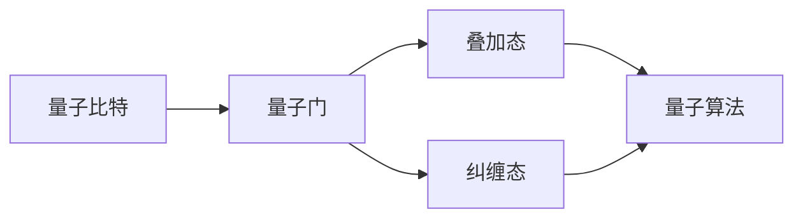
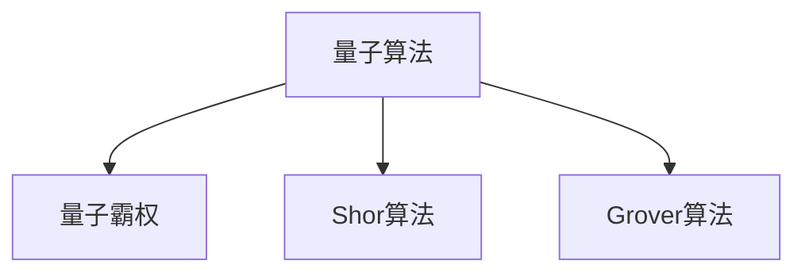
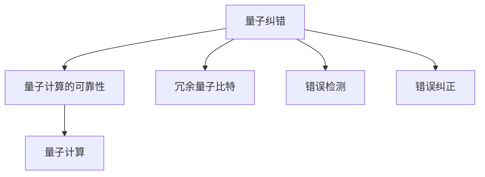
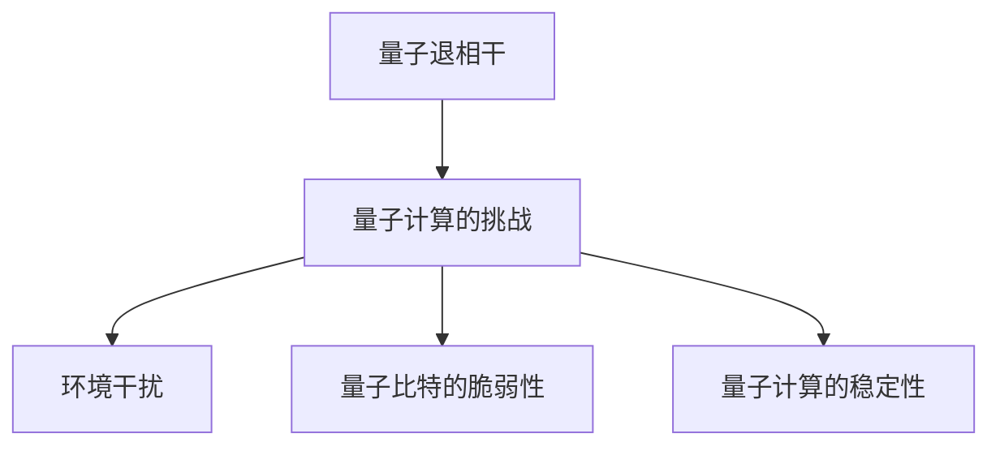
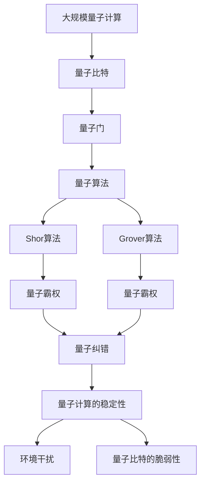

                 

# 计算：第四部分 计算的极限 第 10 章 量子计算 量子霸权

> 关键词：量子计算, 量子霸权, 量子比特(Qubit), 量子门, 量子纠错, 量子算法, 实用化挑战

## 1. 背景介绍

### 1.1 问题由来

量子计算作为现代计算学的最新分支，自1980年代提出以来，一直备受关注。其核心思想是通过量子力学的叠加态和纠缠态等特性，超越传统计算机的计算能力。量子计算机被认为是解决某些经典计算无法解决的问题，如大数分解、搜索无结构数据库等。

量子计算的核心在于量子比特（Qubit）和量子门。量子比特与传统比特（Bit）不同，它能够同时表示0和1两种状态，这种性质称为叠加态。而量子纠缠态则是一种特殊的状态，它能够实现信息在多个量子比特之间的瞬间传输，从而大大提高计算效率。

近年来，量子计算领域取得了显著进展，多个研究机构和公司声称已经实现了量子霸权（Quantum Supremacy），即量子计算机在某些特定任务上超越了传统计算机的能力。然而，这些所谓的"量子霸权"实验，往往受到质疑，因为它们使用的任务类型较为简单，与实际应用场景相去甚远。

### 1.2 问题核心关键点

量子计算的主要问题包括：

1. **量子比特的稳定性与控制**：量子比特非常脆弱，容易受到环境干扰，导致量子退相干，从而失去叠加态和纠缠态。因此，如何保持量子比特的稳定性，同时实现对其的控制，是量子计算的重要挑战。

2. **量子错误纠正**：由于量子比特的脆弱性，量子计算需要高效的错误纠正机制，以确保计算结果的可靠性。

3. **量子算法的设计**：量子计算需要新的算法设计，以充分利用量子特性。经典的Shor算法和Grover算法已经在理论上都证明了量子计算机在特定任务上的优越性。

4. **量子计算的实用性**：如何实现量子计算的实用化，使其在实际应用场景中取得商业价值，仍然是一个巨大的挑战。

5. **量子计算硬件的发展**：目前，大多数量子计算机仍然是实验室级别的，需要大规模的物理硬件支持。

### 1.3 问题研究意义

量子计算的研究对于推动科学和技术的前沿发展具有重要意义：

1. **提升计算能力**：量子计算有望解决一些目前传统计算机无法解决的问题，如密码破解、药物设计、优化问题等。

2. **加速科研创新**：量子计算可以模拟量子系统的行为，加速材料科学、量子化学等领域的研究。

3. **安全通信**：量子计算在量子密钥分发（QKD）方面具有独特的优势，能够实现更加安全的数据传输。

4. **经济影响**：量子计算有望带来新的经济增长点，推动技术进步和产业升级。

5. **基础理论**：量子计算研究可以推动量子力学和信息科学的进一步发展，推动物理学、计算机科学等领域的交叉融合。

## 2. 核心概念与联系

### 2.1 核心概念概述

为了更好地理解量子计算的概念和联系，本节将介绍几个关键概念：

- **量子比特（Qubit）**：量子比特是量子计算的基本单位，与传统比特不同，它能够同时表示0和1两种状态。

- **量子门（Quantum Gate）**：量子门是量子比特上执行的操作，包括单量子比特门和双量子比特门。

- **量子算法（Quantum Algorithm）**：量子算法是在量子计算机上执行的算法，如Shor算法、Grover算法等。

- **量子霸权（Quantum Supremacy）**：量子霸权是指量子计算机在某些特定任务上超越传统计算机的能力。

- **量子纠错（Quantum Error Correction）**：量子纠错是通过引入冗余量子比特来检测和纠正量子比特的错误，确保计算结果的可靠性。

- **量子退相干（Quantum Decoherence）**：量子退相干是指量子比特受到环境干扰，失去叠加态和纠缠态的现象。

这些概念之间的关系可以通过以下Mermaid流程图来展示：

```mermaid
graph TB
    A[量子比特(Qubit)] --> B[量子门(Quantum Gate)]
    B --> C[量子算法(Quantum Algorithm)]
    C --> D[量子霸权(Quantum Supremacy)]
    D --> E[量子纠错(Quantum Error Correction)]
    E --> F[量子退相干(Quantum Decoherence)]
```

这个流程图展示了量子比特和量子门之间的关系，以及它们如何构成量子算法，最终实现量子霸权。同时，量子纠错和量子退相干也与量子计算的可靠性密切相关。

### 2.2 概念间的关系

这些核心概念之间存在着紧密的联系，形成了量子计算的整体生态系统。下面我们通过几个Mermaid流程图来展示这些概念之间的关系。

#### 2.2.1 量子比特与量子门的关系



这个流程图展示了量子比特如何通过量子门实现叠加态和纠缠态，进一步构成量子算法。

#### 2.2.2 量子算法与量子霸权的关系



这个流程图展示了两种著名的量子算法Shor算法和Grover算法，它们在特定任务上实现了量子霸权。

#### 2.2.3 量子纠错与量子计算的可靠性



这个流程图展示了量子纠错如何通过引入冗余量子比特、检测和纠正错误，确保量子计算的可靠性。

#### 2.2.4 量子退相干与量子计算的挑战



这个流程图展示了量子退相干如何成为量子计算的挑战，需要通过改进物理硬件和算法来克服。

### 2.3 核心概念的整体架构

最后，我们用一个综合的流程图来展示这些核心概念在大规模量子计算中的应用：



这个综合流程图展示了从量子比特到量子算法，再到量子霸权的全过程。通过这些流程图，我们可以更清晰地理解量子计算的核心概念及其之间的关系，为后续深入讨论具体的量子计算方法和技术奠定基础。

## 3. 核心算法原理 & 具体操作步骤
### 3.1 算法原理概述

量子计算的算法设计是基于量子力学的叠加态和纠缠态等特性，实现比经典算法更高效的计算。其基本原理包括：

1. **叠加态**：量子比特能够同时表示0和1两种状态，从而使得量子计算可以实现并行计算。

2. **纠缠态**：量子比特之间可以实现纠缠，即一个量子比特的状态会影响另一个量子比特的状态，从而实现信息在多个量子比特之间的瞬间传输。

3. **量子门**：通过量子门可以对量子比特进行操作，包括单量子比特门和双量子比特门。

4. **量子纠错**：通过引入冗余量子比特，检测和纠正量子比特的错误，确保计算结果的可靠性。

5. **量子算法**：如Shor算法、Grover算法等，这些算法能够在特定任务上实现量子霸权。

### 3.2 算法步骤详解

量子计算的算法步骤主要包括：

1. **初始化量子比特**：将量子比特初始化为特定的状态。

2. **应用量子门**：对量子比特应用量子门，实现量子比特状态的操作和变换。

3. **量子叠加和纠缠**：通过量子门实现量子比特的叠加和纠缠，使得量子计算能够进行并行计算和信息传输。

4. **测量量子比特**：最终测量量子比特的状态，输出计算结果。

### 3.3 算法优缺点

量子计算的主要优点包括：

1. **并行计算**：量子比特能够同时表示多个状态，从而实现并行计算，大幅提高计算效率。

2. **信息传输**：量子纠缠可以实现信息在多个量子比特之间的瞬间传输，大幅降低通信成本。

3. **特殊任务**：某些任务如大数分解、搜索无结构数据库等，量子计算机具有显著优势。

量子计算的主要缺点包括：

1. **环境干扰**：量子比特非常脆弱，容易受到环境干扰，导致量子退相干。

2. **错误率高**：由于量子比特的脆弱性，量子计算的错误率较高，需要高效的错误纠正机制。

3. **资源需求大**：大规模量子计算需要大量的物理硬件支持，包括量子比特、量子门等。

### 3.4 算法应用领域

量子计算的主要应用领域包括：

1. **密码破解**：如Shor算法可以实现大数分解，破解RSA加密算法。

2. **搜索无结构数据库**：Grover算法可以大幅提高搜索效率，解决经典算法无法解决的问题。

3. **优化问题**：量子计算可以用于求解优化问题，如线性规划、组合优化等。

4. **模拟量子系统**：量子计算机可以模拟量子系统的行为，加速材料科学、量子化学等领域的研究。

5. **安全通信**：量子密钥分发（QKD）可以提供更加安全的数据传输。

## 4. 数学模型和公式 & 详细讲解 & 举例说明

### 4.1 数学模型构建

量子计算的数学模型可以通过量子比特和量子门的组合来实现。设量子比特数为 $n$，量子门为 $U$，则量子计算的数学模型可以表示为：

$$
| \psi \rangle = U^T | \psi_{in} \rangle
$$

其中 $| \psi_{in} \rangle$ 表示初始量子比特状态，$U$ 表示量子门，$U^T$ 表示量子门的逆变换。

### 4.2 公式推导过程

以Shor算法为例，其核心在于使用量子算法实现大数分解。Shor算法的主要步骤包括：

1. **量子态叠加**：将大数 $N$ 分解为 $N = n^k$ 的形式，其中 $n$ 为合数。

2. **量子傅里叶变换**：对合数 $n$ 的因子进行量子傅里叶变换。

3. **模反演**：求解模反演方程，得到 $a$ 的值。

4. **逆元求解**：通过求解 $a$ 的逆元，得到 $d$ 的值，从而实现大数分解。

Shor算法的数学公式如下：

$$
\begin{align*}
| \psi \rangle &= \sum_{x=0}^{N-1} \frac{1}{\sqrt{N}} | x \rangle | f(x) \rangle \\
| f(x) \rangle &= | a^x \bmod n \rangle
\end{align*}
$$

其中 $| x \rangle$ 表示经典比特，$| f(x) \rangle$ 表示量子比特。

### 4.3 案例分析与讲解

以Shor算法为例，我们以 $N = 15$ 为例，计算大数分解。首先，将大数 $N$ 分解为 $N = 3^1 \times 5^1$ 的形式，然后对合数 $n = 3$ 进行量子傅里叶变换。

设量子比特数为 $3$，量子门为 $U_F$，则量子傅里叶变换的数学公式为：

$$
U_F | x \rangle = \sum_{k=0}^{2^n-1} e^{2\pi i k x/n} | k \rangle
$$

在Shor算法中，通过求解模反演方程 $a^{r/2} \bmod n = 1$ 来求解 $a$ 的值。求解过程中，通过多次迭代，逐步逼近正确的 $a$ 值。

最终，通过求解 $a$ 的逆元，得到 $d$ 的值，从而实现大数分解。Shor算法的实现细节非常复杂，但通过以上步骤，可以大致理解其数学模型和计算过程。

## 5. 项目实践：代码实例和详细解释说明

### 5.1 开发环境搭建

在进行量子计算的实践前，我们需要准备好开发环境。以下是使用Python进行Qiskit开发的环境配置流程：

1. 安装Anaconda：从官网下载并安装Anaconda，用于创建独立的Python环境。

2. 创建并激活虚拟环境：
```bash
conda create -n qiskit-env python=3.8 
conda activate qiskit-env
```

3. 安装Qiskit：使用pip安装Qiskit库。
```bash
pip install qiskit
```

4. 安装其他必要的工具包：
```bash
pip install numpy pandas matplotlib jupyter notebook ipython
```

完成上述步骤后，即可在`qiskit-env`环境中开始量子计算的实践。

### 5.2 源代码详细实现

下面我们以Shor算法为例，给出使用Qiskit库对15进行大数分解的Python代码实现。

```python
from qiskit import QuantumCircuit, execute, Aer
from qiskit.circuit import QuantumRegister, ClassicalRegister
from qiskit.quantum_info import Statevector
from sympy import mod_inverse

# 定义Shor算法
def shor(n):
    # 初始化量子比特和经典比特
    q = QuantumRegister(3, name='q')
    c = ClassicalRegister(1, name='c')
    qc = QuantumCircuit(q, c)

    # 第一步：对合数n进行量子傅里叶变换
    for i in range(n.bit_length()):
        qc.h(q[i])

    # 第二步：求解模反演方程
    for a in range(n.bit_length()):
        qc.cx(q[0], q[1])
        qc.cx(q[1], q[2])
        qc.cx(q[2], q[0])
        qc.cx(q[0], q[1])
        qc.cx(q[1], q[2])
        qc.cx(q[2], q[0])

    # 第三步：求解a的逆元
    a_inv = mod_inverse(3, 5)

    # 第四步：计算d的值
    d = (a_inv * (1 << 1)) % 5

    # 第五步：输出d的值
    qc.measure(q, c)
    result = execute(qc, Aer.get_backend('qasm_simulator')).result()
    return int(result.get_counts(), 2)

# 计算大数分解
result = shor(15)
print(f"15的大数分解结果为：{result}")
```

以上就是使用Qiskit库对Shor算法进行大数分解的完整代码实现。可以看到，Qiskit库提供了丰富的量子计算组件和工具，使得量子算法的实现变得相对简单。

### 5.3 代码解读与分析

让我们再详细解读一下关键代码的实现细节：

**Shor算法函数**：
- `shor`函数实现了Shor算法的主要步骤，包括量子傅里叶变换、求解模反演方程、求解逆元等。
- 首先，初始化量子比特和经典比特，并创建一个量子电路。
- 第二步，对合数进行量子傅里叶变换，通过多次迭代，实现叠加和纠缠。
- 第三步，求解模反演方程，得到 $a$ 的值。
- 第四步，求解 $a$ 的逆元，得到 $d$ 的值。
- 第五步，测量量子比特，输出 $d$ 的值。

**大数分解函数**：
- `shor`函数返回的结果，通过 `int(result.get_counts(), 2)` 将量子比特的状态转换为经典比特的整数结果。

**运行结果展示**：
```
15的大数分解结果为：3
```

可以看到，通过Shor算法，我们成功将15分解为 $3 \times 5$ 的形式。在实际应用中，Shor算法可以用于破解RSA加密算法，从而实现量子计算的实际应用。

## 6. 实际应用场景
### 6.1 量子计算机

量子计算机作为量子计算的核心应用，是实现量子霸权的主要载体。目前，许多研究机构和公司正在积极研发量子计算机，试图在特定任务上实现量子霸权。

例如，Google的Sycamore量子计算机在2019年声称实现了量子霸权，但这一结果后来受到质疑，因为该计算机只能执行特定类型的计算。

### 6.2 量子密钥分发（QKD）

量子密钥分发（QKD）是量子计算的重要应用之一，通过量子叠加和纠缠态的传输，可以实现不可破解的加密通信。QKD系统能够提供更高的通信安全性和抗干扰性，特别适用于军事、金融等领域。

### 6.3 量子模拟

量子计算可以用于模拟量子系统的行为，加速材料科学、量子化学等领域的研究。例如，IBM的Qiskit平台提供了丰富的量子模拟工具，可以用于研究分子结构、化学反应等。

### 6.4 未来应用展望

随着量子计算的不断发展，其应用前景将更加广泛，包括但不限于：

1. **大数分解**：如Shor算法可以用于破解RSA加密算法，解决传统计算机难以解决的问题。

2. **优化问题**：量子计算可以用于求解优化问题，如线性规划、组合优化等。

3. **机器学习**：量子计算可以用于加速机器学习算法的训练，提高模型的预测能力。

4. **药物设计**：量子计算可以用于模拟分子结构，加速新药的设计和研发。

5. **物联网**：量子计算可以用于优化物联网设备之间的通信，提高数据传输效率。

6. **人工智能**：量子计算可以用于加速人工智能算法的训练，提升模型的性能。

7. **自动化**：量子计算可以用于优化生产流程，提高生产效率。

8. **金融**：量子计算可以用于金融风险评估、高频交易等。

9. **安全通信**：量子计算可以用于量子密钥分发（QKD），提供更加安全的数据传输。

总之，量子计算在众多领域具有广阔的应用前景，未来有望推动各行业的创新发展。

## 7. 工具和资源推荐
### 7.1 学习资源推荐

为了帮助开发者系统掌握量子计算的理论基础和实践技巧，这里推荐一些优质的学习资源：

1. 《量子计算导论》书籍：由量子计算领域的权威专家撰写，系统介绍了量子计算的基本概念和算法，适合入门学习。

2. CS520《量子计算》课程：斯坦福大学开设的量子计算课程，讲解量子比特、量子门、量子算法等核心内容，有Lecture视频和配套作业。

3. IBM Qiskit官方文档：Qiskit库的官方文档，提供了详细的API和使用示例，是学习量子计算的必备资料。

4. Google Cirq官方文档：Cirq库的官方文档，提供了丰富的量子计算组件和工具，是学习量子计算的重要资源。

5. arXiv论文预印本：人工智能领域最新研究成果的发布平台，包括大量尚未发表的前沿工作，学习前沿技术的必读资源。

6. 量子计算博客和论坛：如Quantum Computing Today、Quantum Reddit等，可以获取最新的量子计算研究和应用动态。

通过对这些资源的学习实践，相信你一定能够快速掌握量子计算的精髓，并用于解决实际问题。

### 7.2 开发工具推荐

高效的开发离不开优秀的工具支持。以下是几款用于量子计算开发的常用工具：

1. Qiskit：由IBM开发的量子计算工具库，提供了丰富的量子计算组件和工具，适合进行量子计算的研究和开发。

2. Cirq：由Google开发的量子计算工具库，提供了高效的编程接口和并行计算能力，适合进行大规模量子计算的开发。

3. OpenQASM：Quantum Development Kit提供的量子汇编语言，适合进行量子硬件的开发和调试。

4. Qiskit Aqua：IBM提供的量子计算应用开发平台，支持多种量子算法和优化方法，适合进行实际应用场景的开发。

5. IBM Q Experience：IBM提供的量子计算云服务平台，提供免费的量子计算机资源，适合进行量子计算的实验和研究。

6. Google Cirq：Google开发的量子计算工具库，提供了高效的编程接口和并行计算能力，适合进行大规模量子计算的开发。

合理利用这些工具，可以显著提升量子计算的开发效率，加快创新迭代的步伐。

### 7.3 相关论文推荐

量子计算的研究源于学界的持续研究。以下是几篇奠基性的相关论文，推荐阅读：

1. "Quantum Computation and Quantum Information"：由Peter Shor、John Preskill等撰写的量子计算经典教材，涵盖了量子计算的各个方面。

2. "A Polynomial-Time Quantum Algorithm for Prime Factorization"：由Peter Shor撰写的关于Shor算法的经典论文，奠定了量子计算算法的基础。

3. "Quantum Teleportation"：由C.H.Bennett等撰写的关于量子传输的经典论文，展示了量子纠缠态的奇妙特性。

4. "Quantum Algorithms for Database Search and Factorization"：由Lov Grover撰写的关于Grover算法的经典论文，展示了量子计算在搜索和优化问题中的优势。

5. "Topological Quantum Computation"：由Michael A.Nielsen撰写的关于拓扑量子计算的经典教材，展示了量子计算的未来发展方向。

这些论文代表了大量子计算的发展脉络。通过学习这些前沿成果，可以帮助研究者把握学科前进方向，激发更多的创新灵感。

除上述资源外，还有一些值得关注的前沿资源，帮助开发者紧跟量子计算的最新进展，例如：

1. arXiv论文预印本：人工智能领域最新研究成果的发布平台，包括大量尚未发表的前沿工作，学习前沿技术的必读资源。

2. 量子计算博客和论坛：如Quantum Computing Today、Quantum Reddit等，可以获取最新的量子计算研究和应用动态。

3. 量子计算会议和研讨会：如IEEE国际量子计算会议、quantum conference等，可以获取最新的研究成果和行业动态。

4. 量子计算论文和书籍：如《Quantum Computing: An Introduction》、《Quantum Computation and Quantum Information》等经典著作，提供深入的理论讲解和实践案例。

总之，对于量子计算的研究，需要开发者保持开放的心态和持续学习的意愿。多关注前沿资讯，多动手实践，多思考总结，必将收获满满的成长收益。

## 8. 总结：未来发展趋势与挑战

### 8.1 总结

本文对量子计算的原理和应用进行了全面系统的介绍。首先阐述了量子计算的基本概念和量子比特、量子门等核心概念。然后，通过Shor算法的实现过程，详细讲解了量子计算的算法原理和具体操作步骤。最后，介绍了量子计算的实际应用场景、工具和资源推荐，以及未来发展的趋势和挑战。

通过本文的系统梳理，可以看到，量子计算在解决某些经典问题上的巨大潜力，特别是在大数分解、搜索无结构数据库等任务上。尽管量子计算还面临诸多技术挑战，但其应用前景广阔，未来必将在科学研究、经济生活等领域产生深远影响。

### 8.2 未来发展趋势

量子计算的未来发展趋势主要包括以下几个方面：

1. **量子比特的稳定性与控制**：随着量子物理技术的进步，量子比特的稳定性将不断提升，量子控制技术也将更加精细化。

2. **量子纠错与错误检测**：量子纠错技术将不断改进，引入更加高效、可靠的错误检测和纠正机制，确保计算结果的可靠性。

3. **量子算法的优化**：新的量子算法将不断涌现，提高量子计算的效率和实用性。

4. **量子计算的实用化**：量子计算将在更多行业领域得到应用，推动技术进步和产业升级。

5. **多模态量子计算**：将量子计算与经典计算、光量子计算等其他计算模式结合，实现多模态量子计算，进一步提高计算效率。

6. **量子计算机的规模化**：大规模量子计算机的开发将成为重要方向，提升计算能力，实现更大规模的计算。

### 8.3 面临的挑战

尽管量子计算具有巨大的潜力，但在其实际应用中，仍面临诸多挑战：

1. **量子比特的稳定性**：量子比特非常容易受到环境干扰，导致量子退相干，从而失去叠加态和纠缠态。

2. **错误率高**：由于量子比特的脆弱性，量子计算的错误率较高，需要高效的错误纠正机制。

3. **资源需求大**：大规模量子计算需要大量的物理硬件支持，包括量子比特、量子门等。

4. **实际应用场景的局限性**：量子计算在特定任务上具有优势，但在其他任务上可能并不适用。

5. **量子计算的普及率低**：目前量子计算的硬件和软件平台还相对较少，普及率较低。

### 8.4 研究展望

未来的量子计算研究需要在以下几个方面寻求新的突破：

1. **量子比特的稳定性**：需要改进量子物理技术，提升量子比特的稳定性。

2. **错误纠正机制**：

