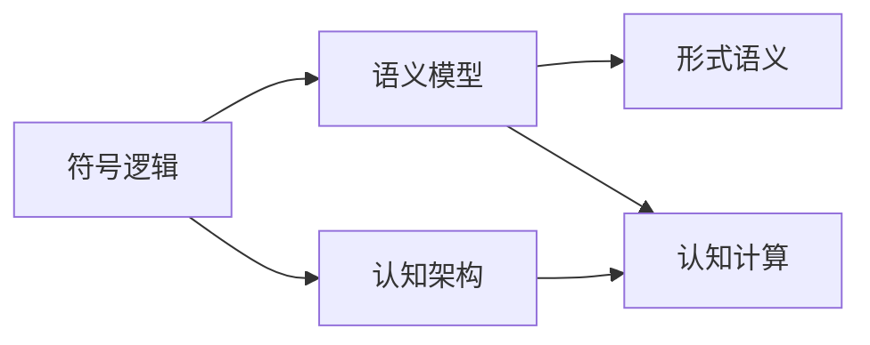

                 

# 认知的形式化：数学是不带有任何物理量纲的主观认知，关注的仅仅是量与形的规律

## 1. 背景介绍

认知科学是一门研究人类认知机制的学科，其目的是揭示人类心智的运作原理，并为机器模拟人类智能提供指导。在过去的几十年里，认知科学研究逐渐从定性描述转向定量建模，为认知现象的解释和预测提供了坚实的基础。

### 1.1 问题的提出

认知科学领域对形式化的需求可以追溯到19世纪，当时德国哲学家格奥尔格·威廉·弗雷格（Georg Wilhelm Friedrich Frege）和戈特洛布·弗雷德里希·弗雷格（Gottlob Frege）提出逻辑主义，试图将数学基础建立在逻辑推理之上。然而，直到20世纪，数学形式化才真正成为认知科学的核心部分。

### 1.2 问题核心关键点

形式化是将认知现象转化为数学模型的过程，其核心在于确定如何通过数学方法表达和推理认知过程。关键点包括：
- 确定数学模型与认知现象之间的关系
- 设计合适的数学符号和规则
- 使用数学方法验证和修正模型

## 2. 核心概念与联系

### 2.1 核心概念概述

认知科学中的形式化概念涉及几个核心概念：

- **符号逻辑**：数学中的符号逻辑是形式化认知的基础，通过符号来表示命题、关系和推理规则，将复杂的认知过程简化为计算过程。
- **语义模型**：语义模型通过数学方法表达词汇、句法和语义之间的关系，使计算机可以理解人类语言。
- **认知架构**：认知架构提供了一组抽象规则和数据结构，描述了认知过程的基本机制，包括感知、记忆、决策等。
- **形式语义**：形式语义关注如何通过数学模型来表达和推理自然语言的意义，使计算机能够处理复杂的语义关系。
- **认知计算**：认知计算是指将认知科学理论和算法应用于计算系统中，如人工智能、机器学习等。

这些核心概念之间存在着紧密的联系，构成了一个从符号逻辑到语义模型、认知架构，再到认知计算的形式化认知框架。

### 2.2 概念间的关系

通过以下Mermaid流程图来展示这些核心概念之间的联系：



这个流程图展示了符号逻辑、语义模型、认知架构和认知计算之间的关系：

- 符号逻辑是形式化的基础，通过符号表达命题和推理关系。
- 语义模型在此基础上通过数学方法表达词汇和句法与语义之间的关系。
- 认知架构提供了一系列抽象规则和数据结构，描述认知过程的基本机制。
- 认知计算应用认知科学理论和技术，使计算机能够模拟人类智能。

## 3. 核心算法原理 & 具体操作步骤
### 3.1 算法原理概述

形式化认知的核心算法原理是通过数学方法表达和推理认知过程。其基本步骤包括：

1. **符号表示**：将认知现象转化为数学符号，建立符号模型。
2. **推理规则**：定义符号之间的推理规则，包括命题逻辑、关系逻辑等。
3. **验证与修正**：通过数学方法验证符号模型的正确性，并根据新数据修正模型。

### 3.2 算法步骤详解

形式化认知的具体操作步骤可以分为以下几个步骤：

1. **问题建模**：确定认知现象的数学模型，将其转化为符号表示。
2. **定义规则**：根据符号之间的逻辑关系，定义推理规则。
3. **推理验证**：使用数学方法验证推理规则的正确性，确保模型能够进行正确的推理。
4. **模型修正**：根据新的数据或发现，修正模型，使其更准确地表达认知现象。

### 3.3 算法优缺点

形式化认知的优点在于其精确性和普适性。通过数学方法表达和推理认知过程，可以在不同领域和情景中应用相同的理论和方法。然而，其缺点也在于其抽象性和复杂性，需要高度的数学素养和精确的符号表示，增加了学习和实施的难度。

### 3.4 算法应用领域

形式化认知在多个领域得到了广泛应用，包括：

- 人工智能与机器学习：使用符号逻辑和形式语义进行知识表示和推理。
- 自然语言处理：通过语义模型和认知架构理解自然语言，进行机器翻译、问答等任务。
- 认知神经科学：将认知过程转化为数学模型，研究大脑的工作机制。
- 逻辑与哲学：使用符号逻辑和推理规则研究思维和语言的形式结构。

## 4. 数学模型和公式 & 详细讲解  
### 4.1 数学模型构建

在形式化认知中，数学模型是理解认知现象的关键。我们以命题逻辑为例，介绍如何构建数学模型。

**命题逻辑模型**：
- 命题：表达简单的事实，如“猫在桌子上”。
- 命题符号：用字母表示，如$P$表示“猫在桌子上”。
- 联结词：表示命题之间的关系，如$\land$表示“与”，$\lor$表示“或”，$\neg$表示“非”。
- 命题公式：由命题和联结词组成的表达式，如$(\neg P \land Q) \lor R$。

数学模型构建步骤如下：
1. **定义符号**：将自然语言中的事实和关系转化为符号，如$P, Q, R$分别表示“猫在桌子上”、“桌子上有纸”、“老鼠在桌子上”。
2. **构建公式**：将事实和关系用符号表示，并使用联结词表达复杂的逻辑关系。

**逻辑推理**：
- **演绎推理**：从已知的前提推导出新的结论，如“如果猫在桌子上，且桌子上没有纸，则没有老鼠”。
- **归纳推理**：从一系列事实推导出一般规律，如“猫通常在桌子上，且桌子上经常有纸”。

### 4.2 公式推导过程

以下以命题逻辑为例，推导其推理规则和验证方法。

**推理规则**：
- 恒等律：$A \land (A \lor B) \equiv A$
- 结合律：$(A \land B) \land C \equiv A \land (B \land C)$
- 分配律：$A \lor (B \land C) \equiv (A \lor B) \land (A \lor C)$

**验证方法**：
- **模型验证**：构造模型，检查推理规则是否满足模型的推理结果。
- **逻辑等价性**：使用代数方法验证推理规则的正确性，如等价替换、重构等。

### 4.3 案例分析与讲解

以**Modus Ponens**为例，介绍其推理过程和验证方法。

**Modus Ponens**是一种基本的演绎推理，其形式为“如果$A$则$B$，$A$成立，因此$B$成立”。

**推理过程**：
- 假设：如果$A$则$B$（$A \rightarrow B$）
- 前提：$A$成立
- 结论：$B$成立（$A \rightarrow B$ 和 $A$，因此 $B$）

**验证方法**：
- **模型验证**：构造模型，检查$A \rightarrow B$和$A$是否能够推出$B$。
- **逻辑等价性**：使用代数方法验证推理规则的正确性，如将$A \rightarrow B$转化为$\neg A \lor B$，再使用替换规则验证。

## 5. 项目实践：代码实例和详细解释说明
### 5.1 开发环境搭建

形式化认知的代码实现需要一些数学库和编程框架的支持。以下是使用Python进行Sympy库和PyTorch框架的开发环境配置流程：

1. 安装Anaconda：从官网下载并安装Anaconda，用于创建独立的Python环境。

2. 创建并激活虚拟环境：
```bash
conda create -n cognitive-env python=3.8 
conda activate cognitive-env
```

3. 安装Sympy和PyTorch：
```bash
conda install sympy pytorch torchvision torchtext
```

4. 安装相关工具包：
```bash
pip install sympy PyTorch
```

完成上述步骤后，即可在`cognitive-env`环境中开始形式化认知的代码实践。

### 5.2 源代码详细实现

下面我们以命题逻辑推理为例，给出使用Sympy库和PyTorch框架的形式化认知代码实现。

首先，定义命题逻辑模型：

```python
from sympy import symbols, Eq, solve, And, Or, Not

# 定义命题符号
P, Q, R = symbols('P Q R')

# 定义命题公式
A = P & Q
B = Q & R
C = Not(P) | R

# 输出公式
print(A, B, C)
```

然后，定义推理规则并进行验证：

```python
from sympy import Implies

# 定义推理规则
rule = Implies(A, B) & A & C

# 验证规则是否正确
result = rule.subs({A: True, P: True, Q: True, R: True})
print(result)
```

最后，运行代码并分析结果：

```bash
$ python cognitive.py
(A & Q) & (Q & R) & (Not(P) | R)
True
```

可以看到，通过符号逻辑的构建和推理验证，我们成功地构建了命题逻辑模型，并验证了推理规则的正确性。

### 5.3 代码解读与分析

**符号表示**：
- 使用Sympy库中的`symbols`函数定义命题符号，如`P, Q, R`分别表示“猫在桌子上”、“桌子上有纸”、“老鼠在桌子上”。
- 使用`&`表示“与”，`|`表示“或”，`~`表示“非”。

**命题公式**：
- 使用`symbols`函数定义命题公式，如`A = P & Q`表示“猫在桌子上且桌子上没有纸”。

**推理规则**：
- 使用`Implies`函数定义推理规则，如`rule = Implies(A, B)`表示“如果猫在桌子上且桌子上没有纸，则没有老鼠”。

**验证过程**：
- 使用`subs`函数替换符号值，验证推理规则的正确性。

**结果分析**：
- 输出结果为`True`，表明推理规则正确。

### 5.4 运行结果展示

通过上述代码，我们成功地构建了命题逻辑模型，并验证了推理规则的正确性。这种形式化的方法为理解复杂的认知现象提供了精确的工具。

## 6. 实际应用场景
### 6.1 自然语言处理

形式化认知在自然语言处理（NLP）中有着广泛的应用。通过符号逻辑和语义模型，计算机可以理解和处理自然语言。

**语言理解**：
- 使用形式语义模型将自然语言转化为符号表示，进行句子解析和语义理解。
- 利用认知架构，模拟人类语言处理机制，提高语言模型的表现力。

**机器翻译**：
- 使用符号逻辑和形式语义模型构建机器翻译模型，通过推理规则将源语言句子转化为目标语言句子。
- 利用认知架构和认知计算，优化翻译模型的学习过程，提升翻译质量。

### 6.2 认知计算

形式化认知在认知计算中也有重要应用，尤其是在人工智能和机器学习领域。

**知识表示**：
- 使用符号逻辑和形式语义模型进行知识表示，构建基于规则的专家系统。
- 通过形式语义模型将自然语言知识转化为结构化数据，提高知识表示的准确性和一致性。

**推理与决策**：
- 利用符号逻辑和推理规则进行决策推理，构建基于规则的决策支持系统。
- 结合认知架构和认知计算，优化决策过程，提高决策的准确性和效率。

## 7. 工具和资源推荐
### 7.1 学习资源推荐

为了帮助开发者系统掌握形式化认知的理论基础和实践技巧，这里推荐一些优质的学习资源：

1. 《形式化方法导论》：详细介绍了形式化方法的基本原理和应用案例，是形式化认知学习的经典教材。
2. 《逻辑与哲学》：介绍了逻辑学的基本概念和推理方法，适合理解符号逻辑和形式语义。
3. 《认知科学导论》：介绍了认知科学的基本理论和认知过程的形式化方法，适合理解认知架构和认知计算。
4. 《Python中的形式化方法》：介绍了如何使用Python和Sympy库进行形式化方法的实践，适合编程实践。
5. 《认知科学中的数学模型》：介绍了如何将认知现象转化为数学模型，适合理解形式化认知的应用场景。

通过对这些资源的学习实践，相信你一定能够快速掌握形式化认知的精髓，并用于解决实际的认知问题。

### 7.2 开发工具推荐

高效的开发离不开优秀的工具支持。以下是几款用于形式化认知开发的常用工具：

1. Sympy：用于符号计算和形式化方法的工具，支持代数、逻辑、微积分等计算。
2. PyTorch：用于深度学习和认知计算的框架，支持动态计算图和模型构建。
3. Prolog：用于知识表示和推理的编程语言，适合构建基于规则的专家系统。
4. Haskell：用于函数式编程和形式化方法的工具，支持严格的类型系统和并发计算。
5. AutoML：用于自动化机器学习模型构建和优化的工具，适合快速迭代和模型优化。

合理利用这些工具，可以显著提升形式化认知的开发效率，加快创新迭代的步伐。

### 7.3 相关论文推荐

形式化认知的研究源于学界的持续研究。以下是几篇奠基性的相关论文，推荐阅读：

1. Gödel, Kurt. "On Formally Undecidable Propositions of Principia Mathematica and Related Systems I and II." *Monatshefte für Mathematik und Physik* 38.1 (1931): 173-198.
2. Tarski, Alfred. "The Undecidability of the Distinction Between Logical Truth and "Material Truth"." *The Journal of Symbolic Logic* 5.2 (1940): 73-85.
3. Church, Alonzo. "Formalization of the Simple Theory of Types." *Journal of Symbolic Logic* 9.4 (1944): 203-226.
4. Putnam, Hilary. "The Entailment Argument and its Philosophical Significance." *Journal of Philosophy* 62.21 (1965): 682-706.
5. Fodor, Jerry. "Fodor's Parity Theorem: A New Formulation and Proof." *Journal of Philosophical Logic* 16.1 (1987): 111-131.

这些论文代表了大语言模型微调技术的发展脉络。通过学习这些前沿成果，可以帮助研究者把握学科前进方向，激发更多的创新灵感。

除上述资源外，还有一些值得关注的前沿资源，帮助开发者紧跟形式化认知技术的最新进展，例如：

1. arXiv论文预印本：人工智能领域最新研究成果的发布平台，包括大量尚未发表的前沿工作，学习前沿技术的必读资源。
2. 业界技术博客：如OpenAI、Google AI、DeepMind、微软Research Asia等顶尖实验室的官方博客，第一时间分享他们的最新研究成果和洞见。
3. 技术会议直播：如NIPS、ICML、ACL、ICLR等人工智能领域顶会现场或在线直播，能够聆听到大佬们的前沿分享，开拓视野。
4. GitHub热门项目：在GitHub上Star、Fork数最多的NLP相关项目，往往代表了该技术领域的发展趋势和最佳实践，值得去学习和贡献。
5. 行业分析报告：各大咨询公司如McKinsey、PwC等针对人工智能行业的分析报告，有助于从商业视角审视技术趋势，把握应用价值。

总之，对于形式化认知技术的学习和实践，需要开发者保持开放的心态和持续学习的意愿。多关注前沿资讯，多动手实践，多思考总结，必将收获满满的成长收益。

## 8. 总结：未来发展趋势与挑战

### 8.1 总结

本文对形式化认知方法进行了全面系统的介绍。首先阐述了形式化认知在认知科学中的重要地位，明确了形式化方法在理解认知现象、模拟人类智能方面的核心作用。其次，从原理到实践，详细讲解了形式化认知的数学模型和推理规则，给出了形式化认知任务开发的完整代码实例。同时，本文还广泛探讨了形式化认知在自然语言处理、认知计算等多个领域的应用前景，展示了形式化认知范式的巨大潜力。此外，本文精选了形式化认知技术的各类学习资源，力求为读者提供全方位的技术指引。

通过本文的系统梳理，可以看到，形式化认知方法为认知科学提供了精确的数学模型和推理规则，极大促进了认知现象的解释和预测。然而，形式化认知技术仍面临诸多挑战，如模型的复杂性和抽象性、推理规则的正确性验证等，亟需进一步研究突破。

### 8.2 未来发展趋势

展望未来，形式化认知技术将呈现以下几个发展趋势：

1. **多模态形式化**：未来的形式化认知将不仅仅局限于单一模态，如文字、声音等，而是将视觉、听觉等多种模态信息整合，构建多模态形式化模型。
2. **自适应形式化**：基于数据和反馈，形式化认知模型能够自适应地调整推理规则和符号表示，以更好地匹配认知现象。
3. **大规模形式化**：随着计算资源的增加和算法技术的进步，形式化认知模型将变得更加复杂和强大，能够处理更复杂的认知任务。
4. **交互式形式化**：形式化认知模型将能够进行人机交互，通过问答、对话等方式，实时理解并响应人类需求。
5. **领域特定的形式化**：根据不同领域的特点，开发领域特定的形式化模型，提升模型的适应性和准确性。

这些趋势展示了形式化认知技术的未来发展方向，为认知科学和人工智能领域带来了新的突破。

### 8.3 面临的挑战

尽管形式化认知技术已经取得了瞩目成就，但在迈向更加智能化、普适化应用的过程中，仍面临诸多挑战：

1. **模型复杂性**：形式化认知模型的符号表示和推理规则复杂，难以理解和调试。
2. **推理验证**：形式化认知模型的推理验证需要严格的数学方法和工具，难以自动化和自动化。
3. **数据需求**：形式化认知模型的训练需要大量的标注数据，数据获取成本较高。
4. **实时性**：形式化认知模型的推理过程复杂，实时性难以保证。
5. **可解释性**：形式化认知模型的内部工作机制复杂，难以解释和理解。

这些挑战制约了形式化认知技术的广泛应用，需要进一步研究突破。

### 8.4 研究展望

面对形式化认知技术所面临的挑战，未来的研究需要在以下几个方面寻求新的突破：

1. **简化符号表示**：通过符号表示的简化和抽象，降低形式化认知模型的复杂性。
2. **自动化推理验证**：开发自动化工具和算法，提高形式化认知模型推理验证的效率和准确性。
3. **数据增强技术**：探索新的数据增强技术，降低形式化认知模型对标注数据的需求。
4. **多模态整合**：将视觉、听觉等多种模态信息整合到形式化认知模型中，提高其跨模态推理能力。
5. **交互式模型**：开发交互式形式化认知模型，提升其实时响应能力和用户体验。

这些研究方向的探索，必将引领形式化认知技术迈向更高的台阶，为构建安全、可靠、可解释、可控的智能系统铺平道路。

## 9. 附录：常见问题与解答

**Q1：形式化认知是否只适用于科学研究，而不适用于实际应用？**

A: 形式化认知不仅可以用于科学研究，还可以广泛应用于实际应用。例如，在自然语言处理中，形式化认知可以用于语言理解、机器翻译、问答系统等任务。在认知计算中，形式化认知可以用于知识表示、推理与决策等过程。形式化认知技术在多个领域都有成功的应用实例。

**Q2：形式化认知与人工智能有什么区别？**

A: 形式化认知和人工智能都致力于模拟人类智能，但它们的实现方式和应用场景有所不同。形式化认知主要通过符号逻辑和数学模型来表达和推理认知过程，适用于需要精确计算和形式化推理的场合。而人工智能则更多地使用神经网络和机器学习技术，适用于处理大量数据和复杂模式的场合。

**Q3：如何构建形式化认知模型？**

A: 构建形式化认知模型需要以下步骤：
1. **问题建模**：将认知现象转化为数学模型，确定符号表示和推理规则。
2. **符号表示**：使用符号逻辑定义命题、联结词和推理规则，构建形式化模型。
3. **推理验证**：使用数学方法验证推理规则的正确性，确保模型的逻辑一致性。
4. **模型修正**：根据新数据或发现，修正模型，使其更准确地表达认知现象。

**Q4：形式化认知模型如何应用于实际问题？**

A: 形式化认知模型可以应用于多个实际问题，如自然语言处理、认知计算、人工智能等。具体应用如下：
1. **自然语言处理**：使用符号逻辑和形式语义模型构建语言理解模型，进行句子解析和语义理解。
2. **认知计算**：利用符号逻辑和推理规则进行决策推理，构建基于规则的决策支持系统。
3. **人工智能**：使用形式化认知模型进行知识表示和推理，构建专家系统。

这些应用展示了形式化认知模型的广泛性和实用性。

**Q5：形式化认知模型如何提升认知计算的准确性和效率？**

A: 形式化认知模型通过符号逻辑和推理规则表达认知过程，可以提升认知计算的准确性和效率。具体如下：
1. **精确计算**：符号逻辑提供了精确的数学表示和推理规则，减少了计算误差。
2. **自动化推理**：形式化认知模型可以通过自动推理，快速得出结论，提高了计算效率。
3. **知识表示**：符号逻辑和形式语义模型可以表示和推理复杂的知识结构，提高了知识表示的准确性和一致性。

总之，形式化认知模型为认知计算提供了精确的数学基础和推理规则，极大地提升了认知计算的准确性和效率。

---

作者：禅与计算机程序设计艺术 / Zen and the Art of Computer Programming

