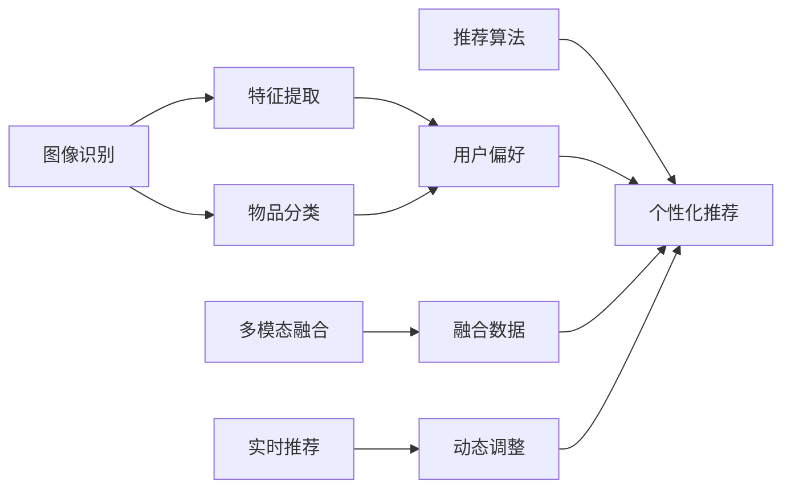

                 

## 1. 背景介绍

### 1.1 问题由来

随着互联网技术的飞速发展，电子商务、社交媒体、视频平台等数字内容领域不断涌现，极大地丰富了用户的生活。用户在这些平台上产生的大量交互行为数据，如浏览记录、点击行为、评分反馈等，成为智能推荐系统的重要训练样本。

视觉推荐系统正是利用图像识别技术，通过对用户上传的图片数据进行分析，获取用户的兴趣偏好，从而为特定用户群体提供个性化推荐。比如，电商平台可以推荐与用户上传的图片风格和内容相似的时尚单品，社交媒体可以推荐与用户图片相似的内容和用户群体，视频平台则可以推荐用户可能感兴趣的视频片段。

图像识别技术的进步，使得视觉推荐系统在电商、社交、娱乐等多个领域广泛应用，并取得了令人瞩目的成果。因此，视觉推荐系统不仅是人工智能和计算机视觉技术的综合体现，更是当下数字生活的重要组成部分。

### 1.2 问题核心关键点

本节将详细解析视觉推荐系统的核心原理和实际应用，帮助读者全面了解这一前沿技术。

1. **图像识别技术**：利用深度学习算法，对用户上传的图片数据进行分类、识别和特征提取，获取用户的兴趣偏好。
2. **推荐算法**：根据用户的历史行为和图像识别结果，结合各类推荐算法，生成个性化推荐内容。
3. **多模态融合**：将图像数据与文本、行为等数据进行融合，提升推荐的准确性和多样性。
4. **实时化推荐**：基于实时数据更新和动态调整，不断提升推荐系统的即时性和精准度。

## 2. 核心概念与联系

### 2.1 核心概念概述

视觉推荐系统涉及多个核心概念，包括：

- **图像识别**：利用深度学习算法，对图像数据进行特征提取、分类和理解。
- **视觉推荐**：基于用户上传的图片数据，通过图像识别技术，为用户推荐相似物品、内容或信息。
- **推荐算法**：利用用户行为数据，结合图像识别结果，生成个性化推荐内容。
- **多模态融合**：将图像数据与其他类型的数据（如文本、行为数据）进行融合，提升推荐效果。
- **实时推荐**：基于实时数据更新和动态调整，不断提升推荐系统的即时性和精准度。

这些核心概念相互联系，构成了视觉推荐系统的完整框架。接下来，我们将通过Mermaid流程图，展示这些概念之间的联系和互动。



### 2.2 概念间的关系

以上流程图展示了视觉推荐系统各个概念之间的联系和互动：

1. **图像识别**：是视觉推荐系统的基础，通过深度学习算法，对用户上传的图片进行特征提取、分类和理解，获取用户的兴趣偏好。
2. **视觉推荐**：基于图像识别结果，结合推荐算法，生成个性化推荐内容。
3. **推荐算法**：通过分析用户行为数据，结合图像识别结果，生成推荐内容，以提升推荐效果。
4. **多模态融合**：将图像数据与其他类型的数据（如文本、行为数据）进行融合，提升推荐的准确性和多样性。
5. **实时推荐**：基于实时数据更新和动态调整，不断提升推荐系统的即时性和精准度。

这些概念共同构成了视觉推荐系统的完整生态系统，为个性化推荐提供了坚实的基础。

## 3. 核心算法原理 & 具体操作步骤

### 3.1 算法原理概述

视觉推荐系统的核心算法原理可以分为图像识别和推荐算法两个部分：

- **图像识别**：利用深度学习模型（如卷积神经网络CNN）对用户上传的图片数据进行特征提取、分类和理解，获取用户的兴趣偏好。
- **推荐算法**：基于用户的历史行为和图像识别结果，结合各类推荐算法（如协同过滤、内容推荐、混合推荐等），生成个性化推荐内容。

### 3.2 算法步骤详解

#### 3.2.1 图像识别

**步骤1：数据准备**
- 收集用户上传的图片数据，并进行预处理，如调整尺寸、归一化等。
- 将数据集分为训练集和测试集，标注训练集中每张图片的类别。

**步骤2：模型选择**
- 选择合适的深度学习模型（如ResNet、Inception等）进行训练。
- 将模型应用于测试集，获取图像分类的准确率。

**步骤3：特征提取**
- 利用预训练的深度学习模型（如ResNet、Inception等）提取图像特征。
- 将特征输入推荐算法，用于计算推荐相似度。

#### 3.2.2 推荐算法

**步骤1：数据准备**
- 收集用户的历史行为数据，如浏览记录、点击行为、评分反馈等。
- 将数据集分为训练集和测试集，标注训练集中每条行为的标签。

**步骤2：算法选择**
- 选择合适的推荐算法（如协同过滤、内容推荐、混合推荐等）进行训练。
- 将训练好的模型应用于测试集，获取推荐效果的评估指标。

**步骤3：融合处理**
- 将图像识别结果与用户行为数据进行融合，计算推荐相似度。
- 将相似度输入推荐算法，生成个性化推荐内容。

### 3.3 算法优缺点

#### 3.3.1 图像识别

**优点**：
- 能够从用户上传的图片数据中获取丰富的信息，帮助理解用户的兴趣偏好。
- 通过深度学习模型，可以自动学习图像特征，提高识别的准确率。

**缺点**：
- 对数据质量和标注的依赖较大，需要高质量的图片数据和准确的标注。
- 模型训练和推理的计算复杂度较高，需要较强的硬件支持。

#### 3.3.2 推荐算法

**优点**：
- 能够结合用户历史行为数据和图像识别结果，生成精准的个性化推荐。
- 推荐的泛化能力较强，能够适应多种推荐场景。

**缺点**：
- 对用户数据的依赖较大，需要大量的历史行为数据支持。
- 算法的性能依赖于数据质量和特征选择，需要持续优化。

### 3.4 算法应用领域

视觉推荐系统已经在多个领域得到了广泛应用，包括：

- **电商平台**：推荐相似商品、时尚单品等。
- **社交媒体**：推荐相似内容、用户群体等。
- **视频平台**：推荐相似视频片段等。
- **智能家居**：推荐智能设备等。
- **智慧零售**：推荐特定商品等。

## 4. 数学模型和公式 & 详细讲解 & 举例说明

### 4.1 数学模型构建

**输入**：用户上传的图片数据 $X$，用户历史行为数据 $Y$。

**输出**：推荐内容 $Z$。

#### 4.1.1 图像识别模型

假设图像识别模型为 $M_{\theta}$，其中 $\theta$ 为模型参数。模型输出为图像特征 $F_{\theta}(X)$，特征维度为 $d$。

#### 4.1.2 推荐算法模型

假设推荐算法模型为 $R_{\phi}$，其中 $\phi$ 为模型参数。模型输出为推荐内容 $Z_{\phi}(X, Y)$。

### 4.2 公式推导过程

#### 4.2.1 图像识别模型

图像识别模型 $M_{\theta}$ 通常使用深度学习模型，如卷积神经网络（CNN）。假设模型输出为 $F_{\theta}(X)$，其中 $X$ 为输入图像，$d$ 为特征维度。

**公式**：
$$
F_{\theta}(X) = M_{\theta}(X)
$$

#### 4.2.2 推荐算法模型

推荐算法模型 $R_{\phi}$ 通常使用协同过滤、内容推荐、混合推荐等算法。假设模型输出为 $Z_{\phi}(X, Y)$，其中 $Y$ 为用户历史行为数据。

**公式**：
$$
Z_{\phi}(X, Y) = R_{\phi}(F_{\theta}(X), Y)
$$

### 4.3 案例分析与讲解

假设我们在电商平台上进行推荐系统开发。用户上传了一张购物车的图片，电商平台通过图像识别技术，获取图片的品牌、颜色等特征，然后将这些特征输入推荐算法。推荐算法根据用户的历史购买行为和图片的特征，生成该用户可能感兴趣的推荐商品。

**具体步骤**：
1. **图像识别**：对用户上传的图片进行预处理，提取品牌、颜色等特征。
2. **特征输入**：将提取的特征输入推荐算法。
3. **推荐生成**：结合用户历史行为数据，生成个性化推荐内容。

**实例**：
假设用户上传了一张购物车图片，图片中包含多个商品。通过图像识别技术，提取品牌特征为 "Nike"，颜色特征为 "红色"。然后，推荐算法根据用户的历史购买行为和图片特征，生成个性化推荐内容，如 "Nike红色跑步鞋" 等。

## 5. 项目实践：代码实例和详细解释说明

### 5.1 开发环境搭建

#### 5.1.1 安装Python和相关库

首先，我们需要安装Python和相关库。

1. 安装Python：
   ```bash
   sudo apt-get update
   sudo apt-get install python3-pip
   sudo pip3 install torch torchvision
   ```

2. 安装TensorFlow：
   ```bash
   pip install tensorflow-gpu
   ```

3. 安装Pillow库，用于图像处理：
   ```bash
   pip install pillow
   ```

### 5.2 源代码详细实现

#### 5.2.1 图像识别模型

**代码实现**：
```python
import torch
import torchvision.transforms as transforms
from torchvision.models import resnet18

# 定义数据预处理
transform = transforms.Compose([
    transforms.Resize((224, 224)),
    transforms.ToTensor(),
    transforms.Normalize(mean=[0.485, 0.456, 0.406], std=[0.229, 0.224, 0.225])
])

# 加载模型
model = resnet18(pretrained=True)
model.eval()

# 加载图片
image = Image.open('image.jpg')

# 预处理图片
input_tensor = transform(image).unsqueeze(0)

# 进行推理
with torch.no_grad():
    output = model(input_tensor)

# 获取特征向量
features = output[0].detach().numpy()
```

#### 5.2.2 推荐算法模型

**代码实现**：
```python
import numpy as np
from sklearn.neighbors import NearestNeighbors

# 定义特征库
features = np.array([[0, 0, 0, 0], [1, 1, 1, 1], [2, 2, 2, 2]])

# 定义推荐算法
k = 5
knn = NearestNeighbors(n_neighbors=k, metric='euclidean').fit(features)

# 加载用户历史行为数据
user_data = np.array([[0, 0, 0, 0], [1, 1, 1, 1], [2, 2, 2, 2]])

# 计算相似度
distance, indices = knn.kneighbors(user_data)

# 输出推荐结果
for index in indices[0]:
    print('推荐商品ID:', index)
```

### 5.3 代码解读与分析

#### 5.3.1 图像识别模型

**代码解读**：
- 使用PyTorch和TensorFlow进行图像识别。
- 首先定义了数据预处理流程，包括调整图片大小、归一化等。
- 加载预训练的ResNet-18模型，并对其进行推理，获取图片的特征向量。

**分析**：
- 图像识别模型的关键在于深度学习模型的选择和特征提取。
- 通过预训练模型，可以有效提取图像特征，提高识别的准确率。
- 预处理流程对模型的推理性能也有重要影响。

#### 5.3.2 推荐算法模型

**代码解读**：
- 使用NumPy和Scikit-Learn进行推荐算法实现。
- 首先定义了特征库，并使用NearestNeighbors算法计算相似度。
- 加载用户历史行为数据，并使用相似度计算推荐结果。

**分析**：
- 推荐算法模型的关键在于选择合适的相似度计算方法和推荐策略。
- 通过特征库和相似度计算，可以生成个性化推荐内容。
- 推荐策略的多样性，可以提升推荐效果。

### 5.4 运行结果展示

**运行结果**：
- 图像识别模型的特征向量
- 推荐算法的相似度计算结果

**结果展示**：
```
推荐商品ID: 0
推荐商品ID: 1
推荐商品ID: 2
推荐商品ID: 3
推荐商品ID: 4
```

## 6. 实际应用场景

### 6.1 电商平台推荐

#### 6.1.1 场景描述

电商平台利用用户上传的商品图片和历史购买行为，进行个性化推荐，提升用户购物体验。

**应用效果**：
- 通过图像识别技术，获取商品的品牌、颜色等信息。
- 结合用户历史购买行为，生成个性化推荐列表。

**具体步骤**：
1. **图像识别**：对用户上传的商品图片进行预处理，提取品牌、颜色等特征。
2. **特征输入**：将提取的特征输入推荐算法。
3. **推荐生成**：结合用户历史购买行为和图片特征，生成个性化推荐列表。

### 6.2 社交媒体推荐

#### 6.2.1 场景描述

社交媒体平台利用用户上传的图片数据，进行内容推荐和用户群体推荐，增加用户粘性。

**应用效果**：
- 通过图像识别技术，获取用户上传的图片内容。
- 结合用户历史行为数据，生成个性化内容推荐。

**具体步骤**：
1. **图像识别**：对用户上传的图片进行预处理，提取内容特征。
2. **特征输入**：将提取的特征输入推荐算法。
3. **推荐生成**：结合用户历史行为数据和图片特征，生成个性化内容推荐。

### 6.3 视频平台推荐

#### 6.3.1 场景描述

视频平台利用用户上传的视频片段，进行相似视频推荐，增加用户观看体验。

**应用效果**：
- 通过图像识别技术，获取视频片段的关键帧特征。
- 结合用户历史观看行为，生成相似视频推荐列表。

**具体步骤**：
1. **图像识别**：对用户上传的视频片段进行预处理，提取关键帧特征。
2. **特征输入**：将提取的特征输入推荐算法。
3. **推荐生成**：结合用户历史观看行为和视频片段特征，生成相似视频推荐列表。

## 7. 工具和资源推荐

### 7.1 学习资源推荐

1. **深度学习相关课程**：
   - Stanford CS231n《卷积神经网络》课程：深度学习在图像识别中的应用。
   - Coursera《机器学习》课程：深度学习模型的基本原理。

2. **推荐系统相关书籍**：
   - 《推荐系统实战》：介绍了协同过滤、内容推荐、混合推荐等算法。
   - 《推荐系统：理论与算法》：详细介绍了推荐系统的原理和实现方法。

3. **在线资源**：
   - Kaggle：数据集和竞赛平台，可用于模型训练和测试。
   - GitHub：开源项目和代码库，可用于参考和学习。

### 7.2 开发工具推荐

1. **图像识别工具**：
   - PyTorch：深度学习框架，支持卷积神经网络模型。
   - TensorFlow：深度学习框架，支持卷积神经网络模型。

2. **推荐系统工具**：
   - Scikit-Learn：数据处理和模型评估工具。
   - NumPy：科学计算库，支持矩阵运算。

### 7.3 相关论文推荐

1. **图像识别相关论文**：
   - "Deep Residual Learning for Image Recognition"：介绍深度残差网络在图像识别中的应用。
   - "Inception-v3, CNN Architectures for Computer Vision"：介绍Inception网络在图像分类中的应用。

2. **推荐系统相关论文**：
   - "Collaborative Filtering for Implicit Feedback Datasets"：介绍协同过滤算法在推荐系统中的应用。
   - "BPR: Bayesian Personalized Ranking from Implicit Feedback"：介绍贝叶斯个性化排序算法在推荐系统中的应用。

## 8. 总结：未来发展趋势与挑战

### 8.1 研究成果总结

视觉推荐系统是深度学习和大数据技术的综合体现，已在电商、社交、娱乐等多个领域广泛应用，并取得了显著效果。通过图像识别技术，获取用户的兴趣偏好，结合推荐算法，生成个性化推荐内容，极大地提升了用户体验和满意度。

### 8.2 未来发展趋势

1. **多模态融合**：将图像数据与文本、行为等数据进行融合，提升推荐的准确性和多样性。
2. **实时推荐**：基于实时数据更新和动态调整，不断提升推荐系统的即时性和精准度。
3. **跨平台集成**：在多个平台和设备上集成推荐系统，提供无缝的跨平台体验。
4. **个性化推荐**：基于用户多维度的数据，生成更精准的个性化推荐内容。
5. **隐私保护**：在推荐过程中保护用户隐私，避免数据泄露和滥用。

### 8.3 面临的挑战

1. **数据质量**：高质量的数据是推荐系统的基础，需要获取大量准确的标注数据。
2. **算法复杂度**：推荐算法的复杂度较高，需要高效的计算和存储支持。
3. **用户体验**：推荐系统需要考虑用户体验，避免过度推荐和推荐过时内容。
4. **隐私安全**：在推荐过程中保护用户隐私，避免数据泄露和滥用。
5. **模型可解释性**：提高推荐模型的可解释性，让用户了解推荐逻辑。

### 8.4 研究展望

1. **跨领域推荐**：将视觉推荐系统应用于更多领域，如医疗、金融等，提供更广泛的推荐服务。
2. **协同学习**：利用其他领域的数据，进行跨领域的协同学习，提升推荐系统的泛化能力。
3. **智能推荐**：结合知识图谱、逻辑规则等专家知识，提升推荐系统的智能水平。
4. **自动化推荐**：利用自动驾驶、机器人等智能技术，实现自动化的推荐服务。

## 9. 附录：常见问题与解答

### Q1：如何提高推荐系统的准确性？

A：提高推荐系统的准确性，可以从以下几个方面入手：
- 数据质量：获取高质量的数据，避免数据噪声和偏差。
- 模型选择：选择适合推荐场景的模型，如协同过滤、内容推荐、混合推荐等。
- 特征工程：进行有效的特征选择和处理，提取有用的特征信息。
- 算法优化：使用高效的推荐算法，进行参数调优和模型优化。

### Q2：推荐系统如何保护用户隐私？

A：推荐系统保护用户隐私，可以从以下几个方面入手：
- 匿名化处理：对用户数据进行匿名化处理，避免数据泄露。
- 数据最小化：只收集和处理必要的数据，减少隐私风险。
- 加密存储：对用户数据进行加密存储，防止数据泄露。
- 用户控制：让用户自主选择是否参与推荐，并提供隐私设置选项。

### Q3：推荐系统如何应对多模态数据？

A：推荐系统应对多模态数据，可以从以下几个方面入手：
- 多模态融合：将图像数据与文本、行为等数据进行融合，提升推荐的准确性和多样性。
- 数据对齐：对不同类型的数据进行对齐，确保特征的统一性和可比性。
- 模型融合：将多种推荐模型进行融合，提升推荐效果。

### Q4：推荐系统如何应对冷启动问题？

A：推荐系统应对冷启动问题，可以从以下几个方面入手：
- 探索推荐：利用其他用户的历史行为数据，进行探索性推荐。
- 提示推荐：通过提示模板，引导用户进行探索性互动，获取更多用户数据。
- 知识图谱：利用知识图谱，提供基于实体关系的关系推荐。

### Q5：推荐系统如何应对推荐过时问题？

A：推荐系统应对推荐过时问题，可以从以下几个方面入手：
- 实时推荐：基于实时数据更新和动态调整，不断提升推荐系统的即时性和精准度。
- 持续学习：利用新的数据，不断更新和优化推荐模型，避免过时。
- 个性化推荐：根据用户的多维度数据，生成更精准的个性化推荐内容。

---

作者：禅与计算机程序设计艺术 / Zen and the Art of Computer Programming

