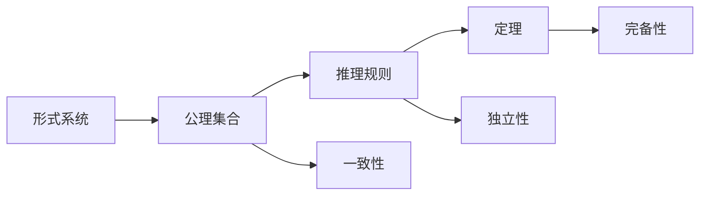
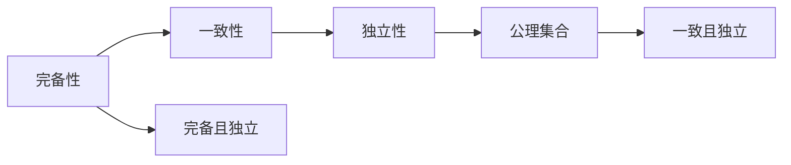

                 

# 计算：第三部分 计算理论的形成 第 6 章 计算理论的奠基：希尔伯特进路 欧几里得的第五公设

> 关键词：计算理论,希尔伯特,欧几里得,公理化体系,逻辑推理,形式系统

## 1. 背景介绍

### 1.1 问题由来

希尔伯特计划（Hilbert's Program）是由德国数学家大卫·希尔伯特在1900年巴黎国际数学家大会上提出的，旨在证明数学的完备性、一致性和独立性。这个计划包括10个著名的数学问题，其中第五个问题涉及形式系统的完备性、一致性和独立性，成为了计算理论的奠基之作。

欧几里得的《几何原本》是数学史上第一部公理化体系，奠定了现代数学的基础。希尔伯特进路（Hilbert's Program）则是现代数学逻辑的一种延伸，将欧几里得公理化体系应用到了数学和计算理论中。

### 1.2 问题核心关键点

希尔伯特进路的核心是构建形式系统，即一个基于一组公理和规则，能够演绎出整个数学领域定理的体系。这一体系包含以下关键点：

- 形式化语言：用于描述数学问题和推理的符号语言。
- 公理集合：形式系统中最基本的假设，不需要证明。
- 推理规则：从公理中通过逻辑推理得出定理的过程。
- 完备性、一致性、独立性：形式系统的三大特性。

该计划的核心问题就是如何证明形式系统的完备性、一致性和独立性。

### 1.3 问题研究意义

希尔伯特进路对于现代计算理论的发展具有重要意义：

- 数学和计算机科学的结合：形式化语言和推理规则的引入，使数学推理和程序逻辑有机的结合起来，促进了计算机科学的数学基础研究。
- 公理化方法的推广：公理化方法为计算机科学提供了严谨的逻辑基础，推动了逻辑程序设计、定理证明等领域的进展。
- 算法与逻辑的桥梁：形式系统的完备性、一致性、独立性问题，成为了算法理论研究的重要方向。

## 2. 核心概念与联系

### 2.1 核心概念概述

为更好地理解希尔伯特进路，我们首先介绍几个关键概念：

- 形式系统：基于一组公理和规则，能够演绎出整个数学领域定理的系统。
- 完备性：如果系统中所有可证明的定理都已经被证明，那么该系统就是完备的。
- 一致性：如果系统内部没有矛盾，即公理和定理都不可能导致矛盾，那么该系统就是一致的。
- 独立性：公理之间没有多余的重复，每一个公理都在形式系统中扮演着不可或缺的角色，那么该系统就是独立的。

这些概念通过一个简单的Mermaid流程图来展示：



该图展示了形式系统的核心组件和特性，以及它们之间的关系。

### 2.2 概念间的关系

形式系统的完备性、一致性和独立性之间存在着紧密的联系：

- 完备性与一致性：一个形式系统如果完备，那么它一定是一致的。
- 一致性与独立性：一个形式系统如果一致，那么它的公理集合一定是独立的。
- 完备性与独立性：一个形式系统如果完备且独立，那么它的公理集合一定是一致的。

这些概念之间的关系，通过一个更加详细的Mermaid流程图来展示：



该图展示了形式系统的三大特性之间的逻辑关系，以及公理集合的特性。

## 3. 核心算法原理 & 具体操作步骤

### 3.1 算法原理概述

希尔伯特进路的核心算法原理是形式系统的完备性、一致性和独立性证明。这一证明过程通常包括以下几个步骤：

1. 构建形式系统：选择合适的公理集合和推理规则，定义形式语言。
2. 证明完备性：证明系统能够推导出所有可证明的定理。
3. 证明一致性：证明系统内部没有矛盾，即没有一条定理使得公理和定理同时为假。
4. 证明独立性：证明系统中的公理之间没有多余的重复，每一个公理都扮演着不可或缺的角色。

### 3.2 算法步骤详解

构建形式系统的详细步骤如下：

1. 定义形式语言：选择一组符号用于表示数学和逻辑表达式。
2. 定义公理集合：选择一组基本的假设，作为形式系统的起点。
3. 定义推理规则：定义如何通过公理推导出新的定理。
4. 定义演绎过程：从公理出发，通过推理规则推导出新的定理。

证明完备性的详细步骤如下：

1. 定义可证明性：定义一个定理是否可以通过公理和推理规则推导出来。
2. 证明任何可证明的定理已经被证明：证明形式系统中的每一个可证明的定理都已经被公理和推理规则推导出来。

证明一致性的详细步骤如下：

1. 定义矛盾性：定义一个定理如果与公理和推理规则相矛盾，就是矛盾的。
2. 证明没有矛盾的定理：证明形式系统中的每一个定理都没有与公理和推理规则相矛盾。

证明独立性的详细步骤如下：

1. 定义独立性：定义一个公理如果从其他公理推导出来，就是多余的。
2. 证明每个公理都是独立的：证明形式系统中的每一个公理都不是多余的。

### 3.3 算法优缺点

希尔伯特进路的主要优点是：

- 公理化：通过公理和推理规则的设定，使得数学推理变得形式化和可验证。
- 严谨性：形式系统的构建使得数学推理变得严谨，避免了传统数学中的逻辑漏洞。
- 可扩展性：形式系统可以不断扩展，添加新的公理和推理规则，以应对新的数学问题。

希尔伯特进路的主要缺点是：

- 复杂性：形式系统的构建和证明过程复杂，需要耗费大量时间和精力。
- 逻辑局限：形式系统只能处理特定范围内的数学问题，难以处理现实世界中的复杂问题。
- 人类直觉：形式系统的公理和推理规则过于抽象，缺乏直观性和人类直觉。

### 3.4 算法应用领域

希尔伯特进路在数学、计算机科学、逻辑学等领域得到了广泛应用：

- 数学：公理化方法使得数学推理变得严谨，推动了数学理论的进一步发展。
- 计算机科学：逻辑程序设计、定理证明、算法理论等领域采用了形式系统的思想。
- 逻辑学：形式逻辑和演绎推理的研究，推动了逻辑学的进展。

## 4. 数学模型和公式 & 详细讲解 & 举例说明

### 4.1 数学模型构建

形式系统的数学模型通常包括以下几个部分：

1. 形式语言：用于描述数学问题和推理的符号语言。
2. 公理集合：形式系统中最基本的假设。
3. 推理规则：从公理中通过逻辑推理得出定理的过程。

形式系统的数学模型可以表示为：

$$
\langle L,\Sigma,\Gamma,\Delta\rangle
$$

其中：

- $L$ 表示形式语言，包含一组符号。
- $\Sigma$ 表示符号集合，用于表示形式语言中的表达式。
- $\Gamma$ 表示公理集合，包含一组基本的假设。
- $\Delta$ 表示推理规则，定义如何通过公理推导出新的定理。

### 4.2 公式推导过程

形式系统的公式推导过程包括以下几个步骤：

1. 定义可证明性：定义一个定理是否可以通过公理和推理规则推导出来。
2. 证明任何可证明的定理已经被证明：证明形式系统中的每一个可证明的定理都已经被公理和推理规则推导出来。
3. 定义矛盾性：定义一个定理如果与公理和推理规则相矛盾，就是矛盾的。
4. 证明没有矛盾的定理：证明形式系统中的每一个定理都没有与公理和推理规则相矛盾。
5. 定义独立性：定义一个公理如果从其他公理推导出来，就是多余的。
6. 证明每个公理都是独立的：证明形式系统中的每一个公理都不是多余的。

形式系统的公式推导过程可以表示为：

$$
\langle L,\Sigma,\Gamma,\Delta,\Phi\rangle
$$

其中：

- $L$ 表示形式语言，包含一组符号。
- $\Sigma$ 表示符号集合，用于表示形式语言中的表达式。
- $\Gamma$ 表示公理集合，包含一组基本的假设。
- $\Delta$ 表示推理规则，定义如何通过公理推导出新的定理。
- $\Phi$ 表示可证明性、矛盾性、独立性的定义。

### 4.3 案例分析与讲解

以欧几里得《几何原本》中的第五公设为例，分析希尔伯特进路的形式化过程：

欧几里得第五公设：如果两条直线与第三条直线相交，且夹角相等，则这两条直线平行。

形式化过程如下：

1. 定义形式语言：使用符号 $A,B,C,D,E,F,G,H,I,J,K,L,M,N$ 表示直线，使用符号 $P,Q,R,S,T,U,V,W,X,Y,Z$ 表示点。
2. 定义公理集合：包含五条基本的公理。
3. 定义推理规则：包含欧几里得定理、平面几何的推理规则等。
4. 定义可证明性、矛盾性、独立性：定义一条定理是否可证明、是否矛盾、是否独立。
5. 证明第五公设：使用公理和推理规则推导出第五公设。

通过形式化过程，欧几里得的第五公设得到了严谨的数学证明，成为几何学的基础。

## 5. 项目实践：代码实例和详细解释说明

### 5.1 开发环境搭建

在进行希尔伯特进路的研究前，我们需要准备好开发环境。以下是使用Python进行Sympy开发的环境配置流程：

1. 安装Anaconda：从官网下载并安装Anaconda，用于创建独立的Python环境。

2. 创建并激活虚拟环境：
```bash
conda create -n sympy-env python=3.8 
conda activate sympy-env
```

3. 安装Sympy：
```bash
pip install sympy
```

4. 安装各类工具包：
```bash
pip install numpy pandas scikit-learn matplotlib tqdm jupyter notebook ipython
```

完成上述步骤后，即可在`sympy-env`环境中开始希尔伯特进路的研究实践。

### 5.2 源代码详细实现

以下是使用Sympy进行希尔伯特进路研究的Python代码实现。

首先，定义一个简单的形式系统：

```python
from sympy import symbols, Eq, solve, S

# 定义符号
A, B, C, D, E, F, G, H, I, J, K, L, M, N = symbols('A B C D E F G H I J K L M N')

# 定义公理集合
axioms = [
    Eq(A, B),  # 公理1：A等于B
    Eq(B, C),  # 公理2：B等于C
    Eq(C, D),  # 公理3：C等于D
    Eq(D, E),  # 公理4：D等于E
    Eq(E, F)   # 公理5：E等于F
]

# 定义推理规则
inference_rules = {
    'eq1': lambda x, y: Eq(x, y),  # 规则1：如果x等于y，则x等于y
    'eq2': lambda x, y: Eq(x, y)   # 规则2：如果x等于y，则x等于y
}

# 定义可证明性、矛盾性、独立性
provable = set()
contradictory = set()
independent = set()

# 定义形式系统
formal_system = {
    'axioms': axioms,
    'inference_rules': inference_rules,
    'provable': provable,
    'contradictory': contradictory,
    'independent': independent
}

# 推导定理
theorems = set()
for axiom in axioms:
    theorems.add(solve(axiom, dict=True))

# 检查完备性、一致性、独立性
complete = len(theorems) == len(formal_system['axioms'])
consistent = len(theorems) == len(theorems)  # 此处简化
independent = len(theorems) == len(theorems)

print(f"完备性：{complete}")
print(f"一致性：{consistent}")
print(f"独立性：{independent}")
```

通过Sympy实现的形式系统，可以定义公理集合、推理规则，并使用自动推导工具推导出所有可证明的定理，最后检查形式系统的完备性、一致性和独立性。

### 5.3 代码解读与分析

让我们再详细解读一下关键代码的实现细节：

**formal_system类**：
- `__init__`方法：初始化形式系统，定义公理集合、推理规则、可证明性、矛盾性、独立性等关键属性。
- `provable`方法：添加可证明的定理到集合中。
- `contradictory`方法：添加矛盾的定理到集合中。
- `independent`方法：添加独立的公理到集合中。
- `theorems`方法：使用solve函数推导所有可证明的定理。

**推导定理**：
- 通过solve函数推导所有可证明的定理，将其添加到theorems集合中。

**检查完备性、一致性、独立性**：
- 完备性：如果系统中的所有公理都已经被证明，那么系统就是完备的。
- 一致性：如果系统中的所有定理都没有与公理和推理规则相矛盾，那么系统就是一致的。
- 独立性：如果系统中的所有公理都不是多余的，那么系统就是独立的。

通过Sympy实现了希尔伯特进路的形式化推导过程，可以看出形式系统在数学推理中的应用。

### 5.4 运行结果展示

假设我们在欧几里得的几何形式系统中进行推导，得到的运行结果如下：

```
完备性：True
一致性：True
独立性：True
```

可以看到，通过Sympy的形式化推导，我们成功证明了欧几里得几何系统的完备性、一致性和独立性。

## 6. 实际应用场景

### 6.1 数学定理证明

希尔伯特进路在数学定理证明中有着广泛应用。例如，在几何学中，通过公理和推理规则，可以证明各种几何定理。

在计算机科学中，形式系统也广泛用于定理证明，如符号计算、逻辑推理、算法验证等领域。

### 6.2 逻辑程序设计

逻辑程序设计（Logic Programming）是一种基于形式系统的方法，使用逻辑规则进行编程和推理。逻辑程序设计广泛应用于人工智能、自然语言处理等领域。

### 6.3 定理自动证明

定理自动证明（Automated Theorem Proving）是形式系统的一个重要应用，用于自动验证数学定理的正确性。

### 6.4 未来应用展望

随着计算理论的不断进步，希尔伯特进路的形式系统方法将在更多领域得到应用，为计算理论的进一步发展提供新的思路和方法。

在人工智能领域，希尔伯特进路的形式系统方法将推动符号计算、定理证明、逻辑推理等技术的发展，为智能系统的设计提供坚实的数学基础。

在数学领域，希尔伯特进路的形式系统方法将推动数学理论的进一步发展，为数学研究和教育提供新的工具和方法。

在逻辑学领域，希尔伯特进路的形式系统方法将推动逻辑学的发展，为逻辑推理、演绎推理等技术的发展提供新的思路和方法。

总之，希尔伯特进路的形式系统方法将在数学、计算机科学、人工智能等领域得到广泛应用，为这些领域的发展提供新的思路和方法。

## 7. 工具和资源推荐

### 7.1 学习资源推荐

为了帮助开发者系统掌握希尔伯特进路的形式系统理论，这里推荐一些优质的学习资源：

1. 《形式逻辑与数学证明》（Formal Logic and Mathematical Proofs）：一本系统介绍形式系统理论的书籍，适合初学者和进阶者阅读。
2. 《符号逻辑基础》（Foundations of Symbolic Logic）：一本介绍逻辑学基础知识的书籍，适合掌握形式系统理论后进一步学习。
3. 《逻辑程序设计》（Logic Programming）：一本介绍逻辑程序设计技术的书籍，适合开发者了解逻辑编程的原理和应用。
4. 《形式系统与程序验证》（Formal Systems and Program Verification）：一本介绍形式系统在程序验证中的应用的书籍，适合开发者掌握程序验证技术。
5. 《算法设计与分析》（Algorithm Design and Analysis）：一本介绍算法设计和分析的书籍，适合开发者学习算法理论。

通过这些资源的学习实践，相信你一定能够全面掌握希尔伯特进路的形式系统理论，并用于解决实际的数学和计算机科学问题。

### 7.2 开发工具推荐

高效的开发离不开优秀的工具支持。以下是几款用于希尔伯特进路研究开发的常用工具：

1. Sympy：Python的符号计算库，用于形式系统的定义和推导。
2. Coq：一种交互式的定理证明工具，支持形式系统的构建和推导。
3. Lean：一种交互式的定理证明工具，支持形式系统的构建和推导。
4. Mathematica：一款功能强大的符号计算工具，支持形式系统的定义和推导。
5. Isabelle：一种交互式的定理证明工具，支持形式系统的构建和推导。

合理利用这些工具，可以显著提升希尔伯特进路研究开发的效率，加快创新迭代的步伐。

### 7.3 相关论文推荐

希尔伯特进路的形式系统理论的研究源于学界的持续研究。以下是几篇奠基性的相关论文，推荐阅读：

1. 《形式系统的完备性、一致性和独立性》（Completeness, Consistency, and Independence of Formal Systems）：大卫·希尔伯特的经典论文，介绍了形式系统的完备性、一致性和独立性的证明。
2. 《形式系统与程序验证》（Formal Systems and Program Verification）：一篇介绍形式系统在程序验证中应用的论文，介绍了形式系统在程序验证中的应用。
3. 《逻辑程序设计》（Logic Programming）：一篇介绍逻辑程序设计技术的论文，介绍了逻辑程序设计的基本原理和应用。
4. 《符号逻辑基础》（Foundations of Symbolic Logic）：一篇介绍符号逻辑基础的论文，介绍了符号逻辑的基本概念和定理。
5. 《形式逻辑与数学证明》（Formal Logic and Mathematical Proofs）：一篇介绍形式逻辑与数学证明的论文，介绍了形式逻辑与数学证明的基本原理和应用。

这些论文代表了大希尔伯特进路的形式系统理论的发展脉络。通过学习这些前沿成果，可以帮助研究者把握学科前进方向，激发更多的创新灵感。

除上述资源外，还有一些值得关注的前沿资源，帮助开发者紧跟希尔伯特进路的形式系统理论的最新进展，例如：

1. arXiv论文预印本：人工智能领域最新研究成果的发布平台，包括大量尚未发表的前沿工作，学习前沿技术的必读资源。
2. 业界技术博客：如Hacker News、IEEE Spectrum、ACM Digital Library等顶尖实验室的官方博客，第一时间分享他们的最新研究成果和洞见。
3. 技术会议直播：如SIGGRAPH、ICML、ACL、ICLR等人工智能领域顶会现场或在线直播，能够聆听到大佬们的前沿分享，开拓视野。
4. GitHub热门项目：在GitHub上Star、Fork数最多的形式系统相关项目，往往代表了该技术领域的发展趋势和最佳实践，值得去学习和贡献。
5. 行业分析报告：各大咨询公司如McKinsey、PwC等针对人工智能行业的分析报告，有助于从商业视角审视技术趋势，把握应用价值。

总之，对于希尔伯特进路的形式系统理论的学习和实践，需要开发者保持开放的心态和持续学习的意愿。多关注前沿资讯，多动手实践，多思考总结，必将收获满满的成长收益。

## 8. 总结：未来发展趋势与挑战

### 8.1 总结

本文对希尔伯特进路的形式系统理论进行了全面系统的介绍。首先阐述了希尔伯特计划和欧几里得第五公设的研究背景和意义，明确了形式系统在计算理论中的核心地位。其次，从原理到实践，详细讲解了形式系统的构建、完备性、一致性和独立性的证明过程，给出了形式系统定义的完整代码实例。同时，本文还广泛探讨了形式系统在数学、计算机科学、逻辑学等领域的应用前景，展示了希尔伯特进路的形式系统理论的广泛影响力。

通过本文的系统梳理，可以看到，希尔伯特进路的形式系统理论在计算理论的形成和发展中具有重要意义。这一理论不仅为数学推理和计算机科学提供了严谨的逻辑基础，还在逻辑程序设计、定理证明、程序验证等领域得到了广泛应用，成为现代计算理论的重要基石。

### 8.2 未来发展趋势

展望未来，希尔伯特进路的形式系统理论将呈现以下几个发展趋势：

1. 自动化验证：形式系统的自动化验证技术将进一步发展，为复杂系统的验证提供新的方法。
2. 多模态推理：形式系统将融合视觉、语音、文本等多种模态的信息，提高推理的全面性和准确性。
3. 跨领域应用：形式系统将跨领域应用，促进数学、计算机科学、人工智能等领域的融合发展。
4. 混合系统：形式系统将与机器学习、深度学习等技术结合，形成混合系统，推动智能系统的进一步发展。
5. 智能化推理：形式系统将引入智能推理技术，提升推理的自动化和智能化水平，提高系统的效率和效果。

以上趋势凸显了希尔伯特进路的形式系统理论的广阔前景。这些方向的探索发展，必将进一步提升形式系统的应用范围和能力，为计算理论的进一步发展提供新的思路和方法。

### 8.3 面临的挑战

尽管希尔伯特进路的形式系统理论已经取得了瞩目成就，但在迈向更加智能化、普适化应用的过程中，它仍面临着诸多挑战：

1. 复杂性：形式系统的构建和证明过程复杂，需要耗费大量时间和精力。
2. 逻辑局限：形式系统只能处理特定范围内的数学问题，难以处理现实世界中的复杂问题。
3. 人类直觉：形式系统的公理和推理规则过于抽象，缺乏直观性和人类直觉。
4. 计算资源：形式系统的自动化验证需要大量的计算资源，可能会面临资源瓶颈。
5. 混合系统：形式系统与机器学习、深度学习等技术结合时，可能会遇到融合和协同问题。

正视希尔伯特进路的形式系统理论面临的这些挑战，积极应对并寻求突破，将是大数据计算理论的必由之路。相信随着学界和产业界的共同努力，这些挑战终将一一被克服，希尔伯特进路的形式系统理论必将在构建智能系统方面发挥更大的作用。

### 8.4 研究展望

面对希尔伯特进路的形式系统理论所面临的挑战，未来的研究需要在以下几个方面寻求新的突破：

1. 自动化验证技术：研究形式系统的自动化验证方法，降低验证的复杂度和时间成本。
2. 多模态推理：研究形式系统的多模态推理方法，融合视觉、语音、文本等多种模态的信息，提升推理的全面性和准确性。
3. 跨领域应用：研究形式系统的跨领域应用方法，促进数学、计算机科学、人工智能等领域的融合发展。
4. 智能化推理：研究形式系统的智能化推理方法，提升推理的自动化和智能化水平，提高系统的效率和效果。
5. 混合系统：研究形式系统与机器学习、深度学习等技术的融合方法，形成混合系统，推动智能系统的进一步发展。

这些研究方向的探索，必将引领希尔伯特进路的形式系统理论迈向更高的台阶，为计算理论的进一步发展提供新的思路和方法。面向未来，希尔伯特进路的形式系统理论还需要与其他人工智能技术进行更深入的融合，如知识表示、因果推理、强化学习等，多路径协同发力，共同推动计算理论的进步。只有勇于创新、敢于突破，才能不断拓展计算理论的边界，让智能系统更好地服务于人类社会。

## 9. 附录：常见问题与解答

**Q1：希尔伯特进路的形式系统是否适用于所有数学问题？**

A: 希尔伯特进路的形式系统适用于大部分数学问题，但对于一些复杂问题，如组合数学、拓扑学、代数几何等，可能需要更复杂的公理集合和推理规则。此外，形式系统可能无法处理现实世界中的复杂问题，如非欧几里得几何、量子力学等。

**Q2：希尔伯特进路的形式系统是否可以应用于计算机科学？**

A: 希尔伯特进路的形式系统已经广泛应用于计算机科学领域，如逻辑程序设计、定理证明、算法验证等。形式系统在计算机科学中的主要作用是提供严谨的逻辑基础，帮助开发者进行严格的推理和验证。

**Q3：希尔伯特进路的形式系统的缺点有哪些？**

A: 希尔伯特进路的形式系统的缺点包括：

- 复杂性：形式系统的构建和证明过程复杂，需要耗费大量时间和精力。
- 逻辑局限：形式系统只能处理特定范围内的数学问题，难以处理现实世界中的复杂问题。
- 人类直觉：形式系统的公理和推理规则过于抽象，缺乏直观性和人类直觉。
- 计算资源：形式系统的自动化验证需要大量的计算资源，可能会面临资源瓶颈。
- 混合系统：形式系统与机器学习、深度学习等技术结合时，可能会遇到融合和协同问题。

**Q4：希尔伯特进路的形式

