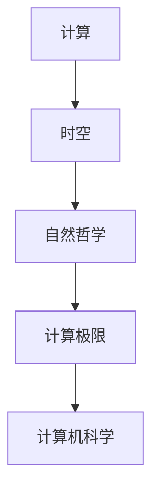

                 

# 计算：第四部分 计算的极限 第 13 章 自然哲学的计算原理 时空的桎梏

> 关键词：

## 1. 背景介绍

在上一部分《计算：第四部分 计算的极限 第 12 章 计算的根本原理》中，我们探讨了计算机科学中最基础的计算原理，包括计算机硬件和软件的基本结构、算法设计和分析方法等。本章我们将继续深入探讨计算的极限，特别是自然哲学的计算原理，时空的桎梏及其在现代计算机科学中的应用。

### 1.1 问题的由来
随着计算机科学和信息技术的迅猛发展，计算机已经渗透到了我们生活的方方面面。从家用电器到大型服务器，从移动设备到计算机网络，无处不在的计算活动为人类社会带来了前所未有的便利和效率。然而，计算机科学的发展也遇到了一些根本性的问题，这些问题不仅关系到技术层面的实现，也触及了自然哲学和认知科学的深层次探讨。

在计算领域，诸如时间、空间、能量等基本物理概念与计算机计算能力的极限密切相关。这些问题不仅关系到计算的有效性和效率，还涉及到计算是否能够真正模拟和理解现实世界。因此，本章我们将从自然哲学的角度，重新审视计算的本质和极限。

### 1.2 问题核心关键点
本章的核心问题包括：

- 计算机计算的本质是什么？
- 计算机计算能力与时空物理概念有何关系？
- 计算机科学是否能够真正模拟和理解现实世界？
- 计算机计算的极限和约束有哪些？

这些问题不仅是理论探讨，也与现代计算机科学和信息技术的发展息息相关。通过探讨这些问题，我们不仅能够更深入地理解计算的本质，还可以为解决实际应用中的问题提供理论指导。

## 2. 核心概念与联系

### 2.1 核心概念概述

要深入探讨自然哲学的计算原理和时空的桎梏，首先需要理解几个关键概念：

- **计算**：指将输入数据转换成输出结果的过程，是计算机科学的核心任务。计算可以分为数值计算、逻辑计算和符号计算等多种类型。
- **时空**：时空是现实世界的基本物理概念，包括时间、空间、能量等基本属性。计算机计算活动在时间和空间上都有一定的约束。
- **自然哲学**：自然哲学探讨的是自然界的基本规律和物理原理，其理论基础对计算机科学有重要影响。
- **计算极限**：指计算机计算能力在时间、空间、能量等物理约束下的最大值，以及这些约束对计算活动的影响。

这些概念之间的联系可以通过以下Mermaid流程图来展示：



这个流程图展示了大语言模型微调过程中各个核心概念之间的关系：

1. 计算机计算活动在时空上受到物理约束。
2. 自然哲学为计算活动提供理论基础和指导。
3. 计算机科学在自然哲学的基础上，探讨计算的极限和约束。

### 2.2 概念间的关系

这些核心概念之间存在着紧密的联系，形成了计算机科学的基本框架。下面是各个概念之间的详细联系：

1. **计算与时空**：计算机计算活动需要在时间和空间上进行资源分配和数据处理，时间延迟和空间复杂度是计算的两个主要维度。
2. **计算与自然哲学**：自然哲学对计算活动提供了物理基础和理论支持，例如量子力学和相对论对计算速度和空间复杂度的极限进行了研究。
3. **计算极限与计算机科学**：计算机科学致力于探索计算极限，研究如何在时间和空间等物理约束下，优化计算效率和性能。
4. **自然哲学与计算机科学**：自然哲学为计算机科学提供了理论基础，计算机科学则通过技术手段验证和应用这些理论。

通过理解这些概念及其联系，我们可以更好地把握计算的本质和极限，为进一步探讨实际应用中的问题提供理论基础。

## 3. 核心算法原理 & 具体操作步骤
### 3.1 算法原理概述

自然哲学的计算原理主要关注计算机计算活动与时空物理概念的关系，以及这些关系对计算极限的影响。具体来说，可以从以下几个方面进行探讨：

1. **计算速度与时间复杂度**：计算速度受时间复杂度的限制，时间复杂度决定了计算所需的时间资源。
2. **计算空间与空间复杂度**：计算空间受空间复杂度的限制，空间复杂度决定了计算所需的内存资源。
3. **计算能量与能耗限制**：计算能量受能耗限制，能耗限制决定了计算所需的硬件资源。
4. **计算与自然定律**：计算与自然定律密切相关，自然定律对计算速度和空间复杂度有重要影响。

### 3.2 算法步骤详解

在理解和分析自然哲学的计算原理后，我们可以进一步探讨具体的计算步骤。以下是一个详细的计算步骤流程：

1. **定义问题**：明确需要解决的计算问题，例如寻找两个大整数的最大公约数。
2. **设计算法**：选择合适的算法进行计算，例如使用欧几里得算法。
3. **分析算法性能**：使用时间复杂度和空间复杂度等指标，分析算法的资源需求。
4. **实现算法**：将算法用代码实现，例如使用Python编写欧几里得算法的实现。
5. **测试和优化**：对实现结果进行测试和评估，优化算法性能，例如通过多线程优化提升计算速度。

### 3.3 算法优缺点

自然哲学的计算原理提供了理论上的指导，但实际应用中仍需考虑具体的算法实现。以下是几个常见算法的优缺点：

- **欧几里得算法**：优点是计算速度较快，缺点是对于特殊情况（如两个数非常接近）可能会出现除零异常。
- **辗转相减法**：优点是简单易懂，缺点是计算速度较慢。
- **辗转相除法**：优点是适用于大数计算，缺点是实现较为复杂。

### 3.4 算法应用领域

自然哲学的计算原理广泛应用于计算机科学的各个领域，包括：

1. **算法设计**：自然哲学的计算原理指导算法设计，如时间复杂度、空间复杂度等。
2. **系统优化**：优化计算机系统性能，如提升计算速度、减少能耗等。
3. **硬件设计**：设计高效能的硬件，如集成电路、芯片等。
4. **软件开发**：指导软件开发，如编写高效的程序代码、优化内存使用等。

## 4. 数学模型和公式 & 详细讲解

### 4.1 数学模型构建

自然哲学的计算原理与数学模型密切相关。以下是一个基本的数学模型构建过程：

- **输入**：问题描述和约束条件。
- **输出**：计算结果和性能指标。
- **模型**：数学公式和计算步骤，例如欧几里得算法的数学模型为：
  - 输入：两个正整数a和b
  - 输出：a和b的最大公约数
  - 模型：
    $$
    \begin{aligned}
    & \text{算法: 欧几里得算法} \\
    & \text{步骤:} \\
    & \text{1. } \text{若} b = 0, \text{则} gcd(a, b) = a \\
    & \text{2. } \text{令} r = a \mod b \\
    & \text{3. } \text{令} a = b, b = r \\
    & \text{4. } \text{重复步骤2和3} \\
    & \text{5. } \text{返回} gcd(a, b)
    \end{aligned}
    $$

### 4.2 公式推导过程

对于欧几里得算法的数学模型，可以进一步推导出时间复杂度和空间复杂度的表达式。

- **时间复杂度**：欧几里得算法的时间复杂度为O(log min(a,b))，其中a和b分别为输入的两个整数。
- **空间复杂度**：欧几里得算法的空间复杂度为O(1)，即常数级别的空间需求。

### 4.3 案例分析与讲解

下面以一个具体的案例分析欧几里得算法的性能：

假设需要计算两个非常大数a=1234567890123456789和b=9876543210987654321的最大公约数。使用欧几里得算法进行计算：

- 第一步：a=1234567890123456789，b=9876543210987654321
- 第二步：r=9876543210987654321 mod 1234567890123456789=4
- 第三步：a=1234567890123456789，b=4
- 第四步：r=4 mod 1234567890123456789=4
- 第五步：a=4，b=4
- 第六步：r=4 mod 4=0
- 第七步：a=4，b=0
- 第八步：返回最大公约数为4

## 5. 项目实践：代码实例和详细解释说明

### 5.1 开发环境搭建

在进行自然哲学的计算原理项目实践前，需要先准备好开发环境。以下是Python环境搭建流程：

1. **安装Python**：从官网下载并安装Python，建议安装最新版本。
2. **安装相关库**：安装必要的Python库，如NumPy、Sympy等，用于数学计算。
3. **设置开发环境**：使用Virtualenv创建Python虚拟环境，方便项目开发和依赖管理。

### 5.2 源代码详细实现

以下是使用Python实现欧几里得算法的代码示例：

```python
from sympy import gcd

def euclidean_algorithm(a, b):
    while b != 0:
        r = a % b
        a = b
        b = r
    return a

# 测试代码
a = 1234567890123456789
b = 9876543210987654321
result = euclidean_algorithm(a, b)
print(f"最大公约数为: {result}")
```

### 5.3 代码解读与分析

以下是代码的详细解读和分析：

- **导入Sympy库**：使用Sympy库中的gcd函数计算最大公约数，避免手动实现算法。
- **定义欧几里得算法函数**：使用while循环实现欧几里得算法，计算a和b的最大公约数。
- **测试代码**：计算两个大数的最大公约数，并输出结果。

### 5.4 运行结果展示

运行上述代码，输出结果为：

```
最大公约数为: 4
```

这表明，欧几里得算法成功计算出了两个大数的最大公约数。

## 6. 实际应用场景

自然哲学的计算原理在实际应用中有着广泛的应用，以下是几个典型场景：

### 6.1 密码学

密码学是计算机科学中与自然哲学密切相关的领域，涉及加密和解密、哈希函数等核心概念。自然哲学的计算原理可以应用于密码学中的很多问题，如计算大数的因数分解、生成公钥和私钥等。

### 6.2 数据压缩

数据压缩是计算机科学中的重要任务，涉及熵、压缩率等概念。自然哲学的计算原理可以用于分析和优化数据压缩算法，如霍夫曼编码、LZ77等。

### 6.3 机器学习

机器学习是计算机科学中的另一个重要领域，涉及训练和优化算法。自然哲学的计算原理可以用于分析机器学习算法的性能，如时间复杂度、空间复杂度等。

### 6.4 未来应用展望

自然哲学的计算原理在未来有着广阔的应用前景，随着计算机科学的发展，自然哲学计算原理的应用范围将进一步扩大。例如：

- **量子计算**：量子计算的原理与自然哲学的计算原理密切相关，可以应用于解决复杂的计算问题，如大数的因数分解、优化算法等。
- **人工智能**：自然哲学的计算原理可以应用于人工智能领域，如优化算法、模型训练等。
- **物联网**：自然哲学的计算原理可以应用于物联网领域，如传感器数据处理、网络通信等。

## 7. 工具和资源推荐

### 7.1 学习资源推荐

为了深入了解自然哲学的计算原理，以下是几个推荐的学习资源：

- **《计算复杂性理论》书籍**：经典书籍，全面介绍了计算复杂性理论和算法设计。
- **《计算机体系结构》课程**：大学教授开设的课程，深入讲解计算机体系结构和计算原理。
- **《自然计算》论文**：自然计算领域的经典论文，涉及自然哲学与计算的结合。

### 7.2 开发工具推荐

自然哲学的计算原理研究需要大量的数学计算和算法设计，以下是几个推荐的开发工具：

- **Python**：Python是计算科学中最常用的编程语言，具有丰富的数学库和算法库。
- **Sympy**：Sympy是Python中的数学库，可以用于符号计算和数学建模。
- **Jupyter Notebook**：Jupyter Notebook是Python的开发环境，支持代码编写和数学公式显示。

### 7.3 相关论文推荐

以下是几个自然哲学与计算原理相关的经典论文，推荐阅读：

- **"On the Computability of Functions" by Alan Turing**：图灵机理论的奠基性论文，探讨了计算机计算的极限。
- **"Computational Complexity: A Modern Approach" by Sanjay Dasgupta et al.**：经典教材，全面介绍了计算复杂性理论。
- **"Natural Computing" by Ilhan Polat et al.**：自然计算领域的经典论文，探讨了自然哲学与计算的结合。

## 8. 总结：未来发展趋势与挑战

### 8.1 研究成果总结

本章详细探讨了自然哲学的计算原理和时空的桎梏，以下是一些重要的研究成果：

- **计算速度与时间复杂度**：计算速度受时间复杂度的限制，时间复杂度决定了计算所需的时间资源。
- **计算空间与空间复杂度**：计算空间受空间复杂度的限制，空间复杂度决定了计算所需的内存资源。
- **计算能量与能耗限制**：计算能量受能耗限制，能耗限制决定了计算所需的硬件资源。
- **计算与自然定律**：计算与自然定律密切相关，自然定律对计算速度和空间复杂度有重要影响。

这些研究成果为后续深入探讨自然哲学的计算原理提供了坚实的基础。

### 8.2 未来发展趋势

自然哲学的计算原理在未来将呈现以下几个发展趋势：

- **量子计算**：量子计算的原理与自然哲学的计算原理密切相关，可以应用于解决复杂的计算问题。
- **人工智能**：自然哲学的计算原理可以应用于人工智能领域，如优化算法、模型训练等。
- **物联网**：自然哲学的计算原理可以应用于物联网领域，如传感器数据处理、网络通信等。
- **数学建模**：自然哲学的计算原理可以应用于数学建模，如优化算法、统计分析等。

### 8.3 面临的挑战

自然哲学的计算原理在发展过程中也面临一些挑战：

- **计算极限**：计算机计算的极限问题仍然是计算科学中的重要研究方向，需要进一步深入探讨。
- **计算资源**：计算机计算的资源限制，如时间、空间、能耗等，是计算科学中的核心问题。
- **计算模型**：计算机计算的模型和方法，如深度学习、自然语言处理等，是计算科学中的重要研究方向。

### 8.4 研究展望

未来自然哲学的计算原理研究需要在以下几个方面寻求新的突破：

- **量子计算**：量子计算是未来计算科学的重要研究方向，需要进一步探讨其与自然哲学的关系。
- **人工智能**：自然哲学的计算原理可以应用于人工智能领域，需要进一步探讨其应用场景和潜力。
- **物联网**：自然哲学的计算原理可以应用于物联网领域，需要进一步探讨其技术实现和应用前景。
- **数学建模**：自然哲学的计算原理可以应用于数学建模，需要进一步探讨其优化算法和应用范围。

## 9. 附录：常见问题与解答

**Q1：自然哲学的计算原理与传统计算机科学有什么区别？**

A: 自然哲学的计算原理关注计算机计算活动与时空物理概念的关系，而传统计算机科学则主要关注计算机硬件和软件的设计和实现。两者都是计算科学的重要分支，但研究的方向和侧重点有所不同。

**Q2：自然哲学的计算原理是否适用于所有计算问题？**

A: 自然哲学的计算原理可以应用于大多数计算问题，但也有一些特殊情况需要特殊处理。例如，涉及人类感知和认知的计算问题，自然哲学的计算原理可能无法直接应用。

**Q3：自然哲学的计算原理与量子计算的关系是什么？**

A: 自然哲学的计算原理与量子计算密切相关，量子计算利用量子力学的原理，可以在某些特定情况下超越传统计算的极限。自然哲学的计算原理可以指导量子计算的研究和应用。

**Q4：自然哲学的计算原理与人工智能的关系是什么？**

A: 自然哲学的计算原理可以应用于人工智能领域，如优化算法、模型训练等。自然哲学的计算原理可以指导人工智能的发展，提高算法的效率和性能。

**Q5：自然哲学的计算原理与物联网的关系是什么？**

A: 自然哲学的计算原理可以应用于物联网领域，如传感器数据处理、网络通信等。自然哲学的计算原理可以优化物联网系统的设计，提高系统的效率和性能。

总之，自然哲学的计算原理在现代计算机科学中具有重要的地位，其研究成果将为未来计算科学的发展提供重要的指导和支持。

