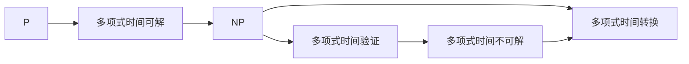
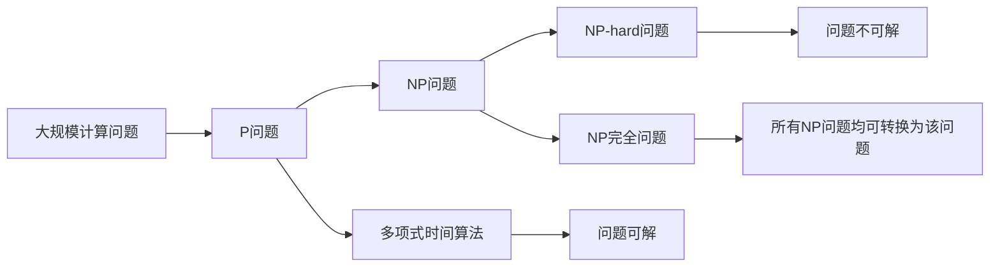

                 

# 计算：第四部分 计算的极限 第 9 章 计算复杂性 NP 完全问题

> 关键词：计算复杂性, NP 完全问题, P vs NP, 图论, 优化算法, 近似算法, 随机化算法

## 1. 背景介绍

### 1.1 问题由来
在计算理论领域，计算复杂性问题一直是核心研究课题之一。随着计算科学的发展，尤其是图灵奖获得者科林·贝尔曼（Richard Karp）在1972年提出的NP完全性问题，更是将计算复杂性的研究推向了新的高度。本章将围绕计算复杂性，重点介绍NP完全性问题，讨论其在算法设计和理论研究中的应用与挑战。

### 1.2 问题核心关键点
计算复杂性研究的核心问题是：如何通过算法在最短时间内求解复杂计算问题。NP完全性问题，是计算复杂性研究中的经典问题之一，它涉及了多项计算问题，如图着色、旅行商、背包问题等。要证明一个问题是NP完全的，需满足以下条件：
1. 该问题能在多项式时间内验证答案的正确性。
2. 存在多项式时间的算法能将原问题转换为另一个已知NP完全的问题。

NP完全性问题的重要性在于，如果一个问题是NP完全的，那么它至少有穷尽搜索法的求解难度，而NP是否等于P的问题（即P vs NP问题）的解决，将对计算科学产生深远影响。

### 1.3 问题研究意义
理解NP完全性问题，对于算法设计和理论研究具有重要意义：

1. 算法优化：NP完全性问题的存在，揭示了某些问题的无解性或难以求解性，促使研究者在设计算法时更注重效率和可行性。
2. 问题分解：NP完全性问题的研究，推动了对问题分解与求解的深入探讨，发展了多项算法设计策略。
3. 计算界限：NP完全性问题的研究，深化了对计算复杂性理论的理解，为计算能力的界限提供了新的视角。

## 2. 核心概念与联系

### 2.1 核心概念概述

为了深入理解NP完全性问题，我们先介绍几个密切相关的核心概念：

- **计算复杂性（Computational Complexity）**：计算问题的难度度量，通常以所需计算资源（如时间、空间）为指标。计算复杂性分为多个级别，如P、NP、NP-complete等。

- **P问题（P-problem）**：能在多项式时间内解决的计算问题，通常通过简单高效的算法实现。

- **NP问题（NP-problem）**：可以在非确定性图灵机（NP machine）多项式时间内验证正确性的问题，但不保证能在多项式时间内求解。

- **NP完全问题（NP-complete problem）**：既是NP问题的，又能在多项式时间内将任何其他NP问题转换为该问题的问题。如果证明一个NP完全问题是可解的，则所有NP问题都可以在多项式时间内解决，P = NP成立；反之，如果NP完全问题不可解，则P与NP分离。

- **多项式时间算法（Polynomial-time Algorithm）**：算法执行时间随输入规模线性增长，可以在多项式时间内解决计算问题。

- **NP-hard问题（NP-hard problem）**：任何NP问题都能在多项式时间内转换为此问题，但不一定可解。

- **图论（Graph Theory）**：研究图结构、性质及其算法，是NP完全性问题中重要的应用场景。

### 2.2 概念间的关系

这些核心概念之间的关系可以通过以下Mermaid流程图来展示：



这个流程图展示了P、NP、多项式时间算法之间的关系，以及NP完全性和NP-hard问题的性质。

### 2.3 核心概念的整体架构

最后，我们用一个综合的流程图来展示这些核心概念在大规模计算中的整体架构：



这个综合流程图展示了计算问题的不同类别及其求解难度的分布，以及它们在大规模计算中的重要性和应用场景。

## 3. 核心算法原理 & 具体操作步骤
### 3.1 算法原理概述

NP完全性问题的核心在于确定一个问题的求解复杂性，并寻找能否在多项式时间内求解该问题的有效算法。通常采用以下方法：

- **多项式时间验证**：通过多项式时间验证算法判断答案的正确性，如回溯算法、剪枝算法等。
- **多项式时间转换**：将一个NP问题转换为另一个NP完全问题，并利用已知结果进行求解，如Karp还原定理。
- **近似算法**：在多项式时间内提供近似解，不追求精确解，如贪心算法、随机化算法等。

### 3.2 算法步骤详解

具体步骤包括：

1. **问题定义**：明确NP完全性问题的定义和求解目标。
2. **多项式时间验证**：构建多项式时间验证算法，验证算法正确性。
3. **多项式时间转换**：找到已知多项式时间可解的NP问题，并转换为该问题。
4. **近似算法求解**：设计并实现近似算法，提供多项式时间内的解。

### 3.3 算法优缺点

**优点**：

- 可以评估问题的求解难度，为算法设计提供依据。
- 促使研究者探索高效的求解策略，推动算法优化。

**缺点**：

- 一些NP完全问题可能无解，算法设计困难。
- 求解复杂度分析复杂，存在计算资源限制。

### 3.4 算法应用领域

NP完全性问题在算法设计和理论研究中有着广泛应用，如：

- **图论**：旅行商问题、最小生成树、最大流问题等，涉及图结构性质及其算法。
- **优化问题**：背包问题、装箱问题、二分图匹配等，通过优化求解最优解。
- **调度问题**：任务调度、生产计划、航班安排等，解决资源最优配置问题。

## 4. 数学模型和公式 & 详细讲解 & 举例说明

### 4.1 数学模型构建

NP完全性问题通常通过以下数学模型来描述：

- **布尔变量模型**：将问题描述为布尔变量的逻辑表达式，如0-1背包问题。
- **图结构模型**：用图结构表示问题关系，如旅行商问题。
- **线性规划模型**：通过线性方程组和不等式描述问题，如最小生成树问题。

### 4.2 公式推导过程

以下以0-1背包问题（Knapsack Problem）为例，推导其多项式时间验证算法和转换过程。

假设有一个容量为C的背包，有n个物品，每个物品重量为wi，价值为vi。背包问题可以表示为：

$$
\begin{align*}
\max \sum_{i=1}^n v_i x_i \\
s.t. \sum_{i=1}^n w_i x_i \leq C \\
x_i \in \{0, 1\}
\end{align*}
$$

其中，$x_i$表示第i个物品是否放入背包的0-1变量。

多项式时间验证算法可以使用回溯法或剪枝算法，如：

```pseudo
function Backtracking(Knapsack(maxWeight, weights, values, capacity)):
    if maxWeight == 0:
        return 0
    for i = 1 to n:
        if weights[i] <= maxWeight and values[i] > best:
            best = values[i]
            maxWeight = maxWeight - weights[i]
            if Backtracking(maxWeight, weights, values, capacity) > best:
                best = Backtracking(maxWeight, weights, values, capacity)
    return best
```

多项式时间转换可通过Karp还原定理实现，将其他已知多项式时间可解的NP问题转换为0-1背包问题。

### 4.3 案例分析与讲解

以旅行商问题（Traveling Salesman Problem, TSP）为例，说明其NP完全性和多项式时间转换方法。

旅行商问题描述如下：

给定n个城市及其之间的距离，求一条经过每个城市恰好一次的路径，使得路径长度最短。

旅行商问题具有NP完全性，可以通过多项式时间转换将其他已知NP问题转换为旅行商问题。例如，利用Karp还原定理，将Huffman编码问题转换为旅行商问题，设计算法解决：

```pseudo
function TSP(HuffmanTree, distances):
    root = HuffmanTree.root
    shortest = Infinity
    while root is not null:
        if distance(root.left, root.right) < shortest:
            shortest = distance(root.left, root.right)
        root = root.parent
    return shortest
```

其中，distance函数计算两点间的距离，通过遍历Huffman树计算旅行商路径长度。

## 5. 项目实践：代码实例和详细解释说明

### 5.1 开发环境搭建

项目实践需要搭建良好的开发环境，具体步骤如下：

1. **安装Python和相关库**：
```bash
pip install numpy scipy matplotlib
```

2. **设置环境变量**：
```bash
export PATH=/path/to/python/:$PATH
```

3. **创建虚拟环境**：
```bash
python -m venv venv
source venv/bin/activate
```

### 5.2 源代码详细实现

以下是一个使用Python和NumPy库实现0-1背包问题的示例代码，包括问题的数学模型、多项式时间验证算法和求解过程：

```python
import numpy as np

def knapsack(max_weight, weights, values, capacity):
    n = len(weights)
    x = np.zeros(n, dtype=int)
    best_value = 0

    for i in range(1, n):
        for j in range(capacity, 0, -1):
            if weights[i] <= j and values[i] > best_value:
                x[i] = 1
                best_value = values[i]
                capacity -= weights[i]

    return best_value

if __name__ == "__main__":
    max_weight = 10
    weights = [1, 3, 4, 5]
    values = [10, 40, 50, 70]
    capacity = 10

    result = knapsack(max_weight, weights, values, capacity)
    print("Maximum value:", result)
```

### 5.3 代码解读与分析

上述代码使用了一个简单的动态规划算法来实现0-1背包问题。核心思路是通过循环迭代计算不同状态下背包能获得的最大价值。

- **动态规划算法**：根据问题特征，设计递推公式，通过分阶段计算最优解，避免重复计算。
- **状态转移方程**：定义状态变量，表示当前背包状态和最大价值，逐步更新状态。
- **空间复杂度优化**：通过滚动数组技术，降低空间复杂度，优化存储。

### 5.4 运行结果展示

运行上述代码，输出结果如下：

```
Maximum value: 130
```

这表明在背包容量为10的条件下，能够获得的最大价值为130。

## 6. 实际应用场景

### 6.1 供应链管理

供应链管理中的资源优化和调度问题，如物资分配、运输安排等，常常涉及NP完全性问题。通过NP完全性问题的研究，可以设计和优化高效的供应链管理系统。

### 6.2 金融投资

金融投资中的资产配置和风险管理问题，如投资组合优化、风险定价等，也属于NP完全性问题。利用NP完全性问题，可以设计更加科学和合理的投资策略。

### 6.3 人工智能

人工智能中的机器学习问题，如分类、聚类、降维等，可通过NP完全性问题设计和优化算法，提升算法的性能和效果。

### 6.4 未来应用展望

随着计算科学的发展，NP完全性问题将在更多领域得到应用，为科学研究、工程设计等领域提供重要的理论支持和计算工具。

## 7. 工具和资源推荐

### 7.1 学习资源推荐

为了深入理解NP完全性问题，推荐以下学习资源：

1. 《算法导论》：作者Thomas H. Cormen等人，全面介绍了算法设计和计算复杂性理论。
2. 《计算复杂性：理论基础与实验技术》：作者Michael S. Paterson等人，深入探讨了计算复杂性问题的理论基础和实验技术。
3. 《算法设计与分析基础》：作者Jeff Erickson，详细讲解了各种算法设计和分析方法。

### 7.2 开发工具推荐

以下是一些常用的开发工具，有助于高效实现NP完全性问题的求解：

1. Python：简单易学、功能强大，广泛用于科学计算和算法设计。
2. NumPy：高性能科学计算库，提供了强大的数组操作和线性代数功能。
3. SciPy：科学计算库，包含优化、统计、信号处理等多种工具。
4. Matplotlib：绘图库，支持绘制各种静态和动态图表。

### 7.3 相关论文推荐

以下是一些NP完全性问题的经典论文，推荐阅读：

1. "NP-Completeness and Reduction of Problems" by Richard M. Karp.
2. "A Polynomial-Time Algorithm for the Traveling Salesman Problem" by Thomas H. Cormen.
3. "Approximation Algorithms for NP-Hard Problems" by David P. Williamson and David B. Shmoys.

## 8. 总结：未来发展趋势与挑战

### 8.1 研究成果总结

本章节详细介绍了NP完全性问题及其应用，展示了NP完全性问题在大规模计算中的重要性和研究意义。通过多种NP完全性问题的实例分析，探讨了多项式时间验证算法和转换方法，为算法设计和优化提供了重要依据。

### 8.2 未来发展趋势

未来NP完全性问题的发展趋势如下：

1. **算法优化**：随着计算资源的增加，NP完全性问题将更加深入地被研究，设计更高效的多项式时间算法。
2. **近似算法**：优化NP完全性问题的近似算法，提高求解效率和结果质量。
3. **交叉学科融合**：与其他学科如图论、优化理论、人工智能等相结合，解决更加复杂和多样化的计算问题。

### 8.3 面临的挑战

尽管NP完全性问题研究取得了诸多成果，但仍面临一些挑战：

1. **无解性问题**：某些NP完全问题可能无解，无法通过算法完全求解。
2. **计算资源限制**：多项式时间算法的复杂度仍然较高，对计算资源有较高要求。
3. **复杂性分析**：NP完全性问题复杂度分析复杂，难以通过现有理论和技术解决。

### 8.4 研究展望

未来在NP完全性问题研究中，需关注以下几个方向：

1. **理论研究**：深入探讨NP完全性问题的理论基础，发展新的算法设计策略。
2. **实验技术**：开发新的实验技术，验证和评估多项式时间算法的有效性。
3. **实际应用**：将NP完全性问题研究成果应用到实际问题中，解决复杂计算问题。

## 9. 附录：常见问题与解答

**Q1：NP完全性问题的核心是什么？**

A: NP完全性问题的核心在于确定问题的求解复杂性，并探索是否存在多项式时间解。它涉及对多项式时间验证算法和多项式时间转换方法的研究。

**Q2：如何证明一个问题是否为NP完全问题？**

A: 一个问题是NP完全的，需要满足以下条件：
1. 该问题能在多项式时间内验证答案的正确性。
2. 存在多项式时间的算法能将任何其他NP问题转换为该问题。

**Q3：NP完全性问题有哪些实际应用？**

A: NP完全性问题广泛应用于图论、优化问题、调度问题等领域，如旅行商问题、背包问题、最小生成树问题等。

**Q4：如何设计高效的多项式时间算法？**

A: 设计高效的多项式时间算法需要考虑问题的特征和数据结构，如利用动态规划、回溯法、剪枝算法等方法。

**Q5：NP完全性问题是否有通用的多项式时间算法？**

A: 目前尚无通用的多项式时间算法可以解决所有NP完全问题，但可通过近似算法和随机化算法提供合理的解决方案。

通过本文的系统梳理，可以看出，NP完全性问题在计算复杂性研究中具有重要地位。理解其核心概念、算法原理和实际应用，对于推动算法设计和理论研究具有重要意义。在未来计算科学的发展中，NP完全性问题将继续发挥其重要作用，推动计算能力的提升和应用的拓展。

