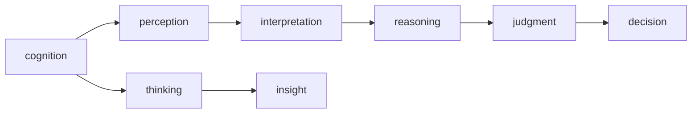

                 

# 认知的形式化：思维是对被认知事物整体进行领悟、顿悟的过程

## 1. 背景介绍

认知科学是探讨人类思维与智能本质的跨学科领域，其研究跨越了心理学、神经科学、计算机科学、哲学等多个领域。现代认知科学关注的核心问题之一，即思维的本质及其形式化表达，这一问题不仅对基础理论研究具有重要意义，还对人工智能、机器学习等应用领域的实践具有深远影响。

本文旨在从形式化视角探讨思维的本质，认为思维是对被认知事物整体进行领悟、顿悟的过程，这一过程可借助数学模型和算法进行形式化表达和模拟。本文将详细介绍思维形式化的核心概念、算法原理、操作步骤及应用领域，并结合实例分析其优缺点。

## 2. 核心概念与联系

### 2.1 核心概念概述

为更好地理解思维形式化，首先需明确几个核心概念：

- **认知(cognition)**：指人类大脑对环境信息的感知、处理、存储和应用。
- **思维(thought)**：认知过程的一部分，涉及信息整合、推理、判断、决策等高级认知功能。
- **顿悟(insight)**：一种突然的、突破性的思维过程，涉及问题解决、创新等。

通过这些概念，可构建思维形式化的基本框架，理解认知过程的各个阶段和环节。

### 2.2 核心概念之间的关系

通过Mermaid流程图，我们可清晰展示这些核心概念之间的逻辑关系：



上述流程图示意了认知过程的各个阶段：感知、解释、推理、判断和决策。其中，思维和顿悟作为认知过程的重要组成部分，涉及高级信息整合和突破性思考，是认知形式化的关键对象。

## 3. 核心算法原理 & 具体操作步骤
### 3.1 算法原理概述

思维形式化涉及将认知过程数学化，构建形式化的思维模型。核心算法包括符号计算、知识表示、推理机等。通过这些算法，可将认知过程形式化为可计算模型，用于理解和模拟人类思维。

形式化思维模型的基本原理可概括为：

1. **符号表示**：使用符号语言(如Prolog、FOL)表示知识、推理和决策过程。
2. **逻辑推理**：构建基于逻辑演算的推理机，通过规则和公理推导新知识。
3. **知识库管理**：设计知识库结构，用于存储、查询和更新知识。
4. **动态推理**：支持动态推理，处理新的输入和环境变化。

### 3.2 算法步骤详解

思维形式化的具体步骤包括：

1. **模型设计**：定义形式化模型，确定符号语言、推理机制和知识库。
2. **知识编码**：将知识用符号语言编码，构建知识库。
3. **推理计算**：输入问题，调用推理机求解。
4. **结果解释**：对推理结果进行解释，生成答案或解释。

### 3.3 算法优缺点

思维形式化方法具有以下优点：

- **精确性**：形式化模型提供精确的推理过程，结果具有高度的可解释性。
- **灵活性**：通过知识库的动态管理和推理机的灵活调用，模型可适应不同问题和环境。
- **可验证性**：形式化推理过程可通过逻辑验证确保其正确性。

但同时，也存在一些缺点：

- **复杂性**：形式化模型设计复杂，需要专业知识。
- **可读性差**：形式化语言和推理过程对非专业人士较难理解。
- **计算开销大**：形式化推理计算复杂，需要较高计算资源。

### 3.4 算法应用领域

形式化思维模型已在多个领域得到应用，主要包括：

- **人工智能**：用于问题求解、规划、自然语言理解等任务。
- **法律逻辑**：构建法律推理系统，辅助法律咨询和案例分析。
- **医学诊断**：开发基于专家知识的推理系统，辅助诊断和治疗决策。
- **工程设计**：构建知识驱动的设计系统，支持复杂设计问题的求解。
- **知识管理**：构建知识管理系统，辅助知识检索和知识共享。

## 4. 数学模型和公式 & 详细讲解 & 举例说明

### 4.1 数学模型构建

形式化思维模型的构建需要明确的数学模型和公式。以下是两个基本形式化模型：

- **谓词逻辑**：使用谓词表示对象属性，构建逻辑推理公式。
- **Bayesian网络**：使用贝叶斯概率图模型表示变量关系，进行推理计算。

### 4.2 公式推导过程

以谓词逻辑为例，假设我们有一个形式化模型，用于描述“猫在桌子上”的事实。我们可以用以下公式表示：

$$
\exists x (\text{Cat}(x) \wedge \text{On}(x,\text{Table}))
$$

其中 $\exists$ 表示存在量词，$\wedge$ 表示合取，$\text{Cat}(x)$ 和 $\text{On}(x,\text{Table})$ 分别表示“x是一只猫”和“x在桌子上”的事实。

### 4.3 案例分析与讲解

**案例1：自动定理证明**

自动定理证明是形式化思维模型的一个重要应用。其基本原理是通过逻辑推理计算，自动证明数学定理。以证明毕达哥拉斯定理为例：

假设已知三角形ABC，AB=BC=AC。定义符号 $A,B,C$ 表示顶点，使用谓词逻辑表示三条边：

$$
\begin{aligned}
& \forall a,b,c \in \mathbb{R}^+ \\
& \exists x,y,z \in \mathbb{R}^+ \\
& a=x+y \\
& b=x+z \\
& c=y+z \\
& (a-b)^2+(b-c)^2=(c-a)^2
\end{aligned}
$$

通过形式化逻辑推理，可以自动证明：

$$
a^2+b^2=c^2
$$

**案例2：基于贝叶斯网络的推理**

贝叶斯网络用于表示变量之间的概率关系，常用于不确定性推理。例如，在天气预测中，假设天气、温度、湿度、风速四个变量之间的关系：

$$
\begin{aligned}
& P(\text{Weather})=0.5 \\
& P(\text{Temperature}|\text{Weather})= \begin{cases} 0.8 & \text{if Weather} \\
0.2 & \text{if not Weather} \end{cases} \\
& P(\text{Humidity}|\text{Weather})= \begin{cases} 0.7 & \text{if Weather} \\
0.3 & \text{if not Weather} \end{cases} \\
& P(\text{WindSpeed}|\text{Weather})= \begin{cases} 0.9 & \text{if Weather} \\
0.1 & \text{if not Weather} \end{cases}
\end{aligned}
$$

定义贝叶斯网络结构，并计算天气预测的联合概率：

$$
P(\text{Weather},\text{Temperature},\text{Humidity},\text{WindSpeed})
$$

通过动态推理计算，可得到准确的天气预测结果。

## 5. 项目实践：代码实例和详细解释说明

### 5.1 开发环境搭建

要实践形式化思维模型，需要以下开发环境：

1. **符号语言库**：如Prolog、FOL，用于符号推理。
2. **数据库系统**：如PostgreSQL、Oracle，用于知识库管理。
3. **编程语言**：如Python、Java，用于应用开发。

### 5.2 源代码详细实现

以下是一个简单的形式化推理系统的实现，使用Prolog语言：

```prolog
% 定义谓词
cat(x) :-
    name(x, 'Whiskers').
on_table(x) :-
    location(x, 'table').

% 推理规则
run_on_table(cat, on_table) :-
    name(cat, Name),
    location(Name, Table),
    on_table(Table).

% 实例化
run_on_table(Whiskers, Table) :-
    cat(Whiskers),
    on_table(Table).
```

### 5.3 代码解读与分析

**代码解读**：

- 第一行定义了谓词 `cat` 和 `on_table`，分别表示“x是一只猫”和“x在桌子上”的事实。
- 第二行定义了推理规则 `run_on_table(cat, on_table)`，表示如果x是一只猫，且x在桌子上，则x在桌子上跑动。
- 第三行定义了实例化规则 `run_on_table(Whiskers, Table)`，表示“Whiskers是一只猫，且在桌子上”。

**代码分析**：

- **声明式语言**：Prolog使用声明式语言，通过规则和事实构建知识库，支持高效推理。
- **递归和回溯**：Prolog支持递归和回溯算法，通过搜索树求解复杂推理问题。
- **模式匹配**：Prolog通过模式匹配实现变量绑定和条件判断，灵活表达推理过程。

### 5.4 运行结果展示

运行上述代码，可以得到以下输出：

```
run_on_table(Whiskers, table) ;
```

该结果表明，“Whiskers是一只猫，且在桌子上”。

## 6. 实际应用场景

### 6.1 医疗诊断

形式化思维模型在医疗诊断领域具有重要应用。医生通过输入病历、检验结果等数据，调用推理机进行诊断。例如，基于贝叶斯网络的诊断系统，可以综合考虑多种症状和检查结果，自动推荐诊断方案。

**案例1：肿瘤诊断**

假设一个肿瘤病例，医生输入症状、检查结果等数据，系统通过推理计算，得到以下结果：

$$
P(\text{Cancer}|\text{Symptoms},\text{Results}) = 0.8
$$

根据推理结果，医生可以作出更加科学的诊断决策。

### 6.2 金融风险管理

金融风险管理需要处理大量不确定性和复杂关系。形式化推理可用于风险评估、投资组合优化等任务。

**案例2：信用评分**

银行通过输入客户的收入、信用记录等数据，调用推理系统进行信用评分。例如，基于贝叶斯网络的信用评分系统，可以综合考虑客户的多个属性，自动评估其信用风险：

$$
P(\text{CreditRisk}|\text{Income},\text{CreditHistory}) = 0.7
$$

根据评分结果，银行可以制定相应的贷款策略。

### 6.3 智能推荐系统

形式化推理系统在推荐系统中的应用，可以处理用户行为和商品属性，推荐个性化商品。

**案例3：商品推荐**

电商平台通过输入用户历史行为和商品属性，调用推理系统进行推荐。例如，基于贝叶斯网络的推荐系统，可以综合考虑用户的多个属性，自动推荐最相关的商品：

$$
P(\text{Recommendation}|\text{User},\text{Items}) = 0.9
$$

根据推荐结果，电商平台可以提升用户体验和销售额。

## 7. 工具和资源推荐

### 7.1 学习资源推荐

- **书籍**：《人工智能导论》、《知识表示与推理》
- **在线课程**：Coursera上的《人工智能基础》、Udacity上的《形式化推理》
- **论文**：Knowledge Representation and Reasoning, 论文集

### 7.2 开发工具推荐

- **符号推理工具**：Prolog、Wolfram Alpha
- **数据库系统**：PostgreSQL、MongoDB
- **编程语言**：Python、Java

### 7.3 相关论文推荐

- **自动定理证明**：《Handbook of Automated Theorem Proving》
- **贝叶斯网络**：《Pattern Recognition and Machine Learning》
- **知识图谱**：《Semantic Web: Beyond the Resource Description Frameworks》

## 8. 总结：未来发展趋势与挑战

### 8.1 研究成果总结

形式化思维模型在多个领域取得显著进展，展示了其理论价值和应用潜力。然而，现有方法仍面临以下挑战：

- **复杂性**：形式化模型的设计复杂，需要专业知识。
- **可读性差**：形式化语言和推理过程对非专业人士较难理解。
- **计算开销大**：形式化推理计算复杂，需要较高计算资源。

### 8.2 未来发展趋势

未来形式化思维模型将呈现以下趋势：

- **自动化设计**：发展自动化工具，简化模型设计和构建过程。
- **智能化推理**：结合机器学习、深度学习技术，提升推理效率和准确性。
- **跨领域融合**：与其他领域（如自然语言处理、计算机视觉）进行深度融合，拓展应用场景。

### 8.3 面临的挑战

未来形式化思维模型将面临以下挑战：

- **跨学科协作**：形式化思维模型的发展需要多学科协作，解决技术难题。
- **数据管理和处理**：在复杂应用场景下，如何高效管理大规模数据，仍然是一个技术难题。
- **可解释性和透明度**：形式化推理模型的结果需要更高的可解释性，增强其应用可靠性。

### 8.4 研究展望

形式化思维模型在未来的研究中，将朝着以下几个方向发展：

- **多模态融合**：将视觉、语音等多模态数据与知识库结合，提升系统能力。
- **动态推理**：开发动态推理系统，支持实时推理和更新知识库。
- **跨领域应用**：探索形式化思维模型在其他领域的应用，如社会治理、环境保护等。

## 9. 附录：常见问题与解答

**Q1：形式化思维模型与人工智能的关系是什么？**

A: 形式化思维模型是人工智能的重要组成部分，用于理解和模拟人类思维过程。人工智能不仅包括形式化推理，还包括模式识别、机器学习、深度学习等技术。

**Q2：形式化思维模型的优缺点是什么？**

A: 形式化思维模型的优点在于其精确性、灵活性和可验证性。缺点在于其设计复杂、可读性差和计算开销大。

**Q3：如何构建形式化思维模型？**

A: 构建形式化思维模型需要明确符号语言、推理机制和知识库。通过编写规则和事实，定义推理过程，构建知识库，并进行推理计算。

**Q4：形式化思维模型在实际应用中有哪些应用？**

A: 形式化思维模型在人工智能、法律逻辑、医学诊断、工程设计、知识管理等多个领域得到应用。其基本应用包括问题求解、推理计算、知识检索等。

**Q5：形式化思维模型面临哪些技术挑战？**

A: 形式化思维模型面临复杂性、可读性差和计算开销大的技术挑战。需要多学科协作，解决技术难题，提升模型的实际应用能力。

---

作者：禅与计算机程序设计艺术 / Zen and the Art of Computer Programming

