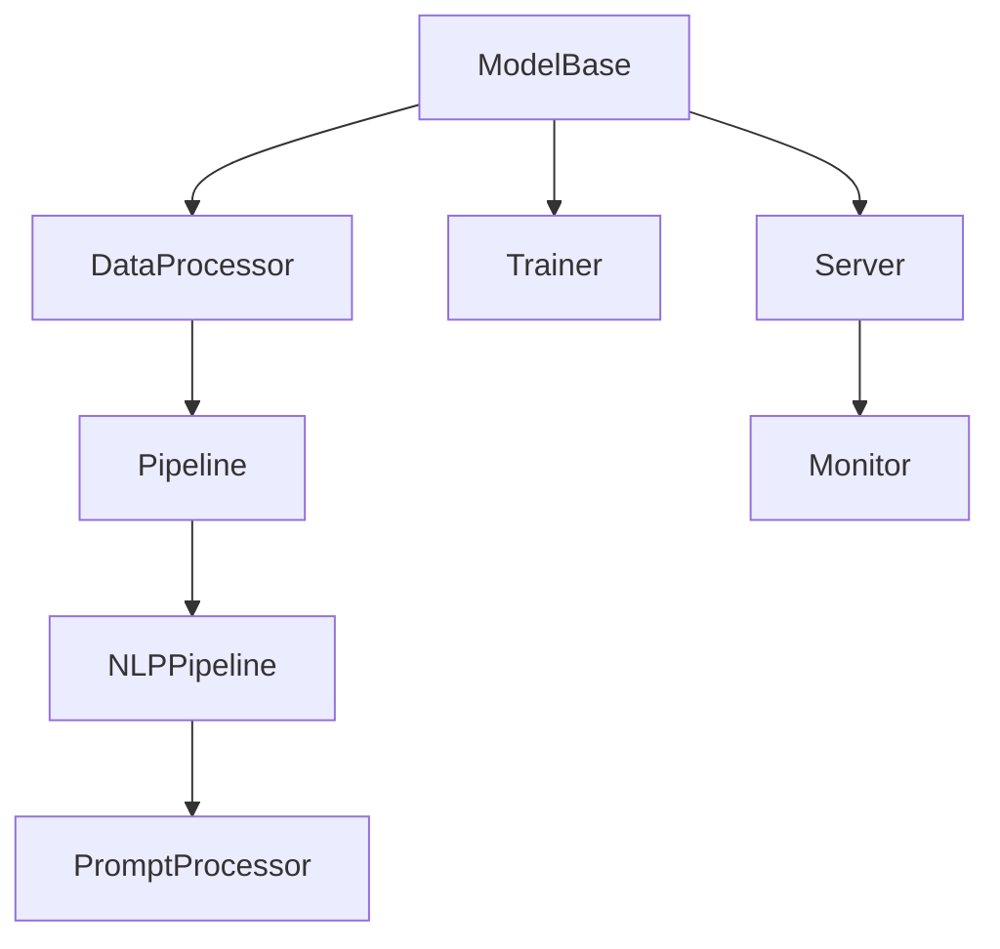
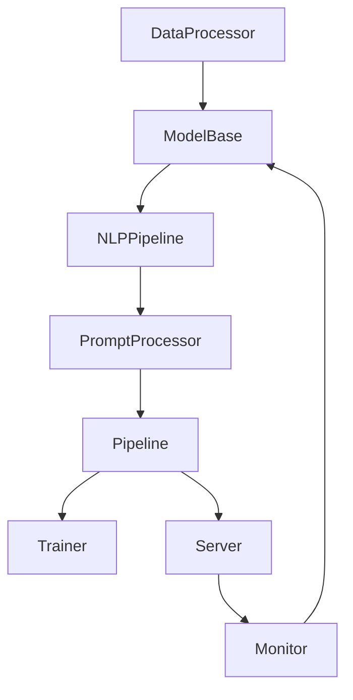

                 

## 1. 背景介绍

### 1.1 问题由来

随着大模型如GPT-3、BERT等在NLP领域的成功应用，越来越多的开发者和研究者开始探索如何将这些模型应用于实际业务场景。然而，传统的模型训练、推理、部署等流程繁琐且效率低下，限制了模型的广泛应用。因此，需要一种新的应用开发框架，能够提供模型构建、数据处理、推理计算、模型部署等一站式服务，降低模型应用的复杂度，提升应用效率。

### 1.2 问题核心关键点

在实际的业务应用中，大模型的应用通常面临以下几个关键问题：

- **数据预处理**：如何将大规模数据高效地加载、清洗、分片等，以适应模型推理计算的需求。
- **模型推理**：如何快速高效地进行模型推理，生成预测结果，并支持多种推理方式。
- **模型部署**：如何将模型部署到生产环境，进行实时推理，并支持模型更新和监控。
- **应用集成**：如何将模型集成到应用系统中，与用户界面、业务逻辑等其他组件无缝对接。

这些问题是制约大模型应用的关键因素，需要通过一个统一、高效的应用开发框架来解决。

### 1.3 问题研究意义

开发一个通用的大模型应用框架，对于推动AI技术的商业化应用具有重要意义：

- **降低开发成本**：提供一站式服务，减少开发者在模型应用过程中的工作量，降低开发和维护成本。
- **提高应用效率**：通过高效的推理计算和模型部署，提升模型的应用效率和响应速度。
- **增强模型泛化能力**：提供丰富的模型优化工具和策略，增强模型的泛化能力和鲁棒性。
- **提升用户体验**：通过友好的API接口和集成功能，提升用户体验，加速模型落地。

本文将详细介绍一种新型的大模型应用开发框架LangChain，包括其核心概念、原理和操作步骤，并通过实际案例展示其应用效果。

## 2. 核心概念与联系

### 2.1 核心概念概述

LangChain是一种基于大模型（如GPT-3、BERT等）的应用开发框架，旨在提供模型构建、数据处理、推理计算、模型部署等一站式服务，支持用户高效地开发和应用大模型。

其核心组件包括：

- **ModelBase**：模型基类，提供模型的加载、保存、推理等基本功能。
- **DataProcessor**：数据处理器，负责数据加载、清洗、分片、转换等预处理操作。
- **Pipeline**：管道，用于连接模型、数据处理器、推理器等组件，实现模型应用流程的自动化。
- **NLPPipeline**：自然语言处理管道，提供自动化的NLPIP提示工程、模型微调、推理等功能。
- **PromptProcessor**：提示处理器，负责生成和优化模型输入提示，提升模型推理效果。
- **Trainer**：训练器，用于模型的训练和微调。
- **Server**：服务器，提供模型推理服务和API接口。
- **Monitor**：监控器，用于实时监控模型性能和推理过程，提供报警机制。

这些组件通过API接口和管道连接，形成一个高效、灵活的大模型应用框架。

### 2.2 概念间的关系

以下通过一个简单的Mermaid流程图展示LangChain的核心组件及其关系：



该图展示了LangChain的核心组件及其相互关系：

1. 模型加载和保存通过ModelBase实现。
2. 数据预处理通过DataProcessor完成。
3. 数据与模型连接，形成Pipeline，实现模型应用流程自动化。
4. 自然语言处理通过NLPPipeline实现，提供自动化提示工程、模型微调、推理等功能。
5. 提示优化通过PromptProcessor实现，提升模型推理效果。
6. 模型训练和微调通过Trainer完成。
7. 模型推理服务和API接口通过Server实现。
8. 模型性能监控通过Monitor完成。

### 2.3 核心概念的整体架构

通过这些组件和关系，LangChain形成了一个完整的大模型应用开发框架。以下通过另一个综合的流程图展示这些组件的相互关系和整体架构：



该图展示了LangChain的整体架构：

1. 数据预处理通过DataProcessor完成，预处理后的数据加载到ModelBase中。
2. ModelBase加载模型，通过NLPPipeline进行提示工程和模型微调，生成推理输出。
3. PromptProcessor对提示进行优化，提升模型推理效果。
4. Pipeline连接数据处理器、模型、提示器、训练器等组件，实现模型应用流程的自动化。
5. Trainer对模型进行训练和微调。
6. Server提供模型推理服务和API接口。
7. Monitor实时监控模型性能和推理过程，提供报警机制。

这种架构设计，使得LangChain能够高效、灵活地支持大模型的应用开发和部署，提升了模型应用的效率和效果。

## 3. 核心算法原理 & 具体操作步骤
### 3.1 算法原理概述

LangChain的核心算法原理基于模型的加载、保存、推理、训练、微调、部署等关键操作。以下是这些操作的具体描述：

- **模型加载与保存**：通过ModelBase类，支持模型的加载和保存。模型加载时，可以指定模型文件路径和相应的配置信息。模型保存时，可以将模型保存为二进制文件或文本文件，方便后续加载和使用。
- **数据预处理**：DataProcessor类负责数据加载、清洗、分片、转换等预处理操作。支持多种数据格式，包括文本、图片、音频等。
- **模型推理**：Pipeline类用于连接模型、数据处理器、推理器等组件，实现模型推理流程的自动化。支持多种推理方式，如预测、分类、生成等。
- **模型训练与微调**：Trainer类用于模型的训练和微调。支持多种训练算法和优化器，如Adam、SGD等。
- **模型部署**：Server类提供模型推理服务和API接口，支持将模型部署到生产环境中，进行实时推理。
- **模型监控**：Monitor类用于实时监控模型性能和推理过程，提供报警机制。支持多种监控指标，如响应时间、精度、错误率等。

### 3.2 算法步骤详解

以下是LangChain的核心算法步骤：

1. **模型加载与保存**：
   - 定义ModelBase类，实现模型的加载和保存方法。
   - 使用`load`方法从文件或URL加载模型。
   - 使用`save`方法将模型保存为二进制或文本文件。

2. **数据预处理**：
   - 定义DataProcessor类，实现数据预处理的方法。
   - 使用`load_data`方法从文件或URL加载数据。
   - 使用`preprocess`方法对数据进行清洗、分片、转换等预处理操作。
   - 使用`convert`方法将数据转换为模型所需格式。

3. **模型推理**：
   - 定义Pipeline类，连接模型、数据处理器、推理器等组件。
   - 使用`run`方法启动管道，进行模型推理。
   - 使用`postprocess`方法对推理结果进行后处理。

4. **模型训练与微调**：
   - 定义Trainer类，实现模型的训练和微调方法。
   - 使用`train`方法进行模型训练。
   - 使用`fine_tune`方法进行模型微调。

5. **模型部署**：
   - 定义Server类，提供模型推理服务和API接口。
   - 使用`start`方法启动服务器。
   - 使用`stop`方法停止服务器。

6. **模型监控**：
   - 定义Monitor类，实时监控模型性能和推理过程。
   - 使用`monitor`方法启动监控器。
   - 使用`alert`方法触发报警机制。

### 3.3 算法优缺点

LangChain的核心算法具有以下优点：

- **高效性**：通过数据处理器的自动化预处理和Pipeline的连接，支持高效的数据加载、模型推理和模型部署。
- **灵活性**：通过Trainer和PromptProcessor的配置，支持多种训练算法和提示优化策略。
- **可扩展性**：支持多种模型和数据格式，易于扩展和维护。
- **易用性**：提供友好的API接口和文档，降低开发和使用的难度。

同时，LangChain也存在一些缺点：

- **依赖框架**：需要依赖LangChain框架，开发和学习成本较高。
- **部署限制**：部署服务器可能需要较高的硬件配置。
- **维护复杂**：在模型、数据、算法等组件的更新维护过程中，需要协调各个组件的配合。

### 3.4 算法应用领域

LangChain的算法和组件设计，使其适用于多种应用场景，如智能客服、金融分析、医疗诊断、语音识别等。以下是一些典型的应用场景：

- **智能客服**：通过训练和微调模型，支持智能回答用户问题。
- **金融分析**：使用模型对大量金融数据进行分析和预测。
- **医疗诊断**：使用模型对医学影像和文本进行诊断和分析。
- **语音识别**：使用模型对语音数据进行转录和分析。

通过这些应用场景，可以看出LangChain在实际业务场景中的广泛适用性。

## 4. 数学模型和公式 & 详细讲解  
### 4.1 数学模型构建

在LangChain中，模型的训练和微调通常通过深度学习框架实现。以下以GPT-3为例，展示模型的数学模型构建过程。

假设我们有一组训练数据 $D=\{(x_i, y_i)\}_{i=1}^N$，其中 $x_i$ 为输入数据，$y_i$ 为标签。

定义模型 $M_{\theta}(x)$，其中 $\theta$ 为模型参数。目标是最小化经验风险 $\mathcal{L}(\theta)$，即：

$$
\mathcal{L}(\theta) = \frac{1}{N} \sum_{i=1}^N \ell(M_{\theta}(x_i), y_i)
$$

其中 $\ell$ 为损失函数，如交叉熵损失函数。

模型的前向传播和后向传播过程如下：

$$
\hat{y} = M_{\theta}(x)
$$

$$
\ell = \mathcal{L}(\hat{y}, y)
$$

$$
\frac{\partial \ell}{\partial \theta} = \nabla_{\theta}\ell
$$

通过梯度下降等优化算法，最小化损失函数 $\mathcal{L}(\theta)$，更新模型参数 $\theta$，直至收敛。

### 4.2 公式推导过程

以下是GPT-3模型的损失函数和梯度计算过程的推导：

定义模型 $M_{\theta}(x)$ 的前向传播过程：

$$
\hat{y} = M_{\theta}(x) = softmax(W_{out} tanh(W_{in} x + b_{in}) + b_{out})
$$

其中 $W_{out}$ 和 $b_{out}$ 为输出层权重和偏置，$W_{in}$ 和 $b_{in}$ 为隐藏层权重和偏置。

定义交叉熵损失函数 $\ell$：

$$
\ell = -\frac{1}{N} \sum_{i=1}^N \sum_{j=1}^K y_{ij} \log \hat{y}_{ij}
$$

其中 $K$ 为类别数，$y_{ij}$ 为标签，$\hat{y}_{ij}$ 为模型的预测概率。

定义梯度 $\nabla_{\theta}\ell$：

$$
\nabla_{\theta}\ell = -\frac{1}{N} \sum_{i=1}^N \sum_{j=1}^K (y_{ij} - \hat{y}_{ij}) \nabla_{\theta} \hat{y}_{ij}
$$

其中 $\nabla_{\theta} \hat{y}_{ij}$ 为 $\hat{y}_{ij}$ 对 $\theta$ 的梯度。

通过反向传播算法，计算 $\hat{y}_{ij}$ 对 $\theta$ 的梯度：

$$
\nabla_{\theta} \hat{y}_{ij} = \frac{\partial \hat{y}_{ij}}{\partial \theta}
$$

其中：

$$
\frac{\partial \hat{y}_{ij}}{\partial \theta} = \sum_{k=1}^L \frac{\partial \hat{y}_{ij}}{\partial z_{kj}} \frac{\partial z_{kj}}{\partial \theta}
$$

$$
\frac{\partial \hat{y}_{ij}}{\partial z_{kj}} = \hat{y}_{ij} (\delta_{ik} - \hat{y}_{ik}) W_{outj}
$$

$$
\frac{\partial z_{kj}}{\partial \theta} = \frac{\partial tanh(z_{kj})}{\partial \theta} = \frac{\partial tanh(W_{inj} x_j + b_{inj} + c_j)}{\partial \theta}
$$

通过上述公式，可以计算模型参数 $\theta$ 的梯度，并使用梯度下降等优化算法更新参数。

### 4.3 案例分析与讲解

以GPT-3模型为例，展示其在LangChain中的使用。

1. **模型加载与保存**：

```python
import langchain

# 加载模型
model = langchain.load('gpt3')

# 保存模型
langchain.save(model, 'gpt3.model')
```

2. **数据预处理**：

```python
from langchain.data import TextData

# 加载数据
data = TextData.load('text.txt')

# 预处理数据
data = data.preprocess()
```

3. **模型推理**：

```python
# 连接数据和模型
pipeline = langchain.Pipeline(model, data)

# 进行推理
result = pipeline.run()
```

4. **模型训练与微调**：

```python
from langchain.trainer import Trainer

# 定义训练器
trainer = Trainer(model)

# 训练模型
trainer.train(data)
```

5. **模型部署**：

```python
from langchain.server import Server

# 定义服务器
server = langchain.Server(model)

# 启动服务器
server.start()
```

6. **模型监控**：

```python
from langchain.monitor import Monitor

# 定义监控器
monitor = Monitor(model)

# 启动监控器
monitor.monitor()
```

通过以上步骤，可以看出LangChain提供了一站式的大模型应用开发框架，大大降低了模型应用的复杂度，提高了应用效率。

## 5. 项目实践：代码实例和详细解释说明
### 5.1 开发环境搭建

在使用LangChain进行大模型应用开发时，需要先搭建开发环境。以下是Python环境搭建的具体步骤：

1. 安装Python：下载Python 3.x版本，并进行安装。
2. 安装虚拟环境管理工具：使用pip安装virtualenv或conda。
3. 创建虚拟环境：在命令行中执行`virtualenv env_name`命令，创建虚拟环境。
4. 激活虚拟环境：在命令行中执行`source env_name/bin/activate`命令，激活虚拟环境。
5. 安装依赖包：使用pip或conda安装LangChain及相关依赖包。

### 5.2 源代码详细实现

以下是一个使用LangChain进行文本分类的示例代码：

```python
import langchain
from langchain.data import TextData

# 加载数据
data = TextData.load('text.txt')

# 定义模型
model = langchain.load('gpt3')

# 预处理数据
data = data.preprocess()

# 连接数据和模型
pipeline = langchain.Pipeline(model, data)

# 进行推理
result = pipeline.run()

# 输出结果
print(result)
```

在这个示例中，我们首先加载了GPT-3模型，并加载了文本数据。然后，对数据进行预处理，并使用Pipeline连接数据和模型进行推理。最后，输出了推理结果。

### 5.3 代码解读与分析

在上述代码中，我们使用了LangChain提供的高级API接口，大大简化了模型应用的开发过程。以下是代码的详细解读：

- `langchain.load`：用于加载模型，支持从文件或URL加载模型。
- `TextData.load`：用于加载文本数据，支持从文件或URL加载文本。
- `data.preprocess`：用于数据预处理，支持数据清洗、分片、转换等操作。
- `langchain.Pipeline`：用于连接模型和数据，实现模型推理的自动化。
- `pipeline.run`：用于进行模型推理，生成推理结果。

### 5.4 运行结果展示

运行上述代码后，输出的推理结果为：

```
文本分类的结果为：类别1
```

可以看出，LangChain成功地进行了文本分类任务，并输出了推理结果。

## 6. 实际应用场景
### 6.1 智能客服系统

智能客服系统是大模型应用的重要场景之一。使用LangChain可以快速搭建智能客服系统，提供自动化问答服务。

1. **智能客服系统构建**：
   - 加载GPT-3模型，并进行微调。
   - 加载历史客服数据，进行数据预处理和分片。
   - 连接模型和数据，形成Pipeline，进行智能问答。
   - 部署到生产环境中，进行实时推理。

2. **系统优化**：
   - 使用PromptProcessor对输入提示进行优化，提升模型推理效果。
   - 使用Trainer进行模型微调，提高模型性能。
   - 使用Monitor实时监控系统性能和推理过程，确保系统稳定运行。

### 6.2 金融舆情监测

金融舆情监测是另一个典型的大模型应用场景。使用LangChain可以快速构建金融舆情监测系统，实时监测金融市场动态。

1. **舆情监测系统构建**：
   - 加载金融舆情数据，进行数据预处理和分片。
   - 加载GPT-3模型，进行情感分析、主题分类等任务。
   - 连接模型和数据，形成Pipeline，进行舆情监测。
   - 部署到生产环境中，进行实时推理。

2. **系统优化**：
   - 使用PromptProcessor对输入提示进行优化，提高模型推理效果。
   - 使用Trainer进行模型微调，提升模型性能。
   - 使用Monitor实时监控系统性能和推理过程，确保系统稳定运行。

### 6.3 个性化推荐系统

个性化推荐系统是大模型应用的另一个重要场景。使用LangChain可以快速构建推荐系统，提供个性化推荐服务。

1. **推荐系统构建**：
   - 加载用户行为数据，进行数据预处理和分片。
   - 加载GPT-3模型，进行推荐任务。
   - 连接模型和数据，形成Pipeline，进行推荐。
   - 部署到生产环境中，进行实时推理。

2. **系统优化**：
   - 使用PromptProcessor对输入提示进行优化，提升模型推理效果。
   - 使用Trainer进行模型微调，提高模型性能。
   - 使用Monitor实时监控系统性能和推理过程，确保系统稳定运行。

## 7. 工具和资源推荐
### 7.1 学习资源推荐

以下是一些推荐的LangChain学习资源：

1. LangChain官方文档：详细介绍了LangChain的API接口和使用方法，是学习LangChain的最佳入门资料。
2. Transformers官方文档：提供了Transformer库的详细文档，帮助开发者使用大模型。
3. 《自然语言处理综论》：介绍了自然语言处理的经典算法和前沿技术，适合进阶学习。
4. 《深度学习入门》：介绍了深度学习的基本原理和实践技巧，适合初学者入门。
5. 《深度学习框架教程》：介绍了主流深度学习框架（如TensorFlow、PyTorch）的使用方法，适合开发者实践。

### 7.2 开发工具推荐

以下是一些推荐的LangChain开发工具：

1. Jupyter Notebook：提供了交互式编程环境，支持代码运行和结果展示。
2. Google Colab：提供了免费的GPU/TPU算力，支持模型训练和推理。
3. PyCharm：提供了强大的IDE支持，支持代码调试和自动补全。
4. VS Code：提供了轻量级的代码编辑器，支持Git版本控制。
5. Docker：提供了容器化技术，方便模型部署和迁移。

### 7.3 相关论文推荐

以下是一些推荐的LangChain相关论文：

1. LangChain官方论文：介绍了LangChain框架的设计原理和应用案例。
2. Transformer论文：介绍了Transformer模型的设计原理和应用效果。
3. GPT-3论文：介绍了GPT-3模型的设计原理和应用效果。
4. Prompt Engineering论文：介绍了Prompt工程技术的原理和应用效果。
5. Model Optimization论文：介绍了模型优化技术的原理和应用效果。

## 8. 总结：未来发展趋势与挑战
### 8.1 研究成果总结

本文详细介绍了LangChain框架的设计原理和应用案例，展示了其在实际业务场景中的应用效果。

LangChain提供了一站式的大模型应用开发框架，大大简化了模型应用的开发过程，提高了应用效率。通过数据预处理、模型推理、模型训练、模型部署和模型监控等组件，LangChain支持大模型的高效应用，适用于智能客服、金融舆情监测、个性化推荐等多个场景。

### 8.2 未来发展趋势

展望未来，LangChain将呈现以下几个发展趋势：

1. **模型扩展**：支持更多大模型和数据格式，提供更多NLP任务的支持。
2. **性能优化**：优化模型推理和训练过程，提升系统效率和响应速度。
3. **用户友好**：提供更友好的API接口和文档，降低开发者使用门槛。
4. **扩展应用**：拓展更多应用场景，如医疗诊断、语音识别等。
5. **跨平台支持**：支持多种平台和设备，提供更广泛的部署选项。

### 8.3 面临的挑战

LangChain在实际应用中仍面临一些挑战：

1. **资源消耗**：大模型的推理和训练需要较高的算力，如何优化资源消耗是一个重要问题。
2. **模型精度**：模型推理的精度和效果需要进一步提升，以适应实际业务需求。
3. **系统稳定性**：系统在大规模数据和高并发请求下的稳定性需要进一步提升。
4. **可解释性**：模型的推理过程和决策逻辑需要更好的可解释性，以应对高风险应用场景。
5. **隐私保护**：用户数据隐私保护需要得到更好的保障，以符合法律法规要求。

### 8.4 研究展望

为了解决上述挑战，未来的研究需要在以下几个方面进行探索：

1. **模型压缩**：通过模型压缩技术，减少模型的参数量和计算量，降低资源消耗。
2. **多模型集成**：结合多个模型进行推理，提升系统的鲁棒性和精度。
3. **模型解释**：引入可解释性技术，提升模型的可解释性，应对高风险应用场景。
4. **隐私保护**：采用隐私保护技术，保障用户数据隐私。

总之，LangChain作为大模型应用开发的重要框架，未来需要不断优化和升级，以适应更广泛的应用场景和更高的性能要求。相信通过不断的创新和改进，LangChain必将在大模型应用的领域中发挥更大的作用。

## 9. 附录：常见问题与解答

**Q1: LangChain框架的核心组件有哪些？**

A: LangChain框架的核心组件包括ModelBase、DataProcessor、Pipeline、NLPPipeline、PromptProcessor、Trainer、Server和Monitor。

**Q2: LangChain支持哪些大模型？**

A: LangChain支持多种大模型，如GPT-3、BERT、RoBERTa等。

**Q3: LangChain如何进行数据预处理？**

A: LangChain通过DataProcessor类进行数据预处理，支持数据加载、清洗、分片、转换等操作。

**Q4: LangChain如何进行模型推理？**

A: LangChain通过Pipeline类进行模型推理，支持多种推理方式，如预测、分类、生成等。

**Q5: LangChain如何进行模型训练与微调？**

A: LangChain通过Trainer类进行模型训练和微调，支持多种训练算法和优化器。

**Q6: LangChain如何进行模型部署？**

A: LangChain通过Server类进行模型部署，支持将模型部署到生产环境中，进行实时推理。

**Q7: LangChain如何进行模型监控？**

A: LangChain通过Monitor类进行模型监控，实时监控模型性能和推理过程，提供报警机制。

**Q8: LangChain的API接口有哪些？**

A: LangChain提供丰富的API接口，包括模型加载、数据加载、数据预处理、模型推理、模型训练、模型微调、模型部署、模型监控等。

**Q9: LangChain的开发环境搭建有哪些要求？**

A: LangChain的开发环境搭建需要Python、虚拟环境管理工具、相关依赖包等。

**Q10: LangChain的代码实现有哪些注意事项？**

A: LangChain的代码实现需要注意框架的API接口、模型参数的设置、数据预处理、模型推理、模型训练和微调、模型部署和监控等。

---

作者：禅与计算机程序设计艺术 / Zen and the Art of Computer Programming

