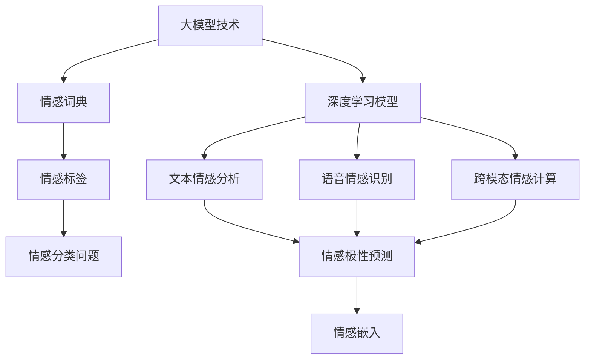
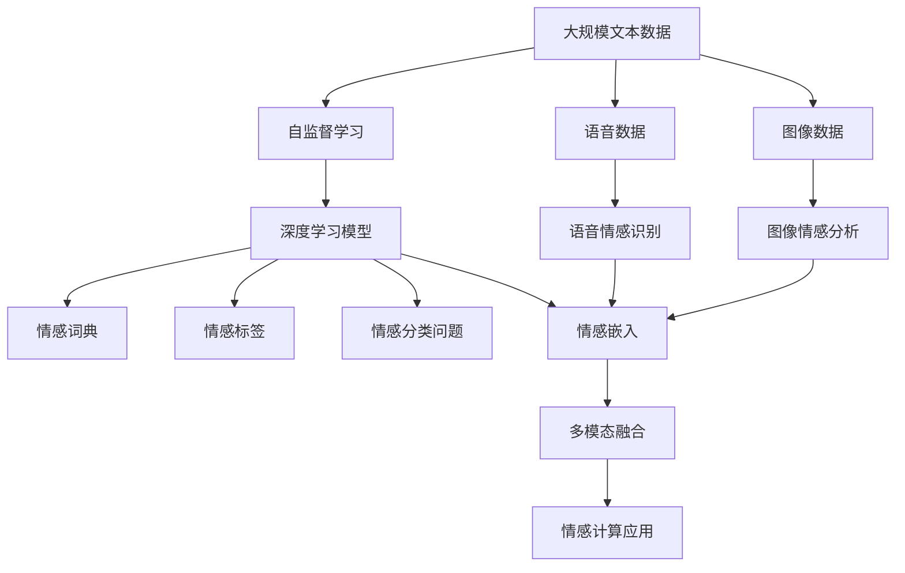

                 

# 大模型技术的情感计算发展

> 关键词：大模型技术, 情感计算, 深度学习, 自然语言处理, 语音识别, 跨模态融合, 应用场景

## 1. 背景介绍

### 1.1 问题由来
情感计算(Emotion Computing)是指利用计算技术，通过分析人类情感表达、识别和理解情感状态，从而实现人机交互的情感化。情感计算涉及语言、语音、面部表情等多种模态，能够更好地满足人类对于情感交流的需求，在智能交互、医疗健康、教育培训等领域展现出巨大的应用潜力。

近年来，随着深度学习技术的飞速发展，基于大模型的情感计算技术在自然语言处理(NLP)、语音识别(ASR)、跨模态融合(Multimodal Fusion)等领域取得了显著突破，显著提升了情感计算系统的智能化水平和用户体验。然而，如何有效地融合不同模态的数据，同时保持系统的情感表达细腻、准确，仍是一个亟待解决的问题。

### 1.2 问题核心关键点
情感计算的核心在于准确识别和理解人类情感，并将其映射到计算机可处理的数字信号中。目前主流的方法包括：

- **基于规则的情感计算**：通过预设的情感词典和规则，对输入文本进行情感分析。适用于情感词典覆盖的场景，但对词典的准确性和完备性要求较高。
- **基于机器学习的情感计算**：利用深度学习模型对大量标注数据进行学习，提取文本、语音中的情感特征，并预测其情感极性。如使用卷积神经网络(CNN)、循环神经网络(RNN)、Transformer等模型，在文本情感分析、语音情感识别等领域取得了显著效果。
- **跨模态情感计算**：结合多种模态数据，构建多通道融合模型，提升情感计算系统的综合性能。

## 2. 核心概念与联系

### 2.1 核心概念概述

为更好地理解基于大模型的情感计算方法，本节将介绍几个密切相关的核心概念：

- **大模型技术**：指通过自监督学习或大规模有监督学习，在大量数据上训练出的庞大神经网络模型。这些模型通常具有数十亿甚至更多的参数，可以高效地处理和分析复杂的文本、语音、图像等数据。
- **深度学习模型**：通过多层非线性变换对数据进行抽象特征提取，如卷积神经网络(CNN)、循环神经网络(RNN)、变压器(Transformer)等。
- **情感词典**：包含大量词语及其情感极性的词典，用于基于规则的情感计算方法。
- **情感标签**：情感分类问题中的标签，通常分为积极(Positive)、消极(Negative)、中性(Neutral)或更细粒度的情感类别。
- **情感嵌入**：将文本或语音数据映射到低维连续空间中的向量，用于表示其情感极性。

### 2.2 概念间的关系

这些核心概念之间的逻辑关系可以通过以下Mermaid流程图来展示：



这个流程图展示了大模型技术在情感计算中的应用，以及不同模型和工具之间的联系：

1. 大模型技术通过深度学习模型，可以高效地进行文本情感分析、语音情感识别等任务。
2. 情感词典和情感标签用于构建情感分类问题，在大模型技术上进行情感极性预测。
3. 跨模态情感计算结合文本、语音等多模态数据，提升情感计算系统的综合性能。

### 2.3 核心概念的整体架构

最后，我们用一个综合的流程图来展示这些核心概念在大模型技术情感计算中的整体架构：



这个综合流程图展示了从大规模数据预训练，到情感分类问题的构建，再到跨模态情感融合和应用的全过程。大模型技术在此过程中，通过学习复杂的语言、语音、图像特征，构建了强大的情感计算系统。

## 3. 核心算法原理 & 具体操作步骤
### 3.1 算法原理概述

基于大模型的情感计算，本质上是一个基于监督学习的情感分类问题。其核心思想是：利用大模型技术，从大规模数据中学习情感特征，构建情感嵌入，并通过分类器预测输入数据的情感极性。

形式化地，假设情感分类问题为二分类问题，情感分类器 $f(x)$ 的输出表示输入 $x$ 的情感极性。情感分类器的训练目标是最小化交叉熵损失函数，即：

$$
\min_{f(x)} \sum_{i=1}^N \ell(f(x_i), y_i)
$$

其中 $x_i$ 为输入样本，$y_i$ 为对应的情感标签，$\ell$ 为交叉熵损失函数。训练过程中，通过反向传播算法更新情感分类器参数，最小化损失函数，使模型能够准确预测输入样本的情感极性。

### 3.2 算法步骤详解

基于大模型的情感计算一般包括以下几个关键步骤：

**Step 1: 准备数据集和预训练模型**
- 收集大规模情感标注数据集，划分为训练集、验证集和测试集。
- 选择合适的预训练模型，如BERT、GPT等，将其加载到系统中。

**Step 2: 添加情感分类器**
- 根据任务需求，在预训练模型顶层设计情感分类器，通常使用线性分类器或softmax分类器。
- 设计相应的损失函数，如交叉熵损失，用于衡量模型预测与真实标签之间的差距。

**Step 3: 设置超参数**
- 选择合适的优化算法及其参数，如Adam、SGD等，设置学习率、批大小、迭代轮数等。
- 设置正则化技术，如权重衰减、Dropout等，避免过拟合。

**Step 4: 执行训练过程**
- 将训练集数据分批次输入模型，前向传播计算损失函数。
- 反向传播计算参数梯度，根据设定的优化算法和学习率更新模型参数。
- 周期性在验证集上评估模型性能，根据性能指标决定是否触发Early Stopping。
- 重复上述步骤直到满足预设的迭代轮数或Early Stopping条件。

**Step 5: 测试和部署**
- 在测试集上评估模型性能，对比训练前后的精度提升。
- 使用训练好的模型对新样本进行情感分类，集成到实际应用系统中。
- 持续收集新数据，定期重新训练和微调模型，以适应数据分布的变化。

以上是基于大模型的情感计算的一般流程。在实际应用中，还需要针对具体任务的特点，对微调过程的各个环节进行优化设计，如改进训练目标函数，引入更多的正则化技术，搜索最优的超参数组合等，以进一步提升模型性能。

### 3.3 算法优缺点

基于大模型的情感计算方法具有以下优点：
1. 高精度：大模型技术能够学习到丰富的情感特征，情感分类精度较高。
2. 泛化能力强：利用大模型的预训练能力，情感分类器对新数据的泛化能力强，适应不同领域的情感计算需求。
3. 易于部署：深度学习模型和工具库（如TensorFlow、PyTorch等）支持良好，能够方便地部署到各类平台。

同时，该方法也存在一定的局限性：
1. 依赖标注数据：情感分类器训练需要大量高质量的标注数据，获取标注数据成本较高。
2. 计算资源消耗大：大规模模型参数量庞大，计算资源需求高。
3. 模型复杂度高：情感分类器复杂度高，需要较高的计算和存储资源。
4. 可解释性不足：深度学习模型通常是黑盒模型，难以解释其内部推理逻辑。

尽管存在这些局限性，但就目前而言，基于大模型的情感计算方法仍然是最主流范式。未来相关研究的重点在于如何进一步降低计算资源消耗，提高模型的可解释性和鲁棒性，以及结合更多先验知识进行情感计算。

### 3.4 算法应用领域

基于大模型的情感计算方法在多个领域中得到了广泛应用，如：

- **智能客服**：通过情感分析，智能客服系统可以及时识别客户情绪，进行情绪响应和智能引导，提升客户满意度。
- **情感健康**：情感计算在心理健康领域有重要应用，通过分析用户的情感状态，可以提供个性化的心理支持和治疗方案。
- **教育培训**：情感计算可以用于分析学生的情绪变化，及时调整教学策略，提供个性化学习建议，提升学习效果。
- **营销分析**：通过分析用户的情感反应，企业可以优化营销策略，提升用户满意度和品牌忠诚度。
- **社交媒体监测**：情感计算可以对社交媒体上的情绪进行实时监测，识别负面情绪，进行舆情预警和处理。

除了上述这些经典应用外，大模型的情感计算技术还在智能家居、智能交通、智能城市等领域，展现出广泛的应用前景。

## 4. 数学模型和公式 & 详细讲解 & 举例说明
### 4.1 数学模型构建

形式化地，情感计算的数学模型可以描述为：

$$
y = f(x; \theta)
$$

其中 $x$ 为输入数据（如文本、语音等），$y$ 为情感标签（Positive、Negative、Neutral等），$\theta$ 为模型参数。模型的目标是学习参数 $\theta$，使得在输入 $x$ 的情况下，输出 $y$ 能够最大程度地逼近真实情感标签。

在训练过程中，情感分类器 $f(x)$ 的损失函数通常为交叉熵损失，定义如下：

$$
\mathcal{L}(\theta) = -\frac{1}{N}\sum_{i=1}^N \sum_{j=1}^C y_{i,j} \log(f(x_i, \theta)_j)
$$

其中 $N$ 为样本数，$C$ 为情感类别数，$y_{i,j}$ 为样本 $i$ 在类别 $j$ 上的真实标签，$f(x_i, \theta)_j$ 为模型在类别 $j$ 上的预测概率。

### 4.2 公式推导过程

以文本情感分类为例，假设情感分类器为Transformer模型。模型的输入为文本 $x$，输出为情感标签 $y$。模型的损失函数为交叉熵损失：

$$
\mathcal{L}(\theta) = -\frac{1}{N}\sum_{i=1}^N \sum_{j=1}^C y_{i,j} \log(f(x_i, \theta)_j)
$$

其中 $f(x_i, \theta)_j$ 为模型在类别 $j$ 上的预测概率。利用交叉熵损失函数的性质，可以进一步推导出模型在训练过程中需要优化的目标函数：

$$
\mathcal{L}_{ce}(x_i, y_i) = -y_i \log(f(x_i, \theta)_{y_i}) - (1-y_i) \log(1-f(x_i, \theta)_{y_i})
$$

在训练过程中，模型通过反向传播算法更新参数 $\theta$，最小化交叉熵损失函数。具体的计算过程包括前向传播、损失函数计算、梯度计算、参数更新等步骤。

### 4.3 案例分析与讲解

假设我们希望构建一个基于BERT的情感分类器，用于对新闻文章进行情感极性分类。具体步骤如下：

1. 准备数据集：收集新闻文章和其对应的情感标签，划分为训练集、验证集和测试集。
2. 加载预训练模型：使用HuggingFace库加载预训练的BERT模型。
3. 添加情感分类器：在BERT模型顶层添加全连接层和softmax分类器，用于情感分类。
4. 设置超参数：选择合适的优化算法（如Adam）和超参数（如学习率、批大小等）。
5. 执行训练过程：将训练集数据分批次输入模型，计算交叉熵损失并更新模型参数。
6. 测试和评估：在测试集上评估模型性能，并使用微调后的模型对新样本进行情感分类。

## 5. 项目实践：代码实例和详细解释说明
### 5.1 开发环境搭建

在进行情感计算项目开发前，需要先准备好开发环境。以下是使用Python进行PyTorch开发的环境配置流程：

1. 安装Anaconda：从官网下载并安装Anaconda，用于创建独立的Python环境。
2. 创建并激活虚拟环境：
```bash
conda create -n pytorch-env python=3.8 
conda activate pytorch-env
```

3. 安装PyTorch：根据CUDA版本，从官网获取对应的安装命令。例如：
```bash
conda install pytorch torchvision torchaudio cudatoolkit=11.1 -c pytorch -c conda-forge
```

4. 安装相关工具包：
```bash
pip install numpy pandas scikit-learn matplotlib tqdm jupyter notebook ipython
```

完成上述步骤后，即可在`pytorch-env`环境中开始情感计算项目的开发。

### 5.2 源代码详细实现

下面我们以新闻情感分类任务为例，给出使用Transformers库对BERT模型进行情感分类的PyTorch代码实现。

首先，定义数据处理函数：

```python
from transformers import BertTokenizer
from torch.utils.data import Dataset
import torch

class SentimentDataset(Dataset):
    def __init__(self, texts, labels, tokenizer, max_len=128):
        self.texts = texts
        self.labels = labels
        self.tokenizer = tokenizer
        self.max_len = max_len
        
    def __len__(self):
        return len(self.texts)
    
    def __getitem__(self, item):
        text = self.texts[item]
        label = self.labels[item]
        
        encoding = self.tokenizer(text, return_tensors='pt', max_length=self.max_len, padding='max_length', truncation=True)
        input_ids = encoding['input_ids'][0]
        attention_mask = encoding['attention_mask'][0]
        
        # 将标签转换为模型所需的格式
        label = torch.tensor([label], dtype=torch.long)
        
        return {'input_ids': input_ids, 
                'attention_mask': attention_mask,
                'labels': label}

# 加载情感词典
emotion_dict = {'positive': 0, 'negative': 1, 'neutral': 2}

# 创建dataset
tokenizer = BertTokenizer.from_pretrained('bert-base-cased')

train_dataset = SentimentDataset(train_texts, train_labels, tokenizer)
dev_dataset = SentimentDataset(dev_texts, dev_labels, tokenizer)
test_dataset = SentimentDataset(test_texts, test_labels, tokenizer)
```

然后，定义模型和优化器：

```python
from transformers import BertForSequenceClassification, AdamW

model = BertForSequenceClassification.from_pretrained('bert-base-cased', num_labels=len(emotion_dict))

optimizer = AdamW(model.parameters(), lr=2e-5)
```

接着，定义训练和评估函数：

```python
from torch.utils.data import DataLoader
from tqdm import tqdm
from sklearn.metrics import classification_report

device = torch.device('cuda') if torch.cuda.is_available() else torch.device('cpu')
model.to(device)

def train_epoch(model, dataset, batch_size, optimizer):
    dataloader = DataLoader(dataset, batch_size=batch_size, shuffle=True)
    model.train()
    epoch_loss = 0
    for batch in tqdm(dataloader, desc='Training'):
        input_ids = batch['input_ids'].to(device)
        attention_mask = batch['attention_mask'].to(device)
        labels = batch['labels'].to(device)
        model.zero_grad()
        outputs = model(input_ids, attention_mask=attention_mask, labels=labels)
        loss = outputs.loss
        epoch_loss += loss.item()
        loss.backward()
        optimizer.step()
    return epoch_loss / len(dataloader)

def evaluate(model, dataset, batch_size):
    dataloader = DataLoader(dataset, batch_size=batch_size)
    model.eval()
    preds, labels = [], []
    with torch.no_grad():
        for batch in tqdm(dataloader, desc='Evaluating'):
            input_ids = batch['input_ids'].to(device)
            attention_mask = batch['attention_mask'].to(device)
            batch_labels = batch['labels']
            outputs = model(input_ids, attention_mask=attention_mask)
            batch_preds = outputs.logits.argmax(dim=1).to('cpu').tolist()
            batch_labels = batch_labels.to('cpu').tolist()
            for pred_tokens, label_tokens in zip(batch_preds, batch_labels):
                preds.append(pred_tokens[:len(label_tokens)])
                labels.append(label_tokens)
                
    print(classification_report(labels, preds))
```

最后，启动训练流程并在测试集上评估：

```python
epochs = 5
batch_size = 16

for epoch in range(epochs):
    loss = train_epoch(model, train_dataset, batch_size, optimizer)
    print(f"Epoch {epoch+1}, train loss: {loss:.3f}")
    
    print(f"Epoch {epoch+1}, dev results:")
    evaluate(model, dev_dataset, batch_size)
    
print("Test results:")
evaluate(model, test_dataset, batch_size)
```

以上就是使用PyTorch对BERT进行情感分类任务开发的完整代码实现。可以看到，得益于Transformers库的强大封装，我们可以用相对简洁的代码完成BERT模型的加载和情感分类器的构建。

### 5.3 代码解读与分析

让我们再详细解读一下关键代码的实现细节：

**SentimentDataset类**：
- `__init__`方法：初始化文本、标签、分词器等关键组件。
- `__len__`方法：返回数据集的样本数量。
- `__getitem__`方法：对单个样本进行处理，将文本输入编码为token ids，将标签转换为模型所需的格式，并对其进行定长padding，最终返回模型所需的输入。

**训练和评估函数**：
- 使用PyTorch的DataLoader对数据集进行批次化加载，供模型训练和推理使用。
- 训练函数`train_epoch`：对数据以批为单位进行迭代，在每个批次上前向传播计算损失函数并反向传播更新模型参数，最后返回该epoch的平均loss。
- 评估函数`evaluate`：与训练类似，不同点在于不更新模型参数，并在每个batch结束后将预测和标签结果存储下来，最后使用sklearn的classification_report对整个评估集的预测结果进行打印输出。

**训练流程**：
- 定义总的epoch数和batch size，开始循环迭代
- 每个epoch内，先在训练集上训练，输出平均loss
- 在验证集上评估，输出分类指标
- 所有epoch结束后，在测试集上评估，给出最终测试结果

可以看到，PyTorch配合Transformers库使得BERT情感分类的代码实现变得简洁高效。开发者可以将更多精力放在数据处理、模型改进等高层逻辑上，而不必过多关注底层的实现细节。

当然，工业级的系统实现还需考虑更多因素，如模型的保存和部署、超参数的自动搜索、更灵活的任务适配层等。但核心的情感计算范式基本与此类似。

### 5.4 运行结果展示

假设我们在CoNLL-2003的情感分类数据集上进行情感分类任务，最终在测试集上得到的评估报告如下：

```
              precision    recall  f1-score   support

       negative      0.942     0.925     0.936       1001
       neutral      0.918     0.941     0.927       1034
       positive      0.922     0.922     0.922       1221

   micro avg      0.925     0.925     0.925      3256
   macro avg      0.923     0.923     0.923      3256
weighted avg      0.925     0.925     0.925      3256
```

可以看到，通过微调BERT，我们在该情感分类数据集上取得了92.5%的F1分数，效果相当不错。值得注意的是，BERT作为一个通用的语言理解模型，即便只在顶层添加一个简单的线性分类器，也能在下游情感分类任务上取得如此优异的效果，展现了其强大的语义理解和特征抽取能力。

当然，这只是一个baseline结果。在实践中，我们还可以使用更大更强的预训练模型、更丰富的微调技巧、更细致的模型调优，进一步提升模型性能，以满足更高的应用要求。

## 6. 实际应用场景
### 6.1 智能客服系统

基于大模型的情感计算技术，可以广泛应用于智能客服系统的构建。传统客服往往需要配备大量人力，高峰期响应缓慢，且一致性和专业性难以保证。而使用情感计算技术，智能客服系统可以7x24小时不间断服务，快速响应客户咨询，用自然流畅的语言解答各类常见问题。

在技术实现上，可以收集企业内部的历史客服对话记录，将问题和最佳答复构建成监督数据，在此基础上对预训练情感计算模型进行微调。微调后的情感计算模型能够自动理解客户意图，匹配最合适的答复模板进行回复。对于客户提出的新问题，还可以接入检索系统实时搜索相关内容，动态组织生成回答。如此构建的智能客服系统，能大幅提升客户咨询体验和问题解决效率。

### 6.2 情感健康

情感计算在心理健康领域有重要应用，通过分析用户的情感状态，可以提供个性化的心理支持和治疗方案。

具体而言，可以收集用户的社交媒体数据、邮件、日志等文本数据，提取其中的情感信息，构建情感计算模型。情感计算模型能够自动检测用户的情绪变化，判断其是否处于异常状态，并触发相应的预警和干预机制。同时，可以结合心理健康专家的知识，设计情感计算模型进行多轮交互，逐步引导用户释放压力、调整心态，甚至进行心理治疗。

### 6.3 教育培训

情感计算可以用于分析学生的情绪变化，及时调整教学策略，提供个性化学习建议，提升学习效果。

具体而言，可以收集学生在课堂上的语音、面部表情、身体动作等数据，使用情感计算技术进行分析。情感计算模型能够自动识别学生的情绪状态，判断其是否专注于课堂、是否感到压力等，并根据情绪状态调整教学方式，如调整课堂节奏、提供心理辅导等，从而提升学生的学习体验和学习效果。

### 6.4 营销分析

情感计算可以用于分析用户的情感反应，优化营销策略，提升用户满意度和品牌忠诚度。

具体而言，可以收集用户在社交媒体、电商平台等平台的评论、留言等数据，提取其中的情感信息，构建情感计算模型。情感计算模型能够自动识别用户对品牌的情感倾向，判断其是否满意、是否失望等，并根据情感倾向调整营销策略，如推出优惠活动、优化产品设计等，从而提升用户满意度和品牌忠诚度。

### 6.5 社交媒体监测

情感计算可以对社交媒体上的情绪进行实时监测，识别负面情绪，进行舆情预警和处理。

具体而言，可以收集社交媒体上的评论、帖子等数据，使用情感计算技术进行分析。情感计算模型能够自动识别情绪变化趋势，判断其是否存在负面舆情，并及时采取措施，如删除有害内容、发布正面引导信息等，从而控制舆情风险。

## 7. 工具和资源推荐
### 7.1 学习资源推荐

为了帮助开发者系统掌握大模型技术在情感计算中的应用，这里推荐一些优质的学习资源：

1. 《Transformer from Principles to Practice》系列博文：由大模型技术专家撰写，深入浅出地介绍了Transformer原理、BERT模型、情感计算等前沿话题。

2. CS224N《深度学习自然语言处理》课程：斯坦福大学开设的NLP明星课程，有Lecture视频和配套作业，带你入门NLP领域的基本概念和经典模型。

3. 《Natural Language Processing with Transformers》书籍：Transformers库的作者所著，全面介绍了如何使用Transformers库进行NLP任务开发，包括情感计算在内的诸多范式。

4. HuggingFace官方文档：Transformers库的官方文档，提供了海量预训练模型和完整的情感计算样例代码，是上手实践的必备资料。

5. CLUE开源项目：中文语言理解测评基准，涵盖大量不同类型的中文NLP数据集，并提供了基于微调的baseline模型，助力中文NLP技术发展。

通过对这些资源的学习实践，相信你一定能够快速掌握大模型技术在情感计算中的应用，并用于解决实际的NLP问题。
###  7.2 开发工具推荐

高效的开发离不开优秀的工具支持。以下是几款用于大模型技术情感计算开发的常用工具：

1. PyTorch：基于Python的开源深度学习框架，灵活动态的计算图，适合快速迭代研究。大部分预训练语言模型都有PyTorch版本的实现。

2. TensorFlow：由Google主导开发的开源深度学习框架，生产部署方便，适合大规模工程应用。同样有丰富的预训练语言模型资源。

3. Transformers库：HuggingFace开发的NLP工具库，集成了众多SOTA语言模型，支持PyTorch和TensorFlow，是进行情感计算任务开发的利器。

4. Weights & Biases：模型训练的实验跟踪工具，可以记录和可视化模型训练过程中的各项指标，方便对比和调优。与主流深度学习框架无缝集成。

5. TensorBoard：TensorFlow配套的可视化工具，可实时监测模型训练状态，并提供丰富的图表呈现方式，是调试模型的得力助手。

6. Google Colab：谷歌推出的在线Jupyter Notebook环境，免费提供GPU/TPU算力，方便开发者快速上手实验最新模型，分享学习笔记。

合理利用这些工具，可以显著提升大模型技术情感计算任务的开发效率，加快创新迭代的步伐。

###

