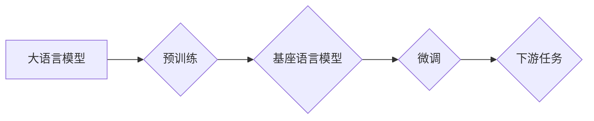

## 大语言模型原理与工程实践：基座语言模型的评测

> 关键词：大语言模型、基座模型、评测指标、Transformer、预训练、微调、应用场景

### 1. 背景介绍

近年来，深度学习技术取得了飞速发展，特别是Transformer模型的出现，为自然语言处理（NLP）领域带来了革命性的变革。大语言模型（LLM）作为Transformer模型的升级版，拥有数十亿甚至千亿参数，能够理解和生成人类语言，展现出强大的文本生成、翻译、问答、摘要等能力。

基座语言模型（Foundation Language Model，FLM）作为LLM的一种重要类型，其特点是预训练规模大、能力强，能够在各种下游任务中进行微调，从而实现高效的应用。然而，由于LLM的复杂性和多样性，如何有效地评测其性能和能力成为了一个重要的研究课题。

### 2. 核心概念与联系

#### 2.1  大语言模型（LLM）

大语言模型是指参数规模庞大、训练数据海量的人工智能模型，能够理解和生成人类语言。其核心特点包括：

* **规模庞大:** 参数数量通常在数十亿甚至千亿级别。
* **数据丰富:** 训练数据包含大量的文本信息，涵盖多种领域和风格。
* **多任务学习:** 能够在文本生成、翻译、问答、摘要等多种任务中表现出色。

#### 2.2 基座语言模型（FLM）

基座语言模型是指预训练规模大、能力强、能够在各种下游任务中进行微调的LLM。其特点是：

* **通用性强:** 能够适应多种下游任务，无需从头训练。
* **效率高:** 通过微调的方式，可以快速适应特定任务。
* **可扩展性强:** 可以根据需要进行参数调整和模型升级。

#### 2.3  评测指标

评测指标是用来评估LLM性能的重要工具，常用的指标包括：

* **困惑度（Perplexity）:** 衡量模型预测下一个词的准确性。
* **BLEU分数:** 衡量机器翻译模型的质量。
* **ROUGE分数:** 衡量文本摘要模型的质量。
* **准确率（Accuracy）:** 衡量分类任务模型的准确性。
* **F1-score:** 衡量分类任务模型的精确率和召回率的平衡。

**Mermaid 流程图**



### 3. 核心算法原理 & 具体操作步骤

#### 3.1  算法原理概述

大语言模型的核心算法是Transformer模型，其特点是利用注意力机制，能够捕捉文本序列中长距离依赖关系。Transformer模型由编码器和解码器组成，编码器用于将输入文本序列编码成向量表示，解码器则根据编码后的向量表示生成输出文本序列。

#### 3.2  算法步骤详解

1. **输入处理:** 将输入文本序列分割成单词或子词，并将其转换为数字表示。
2. **编码:** 将数字表示的单词或子词输入到编码器中，编码器通过多层Transformer模块进行处理，最终将输入文本序列编码成一个向量表示。
3. **解码:** 将编码后的向量表示输入到解码器中，解码器通过多层Transformer模块进行处理，并根据每个时间步的向量表示生成一个单词或子词。
4. **输出生成:** 将生成的单词或子词拼接起来，形成输出文本序列。

#### 3.3  算法优缺点

**优点:**

* 能够捕捉长距离依赖关系，提高文本理解能力。
* 并行计算能力强，训练速度快。
* 可迁移性强，能够应用于多种下游任务。

**缺点:**

* 参数量大，训练成本高。
* 训练数据对模型性能影响较大。
* 容易出现过拟合问题。

#### 3.4  算法应用领域

Transformer模型和基于其构建的大语言模型在以下领域具有广泛的应用：

* **自然语言理解:** 文本分类、情感分析、问答系统、文本摘要等。
* **自然语言生成:** 机器翻译、文本生成、对话系统等。
* **代码生成:** 代码补全、代码翻译、代码生成等。
* **多模态理解:** 图像字幕、视频理解等。

### 4. 数学模型和公式 & 详细讲解 & 举例说明

#### 4.1  数学模型构建

Transformer模型的核心是注意力机制，其数学模型可以表示为：

$$
Attention(Q, K, V) = softmax(\frac{QK^T}{\sqrt{d_k}})V
$$

其中：

* $Q$：查询矩阵
* $K$：键矩阵
* $V$：值矩阵
* $d_k$：键向量的维度
* $softmax$：softmax函数

#### 4.2  公式推导过程

注意力机制的目的是计算每个词与其他词之间的相关性，并根据相关性权重来生成一个新的词向量表示。

1. 计算查询矩阵 $Q$ 与键矩阵 $K$ 的点积，并进行归一化处理。
2. 应用softmax函数将点积结果转换为概率分布。
3. 将概率分布与值矩阵 $V$ 进行加权求和，得到新的词向量表示。

#### 4.3  案例分析与讲解

例如，在机器翻译任务中，输入句子为“The cat sat on the mat”，则查询矩阵 $Q$ 包含每个单词的词向量表示，键矩阵 $K$ 包含目标语言单词的词向量表示。通过计算注意力机制，可以得到每个单词与目标语言单词的相关性权重，并根据权重生成新的词向量表示，最终实现句子翻译。

### 5. 项目实践：代码实例和详细解释说明

#### 5.1  开发环境搭建

* Python 3.7+
* PyTorch 1.7+
* CUDA 10.2+

#### 5.2  源代码详细实现

```python
import torch
import torch.nn as nn

class Transformer(nn.Module):
    def __init__(self, vocab_size, embedding_dim, num_heads, num_layers):
        super(Transformer, self).__init__()
        self.embedding = nn.Embedding(vocab_size, embedding_dim)
        self.transformer_layers = nn.ModuleList([
            nn.TransformerEncoderLayer(embedding_dim, num_heads)
            for _ in range(num_layers)
        ])
        self.linear = nn.Linear(embedding_dim, vocab_size)

    def forward(self, x):
        x = self.embedding(x)
        for layer in self.transformer_layers:
            x = layer(x)
        x = self.linear(x)
        return x
```

#### 5.3  代码解读与分析

* `__init__` 方法初始化模型参数，包括词嵌入层、Transformer编码器层和输出层。
* `forward` 方法定义模型的正向传播过程，将输入序列编码成输出序列。

#### 5.4  运行结果展示

通过训练和测试，可以评估模型的性能，例如困惑度、BLEU分数等。

### 6. 实际应用场景

#### 6.1  文本生成

* **小说、诗歌创作:** 基座语言模型可以根据给定的主题或关键词生成创意文本。
* **广告文案撰写:** 基座语言模型可以根据产品信息生成吸引人的广告文案。
* **聊天机器人:** 基座语言模型可以与用户进行自然流畅的对话。

#### 6.2  机器翻译

* **跨语言沟通:** 基座语言模型可以实现不同语言之间的文本翻译，促进跨文化交流。
* **文档翻译:** 基座语言模型可以将大量文档快速翻译成目标语言。

#### 6.3  问答系统

* **搜索引擎:** 基座语言模型可以理解用户查询意图，并返回相关信息。
* **智能客服:** 基座语言模型可以回答用户常见问题，提高客服效率。

#### 6.4  未来应用展望

随着大语言模型技术的不断发展，其应用场景将更加广泛，例如：

* **个性化教育:** 基座语言模型可以根据学生的学习情况提供个性化的学习内容和辅导。
* **医疗诊断:** 基座语言模型可以辅助医生进行疾病诊断和治疗方案制定。
* **法律服务:** 基座语言模型可以帮助律师进行法律研究和案件分析。

### 7. 工具和资源推荐

#### 7.1  学习资源推荐

* **书籍:**
    * 《深度学习》
    * 《自然语言处理》
    * 《Transformer模型详解》
* **在线课程:**
    * Coursera: 自然语言处理
    * Udacity: 深度学习
    * fast.ai: 深度学习课程

#### 7.2  开发工具推荐

* **PyTorch:** 深度学习框架
* **TensorFlow:** 深度学习框架
* **HuggingFace Transformers:** 预训练模型库

#### 7.3  相关论文推荐

* 《Attention Is All You Need》
* 《BERT: Pre-training of Deep Bidirectional Transformers for Language Understanding》
* 《GPT-3: Language Models are Few-Shot Learners》

### 8. 总结：未来发展趋势与挑战

#### 8.1  研究成果总结

近年来，大语言模型取得了显著的进展，在文本生成、机器翻译、问答系统等领域展现出强大的能力。

#### 8.2  未来发展趋势

* **模型规模更大:** 参数规模将继续扩大，模型能力将进一步提升。
* **多模态理解:** 大语言模型将与其他模态数据（如图像、音频）融合，实现更全面的理解。
* **可解释性增强:** 研究如何提高大语言模型的透明度和可解释性。

#### 8.3  面临的挑战

* **训练成本高:** 大规模模型的训练需要大量的计算资源和时间。
* **数据偏见:** 模型训练数据可能存在偏见，导致模型输出结果不准确或不公平。
* **安全风险:** 大语言模型可能被用于生成虚假信息或进行恶意攻击。

#### 8.4  研究展望

未来研究将重点关注以下方面：

* **高效训练方法:** 研究更有效的训练方法，降低模型训练成本。
* **数据去偏见:** 开发方法去除了训练数据中的偏见，提高模型公平性。
* **安全性和伦理:** 研究大语言模型的安全性和伦理问题，确保其安全可靠地应用于社会。

### 9. 附录：常见问题与解答

* **Q1: 大语言模型的训练数据来源是什么？**

A1: 大语言模型的训练数据通常来自公开的文本数据集，例如书籍、文章、网站等。

* **Q2: 如何评估大语言模型的性能？**

A2: 常用的评估指标包括困惑度、BLEU分数、ROUGE分数等。

* **Q3: 大语言模型的应用场景有哪些？**

A3: 大语言模型的应用场景非常广泛，包括文本生成、机器翻译、问答系统、代码生成等。


作者：禅与计算机程序设计艺术 / Zen and the Art of Computer Programming 
