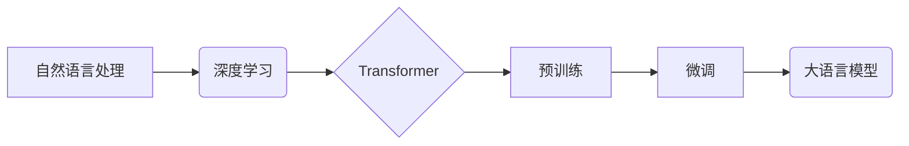

## 大语言模型原理与工程实践：大语言模型训练综述

> 关键词：大语言模型、Transformer、深度学习、自然语言处理、预训练、微调、文本生成、机器翻译

## 1. 背景介绍

近年来，深度学习技术取得了飞速发展，特别是Transformer模型的出现，彻底改变了自然语言处理（NLP）领域的面貌。大语言模型（LLM）作为深度学习在NLP领域的顶尖成果，展现出强大的文本理解和生成能力，在机器翻译、文本摘要、对话系统、代码生成等领域取得了突破性进展。

LLM的训练过程是一个复杂而耗时的工程，需要海量文本数据、强大的计算资源和精心设计的训练策略。本文将深入探讨LLM的原理、训练方法、数学模型以及工程实践，帮助读者理解LLM的内在机制，并掌握其训练和应用的技巧。

## 2. 核心概念与联系

**2.1 核心概念**

* **自然语言处理（NLP）：** 计算机处理和理解人类语言的技术领域。
* **深度学习（Deep Learning）：** 一种机器学习方法，利用多层神经网络模拟人类大脑的学习过程。
* **Transformer：** 一种新型的深度学习架构，能够有效处理序列数据，是LLM训练的基础。
* **预训练（Pre-training）：** 在大量文本数据上进行无监督学习，训练出一个通用的语言表示模型。
* **微调（Fine-tuning）：** 将预训练模型应用于特定任务，通过少量标记数据进行调整。
* **大语言模型（LLM）：** 参数量巨大、训练数据海量、具备强大文本理解和生成能力的深度学习模型。

**2.2 架构关系**



## 3. 核心算法原理 & 具体操作步骤

**3.1 算法原理概述**

LLM的核心算法是Transformer模型，它基于注意力机制，能够捕捉文本序列中长距离依赖关系。Transformer模型由编码器和解码器两部分组成，编码器将输入文本序列映射到一个隐藏表示，解码器根据隐藏表示生成输出文本序列。

**3.2 算法步骤详解**

1. **输入嵌入：** 将输入文本序列中的每个单词映射到一个低维向量表示。
2. **编码器：** 将嵌入向量通过多层Transformer编码器进行处理，每个编码器层包含多头注意力机制和前馈神经网络。
3. **解码器：** 将编码器输出的隐藏表示作为输入，通过多层Transformer解码器生成输出文本序列。
4. **输出解码：** 将解码器输出的隐藏表示映射到词汇表，预测每个单词的概率分布。

**3.3 算法优缺点**

* **优点：**
    * 能够有效捕捉长距离依赖关系。
    * 并行训练效率高。
    * 在各种NLP任务上取得了优异的性能。
* **缺点：**
    * 参数量巨大，训练成本高。
    * 对训练数据质量要求高。
    * 容易出现过拟合问题。

**3.4 算法应用领域**

* 机器翻译
* 文本摘要
* 问答系统
* 对话系统
* 代码生成
* 文本分类
* 情感分析

## 4. 数学模型和公式 & 详细讲解 & 举例说明

**4.1 数学模型构建**

LLM的数学模型主要基于Transformer架构，其核心是注意力机制和多层感知机。

* **注意力机制：** 用于计算每个单词在句子中与其他单词之间的相关性，并赋予不同单词不同的权重。
* **多层感知机：** 用于对输入向量进行非线性变换，提取文本特征。

**4.2 公式推导过程**

注意力机制的计算公式如下：

$$
Attention(Q, K, V) = softmax(\frac{QK^T}{\sqrt{d_k}})V
$$

其中：

* $Q$：查询矩阵
* $K$：键矩阵
* $V$：值矩阵
* $d_k$：键向量的维度
* $softmax$：softmax函数

**4.3 案例分析与讲解**

假设我们有一个句子“我爱学习编程”，其中每个单词对应一个向量表示。

* $Q$：查询矩阵，表示当前单词与其他单词之间的相关性。
* $K$：键矩阵，表示每个单词的特征。
* $V$：值矩阵，表示每个单词的语义信息。

通过注意力机制，我们可以计算出每个单词与其他单词的相关性，并赋予不同的权重。例如，“学习”与“编程”的相关性较高，因此它们的权重会更大。

最终，注意力机制会将所有单词的语义信息融合在一起，形成一个完整的句子表示。

## 5. 项目实践：代码实例和详细解释说明

**5.1 开发环境搭建**

* Python 3.7+
* PyTorch 或 TensorFlow
* CUDA 和 cuDNN

**5.2 源代码详细实现**

```python
import torch
import torch.nn as nn

class Transformer(nn.Module):
    def __init__(self, vocab_size, embedding_dim, num_heads, num_layers):
        super(Transformer, self).__init__()
        self.embedding = nn.Embedding(vocab_size, embedding_dim)
        self.encoder = nn.TransformerEncoder(nn.TransformerEncoderLayer(embedding_dim, num_heads), num_layers)
        self.decoder = nn.TransformerDecoder(nn.TransformerDecoderLayer(embedding_dim, num_heads), num_layers)
        self.linear = nn.Linear(embedding_dim, vocab_size)

    def forward(self, src, tgt, src_mask, tgt_mask):
        src = self.embedding(src)
        tgt = self.embedding(tgt)
        encoder_output = self.encoder(src, src_mask)
        decoder_output = self.decoder(tgt, encoder_output, tgt_mask)
        output = self.linear(decoder_output)
        return output
```

**5.3 代码解读与分析**

* `__init__`方法：初始化模型参数，包括词嵌入层、编码器和解码器。
* `forward`方法：定义模型的正向传播过程，包括词嵌入、编码、解码和输出层。
* `nn.TransformerEncoder`和`nn.TransformerDecoder`：PyTorch提供的Transformer编码器和解码器模块。
* `nn.TransformerEncoderLayer`和`nn.TransformerDecoderLayer`：Transformer编码器和解码器中的基本单元，包含多头注意力机制和前馈神经网络。

**5.4 运行结果展示**

训练完成后，可以使用模型进行文本生成、机器翻译等任务。

## 6. 实际应用场景

**6.1 文本生成**

LLM可以用于生成各种类型的文本，例如故事、诗歌、文章、代码等。

**6.2 机器翻译**

LLM可以用于将文本从一种语言翻译成另一种语言。

**6.3 对话系统**

LLM可以用于构建能够与人类进行自然对话的聊天机器人。

**6.4 其他应用场景**

* 文本摘要
* 问答系统
* 情感分析
* 代码生成

**6.5 未来应用展望**

LLM的应用前景广阔，未来将应用于更多领域，例如：

* 教育：个性化学习、智能辅导
* 医疗：疾病诊断、医疗记录分析
* 法律：法律文件分析、合同审查
* 科学研究：数据分析、论文写作

## 7. 工具和资源推荐

**7.1 学习资源推荐**

* **书籍:**
    * 《深度学习》
    * 《自然语言处理》
    * 《Transformer模型详解》
* **在线课程:**
    * Coursera: 自然语言处理
    * Udacity: 深度学习
    * fast.ai: 深度学习课程

**7.2 开发工具推荐**

* **PyTorch:** 深度学习框架
* **TensorFlow:** 深度学习框架
* **Hugging Face Transformers:** 预训练Transformer模型库

**7.3 相关论文推荐**

* 《Attention Is All You Need》
* 《BERT: Pre-training of Deep Bidirectional Transformers for Language Understanding》
* 《GPT-3: Language Models are Few-Shot Learners》

## 8. 总结：未来发展趋势与挑战

**8.1 研究成果总结**

近年来，LLM取得了显著进展，在各种NLP任务上取得了突破性成果。

**8.2 未来发展趋势**

* 模型规模进一步扩大
* 训练效率提升
* 泛化能力增强
* 针对特定领域的模型开发
* 伦理和安全问题研究

**8.3 面临的挑战**

* 计算资源需求高
* 训练数据质量问题
* 偏见和歧视问题
* 缺乏可解释性
* 伦理和安全风险

**8.4 研究展望**

未来，LLM研究将继续朝着更强大、更安全、更可解释的方向发展。


## 9. 附录：常见问题与解答

**9.1 如何选择合适的LLM模型？**

选择合适的LLM模型取决于具体的应用场景和需求。

**9.2 如何训练自己的LLM模型？**

训练LLM模型需要海量文本数据、强大的计算资源和专业的技术团队。

**9.3 如何解决LLM模型的偏见和歧视问题？**

可以通过使用更公平的数据集、训练模型时加入公平性约束等方法来解决LLM模型的偏见和歧视问题。


作者：禅与计算机程序设计艺术 / Zen and the Art of Computer Programming 
