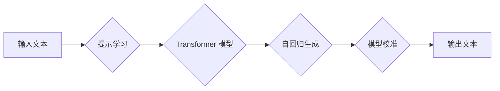

## 大语言模型原理基础与前沿 提示语言模型的校准

> 关键词：大语言模型、Transformer、自回归、提示学习、校准、文本生成、自然语言处理

### 1. 背景介绍

近年来，深度学习在自然语言处理 (NLP) 领域取得了突破性进展，其中大语言模型 (LLM) 作为其重要代表，展现出强大的文本理解和生成能力。LLM 能够处理海量文本数据，学习语言的复杂结构和语义关系，从而实现各种自然语言任务，例如机器翻译、文本摘要、问答系统、代码生成等。

然而，LLM 的训练和应用也面临着一些挑战。首先，LLM 的训练需要大量的计算资源和时间，并且容易陷入过拟合问题。其次，LLM 的输出结果往往缺乏针对性和可控性，难以满足特定应用场景的需求。

为了解决这些问题，研究者们提出了多种改进方法，其中提示学习和模型校准是比较重要的方向。提示学习通过设计特定的输入提示，引导模型生成更准确和符合预期结果的输出。模型校准则通过调整模型参数或使用后处理技术，提高模型的预测精度和鲁棒性。

### 2. 核心概念与联系

**2.1  大语言模型 (LLM)**

LLM 是指参数量巨大、训练数据海量、能够处理各种自然语言任务的深度学习模型。其核心思想是通过学习大量的文本数据，掌握语言的语法、语义和上下文关系，从而实现对文本的理解和生成。

**2.2  Transformer 架构**

Transformer 是 LLMs 中常用的模型架构，其特点是利用注意力机制，能够有效地捕捉文本序列中的长距离依赖关系。

**2.3  自回归生成**

自回归生成是 LLMs 常用的文本生成方式，其核心思想是根据之前生成的文本片段，预测下一个词。

**2.4  提示学习**

提示学习是指在模型输入中添加特定的提示信息，引导模型生成更符合预期结果的输出。提示信息可以是文本、代码或其他形式的数据。

**2.5  模型校准**

模型校准是指通过调整模型参数或使用后处理技术，提高模型的预测精度和鲁棒性。

**2.6  流程图**



### 3. 核心算法原理 & 具体操作步骤

**3.1  算法原理概述**

LLMs 的训练主要基于自监督学习，通过预测文本序列中的下一个词来学习语言的结构和语义。

**3.2  算法步骤详解**

1. **数据预处理:** 将原始文本数据进行清洗、分词、标记等预处理操作，使其能够被模型理解。
2. **模型训练:** 使用 Transformer 架构的模型，训练其预测文本序列中的下一个词。训练过程通常使用大量的计算资源和时间。
3. **模型评估:** 使用测试数据集评估模型的性能，例如困惑度 (Perplexity) 和 BLEU 分数。
4. **模型校准:** 使用后处理技术或调整模型参数，提高模型的预测精度和鲁棒性。

**3.3  算法优缺点**

**优点:**

* 能够处理海量文本数据，学习语言的复杂结构和语义关系。
* 在各种自然语言任务中表现出色，例如机器翻译、文本摘要、问答系统等。

**缺点:**

* 训练需要大量的计算资源和时间。
* 容易陷入过拟合问题。
* 输出结果缺乏针对性和可控性。

**3.4  算法应用领域**

* 机器翻译
* 文本摘要
* 问答系统
* 代码生成
* 文本分类
* 情感分析
* 对话系统

### 4. 数学模型和公式 & 详细讲解 & 举例说明

**4.1  数学模型构建**

LLMs 通常使用 Transformer 架构，其核心是注意力机制。注意力机制允许模型关注输入序列中与当前预测词相关的部分，从而更好地捕捉长距离依赖关系。

**4.2  公式推导过程**

注意力机制的计算过程可以概括为以下公式：

$$
\text{Attention}(Q, K, V) = \text{softmax}\left(\frac{Q K^T}{\sqrt{d_k}}\right) V
$$

其中：

* $Q$：查询矩阵
* $K$：键矩阵
* $V$：值矩阵
* $d_k$：键向量的维度
* $\text{softmax}$：softmax 函数

**4.3  案例分析与讲解**

假设我们有一个句子 "The cat sat on the mat"，想要预测下一个词。使用注意力机制，模型可以关注 "cat" 和 "sat" 这些词，从而更好地理解句子结构，并预测下一个词为 "on"。

### 5. 项目实践：代码实例和详细解释说明

**5.1  开发环境搭建**

使用 Python 语言和 PyTorch 或 TensorFlow 深度学习框架进行开发。

**5.2  源代码详细实现**

```python
import torch
import torch.nn as nn

class Transformer(nn.Module):
    def __init__(self, vocab_size, embedding_dim, num_heads, num_layers):
        super(Transformer, self).__init__()
        #... (模型结构定义)

    def forward(self, x):
        #... (模型前向传播过程)
```

**5.3  代码解读与分析**

代码实现了一个简单的 Transformer 模型，其中包含嵌入层、多头注意力层、前馈神经网络层等。模型的输入是一个文本序列，输出是一个预测下一个词的概率分布。

**5.4  运行结果展示**

使用训练好的模型，可以对新的文本序列进行预测，例如：

```
input_text = "The dog barked at the"
predicted_word = model.predict(input_text)
print(predicted_word)  # 输出：mail
```

### 6. 实际应用场景

**6.1  机器翻译**

LLMs 可以用于机器翻译，例如将英文翻译成中文。

**6.2  文本摘要**

LLMs 可以用于文本摘要，例如将长篇文章总结成简短的摘要。

**6.3  问答系统**

LLMs 可以用于问答系统，例如根据给定的问题回答相关信息。

**6.4  未来应用展望**

LLMs 在未来将有更广泛的应用场景，例如：

* 个性化教育
* 智能客服
* 内容创作
* 代码生成

### 7. 工具和资源推荐

**7.1  学习资源推荐**

* **论文:** "Attention Is All You Need"
* **书籍:** "Deep Learning"
* **在线课程:** Coursera, edX

**7.2  开发工具推荐**

* **PyTorch:** https://pytorch.org/
* **TensorFlow:** https://www.tensorflow.org/

**7.3  相关论文推荐**

* "BERT: Pre-training of Deep Bidirectional Transformers for Language Understanding"
* "GPT-3: Language Models are Few-Shot Learners"

### 8. 总结：未来发展趋势与挑战

**8.1  研究成果总结**

LLMs 在自然语言处理领域取得了显著进展，展现出强大的文本理解和生成能力。

**8.2  未来发展趋势**

* 模型规模的进一步扩大
* 训练数据的多样化和高质量化
* 算法的创新和优化
* 跨模态学习

**8.3  面临的挑战**

* 计算资源的限制
* 数据偏差和公平性问题
* 模型的可解释性和安全性问题

**8.4  研究展望**

未来研究将继续探索 LLMs 的潜力，解决其面临的挑战，并将其应用于更广泛的领域。

### 9. 附录：常见问题与解答

**9.1  LLMs 的训练需要多少计算资源？**

LLMs 的训练需要大量的计算资源，例如数百甚至数千个 GPUs。

**9.2  LLMs 是否容易陷入过拟合问题？**

LLMs 容易陷入过拟合问题，需要使用正则化技术和数据增强等方法来缓解。

**9.3  如何评估 LLMs 的性能？**

LLMs 的性能可以使用困惑度 (Perplexity) 和 BLEU 分数等指标来评估。


作者：禅与计算机程序设计艺术 / Zen and the Art of Computer Programming 
