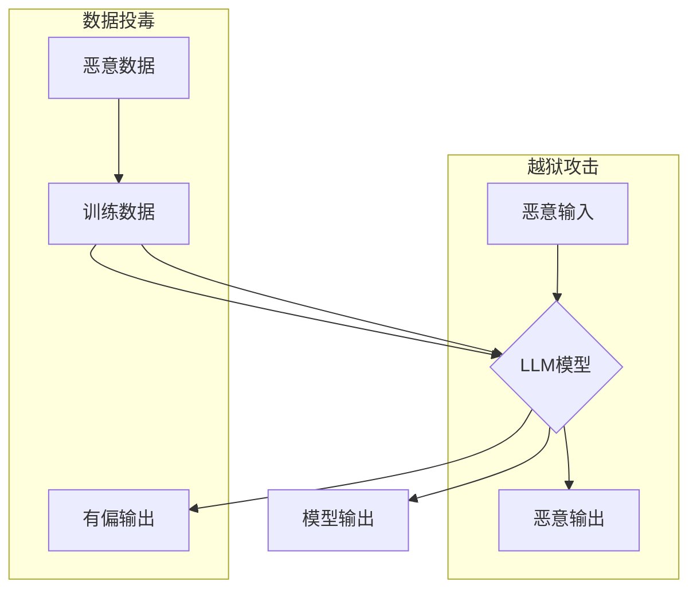

## 大语言模型应用指南：越狱攻击与数据投毒

> 关键词：大语言模型、越狱攻击、数据投毒、对抗样本、安全威胁、模型鲁棒性

### 1. 背景介绍

大语言模型（LLM）近年来取得了令人瞩目的进展，展现出强大的文本生成、理解和翻译能力。它们在自然语言处理、人工智能助手、代码生成等领域展现出巨大的应用潜力。然而，随着LLM的广泛应用，其安全性和可靠性也日益受到关注。

LLM的训练数据通常来自互联网，包含大量噪声、偏见和恶意信息。这些潜在问题可能导致模型产生不准确、有害甚至欺骗性的输出。此外，攻击者可以利用LLM的特性进行恶意攻击，例如越狱攻击和数据投毒，从而破坏模型的正常运行或操纵其输出结果。

### 2. 核心概念与联系

**2.1 越狱攻击**

越狱攻击是指攻击者试图绕过LLM的安全机制，使其执行未授权的操作或生成恶意内容。例如，攻击者可以训练特殊的输入，引导模型生成包含敏感信息或恶意代码的输出。

**2.2 数据投毒**

数据投毒是指攻击者在LLM的训练数据中注入恶意数据，从而影响模型的学习过程和最终的性能。例如，攻击者可以将包含错误信息或偏见的数据添加到训练集，导致模型生成不准确或有偏见的输出。

**2.3 模型鲁棒性**

模型鲁棒性是指模型对输入数据中的噪声、异常值和恶意攻击的抵抗能力。鲁棒的模型能够在面对这些挑战时保持其准确性和安全性。

**2.4 Mermaid 流程图**



### 3. 核心算法原理 & 具体操作步骤

**3.1 算法原理概述**

越狱攻击和数据投毒都依赖于对LLM训练机制的理解。LLM通常使用深度学习算法，例如Transformer，通过学习大量的文本数据来生成文本。攻击者可以利用这些算法的特性，设计特定的输入或数据，从而影响模型的学习过程和最终的输出。

**3.2 算法步骤详解**

**3.2.1 越狱攻击**

1. **识别模型弱点:** 分析LLM的架构和训练数据，寻找可能导致模型漏洞的点。
2. **设计恶意输入:** 根据模型的弱点，设计特定的输入，例如包含特殊字符、语法错误或触发特定逻辑的文本。
3. **测试和优化:** 对恶意输入进行测试和优化，提高其成功率。
4. **执行攻击:** 将经过优化的恶意输入输入到LLM中，观察模型的输出结果。

**3.2.2 数据投毒**

1. **选择目标模型:** 确定要攻击的目标LLM模型。
2. **收集训练数据:** 获取目标模型的训练数据，或找到公开可用的训练数据集。
3. **注入恶意数据:** 在训练数据中注入特定的恶意数据，例如包含错误信息、偏见或攻击代码的数据。
4. **重新训练模型:** 使用包含恶意数据的训练集重新训练模型。
5. **评估模型性能:** 评估重新训练后的模型性能，观察其输出结果是否受到恶意数据的影响。

**3.3 算法优缺点**

**3.3.1 越狱攻击**

* **优点:** 攻击成功后可以获得模型的控制权，执行任意操作。
* **缺点:** 攻击难度高，需要对模型有深入的了解。

**3.3.2 数据投毒**

* **优点:** 攻击难度相对较低，只需要找到模型的训练数据即可进行攻击。
* **缺点:** 攻击效果可能难以控制，可能会导致模型的性能下降。

**3.4 算法应用领域**

* **安全研究:** 研究LLM的安全性，发现潜在的漏洞和攻击方式。
* **防御机制:** 开发针对越狱攻击和数据投毒的防御机制，提高LLM的鲁棒性。
* **恶意软件检测:** 利用LLM的文本生成能力，训练模型识别恶意代码和攻击脚本。

### 4. 数学模型和公式 & 详细讲解 & 举例说明

**4.1 数学模型构建**

LLM的训练过程可以看作是一个优化问题，目标是找到一个模型参数向量，使得模型在训练数据上的损失函数最小。损失函数通常是模型预测结果与真实结果之间的差异。

**4.2 公式推导过程**

损失函数的计算公式通常是基于交叉熵或均方误差等方法。例如，对于文本分类任务，损失函数可以定义为：

$$
L = -\sum_{i=1}^{N} y_i \log(p_i)
$$

其中：

* $L$ 是损失函数
* $N$ 是样本数量
* $y_i$ 是真实标签
* $p_i$ 是模型预测的概率

**4.3 案例分析与讲解**

假设我们训练一个LLM模型进行文本分类，目标是将文本分类为“正面”或“负面”。训练数据包含一些文本和对应的标签。模型训练完成后，我们可以使用测试数据评估模型的性能。

如果模型在测试数据上的准确率很高，说明模型已经成功学习了文本分类的规律。但是，如果模型在测试数据上的准确率很低，说明模型可能存在一些问题，例如过拟合或数据偏差。

### 5. 项目实践：代码实例和详细解释说明

**5.1 开发环境搭建**

* Python 3.7+
* TensorFlow 或 PyTorch
* CUDA 和 cuDNN (可选，用于GPU加速)

**5.2 源代码详细实现**

```python
# 使用 TensorFlow 训练一个简单的文本分类模型
import tensorflow as tf

# 定义模型架构
model = tf.keras.models.Sequential([
    tf.keras.layers.Embedding(input_dim=vocab_size, output_dim=embedding_dim),
    tf.keras.layers.LSTM(units=128),
    tf.keras.layers.Dense(units=1, activation='sigmoid')
])

# 编译模型
model.compile(optimizer='adam',
              loss='binary_crossentropy',
              metrics=['accuracy'])

# 训练模型
model.fit(x_train, y_train, epochs=10)

# 评估模型
loss, accuracy = model.evaluate(x_test, y_test)
print('Loss:', loss)
print('Accuracy:', accuracy)
```

**5.3 代码解读与分析**

* 该代码使用 TensorFlow 库构建了一个简单的文本分类模型。
* 模型架构包括嵌入层、LSTM层和全连接层。
* 嵌入层将文本单词映射到低维向量空间。
* LSTM层用于捕捉文本序列中的长距离依赖关系。
* 全连接层用于将LSTM层的输出映射到分类结果。
* 模型使用 Adam 优化器、二元交叉熵损失函数和准确率作为评估指标。

**5.4 运行结果展示**

训练完成后，我们可以使用测试数据评估模型的性能。输出结果会显示模型在测试数据上的损失值和准确率。

### 6. 实际应用场景

**6.1 文本分类**

LLM可以用于各种文本分类任务，例如情感分析、垃圾邮件过滤、主题分类等。

**6.2 机器翻译**

LLM可以用于机器翻译，将一种语言的文本翻译成另一种语言。

**6.3 代码生成**

LLM可以用于代码生成，根据自然语言描述生成代码。

**6.4 聊天机器人**

LLM可以用于构建聊天机器人，与用户进行自然语言对话。

**6.5 未来应用展望**

LLM在未来将有更广泛的应用场景，例如：

* 个性化教育
* 医疗诊断
* 法律文本分析
* 创意写作

### 7. 工具和资源推荐

**7.1 学习资源推荐**

* **书籍:**
    * 《深度学习》
    * 《自然语言处理》
* **在线课程:**
    * Coursera: 自然语言处理
    * edX: 深度学习
* **博客和论坛:**
    * TensorFlow Blog
    * PyTorch Blog
    * Stack Overflow

**7.2 开发工具推荐**

* **TensorFlow:** 开源深度学习框架
* **PyTorch:** 开源深度学习框架
* **Hugging Face Transformers:** 预训练语言模型库

**7.3 相关论文推荐**

* **BERT: Pre-training of Deep Bidirectional Transformers for Language Understanding**
* **GPT-3: Language Models are Few-Shot Learners**
* **T5: Text-to-Text Transfer Transformer**

### 8. 总结：未来发展趋势与挑战

**8.1 研究成果总结**

近年来，LLM取得了显著进展，展现出强大的文本生成、理解和翻译能力。

**8.2 未来发展趋势**

* 模型规模和能力的进一步提升
* 模型训练效率的提高
* 模型鲁棒性和安全性方面的研究
* 更多领域的应用

**8.3 面临的挑战**

* 数据获取和清洗
* 计算资源需求
* 模型解释性和可解释性
* 伦理和社会影响

**8.4 研究展望**

未来，LLM的研究将继续朝着更强大、更安全、更可解释的方向发展。

### 9. 附录：常见问题与解答

* **Q: 如何防止越狱攻击？**
* **A:** 可以通过多种方法防止越狱攻击，例如：
    * 使用对抗训练技术，训练模型抵抗恶意输入。
    * 添加安全机制，限制模型的执行权限。
    * 定期更新模型，修复漏洞。

* **Q: 如何防止数据投毒？**

* **A:** 可以通过多种方法防止数据投毒，例如：
    * 使用数据清洗技术，去除恶意数据。
    * 使用数据验证机制，确保数据质量。
    * 使用联邦学习技术，分散训练数据，降低数据投毒的风险。


作者：禅与计算机程序设计艺术 / Zen and the Art of Computer Programming 
