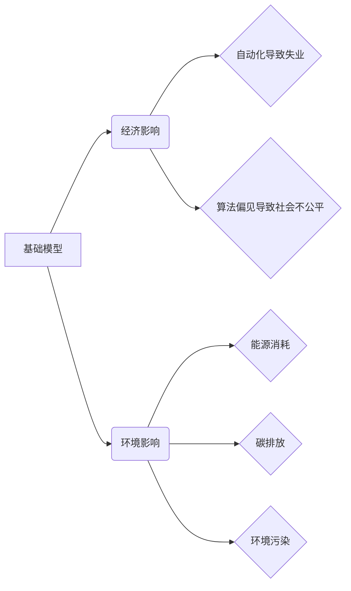

## 基础模型的经济与环境影响

> 关键词：基础模型、大模型、经济影响、环境影响、计算资源、可持续发展、伦理问题

### 1. 背景介绍

近年来，基础模型（Foundation Models）在人工智能领域取得了突破性进展，其强大的泛化能力和适应性使其应用于越来越多的领域，例如自然语言处理、计算机视觉、代码生成等。这些模型通常拥有数十亿甚至数千亿的参数，需要大量的计算资源进行训练和部署。然而，基础模型的快速发展也引发了人们对其经济和环境影响的关注。

一方面，基础模型的训练和部署需要消耗大量的能源和计算资源，这可能会加剧能源短缺和碳排放问题。另一方面，基础模型的应用也可能带来经济上的不确定性，例如自动化导致失业、算法偏见导致社会不公平等。

因此，深入研究基础模型的经济和环境影响，并探索相应的解决方案，对于推动人工智能的可持续发展至关重要。

### 2. 核心概念与联系

**2.1 基础模型概述**

基础模型是指在海量数据上预训练的大规模人工智能模型，其特点是：

* **规模庞大:** 参数数量巨大，通常在数十亿到数千亿级别。
* **泛化能力强:** 能够适应多种下游任务，无需针对特定任务进行专门训练。
* **可迁移性高:** 预训练的知识和能力可以迁移到不同的领域和任务中。

**2.2 经济与环境影响的联系**

基础模型的训练和部署与经济和环境之间存在着密切的联系：

* **经济影响:** 基础模型的训练和部署需要大量的计算资源，这会带来能源消耗和成本增加。同时，基础模型的应用也可能导致自动化导致失业、算法偏见导致社会不公平等经济问题。
* **环境影响:** 基础模型的训练和部署会消耗大量的电力，从而增加碳排放和环境污染。此外，基础模型的庞大规模也意味着需要更多的硬件设备，这会增加电子垃圾和资源消耗。

**2.3  核心概念关系图**

### 3. 核心算法原理 & 具体操作步骤

**3.1 算法原理概述**

基础模型的训练通常基于深度学习算法，例如Transformer模型。这些算法通过学习数据中的模式和关系，建立起复杂的特征表示，从而实现对各种任务的处理。

**3.2 算法步骤详解**

1. **数据预处理:** 收集和清洗数据，将其转换为模型可以理解的格式。
2. **模型构建:** 根据任务需求选择合适的深度学习架构，例如Transformer模型。
3. **模型训练:** 使用训练数据训练模型，调整模型参数以最小化预测误差。
4. **模型评估:** 使用测试数据评估模型的性能，例如准确率、召回率等。
5. **模型部署:** 将训练好的模型部署到实际应用场景中，用于处理新的数据。

**3.3 算法优缺点**

**优点:**

* 泛化能力强，能够适应多种下游任务。
* 可迁移性高，预训练的知识和能力可以迁移到不同的领域和任务中。
* 性能优异，在许多任务上取得了state-of-the-art的结果。

**缺点:**

* 训练成本高，需要大量的计算资源和时间。
* 数据依赖性强，模型性能受训练数据质量的影响较大。
* 容易出现算法偏见，需要进行仔细的评估和调优。

**3.4 算法应用领域**

基础模型在以下领域具有广泛的应用前景：

* 自然语言处理：文本生成、机器翻译、问答系统等。
* 计算机视觉：图像识别、物体检测、图像生成等。
* 代码生成：自动生成代码、代码修复等。
* 科学研究：药物发现、材料设计等。

### 4. 数学模型和公式 & 详细讲解 & 举例说明

**4.1 数学模型构建**

基础模型的训练过程可以看作是一个优化问题，目标是找到模型参数，使得模型在训练数据上的预测误差最小化。

**4.2 公式推导过程**

常用的损失函数包括交叉熵损失函数、均方误差损失函数等。

**交叉熵损失函数:**

$$
L = -\sum_{i=1}^{N} y_i \log(\hat{y}_i)
$$

其中：

* $N$ 是样本数量。
* $y_i$ 是真实标签。
* $\hat{y}_i$ 是模型预测的概率。

**4.3 案例分析与讲解**

例如，在自然语言处理任务中，可以使用交叉熵损失函数来训练一个文本分类模型。模型的输出是一个概率分布，表示每个类别的概率。损失函数计算模型预测概率与真实标签之间的差异，并通过反向传播算法更新模型参数。

### 5. 项目实践：代码实例和详细解释说明

**5.1 开发环境搭建**

使用Python语言和深度学习框架TensorFlow或PyTorch搭建开发环境。

**5.2 源代码详细实现**

使用预训练的Transformer模型，例如BERT或GPT-3，进行文本分类任务的代码实现。

**5.3 代码解读与分析**

解释代码中使用的函数、类和参数，以及模型训练和评估的过程。

**5.4 运行结果展示**

展示模型在测试数据集上的准确率、召回率等指标，并分析模型的性能。

### 6. 实际应用场景

**6.1 自动化客服**

使用基础模型构建聊天机器人，自动回复用户咨询，提高客服效率。

**6.2 内容生成**

使用基础模型生成新闻文章、广告文案、诗歌等内容，辅助内容创作。

**6.3 代码辅助开发**

使用基础模型自动生成代码片段，提高开发效率。

**6.4 未来应用展望**

基础模型在未来将应用于更多领域，例如医疗诊断、金融风险评估、个性化教育等。

### 7. 工具和资源推荐

**7.1 学习资源推荐**

* 深度学习书籍：深度学习，动手学深度学习
* 在线课程：Coursera、edX、Udacity等平台上的深度学习课程
* 研究论文：arXiv、Google Scholar等平台上的深度学习论文

**7.2 开发工具推荐**

* 深度学习框架：TensorFlow、PyTorch、JAX等
* 代码编辑器：VS Code、PyCharm等
* 云计算平台：AWS、Google Cloud、Azure等

**7.3 相关论文推荐**

* Attention Is All You Need
* BERT: Pre-training of Deep Bidirectional Transformers for Language Understanding
* GPT-3: Language Models are Few-Shot Learners

### 8. 总结：未来发展趋势与挑战

**8.1 研究成果总结**

基础模型在人工智能领域取得了显著的进展，展现出强大的泛化能力和适应性。

**8.2 未来发展趋势**

* 模型规模进一步扩大，参数数量达到万亿级别。
* 模型训练效率提升，降低训练成本和时间。
* 模型解释性和可解释性增强，提高模型的透明度和信任度。
* 模型应用场景更加广泛，覆盖更多领域。

**8.3 面临的挑战**

* 计算资源需求巨大，需要开发更节能高效的计算方法。
* 数据安全和隐私保护问题需要得到重视。
* 模型的公平性和可解释性需要进一步研究。
* 基础模型的伦理问题需要得到充分讨论和解决。

**8.4 研究展望**

未来研究将集中在以下几个方面：

* 开发更节能高效的训练方法。
* 探索新的模型架构和训练策略。
* 提高模型的解释性和可解释性。
* 研究基础模型的伦理问题和社会影响。

### 9. 附录：常见问题与解答

**9.1 基础模型的训练成本高吗？**

是的，基础模型的训练成本很高，需要大量的计算资源和时间。

**9.2 基础模型容易出现算法偏见吗？**

是的，基础模型容易出现算法偏见，因为它们是基于训练数据学习的，而训练数据可能包含社会偏见。

**9.3 如何评估基础模型的性能？**

可以使用各种指标来评估基础模型的性能，例如准确率、召回率、F1-score等。

**9.4 基础模型的应用场景有哪些？**

基础模型的应用场景非常广泛，例如自然语言处理、计算机视觉、代码生成等。

作者：禅与计算机程序设计艺术 / Zen and the Art of Computer Programming 
