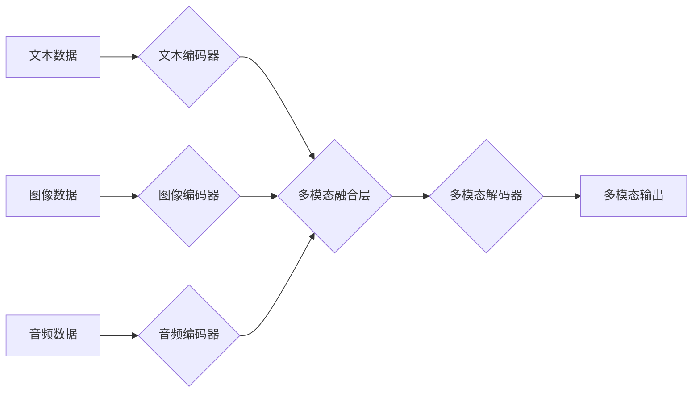

## 多模态大模型：技术原理与实战 多模态大模型的应用图谱

> 关键词：多模态大模型、自然语言处理、计算机视觉、音频处理、多模态融合、Transformer、BERT、GPT、视觉语言模型、应用场景

### 1. 背景介绍

近年来，人工智能领域取得了令人瞩目的进展，其中大模型技术作为重要驱动力，在自然语言处理、计算机视觉等领域展现出强大的能力。然而，单模态模型局限于处理单一类型数据，无法充分利用不同模态之间的丰富信息。多模态大模型应运而生，旨在融合文本、图像、音频等多种模态数据，构建更全面、更智能的认知模型。

多模态大模型的出现，标志着人工智能迈向更智能、更接近人类认知的阶段。它能够理解和生成多种模态数据，并进行跨模态推理和理解，为我们提供更丰富的交互体验和更智能化的服务。

### 2. 核心概念与联系

多模态大模型的核心概念是融合不同模态数据，构建一个能够理解和生成多种模态信息的统一模型。

**2.1 多模态数据**

多模态数据是指包含多种不同类型数据的集合，例如文本、图像、音频、视频等。

**2.2 多模态融合**

多模态融合是指将不同模态数据进行有效结合，提取其潜在的关联性和互补性，从而获得更丰富的语义信息。

**2.3 多模态大模型架构**

多模态大模型通常采用以下几种架构：

* **独立模型融合:** 每个模态数据分别使用独立的模型进行处理，然后将结果进行融合。
* **共享表示学习:** 使用共享的编码器将不同模态数据映射到同一个语义空间，然后进行融合。
* **跨模态注意力机制:** 使用注意力机制学习不同模态数据之间的关系，并根据关系进行融合。

**2.4 Mermaid 流程图**



### 3. 核心算法原理 & 具体操作步骤

**3.1 算法原理概述**

多模态大模型的核心算法原理是基于深度学习，主要包括以下几个方面：

* **多模态数据预处理:** 将不同模态数据进行格式转换、特征提取等预处理，使其能够被模型理解。
* **多模态特征编码:** 使用深度神经网络将不同模态数据编码成特征向量，并学习不同模态之间的关系。
* **多模态融合:** 将不同模态的特征向量进行融合，形成一个综合的表示。
* **多模态解码:** 使用解码器将融合后的特征向量解码成最终的输出，例如文本、图像、音频等。

**3.2 算法步骤详解**

1. **数据收集和预处理:** 收集包含多种模态数据的样本，并进行预处理，例如文本分词、图像裁剪、音频降噪等。
2. **模型架构设计:** 根据任务需求设计多模态大模型的架构，选择合适的编码器、融合层和解码器。
3. **模型训练:** 使用训练数据训练模型，优化模型参数，使其能够准确地处理多模态数据。
4. **模型评估:** 使用测试数据评估模型的性能，例如准确率、召回率、F1-score等。
5. **模型部署:** 将训练好的模型部署到实际应用场景中，例如图像字幕生成、视频问答、多模态搜索等。

**3.3 算法优缺点**

**优点:**

* 能够处理多种模态数据，获得更丰富的语义信息。
* 能够进行跨模态推理和理解，提升模型的智能化水平。
* 能够应用于更广泛的场景，例如图像字幕生成、视频问答、多模态搜索等。

**缺点:**

* 数据收集和预处理难度较大。
* 模型训练成本较高，需要大量的计算资源。
* 模型解释性较差，难以理解模型的决策过程。

**3.4 算法应用领域**

多模态大模型在以下领域具有广泛的应用前景：

* **自然语言处理:** 图像字幕生成、视频问答、文本摘要、机器翻译等。
* **计算机视觉:** 图像分类、目标检测、图像分割、场景理解等。
* **音频处理:** 语音识别、语音合成、音乐生成、情感分析等。
* **人机交互:** 多模态对话系统、虚拟助手、增强现实等。
* **医疗健康:** 病理图像诊断、疾病预测、药物研发等。

### 4. 数学模型和公式 & 详细讲解 & 举例说明

**4.1 数学模型构建**

多模态大模型的数学模型通常基于深度学习框架，例如TensorFlow或PyTorch。模型的输入是不同模态的数据，输出是融合后的多模态表示或最终的预测结果。

**4.2 公式推导过程**

多模态大模型的公式推导过程涉及到深度学习中的各种概念，例如卷积神经网络、循环神经网络、注意力机制等。具体推导过程根据模型架构和任务需求而有所不同。

**4.3 案例分析与讲解**

例如，在图像字幕生成任务中，多模态大模型通常使用以下公式：

* **图像编码:** 使用卷积神经网络对图像进行编码，得到图像特征向量。
* **文本解码:** 使用循环神经网络对图像特征向量进行解码，生成文本字幕。

**4.3.1 图像编码公式:**

$$
h_i = f(x_i, W_c)
$$

其中，$h_i$ 是图像特征向量，$x_i$ 是图像像素值，$W_c$ 是卷积核参数。

**4.3.2 文本解码公式:**

$$
y_t = g(h, s_t, W_d)
$$

其中，$y_t$ 是生成的文本单词，$h$ 是图像特征向量，$s_t$ 是隐藏状态向量，$W_d$ 是解码器参数。

### 5. 项目实践：代码实例和详细解释说明

**5.1 开发环境搭建**

使用Python语言开发多模态大模型，需要安装以下软件包：

* TensorFlow或PyTorch深度学习框架
* NumPy数值计算库
* Matplotlib数据可视化库
* OpenCV图像处理库
* Librosa音频处理库

**5.2 源代码详细实现**

以下是一个简单的多模态大模型代码示例，使用TensorFlow框架实现文本和图像的融合：

```python
import tensorflow as tf

# 定义文本编码器
text_encoder = tf.keras.Sequential([
    tf.keras.layers.Embedding(input_dim=10000, output_dim=128),
    tf.keras.layers.LSTM(units=64)
])

# 定义图像编码器
image_encoder = tf.keras.Sequential([
    tf.keras.layers.Conv2D(filters=32, kernel_size=(3, 3), activation='relu'),
    tf.keras.layers.MaxPooling2D(pool_size=(2, 2)),
    tf.keras.layers.Flatten()
])

# 定义多模态融合层
fusion_layer = tf.keras.layers.Concatenate()

# 定义多模态解码器
decoder = tf.keras.Sequential([
    tf.keras.layers.Dense(units=128, activation='relu'),
    tf.keras.layers.Dense(units=10000, activation='softmax')
])

# 定义多模态模型
model = tf.keras.Model(inputs=[text_input, image_input], outputs=decoder(fusion_layer([text_encoder(text_input), image_encoder(image_input)])))

# 编译模型
model.compile(optimizer='adam', loss='categorical_crossentropy', metrics=['accuracy'])

# 训练模型
model.fit(x=[text_data, image_data], y=label_data, epochs=10)
```

**5.3 代码解读与分析**

代码示例展示了使用TensorFlow框架构建一个简单的多模态大模型的基本流程。

* 文本编码器和图像编码器分别使用LSTM和卷积神经网络对文本和图像数据进行编码。
* 多模态融合层将编码后的文本和图像特征向量进行拼接。
* 多模态解码器使用全连接层对融合后的特征向量进行解码，生成最终的输出。

**5.4 运行结果展示**

训练完成后，可以使用测试数据评估模型的性能，例如计算准确率、召回率等指标。

### 6. 实际应用场景

**6.1 图像字幕生成**

多模态大模型可以自动生成图像的文字描述，例如为盲人生成图像描述，为搜索引擎提供图像标签等。

**6.2 视频问答**

多模态大模型可以理解视频内容，并回答与视频相关的问答，例如为视频提供自动字幕，为视频搜索提供更精准的结果等。

**6.3 多模态搜索**

多模态大模型可以根据文本、图像、音频等多种模态数据进行搜索，例如根据图像搜索相关的文本信息，根据语音搜索相关的视频信息等。

**6.4 未来应用展望**

随着多模态大模型技术的不断发展，其应用场景将更加广泛，例如：

* **智能教育:** 提供个性化学习体验，例如根据学生的学习情况生成个性化的学习内容。
* **医疗诊断:** 辅助医生进行疾病诊断，例如根据病人的影像数据和症状进行诊断。
* **虚拟助手:** 提供更智能化的交互体验，例如能够理解用户的语音和图像指令。

### 7. 工具和资源推荐

**7.1 学习资源推荐**

* **书籍:**

    * 《深度学习》 by Ian Goodfellow, Yoshua Bengio, Aaron Courville
    * 《自然语言处理》 by Dan Jurafsky, James H. Martin

* **在线课程:**

    * Coursera: Deep Learning Specialization
    * Udacity: Artificial Intelligence Nanodegree

**7.2 开发工具推荐**

* **TensorFlow:** https://www.tensorflow.org/
* **PyTorch:** https://pytorch.org/
* **Hugging Face Transformers:** https://huggingface.co/transformers/

**7.3 相关论文推荐**

* **BERT:** Devlin, J., Chang, M. W., Lee, K., & Toutanova, K. (2018). BERT: Pre-training of deep bidirectional transformers for language understanding. arXiv preprint arXiv:1810.04805.
* **GPT:** Radford, A., Wu, J., Child, R., Luan, D., Amodei, D., & Sutskever, I. (2019). Language models are few-shot learners. OpenAI blog.
* **Vision Transformer (ViT):** Dosovitskiy, A., Beyer, L., Kolesnikov, A., Weissenborn, D., Houlsby, N., Elsen, J.,... & Fischer, A. (2020). An image is worth 16x16 words: Transformers for image recognition at scale. arXiv preprint arXiv:2010.11929.

### 8. 总结：未来发展趋势与挑战

**8.1 研究成果总结**

近年来，多模态大模型取得了显著进展，在图像字幕生成、视频问答、多模态搜索等领域取得了令人瞩目的成果。

**8.2 未来发展趋势**

* **模型规模和能力提升:** 未来多模态大模型将朝着更大规模、更强大的方向发展，能够处理更复杂的多模态数据，并进行更深入的理解和推理。
* **跨模态知识表示学习:** 研究更有效的