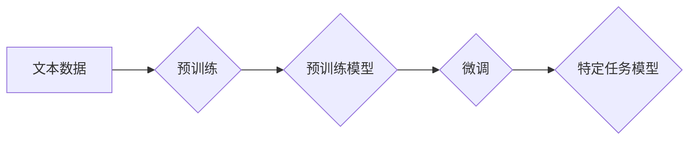

## 大语言模型原理与工程实践：手把手教你训练 7B 大语言模型 动手预训练实践

> 关键词：大语言模型、Transformer、预训练、微调、7B 参数模型、深度学习、自然语言处理

### 1. 背景介绍

近年来，深度学习在自然语言处理 (NLP) 领域取得了突破性进展，大语言模型 (LLM) 作为其重要代表，展现出强大的文本生成、理解和翻译能力。这些模型通常拥有数十亿甚至千亿参数，通过海量文本数据进行预训练，能够学习到丰富的语言知识和模式。

本文将深入探讨大语言模型的原理和工程实践，以训练一个 7B 参数的 LLMs 为例，详细介绍模型架构、训练算法、数学模型以及代码实现等关键环节。通过实践操作，读者将能够更好地理解 LLMs 的工作机制，并掌握训练和应用这些模型的技能。

### 2. 核心概念与联系

大语言模型的核心概念包括 Transformer、预训练和微调。

**2.1 Transformer**

Transformer 是一种基于注意力机制的深度神经网络架构，是 LLMs 的基础。它能够有效地捕捉文本序列中的长距离依赖关系，并实现并行计算，从而大幅提升训练效率。

**2.2 预训练**

预训练是指在大量无标注文本数据上训练模型，使其学习到语言的通用知识和模式。预训练模型可以作为下游任务的初始模型，通过微调的方式快速适应特定任务。

**2.3 微调**

微调是指在预训练模型的基础上，使用少量标注数据进行进一步训练，使其能够更好地完成特定任务。

**2.4 Mermaid 流程图**



### 3. 核心算法原理 & 具体操作步骤

**3.1 算法原理概述**

LLMs 的训练主要基于 Transformer 架构和自监督学习算法。

* **Transformer 架构:** Transformer 由编码器和解码器组成，编码器用于将输入文本序列编码为隐藏表示，解码器则根据编码结果生成输出文本序列。

* **自监督学习:** 自监督学习是指利用无标注数据训练模型，通过设计特定的预测任务，例如 masked language modeling (MLM) 和 next sentence prediction (NSP)，让模型学习语言的结构和语义关系。

**3.2 算法步骤详解**

1. **数据预处理:** 将文本数据清洗、分词、标记等预处理操作。
2. **模型构建:** 根据 Transformer 架构搭建模型，并设置模型参数。
3. **预训练:** 使用海量文本数据进行预训练，训练模型学习语言知识和模式。
4. **微调:** 使用特定任务的标注数据对预训练模型进行微调，使其能够完成特定任务。
5. **评估:** 使用测试数据评估模型的性能，并根据结果进行模型调优。

**3.3 算法优缺点**

* **优点:**

    * 能够学习到丰富的语言知识和模式。
    * 具有强大的文本生成、理解和翻译能力。
    * 可以通过微调适应不同的下游任务。

* **缺点:**

    * 训练成本高，需要大量的计算资源和数据。
    * 模型参数量大，部署和推理成本较高。
    * 容易受到训练数据偏差的影响。

**3.4 算法应用领域**

* 文本生成：小说、诗歌、对话等。
* 文本理解：问答、文本摘要、情感分析等。
* 机器翻译：将一种语言翻译成另一种语言。
* 代码生成：自动生成代码。

### 4. 数学模型和公式 & 详细讲解 & 举例说明

**4.1 数学模型构建**

LLMs 通常使用 Transformer 架构，其核心是注意力机制。注意力机制允许模型关注输入序列中与当前输出相关的部分，从而更好地捕捉长距离依赖关系。

**4.2 公式推导过程**

注意力机制的计算公式如下：

$$
Attention(Q, K, V) = softmax(\frac{QK^T}{\sqrt{d_k}})V
$$

其中：

* $Q$：查询矩阵
* $K$：键矩阵
* $V$：值矩阵
* $d_k$：键向量的维度
* $softmax$：softmax 函数

**4.3 案例分析与讲解**

假设我们有一个句子 "The cat sat on the mat"，想要预测 "on" 的下一个词。

* $Q$：表示 "on" 的词向量
* $K$：表示所有词的词向量
* $V$：表示所有词的词向量

注意力机制会计算 $Q$ 和 $K$ 之间的相似度，并根据相似度赋予每个词不同的权重。然后，将这些权重与 $V$ 相乘，得到一个新的向量，表示 "on" 的上下文信息。

### 5. 项目实践：代码实例和详细解释说明

**5.1 开发环境搭建**

* Python 3.7+
* PyTorch 1.7+
* CUDA 10.2+

**5.2 源代码详细实现**

```python
import torch
import torch.nn as nn

class Transformer(nn.Module):
    def __init__(self, vocab_size, embedding_dim, num_heads, num_layers):
        super(Transformer, self).__init__()
        self.embedding = nn.Embedding(vocab_size, embedding_dim)
        self.transformer_layers = nn.ModuleList([
            nn.TransformerEncoderLayer(embedding_dim, num_heads)
            for _ in range(num_layers)
        ])
        self.linear = nn.Linear(embedding_dim, vocab_size)

    def forward(self, x):
        x = self.embedding(x)
        for layer in self.transformer_layers:
            x = layer(x)
        x = self.linear(x)
        return x
```

**5.3 代码解读与分析**

* `__init__` 方法：初始化模型参数，包括词嵌入层、Transformer encoder 层和输出层。
* `forward` 方法：定义模型的正向传播过程，将输入序列编码为隐藏表示，并输出预测结果。

**5.4 运行结果展示**

训练完成后，可以使用测试数据评估模型的性能，例如困惑度 (perplexity)。困惑度越低，模型的预测能力越强。

### 6. 实际应用场景

LLMs 在多个领域都有广泛的应用场景，例如：

* **聊天机器人:** 构建更自然、更智能的聊天机器人。
* **文本摘要:** 自动生成文本摘要，提高信息获取效率。
* **机器翻译:** 实现更高质量的机器翻译，打破语言障碍。
* **代码生成:** 自动生成代码，提高开发效率。

**6.4 未来应用展望**

随着 LLMs 的不断发展，其应用场景将更加广泛，例如：

* **个性化教育:** 提供个性化的学习方案和辅导。
* **医疗诊断:** 辅助医生进行疾病诊断和治疗方案制定。
* **科学研究:** 加速科学研究的进程，发现新的知识。

### 7. 工具和资源推荐

**7.1 学习资源推荐**

* **论文:** "Attention Is All You Need"
* **博客:** Jay Alammar's Blog
* **课程:** Stanford CS224N

**7.2 开发工具推荐**

* **PyTorch:** 深度学习框架
* **Hugging Face Transformers:** 预训练模型库
* **TensorBoard:** 模型可视化工具

**7.3 相关论文推荐**

* "BERT: Pre-training of Deep Bidirectional Transformers for Language Understanding"
* "GPT-3: Language Models are Few-Shot Learners"
* "T5: Text-to-Text Transfer Transformer"

### 8. 总结：未来发展趋势与挑战

**8.1 研究成果总结**

近年来，LLMs 取得了显著进展，在文本生成、理解和翻译等任务上表现出色。

**8.2 未来发展趋势**

* 模型规模进一步扩大，参数量达到千亿甚至万亿级别。
* 训练效率提升，探索新的训练方法和硬件架构。
* 模型泛化能力增强，能够适应更多不同的任务和领域。

**8.3 面临的挑战**

* 训练成本高昂，需要大量的计算资源和数据。
* 模型参数量大，部署和推理成本较高。
* 容易受到训练数据偏差的影响，导致模型存在偏见和错误。

**8.4 研究展望**

未来研究将重点关注以下几个方面：

* 降低训练成本，探索更有效的训练方法和硬件架构。
* 提升模型泛化能力，使其能够适应更多不同的任务和领域。
* 解决模型偏见和错误问题，提高模型的可靠性和安全性。

### 9. 附录：常见问题与解答

* **Q: 如何选择合适的预训练模型？**

* **A:** 选择预训练模型时，需要考虑模型规模、训练数据、任务类型等因素。

* **Q: 如何进行模型微调？**

* **A:** 模型微调需要使用特定任务的标注数据，调整模型参数，使其能够更好地完成特定任务。

* **Q: 如何评估模型性能？**

* **A:** 模型性能可以使用困惑度 (perplexity)、准确率 (accuracy)、F1-score 等指标进行评估。


作者：禅与计算机程序设计艺术 / Zen and the Art of Computer Programming 
