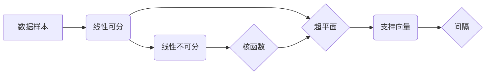

## 支持向量机 原理与代码实例讲解

> 关键词：支持向量机、SVM、机器学习、分类、回归、核函数、线性可分、线性不可分

## 1. 背景介绍

在机器学习领域，分类问题占据着重要地位。支持向量机（Support Vector Machine，SVM）作为一种强大的分类算法，凭借其良好的泛化能力和高效的训练方法，在图像识别、文本分类、手写识别等领域得到了广泛应用。

SVM的基本思想是寻找一个最佳的分隔超平面，将数据样本划分为不同的类别。这个超平面应该尽可能地远离两类样本，从而提高模型的泛化能力。

## 2. 核心概念与联系

**2.1  核心概念**

* **超平面:** 在n维空间中，一个n-1维的平面称为超平面。
* **支持向量:** 距离超平面最近的样本点称为支持向量。
* **间隔:** 超平面到最近支持向量的距离称为间隔。
* **核函数:** 用于将低维数据映射到高维空间，以便在高维空间中找到线性可分超平面。

**2.2  联系图**



**2.3  核心原理**

SVM的核心原理是找到一个最大间隔的超平面，将数据样本划分为不同的类别。

* **线性可分:** 当数据样本线性可分时，SVM可以找到一个完美的超平面将两类样本完全分开。
* **线性不可分:** 当数据样本线性不可分时，SVM可以使用核函数将数据映射到高维空间，从而找到一个线性可分的超平面。

## 3. 核心算法原理 & 具体操作步骤

**3.1  算法原理概述**

SVM的训练过程可以看作是一个优化问题，目标是找到一个最大间隔的超平面。

**3.2  算法步骤详解**

1. **数据预处理:** 对数据进行清洗、归一化等预处理操作。
2. **选择核函数:** 根据数据的特性选择合适的核函数。
3. **训练模型:** 使用SMO算法或其他优化算法训练模型，找到最佳的超平面参数。
4. **预测分类:** 将新的数据样本映射到超平面上，根据超平面的位置进行分类。

**3.3  算法优缺点**

**优点:**

* 泛化能力强
* 对非线性数据适用性好
* 训练速度相对较快

**缺点:**

* 对高维数据容易过拟合
* 参数选择较为复杂
* 训练过程可能比较耗时

**3.4  算法应用领域**

* 图像识别
* 文本分类
* 手写识别
* 生物信息学
* 预测分析

## 4. 数学模型和公式 & 详细讲解 & 举例说明

**4.1  数学模型构建**

假设我们有数据集 D = {(x1, y1), (x2, y2),..., (xn, yn)}，其中 xi ∈ R^n 是样本特征向量，yi ∈ {-1, 1} 是样本类别标签。

SVM的目标是找到一个超平面 w^T x + b = 0，将数据样本划分为不同的类别。

**4.2  公式推导过程**

* **间隔:** 超平面到最近支持向量的距离称为间隔，可以表示为：

$$
\gamma = \frac{2}{||w||}
$$

* **优化目标:** SVM的目标是最大化间隔，即最小化 ||w||，同时满足所有样本点都位于超平面的正确一侧。

$$
\min_{w,b} \frac{1}{2} ||w||^2
$$

$$
s.t. y_i (w^T x_i + b) \geq 1, i = 1, 2,..., n
$$

* **拉格朗日乘子法:** 使用拉格朗日乘子法将约束优化问题转化为无约束优化问题。

$$
L(w, b, \alpha) = \frac{1}{2} ||w||^2 - \sum_{i=1}^{n} \alpha_i [y_i (w^T x_i + b) - 1]
$$

* **对偶问题:** 求解拉格朗日函数的极小极大问题，得到对偶问题。

$$
\max_{\alpha} \sum_{i=1}^{n} \alpha_i - \frac{1}{2} \sum_{i,j=1}^{n} \alpha_i \alpha_j y_i y_j x_i^T x_j
$$

$$
s.t. \alpha_i \geq 0, i = 1, 2,..., n
$$

$$
\sum_{i=1}^{n} \alpha_i y_i = 0
$$

**4.3  案例分析与讲解**

假设我们有一个二分类问题，数据样本如下：

```
x1 = [1, 2], y1 = 1
x2 = [2, 1], y2 = 1
x3 = [0, 0], y3 = -1
x4 = [1, -1], y4 = -1
```

我们可以使用SVM算法进行训练，找到最佳的超平面参数。

## 5. 项目实践：代码实例和详细解释说明

**5.1  开发环境搭建**

* Python 3.x
* scikit-learn 库

**5.2  源代码详细实现**

```python
from sklearn import svm
from sklearn.datasets import make_classification
from sklearn.model_selection import train_test_split
from sklearn.metrics import accuracy_score

# 生成样本数据
X, y = make_classification(n_samples=100, n_features=2, random_state=42)

# 将数据划分为训练集和测试集
X_train, X_test, y_train, y_test = train_test_split(X, y, test_size=0.2, random_state=42)

# 创建SVM分类器
clf = svm.SVC(kernel='linear')

# 训练模型
clf.fit(X_train, y_train)

# 对测试集进行预测
y_pred = clf.predict(X_test)

# 计算准确率
accuracy = accuracy_score(y_test, y_pred)
print(f"准确率: {accuracy}")
```

**5.3  代码解读与分析**

* `make_classification()` 函数生成随机分类数据。
* `train_test_split()` 函数将数据划分为训练集和测试集。
* `svm.SVC()` 函数创建SVM分类器，`kernel='linear'` 指定使用线性核函数。
* `fit()` 函数训练模型。
* `predict()` 函数对测试集进行预测。
* `accuracy_score()` 函数计算准确率。

**5.4  运行结果展示**

运行代码后，会输出测试集的准确率。

## 6. 实际应用场景

SVM在许多实际应用场景中都取得了很好的效果，例如：

* **图像识别:** SVM可以用于识别图像中的物体、人脸、场景等。
* **文本分类:** SVM可以用于分类文本邮件、新闻文章、社交媒体帖子等。
* **手写识别:** SVM可以用于识别手写数字、字母、符号等。
* **生物信息学:** SVM可以用于预测蛋白质结构、基因功能等。
* **预测分析:** SVM可以用于预测股票价格、客户流失率等。

**6.4  未来应用展望**

随着机器学习技术的不断发展，SVM在未来将有更广泛的应用前景。例如，可以结合深度学习技术，提高SVM的性能；可以应用于更复杂的数据分析任务，例如自然语言处理、计算机视觉等。

## 7. 工具和资源推荐

**7.1  学习资源推荐**

* **书籍:**
    * 《The Elements of Statistical Learning》
    * 《Support Vector Machines》
* **在线课程:**
    * Coursera: Machine Learning
    * edX: Introduction to Machine Learning

**7.2  开发工具推荐**

* **Python:** 
    * scikit-learn
    * TensorFlow
    * PyTorch

**7.3  相关论文推荐**

* 《A Tutorial on Support Vector Machines for Pattern Recognition》
* 《Support Vector Machines》

## 8. 总结：未来发展趋势与挑战

**8.1  研究成果总结**

SVM是一种强大的分类算法，在许多领域取得了成功应用。其核心思想是寻找最大间隔的超平面，将数据样本划分为不同的类别。

**8.2  未来发展趋势**

* 与深度学习技术的结合
* 针对大规模数据和高维数据的优化
* 更加高效的训练算法

**8.3  面临的挑战**

* 参数选择复杂
* 对高维数据容易过拟合
* 训练过程可能比较耗时

**8.4  研究展望**

未来研究方向包括：

* 开发更加高效的SVM算法
* 探索新的核函数
* 将SVM应用于更复杂的数据分析任务

## 9. 附录：常见问题与解答

* **什么是核函数？**

核函数是一种将低维数据映射到高维空间的函数，用于解决线性不可分问题。

* **如何选择合适的核函数？**

核函数的选择取决于数据的特性。常用的核函数包括线性核函数、多项式核函数、径向基函数核函数等。

* **SVM的训练过程为什么比较耗时？**

SVM的训练过程需要求解一个凸二次规划问题，对于大规模数据，求解过程可能比较耗时。


作者：禅与计算机程序设计艺术 / Zen and the Art of Computer Programming 
